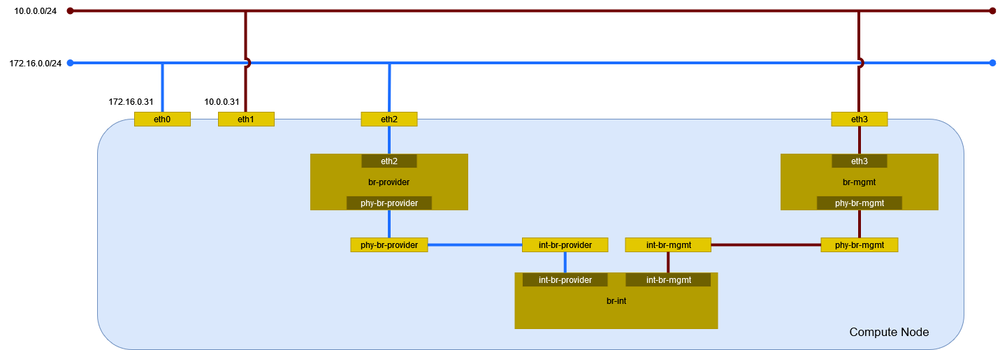

# 動作確認 (Open vSwitch)

Controller Node でエージェントを表示する。

```sh
openstack network agent list
```

```
+--------------------------------------+--------------------+-----------------------+-------------------+-------+-------+---------------------------+
| ID                                   | Agent Type         | Host                  | Availability Zone | Alive | State | Binary                    |
+--------------------------------------+--------------------+-----------------------+-------------------+-------+-------+---------------------------+
| 145d9d73-cb1c-4bbf-ad28-adb1a9f4a826 | Metadata agent     | controller.home.local | None              | :-)   | UP    | neutron-metadata-agent    |
| 20918645-7ee8-429c-a9ff-ba942695e4a4 | Open vSwitch agent | compute.home.local    | None              | :-)   | UP    | neutron-openvswitch-agent |
| 5bb635cd-1e42-48fa-b2be-c5d0dce3fef4 | Open vSwitch agent | controller.home.local | None              | :-)   | UP    | neutron-openvswitch-agent |
| e843c356-67a9-418e-96db-3fa6e4210df9 | DHCP agent         | controller.home.local | nova              | :-)   | UP    | neutron-dhcp-agent        |
+--------------------------------------+--------------------+-----------------------+-------------------+-------+-------+---------------------------+
```

## 環境の確認

ネットワークの構成を確認する。



### デバイス

デバイスを確認する。

```sh
ip -d link show
```

```
1: lo: <LOOPBACK,UP,LOWER_UP> mtu 65536 qdisc noqueue state UNKNOWN mode DEFAULT group default qlen 1000
    link/loopback 00:00:00:00:00:00 brd 00:00:00:00:00:00 promiscuity 0 minmtu 0 maxmtu 0 addrgenmode eui64 numtxqueues 1 numrxqueues 1 gso_max_size 65536 gso_max_segs 65535
2: eth0: <BROADCAST,MULTICAST,UP,LOWER_UP> mtu 1500 qdisc mq master ovs-system state UP mode DEFAULT group default qlen 1000
    link/ether 00:15:5d:bf:ba:42 brd ff:ff:ff:ff:ff:ff promiscuity 1 minmtu 68 maxmtu 65521
    openvswitch_slave addrgenmode none numtxqueues 64 numrxqueues 64 gso_max_size 62780 gso_max_segs 65535 parentbus vmbus parentdev 0b1c4460-b972-4e3e-8976-e4dac2e5b799
3: eth1: <BROADCAST,MULTICAST,UP,LOWER_UP> mtu 1500 qdisc mq state UP mode DEFAULT group default qlen 1000
    link/ether 00:15:5d:bf:ba:46 brd ff:ff:ff:ff:ff:ff promiscuity 0 minmtu 68 maxmtu 65521 addrgenmode eui64 numtxqueues 64 numrxqueues 64 gso_max_size 62780 gso_max_segs 65535 parentbus vmbus parentdev 97ecc413-a192-4d83-b344-02846e18823d
4: ovs-system: <BROADCAST,MULTICAST> mtu 1500 qdisc noop state DOWN mode DEFAULT group default qlen 1000
    link/ether 82:9c:4b:49:82:73 brd ff:ff:ff:ff:ff:ff promiscuity 1 minmtu 68 maxmtu 65535
    openvswitch addrgenmode eui64 numtxqueues 1 numrxqueues 1 gso_max_size 65536 gso_max_segs 65535
5: br-int: <BROADCAST,MULTICAST,UP,LOWER_UP> mtu 1500 qdisc noqueue state UNKNOWN mode DEFAULT group default qlen 1000
    link/ether d6:8b:38:95:ac:45 brd ff:ff:ff:ff:ff:ff promiscuity 1 minmtu 68 maxmtu 65535
    openvswitch addrgenmode none numtxqueues 1 numrxqueues 1 gso_max_size 65536 gso_max_segs 65535
6: br-provider: <BROADCAST,MULTICAST,UP,LOWER_UP> mtu 1500 qdisc noqueue state UNKNOWN mode DEFAULT group default qlen 1000
    link/ether 00:15:5d:bf:ba:42 brd ff:ff:ff:ff:ff:ff promiscuity 1 minmtu 68 maxmtu 65535
    openvswitch addrgenmode none numtxqueues 1 numrxqueues 1 gso_max_size 65536 gso_max_segs 65535
```

### ブリッジ

Open vSwitch の構成を確認する。

```sh
ovs-vsctl show
```

```
9ab7209e-d2af-4403-9ddb-416bc283b632
    Manager "ptcp:6640:127.0.0.1"
        is_connected: true
    Bridge br-provider
        Controller "tcp:127.0.0.1:6633"
            is_connected: true
        fail_mode: secure
        datapath_type: system
        Port br-provider
            Interface br-provider
                type: internal
        Port phy-br-provider
            Interface phy-br-provider
                type: patch
                options: {peer=int-br-provider}
        Port eth0
            Interface eth0
                type: system
    Bridge br-int
        Controller "tcp:127.0.0.1:6633"
            is_connected: true
        fail_mode: secure
        datapath_type: system
        Port int-br-provider
            Interface int-br-provider
                type: patch
                options: {peer=phy-br-provider}
        Port br-int
            Interface br-int
                type: internal
    ovs_version: "3.1.4"
```
