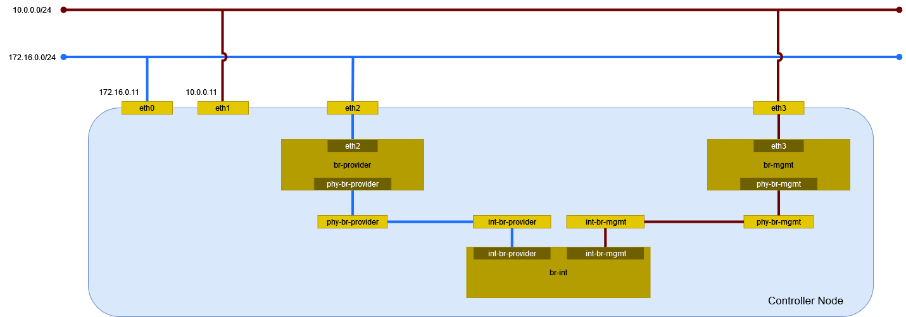

# 動作確認 (Open vSwitch)

エージェントを表示する。

```sh
openstack network agent list
```

```
+--------------------------------------+--------------------+-----------------------+-------------------+-------+-------+---------------------------+
| ID                                   | Agent Type         | Host                  | Availability Zone | Alive | State | Binary                    |
+--------------------------------------+--------------------+-----------------------+-------------------+-------+-------+---------------------------+
| 1fbd5909-3c41-4356-a042-24dc5befc8a0 | DHCP agent         | controller.home.local | nova              | :-)   | UP    | neutron-dhcp-agent        |
| 5368ea0a-53d6-4f3c-946b-e01467f08929 | Metadata agent     | controller.home.local | None              | :-)   | UP    | neutron-metadata-agent    |
| ec88144f-cccb-48f3-a94d-4899f4cf0743 | Open vSwitch agent | controller.home.local | None              | :-)   | UP    | neutron-openvswitch-agent |
+--------------------------------------+--------------------+-----------------------+-------------------+-------+-------+---------------------------+
```

## 環境の確認

ネットワークの構成を確認する。



### デバイス

デバイスを確認する。

```sh
ip -d link show
```

```
1: lo: <LOOPBACK,UP,LOWER_UP> mtu 65536 qdisc noqueue state UNKNOWN mode DEFAULT group default qlen 1000
    link/loopback 00:00:00:00:00:00 brd 00:00:00:00:00:00 promiscuity 0  allmulti 0 minmtu 0 maxmtu 0 addrgenmode eui64 numtxqueues 1 numrxqueues 1 gso_max_size 65536 gso_max_segs 65535 tso_max_size 524280 tso_max_segs 65535 gro_max_size 65536
2: eth0: <BROADCAST,MULTICAST,UP,LOWER_UP> mtu 1500 qdisc mq state UP mode DEFAULT group default qlen 1000
    link/ether 00:15:5d:bf:ba:4f brd ff:ff:ff:ff:ff:ff promiscuity 0  allmulti 0 minmtu 68 maxmtu 65521 addrgenmode none numtxqueues 64 numrxqueues 64 gso_max_size 62780 gso_max_segs 65535 tso_max_size 62780 tso_max_segs 65535 gro_max_size 65536 parentbus vmbus parentdev b7c073a0-7837-4a9f-94e7-eba43ef222ef
3: eth1: <BROADCAST,MULTICAST,UP,LOWER_UP> mtu 1500 qdisc mq state UP mode DEFAULT group default qlen 1000
    link/ether 00:15:5d:bf:ba:54 brd ff:ff:ff:ff:ff:ff promiscuity 0  allmulti 0 minmtu 68 maxmtu 65521 addrgenmode none numtxqueues 64 numrxqueues 64 gso_max_size 62780 gso_max_segs 65535 tso_max_size 62780 tso_max_segs 65535 gro_max_size 65536 parentbus vmbus parentdev 0f15ccb6-3ab3-45ce-b737-a73ecf5a6339
4: eth2: <BROADCAST,MULTICAST,UP,LOWER_UP> mtu 1500 qdisc mq master ovs-system state UP mode DEFAULT group default qlen 1000
    link/ether 00:15:5d:bf:ba:55 brd ff:ff:ff:ff:ff:ff promiscuity 1  allmulti 0 minmtu 68 maxmtu 65521
    openvswitch_slave addrgenmode none numtxqueues 64 numrxqueues 64 gso_max_size 62780 gso_max_segs 65535 tso_max_size 62780 tso_max_segs 65535 gro_max_size 65536 parentbus vmbus parentdev dffbd9a0-19dd-44c1-9b46-6dfba9829d73
5: eth3: <BROADCAST,MULTICAST,UP,LOWER_UP> mtu 1500 qdisc mq master ovs-system state UP mode DEFAULT group default qlen 1000
    link/ether 00:15:5d:bf:ba:56 brd ff:ff:ff:ff:ff:ff promiscuity 1  allmulti 0 minmtu 68 maxmtu 65521
    openvswitch_slave addrgenmode none numtxqueues 64 numrxqueues 64 gso_max_size 62780 gso_max_segs 65535 tso_max_size 62780 tso_max_segs 65535 gro_max_size 65536 parentbus vmbus parentdev 31e9f926-7af1-481e-bf58-cbca38bc3cba
6: ovs-system: <BROADCAST,MULTICAST> mtu 1500 qdisc noop state DOWN mode DEFAULT group default qlen 1000
    link/ether a2:2b:ac:26:3b:91 brd ff:ff:ff:ff:ff:ff promiscuity 1  allmulti 0 minmtu 68 maxmtu 65535
    openvswitch addrgenmode eui64 numtxqueues 1 numrxqueues 1 gso_max_size 65536 gso_max_segs 65535 tso_max_size 65536 tso_max_segs 65535 gro_max_size 65536
7: br-int: <BROADCAST,MULTICAST,UP,LOWER_UP> mtu 1500 qdisc noqueue state UNKNOWN mode DEFAULT group default qlen 1000
    link/ether 4a:73:de:e4:cd:4f brd ff:ff:ff:ff:ff:ff promiscuity 1  allmulti 0 minmtu 68 maxmtu 65535
    openvswitch addrgenmode eui64 numtxqueues 1 numrxqueues 1 gso_max_size 65536 gso_max_segs 65535 tso_max_size 65536 tso_max_segs 65535 gro_max_size 65536
8: br-provider: <BROADCAST,MULTICAST,UP,LOWER_UP> mtu 1500 qdisc noqueue state UNKNOWN mode DEFAULT group default qlen 1000
    link/ether 00:15:5d:bf:ba:55 brd ff:ff:ff:ff:ff:ff promiscuity 1  allmulti 0 minmtu 68 maxmtu 65535
    openvswitch addrgenmode none numtxqueues 1 numrxqueues 1 gso_max_size 65536 gso_max_segs 65535 tso_max_size 65536 tso_max_segs 65535 gro_max_size 65536
9: br-mgmt: <BROADCAST,MULTICAST,UP,LOWER_UP> mtu 1500 qdisc noqueue state UNKNOWN mode DEFAULT group default qlen 1000
    link/ether 00:15:5d:bf:ba:56 brd ff:ff:ff:ff:ff:ff promiscuity 1  allmulti 0 minmtu 68 maxmtu 65535
    openvswitch addrgenmode none numtxqueues 1 numrxqueues 1 gso_max_size 65536 gso_max_segs 65535 tso_max_size 65536 tso_max_segs 65535 gro_max_size 65536
```

### ブリッジ

Open vSwitch の構成を確認する。

```sh
ovs-vsctl show
```

```
2a1ab795-d59f-4a33-a5a1-1fb4c942dce4
    Manager "ptcp:6640:127.0.0.1"
        is_connected: true
    Bridge br-provider
        Controller "tcp:127.0.0.1:6633"
            is_connected: true
        fail_mode: secure
        datapath_type: system
        Port phy-br-provider
            Interface phy-br-provider
                type: patch
                options: {peer=int-br-provider}
        Port eth2
            Interface eth2
                type: system
    Bridge br-mgmt
        Controller "tcp:127.0.0.1:6633"
            is_connected: true
        fail_mode: secure
        datapath_type: system
        Port phy-br-mgmt
            Interface phy-br-mgmt
                type: patch
                options: {peer=int-br-mgmt}
        Port eth3
            Interface eth3
                type: system
    Bridge br-int
        Controller "tcp:127.0.0.1:6633"
            is_connected: true
        fail_mode: secure
        datapath_type: system
        Port br-int
            Interface br-int
                type: internal
        Port int-br-provider
            Interface int-br-provider
                type: patch
                options: {peer=phy-br-provider}
        Port int-br-mgmt
            Interface int-br-mgmt
                type: patch
                options: {peer=phy-br-mgmt}
    ovs_version: "3.3.1"
```

データパスを確認する。

```sh
ovs-dpctl show
```

```
system@ovs-system:
  lookups: hit:81 missed:50 lost:0
  flows: 0
  masks: hit:184 total:0 hit/pkt:1.40
  cache: hit:42 hit-rate:32.06%
  caches:
    masks-cache: size:256
  port 0: ovs-system (internal)
  port 1: br-int (internal)
  port 2: eth3
  port 3: eth2
  port 4: br-provider (internal)
  port 5: br-mgmt (internal)
```

ブリッジ br-provider のフローのエントリを確認する。

```sh
ovs-ofctl dump-flows br-provider
```

```
 cookie=0x8d88808236b1ab5c, duration=242.026s, table=0, n_packets=0, n_bytes=0, priority=2,in_port="phy-br-provider" actions=drop
 cookie=0x8d88808236b1ab5c, duration=242.067s, table=0, n_packets=45, n_bytes=6882, priority=0 actions=NORMAL
```

ブリッジ br-mgmt のフローのエントリを確認する。

```sh
ovs-ofctl dump-flows br-mgmt
```

```
 cookie=0x42a40ac25b551bd0, duration=246.948s, table=0, n_packets=0, n_bytes=0, priority=2,in_port="phy-br-mgmt" actions=drop
 cookie=0x42a40ac25b551bd0, duration=246.969s, table=0, n_packets=54, n_bytes=7896, priority=0 actions=NORMAL
```

ブリッジ br-int のフローのエントリを確認する。

```sh
ovs-ofctl dump-flows br-int
```

```
 cookie=0x144329905c50bc53, duration=256.029s, table=0, n_packets=0, n_bytes=0, priority=65535,dl_vlan=4095 actions=drop
 cookie=0x144329905c50bc53, duration=254.919s, table=0, n_packets=45, n_bytes=6882, priority=2,in_port="int-br-provider" actions=drop
 cookie=0x144329905c50bc53, duration=253.857s, table=0, n_packets=54, n_bytes=7896, priority=2,in_port="int-br-mgmt" actions=drop
 cookie=0x144329905c50bc53, duration=256.046s, table=0, n_packets=0, n_bytes=0, priority=0 actions=resubmit(,58)
 cookie=0x144329905c50bc53, duration=256.049s, table=23, n_packets=0, n_bytes=0, priority=0 actions=drop
 cookie=0x144329905c50bc53, duration=256.033s, table=24, n_packets=0, n_bytes=0, priority=0 actions=drop
 cookie=0x144329905c50bc53, duration=256.022s, table=30, n_packets=0, n_bytes=0, priority=0 actions=resubmit(,58)
 cookie=0x144329905c50bc53, duration=256.016s, table=31, n_packets=0, n_bytes=0, priority=0 actions=resubmit(,58)
 cookie=0x144329905c50bc53, duration=256.041s, table=58, n_packets=0, n_bytes=0, priority=0 actions=resubmit(,60)
 cookie=0x144329905c50bc53, duration=256.037s, table=60, n_packets=0, n_bytes=0, priority=3 actions=NORMAL
 cookie=0x144329905c50bc53, duration=256.026s, table=62, n_packets=0, n_bytes=0, priority=3 actions=NORMAL
 cookie=0x144329905c50bc53, duration=251.160s, table=71, n_packets=0, n_bytes=0, priority=110,ct_state=+trk actions=ct_clear,resubmit(,71)
 cookie=0x144329905c50bc53, duration=251.210s, table=71, n_packets=0, n_bytes=0, priority=0 actions=drop
 cookie=0x144329905c50bc53, duration=251.199s, table=72, n_packets=0, n_bytes=0, priority=0 actions=drop
 cookie=0x144329905c50bc53, duration=251.190s, table=73, n_packets=0, n_bytes=0, priority=0 actions=drop
 cookie=0x144329905c50bc53, duration=251.180s, table=81, n_packets=0, n_bytes=0, priority=0 actions=drop
 cookie=0x144329905c50bc53, duration=251.170s, table=82, n_packets=0, n_bytes=0, priority=0 actions=drop
 cookie=0x144329905c50bc53, duration=251.141s, table=91, n_packets=0, n_bytes=0, priority=1 actions=resubmit(,94)
 cookie=0x144329905c50bc53, duration=251.123s, table=92, n_packets=0, n_bytes=0, priority=0 actions=drop
 cookie=0x144329905c50bc53, duration=251.110s, table=93, n_packets=0, n_bytes=0, priority=0 actions=drop
 cookie=0x144329905c50bc53, duration=251.150s, table=94, n_packets=0, n_bytes=0, priority=1 actions=NORMAL
```
