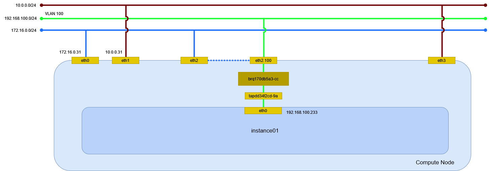

# インスタンスの作成 (vlan/Linux Bridge)

vlan ネットワーク(Linux Bridge)に接続するインスタンスを作成する。

## 前提条件

* [](../network/linuxbridge_vlan) を作成していること。
* flavor [](../flavor/m1_nano) を作成していること。
* イメージ [](../../installation/controller/glance) でイメージを作成していること。
* セキュリティグループのルール [](../security_group/icmp) を作成していること。
* セキュリティグループのルール [](../security_group/ssh) を作成していること。

## インスタンスの作成

インスタンス instance01 を作成する。

```sh
openstack server create \
    --flavor m1.nano \
    --image cirros \
    --nic net-id=6a91ceec-5aeb-4546-aa05-b2b43a0b1111 \
    --security-group default \
    --key-name mykey \
    instance01
```

```
+-----------------------------+-----------------------------------------------+
| Field                       | Value                                         |
+-----------------------------+-----------------------------------------------+
| OS-DCF:diskConfig           | MANUAL                                        |
| OS-EXT-AZ:availability_zone |                                               |
| OS-EXT-STS:power_state      | NOSTATE                                       |
| OS-EXT-STS:task_state       | scheduling                                    |
| OS-EXT-STS:vm_state         | building                                      |
| OS-SRV-USG:launched_at      | None                                          |
| OS-SRV-USG:terminated_at    | None                                          |
| accessIPv4                  |                                               |
| accessIPv6                  |                                               |
| addresses                   |                                               |
| adminPass                   | MT4KHecuJfRy                                  |
| config_drive                |                                               |
| created                     | 2024-04-15T11:45:34Z                          |
| flavor                      | m1.nano (0)                                   |
| hostId                      |                                               |
| id                          | 4bb09120-eb28-4276-ba79-2684c5c2fc36          |
| image                       | cirros (e83903c4-7fa8-42a7-b693-f5034bc33603) |
| key_name                    | mykey                                         |
| name                        | instance01                                    |
| progress                    | 0                                             |
| project_id                  | f2aeffb34ff34ffb8959f1cd813655c6              |
| properties                  |                                               |
| security_groups             | name='87fd4685-d317-42fb-a487-28382d2c2750'   |
| status                      | BUILD                                         |
| updated                     | 2024-04-15T11:45:34Z                          |
| user_id                     | 71b5948c75f24c0f841dbf1c4eb4c4a7              |
| volumes_attached            |                                               |
+-----------------------------+-----------------------------------------------+
```

## インスタンスの確認

インスタンスが ACTIVE になったことを確認する。

```sh
openstack server list
```

```
+--------------------------------------+------------+---------+------------------------------+--------+---------+
| ID                                   | Name       | Status  | Networks                     | Image  | Flavor  |
+--------------------------------------+------------+---------+------------------------------+--------+---------+
| 4bb09120-eb28-4276-ba79-2684c5c2fc36 | instance01 | ACTIVE  | provider-100=192.168.100.224 | cirros | m1.nano |
+--------------------------------------+------------+---------+------------------------------+--------+---------+
```

## 環境の確認

### dnsmasq

DHCP で IP アドレスが払い出されている。

```sh
cat /var/lib/neutron/dhcp/6a91ceec-5aeb-4546-aa05-b2b43a0b1111/leases
```

```
1713267978 fa:16:3e:f3:b0:30 192.168.100.224 host-192-168-100-224 01:fa:16:3e:f3:b0:30
```

DHCP に MAC アドレスと IP アドレスの関連が追加される。

```sh
cat /var/lib/neutron/dhcp/6a91ceec-5aeb-4546-aa05-b2b43a0b1111/host
```

```
fa:16:3e:f3:b0:30,host-192-168-100-224.openstacklocal,192.168.100.224
```

DNS のエントリが追加される。

```sh
cat /var/lib/neutron/dhcp/6a91ceec-5aeb-4546-aa05-b2b43a0b1111/addn_hosts
```

```
192.168.100.224 host-192-168-100-224.openstacklocal host-192-168-100-224
```

### インスタンス

Compute Node で確認する。

```sh
virsh list
```

```
 Id   名前                状態
----------------------------------
 1    instance-0000000d   実行中
```

ネットワークインターフェイスの設定を確認する。

```sh
virsh dumpxml 1 | sed -n -e '/<interface/,/<\/interface>/ { p }'
```

```xml
<interface type='bridge'>
  <mac address='fa:16:3e:f3:b0:30'/>
  <source bridge='brq6a91ceec-5a'/>
  <target dev='tapdd1db2aa-92'/>
  <model type='virtio'/>
  <driver name='qemu'/>
  <mtu size='1500'/>
  <alias name='net0'/>
  <address type='pci' domain='0x0000' bus='0x00' slot='0x03' function='0x0'/>
</interface>
```

### ネットワーク

Compute Node でネットワーク構成を確認する。



#### ネットワーク名前空間

ネットワーク名前空間は作成されない。

#### デバイス

ブリッジと TAP デバイスが追加される。

```sh
nmcli device status
```

```
(...)

brq6a91ceec-5a  bridge    接続済み (外部)  brq6a91ceec-5a
tapdd1db2aa-92  tun       接続済み (外部)  tapdd1db2aa-92
eth0.100        vlan      接続済み (外部)  eth0.100
```

デバイスを確認する。

```sh
ip -d link show
```

```
(...)

5: brq6a91ceec-5a: <BROADCAST,MULTICAST,UP,LOWER_UP> mtu 1500 qdisc noqueue state UP mode DEFAULT group default qlen 1000
    link/ether 00:15:5d:bf:ba:42 brd ff:ff:ff:ff:ff:ff promiscuity 0 minmtu 68 maxmtu 65535
    bridge forward_delay 0 hello_time 200 max_age 2000 ageing_time 30000 stp_state 0 priority 32768 vlan_filtering 0 vlan_protocol 802.1Q bridge_id 8000.0:15:5d:bf:ba:42 designated_root 8000.0:15:5d:bf:ba:42 root_port 0 root_path_cost 0 topology_change 0 topology_change_detected 0 hello_timer    0.00 tcn_timer    0.00 topology_change_timer    0.00 gc_timer    0.00 vlan_default_pvid 1 vlan_stats_enabled 0 vlan_stats_per_port 0 group_fwd_mask 0 group_address 01:80:c2:00:00:00 mcast_snooping 0 no_linklocal_learn 0 mcast_vlan_snooping 0 mcast_router 1 mcast_query_use_ifaddr 0 mcast_querier 0 mcast_hash_elasticity 16 mcast_hash_max 4096 mcast_last_member_count 2 mcast_startup_query_count 2 mcast_last_member_interval 100 mcast_membership_interval 26000 mcast_querier_interval 25500 mcast_query_interval 12500 mcast_query_response_interval 1000 mcast_startup_query_interval 3125 mcast_stats_enabled 0 mcast_igmp_version 2 mcast_mld_version 1 nf_call_iptables 0 nf_call_ip6tables 0 nf_call_arptables 0 addrgenmode eui64 numtxqueues 1 numrxqueues 1 gso_max_size 62780 gso_max_segs 65535
6: tapdd1db2aa-92: <BROADCAST,MULTICAST,UP,LOWER_UP> mtu 1500 qdisc noqueue master brq6a91ceec-5a state UNKNOWN mode DEFAULT group default qlen 1000
    link/ether fe:16:3e:f3:b0:30 brd ff:ff:ff:ff:ff:ff promiscuity 1 minmtu 68 maxmtu 65521
    tun type tap pi off vnet_hdr on persist off
    bridge_slave state forwarding priority 32 cost 100 hairpin off guard off root_block off fastleave off learning on flood on port_id 0x8001 port_no 0x1 designated_port 32769 designated_cost 0 designated_bridge 8000.0:15:5d:bf:ba:42 designated_root 8000.0:15:5d:bf:ba:42 hold_timer    0.00 message_age_timer    0.00 forward_delay_timer    0.00 topology_change_ack 0 config_pending 0 proxy_arp off proxy_arp_wifi off mcast_router 1 mcast_fast_leave off mcast_flood on bcast_flood on mcast_to_unicast off neigh_suppress off group_fwd_mask 0 group_fwd_mask_str 0x0 vlan_tunnel off isolated off locked off addrgenmode eui64 numtxqueues 1 numrxqueues 1 gso_max_size 65536 gso_max_segs 65535
7: eth0.100@eth0: <BROADCAST,MULTICAST,UP,LOWER_UP> mtu 1500 qdisc noqueue master brq6a91ceec-5a state UP mode DEFAULT group default qlen 1000
    link/ether 00:15:5d:bf:ba:42 brd ff:ff:ff:ff:ff:ff promiscuity 1 minmtu 0 maxmtu 65535
    vlan protocol 802.1Q id 100 <REORDER_HDR>
    bridge_slave state forwarding priority 32 cost 2 hairpin off guard off root_block off fastleave off learning on flood on port_id 0x8002 port_no 0x2 designated_port 32770 designated_cost 0 designated_bridge 8000.0:15:5d:bf:ba:42 designated_root 8000.0:15:5d:bf:ba:42 hold_timer    0.00 message_age_timer    0.00 forward_delay_timer    0.00 topology_change_ack 0 config_pending 0 proxy_arp off proxy_arp_wifi off mcast_router 1 mcast_fast_leave off mcast_flood on bcast_flood on mcast_to_unicast off neigh_suppress off group_fwd_mask 0 group_fwd_mask_str 0x0 vlan_tunnel off isolated off locked off addrgenmode eui64 numtxqueues 1 numrxqueues 1 gso_max_size 62780 gso_max_segs 65535
```

ブリッジを確認する。

```sh
bridge link show
```

```
6: tapdd1db2aa-92: <BROADCAST,MULTICAST,UP,LOWER_UP> mtu 1500 master brq6a91ceec-5a state forwarding priority 32 cost 100
7: eth0.100@eth0: <BROADCAST,MULTICAST,UP,LOWER_UP> mtu 1500 master brq6a91ceec-5a state forwarding priority 32 cost 2
```

インスタンスの eth0 は TAP デバイス tapdd1db2aa-92 を経由してブリッジ brq6a91ceec-5a に接続する。
