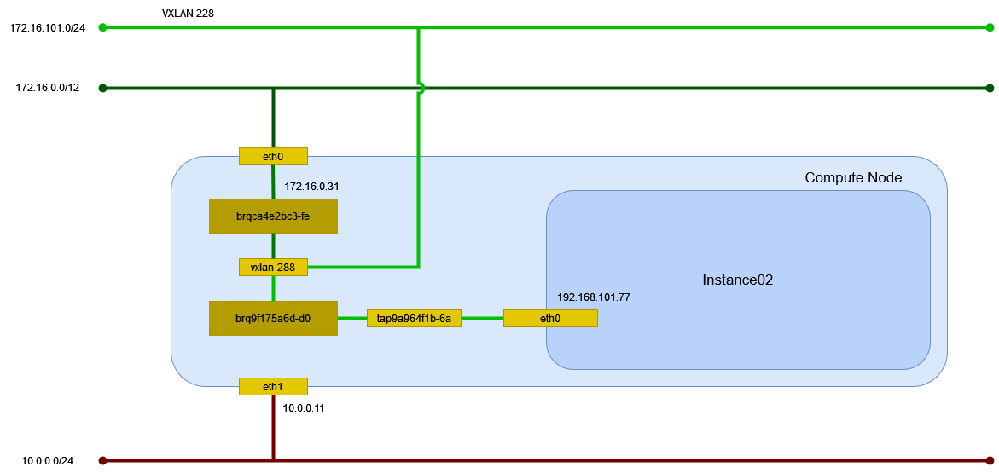

# インスタンスの作成 (vxlan/Linux Bridge)

vxlan ネットワーク(Linux Bridge)に接続するインスタンスを作成する。

## 前提条件

* [](../network/linuxbridge_vxlan) を作成していること。
* flavor [](../flavor/m1_milli) を作成していること。
* イメージ [](../../installation/controller/glance) でイメージを作成していること。
* [](../sshkey/keypair.md) を作成していること。
* セキュリティグループのルール [](../security_group/icmp) を作成していること。
* セキュリティグループのルール [](../security_group/ssh) を作成していること。

## インスタンスの作成

```{tip}
myuser で実行
```

インスタンス instance02 を作成する。

```sh
openstack server create \
    --flavor m1.milli \
    --image cirros062 \
    --nic net-id=c08e7dcd-4acb-4cd0-ad08-ebd3b48467ee \
    --security-group mysecurity \
    --key-name mykey \
    instance02
```

```text
+--------------------------------------+--------------------------------------------------+
| Field                                | Value                                            |
+--------------------------------------+--------------------------------------------------+
| OS-DCF:diskConfig                    | MANUAL                                           |
| OS-EXT-AZ:availability_zone          |                                                  |
| OS-EXT-SRV-ATTR:host                 | None                                             |
| OS-EXT-SRV-ATTR:hypervisor_hostname  | None                                             |
| OS-EXT-SRV-ATTR:instance_name        |                                                  |
| OS-EXT-STS:power_state               | NOSTATE                                          |
| OS-EXT-STS:task_state                | scheduling                                       |
| OS-EXT-STS:vm_state                  | building                                         |
| OS-SRV-USG:launched_at               | None                                             |
| OS-SRV-USG:terminated_at             | None                                             |
| accessIPv4                           |                                                  |
| accessIPv6                           |                                                  |
| addresses                            |                                                  |
| adminPass                            | Acs8x8epDfpE                                     |
| config_drive                         |                                                  |
| created                              | 2024-05-12T11:12:09Z                             |
| flavor                               | m1.milli (1)                                     |
| hostId                               |                                                  |
| id                                   | df970ec9-8410-48a6-9f04-d4621c967fce             |
| image                                | cirros062 (18b72eca-3cf5-40fb-b4fa-441938b13964) |
| key_name                             | mykey                                            |
| name                                 | instance02                                       |
| os-extended-volumes:volumes_attached | []                                               |
| progress                             | 0                                                |
| project_id                           | bccf406c045d401b91ba5c7552a124ae                 |
| properties                           |                                                  |
| security_groups                      | name='7a3d9999-6c97-42da-a755-f7c6a435049e'      |
| status                               | BUILD                                            |
| updated                              | 2024-05-12T11:12:10Z                             |
| user_id                              | 7f3acb28d26943bab9510df3a6edf3b0                 |
+--------------------------------------+--------------------------------------------------+
```

## インスタンスの確認

インスタンスが ACTIVE になったことを確認する。

```sh
openstack server list
```

```text
+--------------------------------------+------------+---------+------------------------------+-----------+----------+
| ID                                   | Name       | Status  | Networks                     | Image     | Flavor   |
+--------------------------------------+------------+---------+------------------------------+-----------+----------+
| df970ec9-8410-48a6-9f04-d4621c967fce | instance02 | ACTIVE  | selfservice=192.168.101.88   | cirros062 | m1.milli |
+--------------------------------------+------------+---------+------------------------------+-----------+----------+
```

## 環境の確認

### dnsmasq

DHCP で IP アドレスが払い出されている。

```sh
cat /var/lib/neutron/dhcp/c08e7dcd-4acb-4cd0-ad08-ebd3b48467ee/leases
```

```text
1715598764 fa:16:3e:be:71:21 192.168.101.88 host-192-168-101-88 01:fa:16:3e:be:71:21
```

DHCP に MAC アドレスと IP アドレスの関連が追加される。

```sh
cat /var/lib/neutron/dhcp/c08e7dcd-4acb-4cd0-ad08-ebd3b48467ee/host
```

```text
fa:16:3e:be:71:21,host-192-168-101-88.openstacklocal,192.168.101.88
```

DNS のエントリが追加される。

```sh
cat /var/lib/neutron/dhcp/c08e7dcd-4acb-4cd0-ad08-ebd3b48467ee/addn_hosts
```

```text
192.168.101.88  host-192-168-101-88.openstacklocal host-192-168-101-88
```

### インスタンス

Compute Node で確認する。

```sh
virsh list
```

```text
 Id   名前                状態
----------------------------------
 3    instance-0000000d   実行中
```

ネットワークインターフェイスの設定を確認する。

```sh
virsh dumpxml 3 | sed -n -e '/<interface/,/<\/interface>/ { p }'
```

```xml
<interface type='bridge'>
  <mac address='fa:16:3e:be:71:21'/>
  <source bridge='brqc08e7dcd-4a'/>
  <target dev='tap7a8c0a54-75'/>
  <model type='virtio'/>
  <driver name='qemu'/>
  <mtu size='1450'/>
  <alias name='net0'/>
  <address type='pci' domain='0x0000' bus='0x00' slot='0x03' function='0x0'/>
</interface>
```

### ネットワーク

Compute Node でネットワーク構成を確認する。



#### ネットワーク名前空間

ネットワーク名前空間は作成されない。

#### デバイス

ブリッジと TAP デバイスが追加される。

```sh
ip -d link show
```

```text
(...)

9: brqc08e7dcd-4a: <BROADCAST,MULTICAST,UP,LOWER_UP> mtu 1450 qdisc noqueue state UP mode DEFAULT group default qlen 1000
    link/ether 1e:c5:d4:be:d4:71 brd ff:ff:ff:ff:ff:ff promiscuity 0  allmulti 0 minmtu 68 maxmtu 65535
    bridge forward_delay 0 hello_time 200 max_age 2000 ageing_time 30000 stp_state 0 priority 32768 vlan_filtering 0 vlan_protocol 802.1Q bridge_id 8000.1e:c5:d4:be:d4:71 designated_root 8000.1e:c5:d4:be:d4:71 root_port 0 root_path_cost 0 topology_change 0 topology_change_detected 0 hello_timer    0.00 tcn_timer    0.00 topology_change_timer    0.00 gc_timer   82.31 vlan_default_pvid 1 vlan_stats_enabled 0 vlan_stats_per_port 0 group_fwd_mask 0 group_address 01:80:c2:00:00:00 mcast_snooping 0 no_linklocal_learn 0 mcast_vlan_snooping 0 mcast_router 1 mcast_query_use_ifaddr 0 mcast_querier 0 mcast_hash_elasticity 16 mcast_hash_max 4096 mcast_last_member_count 2 mcast_startup_query_count 2 mcast_last_member_interval 100 mcast_membership_interval 26000 mcast_querier_interval 25500 mcast_query_interval 12500 mcast_query_response_interval 1000 mcast_startup_query_interval 3125 mcast_stats_enabled 0 mcast_igmp_version 2 mcast_mld_version 1 nf_call_iptables 0 nf_call_ip6tables 0 nf_call_arptables 0 addrgenmode eui64 numtxqueues 1 numrxqueues 1 gso_max_size 62780 gso_max_segs 65535 tso_max_size 62780 tso_max_segs 65535 gro_max_size 65536
11: vxlan-267: <BROADCAST,MULTICAST,UP,LOWER_UP> mtu 1450 qdisc noqueue master brqc08e7dcd-4a state UNKNOWN mode DEFAULT group default qlen 1000
    link/ether 1e:c5:d4:be:d4:71 brd ff:ff:ff:ff:ff:ff promiscuity 1  allmulti 1 minmtu 68 maxmtu 65535
    vxlan id 267 local 172.16.0.31 dev eth0 srcport 0 0 dstport 8472 ttl auto ageing 300 udpcsum noudp6zerocsumtx noudp6zerocsumrx
    bridge_slave state forwarding priority 32 cost 2 hairpin off guard off root_block off fastleave off learning on flood on port_id 0x8002 port_no 0x2 designated_port 32770 designated_cost 0 designated_bridge 8000.1e:c5:d4:be:d4:71 designated_root 8000.1e:c5:d4:be:d4:71 hold_timer    0.00 message_age_timer    0.00 forward_delay_timer    0.00 topology_change_ack 0 config_pending 0 proxy_arp off proxy_arp_wifi off mcast_router 1 mcast_fast_leave off mcast_flood on bcast_flood on mcast_to_unicast off neigh_suppress off group_fwd_mask 0 group_fwd_mask_str 0x0 vlan_tunnel off isolated off locked off mab off addrgenmode eui64 numtxqueues 1 numrxqueues 1 gso_max_size 62780 gso_max_segs 65535 tso_max_size 62780 tso_max_segs 65535 gro_max_size 65536
13: tap7a8c0a54-75: <BROADCAST,MULTICAST,UP,LOWER_UP> mtu 1450 qdisc noqueue master brqc08e7dcd-4a state UNKNOWN mode DEFAULT group default qlen 1000
    link/ether fe:16:3e:be:71:21 brd ff:ff:ff:ff:ff:ff promiscuity 1  allmulti 1 minmtu 68 maxmtu 65521
    tun type tap pi off vnet_hdr on persist off
    bridge_slave state forwarding priority 32 cost 100 hairpin off guard off root_block off fastleave off learning on flood on port_id 0x8001 port_no 0x1 designated_port 32769 designated_cost 0 designated_bridge 8000.1e:c5:d4:be:d4:71 designated_root 8000.1e:c5:d4:be:d4:71 hold_timer    0.00 message_age_timer    0.00 forward_delay_timer    0.00 topology_change_ack 0 config_pending 0 proxy_arp off proxy_arp_wifi off mcast_router 1 mcast_fast_leave off mcast_flood on bcast_flood on mcast_to_unicast off neigh_suppress off group_fwd_mask 0 group_fwd_mask_str 0x0 vlan_tunnel off isolated off locked off mab off addrgenmode eui64 numtxqueues 1 numrxqueues 1 gso_max_size 65536 gso_max_segs 65535 tso_max_size 65536 tso_max_segs 65535 gro_max_size 65536
```

### セキュリティグループ

セキュリティグループのルールは iptables のテーブル(neutron-linuxbri-i7a8c0a54-7)に設定される。

```sh
iptables -L
```

```text
Chain INPUT (policy ACCEPT)
target     prot opt source               destination
neutron-linuxbri-INPUT  all  --  anywhere             anywhere

Chain FORWARD (policy ACCEPT)
target     prot opt source               destination
neutron-filter-top  all  --  anywhere             anywhere
neutron-linuxbri-FORWARD  all  --  anywhere             anywhere

Chain OUTPUT (policy ACCEPT)
target     prot opt source               destination
neutron-filter-top  all  --  anywhere             anywhere
neutron-linuxbri-OUTPUT  all  --  anywhere             anywhere

Chain neutron-filter-top (2 references)
target     prot opt source               destination
neutron-linuxbri-local  all  --  anywhere             anywhere

Chain neutron-linuxbri-FORWARD (1 references)
target     prot opt source               destination
neutron-linuxbri-sg-chain  all  --  anywhere             anywhere             PHYSDEV match --physdev-out tap7a8c0a54-75 --physdev-is-bridged /* Direct traffic from the VM interface to the security group chain. */
neutron-linuxbri-sg-chain  all  --  anywhere             anywhere             PHYSDEV match --physdev-in tap7a8c0a54-75 --physdev-is-bridged /* Direct traffic from the VM interface to the security group chain. */

Chain neutron-linuxbri-INPUT (1 references)
target     prot opt source               destination
neutron-linuxbri-o7a8c0a54-7  all  --  anywhere             anywhere             PHYSDEV match --physdev-in tap7a8c0a54-75 --physdev-is-bridged /* Direct incoming traffic from VM to the security group chain. */

Chain neutron-linuxbri-OUTPUT (1 references)
target     prot opt source               destination

Chain neutron-linuxbri-i7a8c0a54-7 (1 references)
target     prot opt source               destination
RETURN     all  --  anywhere             anywhere             state RELATED,ESTABLISHED /* Direct packets associated with a known session to the RETURN chain. */
RETURN     udp  --  anywhere             192.168.101.88       udp spt:bootps dpt:bootpc
RETURN     udp  --  anywhere             255.255.255.255      udp spt:bootps dpt:bootpc
RETURN     icmp --  anywhere             anywhere
RETURN     tcp  --  anywhere             anywhere             tcp dpt:ssh
DROP       all  --  anywhere             anywhere             state INVALID /* Drop packets that appear related to an existing connection (e.g. TCP ACK/FIN) but do not have an entry in conntrack. */
neutron-linuxbri-sg-fallback  all  --  anywhere             anywhere             /* Send unmatched traffic to the fallback chain. */

Chain neutron-linuxbri-local (1 references)
target     prot opt source               destination

Chain neutron-linuxbri-o7a8c0a54-7 (2 references)
target     prot opt source               destination
RETURN     udp  --  0.0.0.0              255.255.255.255      udp spt:bootpc dpt:bootps /* Allow DHCP client traffic. */
neutron-linuxbri-s7a8c0a54-7  all  --  anywhere             anywhere
RETURN     udp  --  anywhere             anywhere             udp spt:bootpc dpt:bootps /* Allow DHCP client traffic. */
DROP       udp  --  anywhere             anywhere             udp spt:bootps dpt:bootpc /* Prevent DHCP Spoofing by VM. */
RETURN     all  --  anywhere             anywhere             state RELATED,ESTABLISHED /* Direct packets associated with a known session to the RETURN chain. */
RETURN     all  --  anywhere             anywhere
DROP       all  --  anywhere             anywhere             state INVALID /* Drop packets that appear related to an existing connection (e.g. TCP ACK/FIN) but do not have an entry in conntrack. */
neutron-linuxbri-sg-fallback  all  --  anywhere             anywhere             /* Send unmatched traffic to the fallback chain. */

Chain neutron-linuxbri-s7a8c0a54-7 (1 references)
target     prot opt source               destination
RETURN     all  --  192.168.101.88       anywhere             MAC fa:16:3e:be:71:21 /* Allow traffic from defined IP/MAC pairs. */
DROP       all  --  anywhere             anywhere             /* Drop traffic without an IP/MAC allow rule. */

Chain neutron-linuxbri-sg-chain (2 references)
target     prot opt source               destination
neutron-linuxbri-i7a8c0a54-7  all  --  anywhere             anywhere             PHYSDEV match --physdev-out tap7a8c0a54-75 --physdev-is-bridged /* Jump to the VM specific chain. */
neutron-linuxbri-o7a8c0a54-7  all  --  anywhere             anywhere             PHYSDEV match --physdev-in tap7a8c0a54-75 --physdev-is-bridged /* Jump to the VM specific chain. */
ACCEPT     all  --  anywhere             anywhere

Chain neutron-linuxbri-sg-fallback (2 references)
target     prot opt source               destination
DROP       all  --  anywhere             anywhere             /* Default drop rule for unmatched traffic. */
```
