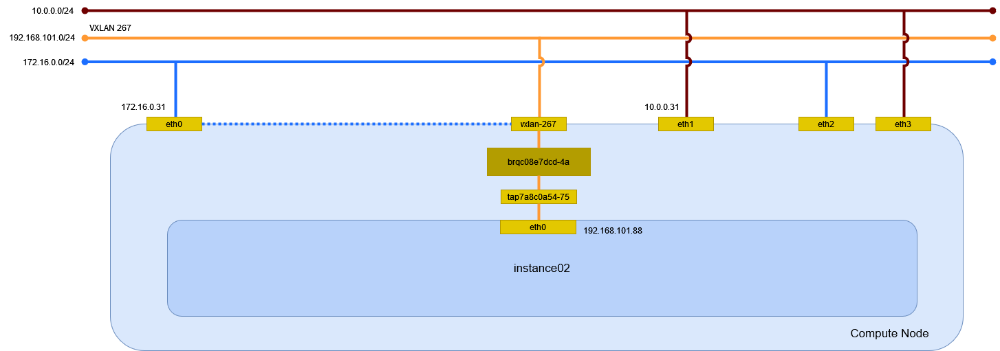

# インスタンスの作成 (vxlan/Linux Bridge)

vxlan ネットワーク(Linux Bridge)に接続するインスタンスを作成する。

## 前提条件

* [](../network/linuxbridge_vxlan) を作成していること。
* flavor [](../flavor/m1_nano) を作成していること。
* イメージ [](../../installation/controller/glance) でイメージを作成していること。
* セキュリティグループのルール [](../security_group/icmp) を作成していること。
* セキュリティグループのルール [](../security_group/ssh) を作成していること。

## インスタンスの作成

インスタンス instance02 を作成する。

```sh
openstack server create \
    --flavor m1.nano \
    --image cirros \
    --nic net-id=9f175a6d-d01e-4635-bdf3-244849aefab2 \
    --security-group default \
    --key-name mykey \
    instance02
```

```
+-----------------------------+-----------------------------------------------+
| Field                       | Value                                         |
+-----------------------------+-----------------------------------------------+
| OS-DCF:diskConfig           | MANUAL                                        |
| OS-EXT-AZ:availability_zone |                                               |
| OS-EXT-STS:power_state      | NOSTATE                                       |
| OS-EXT-STS:task_state       | scheduling                                    |
| OS-EXT-STS:vm_state         | building                                      |
| OS-SRV-USG:launched_at      | None                                          |
| OS-SRV-USG:terminated_at    | None                                          |
| accessIPv4                  |                                               |
| accessIPv6                  |                                               |
| addresses                   |                                               |
| adminPass                   | Qf4RGjhNCXyz                                  |
| config_drive                |                                               |
| created                     | 2024-04-15T15:42:45Z                          |
| flavor                      | m1.nano (0)                                   |
| hostId                      |                                               |
| id                          | 1bd994c2-a0f6-4f14-953a-ebd0de6b4adf          |
| image                       | cirros (e83903c4-7fa8-42a7-b693-f5034bc33603) |
| key_name                    | mykey                                         |
| name                        | instance02                                    |
| progress                    | 0                                             |
| project_id                  | f2aeffb34ff34ffb8959f1cd813655c6              |
| properties                  |                                               |
| security_groups             | name='87fd4685-d317-42fb-a487-28382d2c2750'   |
| status                      | BUILD                                         |
| updated                     | 2024-04-15T15:42:45Z                          |
| user_id                     | 71b5948c75f24c0f841dbf1c4eb4c4a7              |
| volumes_attached            |                                               |
+-----------------------------+-----------------------------------------------+
```

## インスタンスの確認

インスタンスが ACTIVE になったことを確認する。

```sh
openstack server list
```

```
+--------------------------------------+------------+---------+------------------------------+--------+---------+
| ID                                   | Name       | Status  | Networks                     | Image  | Flavor  |
+--------------------------------------+------------+---------+------------------------------+--------+---------+
| 1bd994c2-a0f6-4f14-953a-ebd0de6b4adf | instance02 | ACTIVE  | selfservice=192.168.101.77   | cirros | m1.nano |
+--------------------------------------+------------+---------+------------------------------+--------+---------+
```

## 環境の確認

### dnsmasq

DHCP で IP アドレスが払い出されている。

```sh
cat /var/lib/neutron/dhcp/9f175a6d-d01e-4635-bdf3-244849aefab2/leases
```

```
1713351480 fa:16:3e:57:cd:11 192.168.101.77 host-192-168-101-77 01:fa:16:3e:57:cd:11
```

DHCP に MAC アドレスと IP アドレスの関連が追加される。

```sh
cat /var/lib/neutron/dhcp/9f175a6d-d01e-4635-bdf3-244849aefab2/host
```

```
fa:16:3e:57:cd:11,host-192-168-101-77.openstacklocal,192.168.101.77
```

DNS のエントリが追加される。

```sh
cat /var/lib/neutron/dhcp/9f175a6d-d01e-4635-bdf3-244849aefab2/addn_hosts
```

```
192.168.101.77  host-192-168-101-77.openstacklocal host-192-168-101-77
```

### インスタンス

Compute Node で確認する。

```sh
virsh list
```

```
 Id   名前                状態
----------------------------------
 2    instance-00000010   実行中
```

ネットワークインターフェイスの設定を確認する。

```sh
virsh dumpxml 2 | sed -n -e '/<interface/,/<\/interface>/ { p }'
```

```xml
<interface type='bridge'>
  <mac address='fa:16:3e:57:cd:11'/>
  <source bridge='brq9f175a6d-d0'/>
  <target dev='tap9a964f1b-6a'/>
  <model type='virtio'/>
  <driver name='qemu'/>
  <mtu size='1450'/>
  <alias name='net0'/>
  <address type='pci' domain='0x0000' bus='0x00' slot='0x03' function='0x0'/>
</interface>
```

### ネットワーク

Compute Node でネットワーク構成を確認する。



#### ネットワーク名前空間

ネットワーク名前空間は作成されない。

#### デバイス

ブリッジと TAP デバイスが追加される。

```sh
nmcli device status
```

```
(...)

brq9f175a6d-d0  bridge    接続済み (外部)  brq9f175a6d-d0
tap9a964f1b-6a  tun       接続済み (外部)  tap9a964f1b-6a
vxlan-288       vxlan     接続済み (外部)  vxlan-288
```

ブリッジを確認する。

```sh
bridge link show
```

```
(...)

2: eth0: <BROADCAST,MULTICAST,UP,LOWER_UP> mtu 1500 master brqca4e2bc3-fe state forwarding priority 32 cost 2
9: vxlan-288: <BROADCAST,MULTICAST,UP,LOWER_UP> mtu 1450 master brq9f175a6d-d0 state forwarding priority 32 cost 2
10: tap9a964f1b-6a: <BROADCAST,MULTICAST,UP,LOWER_UP> mtu 1450 master brq9f175a6d-d0 state forwarding priority 32 cost 100
```

インスタンスの eth0 は TAP デバイス tap9a964f1b-6a を経由してブリッジ brq9f175a6d-d0 に接続する。
