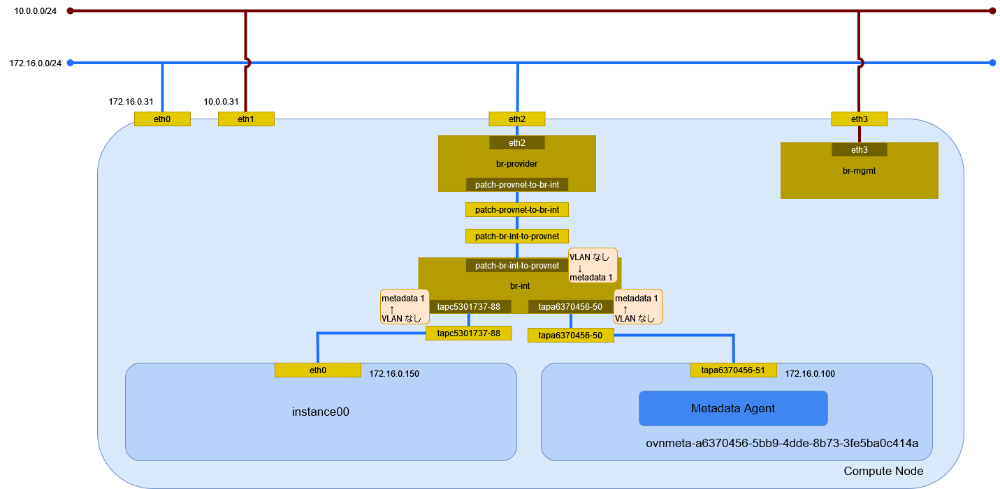

# インスタンスの作成 (flat/Open Virtual Network)

flat ネットワーク(Open vSwitch)に接続するインスタンスを作成する。

## 前提条件

* [](../network/ovn_flat) を作成していること。
* flavor [](../flavor/m1_milli) を作成していること。
* イメージ [](../../installation/controller/glance) でイメージを作成していること。
* [](../sshkey/keypair.md) を作成していること。
* セキュリティグループのルール [](../security_group/icmp) を作成していること。
* セキュリティグループのルール [](../security_group/ssh) を作成していること。

## インスタンスの作成

```{tip}
myuser で実行
```

```{note}
イメージの取得(`openstack image list`)で HTTP403 のエラーが発生するため、
プロジェクト myproject でユーザ myuser にロール admin 権限を追加する。

> openstack role add --user myuser --project myproject admin
```

```{warning}
セキュリティグループに default を指定するとエラーが発生するため、
セキュリティグループ mysecurity を指定する。

> More than one SecurityGroup exists with the name 'default'.
```

インスタンス instance00 を作成する。

```sh
openstack server create \
    --flavor m1.milli \
    --image cirros062 \
    --nic net-id=ec6ba68e-47d4-4ece-a233-718a902e68e6 \
    --security-group mysecurity \
    --key-name mykey \
    instance00
```

```
+--------------------------------------+--------------------------------------------------+
| Field                                | Value                                            |
+--------------------------------------+--------------------------------------------------+
| OS-DCF:diskConfig                    | MANUAL                                           |
| OS-EXT-AZ:availability_zone          |                                                  |
| OS-EXT-SRV-ATTR:host                 | None                                             |
| OS-EXT-SRV-ATTR:hypervisor_hostname  | None                                             |
| OS-EXT-SRV-ATTR:instance_name        |                                                  |
| OS-EXT-STS:power_state               | NOSTATE                                          |
| OS-EXT-STS:task_state                | scheduling                                       |
| OS-EXT-STS:vm_state                  | building                                         |
| OS-SRV-USG:launched_at               | None                                             |
| OS-SRV-USG:terminated_at             | None                                             |
| accessIPv4                           |                                                  |
| accessIPv6                           |                                                  |
| addresses                            |                                                  |
| adminPass                            | cNiNSr6xm95W                                     |
| config_drive                         |                                                  |
| created                              | 2024-05-25T01:53:55Z                             |
| flavor                               | m1.milli (1)                                     |
| hostId                               |                                                  |
| id                                   | 50418a76-c196-4ce6-b893-71a79b2d7a11             |
| image                                | cirros062 (c9f4c32e-f310-4b92-bb5b-0e1896eea2a4) |
| key_name                             | mykey                                            |
| name                                 | instance00                                       |
| os-extended-volumes:volumes_attached | []                                               |
| progress                             | 0                                                |
| project_id                           | bccf406c045d401b91ba5c7552a124ae                 |
| properties                           |                                                  |
| security_groups                      | name='158f2c45-1393-46e4-8093-6e82e4d876c9'      |
| status                               | BUILD                                            |
| updated                              | 2024-05-25T01:53:55Z                             |
| user_id                              | 7f3acb28d26943bab9510df3a6edf3b0                 |
+--------------------------------------+--------------------------------------------------+
```

## インスタンスの確認

インスタンスが ACTIVE になったことを確認する。

```sh
openstack server list
```

```
+--------------------------------------+------------+--------+-----------------------+-----------+----------+
| ID                                   | Name       | Status | Networks              | Image     | Flavor   |
+--------------------------------------+------------+--------+-----------------------+-----------+----------+
| 50418a76-c196-4ce6-b893-71a79b2d7a11 | instance00 | ACTIVE | provider=172.16.0.146 | cirros062 | m1.milli |
+--------------------------------------+------------+--------+-----------------------+-----------+----------+
```

SSH で接続できるか確認する。

```sh
ssh -i demo_rsa cirros@172.16.0.146 /sbin/ip addr
```

```
1: lo: <LOOPBACK,UP,LOWER_UP> mtu 65536 qdisc noqueue qlen 1000
    link/loopback 00:00:00:00:00:00 brd 00:00:00:00:00:00
    inet 127.0.0.1/8 scope host lo
       valid_lft forever preferred_lft forever
    inet6 ::1/128 scope host
       valid_lft forever preferred_lft forever
2: eth0: <BROADCAST,MULTICAST,UP,LOWER_UP> mtu 1500 qdisc pfifo_fast qlen 1000
    link/ether fa:16:3e:2a:eb:48 brd ff:ff:ff:ff:ff:ff
    inet 172.16.0.146/24 brd 172.16.0.255 scope global dynamic noprefixroute eth0
       valid_lft 43110sec preferred_lft 37710sec
    inet6 fe80::f816:3eff:fe2a:eb48/64 scope link
       valid_lft forever preferred_lft forever
```

## 環境の確認

### インスタンス

Compute Node で確認する。

```sh
virsh list
```

```
 Id   名前                状態
----------------------------------
 1    instance-00000003   実行中
```

ネットワークインターフェイスの設定を確認する。

```sh
virsh dumpxml 1 | sed -n -e '/<interface/,/<\/interface>/ { p }'
```

```xml
<interface type='ethernet'>
  <mac address='fa:16:3e:2a:eb:48'/>
  <target dev='tap7b43909d-8a'/>
  <model type='virtio'/>
  <driver name='qemu'/>
  <mtu size='1500'/>
  <alias name='net0'/>
  <address type='pci' domain='0x0000' bus='0x00' slot='0x03' function='0x0'/>
</interface>
```

### Controller Node

#### ネットワーク名前空間

ネットワーク名前空間は作成されない。

#### Northband データベース

ポートを確認する。

```sh
ovn-nbctl list Logical_Switch_Port
```

```
_uuid               : f4e9a1f0-e912-4158-9030-be3c8a238795
addresses           : [unknown]
dhcpv4_options      : []
dhcpv6_options      : []
dynamic_addresses   : []
enabled             : []
external_ids        : {}
ha_chassis_group    : []
mirror_rules        : []
name                : provnet-698fbbf6-da6f-4d59-8259-60d87eb5e697
options             : {localnet_learn_fdb="false", mcast_flood="false", mcast_flood_reports="true", network_name=provider}
parent_name         : []
port_security       : []
tag                 : []
tag_request         : []
type                : localnet
up                  : false

_uuid               : 0eadca71-d5c6-4ff5-84f6-8e79548312e9
addresses           : ["fa:16:3e:2a:eb:48 172.16.0.146"]
dhcpv4_options      : 04768538-9bea-4518-817b-06320b789d25
dhcpv6_options      : []
dynamic_addresses   : []
enabled             : true
external_ids        : {"neutron:cidrs"="172.16.0.146/24", "neutron:device_id"="50418a76-c196-4ce6-b893-71a79b2d7a11", "neutron:device_owner"="compute:nova", "neutron:host_id"=compute.home.local, "neutron:mtu"="", "neutron:network_name"=neutron-ec6ba68e-47d4-4ece-a233-718a902e68e6, "neutron:port_capabilities"="", "neutron:port_name"="", "neutron:project_id"=bccf406c045d401b91ba5c7552a124ae, "neutron:revision_number"="4", "neutron:security_group_ids"="158f2c45-1393-46e4-8093-6e82e4d876c9", "neutron:subnet_pool_addr_scope4"="", "neutron:subnet_pool_addr_scope6"="", "neutron:vnic_type"=normal}
ha_chassis_group    : []
mirror_rules        : []
name                : "7b43909d-8ae8-4609-9872-811667056013"
options             : {requested-chassis=compute.home.local}
parent_name         : []
port_security       : ["fa:16:3e:2a:eb:48 172.16.0.146"]
tag                 : []
tag_request         : []
type                : ""
up                  : true

_uuid               : 769582de-9c0f-406b-9dbe-70d5f5204934
addresses           : ["fa:16:3e:ee:57:9a 172.16.0.100"]
dhcpv4_options      : []
dhcpv6_options      : []
dynamic_addresses   : []
enabled             : true
external_ids        : {"neutron:cidrs"="172.16.0.100/24", "neutron:device_id"=ovnmeta-ec6ba68e-47d4-4ece-a233-718a902e68e6, "neutron:device_owner"="network:distributed", "neutron:mtu"="", "neutron:network_name"=neutron-ec6ba68e-47d4-4ece-a233-718a902e68e6, "neutron:port_capabilities"="", "neutron:port_name"="", "neutron:project_id"=be94f4411bd74f249f5e25f642209b82, "neutron:revision_number"="2", "neutron:security_group_ids"="", "neutron:subnet_pool_addr_scope4"="", "neutron:subnet_pool_addr_scope6"="", "neutron:vnic_type"=normal}
ha_chassis_group    : []
mirror_rules        : []
name                : "9241e97d-8312-471c-9765-48f657442262"
options             : {}
parent_name         : []
port_security       : []
tag                 : []
tag_request         : []
type                : localport
up                  : false
```

DHCP オプションを確認する。

```sh
ovn-nbctl list DHCP_options 04768538-9bea-4518-817b-06320b789d25
```

```
_uuid               : 04768538-9bea-4518-817b-06320b789d25
cidr                : "172.16.0.0/24"
external_ids        : {"neutron:revision_number"="0", subnet_id="c2616a6d-bb5d-48b6-b80f-284954a3b7b5"}
options             : {classless_static_route="{169.254.169.254/32,172.16.0.100, 0.0.0.0/0,172.16.0.254}", dns_server="{10.0.0.254}", lease_time="43200", mtu="1500", router="172.16.0.254", server_id="172.16.0.254", server_mac="fa:16:3e:ca:64:02"}
```

セキュリティグループの設定を確認する。

```sh
ovn-nbctl list ACL
```

```
_uuid               : 5c253e91-9c9d-4ce6-840b-1db3d7e29015
action              : allow-related
direction           : to-lport
external_ids        : {"neutron:security_group_rule_id"="64a457e0-829a-4118-aae3-6d48a28b377f"}
label               : 0
log                 : false
match               : "outport == @pg_a1b42dfb_939f_49e6_bcd3_493e2e3edbc0 && ip6 && ip6.src == $pg_a1b42dfb_939f_49e6_bcd3_493e2e3edbc0_ip6"
meter               : []
name                : []
options             : {}
priority            : 1002
severity            : []
tier                : 0

_uuid               : 472a9f32-7b90-4552-a846-1a7662a35dc6
action              : allow-related
direction           : from-lport
external_ids        : {"neutron:security_group_rule_id"="f52115e6-ae60-4fd9-ab69-c856641c96cc"}
label               : 0
log                 : false
match               : "inport == @pg_dcf5b841_bca6_4d31_98b5_1e41d4bf4472 && ip4"
meter               : []
name                : []
options             : {}
priority            : 1002
severity            : []
tier                : 0

_uuid               : 3588d152-70fd-4789-b22d-5c248d02a20e
action              : allow-related
direction           : from-lport
external_ids        : {"neutron:security_group_rule_id"="4ff9dca5-ccd4-4eea-be42-bcd0b7f17060"}
label               : 0
log                 : false
match               : "inport == @pg_a1b42dfb_939f_49e6_bcd3_493e2e3edbc0 && ip6"
meter               : []
name                : []
options             : {}
priority            : 1002
severity            : []
tier                : 0

_uuid               : 054add72-4335-48e3-af9d-4ec6ccf7eeaf
action              : allow-related
direction           : to-lport
external_ids        : {"neutron:security_group_rule_id"="ef15382c-9918-4218-97e2-b7b64d985641"}
label               : 0
log                 : false
match               : "outport == @pg_20a04bf0_dc15_4813_941c_3bba803605e8 && ip4 && ip4.src == $pg_20a04bf0_dc15_4813_941c_3bba803605e8_ip4"
meter               : []
name                : []
options             : {}
priority            : 1002
severity            : []
tier                : 0

_uuid               : 380e1843-4c00-4549-bc99-8cd02cc4fe47
action              : allow-related
direction           : from-lport
external_ids        : {"neutron:security_group_rule_id"="386e33c0-3d7e-49fd-a168-3c244bd2ca2d"}
label               : 0
log                 : false
match               : "inport == @pg_dcf5b841_bca6_4d31_98b5_1e41d4bf4472 && ip6"
meter               : []
name                : []
options             : {}
priority            : 1002
severity            : []
tier                : 0

_uuid               : 31bacda3-d31c-4739-8637-f30b4c1b47ac
action              : allow-related
direction           : from-lport
external_ids        : {"neutron:security_group_rule_id"="a0ec8f7c-0c17-496d-86c5-6bbd545f9b03"}
label               : 0
log                 : false
match               : "inport == @pg_158f2c45_1393_46e4_8093_6e82e4d876c9 && ip6"
meter               : []
name                : []
options             : {}
priority            : 1002
severity            : []
tier                : 0

_uuid               : ba161ff7-0dd4-4ec5-95bc-39bcdf5de62f
action              : allow-related
direction           : from-lport
external_ids        : {"neutron:security_group_rule_id"="8a7930bf-fa4d-4501-bb07-b24e2aab5efa"}
label               : 0
log                 : false
match               : "inport == @pg_20a04bf0_dc15_4813_941c_3bba803605e8 && ip4"
meter               : []
name                : []
options             : {}
priority            : 1002
severity            : []
tier                : 0

_uuid               : a5e40279-0698-4d4e-82c0-349b3f5e368f
action              : allow-related
direction           : to-lport
external_ids        : {"neutron:security_group_rule_id"="6e1cb864-a5a8-49e9-ba76-4d47fb265ee2"}
label               : 0
log                 : false
match               : "outport == @pg_158f2c45_1393_46e4_8093_6e82e4d876c9 && ip4 && ip4.src == 0.0.0.0/0 && tcp && tcp.dst == 22"
meter               : []
name                : []
options             : {}
priority            : 1002
severity            : []
tier                : 0

_uuid               : 29e28c69-b2e9-46d5-8519-be84292c255d
action              : allow-related
direction           : to-lport
external_ids        : {"neutron:security_group_rule_id"="c8082036-fb98-47a4-af34-7e88aac07f79"}
label               : 0
log                 : false
match               : "outport == @pg_a1b42dfb_939f_49e6_bcd3_493e2e3edbc0 && ip4 && ip4.src == $pg_a1b42dfb_939f_49e6_bcd3_493e2e3edbc0_ip4"
meter               : []
name                : []
options             : {}
priority            : 1002
severity            : []
tier                : 0

_uuid               : 655423fa-e375-41de-b063-40507c2ef83d
action              : drop
direction           : from-lport
external_ids        : {}
label               : 0
log                 : false
match               : "inport == @neutron_pg_drop && ip"
meter               : []
name                : []
options             : {}
priority            : 1001
severity            : []
tier                : 0

_uuid               : a800a64a-93c6-4608-8a48-2142357adde4
action              : allow-related
direction           : to-lport
external_ids        : {"neutron:security_group_rule_id"="2d69318e-8455-4e9a-9c80-f5d0cfad0bc0"}
label               : 0
log                 : false
match               : "outport == @pg_dcf5b841_bca6_4d31_98b5_1e41d4bf4472 && ip6 && ip6.src == $pg_dcf5b841_bca6_4d31_98b5_1e41d4bf4472_ip6"
meter               : []
name                : []
options             : {}
priority            : 1002
severity            : []
tier                : 0

_uuid               : 89909a2b-d545-4026-b270-3b2bc9a948f9
action              : allow-related
direction           : from-lport
external_ids        : {"neutron:security_group_rule_id"="a2980711-49ad-4028-8cf8-37afd65fccd8"}
label               : 0
log                 : false
match               : "inport == @pg_20a04bf0_dc15_4813_941c_3bba803605e8 && ip6"
meter               : []
name                : []
options             : {}
priority            : 1002
severity            : []
tier                : 0

_uuid               : c8261cbc-473a-44c4-8950-4325ed3fc75a
action              : allow-related
direction           : to-lport
external_ids        : {"neutron:security_group_rule_id"="7d682bde-565b-4c97-b22f-1f8bb9f8e176"}
label               : 0
log                 : false
match               : "outport == @pg_20a04bf0_dc15_4813_941c_3bba803605e8 && ip6 && ip6.src == $pg_20a04bf0_dc15_4813_941c_3bba803605e8_ip6"
meter               : []
name                : []
options             : {}
priority            : 1002
severity            : []
tier                : 0

_uuid               : f3a5a37c-ea4a-4d45-bebd-bf8e1795a502
action              : allow-related
direction           : from-lport
external_ids        : {"neutron:security_group_rule_id"="4a672c1f-fa4a-4623-95f6-7a390b2fb0b2"}
label               : 0
log                 : false
match               : "inport == @pg_a1b42dfb_939f_49e6_bcd3_493e2e3edbc0 && ip4"
meter               : []
name                : []
options             : {}
priority            : 1002
severity            : []
tier                : 0

_uuid               : 633a039c-a369-4cae-b6ce-bc96e0596136
action              : allow-related
direction           : to-lport
external_ids        : {"neutron:security_group_rule_id"="f400ed5b-d2cd-4179-bad7-b6099640aa72"}
label               : 0
log                 : false
match               : "outport == @pg_dcf5b841_bca6_4d31_98b5_1e41d4bf4472 && ip4 && ip4.src == $pg_dcf5b841_bca6_4d31_98b5_1e41d4bf4472_ip4"
meter               : []
name                : []
options             : {}
priority            : 1002
severity            : []
tier                : 0

_uuid               : 17be7dac-406b-4fb3-a036-238248cbcff7
action              : drop
direction           : to-lport
external_ids        : {}
label               : 0
log                 : false
match               : "outport == @neutron_pg_drop && ip"
meter               : []
name                : []
options             : {}
priority            : 1001
severity            : []
tier                : 0

_uuid               : 6af3a7fd-e126-4b94-8f13-35061fbc1291
action              : allow-related
direction           : from-lport
external_ids        : {"neutron:security_group_rule_id"="12dab7f7-5c98-436d-9ff1-fb9ab179f5c4"}
label               : 0
log                 : false
match               : "inport == @pg_158f2c45_1393_46e4_8093_6e82e4d876c9 && ip4"
meter               : []
name                : []
options             : {}
priority            : 1002
severity            : []
tier                : 0

_uuid               : 7b75e62e-e06f-4ea3-b4ad-6204168b58f8
action              : allow-related
direction           : to-lport
external_ids        : {"neutron:security_group_rule_id"="d84d5d71-ad24-4072-a5c1-fa950ac6fdc9"}
label               : 0
log                 : false
match               : "outport == @pg_158f2c45_1393_46e4_8093_6e82e4d876c9 && ip4 && ip4.src == 0.0.0.0/0 && icmp4"
meter               : []
name                : []
options             : {}
priority            : 1002
severity            : []
tier                : 0
```

#### Southbound データベース

フローを確認する。

```sh
ovn-sbctl lflow-list
```

```
Datapath: "neutron-ec6ba68e-47d4-4ece-a233-718a902e68e6" aka "provider" (fa81dc7d-3704-41ab-9e5b-266d1fddcfba)  Pipeline: ingress
  table=0 (ls_in_check_port_sec), priority=110  , match=(((ip4 && icmp4.type == 3 && icmp4.code == 4) || (ip6 && icmp6.type == 2 && icmp6.code == 0)) && flags.tunnel_rx == 1), action=(drop;)
  table=0 (ls_in_check_port_sec), priority=100  , match=(eth.src[40]), action=(drop;)
  table=0 (ls_in_check_port_sec), priority=100  , match=(vlan.present), action=(drop;)
  table=0 (ls_in_check_port_sec), priority=50   , match=(1), action=(reg0[15] = check_in_port_sec(); next;)
  table=1 (ls_in_apply_port_sec), priority=50   , match=(reg0[15] == 1), action=(drop;)
  table=1 (ls_in_apply_port_sec), priority=0    , match=(1), action=(next;)
  table=2 (ls_in_lookup_fdb   ), priority=0    , match=(1), action=(next;)
  table=3 (ls_in_put_fdb      ), priority=0    , match=(1), action=(next;)
  table=4 (ls_in_pre_acl      ), priority=110  , match=(eth.dst == $svc_monitor_mac), action=(next;)
  table=4 (ls_in_pre_acl      ), priority=110  , match=(eth.mcast), action=(next;)
  table=4 (ls_in_pre_acl      ), priority=110  , match=(ip && inport == "provnet-698fbbf6-da6f-4d59-8259-60d87eb5e697"), action=(next;)
  table=4 (ls_in_pre_acl      ), priority=110  , match=(nd || nd_rs || nd_ra || mldv1 || mldv2 || (udp && udp.src == 546 && udp.dst == 547)), action=(next;)
  table=4 (ls_in_pre_acl      ), priority=100  , match=(ip), action=(reg0[0] = 1; next;)
  table=4 (ls_in_pre_acl      ), priority=0    , match=(1), action=(next;)
  table=5 (ls_in_pre_lb       ), priority=110  , match=(eth.dst == $svc_monitor_mac), action=(next;)
  table=5 (ls_in_pre_lb       ), priority=110  , match=(eth.mcast), action=(next;)
  table=5 (ls_in_pre_lb       ), priority=110  , match=(ip && inport == "provnet-698fbbf6-da6f-4d59-8259-60d87eb5e697"), action=(next;)
  table=5 (ls_in_pre_lb       ), priority=110  , match=(nd || nd_rs || nd_ra || mldv1 || mldv2), action=(next;)
  table=5 (ls_in_pre_lb       ), priority=110  , match=(reg0[16] == 1), action=(next;)
  table=5 (ls_in_pre_lb       ), priority=0    , match=(1), action=(next;)
  table=6 (ls_in_pre_stateful ), priority=110  , match=(reg0[2] == 1), action=(ct_lb_mark;)
  table=6 (ls_in_pre_stateful ), priority=100  , match=(reg0[0] == 1), action=(ct_next;)
  table=6 (ls_in_pre_stateful ), priority=0    , match=(1), action=(next;)
  table=7 (ls_in_acl_hint     ), priority=7    , match=(ct.new && !ct.est), action=(reg0[7] = 1; reg0[9] = 1; next;)
  table=7 (ls_in_acl_hint     ), priority=6    , match=(!ct.new && ct.est && !ct.rpl && ct_mark.blocked == 1), action=(reg0[7] = 1; reg0[9] = 1; next;)
  table=7 (ls_in_acl_hint     ), priority=5    , match=(!ct.trk), action=(reg0[8] = 1; reg0[9] = 1; next;)
  table=7 (ls_in_acl_hint     ), priority=4    , match=(!ct.new && ct.est && !ct.rpl && ct_mark.blocked == 0), action=(reg0[8] = 1; reg0[10] = 1; next;)
  table=7 (ls_in_acl_hint     ), priority=3    , match=(!ct.est), action=(reg0[9] = 1; next;)
  table=7 (ls_in_acl_hint     ), priority=2    , match=(ct.est && ct_mark.blocked == 1), action=(reg0[9] = 1; next;)
  table=7 (ls_in_acl_hint     ), priority=1    , match=(ct.est && ct_mark.blocked == 0), action=(reg0[10] = 1; next;)
  table=7 (ls_in_acl_hint     ), priority=0    , match=(1), action=(next;)
  table=8 (ls_in_acl_eval     ), priority=65532, match=(!ct.est && ct.rel && !ct.new && !ct.inv && ct_mark.blocked == 0), action=(reg0[17] = 1; reg8[16] = 1; ct_commit_nat;)
  table=8 (ls_in_acl_eval     ), priority=65532, match=(ct.est && !ct.rel && !ct.new && !ct.inv && ct.rpl && ct_mark.blocked == 0), action=(reg0[9] = 0; reg0[10] = 0; reg0[17] = 1; reg8[16] = 1; next;)
  table=8 (ls_in_acl_eval     ), priority=65532, match=(ct.inv || (ct.est && ct.rpl && ct_mark.blocked == 1)), action=(reg8[17] = 1; next;)
  table=8 (ls_in_acl_eval     ), priority=65532, match=(nd || nd_ra || nd_rs || mldv1 || mldv2), action=(reg8[16] = 1; next;)
  table=8 (ls_in_acl_eval     ), priority=34000, match=(eth.dst == $svc_monitor_mac), action=(reg8[16] = 1; next;)
  table=8 (ls_in_acl_eval     ), priority=2002 , match=(reg0[7] == 1 && (inport == @pg_158f2c45_1393_46e4_8093_6e82e4d876c9 && ip4)), action=(reg8[16] = 1; reg0[1] = 1; next;)
  table=8 (ls_in_acl_eval     ), priority=2002 , match=(reg0[7] == 1 && (inport == @pg_158f2c45_1393_46e4_8093_6e82e4d876c9 && ip6)), action=(reg8[16] = 1; reg0[1] = 1; next;)
  table=8 (ls_in_acl_eval     ), priority=2002 , match=(reg0[8] == 1 && (inport == @pg_158f2c45_1393_46e4_8093_6e82e4d876c9 && ip4)), action=(reg8[16] = 1; next;)
  table=8 (ls_in_acl_eval     ), priority=2002 , match=(reg0[8] == 1 && (inport == @pg_158f2c45_1393_46e4_8093_6e82e4d876c9 && ip6)), action=(reg8[16] = 1; next;)
  table=8 (ls_in_acl_eval     ), priority=2001 , match=(reg0[10] == 1 && (inport == @neutron_pg_drop && ip)), action=(reg8[17] = 1; ct_commit { ct_mark.blocked = 1; }; next;)
  table=8 (ls_in_acl_eval     ), priority=2001 , match=(reg0[9] == 1 && (inport == @neutron_pg_drop && ip)), action=(reg8[17] = 1; next;)
  table=8 (ls_in_acl_eval     ), priority=1    , match=(ip && !ct.est), action=(reg0[1] = 1; next;)
  table=8 (ls_in_acl_eval     ), priority=1    , match=(ip && ct.est && ct_mark.blocked == 1), action=(reg0[1] = 1; reg8[16] = 1; next;)
  table=8 (ls_in_acl_eval     ), priority=0    , match=(1), action=(next;)
  table=9 (ls_in_acl_action   ), priority=1000 , match=(reg8[16] == 1), action=(reg8[16] = 0; reg8[17] = 0; reg8[18] = 0; next;)
  table=9 (ls_in_acl_action   ), priority=1000 , match=(reg8[17] == 1), action=(reg8[16] = 0; reg8[17] = 0; reg8[18] = 0; /* drop */)
  table=9 (ls_in_acl_action   ), priority=1000 , match=(reg8[18] == 1), action=(reg8[16] = 0; reg8[17] = 0; reg8[18] = 0; reg0 = 0; reject { /* eth.dst <-> eth.src; ip.dst <-> ip.src; is implicit. */ outport <-> inport; next(pipeline=egress,table=6); };)
  table=9 (ls_in_acl_action   ), priority=0    , match=(1), action=(reg8[16] = 0; reg8[17] = 0; reg8[18] = 0; next;)
  table=10(ls_in_qos_mark     ), priority=0    , match=(1), action=(next;)
  table=11(ls_in_qos_meter    ), priority=0    , match=(1), action=(next;)
  table=12(ls_in_lb_aff_check ), priority=0    , match=(1), action=(next;)
  table=13(ls_in_lb           ), priority=0    , match=(1), action=(next;)
  table=14(ls_in_lb_aff_learn ), priority=0    , match=(1), action=(next;)
  table=15(ls_in_pre_hairpin  ), priority=0    , match=(1), action=(next;)
  table=16(ls_in_nat_hairpin  ), priority=0    , match=(1), action=(next;)
  table=17(ls_in_hairpin      ), priority=0    , match=(1), action=(next;)
  table=18(ls_in_acl_after_lb_eval), priority=65532, match=(nd || nd_ra || nd_rs || mldv1 || mldv2), action=(reg8[16] = 1; next;)
  table=18(ls_in_acl_after_lb_eval), priority=65532, match=(reg0[17] == 1), action=(reg8[16] = 1; next;)
  table=18(ls_in_acl_after_lb_eval), priority=0    , match=(1), action=(next;)
  table=19(ls_in_acl_after_lb_action), priority=1000 , match=(reg8[16] == 1), action=(reg8[16] = 0; reg8[17] = 0; reg8[18] = 0; next;)
  table=19(ls_in_acl_after_lb_action), priority=1000 , match=(reg8[17] == 1), action=(reg8[16] = 0; reg8[17] = 0; reg8[18] = 0; /* drop */)
  table=19(ls_in_acl_after_lb_action), priority=1000 , match=(reg8[18] == 1), action=(reg8[16] = 0; reg8[17] = 0; reg8[18] = 0; reg0 = 0; reject { /* eth.dst <-> eth.src; ip.dst <-> ip.src; is implicit. */ outport <-> inport; next(pipeline=egress,table=6); };)
  table=19(ls_in_acl_after_lb_action), priority=0    , match=(1), action=(reg8[16] = 0; reg8[17] = 0; reg8[18] = 0; next;)
  table=20(ls_in_stateful     ), priority=100  , match=(reg0[1] == 1 && reg0[13] == 0), action=(ct_commit { ct_mark.blocked = 0; }; next;)
  table=20(ls_in_stateful     ), priority=100  , match=(reg0[1] == 1 && reg0[13] == 1), action=(ct_commit { ct_mark.blocked = 0; ct_label.label = reg3; }; next;)
  table=20(ls_in_stateful     ), priority=0    , match=(1), action=(next;)
  table=21(ls_in_arp_rsp      ), priority=100  , match=(arp.tpa == 172.16.0.100 && arp.op == 1 && inport == "9241e97d-8312-471c-9765-48f657442262"), action=(next;)
  table=21(ls_in_arp_rsp      ), priority=100  , match=(arp.tpa == 172.16.0.146 && arp.op == 1 && inport == "7b43909d-8ae8-4609-9872-811667056013"), action=(next;)
  table=21(ls_in_arp_rsp      ), priority=100  , match=(inport == "provnet-698fbbf6-da6f-4d59-8259-60d87eb5e697"), action=(next;)
  table=21(ls_in_arp_rsp      ), priority=50   , match=(arp.tpa == 172.16.0.100 && arp.op == 1), action=(eth.dst = eth.src; eth.src = fa:16:3e:ee:57:9a; arp.op = 2; /* ARP reply */ arp.tha = arp.sha; arp.sha = fa:16:3e:ee:57:9a; arp.tpa = arp.spa; arp.spa = 172.16.0.100; outport = inport; flags.loopback = 1; output;)
  table=21(ls_in_arp_rsp      ), priority=50   , match=(arp.tpa == 172.16.0.146 && arp.op == 1), action=(eth.dst = eth.src; eth.src = fa:16:3e:2a:eb:48; arp.op = 2; /* ARP reply */ arp.tha = arp.sha; arp.sha = fa:16:3e:2a:eb:48; arp.tpa = arp.spa; arp.spa = 172.16.0.146; outport = inport; flags.loopback = 1; output;)
  table=21(ls_in_arp_rsp      ), priority=0    , match=(1), action=(next;)
  table=22(ls_in_dhcp_options ), priority=100  , match=(inport == "7b43909d-8ae8-4609-9872-811667056013" && eth.src == fa:16:3e:2a:eb:48 && (ip4.src == {172.16.0.146, 0.0.0.0} && ip4.dst == {172.16.0.254, 255.255.255.255}) && udp.src == 68 && udp.dst == 67), action=(reg0[3] = put_dhcp_opts(offerip = 172.16.0.146, classless_static_route = {169.254.169.254/32,172.16.0.100, 0.0.0.0/0,172.16.0.254}, dns_server = {10.0.0.254}, lease_time = 43200, mtu = 1500, netmask = 255.255.255.0, router = 172.16.0.254, server_id = 172.16.0.254); next;)
  table=22(ls_in_dhcp_options ), priority=0    , match=(1), action=(next;)
  table=23(ls_in_dhcp_response), priority=100  , match=(inport == "7b43909d-8ae8-4609-9872-811667056013" && eth.src == fa:16:3e:2a:eb:48 && ip4 && udp.src == 68 && udp.dst == 67 && reg0[3]), action=(eth.dst = eth.src; eth.src = fa:16:3e:ca:64:02; ip4.src = 172.16.0.254; udp.src = 67; udp.dst = 68; outport = inport; flags.loopback = 1; output;)
  table=23(ls_in_dhcp_response), priority=0    , match=(1), action=(next;)
  table=24(ls_in_dns_lookup   ), priority=0    , match=(1), action=(next;)
  table=25(ls_in_dns_response ), priority=0    , match=(1), action=(next;)
  table=26(ls_in_external_port), priority=0    , match=(1), action=(next;)
  table=27(ls_in_l2_lkup      ), priority=110  , match=(eth.dst == $svc_monitor_mac && (tcp || icmp || icmp6)), action=(handle_svc_check(inport);)
  table=27(ls_in_l2_lkup      ), priority=70   , match=(eth.mcast), action=(outport = "_MC_flood"; output;)
  table=27(ls_in_l2_lkup      ), priority=50   , match=(eth.dst == fa:16:3e:2a:eb:48), action=(outport = "7b43909d-8ae8-4609-9872-811667056013"; output;)
  table=27(ls_in_l2_lkup      ), priority=50   , match=(eth.dst == fa:16:3e:ee:57:9a), action=(outport = "9241e97d-8312-471c-9765-48f657442262"; output;)
  table=27(ls_in_l2_lkup      ), priority=0    , match=(1), action=(outport = get_fdb(eth.dst); next;)
  table=28(ls_in_l2_unknown   ), priority=50   , match=(outport == "none"), action=(outport = "_MC_unknown"; output;)
  table=28(ls_in_l2_unknown   ), priority=0    , match=(1), action=(output;)
Datapath: "neutron-ec6ba68e-47d4-4ece-a233-718a902e68e6" aka "provider" (fa81dc7d-3704-41ab-9e5b-266d1fddcfba)  Pipeline: egress
  table=0 (ls_out_pre_acl     ), priority=110  , match=(eth.mcast), action=(next;)
  table=0 (ls_out_pre_acl     ), priority=110  , match=(eth.src == $svc_monitor_mac), action=(next;)
  table=0 (ls_out_pre_acl     ), priority=110  , match=(ip && outport == "provnet-698fbbf6-da6f-4d59-8259-60d87eb5e697"), action=(next;)
  table=0 (ls_out_pre_acl     ), priority=110  , match=(nd || nd_rs || nd_ra || mldv1 || mldv2 || (udp && udp.src == 546 && udp.dst == 547)), action=(next;)
  table=0 (ls_out_pre_acl     ), priority=100  , match=(ip), action=(reg0[0] = 1; next;)
  table=0 (ls_out_pre_acl     ), priority=0    , match=(1), action=(next;)
  table=1 (ls_out_pre_lb      ), priority=110  , match=(eth.mcast), action=(next;)
  table=1 (ls_out_pre_lb      ), priority=110  , match=(eth.src == $svc_monitor_mac), action=(next;)
  table=1 (ls_out_pre_lb      ), priority=110  , match=(ip && outport == "provnet-698fbbf6-da6f-4d59-8259-60d87eb5e697"), action=(next;)
  table=1 (ls_out_pre_lb      ), priority=110  , match=(nd || nd_rs || nd_ra || mldv1 || mldv2), action=(next;)
  table=1 (ls_out_pre_lb      ), priority=110  , match=(reg0[16] == 1), action=(next;)
  table=1 (ls_out_pre_lb      ), priority=0    , match=(1), action=(next;)
  table=2 (ls_out_pre_stateful), priority=110  , match=(reg0[2] == 1), action=(ct_lb_mark;)
  table=2 (ls_out_pre_stateful), priority=100  , match=(reg0[0] == 1), action=(ct_next;)
  table=2 (ls_out_pre_stateful), priority=0    , match=(1), action=(next;)
  table=3 (ls_out_acl_hint    ), priority=7    , match=(ct.new && !ct.est), action=(reg0[7] = 1; reg0[9] = 1; next;)
  table=3 (ls_out_acl_hint    ), priority=6    , match=(!ct.new && ct.est && !ct.rpl && ct_mark.blocked == 1), action=(reg0[7] = 1; reg0[9] = 1; next;)
  table=3 (ls_out_acl_hint    ), priority=5    , match=(!ct.trk), action=(reg0[8] = 1; reg0[9] = 1; next;)
  table=3 (ls_out_acl_hint    ), priority=4    , match=(!ct.new && ct.est && !ct.rpl && ct_mark.blocked == 0), action=(reg0[8] = 1; reg0[10] = 1; next;)
  table=3 (ls_out_acl_hint    ), priority=3    , match=(!ct.est), action=(reg0[9] = 1; next;)
  table=3 (ls_out_acl_hint    ), priority=2    , match=(ct.est && ct_mark.blocked == 1), action=(reg0[9] = 1; next;)
  table=3 (ls_out_acl_hint    ), priority=1    , match=(ct.est && ct_mark.blocked == 0), action=(reg0[10] = 1; next;)
  table=3 (ls_out_acl_hint    ), priority=0    , match=(1), action=(next;)
  table=4 (ls_out_acl_eval    ), priority=65532, match=(!ct.est && ct.rel && !ct.new && !ct.inv && ct_mark.blocked == 0), action=(reg8[16] = 1; ct_commit_nat;)
  table=4 (ls_out_acl_eval    ), priority=65532, match=(ct.est && !ct.rel && !ct.new && !ct.inv && ct.rpl && ct_mark.blocked == 0), action=(reg8[16] = 1; next;)
  table=4 (ls_out_acl_eval    ), priority=65532, match=(ct.inv || (ct.est && ct.rpl && ct_mark.blocked == 1)), action=(reg8[17] = 1; next;)
  table=4 (ls_out_acl_eval    ), priority=65532, match=(nd || nd_ra || nd_rs || mldv1 || mldv2), action=(reg8[16] = 1; next;)
  table=4 (ls_out_acl_eval    ), priority=34000, match=(eth.src == $svc_monitor_mac), action=(reg8[16] = 1; next;)
  table=4 (ls_out_acl_eval    ), priority=34000, match=(outport == "7b43909d-8ae8-4609-9872-811667056013" && eth.src == fa:16:3e:ca:64:02 && ip4.src == 172.16.0.254 && udp && udp.src == 67 && udp.dst == 68), action=(reg8[16] = 1; next;)
  table=4 (ls_out_acl_eval    ), priority=2002 , match=(reg0[7] == 1 && (outport == @pg_158f2c45_1393_46e4_8093_6e82e4d876c9 && ip4 && ip4.src == 0.0.0.0/0 && icmp4)), action=(reg8[16] = 1; reg0[1] = 1; next;)
  table=4 (ls_out_acl_eval    ), priority=2002 , match=(reg0[7] == 1 && (outport == @pg_158f2c45_1393_46e4_8093_6e82e4d876c9 && ip4 && ip4.src == 0.0.0.0/0 && tcp && tcp.dst == 22)), action=(reg8[16] = 1; reg0[1] = 1; next;)
  table=4 (ls_out_acl_eval    ), priority=2002 , match=(reg0[8] == 1 && (outport == @pg_158f2c45_1393_46e4_8093_6e82e4d876c9 && ip4 && ip4.src == 0.0.0.0/0 && icmp4)), action=(reg8[16] = 1; next;)
  table=4 (ls_out_acl_eval    ), priority=2002 , match=(reg0[8] == 1 && (outport == @pg_158f2c45_1393_46e4_8093_6e82e4d876c9 && ip4 && ip4.src == 0.0.0.0/0 && tcp && tcp.dst == 22)), action=(reg8[16] = 1; next;)
  table=4 (ls_out_acl_eval    ), priority=2001 , match=(reg0[10] == 1 && (outport == @neutron_pg_drop && ip)), action=(reg8[17] = 1; ct_commit { ct_mark.blocked = 1; }; next;)
  table=4 (ls_out_acl_eval    ), priority=2001 , match=(reg0[9] == 1 && (outport == @neutron_pg_drop && ip)), action=(reg8[17] = 1; next;)
  table=4 (ls_out_acl_eval    ), priority=1    , match=(ip && !ct.est), action=(reg0[1] = 1; next;)
  table=4 (ls_out_acl_eval    ), priority=1    , match=(ip && ct.est && ct_mark.blocked == 1), action=(reg0[1] = 1; reg8[16] = 1; next;)
  table=4 (ls_out_acl_eval    ), priority=0    , match=(1), action=(next;)
  table=5 (ls_out_acl_action  ), priority=1000 , match=(reg8[16] == 1), action=(reg8[16] = 0; reg8[17] = 0; reg8[18] = 0; next;)
  table=5 (ls_out_acl_action  ), priority=1000 , match=(reg8[17] == 1), action=(reg8[16] = 0; reg8[17] = 0; reg8[18] = 0; /* drop */)
  table=5 (ls_out_acl_action  ), priority=1000 , match=(reg8[18] == 1), action=(reg8[16] = 0; reg8[17] = 0; reg8[18] = 0; reg0 = 0; reject { /* eth.dst <-> eth.src; ip.dst <-> ip.src; is implicit. */ outport <-> inport; next(pipeline=ingress,table=27); };)
  table=5 (ls_out_acl_action  ), priority=0    , match=(1), action=(reg8[16] = 0; reg8[17] = 0; reg8[18] = 0; next;)
  table=6 (ls_out_qos_mark    ), priority=0    , match=(1), action=(next;)
  table=7 (ls_out_qos_meter   ), priority=0    , match=(1), action=(next;)
  table=8 (ls_out_stateful    ), priority=100  , match=(reg0[1] == 1 && reg0[13] == 0), action=(ct_commit { ct_mark.blocked = 0; }; next;)
  table=8 (ls_out_stateful    ), priority=100  , match=(reg0[1] == 1 && reg0[13] == 1), action=(ct_commit { ct_mark.blocked = 0; ct_label.label = reg3; }; next;)
  table=8 (ls_out_stateful    ), priority=0    , match=(1), action=(next;)
  table=9 (ls_out_check_port_sec), priority=100  , match=(eth.mcast), action=(reg0[15] = 0; next;)
  table=9 (ls_out_check_port_sec), priority=0    , match=(1), action=(reg0[15] = check_out_port_sec(); next;)
  table=10(ls_out_apply_port_sec), priority=50   , match=(reg0[15] == 1), action=(drop;)
  table=10(ls_out_apply_port_sec), priority=0    , match=(1), action=(output;)
```

マルチキャストグループを確認する。

```sh
ovn-sbctl list Multicast_Group
```

```
_uuid               : 148f8e38-662b-4759-8e9b-94a1179d5771
datapath            : fa81dc7d-3704-41ab-9e5b-266d1fddcfba
name                : _MC_flood_l2
ports               : [0ef38ad1-f38a-49ac-9a51-130566377fb5, 3c1e627e-3849-4a58-9d23-8db1a7288f6f, 856a3a05-69a1-4a7a-93a3-2d150b5cf40d]
tunnel_key          : 32772

_uuid               : 97bbc64c-fe4a-41d9-95ab-f259f8724a55
datapath            : fa81dc7d-3704-41ab-9e5b-266d1fddcfba
name                : _MC_mrouter_flood
ports               : [3c1e627e-3849-4a58-9d23-8db1a7288f6f]
tunnel_key          : 32770

_uuid               : 4d7eedea-f419-477c-824c-a9395a9add1d
datapath            : fa81dc7d-3704-41ab-9e5b-266d1fddcfba
name                : _MC_unknown
ports               : [3c1e627e-3849-4a58-9d23-8db1a7288f6f]
tunnel_key          : 32769

_uuid               : 8712f73f-31b1-408d-a0f7-8a5f535b98ff
datapath            : fa81dc7d-3704-41ab-9e5b-266d1fddcfba
name                : _MC_flood
ports               : [0ef38ad1-f38a-49ac-9a51-130566377fb5, 3c1e627e-3849-4a58-9d23-8db1a7288f6f, 856a3a05-69a1-4a7a-93a3-2d150b5cf40d]
tunnel_key          : 32768
```

ポートを確認する。

```sh
ovn-sbctl list Port_Binding
```

```
_uuid               : 856a3a05-69a1-4a7a-93a3-2d150b5cf40d
additional_chassis  : []
additional_encap    : []
chassis             : []
datapath            : fa81dc7d-3704-41ab-9e5b-266d1fddcfba
encap               : []
external_ids        : {"neutron:cidrs"="172.16.0.100/24", "neutron:device_id"=ovnmeta-ec6ba68e-47d4-4ece-a233-718a902e68e6, "neutron:device_owner"="network:distributed", "neutron:mtu"="", "neutron:network_name"=neutron-ec6ba68e-47d4-4ece-a233-718a902e68e6, "neutron:port_capabilities"="", "neutron:port_name"="", "neutron:project_id"=be94f4411bd74f249f5e25f642209b82, "neutron:revision_number"="2", "neutron:security_group_ids"="", "neutron:subnet_pool_addr_scope4"="", "neutron:subnet_pool_addr_scope6"="", "neutron:vnic_type"=normal}
gateway_chassis     : []
ha_chassis_group    : []
logical_port        : "9241e97d-8312-471c-9765-48f657442262"
mac                 : ["fa:16:3e:ee:57:9a 172.16.0.100"]
mirror_rules        : []
nat_addresses       : []
options             : {}
parent_port         : []
port_security       : []
requested_additional_chassis: []
requested_chassis   : []
tag                 : []
tunnel_key          : 2
type                : localport
up                  : false
virtual_parent      : []

_uuid               : 0ef38ad1-f38a-49ac-9a51-130566377fb5
additional_chassis  : []
additional_encap    : []
chassis             : f17e19fc-31de-4e75-a315-e0a8cf1ac659
datapath            : fa81dc7d-3704-41ab-9e5b-266d1fddcfba
encap               : []
external_ids        : {"neutron:cidrs"="172.16.0.146/24", "neutron:device_id"="50418a76-c196-4ce6-b893-71a79b2d7a11", "neutron:device_owner"="compute:nova", "neutron:host_id"=compute.home.local, "neutron:mtu"="", "neutron:network_name"=neutron-ec6ba68e-47d4-4ece-a233-718a902e68e6, "neutron:port_capabilities"="", "neutron:port_name"="", "neutron:project_id"=bccf406c045d401b91ba5c7552a124ae, "neutron:revision_number"="4", "neutron:security_group_ids"="158f2c45-1393-46e4-8093-6e82e4d876c9", "neutron:subnet_pool_addr_scope4"="", "neutron:subnet_pool_addr_scope6"="", "neutron:vnic_type"=normal}
gateway_chassis     : []
ha_chassis_group    : []
logical_port        : "7b43909d-8ae8-4609-9872-811667056013"
mac                 : ["fa:16:3e:2a:eb:48 172.16.0.146"]
mirror_rules        : []
nat_addresses       : []
options             : {requested-chassis=compute.home.local}
parent_port         : []
port_security       : ["fa:16:3e:2a:eb:48 172.16.0.146"]
requested_additional_chassis: []
requested_chassis   : f17e19fc-31de-4e75-a315-e0a8cf1ac659
tag                 : []
tunnel_key          : 3
type                : ""
up                  : true
virtual_parent      : []

_uuid               : 3c1e627e-3849-4a58-9d23-8db1a7288f6f
additional_chassis  : []
additional_encap    : []
chassis             : []
datapath            : fa81dc7d-3704-41ab-9e5b-266d1fddcfba
encap               : []
external_ids        : {}
gateway_chassis     : []
ha_chassis_group    : []
logical_port        : provnet-698fbbf6-da6f-4d59-8259-60d87eb5e697
mac                 : [unknown]
mirror_rules        : []
nat_addresses       : []
options             : {localnet_learn_fdb="false", mcast_flood="false", mcast_flood_reports="true", network_name=provider}
parent_port         : []
port_security       : []
requested_additional_chassis: []
requested_chassis   : []
tag                 : []
tunnel_key          : 1
type                : localnet
up                  : false
virtual_parent      : []
```

#### Open vSwitch

Open vSwitch にブリッジは作成されない。

```sh
ovs-vsctl show
```

```
f6d63fd3-3bf4-45eb-afc6-603984ff8667
    ovs_version: "3.3.1"
```

### Compute Node

ネットワーク構成を確認する。



#### ネットワーク名前空間

インスタンスが立ち上がるとネットワーク名前空間が作成される。

```sh
ip netns
```

```
ovnmeta-ec6ba68e-47d4-4ece-a233-718a902e68e6 (id: 0)
```

#### デバイス

TAP デバイスが追加される。

```sh
ip -d link show
```

```
1: lo: <LOOPBACK,UP,LOWER_UP> mtu 65536 qdisc noqueue state UNKNOWN mode DEFAULT group default qlen 1000
    link/loopback 00:00:00:00:00:00 brd 00:00:00:00:00:00 promiscuity 0  allmulti 0 minmtu 0 maxmtu 0 addrgenmode eui64 numtxqueues 1 numrxqueues 1 gso_max_size 65536 gso_max_segs 65535 tso_max_size 524280 tso_max_segs 65535 gro_max_size 65536
2: eth0: <BROADCAST,MULTICAST,UP,LOWER_UP> mtu 1500 qdisc mq state UP mode DEFAULT group default qlen 1000
    link/ether 00:15:5d:bf:ba:50 brd ff:ff:ff:ff:ff:ff promiscuity 0  allmulti 0 minmtu 68 maxmtu 65521 addrgenmode none numtxqueues 64 numrxqueues 64 gso_max_size 62780 gso_max_segs 65535 tso_max_size 62780 tso_max_segs 65535 gro_max_size 65536 parentbus vmbus parentdev f4fd36cf-d20d-4c23-83bb-e1b5cc9fbfbc
3: eth1: <BROADCAST,MULTICAST,UP,LOWER_UP> mtu 1500 qdisc mq state UP mode DEFAULT group default qlen 1000
    link/ether 00:15:5d:bf:ba:57 brd ff:ff:ff:ff:ff:ff promiscuity 0  allmulti 0 minmtu 68 maxmtu 65521 addrgenmode none numtxqueues 64 numrxqueues 64 gso_max_size 62780 gso_max_segs 65535 tso_max_size 62780 tso_max_segs 65535 gro_max_size 65536 parentbus vmbus parentdev 1e1fc9b9-f159-4473-9410-cf7db6750e26
4: eth2: <BROADCAST,MULTICAST,UP,LOWER_UP> mtu 1500 qdisc mq master ovs-system state UP mode DEFAULT group default qlen 1000
    link/ether 00:15:5d:bf:ba:58 brd ff:ff:ff:ff:ff:ff promiscuity 1  allmulti 0 minmtu 68 maxmtu 65521
    openvswitch_slave addrgenmode none numtxqueues 64 numrxqueues 64 gso_max_size 62780 gso_max_segs 65535 tso_max_size 62780 tso_max_segs 65535 gro_max_size 65536 parentbus vmbus parentdev fb193242-70ac-437d-9008-4382b02d2a70
5: eth3: <BROADCAST,MULTICAST,UP,LOWER_UP> mtu 1500 qdisc mq master ovs-system state UP mode DEFAULT group default qlen 1000
    link/ether 00:15:5d:bf:ba:59 brd ff:ff:ff:ff:ff:ff promiscuity 1  allmulti 0 minmtu 68 maxmtu 65521
    openvswitch_slave addrgenmode none numtxqueues 64 numrxqueues 64 gso_max_size 62780 gso_max_segs 65535 tso_max_size 62780 tso_max_segs 65535 gro_max_size 65536 parentbus vmbus parentdev 6de0f76b-b7bc-45ba-9087-d8bee9131e1c
6: ovs-system: <BROADCAST,MULTICAST> mtu 1500 qdisc noop state DOWN mode DEFAULT group default qlen 1000
    link/ether ca:73:1a:56:ec:69 brd ff:ff:ff:ff:ff:ff promiscuity 1  allmulti 0 minmtu 68 maxmtu 65535
    openvswitch addrgenmode eui64 numtxqueues 1 numrxqueues 1 gso_max_size 65536 gso_max_segs 65535 tso_max_size 65536 tso_max_segs 65535 gro_max_size 65536
7: br-int: <BROADCAST,MULTICAST,UP,LOWER_UP> mtu 1500 qdisc noqueue state UNKNOWN mode DEFAULT group default qlen 1000
    link/ether 9e:df:11:29:6c:ab brd ff:ff:ff:ff:ff:ff promiscuity 1  allmulti 0 minmtu 68 maxmtu 65535
    openvswitch addrgenmode none numtxqueues 1 numrxqueues 1 gso_max_size 65536 gso_max_segs 65535 tso_max_size 65536 tso_max_segs 65535 gro_max_size 65536
8: tap7b43909d-8a: <BROADCAST,MULTICAST,UP,LOWER_UP> mtu 1500 qdisc noqueue master ovs-system state UNKNOWN mode DEFAULT group default qlen 1000
    link/ether fe:16:3e:2a:eb:48 brd ff:ff:ff:ff:ff:ff promiscuity 1  allmulti 0 minmtu 68 maxmtu 65521
    tun type tap pi off vnet_hdr on persist off
    openvswitch_slave addrgenmode eui64 numtxqueues 1 numrxqueues 1 gso_max_size 65536 gso_max_segs 65535 tso_max_size 65536 tso_max_segs 65535 gro_max_size 65536
9: tapec6ba68e-40@if2: <BROADCAST,MULTICAST,UP,LOWER_UP> mtu 1500 qdisc noqueue master ovs-system state UP mode DEFAULT group default qlen 1000
    link/ether 66:ac:12:ed:87:31 brd ff:ff:ff:ff:ff:ff link-netns ovnmeta-ec6ba68e-47d4-4ece-a233-718a902e68e6 promiscuity 1  allmulti 0 minmtu 68 maxmtu 65535
    veth
    openvswitch_slave addrgenmode eui64 numtxqueues 1 numrxqueues 1 gso_max_size 65536 gso_max_segs 65535 tso_max_size 524280 tso_max_segs 65535 gro_max_size 65536
```

ネットワーク名前空間内のデバイスを確認する。

```sh
ip netns exec ovnmeta-ec6ba68e-47d4-4ece-a233-718a902e68e6 ip -d link show
```

```
1: lo: <LOOPBACK,UP,LOWER_UP> mtu 65536 qdisc noqueue state UNKNOWN mode DEFAULT group default qlen 1000
    link/loopback 00:00:00:00:00:00 brd 00:00:00:00:00:00 promiscuity 0  allmulti 0 minmtu 0 maxmtu 0 addrgenmode eui64 numtxqueues 1 numrxqueues 1 gso_max_size 65536 gso_max_segs 65535 tso_max_size 524280 tso_max_segs 65535 gro_max_size 65536
2: tapec6ba68e-41@if9: <BROADCAST,MULTICAST,UP,LOWER_UP> mtu 1500 qdisc noqueue state UP mode DEFAULT group default qlen 1000
    link/ether fa:16:3e:ee:57:9a brd ff:ff:ff:ff:ff:ff link-netnsid 0 promiscuity 0  allmulti 0 minmtu 68 maxmtu 65535
    veth addrgenmode eui64 numtxqueues 1 numrxqueues 1 gso_max_size 65536 gso_max_segs 65535 tso_max_size 524280 tso_max_segs 65535 gro_max_size 65536
```

#### Open vSwitch

ブリッジの構成を確認する。

```sh
ovs-vsctl show
```

```
210309a0-2cc9-4a7f-96af-960f78c1c32d
    Bridge br-mgmt
        Port eth3
            Interface eth3
                type: system
    Bridge br-int
        fail_mode: secure
        datapath_type: system
        Port br-int
            Interface br-int
                type: internal
        Port tap7b43909d-8a
            Interface tap7b43909d-8a
        Port tapec6ba68e-40
            Interface tapec6ba68e-40
        Port patch-br-int-to-provnet-698fbbf6-da6f-4d59-8259-60d87eb5e697
            Interface patch-br-int-to-provnet-698fbbf6-da6f-4d59-8259-60d87eb5e697
                type: patch
                options: {peer=patch-provnet-698fbbf6-da6f-4d59-8259-60d87eb5e697-to-br-int}
    Bridge br-provider
        Port eth2
            Interface eth2
                type: system
        Port patch-provnet-698fbbf6-da6f-4d59-8259-60d87eb5e697-to-br-int
            Interface patch-provnet-698fbbf6-da6f-4d59-8259-60d87eb5e697-to-br-int
                type: patch
                options: {peer=patch-br-int-to-provnet-698fbbf6-da6f-4d59-8259-60d87eb5e697}
    ovs_version: "3.3.1"
```

データパスを確認する。

```sh
ovs-dpctl show
```

```
system@ovs-system:
  lookups: hit:1827 missed:790 lost:0
  flows: 0
  masks: hit:5245 total:0 hit/pkt:2.00
  cache: hit:1044 hit-rate:39.89%
  caches:
    masks-cache: size:256
  port 0: ovs-system (internal)
  port 1: eth2
  port 2: eth3
  port 3: br-int (internal)
  port 4: tap7b43909d-8a
  port 5: tapec6ba68e-40
```

ブリッジ br-int のフローのエントリを確認する。

```sh
ovs-ofctl dump-flows br-int
```

```
 cookie=0xef38ad1, duration=1826.721s, table=0, n_packets=187, n_bytes=20999, priority=100,in_port="tap7b43909d-8a" actions=load:0x3->NXM_NX_REG13[0..15],load:0x1->NXM_NX_REG11[],load:0x2->NXM_NX_REG12[],load:0x1->OXM_OF_METADATA[],load:0x3->NXM_NX_REG14[],load:0->NXM_NX_REG13[16..31],resubmit(,8)
 cookie=0x856a3a05, duration=1817.816s, table=0, n_packets=64, n_bytes=7253, priority=100,in_port="tapec6ba68e-40" actions=load:0x5->NXM_NX_REG13[0..15],load:0x1->NXM_NX_REG11[],load:0x2->NXM_NX_REG12[],load:0x1->OXM_OF_METADATA[],load:0x2->NXM_NX_REG14[],load:0->NXM_NX_REG13[16..31],load:0x1->NXM_NX_REG10[10],resubmit(,8)
 cookie=0x3c1e627e, duration=1826.666s, table=0, n_packets=0, n_bytes=0, priority=100,in_port="patch-br-int-to",dl_vlan=0 actions=strip_vlan,load:0x4->NXM_NX_REG13[0..15],load:0x1->NXM_NX_REG11[],load:0x2->NXM_NX_REG12[],load:0x1->OXM_OF_METADATA[],load:0x1->NXM_NX_REG14[],load:0->NXM_NX_REG13[16..31],resubmit(,8)
 cookie=0x3c1e627e, duration=1826.666s, table=0, n_packets=346, n_bytes=62209, priority=100,in_port="patch-br-int-to",vlan_tci=0x0000/0x1000 actions=load:0x4->NXM_NX_REG13[0..15],load:0x1->NXM_NX_REG11[],load:0x2->NXM_NX_REG12[],load:0x1->OXM_OF_METADATA[],load:0x1->NXM_NX_REG14[],load:0->NXM_NX_REG13[16..31],resubmit(,8)
 cookie=0x0, duration=5826.641s, table=0, n_packets=643, n_bytes=110950, priority=0 actions=drop
 cookie=0xe79cb8cc, duration=1826.678s, table=8, n_packets=0, n_bytes=0, priority=110,icmp6,reg10=0x10000/0x10000,metadata=0x1,icmp_type=2,icmp_code=0 actions=drop
 cookie=0xe79cb8cc, duration=1826.677s, table=8, n_packets=0, n_bytes=0, priority=110,icmp,reg10=0x10000/0x10000,metadata=0x1,icmp_type=3,icmp_code=4 actions=drop
 cookie=0xc6a42719, duration=1826.691s, table=8, n_packets=0, n_bytes=0, priority=100,metadata=0x1,dl_src=01:00:00:00:00:00/01:00:00:00:00:00 actions=drop
 cookie=0x6fe066f3, duration=1826.667s, table=8, n_packets=0, n_bytes=0, priority=100,metadata=0x1,vlan_tci=0x1000/0x1000 actions=drop
 cookie=0x9b517dee, duration=1826.667s, table=8, n_packets=602, n_bytes=90671, priority=50,metadata=0x1 actions=load:0->NXM_NX_REG10[12],resubmit(,73),move:NXM_NX_REG10[12]->NXM_NX_XXREG0[111],resubmit(,9)
 cookie=0xd524109e, duration=1826.691s, table=9, n_packets=12, n_bytes=852, priority=50,reg0=0x8000/0x8000,metadata=0x1 actions=drop
 cookie=0x50d7abc2, duration=1826.690s, table=9, n_packets=590, n_bytes=89819, priority=0,metadata=0x1 actions=resubmit(,10)
 cookie=0x94d4f04, duration=1826.712s, table=10, n_packets=590, n_bytes=89819, priority=0,metadata=0x1 actions=resubmit(,11)
 cookie=0x99a645, duration=1826.690s, table=11, n_packets=590, n_bytes=89819, priority=0,metadata=0x1 actions=resubmit(,12)
 cookie=0x8a859fb5, duration=1826.690s, table=12, n_packets=295, n_bytes=49370, priority=110,metadata=0x1,dl_dst=01:00:00:00:00:00/01:00:00:00:00:00 actions=resubmit(,13)
 cookie=0x4ed1c2cd, duration=1826.677s, table=12, n_packets=0, n_bytes=0, priority=110,icmp6,metadata=0x1,nw_ttl=255,icmp_type=135,icmp_code=0 actions=resubmit(,13)
 cookie=0x4ed1c2cd, duration=1826.677s, table=12, n_packets=0, n_bytes=0, priority=110,icmp6,metadata=0x1,nw_ttl=255,icmp_type=136,icmp_code=0 actions=resubmit(,13)
 cookie=0x4ed1c2cd, duration=1826.677s, table=12, n_packets=0, n_bytes=0, priority=110,icmp6,metadata=0x1,nw_ttl=255,icmp_type=134,icmp_code=0 actions=resubmit(,13)
 cookie=0x4ed1c2cd, duration=1826.677s, table=12, n_packets=0, n_bytes=0, priority=110,icmp6,metadata=0x1,nw_ttl=255,icmp_type=133,icmp_code=0 actions=resubmit(,13)
 cookie=0x4ed1c2cd, duration=1826.677s, table=12, n_packets=0, n_bytes=0, priority=110,icmp6,metadata=0x1,ipv6_src=fe80::/10,icmp_type=130 actions=resubmit(,13)
 cookie=0x4ed1c2cd, duration=1826.677s, table=12, n_packets=0, n_bytes=0, priority=110,icmp6,metadata=0x1,ipv6_src=fe80::/10,icmp_type=131 actions=resubmit(,13)
 cookie=0x4ed1c2cd, duration=1826.677s, table=12, n_packets=0, n_bytes=0, priority=110,icmp6,metadata=0x1,ipv6_src=fe80::/10,icmp_type=132 actions=resubmit(,13)
 cookie=0x4ed1c2cd, duration=1826.677s, table=12, n_packets=0, n_bytes=0, priority=110,udp6,metadata=0x1,tp_src=546,tp_dst=547 actions=resubmit(,13)
 cookie=0x4ed1c2cd, duration=1826.677s, table=12, n_packets=0, n_bytes=0, priority=110,udp,metadata=0x1,tp_src=546,tp_dst=547 actions=resubmit(,13)
 cookie=0x4ed1c2cd, duration=1826.677s, table=12, n_packets=0, n_bytes=0, priority=110,icmp6,metadata=0x1,ipv6_dst=ff02::16,icmp_type=143 actions=resubmit(,13)
 cookie=0xbfd6acdb, duration=1826.677s, table=12, n_packets=72, n_bytes=14821, priority=110,ip,reg14=0x1,metadata=0x1 actions=resubmit(,13)
 cookie=0xbfd6acdb, duration=1826.667s, table=12, n_packets=0, n_bytes=0, priority=110,ipv6,reg14=0x1,metadata=0x1 actions=resubmit(,13)
 cookie=0x1c40e6e, duration=1826.667s, table=12, n_packets=0, n_bytes=0, priority=110,metadata=0x1,dl_dst=b6:9c:90:73:34:da actions=resubmit(,13)
 cookie=0xd09ee163, duration=1826.667s, table=12, n_packets=0, n_bytes=0, priority=100,ipv6,metadata=0x1 actions=load:0x1->NXM_NX_XXREG0[96],resubmit(,13)
 cookie=0xd09ee163, duration=1826.667s, table=12, n_packets=214, n_bytes=25250, priority=100,ip,metadata=0x1 actions=load:0x1->NXM_NX_XXREG0[96],resubmit(,13)
 cookie=0xa8889c2a, duration=1826.690s, table=12, n_packets=9, n_bytes=378, priority=0,metadata=0x1 actions=resubmit(,13)
 cookie=0xf92a04b1, duration=1826.690s, table=13, n_packets=213, n_bytes=52179, priority=110,ip,reg14=0x1,metadata=0x1 actions=resubmit(,14)
 cookie=0xf92a04b1, duration=1826.690s, table=13, n_packets=127, n_bytes=9778, priority=110,ipv6,reg14=0x1,metadata=0x1 actions=resubmit(,14)
 cookie=0x3dcac7c2, duration=1826.690s, table=13, n_packets=27, n_bytes=2234, priority=110,metadata=0x1,dl_dst=01:00:00:00:00:00/01:00:00:00:00:00 actions=resubmit(,14)
 cookie=0x13514752, duration=1826.677s, table=13, n_packets=0, n_bytes=0, priority=110,metadata=0x1,dl_dst=b6:9c:90:73:34:da actions=resubmit(,14)
 cookie=0x18ef1d8, duration=1826.677s, table=13, n_packets=0, n_bytes=0, priority=110,icmp6,metadata=0x1,nw_ttl=255,icmp_type=135,icmp_code=0 actions=resubmit(,14)
 cookie=0x18ef1d8, duration=1826.677s, table=13, n_packets=0, n_bytes=0, priority=110,icmp6,metadata=0x1,nw_ttl=255,icmp_type=136,icmp_code=0 actions=resubmit(,14)
 cookie=0x18ef1d8, duration=1826.677s, table=13, n_packets=0, n_bytes=0, priority=110,icmp6,metadata=0x1,nw_ttl=255,icmp_type=134,icmp_code=0 actions=resubmit(,14)
 cookie=0x18ef1d8, duration=1826.677s, table=13, n_packets=0, n_bytes=0, priority=110,icmp6,metadata=0x1,nw_ttl=255,icmp_type=133,icmp_code=0 actions=resubmit(,14)
 cookie=0x18ef1d8, duration=1826.677s, table=13, n_packets=0, n_bytes=0, priority=110,icmp6,metadata=0x1,ipv6_src=fe80::/10,icmp_type=130 actions=resubmit(,14)
 cookie=0x18ef1d8, duration=1826.677s, table=13, n_packets=0, n_bytes=0, priority=110,icmp6,metadata=0x1,ipv6_src=fe80::/10,icmp_type=131 actions=resubmit(,14)
 cookie=0x18ef1d8, duration=1826.677s, table=13, n_packets=0, n_bytes=0, priority=110,icmp6,metadata=0x1,ipv6_src=fe80::/10,icmp_type=132 actions=resubmit(,14)
 cookie=0x18ef1d8, duration=1826.677s, table=13, n_packets=0, n_bytes=0, priority=110,icmp6,metadata=0x1,ipv6_dst=ff02::16,icmp_type=143 actions=resubmit(,14)
 cookie=0xe6437fe2, duration=1826.667s, table=13, n_packets=0, n_bytes=0, priority=110,reg0=0x10000/0x10000,metadata=0x1 actions=resubmit(,14)
 cookie=0x7fcfc69d, duration=1826.691s, table=13, n_packets=223, n_bytes=25628, priority=0,metadata=0x1 actions=resubmit(,14)
 cookie=0xb6a4cceb, duration=1826.667s, table=14, n_packets=0, n_bytes=0, priority=110,ipv6,reg0=0x4/0x4,metadata=0x1 actions=ct(table=15,zone=NXM_NX_REG13[0..15],nat)
 cookie=0xb6a4cceb, duration=1826.667s, table=14, n_packets=0, n_bytes=0, priority=110,ip,reg0=0x4/0x4,metadata=0x1 actions=ct(table=15,zone=NXM_NX_REG13[0..15],nat)
 cookie=0xdd7d3fe8, duration=1826.667s, table=14, n_packets=0, n_bytes=0, priority=100,ipv6,reg0=0x1/0x1,metadata=0x1 actions=ct(table=15,zone=NXM_NX_REG13[0..15])
 cookie=0xdd7d3fe8, duration=1826.667s, table=14, n_packets=214, n_bytes=25250, priority=100,ip,reg0=0x1/0x1,metadata=0x1 actions=ct(table=15,zone=NXM_NX_REG13[0..15])
 cookie=0x63cc265d, duration=1826.667s, table=14, n_packets=376, n_bytes=64569, priority=0,metadata=0x1 actions=resubmit(,15)
 cookie=0xa610f851, duration=1826.677s, table=15, n_packets=20, n_bytes=1526, priority=7,ct_state=+new-est+trk,metadata=0x1 actions=load:0x1->NXM_NX_XXREG0[103],load:0x1->NXM_NX_XXREG0[105],resubmit(,16)
 cookie=0x58a7f520, duration=1826.691s, table=15, n_packets=85, n_bytes=7505, priority=4,ct_state=-new+est-rpl+trk,ct_mark=0/0x1,metadata=0x1 actions=load:0x1->NXM_NX_XXREG0[104],load:0x1->NXM_NX_XXREG0[106],resubmit(,16)
 cookie=0x5418d02b, duration=1826.690s, table=15, n_packets=0, n_bytes=0, priority=6,ct_state=-new+est-rpl+trk,ct_mark=0x1/0x1,metadata=0x1 actions=load:0x1->NXM_NX_XXREG0[103],load:0x1->NXM_NX_XXREG0[105],resubmit(,16)
 cookie=0xad4144c7, duration=1826.690s, table=15, n_packets=376, n_bytes=64569, priority=5,ct_state=-trk,metadata=0x1 actions=load:0x1->NXM_NX_XXREG0[104],load:0x1->NXM_NX_XXREG0[105],resubmit(,16)
 cookie=0xc9f7c6e8, duration=1826.667s, table=15, n_packets=0, n_bytes=0, priority=3,ct_state=-est+trk,metadata=0x1 actions=load:0x1->NXM_NX_XXREG0[105],resubmit(,16)
 cookie=0xb65e896, duration=1826.691s, table=15, n_packets=109, n_bytes=16219, priority=1,ct_state=+est+trk,ct_mark=0/0x1,metadata=0x1 actions=load:0x1->NXM_NX_XXREG0[106],resubmit(,16)
 cookie=0x83467ed0, duration=1826.677s, table=15, n_packets=0, n_bytes=0, priority=2,ct_state=+est+trk,ct_mark=0x1/0x1,metadata=0x1 actions=load:0x1->NXM_NX_XXREG0[105],resubmit(,16)
 cookie=0x8753dab9, duration=1826.690s, table=15, n_packets=0, n_bytes=0, priority=0,metadata=0x1 actions=resubmit(,16)
 cookie=0x9057aa86, duration=1826.712s, table=16, n_packets=109, n_bytes=16219, priority=65532,ct_state=-new+est-rel+rpl-inv+trk,ct_mark=0/0x1,metadata=0x1 actions=load:0->NXM_NX_XXREG0[105],load:0->NXM_NX_XXREG0[106],load:0x1->NXM_NX_XXREG0[113],load:0x1->OXM_OF_PKT_REG4[48],resubmit(,17)
 cookie=0xaca2a410, duration=1826.691s, table=16, n_packets=15, n_bytes=1290, priority=65532,icmp6,metadata=0x1,nw_ttl=255,icmp_type=135,icmp_code=0 actions=load:0x1->OXM_OF_PKT_REG4[48],resubmit(,17)
 cookie=0xaca2a410, duration=1826.691s, table=16, n_packets=0, n_bytes=0, priority=65532,icmp6,metadata=0x1,nw_ttl=255,icmp_type=136,icmp_code=0 actions=load:0x1->OXM_OF_PKT_REG4[48],resubmit(,17)
 cookie=0xaca2a410, duration=1826.691s, table=16, n_packets=0, n_bytes=0, priority=65532,icmp6,metadata=0x1,nw_ttl=255,icmp_type=134,icmp_code=0 actions=load:0x1->OXM_OF_PKT_REG4[48],resubmit(,17)
 cookie=0xaca2a410, duration=1826.691s, table=16, n_packets=66, n_bytes=4164, priority=65532,icmp6,metadata=0x1,nw_ttl=255,icmp_type=133,icmp_code=0 actions=load:0x1->OXM_OF_PKT_REG4[48],resubmit(,17)
 cookie=0xaca2a410, duration=1826.691s, table=16, n_packets=0, n_bytes=0, priority=65532,icmp6,metadata=0x1,ipv6_src=fe80::/10,icmp_type=130 actions=load:0x1->OXM_OF_PKT_REG4[48],resubmit(,17)
 cookie=0xaca2a410, duration=1826.691s, table=16, n_packets=0, n_bytes=0, priority=65532,icmp6,metadata=0x1,ipv6_src=fe80::/10,icmp_type=131 actions=load:0x1->OXM_OF_PKT_REG4[48],resubmit(,17)
 cookie=0xaca2a410, duration=1826.691s, table=16, n_packets=0, n_bytes=0, priority=65532,icmp6,metadata=0x1,ipv6_src=fe80::/10,icmp_type=132 actions=load:0x1->OXM_OF_PKT_REG4[48],resubmit(,17)
 cookie=0xaca2a410, duration=1826.691s, table=16, n_packets=59, n_bytes=5370, priority=65532,icmp6,metadata=0x1,ipv6_dst=ff02::16,icmp_type=143 actions=load:0x1->OXM_OF_PKT_REG4[48],resubmit(,17)
 cookie=0xb7784997, duration=1826.691s, table=16, n_packets=0, n_bytes=0, priority=65532,ct_state=-new-est+rel-inv+trk,ct_mark=0/0x1,ipv6,metadata=0x1 actions=load:0x1->NXM_NX_XXREG0[113],load:0x1->OXM_OF_PKT_REG4[48],ct(commit,table=17,zone=NXM_NX_REG13[0..15],nat)
 cookie=0xb7784997, duration=1826.691s, table=16, n_packets=0, n_bytes=0, priority=65532,ct_state=-new-est+rel-inv+trk,ct_mark=0/0x1,ip,metadata=0x1 actions=load:0x1->NXM_NX_XXREG0[113],load:0x1->OXM_OF_PKT_REG4[48],ct(commit,table=17,zone=NXM_NX_REG13[0..15],nat)
 cookie=0x699c65a3, duration=1826.690s, table=16, n_packets=0, n_bytes=0, priority=65532,ct_state=+inv+trk,metadata=0x1 actions=load:0x1->OXM_OF_PKT_REG4[49],resubmit(,17)
 cookie=0x699c65a3, duration=1826.690s, table=16, n_packets=0, n_bytes=0, priority=65532,ct_state=+est+rpl+trk,ct_mark=0x1/0x1,metadata=0x1 actions=load:0x1->OXM_OF_PKT_REG4[49],resubmit(,17)
 cookie=0x27bede58, duration=1826.677s, table=16, n_packets=0, n_bytes=0, priority=34000,metadata=0x1,dl_dst=b6:9c:90:73:34:da actions=load:0x1->OXM_OF_PKT_REG4[48],resubmit(,17)
 cookie=0x97c7289d, duration=1826.691s, table=16, n_packets=20, n_bytes=1526, priority=2002,ip,reg0=0x80/0x80,reg14=0x3,metadata=0x1 actions=load:0x1->OXM_OF_PKT_REG4[48],load:0x1->NXM_NX_XXREG0[97],resubmit(,17)
 cookie=0xeae4871e, duration=1826.691s, table=16, n_packets=0, n_bytes=0, priority=2002,ipv6,reg0=0x80/0x80,reg14=0x3,metadata=0x1 actions=load:0x1->OXM_OF_PKT_REG4[48],load:0x1->NXM_NX_XXREG0[97],resubmit(,17)
 cookie=0xa8785c27, duration=1826.690s, table=16, n_packets=0, n_bytes=0, priority=2002,ipv6,reg0=0x100/0x100,reg14=0x3,metadata=0x1 actions=load:0x1->OXM_OF_PKT_REG4[48],resubmit(,17)
 cookie=0xd64d1438, duration=1826.690s, table=16, n_packets=87, n_bytes=8189, priority=2002,ip,reg0=0x100/0x100,reg14=0x3,metadata=0x1 actions=load:0x1->OXM_OF_PKT_REG4[48],resubmit(,17)
 cookie=0xf2ba8941, duration=1826.690s, table=16, n_packets=0, n_bytes=0, priority=2001,ipv6,reg0=0x200/0x200,reg14=0x3,metadata=0x1 actions=load:0x1->OXM_OF_PKT_REG4[49],resubmit(,17)
 cookie=0xf2ba8941, duration=1826.690s, table=16, n_packets=0, n_bytes=0, priority=2001,ip,reg0=0x200/0x200,reg14=0x3,metadata=0x1 actions=load:0x1->OXM_OF_PKT_REG4[49],resubmit(,17)
 cookie=0xff1901d5, duration=1826.677s, table=16, n_packets=0, n_bytes=0, priority=2001,ipv6,reg0=0x400/0x400,reg14=0x3,metadata=0x1 actions=load:0x1->OXM_OF_PKT_REG4[49],resubmit(,17)
 cookie=0xff1901d5, duration=1826.677s, table=16, n_packets=0, n_bytes=0, priority=2001,ip,reg0=0x400/0x400,reg14=0x3,metadata=0x1 actions=load:0x1->OXM_OF_PKT_REG4[49],resubmit(,17)
 cookie=0x88f83281, duration=1826.712s, table=16, n_packets=0, n_bytes=0, priority=1,ct_state=+est+trk,ct_mark=0x1/0x1,ip,metadata=0x1 actions=load:0x1->NXM_NX_XXREG0[97],load:0x1->OXM_OF_PKT_REG4[48],resubmit(,17)
 cookie=0x88f83281, duration=1826.712s, table=16, n_packets=0, n_bytes=0, priority=1,ct_state=+est+trk,ct_mark=0x1/0x1,ipv6,metadata=0x1 actions=load:0x1->NXM_NX_XXREG0[97],load:0x1->OXM_OF_PKT_REG4[48],resubmit(,17)
 cookie=0xe179bee6, duration=1826.667s, table=16, n_packets=0, n_bytes=0, priority=1,ct_state=-est+trk,ip,metadata=0x1 actions=load:0x1->NXM_NX_XXREG0[97],resubmit(,17)
 cookie=0xe179bee6, duration=1826.667s, table=16, n_packets=0, n_bytes=0, priority=1,ct_state=-est+trk,ipv6,metadata=0x1 actions=load:0x1->NXM_NX_XXREG0[97],resubmit(,17)
 cookie=0xc0887f73, duration=1826.667s, table=16, n_packets=234, n_bytes=53061, priority=0,metadata=0x1 actions=resubmit(,17)
 cookie=0x54304388, duration=1826.691s, table=17, n_packets=0, n_bytes=0, priority=1000,reg8=0x20000/0x20000,metadata=0x1 actions=load:0->OXM_OF_PKT_REG4[48],load:0->OXM_OF_PKT_REG4[49],load:0->OXM_OF_PKT_REG4[50]
 cookie=0xb23c013f, duration=1826.690s, table=17, n_packets=356, n_bytes=36758, priority=1000,reg8=0x10000/0x10000,metadata=0x1 actions=load:0->OXM_OF_PKT_REG4[48],load:0->OXM_OF_PKT_REG4[49],load:0->OXM_OF_PKT_REG4[50],resubmit(,18)
 cookie=0xfe496347, duration=1826.690s, table=17, n_packets=0, n_bytes=0, priority=1000,reg8=0x40000/0x40000,metadata=0x1 actions=load:0->OXM_OF_PKT_REG4[48],load:0->OXM_OF_PKT_REG4[49],load:0->OXM_OF_PKT_REG4[50],load:0->NXM_NX_XXREG0[96..127],controller(userdata=00.00.00.16.00.00.00.00.ff.ff.00.18.00.00.23.20.00.1b.00.00.00.01.1c.04.00.20.00.00.00.00.00.00.ff.ff.00.18.00.00.23.20.00.1b.00.00.00.01.1e.04.00.20.00.00.00.00.00.00.ff.ff.00.18.00.00.23.20.00.1c.00.00.00.01.1c.04.00.20.00.00.00.00.00.00.ff.ff.00.18.00.00.23.20.00.1c.00.00.00.01.1e.04.00.20.00.00.00.00.00.00.ff.ff.00.10.00.00.23.20.00.0e.ff.f8.30.00.00.00)
 cookie=0x9980aba1, duration=1826.691s, table=17, n_packets=234, n_bytes=53061, priority=0,metadata=0x1 actions=load:0->OXM_OF_PKT_REG4[48],load:0->OXM_OF_PKT_REG4[49],load:0->OXM_OF_PKT_REG4[50],resubmit(,18)
 cookie=0x51dd0f56, duration=1826.677s, table=18, n_packets=590, n_bytes=89819, priority=0,metadata=0x1 actions=resubmit(,19)
 cookie=0xefdd4d3, duration=1826.677s, table=19, n_packets=590, n_bytes=89819, priority=0,metadata=0x1 actions=resubmit(,20)
 cookie=0xfbd881a, duration=1826.691s, table=20, n_packets=590, n_bytes=89819, priority=0,metadata=0x1 actions=resubmit(,21)
 cookie=0xca40fba0, duration=1826.691s, table=21, n_packets=590, n_bytes=89819, priority=0,metadata=0x1 actions=resubmit(,22)
 cookie=0x4ceeb63d, duration=1826.690s, table=22, n_packets=590, n_bytes=89819, priority=0,metadata=0x1 actions=resubmit(,23)
 cookie=0xc554645a, duration=1826.677s, table=23, n_packets=590, n_bytes=89819, priority=0,metadata=0x1 actions=resubmit(,24)
 cookie=0x729fa573, duration=1826.667s, table=24, n_packets=590, n_bytes=89819, priority=0,metadata=0x1 actions=resubmit(,25)
 cookie=0xfeeff10a, duration=1826.691s, table=25, n_packets=590, n_bytes=89819, priority=0,metadata=0x1 actions=resubmit(,26)
 cookie=0x88f43f04, duration=1826.712s, table=26, n_packets=109, n_bytes=16219, priority=65532,reg0=0x20000/0x20000,metadata=0x1 actions=load:0x1->OXM_OF_PKT_REG4[48],resubmit(,27)
 cookie=0x4f3941f3, duration=1826.667s, table=26, n_packets=15, n_bytes=1290, priority=65532,icmp6,metadata=0x1,nw_ttl=255,icmp_type=135,icmp_code=0 actions=load:0x1->OXM_OF_PKT_REG4[48],resubmit(,27)
 cookie=0x4f3941f3, duration=1826.667s, table=26, n_packets=0, n_bytes=0, priority=65532,icmp6,metadata=0x1,nw_ttl=255,icmp_type=136,icmp_code=0 actions=load:0x1->OXM_OF_PKT_REG4[48],resubmit(,27)
 cookie=0x4f3941f3, duration=1826.667s, table=26, n_packets=0, n_bytes=0, priority=65532,icmp6,metadata=0x1,nw_ttl=255,icmp_type=134,icmp_code=0 actions=load:0x1->OXM_OF_PKT_REG4[48],resubmit(,27)
 cookie=0x4f3941f3, duration=1826.667s, table=26, n_packets=66, n_bytes=4164, priority=65532,icmp6,metadata=0x1,nw_ttl=255,icmp_type=133,icmp_code=0 actions=load:0x1->OXM_OF_PKT_REG4[48],resubmit(,27)
 cookie=0x4f3941f3, duration=1826.667s, table=26, n_packets=0, n_bytes=0, priority=65532,icmp6,metadata=0x1,ipv6_src=fe80::/10,icmp_type=130 actions=load:0x1->OXM_OF_PKT_REG4[48],resubmit(,27)
 cookie=0x4f3941f3, duration=1826.667s, table=26, n_packets=0, n_bytes=0, priority=65532,icmp6,metadata=0x1,ipv6_src=fe80::/10,icmp_type=131 actions=load:0x1->OXM_OF_PKT_REG4[48],resubmit(,27)
 cookie=0x4f3941f3, duration=1826.667s, table=26, n_packets=0, n_bytes=0, priority=65532,icmp6,metadata=0x1,ipv6_src=fe80::/10,icmp_type=132 actions=load:0x1->OXM_OF_PKT_REG4[48],resubmit(,27)
 cookie=0x4f3941f3, duration=1826.667s, table=26, n_packets=59, n_bytes=5370, priority=65532,icmp6,metadata=0x1,ipv6_dst=ff02::16,icmp_type=143 actions=load:0x1->OXM_OF_PKT_REG4[48],resubmit(,27)
 cookie=0x2287e941, duration=1826.690s, table=26, n_packets=341, n_bytes=62776, priority=0,metadata=0x1 actions=resubmit(,27)
 cookie=0xc04ee3cc, duration=1826.677s, table=27, n_packets=0, n_bytes=0, priority=1000,reg8=0x20000/0x20000,metadata=0x1 actions=load:0->OXM_OF_PKT_REG4[48],load:0->OXM_OF_PKT_REG4[49],load:0->OXM_OF_PKT_REG4[50]
 cookie=0x154425f, duration=1826.667s, table=27, n_packets=0, n_bytes=0, priority=1000,reg8=0x40000/0x40000,metadata=0x1 actions=load:0->OXM_OF_PKT_REG4[48],load:0->OXM_OF_PKT_REG4[49],load:0->OXM_OF_PKT_REG4[50],load:0->NXM_NX_XXREG0[96..127],controller(userdata=00.00.00.16.00.00.00.00.ff.ff.00.18.00.00.23.20.00.1b.00.00.00.01.1c.04.00.20.00.00.00.00.00.00.ff.ff.00.18.00.00.23.20.00.1b.00.00.00.01.1e.04.00.20.00.00.00.00.00.00.ff.ff.00.18.00.00.23.20.00.1c.00.00.00.01.1c.04.00.20.00.00.00.00.00.00.ff.ff.00.18.00.00.23.20.00.1c.00.00.00.01.1e.04.00.20.00.00.00.00.00.00.ff.ff.00.10.00.00.23.20.00.0e.ff.f8.30.00.00.00)
 cookie=0x8eb10ae1, duration=1826.667s, table=27, n_packets=249, n_bytes=27043, priority=1000,reg8=0x10000/0x10000,metadata=0x1 actions=load:0->OXM_OF_PKT_REG4[48],load:0->OXM_OF_PKT_REG4[49],load:0->OXM_OF_PKT_REG4[50],resubmit(,28)
 cookie=0x758e98d1, duration=1826.677s, table=27, n_packets=341, n_bytes=62776, priority=0,metadata=0x1 actions=load:0->OXM_OF_PKT_REG4[48],load:0->OXM_OF_PKT_REG4[49],load:0->OXM_OF_PKT_REG4[50],resubmit(,28)
 cookie=0x6d95a6d5, duration=1826.677s, table=28, n_packets=0, n_bytes=0, priority=100,ipv6,reg0=0x2002/0x2002,metadata=0x1 actions=ct(commit,zone=NXM_NX_REG13[0..15],nat(src),exec(load:0->NXM_NX_CT_MARK[0],move:NXM_NX_XXREG0[0..31]->NXM_NX_CT_LABEL[96..127])),resubmit(,29)
 cookie=0x6d95a6d5, duration=1826.677s, table=28, n_packets=0, n_bytes=0, priority=100,ip,reg0=0x2002/0x2002,metadata=0x1 actions=ct(commit,zone=NXM_NX_REG13[0..15],nat(src),exec(load:0->NXM_NX_CT_MARK[0],move:NXM_NX_XXREG0[0..31]->NXM_NX_CT_LABEL[96..127])),resubmit(,29)
 cookie=0x73c54fdb, duration=1826.677s, table=28, n_packets=20, n_bytes=1526, priority=100,ip,reg0=0x2/0x2002,metadata=0x1 actions=ct(commit,zone=NXM_NX_REG13[0..15],nat(src),exec(load:0->NXM_NX_CT_MARK[0])),resubmit(,29)
 cookie=0x73c54fdb, duration=1826.677s, table=28, n_packets=0, n_bytes=0, priority=100,ipv6,reg0=0x2/0x2002,metadata=0x1 actions=ct(commit,zone=NXM_NX_REG13[0..15],nat(src),exec(load:0->NXM_NX_CT_MARK[0])),resubmit(,29)
 cookie=0x76504d1, duration=1826.677s, table=28, n_packets=570, n_bytes=88293, priority=0,metadata=0x1 actions=resubmit(,29)
 cookie=0x66e3367a, duration=1826.666s, table=29, n_packets=346, n_bytes=62209, priority=100,reg14=0x1,metadata=0x1 actions=resubmit(,30)
 cookie=0xad242af8, duration=1826.649s, table=29, n_packets=7, n_bytes=294, priority=100,arp,reg14=0x3,metadata=0x1,arp_tpa=172.16.0.146,arp_op=1 actions=resubmit(,30)
 cookie=0x5399b8ed, duration=1817.816s, table=29, n_packets=0, n_bytes=0, priority=100,arp,reg14=0x2,metadata=0x1,arp_tpa=172.16.0.100,arp_op=1 actions=resubmit(,30)
 cookie=0xc5faa0cc, duration=1826.677s, table=29, n_packets=1, n_bytes=42, priority=50,arp,metadata=0x1,arp_tpa=172.16.0.100,arp_op=1 actions=move:NXM_OF_ETH_SRC[]->NXM_OF_ETH_DST[],mod_dl_src:fa:16:3e:ee:57:9a,load:0x2->NXM_OF_ARP_OP[],move:NXM_NX_ARP_SHA[]->NXM_NX_ARP_THA[],load:0xfa163eee579a->NXM_NX_ARP_SHA[],move:NXM_OF_ARP_SPA[]->NXM_OF_ARP_TPA[],load:0xac100064->NXM_OF_ARP_SPA[],move:NXM_NX_REG14[]->NXM_NX_REG15[],load:0x1->NXM_NX_REG10[0],resubmit(,37)
 cookie=0x2a45373b, duration=1826.649s, table=29, n_packets=1, n_bytes=42, priority=50,arp,metadata=0x1,arp_tpa=172.16.0.146,arp_op=1 actions=move:NXM_OF_ETH_SRC[]->NXM_OF_ETH_DST[],mod_dl_src:fa:16:3e:2a:eb:48,load:0x2->NXM_OF_ARP_OP[],move:NXM_NX_ARP_SHA[]->NXM_NX_ARP_THA[],load:0xfa163e2aeb48->NXM_NX_ARP_SHA[],move:NXM_OF_ARP_SPA[]->NXM_OF_ARP_TPA[],load:0xac100092->NXM_OF_ARP_SPA[],move:NXM_NX_REG14[]->NXM_NX_REG15[],load:0x1->NXM_NX_REG10[0],resubmit(,37)
 cookie=0x97308c22, duration=1826.691s, table=29, n_packets=235, n_bytes=27232, priority=0,metadata=0x1 actions=resubmit(,30)
 cookie=0xdb5aaaa7, duration=1826.690s, table=30, n_packets=2, n_bytes=684, priority=100,conj_id=3518456110,udp,reg14=0x3,metadata=0x1,dl_src=fa:16:3e:2a:eb:48,tp_src=68,tp_dst=67 actions=controller(userdata=00.00.00.02.00.00.00.00.00.01.de.10.00.00.00.63.ac.10.00.92.79.0e.20.a9.fe.a9.fe.ac.10.00.64.00.ac.10.00.fe.06.04.0a.00.00.fe.33.04.00.00.a8.c0.1a.02.05.dc.01.04.ff.ff.ff.00.03.04.ac.10.00.fe.36.04.ac.10.00.fe,pause),resubmit(,31)
 cookie=0x0, duration=1826.690s, table=30, n_packets=0, n_bytes=0, priority=100,udp,reg14=0x3,metadata=0x1,dl_src=fa:16:3e:2a:eb:48,nw_src=172.16.0.146,tp_src=68,tp_dst=67 actions=conjunction(3518456110,2/2)
 cookie=0x0, duration=1826.690s, table=30, n_packets=0, n_bytes=0, priority=100,udp,reg14=0x3,metadata=0x1,dl_src=fa:16:3e:2a:eb:48,nw_src=0.0.0.0,tp_src=68,tp_dst=67 actions=conjunction(3518456110,2/2)
 cookie=0x0, duration=1826.690s, table=30, n_packets=0, n_bytes=0, priority=100,udp,reg14=0x3,metadata=0x1,dl_src=fa:16:3e:2a:eb:48,nw_dst=172.16.0.254,tp_src=68,tp_dst=67 actions=conjunction(3518456110,1/2)
 cookie=0x0, duration=1826.690s, table=30, n_packets=0, n_bytes=0, priority=100,udp,reg14=0x3,metadata=0x1,dl_src=fa:16:3e:2a:eb:48,nw_dst=255.255.255.255,tp_src=68,tp_dst=67 actions=conjunction(3518456110,1/2)
 cookie=0xb85f6e91, duration=1826.691s, table=30, n_packets=586, n_bytes=89051, priority=0,metadata=0x1 actions=resubmit(,31)
 cookie=0xaf3dbc4f, duration=1826.677s, table=31, n_packets=2, n_bytes=688, priority=100,udp,reg0=0x8/0x8,reg14=0x3,metadata=0x1,dl_src=fa:16:3e:2a:eb:48,tp_src=68,tp_dst=67 actions=move:NXM_OF_ETH_SRC[]->NXM_OF_ETH_DST[],mod_dl_src:fa:16:3e:ca:64:02,mod_nw_src:172.16.0.254,mod_tp_src:67,mod_tp_dst:68,move:NXM_NX_REG14[]->NXM_NX_REG15[],load:0x1->NXM_NX_REG10[0],resubmit(,37)
 cookie=0xe0ec5c52, duration=1826.677s, table=31, n_packets=586, n_bytes=89051, priority=0,metadata=0x1 actions=resubmit(,32)
 cookie=0x7db3f230, duration=1826.690s, table=32, n_packets=586, n_bytes=89051, priority=0,metadata=0x1 actions=resubmit(,33)
 cookie=0xe941f155, duration=1826.677s, table=33, n_packets=586, n_bytes=89051, priority=0,metadata=0x1 actions=resubmit(,34)
 cookie=0x2ada6e51, duration=1826.677s, table=34, n_packets=586, n_bytes=89051, priority=0,metadata=0x1 actions=resubmit(,35)
 cookie=0x4de78d87, duration=1826.712s, table=35, n_packets=0, n_bytes=0, priority=110,tcp,metadata=0x1,dl_dst=b6:9c:90:73:34:da actions=controller(userdata=00.00.00.12.00.00.00.00)
 cookie=0x4de78d87, duration=1826.712s, table=35, n_packets=0, n_bytes=0, priority=110,icmp6,metadata=0x1,dl_dst=b6:9c:90:73:34:da actions=controller(userdata=00.00.00.12.00.00.00.00)
 cookie=0x4de78d87, duration=1826.691s, table=35, n_packets=0, n_bytes=0, priority=110,icmp,metadata=0x1,dl_dst=b6:9c:90:73:34:da actions=controller(userdata=00.00.00.12.00.00.00.00)
 cookie=0x4de78d87, duration=1826.691s, table=35, n_packets=0, n_bytes=0, priority=110,tcp6,metadata=0x1,dl_dst=b6:9c:90:73:34:da actions=controller(userdata=00.00.00.12.00.00.00.00)
 cookie=0x2dface73, duration=1826.667s, table=35, n_packets=291, n_bytes=48602, priority=70,metadata=0x1,dl_dst=01:00:00:00:00:00/01:00:00:00:00:00 actions=load:0x8000->NXM_NX_REG15[],resubmit(,37)
 cookie=0x17e71698, duration=1826.691s, table=35, n_packets=96, n_bytes=8304, priority=50,metadata=0x1,dl_dst=fa:16:3e:ee:57:9a actions=load:0x2->NXM_NX_REG15[],resubmit(,37)
 cookie=0x7b8da6, duration=1826.690s, table=35, n_packets=126, n_bytes=21154, priority=50,metadata=0x1,dl_dst=fa:16:3e:2a:eb:48 actions=load:0x3->NXM_NX_REG15[],resubmit(,37)
 cookie=0xa8092c9c, duration=1826.691s, table=35, n_packets=73, n_bytes=10991, priority=0,metadata=0x1 actions=load:0->NXM_NX_REG15[],resubmit(,71),resubmit(,36)
 cookie=0x61ea2c49, duration=1826.690s, table=36, n_packets=73, n_bytes=10991, priority=50,reg15=0,metadata=0x1 actions=load:0x8001->NXM_NX_REG15[],resubmit(,37)
 cookie=0x98c8931d, duration=1826.691s, table=36, n_packets=0, n_bytes=0, priority=0,metadata=0x1 actions=resubmit(,37)
 cookie=0x0, duration=5826.641s, table=37, n_packets=590, n_bytes=89823, priority=0 actions=resubmit(,39)
 cookie=0x0, duration=5826.642s, table=38, n_packets=0, n_bytes=0, priority=10,reg10=0x1/0x1 actions=resubmit(,40)
 cookie=0x0, duration=5826.641s, table=38, n_packets=0, n_bytes=0, priority=0 actions=resubmit(,39)
 cookie=0x0, duration=5826.641s, table=39, n_packets=0, n_bytes=0, priority=150,reg10=0x2/0x3 actions=resubmit(,40)
 cookie=0x0, duration=5826.641s, table=39, n_packets=0, n_bytes=0, priority=150,reg10=0x10/0x10 actions=resubmit(,40)
 cookie=0x856a3a05, duration=1817.816s, table=39, n_packets=64, n_bytes=7253, priority=150,reg14=0x2,metadata=0x1 actions=resubmit(,40)
 cookie=0x148f8e38, duration=1826.666s, table=39, n_packets=0, n_bytes=0, priority=100,reg15=0x8004,metadata=0x1 actions=load:0->NXM_NX_REG6[],load:0x2->NXM_NX_REG15[],resubmit(,41),load:0x8004->NXM_NX_REG15[],resubmit(,40)
 cookie=0x8712f73f, duration=1826.667s, table=39, n_packets=278, n_bytes=47556, priority=100,reg15=0x8000,metadata=0x1 actions=load:0->NXM_NX_REG6[],load:0x2->NXM_NX_REG15[],resubmit(,41),load:0x8000->NXM_NX_REG15[],resubmit(,40)
 cookie=0x0, duration=5826.642s, table=39, n_packets=248, n_bytes=35014, priority=0 actions=resubmit(,40)
 cookie=0xef38ad1, duration=1826.722s, table=40, n_packets=129, n_bytes=21884, priority=100,reg15=0x3,metadata=0x1 actions=load:0x3->NXM_NX_REG13[0..15],load:0x1->NXM_NX_REG11[],load:0x2->NXM_NX_REG12[],resubmit(,41)
 cookie=0x4d7eedea, duration=1826.667s, table=40, n_packets=73, n_bytes=10991, priority=100,reg15=0x8001,metadata=0x1 actions=load:0->NXM_NX_REG6[],load:0x4->NXM_NX_REG13[0..15],load:0x1->NXM_NX_REG15[],resubmit(,41),load:0x8001->NXM_NX_REG15[]
 cookie=0x97bbc64c, duration=1826.667s, table=40, n_packets=0, n_bytes=0, priority=100,reg15=0x8002,metadata=0x1 actions=load:0->NXM_NX_REG6[],load:0x4->NXM_NX_REG13[0..15],load:0x1->NXM_NX_REG15[],resubmit(,41),load:0x8002->NXM_NX_REG15[]
 cookie=0x8712f73f, duration=1826.667s, table=40, n_packets=291, n_bytes=48602, priority=100,reg15=0x8000,metadata=0x1 actions=load:0->NXM_NX_REG6[],load:0x3->NXM_NX_REG13[0..15],load:0x3->NXM_NX_REG15[],resubmit(,41),load:0x4->NXM_NX_REG13[0..15],load:0x1->NXM_NX_REG15[],resubmit(,41),load:0x8000->NXM_NX_REG15[]
 cookie=0x148f8e38, duration=1826.667s, table=40, n_packets=0, n_bytes=0, priority=100,reg15=0x8004,metadata=0x1 actions=load:0->NXM_NX_REG6[],load:0x3->NXM_NX_REG13[0..15],load:0x3->NXM_NX_REG15[],resubmit(,41),load:0x4->NXM_NX_REG13[0..15],load:0x1->NXM_NX_REG15[],resubmit(,41),load:0x8004->NXM_NX_REG15[]
 cookie=0x3c1e627e, duration=1826.667s, table=40, n_packets=0, n_bytes=0, priority=100,reg15=0x1,metadata=0x1 actions=load:0x4->NXM_NX_REG13[0..15],load:0x1->NXM_NX_REG11[],load:0x2->NXM_NX_REG12[],resubmit(,41)
 cookie=0x856a3a05, duration=1817.817s, table=40, n_packets=97, n_bytes=8346, priority=100,reg15=0x2,metadata=0x1 actions=load:0x5->NXM_NX_REG13[0..15],load:0x1->NXM_NX_REG11[],load:0x2->NXM_NX_REG12[],resubmit(,41)
 cookie=0x0, duration=5826.643s, table=40, n_packets=0, n_bytes=0, priority=0 actions=drop
 cookie=0x3c1e627e, duration=1826.667s, table=41, n_packets=13, n_bytes=1046, priority=160,reg10=0x400/0x400,reg15=0x1,metadata=0x1 actions=drop
 cookie=0x3c1e627e, duration=1826.667s, table=41, n_packets=0, n_bytes=0, priority=160,reg10=0x10/0x10,reg15=0x1,metadata=0x1 actions=drop
 cookie=0xef38ad1, duration=1826.722s, table=41, n_packets=8, n_bytes=336, priority=100,reg10=0/0x1,reg14=0x3,reg15=0x3,metadata=0x1 actions=drop
 cookie=0x3c1e627e, duration=1826.667s, table=41, n_packets=270, n_bytes=47220, priority=100,reg10=0/0x1,reg14=0x1,reg15=0x1,metadata=0x1 actions=drop
 cookie=0x856a3a05, duration=1817.817s, table=41, n_packets=0, n_bytes=0, priority=100,reg10=0/0x1,reg14=0x2,reg15=0x2,metadata=0x1 actions=drop
 cookie=0x0, duration=5826.642s, table=41, n_packets=868, n_bytes=137379, priority=0 actions=load:0->NXM_NX_REG0[],load:0->NXM_NX_REG1[],load:0->NXM_NX_REG2[],load:0->NXM_NX_REG3[],load:0->NXM_NX_REG4[],load:0->NXM_NX_REG5[],load:0->NXM_NX_REG6[],load:0->NXM_NX_REG7[],load:0->NXM_NX_REG8[],load:0->NXM_NX_REG9[],resubmit(,42)
 cookie=0x2c598801, duration=1826.713s, table=42, n_packets=29, n_bytes=2494, priority=110,icmp6,metadata=0x1,nw_ttl=255,icmp_type=135,icmp_code=0 actions=resubmit(,43)
 cookie=0x2c598801, duration=1826.713s, table=42, n_packets=0, n_bytes=0, priority=110,icmp6,metadata=0x1,nw_ttl=255,icmp_type=136,icmp_code=0 actions=resubmit(,43)
 cookie=0x2c598801, duration=1826.713s, table=42, n_packets=0, n_bytes=0, priority=110,icmp6,metadata=0x1,nw_ttl=255,icmp_type=134,icmp_code=0 actions=resubmit(,43)
 cookie=0x2c598801, duration=1826.713s, table=42, n_packets=123, n_bytes=7698, priority=110,icmp6,metadata=0x1,nw_ttl=255,icmp_type=133,icmp_code=0 actions=resubmit(,43)
 cookie=0x2c598801, duration=1826.713s, table=42, n_packets=0, n_bytes=0, priority=110,icmp6,metadata=0x1,ipv6_src=fe80::/10,icmp_type=130 actions=resubmit(,43)
 cookie=0x2c598801, duration=1826.713s, table=42, n_packets=0, n_bytes=0, priority=110,icmp6,metadata=0x1,ipv6_src=fe80::/10,icmp_type=131 actions=resubmit(,43)
 cookie=0x2c598801, duration=1826.713s, table=42, n_packets=0, n_bytes=0, priority=110,icmp6,metadata=0x1,ipv6_src=fe80::/10,icmp_type=132 actions=resubmit(,43)
 cookie=0x2c598801, duration=1826.713s, table=42, n_packets=0, n_bytes=0, priority=110,udp6,metadata=0x1,tp_src=546,tp_dst=547 actions=resubmit(,43)
 cookie=0x2c598801, duration=1826.713s, table=42, n_packets=0, n_bytes=0, priority=110,udp,metadata=0x1,tp_src=546,tp_dst=547 actions=resubmit(,43)
 cookie=0x2c598801, duration=1826.713s, table=42, n_packets=115, n_bytes=10410, priority=110,icmp6,metadata=0x1,ipv6_dst=ff02::16,icmp_type=143 actions=resubmit(,43)
 cookie=0x9946f595, duration=1826.692s, table=42, n_packets=302, n_bytes=75556, priority=110,metadata=0x1,dl_dst=01:00:00:00:00:00/01:00:00:00:00:00 actions=resubmit(,43)
 cookie=0x340f8bcf, duration=1826.678s, table=42, n_packets=0, n_bytes=0, priority=110,metadata=0x1,dl_src=b6:9c:90:73:34:da actions=resubmit(,43)
 cookie=0x8265c27a, duration=1826.667s, table=42, n_packets=0, n_bytes=0, priority=110,ipv6,reg15=0x1,metadata=0x1 actions=resubmit(,43)
 cookie=0x8265c27a, duration=1826.667s, table=42, n_packets=68, n_bytes=10781, priority=110,ip,reg15=0x1,metadata=0x1 actions=resubmit(,43)
 cookie=0x2201098a, duration=1826.692s, table=42, n_packets=0, n_bytes=0, priority=100,ipv6,metadata=0x1 actions=load:0x1->NXM_NX_XXREG0[96],resubmit(,43)
 cookie=0x2201098a, duration=1826.692s, table=42, n_packets=220, n_bytes=29978, priority=100,ip,metadata=0x1 actions=load:0x1->NXM_NX_XXREG0[96],resubmit(,43)
 cookie=0x4d6ec236, duration=1826.691s, table=42, n_packets=11, n_bytes=462, priority=0,metadata=0x1 actions=resubmit(,43)
 cookie=0x6a27c333, duration=1826.691s, table=43, n_packets=0, n_bytes=0, priority=110,reg0=0x10000/0x10000,metadata=0x1 actions=resubmit(,44)
 cookie=0xc1c30dd5, duration=1826.678s, table=43, n_packets=0, n_bytes=0, priority=110,metadata=0x1,dl_src=b6:9c:90:73:34:da actions=resubmit(,44)
 cookie=0x69538864, duration=1826.668s, table=43, n_packets=569, n_bytes=96158, priority=110,metadata=0x1,dl_dst=01:00:00:00:00:00/01:00:00:00:00:00 actions=resubmit(,44)
 cookie=0x22e7aaf5, duration=1826.668s, table=43, n_packets=0, n_bytes=0, priority=110,icmp6,metadata=0x1,nw_ttl=255,icmp_type=135,icmp_code=0 actions=resubmit(,44)
 cookie=0x22e7aaf5, duration=1826.668s, table=43, n_packets=0, n_bytes=0, priority=110,icmp6,metadata=0x1,nw_ttl=255,icmp_type=136,icmp_code=0 actions=resubmit(,44)
 cookie=0x22e7aaf5, duration=1826.667s, table=43, n_packets=0, n_bytes=0, priority=110,icmp6,metadata=0x1,nw_ttl=255,icmp_type=134,icmp_code=0 actions=resubmit(,44)
 cookie=0x22e7aaf5, duration=1826.667s, table=43, n_packets=0, n_bytes=0, priority=110,icmp6,metadata=0x1,nw_ttl=255,icmp_type=133,icmp_code=0 actions=resubmit(,44)
 cookie=0x22e7aaf5, duration=1826.668s, table=43, n_packets=0, n_bytes=0, priority=110,icmp6,metadata=0x1,ipv6_src=fe80::/10,icmp_type=130 actions=resubmit(,44)
 cookie=0x22e7aaf5, duration=1826.668s, table=43, n_packets=0, n_bytes=0, priority=110,icmp6,metadata=0x1,ipv6_src=fe80::/10,icmp_type=131 actions=resubmit(,44)
 cookie=0x22e7aaf5, duration=1826.667s, table=43, n_packets=0, n_bytes=0, priority=110,icmp6,metadata=0x1,ipv6_src=fe80::/10,icmp_type=132 actions=resubmit(,44)
 cookie=0x22e7aaf5, duration=1826.668s, table=43, n_packets=0, n_bytes=0, priority=110,icmp6,metadata=0x1,ipv6_dst=ff02::16,icmp_type=143 actions=resubmit(,44)
 cookie=0xbc58637b, duration=1826.667s, table=43, n_packets=0, n_bytes=0, priority=110,ipv6,reg15=0x1,metadata=0x1 actions=resubmit(,44)
 cookie=0xbc58637b, duration=1826.667s, table=43, n_packets=68, n_bytes=10781, priority=110,ip,reg15=0x1,metadata=0x1 actions=resubmit(,44)
 cookie=0xca2e2bcc, duration=1826.678s, table=43, n_packets=231, n_bytes=30440, priority=0,metadata=0x1 actions=resubmit(,44)
 cookie=0x401b44bd, duration=1826.691s, table=44, n_packets=0, n_bytes=0, priority=110,ipv6,reg0=0x4/0x4,metadata=0x1 actions=ct(table=45,zone=NXM_NX_REG13[0..15],nat)
 cookie=0x401b44bd, duration=1826.691s, table=44, n_packets=0, n_bytes=0, priority=110,ip,reg0=0x4/0x4,metadata=0x1 actions=ct(table=45,zone=NXM_NX_REG13[0..15],nat)
 cookie=0xdb8c395c, duration=1826.668s, table=44, n_packets=0, n_bytes=0, priority=100,ipv6,reg0=0x1/0x1,metadata=0x1 actions=ct(table=45,zone=NXM_NX_REG13[0..15])
 cookie=0xdb8c395c, duration=1826.668s, table=44, n_packets=220, n_bytes=29978, priority=100,ip,reg0=0x1/0x1,metadata=0x1 actions=ct(table=45,zone=NXM_NX_REG13[0..15])
 cookie=0x5ae2385c, duration=1826.668s, table=44, n_packets=648, n_bytes=107401, priority=0,metadata=0x1 actions=resubmit(,45)
 cookie=0x5d97bb3c, duration=1826.691s, table=45, n_packets=22, n_bytes=2168, priority=7,ct_state=+new-est+trk,metadata=0x1 actions=load:0x1->NXM_NX_XXREG0[103],load:0x1->NXM_NX_XXREG0[105],resubmit(,46)
 cookie=0xb06d0ee4, duration=1826.668s, table=45, n_packets=0, n_bytes=0, priority=6,ct_state=-new+est-rpl+trk,ct_mark=0x1/0x1,metadata=0x1 actions=load:0x1->NXM_NX_XXREG0[103],load:0x1->NXM_NX_XXREG0[105],resubmit(,46)
 cookie=0x77b42c79, duration=1826.667s, table=45, n_packets=146, n_bytes=21127, priority=4,ct_state=-new+est-rpl+trk,ct_mark=0/0x1,metadata=0x1 actions=load:0x1->NXM_NX_XXREG0[104],load:0x1->NXM_NX_XXREG0[106],resubmit(,46)
 cookie=0x4275ecd8, duration=1826.678s, table=45, n_packets=584, n_bytes=96962, priority=5,ct_state=-trk,metadata=0x1 actions=load:0x1->NXM_NX_XXREG0[104],load:0x1->NXM_NX_XXREG0[105],resubmit(,46)
 cookie=0x2b46bae1, duration=1826.668s, table=45, n_packets=0, n_bytes=0, priority=3,ct_state=-est+trk,metadata=0x1 actions=load:0x1->NXM_NX_XXREG0[105],resubmit(,46)
 cookie=0xf6de0452, duration=1826.678s, table=45, n_packets=116, n_bytes=17122, priority=1,ct_state=+est+trk,ct_mark=0/0x1,metadata=0x1 actions=load:0x1->NXM_NX_XXREG0[106],resubmit(,46)
 cookie=0xbbf6f3fd, duration=1826.667s, table=45, n_packets=0, n_bytes=0, priority=2,ct_state=+est+trk,ct_mark=0x1/0x1,metadata=0x1 actions=load:0x1->NXM_NX_XXREG0[105],resubmit(,46)
 cookie=0xe629d07, duration=1826.692s, table=45, n_packets=0, n_bytes=0, priority=0,metadata=0x1 actions=resubmit(,46)
 cookie=0xcd683e89, duration=1826.692s, table=46, n_packets=0, n_bytes=0, priority=65532,ct_state=+inv+trk,metadata=0x1 actions=load:0x1->OXM_OF_PKT_REG4[49],resubmit(,47)
 cookie=0xcd683e89, duration=1826.692s, table=46, n_packets=0, n_bytes=0, priority=65532,ct_state=+est+rpl+trk,ct_mark=0x1/0x1,metadata=0x1 actions=load:0x1->OXM_OF_PKT_REG4[49],resubmit(,47)
 cookie=0x793e8d13, duration=1826.692s, table=46, n_packets=116, n_bytes=17122, priority=65532,ct_state=-new+est-rel+rpl-inv+trk,ct_mark=0/0x1,metadata=0x1 actions=load:0x1->OXM_OF_PKT_REG4[48],resubmit(,47)
 cookie=0xf8093db0, duration=1826.691s, table=46, n_packets=29, n_bytes=2494, priority=65532,icmp6,metadata=0x1,nw_ttl=255,icmp_type=135,icmp_code=0 actions=load:0x1->OXM_OF_PKT_REG4[48],resubmit(,47)
 cookie=0xf8093db0, duration=1826.691s, table=46, n_packets=0, n_bytes=0, priority=65532,icmp6,metadata=0x1,nw_ttl=255,icmp_type=136,icmp_code=0 actions=load:0x1->OXM_OF_PKT_REG4[48],resubmit(,47)
 cookie=0xf8093db0, duration=1826.691s, table=46, n_packets=0, n_bytes=0, priority=65532,icmp6,metadata=0x1,nw_ttl=255,icmp_type=134,icmp_code=0 actions=load:0x1->OXM_OF_PKT_REG4[48],resubmit(,47)
 cookie=0xf8093db0, duration=1826.691s, table=46, n_packets=123, n_bytes=7698, priority=65532,icmp6,metadata=0x1,nw_ttl=255,icmp_type=133,icmp_code=0 actions=load:0x1->OXM_OF_PKT_REG4[48],resubmit(,47)
 cookie=0xf8093db0, duration=1826.691s, table=46, n_packets=0, n_bytes=0, priority=65532,icmp6,metadata=0x1,ipv6_src=fe80::/10,icmp_type=130 actions=load:0x1->OXM_OF_PKT_REG4[48],resubmit(,47)
 cookie=0xf8093db0, duration=1826.691s, table=46, n_packets=0, n_bytes=0, priority=65532,icmp6,metadata=0x1,ipv6_src=fe80::/10,icmp_type=131 actions=load:0x1->OXM_OF_PKT_REG4[48],resubmit(,47)
 cookie=0xf8093db0, duration=1826.691s, table=46, n_packets=0, n_bytes=0, priority=65532,icmp6,metadata=0x1,ipv6_src=fe80::/10,icmp_type=132 actions=load:0x1->OXM_OF_PKT_REG4[48],resubmit(,47)
 cookie=0xf8093db0, duration=1826.691s, table=46, n_packets=115, n_bytes=10410, priority=65532,icmp6,metadata=0x1,ipv6_dst=ff02::16,icmp_type=143 actions=load:0x1->OXM_OF_PKT_REG4[48],resubmit(,47)
 cookie=0x9b3cd3bb, duration=1826.691s, table=46, n_packets=0, n_bytes=0, priority=65532,ct_state=-new-est+rel-inv+trk,ct_mark=0/0x1,ipv6,metadata=0x1 actions=load:0x1->OXM_OF_PKT_REG4[48],ct(commit,table=47,zone=NXM_NX_REG13[0..15],nat)
 cookie=0x9b3cd3bb, duration=1826.691s, table=46, n_packets=0, n_bytes=0, priority=65532,ct_state=-new-est+rel-inv+trk,ct_mark=0/0x1,ip,metadata=0x1 actions=load:0x1->OXM_OF_PKT_REG4[48],ct(commit,table=47,zone=NXM_NX_REG13[0..15],nat)
 cookie=0xbd3202b9, duration=1826.691s, table=46, n_packets=0, n_bytes=0, priority=34000,metadata=0x1,dl_src=b6:9c:90:73:34:da actions=load:0x1->OXM_OF_PKT_REG4[48],resubmit(,47)
 cookie=0x439c3dee, duration=1826.668s, table=46, n_packets=2, n_bytes=688, priority=34000,udp,reg15=0x3,metadata=0x1,dl_src=fa:16:3e:ca:64:02,nw_src=172.16.0.254,tp_src=67,tp_dst=68 actions=load:0x1->OXM_OF_PKT_REG4[48],resubmit(,47)
 cookie=0xe20f1c10, duration=1826.692s, table=46, n_packets=0, n_bytes=0, priority=2002,icmp,reg0=0x80/0x80,reg15=0x3,metadata=0x1 actions=load:0x1->OXM_OF_PKT_REG4[48],load:0x1->NXM_NX_XXREG0[97],resubmit(,47)
 cookie=0xf3aa0b16, duration=1826.692s, table=46, n_packets=0, n_bytes=0, priority=2002,icmp,reg0=0x100/0x100,reg15=0x3,metadata=0x1 actions=load:0x1->OXM_OF_PKT_REG4[48],resubmit(,47)
 cookie=0x8037f919, duration=1826.692s, table=46, n_packets=4, n_bytes=296, priority=2002,tcp,reg0=0x80/0x80,reg15=0x3,metadata=0x1,tp_dst=22 actions=load:0x1->OXM_OF_PKT_REG4[48],load:0x1->NXM_NX_XXREG0[97],resubmit(,47)
 cookie=0x75db984e, duration=1826.678s, table=46, n_packets=61, n_bytes=13622, priority=2002,tcp,reg0=0x100/0x100,reg15=0x3,metadata=0x1,tp_dst=22 actions=load:0x1->OXM_OF_PKT_REG4[48],resubmit(,47)
 cookie=0xa4beae28, duration=1826.691s, table=46, n_packets=0, n_bytes=0, priority=2001,ipv6,reg0=0x200/0x200,reg15=0x3,metadata=0x1 actions=load:0x1->OXM_OF_PKT_REG4[49],resubmit(,47)
 cookie=0xa4beae28, duration=1826.691s, table=46, n_packets=141, n_bytes=37358, priority=2001,ip,reg0=0x200/0x200,reg15=0x3,metadata=0x1 actions=load:0x1->OXM_OF_PKT_REG4[49],resubmit(,47)
 cookie=0x2997c07b, duration=1826.667s, table=46, n_packets=0, n_bytes=0, priority=2001,ip,reg0=0x400/0x400,reg15=0x3,metadata=0x1 actions=load:0x1->OXM_OF_PKT_REG4[49],resubmit(,47)
 cookie=0x2997c07b, duration=1826.667s, table=46, n_packets=0, n_bytes=0, priority=2001,ipv6,reg0=0x400/0x400,reg15=0x3,metadata=0x1 actions=load:0x1->OXM_OF_PKT_REG4[49],resubmit(,47)
 cookie=0xf60851a2, duration=1826.692s, table=46, n_packets=16, n_bytes=1184, priority=1,ct_state=-est+trk,ip,metadata=0x1 actions=load:0x1->NXM_NX_XXREG0[97],resubmit(,47)
 cookie=0xf60851a2, duration=1826.692s, table=46, n_packets=0, n_bytes=0, priority=1,ct_state=-est+trk,ipv6,metadata=0x1 actions=load:0x1->NXM_NX_XXREG0[97],resubmit(,47)
 cookie=0x5c31dec7, duration=1826.691s, table=46, n_packets=0, n_bytes=0, priority=1,ct_state=+est+trk,ct_mark=0x1/0x1,ip,metadata=0x1 actions=load:0x1->NXM_NX_XXREG0[97],load:0x1->OXM_OF_PKT_REG4[48],resubmit(,47)
 cookie=0x5c31dec7, duration=1826.691s, table=46, n_packets=0, n_bytes=0, priority=1,ct_state=+est+trk,ct_mark=0x1/0x1,ipv6,metadata=0x1 actions=load:0x1->NXM_NX_XXREG0[97],load:0x1->OXM_OF_PKT_REG4[48],resubmit(,47)
 cookie=0x75f1a714, duration=1826.692s, table=46, n_packets=261, n_bytes=46507, priority=0,metadata=0x1 actions=resubmit(,47)
 cookie=0x93662581, duration=1826.713s, table=47, n_packets=141, n_bytes=37358, priority=1000,reg8=0x20000/0x20000,metadata=0x1 actions=load:0->OXM_OF_PKT_REG4[48],load:0->OXM_OF_PKT_REG4[49],load:0->OXM_OF_PKT_REG4[50]
 cookie=0xe663e59c, duration=1826.692s, table=47, n_packets=0, n_bytes=0, priority=1000,reg8=0x40000/0x40000,metadata=0x1 actions=load:0->OXM_OF_PKT_REG4[48],load:0->OXM_OF_PKT_REG4[49],load:0->OXM_OF_PKT_REG4[50],load:0->NXM_NX_XXREG0[96..127],controller(userdata=00.00.00.16.00.00.00.00.ff.ff.00.18.00.00.23.20.00.1b.00.00.00.01.1c.04.00.20.00.00.00.00.00.00.ff.ff.00.18.00.00.23.20.00.1b.00.00.00.01.1e.04.00.20.00.00.00.00.00.00.ff.ff.00.18.00.00.23.20.00.1c.00.00.00.01.1c.04.00.20.00.00.00.00.00.00.ff.ff.00.18.00.00.23.20.00.1c.00.00.00.01.1e.04.00.20.00.00.00.00.00.00.ff.ff.00.10.00.00.23.20.00.0e.ff.f8.23.00.00.00)
 cookie=0xcc2d80c0, duration=1826.691s, table=47, n_packets=450, n_bytes=52330, priority=1000,reg8=0x10000/0x10000,metadata=0x1 actions=load:0->OXM_OF_PKT_REG4[48],load:0->OXM_OF_PKT_REG4[49],load:0->OXM_OF_PKT_REG4[50],resubmit(,48)
 cookie=0xb4d7dee5, duration=1826.668s, table=47, n_packets=277, n_bytes=47691, priority=0,metadata=0x1 actions=load:0->OXM_OF_PKT_REG4[48],load:0->OXM_OF_PKT_REG4[49],load:0->OXM_OF_PKT_REG4[50],resubmit(,48)
 cookie=0x32c957cf, duration=1826.678s, table=48, n_packets=727, n_bytes=100021, priority=0,metadata=0x1 actions=resubmit(,49)
 cookie=0x6115534a, duration=1826.691s, table=49, n_packets=727, n_bytes=100021, priority=0,metadata=0x1 actions=resubmit(,50)
 cookie=0xb65a221c, duration=1826.692s, table=50, n_packets=20, n_bytes=1480, priority=100,ip,reg0=0x2/0x2002,metadata=0x1 actions=ct(commit,zone=NXM_NX_REG13[0..15],nat(src),exec(load:0->NXM_NX_CT_MARK[0])),resubmit(,51)
 cookie=0xb65a221c, duration=1826.692s, table=50, n_packets=0, n_bytes=0, priority=100,ipv6,reg0=0x2/0x2002,metadata=0x1 actions=ct(commit,zone=NXM_NX_REG13[0..15],nat(src),exec(load:0->NXM_NX_CT_MARK[0])),resubmit(,51)
 cookie=0x973651a0, duration=1826.692s, table=50, n_packets=0, n_bytes=0, priority=100,ipv6,reg0=0x2002/0x2002,metadata=0x1 actions=ct(commit,zone=NXM_NX_REG13[0..15],nat(src),exec(load:0->NXM_NX_CT_MARK[0],move:NXM_NX_XXREG0[0..31]->NXM_NX_CT_LABEL[96..127])),resubmit(,51)
 cookie=0x973651a0, duration=1826.692s, table=50, n_packets=0, n_bytes=0, priority=100,ip,reg0=0x2002/0x2002,metadata=0x1 actions=ct(commit,zone=NXM_NX_REG13[0..15],nat(src),exec(load:0->NXM_NX_CT_MARK[0],move:NXM_NX_XXREG0[0..31]->NXM_NX_CT_LABEL[96..127])),resubmit(,51)
 cookie=0x301b84d9, duration=1826.678s, table=50, n_packets=707, n_bytes=98541, priority=0,metadata=0x1 actions=resubmit(,51)
 cookie=0xec2ce71d, duration=1826.692s, table=51, n_packets=428, n_bytes=58800, priority=100,metadata=0x1,dl_dst=01:00:00:00:00:00/01:00:00:00:00:00 actions=load:0->NXM_NX_XXREG0[111],resubmit(,52)
 cookie=0x5415bc0d, duration=1826.692s, table=51, n_packets=299, n_bytes=41221, priority=0,metadata=0x1 actions=load:0->NXM_NX_REG10[12],resubmit(,75),move:NXM_NX_REG10[12]->NXM_NX_XXREG0[111],resubmit(,52)
 cookie=0xbdf1791d, duration=1826.692s, table=52, n_packets=0, n_bytes=0, priority=50,reg0=0x8000/0x8000,metadata=0x1 actions=drop
 cookie=0x265bdfed, duration=1826.668s, table=52, n_packets=727, n_bytes=100021, priority=0,metadata=0x1 actions=resubmit(,64)
 cookie=0xef38ad1, duration=1826.722s, table=64, n_packets=3, n_bytes=730, priority=100,reg10=0x1/0x1,reg15=0x3,metadata=0x1 actions=push:NXM_OF_IN_PORT[],load:0xffff->NXM_OF_IN_PORT[],resubmit(,65),pop:NXM_OF_IN_PORT[]
 cookie=0x3c1e627e, duration=1826.667s, table=64, n_packets=0, n_bytes=0, priority=100,reg10=0x1/0x1,reg15=0x1,metadata=0x1 actions=push:NXM_OF_IN_PORT[],load:0xffff->NXM_OF_IN_PORT[],resubmit(,65),pop:NXM_OF_IN_PORT[]
 cookie=0x856a3a05, duration=1817.817s, table=64, n_packets=1, n_bytes=42, priority=100,reg10=0x1/0x1,reg15=0x2,metadata=0x1 actions=push:NXM_OF_IN_PORT[],load:0xffff->NXM_OF_IN_PORT[],resubmit(,65),pop:NXM_OF_IN_PORT[]
 cookie=0x0, duration=5826.643s, table=64, n_packets=723, n_bytes=99249, priority=0 actions=resubmit(,65)
 cookie=0xef38ad1, duration=1826.722s, table=65, n_packets=271, n_bytes=32792, priority=100,reg15=0x3,metadata=0x1 actions=output:"tap7b43909d-8a"
 cookie=0x3c1e627e, duration=1826.667s, table=65, n_packets=81, n_bytes=11327, priority=100,reg15=0x1,metadata=0x1 actions=output:"patch-br-int-to"
 cookie=0x856a3a05, duration=1817.817s, table=65, n_packets=370, n_bytes=55404, priority=100,reg15=0x2,metadata=0x1 actions=output:"tapec6ba68e-40"
 cookie=0x0, duration=5826.643s, table=65, n_packets=5, n_bytes=498, priority=0 actions=drop
 cookie=0xef38ad1, duration=1826.722s, table=73, n_packets=17, n_bytes=714, priority=95,arp,reg14=0x3,metadata=0x1 actions=resubmit(,74)
 cookie=0xef38ad1, duration=1826.722s, table=73, n_packets=164, n_bytes=19085, priority=90,ip,reg14=0x3,metadata=0x1,dl_src=fa:16:3e:2a:eb:48,nw_src=172.16.0.146 actions=load:0->NXM_NX_REG10[12]
 cookie=0xef38ad1, duration=1826.722s, table=73, n_packets=2, n_bytes=684, priority=90,udp,reg14=0x3,metadata=0x1,dl_src=fa:16:3e:2a:eb:48,nw_src=0.0.0.0,nw_dst=255.255.255.255,tp_src=68,tp_dst=67 actions=load:0->NXM_NX_REG10[12]
 cookie=0xef38ad1, duration=1826.722s, table=73, n_packets=9, n_bytes=726, priority=80,reg14=0x3,metadata=0x1 actions=load:0x1->NXM_NX_REG10[12]
 cookie=0xef38ad1, duration=1826.722s, table=74, n_packets=14, n_bytes=588, priority=90,arp,reg14=0x3,metadata=0x1,dl_src=fa:16:3e:2a:eb:48,arp_spa=172.16.0.146,arp_sha=fa:16:3e:2a:eb:48 actions=load:0->NXM_NX_REG10[12]
 cookie=0xef38ad1, duration=1826.722s, table=74, n_packets=0, n_bytes=0, priority=90,icmp6,reg14=0x3,metadata=0x1,nw_ttl=255,icmp_type=135,icmp_code=0,nd_sll=00:00:00:00:00:00 actions=load:0->NXM_NX_REG10[12]
 cookie=0xef38ad1, duration=1826.722s, table=74, n_packets=0, n_bytes=0, priority=90,icmp6,reg14=0x3,metadata=0x1,nw_ttl=255,icmp_type=135,icmp_code=0,nd_sll=fa:16:3e:2a:eb:48 actions=load:0->NXM_NX_REG10[12]
 cookie=0xef38ad1, duration=1826.722s, table=74, n_packets=0, n_bytes=0, priority=90,icmp6,reg14=0x3,metadata=0x1,nw_ttl=255,icmp_type=136,icmp_code=0,nd_tll=00:00:00:00:00:00 actions=load:0->NXM_NX_REG10[12]
 cookie=0xef38ad1, duration=1826.722s, table=74, n_packets=0, n_bytes=0, priority=90,icmp6,reg14=0x3,metadata=0x1,nw_ttl=255,icmp_type=136,icmp_code=0,nd_tll=fa:16:3e:2a:eb:48 actions=load:0->NXM_NX_REG10[12]
 cookie=0xef38ad1, duration=1826.722s, table=74, n_packets=3, n_bytes=126, priority=80,arp,reg14=0x3,metadata=0x1 actions=load:0x1->NXM_NX_REG10[12]
 cookie=0xef38ad1, duration=1826.722s, table=74, n_packets=0, n_bytes=0, priority=80,icmp6,reg14=0x3,metadata=0x1,nw_ttl=255,icmp_type=136 actions=load:0x1->NXM_NX_REG10[12]
 cookie=0xef38ad1, duration=1826.722s, table=74, n_packets=0, n_bytes=0, priority=80,icmp6,reg14=0x3,metadata=0x1,nw_ttl=255,icmp_type=135 actions=load:0->NXM_NX_REG10[12]
 cookie=0xef38ad1, duration=1826.722s, table=75, n_packets=124, n_bytes=21674, priority=95,ip,reg15=0x3,metadata=0x1,dl_dst=fa:16:3e:2a:eb:48,nw_dst=172.16.0.146 actions=load:0->NXM_NX_REG10[12]
 cookie=0xef38ad1, duration=1826.722s, table=75, n_packets=0, n_bytes=0, priority=95,ip,reg15=0x3,metadata=0x1,dl_dst=fa:16:3e:2a:eb:48,nw_dst=255.255.255.255 actions=load:0->NXM_NX_REG10[12]
 cookie=0xef38ad1, duration=1826.722s, table=75, n_packets=0, n_bytes=0, priority=95,ip,reg15=0x3,metadata=0x1,dl_dst=fa:16:3e:2a:eb:48,nw_dst=224.0.0.0/4 actions=load:0->NXM_NX_REG10[12]
 cookie=0xef38ad1, duration=1826.722s, table=75, n_packets=0, n_bytes=0, priority=90,ip,reg15=0x3,metadata=0x1,dl_dst=fa:16:3e:2a:eb:48 actions=load:0x1->NXM_NX_REG10[12]
 cookie=0xef38ad1, duration=1826.722s, table=75, n_packets=0, n_bytes=0, priority=90,ipv6,reg15=0x3,metadata=0x1,dl_dst=fa:16:3e:2a:eb:48 actions=load:0x1->NXM_NX_REG10[12]
 cookie=0xef38ad1, duration=1826.722s, table=75, n_packets=5, n_bytes=210, priority=85,reg15=0x3,metadata=0x1,dl_dst=fa:16:3e:2a:eb:48 actions=load:0->NXM_NX_REG10[12]
 cookie=0xef38ad1, duration=1826.722s, table=75, n_packets=0, n_bytes=0, priority=80,reg15=0x3,metadata=0x1 actions=load:0x1->NXM_NX_REG10[12]
```

ブリッジ br-provider のフローのエントリを確認する。

```sh
ovs-ofctl dump-flows br-provider
```

```
 cookie=0x0, duration=5868.454s, table=0, n_packets=1078, n_bytes=185654, priority=0 actions=NORMAL
```

ブリッジ br-mgmt のフローのエントリを確認する。

```sh
ovs-ofctl dump-flows br-mgmt
```

```
 cookie=0x0, duration=5875.666s, table=0, n_packets=952, n_bytes=162880, priority=0 actions=NORMAL
```

#### イーサネット

ネットワーク名前空間内のイーサネットの情報を確認する。 169.254.169.254 は Metadata agent が使用する。

```sh
ip netns exec ovnmeta-ec6ba68e-47d4-4ece-a233-718a902e68e6 ip addr show
```

```
1: lo: <LOOPBACK,UP,LOWER_UP> mtu 65536 qdisc noqueue state UNKNOWN group default qlen 1000
    link/loopback 00:00:00:00:00:00 brd 00:00:00:00:00:00
    inet 127.0.0.1/8 scope host lo
       valid_lft forever preferred_lft forever
    inet6 ::1/128 scope host
       valid_lft forever preferred_lft forever
2: tapec6ba68e-41@if9: <BROADCAST,MULTICAST,UP,LOWER_UP> mtu 1500 qdisc noqueue state UP group default qlen 1000
    link/ether fa:16:3e:ee:57:9a brd ff:ff:ff:ff:ff:ff link-netnsid 0
    inet 169.254.169.254/32 brd 169.254.169.254 scope global tapec6ba68e-41
       valid_lft forever preferred_lft forever
    inet 172.16.0.100/24 brd 172.16.0.255 scope global tapec6ba68e-41
       valid_lft forever preferred_lft forever
    inet6 fe80::a9fe:a9fe/128 scope link
       valid_lft forever preferred_lft forever
    inet6 fe80::f816:3eff:feee:579a/64 scope link
       valid_lft forever preferred_lft forever
```

ルーティングを確認する。

```sh
ip netns exec ovnmeta-ec6ba68e-47d4-4ece-a233-718a902e68e6 ip route show
```

```
172.16.0.0/24 dev tapec6ba68e-41 proto kernel scope link src 172.16.0.100
```

待ち受けているポートを確認する。

```sh
ip netns exec ovnmeta-ec6ba68e-47d4-4ece-a233-718a902e68e6 ss -ano -4
```

```
Netid            State              Recv-Q             Send-Q                           Local Address:Port                         Peer Address:Port            Process
tcp              LISTEN             0                  1024                           169.254.169.254:80                                0.0.0.0:*
```

インスタンスのルーティングを確認する。

```sh
ssh -i demo_rsa cirros@172.16.0.146 /sbin/ip route show
```

```
default via 172.16.0.254 dev eth0  src 172.16.0.146  metric 1002
169.254.169.254 via 172.16.0.100 dev eth0  src 172.16.0.146  metric 1002
172.16.0.0/24 dev eth0 scope link  src 172.16.0.146  metric 1002
```

#### メタデータサービス

```sh
cat /var/lib/neutron/ovn-metadata-proxy/ec6ba68e-47d4-4ece-a233-718a902e68e6.conf
```

リンクローカルで待ち受けて UNIX ドメインソケットを経由して neutron-ovn-metadata-agent に転送して、
nova metadata と通信する。

```
global
    log         /dev/log local0 info
    log-tag     haproxy-metadata-proxy-ec6ba68e-47d4-4ece-a233-718a902e68e6
    user        neutron
    group       neutron
    maxconn     1024
    pidfile     /var/lib/neutron/external/pids/ec6ba68e-47d4-4ece-a233-718a902e68e6.pid.haproxy
    daemon

defaults
    log global
    mode http
    option httplog
    option dontlognull
    option http-server-close
    option forwardfor
    retries                 3
    timeout http-request    30s
    timeout connect         30s
    timeout client          32s
    timeout server          32s
    timeout http-keep-alive 30s

listen listener
    bind 169.254.169.254:80
    bind fe80::a9fe:a9fe:80 interface tapec6ba68e-41
    server metadata /var/lib/neutron/metadata_proxy

    http-request add-header X-OVN-Network-ID ec6ba68e-47d4-4ece-a233-718a902e68e6
```
