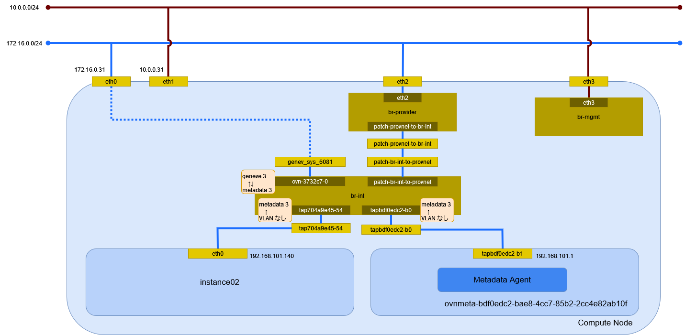

# インスタンスの作成 (geneve/Open Virtual Network)

geneve ネットワーク(Open Virtual Network)に接続するインスタンスを作成する。

## 前提条件

* [](../network/ovn_geneve) を作成していること。
* flavor [](../flavor/m1_milli) を作成していること。
* イメージ [](../../installation/controller/glance) でイメージを作成していること。
* [](../sshkey/keypair.md) を作成していること。
* セキュリティグループのルール [](../security_group/icmp) を作成していること。
* セキュリティグループのルール [](../security_group/ssh) を作成していること。

## インスタンスの作成

```{tip}
myuser で実行
```

インスタンス instance02 を作成する。

```sh
openstack server create \
    --flavor m1.milli \
    --image cirros062 \
    --nic net-id=bdf0edc2-bae8-4cc7-85b2-2cc4e82ab10f \
    --security-group mysecurity \
    --key-name mykey \
    instance02
```

```text
+--------------------------------------+--------------------------------------------------+
| Field                                | Value                                            |
+--------------------------------------+--------------------------------------------------+
| OS-DCF:diskConfig                    | MANUAL                                           |
| OS-EXT-AZ:availability_zone          |                                                  |
| OS-EXT-SRV-ATTR:host                 | None                                             |
| OS-EXT-SRV-ATTR:hypervisor_hostname  | None                                             |
| OS-EXT-SRV-ATTR:instance_name        |                                                  |
| OS-EXT-STS:power_state               | NOSTATE                                          |
| OS-EXT-STS:task_state                | scheduling                                       |
| OS-EXT-STS:vm_state                  | building                                         |
| OS-SRV-USG:launched_at               | None                                             |
| OS-SRV-USG:terminated_at             | None                                             |
| accessIPv4                           |                                                  |
| accessIPv6                           |                                                  |
| addresses                            |                                                  |
| adminPass                            | vM2AxULWmx3H                                     |
| config_drive                         |                                                  |
| created                              | 2024-06-05T14:00:34Z                             |
| flavor                               | m1.milli (1)                                     |
| hostId                               |                                                  |
| id                                   | 0300fe58-123b-4b40-a077-82998ae5f48f             |
| image                                | cirros062 (73701ad4-4c9b-4062-8c64-954342fc449a) |
| key_name                             | mykey                                            |
| name                                 | instance02                                       |
| os-extended-volumes:volumes_attached | []                                               |
| progress                             | 0                                                |
| project_id                           | bccf406c045d401b91ba5c7552a124ae                 |
| properties                           |                                                  |
| security_groups                      | name='e755eda1-c654-42b8-b20e-3de46ce4f0d6'      |
| status                               | BUILD                                            |
| updated                              | 2024-06-05T14:00:34Z                             |
| user_id                              | 7f3acb28d26943bab9510df3a6edf3b0                 |
+--------------------------------------+--------------------------------------------------+
```

## インスタンスの確認

インスタンスが ACTIVE になったことを確認する。

```sh
openstack server list
```

```text
+--------------------------------------+------------+---------+------------------------------+-----------+----------+
| ID                                   | Name       | Status  | Networks                     | Image     | Flavor   |
+--------------------------------------+------------+---------+------------------------------+-----------+----------+
| 0300fe58-123b-4b40-a077-82998ae5f48f | instance02 | ACTIVE  | selfservice=192.168.101.140  | cirros062 | m1.milli |
+--------------------------------------+------------+---------+------------------------------+-----------+----------+
```

## 環境の確認

### インスタンス

Compute Node で確認する。

```sh
virsh list
```

```text
 Id   名前                状態
----------------------------------
 1    instance-00000003   実行中
```

ネットワークインターフェイスの設定を確認する。

```sh
virsh dumpxml 1 | sed -n -e '/<interface/,/<\/interface>/ { p }'
```

```xml
<interface type='ethernet'>
  <mac address='fa:16:3e:1a:d0:3d'/>
  <target dev='tap704a9e45-54'/>
  <model type='virtio'/>
  <driver name='qemu'/>
  <mtu size='1442'/>
  <alias name='net0'/>
  <address type='pci' domain='0x0000' bus='0x00' slot='0x03' function='0x0'/>
</interface>
```

### Controller Node

#### ネットワーク名前空間

ネットワーク名前空間は作成されない。

#### デバイス

トンネルデバイスが追加される。

```sh
ip -d link show
```

```text
1: lo: <LOOPBACK,UP,LOWER_UP> mtu 65536 qdisc noqueue state UNKNOWN mode DEFAULT group default qlen 1000
    link/loopback 00:00:00:00:00:00 brd 00:00:00:00:00:00 promiscuity 0  allmulti 0 minmtu 0 maxmtu 0 addrgenmode eui64 numtxqueues 1 numrxqueues 1 gso_max_size 65536 gso_max_segs 65535 tso_max_size 524280 tso_max_segs 65535 gro_max_size 65536
2: eth0: <BROADCAST,MULTICAST,UP,LOWER_UP> mtu 1500 qdisc mq state UP mode DEFAULT group default qlen 1000
    link/ether 00:15:5d:bf:ba:4f brd ff:ff:ff:ff:ff:ff promiscuity 0  allmulti 0 minmtu 68 maxmtu 65521 addrgenmode none numtxqueues 64 numrxqueues 64 gso_max_size 62780 gso_max_segs 65535 tso_max_size 62780 tso_max_segs 65535 gro_max_size 65536 parentbus vmbus parentdev b7c073a0-7837-4a9f-94e7-eba43ef222ef
3: eth1: <BROADCAST,MULTICAST,UP,LOWER_UP> mtu 1500 qdisc mq state UP mode DEFAULT group default qlen 1000
    link/ether 00:15:5d:bf:ba:54 brd ff:ff:ff:ff:ff:ff promiscuity 0  allmulti 0 minmtu 68 maxmtu 65521 addrgenmode none numtxqueues 64 numrxqueues 64 gso_max_size 62780 gso_max_segs 65535 tso_max_size 62780 tso_max_segs 65535 gro_max_size 65536 parentbus vmbus parentdev 0f15ccb6-3ab3-45ce-b737-a73ecf5a6339
4: eth2: <BROADCAST,MULTICAST,UP,LOWER_UP> mtu 1500 qdisc mq master ovs-system state UP mode DEFAULT group default qlen 1000
    link/ether 00:15:5d:bf:ba:55 brd ff:ff:ff:ff:ff:ff promiscuity 1  allmulti 0 minmtu 68 maxmtu 65521
    openvswitch_slave addrgenmode none numtxqueues 64 numrxqueues 64 gso_max_size 62780 gso_max_segs 65535 tso_max_size 62780 tso_max_segs 65535 gro_max_size 65536 parentbus vmbus parentdev dffbd9a0-19dd-44c1-9b46-6dfba9829d73
5: eth3: <BROADCAST,MULTICAST,UP,LOWER_UP> mtu 1500 qdisc mq master ovs-system state UP mode DEFAULT group default qlen 1000
    link/ether 00:15:5d:bf:ba:56 brd ff:ff:ff:ff:ff:ff promiscuity 1  allmulti 0 minmtu 68 maxmtu 65521
    openvswitch_slave addrgenmode none numtxqueues 64 numrxqueues 64 gso_max_size 62780 gso_max_segs 65535 tso_max_size 62780 tso_max_segs 65535 gro_max_size 65536 parentbus vmbus parentdev 31e9f926-7af1-481e-bf58-cbca38bc3cba
6: ovs-system: <BROADCAST,MULTICAST> mtu 1500 qdisc noop state DOWN mode DEFAULT group default qlen 1000
    link/ether c2:2d:0e:12:4c:31 brd ff:ff:ff:ff:ff:ff promiscuity 1  allmulti 0 minmtu 68 maxmtu 65535
    openvswitch addrgenmode eui64 numtxqueues 1 numrxqueues 1 gso_max_size 65536 gso_max_segs 65535 tso_max_size 65536 tso_max_segs 65535 gro_max_size 65536
7: br-int: <BROADCAST,MULTICAST,UP,LOWER_UP> mtu 1500 qdisc noqueue state UNKNOWN mode DEFAULT group default qlen 1000
    link/ether 16:5d:99:54:ca:d3 brd ff:ff:ff:ff:ff:ff promiscuity 1  allmulti 0 minmtu 68 maxmtu 65535
    openvswitch addrgenmode none numtxqueues 1 numrxqueues 1 gso_max_size 65536 gso_max_segs 65535 tso_max_size 65536 tso_max_segs 65535 gro_max_size 65536
8: genev_sys_6081: <BROADCAST,MULTICAST,UP,LOWER_UP> mtu 65000 qdisc noqueue master ovs-system state UNKNOWN mode DEFAULT group default qlen 1000
    link/ether 7a:69:b2:12:67:91 brd ff:ff:ff:ff:ff:ff promiscuity 1  allmulti 0 minmtu 68 maxmtu 65465
    geneve external id 0 ttl auto dstport 6081 udp6zerocsumrx
    openvswitch_slave addrgenmode eui64 numtxqueues 1 numrxqueues 1 gso_max_size 65536 gso_max_segs 65535 tso_max_size 65536 tso_max_segs 65535 gro_max_size 65536
```

#### Northband データベース

ポートを確認する。

```sh
ovn-nbctl list Logical_Switch_Port
```

```text
_uuid               : cbb50839-47b5-4e8a-9522-92e89442bb9f
addresses           : ["fa:16:3e:d8:6c:ea 192.168.100.110"]
dhcpv4_options      : 8cd29b3d-d50d-479d-803b-044caf31c6bb
dhcpv6_options      : []
dynamic_addresses   : []
enabled             : true
external_ids        : {"neutron:cidrs"="192.168.100.110/24", "neutron:device_id"="fd33d520-f540-44de-b864-ec5b05cd8f62", "neutron:device_owner"="compute:nova", "neutron:mtu"="", "neutron:network_name"=neutron-4cd45e0c-7e56-48e8-b8fb-9105f1e3a57b, "neutron:port_capabilities"="", "neutron:port_name"="", "neutron:project_id"=bccf406c045d401b91ba5c7552a124ae, "neutron:revision_number"="7", "neutron:security_group_ids"="e755eda1-c654-42b8-b20e-3de46ce4f0d6", "neutron:subnet_pool_addr_scope4"="", "neutron:subnet_pool_addr_scope6"="", "neutron:vnic_type"=normal}
ha_chassis_group    : []
mirror_rules        : []
name                : "0600145a-d509-4aa9-b6b2-98f117f1b48c"
options             : {requested-chassis=compute.home.local}
parent_name         : []
port_security       : ["fa:16:3e:d8:6c:ea 192.168.100.110"]
tag                 : []
tag_request         : []
type                : ""
up                  : false

_uuid               : 074989b2-08f9-426d-b241-ab95397acd26
addresses           : [unknown]
dhcpv4_options      : []
dhcpv6_options      : []
dynamic_addresses   : []
enabled             : []
external_ids        : {}
ha_chassis_group    : []
mirror_rules        : []
name                : provnet-355c0afa-9deb-481b-80f3-bec71cd73238
options             : {localnet_learn_fdb="false", mcast_flood="false", mcast_flood_reports="true", network_name=provider}
parent_name         : []
port_security       : []
tag                 : 100
tag_request         : []
type                : localnet
up                  : false

_uuid               : 6679b27b-68b5-42e6-9053-2dd493b252d9
addresses           : [unknown]
dhcpv4_options      : []
dhcpv6_options      : []
dynamic_addresses   : []
enabled             : []
external_ids        : {}
ha_chassis_group    : []
mirror_rules        : []
name                : provnet-ac334841-8877-453f-91de-38264a45b3bf
options             : {localnet_learn_fdb="false", mcast_flood="false", mcast_flood_reports="true", network_name=provider}
parent_name         : []
port_security       : []
tag                 : []
tag_request         : []
type                : localnet
up                  : false

_uuid               : 85fb967c-89c3-49ac-970d-f1c008cfa476
addresses           : ["fa:16:3e:61:51:6f 172.16.0.100"]
dhcpv4_options      : []
dhcpv6_options      : []
dynamic_addresses   : []
enabled             : true
external_ids        : {"neutron:cidrs"="172.16.0.100/24", "neutron:device_id"=ovnmeta-a6370456-5bb9-4dde-8b73-3fe5ba0c414a, "neutron:device_owner"="network:distributed", "neutron:mtu"="", "neutron:network_name"=neutron-a6370456-5bb9-4dde-8b73-3fe5ba0c414a, "neutron:port_capabilities"="", "neutron:port_name"="", "neutron:project_id"=be94f4411bd74f249f5e25f642209b82, "neutron:revision_number"="2", "neutron:security_group_ids"="", "neutron:subnet_pool_addr_scope4"="", "neutron:subnet_pool_addr_scope6"="", "neutron:vnic_type"=normal}
ha_chassis_group    : []
mirror_rules        : []
name                : "465fdd06-6fa7-4fb9-8d66-35595337ff6a"
options             : {}
parent_name         : []
port_security       : []
tag                 : []
tag_request         : []
type                : localport
up                  : false

_uuid               : b189b7bc-37e8-499e-870a-41183b5d8a38
addresses           : ["fa:16:3e:86:28:42 192.168.101.1"]
dhcpv4_options      : []
dhcpv6_options      : []
dynamic_addresses   : []
enabled             : true
external_ids        : {"neutron:cidrs"="192.168.101.1/24", "neutron:device_id"=ovnmeta-bdf0edc2-bae8-4cc7-85b2-2cc4e82ab10f, "neutron:device_owner"="network:distributed", "neutron:mtu"="", "neutron:network_name"=neutron-bdf0edc2-bae8-4cc7-85b2-2cc4e82ab10f, "neutron:port_capabilities"="", "neutron:port_name"="", "neutron:project_id"=bccf406c045d401b91ba5c7552a124ae, "neutron:revision_number"="2", "neutron:security_group_ids"="", "neutron:subnet_pool_addr_scope4"="", "neutron:subnet_pool_addr_scope6"="", "neutron:vnic_type"=normal}
ha_chassis_group    : []
mirror_rules        : []
name                : "44b8ac53-5887-4002-88f0-8f6bcd0e462d"
options             : {}
parent_name         : []
port_security       : []
tag                 : []
tag_request         : []
type                : localport
up                  : false

_uuid               : e0be3de6-c47d-441f-8cfb-773f7bd486de
addresses           : ["fa:16:3e:40:be:99 192.168.100.1"]
dhcpv4_options      : []
dhcpv6_options      : []
dynamic_addresses   : []
enabled             : true
external_ids        : {"neutron:cidrs"="192.168.100.1/24", "neutron:device_id"=ovnmeta-4cd45e0c-7e56-48e8-b8fb-9105f1e3a57b, "neutron:device_owner"="network:distributed", "neutron:mtu"="", "neutron:network_name"=neutron-4cd45e0c-7e56-48e8-b8fb-9105f1e3a57b, "neutron:port_capabilities"="", "neutron:port_name"="", "neutron:project_id"=be94f4411bd74f249f5e25f642209b82, "neutron:revision_number"="2", "neutron:security_group_ids"="", "neutron:subnet_pool_addr_scope4"="", "neutron:subnet_pool_addr_scope6"="", "neutron:vnic_type"=normal}
ha_chassis_group    : []
mirror_rules        : []
name                : "95713f3e-f936-4ede-895f-2d176d4c80d6"
options             : {}
parent_name         : []
port_security       : []
tag                 : []
tag_request         : []
type                : localport
up                  : false

_uuid               : ecb65006-83b0-4ea7-b13e-82716a148266
addresses           : ["fa:16:3e:1a:d0:3d 192.168.101.140"]
dhcpv4_options      : a1b1aede-42f0-49dd-acbd-d149ae11d461
dhcpv6_options      : []
dynamic_addresses   : []
enabled             : true
external_ids        : {"neutron:cidrs"="192.168.101.140/24", "neutron:device_id"="0300fe58-123b-4b40-a077-82998ae5f48f", "neutron:device_owner"="compute:nova", "neutron:host_id"=compute.home.local, "neutron:mtu"="", "neutron:network_name"=neutron-bdf0edc2-bae8-4cc7-85b2-2cc4e82ab10f, "neutron:port_capabilities"="", "neutron:port_name"="", "neutron:project_id"=bccf406c045d401b91ba5c7552a124ae, "neutron:revision_number"="4", "neutron:security_group_ids"="e755eda1-c654-42b8-b20e-3de46ce4f0d6", "neutron:subnet_pool_addr_scope4"="", "neutron:subnet_pool_addr_scope6"="", "neutron:vnic_type"=normal}
ha_chassis_group    : []
mirror_rules        : []
name                : "704a9e45-546b-43d1-9c73-44c8114e382d"
options             : {requested-chassis=compute.home.local}
parent_name         : []
port_security       : ["fa:16:3e:1a:d0:3d 192.168.101.140"]
tag                 : []
tag_request         : []
type                : ""
up                  : true

_uuid               : 828bd457-bc02-41fd-8d00-920aeb428579
addresses           : ["fa:16:3e:60:25:8b 172.16.0.150"]
dhcpv4_options      : 98a75115-7d53-41a2-98b4-7bfb0e7dcb40
dhcpv6_options      : []
dynamic_addresses   : []
enabled             : true
external_ids        : {"neutron:cidrs"="172.16.0.150/24", "neutron:device_id"="8a554d0a-23b0-45ba-abec-a9838abad910", "neutron:device_owner"="compute:nova", "neutron:mtu"="", "neutron:network_name"=neutron-a6370456-5bb9-4dde-8b73-3fe5ba0c414a, "neutron:port_capabilities"="", "neutron:port_name"="", "neutron:project_id"=bccf406c045d401b91ba5c7552a124ae, "neutron:revision_number"="7", "neutron:security_group_ids"="e755eda1-c654-42b8-b20e-3de46ce4f0d6", "neutron:subnet_pool_addr_scope4"="", "neutron:subnet_pool_addr_scope6"="", "neutron:vnic_type"=normal}
ha_chassis_group    : []
mirror_rules        : []
name                : "c5301737-8878-46c5-b259-be909011f572"
options             : {requested-chassis=compute.home.local}
parent_name         : []
port_security       : ["fa:16:3e:60:25:8b 172.16.0.150"]
tag                 : []
tag_request         : []
type                : ""
up                  : false
```

DHCP オプションを確認する。

```sh
ovn-nbctl list DHCP_options a1b1aede-42f0-49dd-acbd-d149ae11d461
```

```text
_uuid               : a1b1aede-42f0-49dd-acbd-d149ae11d461
cidr                : "192.168.101.0/24"
external_ids        : {"neutron:revision_number"="0", subnet_id="f05c07d3-64de-48d6-ae17-bac8a885514d"}
options             : {classless_static_route="{169.254.169.254/32,192.168.101.1, 0.0.0.0/0,192.168.101.254}", dns_server="{10.0.0.254}", lease_time="43200", mtu="1442", router="192.168.101.254", server_id="192.168.101.254", server_mac="fa:16:3e:8e:7f:28"}
```

セキュリティグループの設定を確認する。

```sh
ovn-nbctl list ACL
```

```text
_uuid               : 3b1768c2-3f33-4e57-a614-427811758daf
action              : drop
direction           : from-lport
external_ids        : {}
label               : 0
log                 : false
match               : "inport == @neutron_pg_drop && ip"
meter               : []
name                : []
options             : {}
priority            : 1001
severity            : []
tier                : 0

_uuid               : 1c39cfa2-5d52-4cdc-a7ef-56a14d5e42a3
action              : allow-related
direction           : to-lport
external_ids        : {"neutron:security_group_rule_id"="3daa7461-f8a6-4f74-973a-890eaa4ada2e"}
label               : 0
log                 : false
match               : "outport == @pg_e755eda1_c654_42b8_b20e_3de46ce4f0d6 && ip4 && ip4.src == 0.0.0.0/0 && tcp && tcp.dst == 22"
meter               : []
name                : []
options             : {}
priority            : 1002
severity            : []
tier                : 0

_uuid               : 6c5f59b3-6eae-4662-bcdf-3088eaf83095
action              : allow-related
direction           : to-lport
external_ids        : {"neutron:security_group_rule_id"="41a78521-61f9-4a1a-8148-7d5b7eb38219"}
label               : 0
log                 : false
match               : "outport == @pg_10343956_af05_47e3_8a7a_8022d9a85945 && ip6 && ip6.src == $pg_10343956_af05_47e3_8a7a_8022d9a85945_ip6"
meter               : []
name                : []
options             : {}
priority            : 1002
severity            : []
tier                : 0

_uuid               : b64ae363-822d-410c-aafe-bf59fe698ff3
action              : allow-related
direction           : to-lport
external_ids        : {"neutron:security_group_rule_id"="063e0266-5536-47d0-9052-2768ad156d4d"}
label               : 0
log                 : false
match               : "outport == @pg_71548bf7_6c79_4651_a654_de929f1691fa && ip6 && ip6.src == $pg_71548bf7_6c79_4651_a654_de929f1691fa_ip6"
meter               : []
name                : []
options             : {}
priority            : 1002
severity            : []
tier                : 0

_uuid               : 2e9f13d4-032a-4301-a04a-5551d0e792ad
action              : allow-related
direction           : from-lport
external_ids        : {"neutron:security_group_rule_id"="ef2b2f41-234d-4693-b427-a9fcfeea849d"}
label               : 0
log                 : false
match               : "inport == @pg_10343956_af05_47e3_8a7a_8022d9a85945 && ip6"
meter               : []
name                : []
options             : {}
priority            : 1002
severity            : []
tier                : 0

_uuid               : 7c77ec24-e614-4119-80c1-c024bc263162
action              : allow-related
direction           : to-lport
external_ids        : {"neutron:security_group_rule_id"="95520c21-b41b-4667-91bf-15ef636b63b8"}
label               : 0
log                 : false
match               : "outport == @pg_f15eed75_3115_4f88_91e5_e8bf81d9ccd6 && ip6 && ip6.src == $pg_f15eed75_3115_4f88_91e5_e8bf81d9ccd6_ip6"
meter               : []
name                : []
options             : {}
priority            : 1002
severity            : []
tier                : 0

_uuid               : 40c004b4-55c6-4959-8448-bbbd49c3c86e
action              : allow-related
direction           : from-lport
external_ids        : {"neutron:security_group_rule_id"="51f5cc64-832c-4f7b-ba25-cfc97bda2bd2"}
label               : 0
log                 : false
match               : "inport == @pg_71548bf7_6c79_4651_a654_de929f1691fa && ip4"
meter               : []
name                : []
options             : {}
priority            : 1002
severity            : []
tier                : 0

_uuid               : 929a5155-84ea-45c9-baa9-526106d5275f
action              : allow-related
direction           : to-lport
external_ids        : {"neutron:security_group_rule_id"="35a0af20-6c5a-4f25-bf44-82bfd31537df"}
label               : 0
log                 : false
match               : "outport == @pg_e755eda1_c654_42b8_b20e_3de46ce4f0d6 && ip4 && ip4.src == 0.0.0.0/0 && icmp4"
meter               : []
name                : []
options             : {}
priority            : 1002
severity            : []
tier                : 0

_uuid               : 94b5f2c5-c4d0-43be-ba30-a0e78a96143d
action              : allow-related
direction           : to-lport
external_ids        : {"neutron:security_group_rule_id"="c50fe200-05ef-4471-a281-f2f8088ea0df"}
label               : 0
log                 : false
match               : "outport == @pg_f15eed75_3115_4f88_91e5_e8bf81d9ccd6 && ip4 && ip4.src == $pg_f15eed75_3115_4f88_91e5_e8bf81d9ccd6_ip4"
meter               : []
name                : []
options             : {}
priority            : 1002
severity            : []
tier                : 0

_uuid               : 66e0bc49-3b4f-4f64-a629-b51dac3a1c8e
action              : allow-related
direction           : from-lport
external_ids        : {"neutron:security_group_rule_id"="d846ef1a-2b50-404f-999e-2e228feb94f3"}
label               : 0
log                 : false
match               : "inport == @pg_f15eed75_3115_4f88_91e5_e8bf81d9ccd6 && ip4"
meter               : []
name                : []
options             : {}
priority            : 1002
severity            : []
tier                : 0

_uuid               : d2413d59-4e1a-4585-b1f0-267b763f3d0b
action              : allow-related
direction           : from-lport
external_ids        : {"neutron:security_group_rule_id"="2f926dd1-f804-42dd-8660-31c201486a93"}
label               : 0
log                 : false
match               : "inport == @pg_10343956_af05_47e3_8a7a_8022d9a85945 && ip4"
meter               : []
name                : []
options             : {}
priority            : 1002
severity            : []
tier                : 0

_uuid               : b193c259-56dd-49b4-9374-d7c633d49dab
action              : allow-related
direction           : from-lport
external_ids        : {"neutron:security_group_rule_id"="88eed247-c4a2-4451-a866-4c1dd7fde528"}
label               : 0
log                 : false
match               : "inport == @pg_71548bf7_6c79_4651_a654_de929f1691fa && ip6"
meter               : []
name                : []
options             : {}
priority            : 1002
severity            : []
tier                : 0

_uuid               : 353b8d1a-4558-46f1-af17-476aafaf3947
action              : allow-related
direction           : to-lport
external_ids        : {"neutron:security_group_rule_id"="8be951ec-1a94-427c-a609-35f9919f8218"}
label               : 0
log                 : false
match               : "outport == @pg_71548bf7_6c79_4651_a654_de929f1691fa && ip4 && ip4.src == $pg_71548bf7_6c79_4651_a654_de929f1691fa_ip4"
meter               : []
name                : []
options             : {}
priority            : 1002
severity            : []
tier                : 0

_uuid               : 3fcf94cb-f999-42b2-9363-6e64cb5ec3e8
action              : allow-related
direction           : from-lport
external_ids        : {"neutron:security_group_rule_id"="bf2c1b55-78b9-4b8a-97d6-29e5c360382d"}
label               : 0
log                 : false
match               : "inport == @pg_f15eed75_3115_4f88_91e5_e8bf81d9ccd6 && ip6"
meter               : []
name                : []
options             : {}
priority            : 1002
severity            : []
tier                : 0

_uuid               : 84a9632c-5658-4982-8f1d-7a161ba80fe3
action              : allow-related
direction           : from-lport
external_ids        : {"neutron:security_group_rule_id"="509fa51e-1f6e-46d0-af4c-f9038fd7b41d"}
label               : 0
log                 : false
match               : "inport == @pg_e755eda1_c654_42b8_b20e_3de46ce4f0d6 && ip4"
meter               : []
name                : []
options             : {}
priority            : 1002
severity            : []
tier                : 0

_uuid               : 85cb986e-6a8d-4b60-8b76-24459a480b32
action              : allow-related
direction           : from-lport
external_ids        : {"neutron:security_group_rule_id"="a9985b01-df20-40f5-924a-f8d5de6353b6"}
label               : 0
log                 : false
match               : "inport == @pg_e755eda1_c654_42b8_b20e_3de46ce4f0d6 && ip6"
meter               : []
name                : []
options             : {}
priority            : 1002
severity            : []
tier                : 0

_uuid               : 64fbccaf-1326-4a91-8ac6-5b1ff4ecc4e0
action              : allow-related
direction           : to-lport
external_ids        : {"neutron:security_group_rule_id"="748ef95f-0095-4065-b97f-5d27a601ffcb"}
label               : 0
log                 : false
match               : "outport == @pg_10343956_af05_47e3_8a7a_8022d9a85945 && ip4 && ip4.src == $pg_10343956_af05_47e3_8a7a_8022d9a85945_ip4"
meter               : []
name                : []
options             : {}
priority            : 1002
severity            : []
tier                : 0

_uuid               : 3c8b2fef-ddd1-4040-8e26-ea373222b198
action              : drop
direction           : to-lport
external_ids        : {}
label               : 0
log                 : false
match               : "outport == @neutron_pg_drop && ip"
meter               : []
name                : []
options             : {}
priority            : 1001
severity            : []
tier                : 0
```

#### Southbound データベース

アドレスセットを確認する。

```sh
ovn-sbctl list Address_Set
```

```text
_uuid               : ed6f71d0-a79f-4549-b786-0f8e2eb6c3e2
addresses           : []
name                : pg_f15eed75_3115_4f88_91e5_e8bf81d9ccd6_ip6

_uuid               : d0cae968-1582-4c82-8324-88900c57b6ec
addresses           : ["2a:91:79:ab:04:2d"]
name                : svc_monitor_mac

_uuid               : 11f9d440-b848-436b-89a8-15b0a7474cc5
addresses           : []
name                : pg_10343956_af05_47e3_8a7a_8022d9a85945_ip6

_uuid               : 48622941-52b5-4004-9902-017f0132983e
addresses           : ["172.16.0.150", "192.168.100.110", "192.168.101.140"]
name                : pg_e755eda1_c654_42b8_b20e_3de46ce4f0d6_ip4

_uuid               : cac73772-2d0f-4822-956f-3e990400a34e
addresses           : []
name                : pg_71548bf7_6c79_4651_a654_de929f1691fa_ip6

_uuid               : 8c00b67a-a5af-4829-8b0f-aefcd6c5abd7
addresses           : []
name                : pg_10343956_af05_47e3_8a7a_8022d9a85945_ip4

_uuid               : 263f2fbb-fb53-4846-ad48-52c586f8e77b
addresses           : []
name                : pg_71548bf7_6c79_4651_a654_de929f1691fa_ip4

_uuid               : a0eda553-388f-4810-b31e-63d7edf879f8
addresses           : ["172.16.0.150", "192.168.100.110", "192.168.101.140"]
name                : neutron_pg_drop_ip4

_uuid               : c05a5b6d-d213-44ff-acf2-cc9b6b969a5e
addresses           : []
name                : pg_e755eda1_c654_42b8_b20e_3de46ce4f0d6_ip6

_uuid               : 840d070d-12a7-4434-8047-95526f7b0186
addresses           : []
name                : neutron_pg_drop_ip6

_uuid               : b2aee7bf-398f-4f7a-8439-376c22dc621e
addresses           : []
name                : pg_f15eed75_3115_4f88_91e5_e8bf81d9ccd6_ip4
```

フローを確認する。

```sh
ovn-sbctl lflow-list
```

```text
Datapath: "neutron-4cd45e0c-7e56-48e8-b8fb-9105f1e3a57b" aka "provider-100" (500824d6-0f14-41d3-b33d-0ea0eaac34ff)  Pipeline: ingress
  table=0 (ls_in_check_port_sec), priority=110  , match=(((ip4 && icmp4.type == 3 && icmp4.code == 4) || (ip6 && icmp6.type == 2 && icmp6.code == 0)) && flags.tunnel_rx == 1), action=(drop;)
  table=0 (ls_in_check_port_sec), priority=100  , match=(eth.src[40]), action=(drop;)
  table=0 (ls_in_check_port_sec), priority=100  , match=(vlan.present), action=(drop;)
  table=0 (ls_in_check_port_sec), priority=50   , match=(1), action=(reg0[15] = check_in_port_sec(); next;)
  table=1 (ls_in_apply_port_sec), priority=50   , match=(reg0[15] == 1), action=(drop;)
  table=1 (ls_in_apply_port_sec), priority=0    , match=(1), action=(next;)
  table=2 (ls_in_lookup_fdb   ), priority=0    , match=(1), action=(next;)
  table=3 (ls_in_put_fdb      ), priority=0    , match=(1), action=(next;)
  table=4 (ls_in_pre_acl      ), priority=110  , match=(eth.dst == $svc_monitor_mac), action=(next;)
  table=4 (ls_in_pre_acl      ), priority=110  , match=(eth.mcast), action=(next;)
  table=4 (ls_in_pre_acl      ), priority=110  , match=(ip && inport == "provnet-355c0afa-9deb-481b-80f3-bec71cd73238"), action=(next;)
  table=4 (ls_in_pre_acl      ), priority=110  , match=(nd || nd_rs || nd_ra || mldv1 || mldv2 || (udp && udp.src == 546 && udp.dst == 547)), action=(next;)
  table=4 (ls_in_pre_acl      ), priority=100  , match=(ip), action=(reg0[0] = 1; next;)
  table=4 (ls_in_pre_acl      ), priority=0    , match=(1), action=(next;)
  table=5 (ls_in_pre_lb       ), priority=110  , match=(eth.dst == $svc_monitor_mac), action=(next;)
  table=5 (ls_in_pre_lb       ), priority=110  , match=(eth.mcast), action=(next;)
  table=5 (ls_in_pre_lb       ), priority=110  , match=(ip && inport == "provnet-355c0afa-9deb-481b-80f3-bec71cd73238"), action=(next;)
  table=5 (ls_in_pre_lb       ), priority=110  , match=(nd || nd_rs || nd_ra || mldv1 || mldv2), action=(next;)
  table=5 (ls_in_pre_lb       ), priority=110  , match=(reg0[16] == 1), action=(next;)
  table=5 (ls_in_pre_lb       ), priority=0    , match=(1), action=(next;)
  table=6 (ls_in_pre_stateful ), priority=110  , match=(reg0[2] == 1), action=(ct_lb_mark;)
  table=6 (ls_in_pre_stateful ), priority=100  , match=(reg0[0] == 1), action=(ct_next;)
  table=6 (ls_in_pre_stateful ), priority=0    , match=(1), action=(next;)
  table=7 (ls_in_acl_hint     ), priority=7    , match=(ct.new && !ct.est), action=(reg0[7] = 1; reg0[9] = 1; next;)
  table=7 (ls_in_acl_hint     ), priority=6    , match=(!ct.new && ct.est && !ct.rpl && ct_mark.blocked == 1), action=(reg0[7] = 1; reg0[9] = 1; next;)
  table=7 (ls_in_acl_hint     ), priority=5    , match=(!ct.trk), action=(reg0[8] = 1; reg0[9] = 1; next;)
  table=7 (ls_in_acl_hint     ), priority=4    , match=(!ct.new && ct.est && !ct.rpl && ct_mark.blocked == 0), action=(reg0[8] = 1; reg0[10] = 1; next;)
  table=7 (ls_in_acl_hint     ), priority=3    , match=(!ct.est), action=(reg0[9] = 1; next;)
  table=7 (ls_in_acl_hint     ), priority=2    , match=(ct.est && ct_mark.blocked == 1), action=(reg0[9] = 1; next;)
  table=7 (ls_in_acl_hint     ), priority=1    , match=(ct.est && ct_mark.blocked == 0), action=(reg0[10] = 1; next;)
  table=7 (ls_in_acl_hint     ), priority=0    , match=(1), action=(next;)
  table=8 (ls_in_acl_eval     ), priority=65532, match=(!ct.est && ct.rel && !ct.new && !ct.inv && ct_mark.blocked == 0), action=(reg0[17] = 1; reg8[16] = 1; ct_commit_nat;)
  table=8 (ls_in_acl_eval     ), priority=65532, match=(ct.est && !ct.rel && !ct.new && !ct.inv && ct.rpl && ct_mark.blocked == 0), action=(reg0[9] = 0; reg0[10] = 0; reg0[17] = 1; reg8[16] = 1; next;)
  table=8 (ls_in_acl_eval     ), priority=65532, match=(ct.inv || (ct.est && ct.rpl && ct_mark.blocked == 1)), action=(reg8[17] = 1; next;)
  table=8 (ls_in_acl_eval     ), priority=65532, match=(nd || nd_ra || nd_rs || mldv1 || mldv2), action=(reg8[16] = 1; next;)
  table=8 (ls_in_acl_eval     ), priority=34000, match=(eth.dst == $svc_monitor_mac), action=(reg8[16] = 1; next;)
  table=8 (ls_in_acl_eval     ), priority=2002 , match=(reg0[7] == 1 && (inport == @pg_e755eda1_c654_42b8_b20e_3de46ce4f0d6 && ip4)), action=(reg8[16] = 1; reg0[1] = 1; next;)
  table=8 (ls_in_acl_eval     ), priority=2002 , match=(reg0[7] == 1 && (inport == @pg_e755eda1_c654_42b8_b20e_3de46ce4f0d6 && ip6)), action=(reg8[16] = 1; reg0[1] = 1; next;)
  table=8 (ls_in_acl_eval     ), priority=2002 , match=(reg0[8] == 1 && (inport == @pg_e755eda1_c654_42b8_b20e_3de46ce4f0d6 && ip4)), action=(reg8[16] = 1; next;)
  table=8 (ls_in_acl_eval     ), priority=2002 , match=(reg0[8] == 1 && (inport == @pg_e755eda1_c654_42b8_b20e_3de46ce4f0d6 && ip6)), action=(reg8[16] = 1; next;)
  table=8 (ls_in_acl_eval     ), priority=2001 , match=(reg0[10] == 1 && (inport == @neutron_pg_drop && ip)), action=(reg8[17] = 1; ct_commit { ct_mark.blocked = 1; }; next;)
  table=8 (ls_in_acl_eval     ), priority=2001 , match=(reg0[9] == 1 && (inport == @neutron_pg_drop && ip)), action=(reg8[17] = 1; next;)
  table=8 (ls_in_acl_eval     ), priority=1    , match=(ip && !ct.est), action=(reg0[1] = 1; next;)
  table=8 (ls_in_acl_eval     ), priority=1    , match=(ip && ct.est && ct_mark.blocked == 1), action=(reg0[1] = 1; reg8[16] = 1; next;)
  table=8 (ls_in_acl_eval     ), priority=0    , match=(1), action=(next;)
  table=9 (ls_in_acl_action   ), priority=1000 , match=(reg8[16] == 1), action=(reg8[16] = 0; reg8[17] = 0; reg8[18] = 0; next;)
  table=9 (ls_in_acl_action   ), priority=1000 , match=(reg8[17] == 1), action=(reg8[16] = 0; reg8[17] = 0; reg8[18] = 0; /* drop */)
  table=9 (ls_in_acl_action   ), priority=1000 , match=(reg8[18] == 1), action=(reg8[16] = 0; reg8[17] = 0; reg8[18] = 0; reg0 = 0; reject { /* eth.dst <-> eth.src; ip.dst <-> ip.src; is implicit. */ outport <-> inport; next(pipeline=egress,table=6); };)
  table=9 (ls_in_acl_action   ), priority=0    , match=(1), action=(reg8[16] = 0; reg8[17] = 0; reg8[18] = 0; next;)
  table=10(ls_in_qos_mark     ), priority=0    , match=(1), action=(next;)
  table=11(ls_in_qos_meter    ), priority=0    , match=(1), action=(next;)
  table=12(ls_in_lb_aff_check ), priority=0    , match=(1), action=(next;)
  table=13(ls_in_lb           ), priority=0    , match=(1), action=(next;)
  table=14(ls_in_lb_aff_learn ), priority=0    , match=(1), action=(next;)
  table=15(ls_in_pre_hairpin  ), priority=0    , match=(1), action=(next;)
  table=16(ls_in_nat_hairpin  ), priority=0    , match=(1), action=(next;)
  table=17(ls_in_hairpin      ), priority=0    , match=(1), action=(next;)
  table=18(ls_in_acl_after_lb_eval), priority=65532, match=(nd || nd_ra || nd_rs || mldv1 || mldv2), action=(reg8[16] = 1; next;)
  table=18(ls_in_acl_after_lb_eval), priority=65532, match=(reg0[17] == 1), action=(reg8[16] = 1; next;)
  table=18(ls_in_acl_after_lb_eval), priority=0    , match=(1), action=(next;)
  table=19(ls_in_acl_after_lb_action), priority=1000 , match=(reg8[16] == 1), action=(reg8[16] = 0; reg8[17] = 0; reg8[18] = 0; next;)
  table=19(ls_in_acl_after_lb_action), priority=1000 , match=(reg8[17] == 1), action=(reg8[16] = 0; reg8[17] = 0; reg8[18] = 0; /* drop */)
  table=19(ls_in_acl_after_lb_action), priority=1000 , match=(reg8[18] == 1), action=(reg8[16] = 0; reg8[17] = 0; reg8[18] = 0; reg0 = 0; reject { /* eth.dst <-> eth.src; ip.dst <-> ip.src; is implicit. */ outport <-> inport; next(pipeline=egress,table=6); };)
  table=19(ls_in_acl_after_lb_action), priority=0    , match=(1), action=(reg8[16] = 0; reg8[17] = 0; reg8[18] = 0; next;)
  table=20(ls_in_stateful     ), priority=100  , match=(reg0[1] == 1 && reg0[13] == 0), action=(ct_commit { ct_mark.blocked = 0; }; next;)
  table=20(ls_in_stateful     ), priority=100  , match=(reg0[1] == 1 && reg0[13] == 1), action=(ct_commit { ct_mark.blocked = 0; ct_label.label = reg3; }; next;)
  table=20(ls_in_stateful     ), priority=0    , match=(1), action=(next;)
  table=21(ls_in_arp_rsp      ), priority=100  , match=(arp.tpa == 192.168.100.1 && arp.op == 1 && inport == "95713f3e-f936-4ede-895f-2d176d4c80d6"), action=(next;)
  table=21(ls_in_arp_rsp      ), priority=100  , match=(inport == "provnet-355c0afa-9deb-481b-80f3-bec71cd73238"), action=(next;)
  table=21(ls_in_arp_rsp      ), priority=50   , match=(arp.tpa == 192.168.100.1 && arp.op == 1), action=(eth.dst = eth.src; eth.src = fa:16:3e:40:be:99; arp.op = 2; /* ARP reply */ arp.tha = arp.sha; arp.sha = fa:16:3e:40:be:99; arp.tpa = arp.spa; arp.spa = 192.168.100.1; outport = inport; flags.loopback = 1; output;)
  table=21(ls_in_arp_rsp      ), priority=0    , match=(1), action=(next;)
  table=22(ls_in_dhcp_options ), priority=100  , match=(inport == "0600145a-d509-4aa9-b6b2-98f117f1b48c" && eth.src == fa:16:3e:d8:6c:ea && (ip4.src == {192.168.100.110, 0.0.0.0} && ip4.dst == {192.168.100.254, 255.255.255.255}) && udp.src == 68 && udp.dst == 67), action=(reg0[3] = put_dhcp_opts(offerip = 192.168.100.110, classless_static_route = {169.254.169.254/32,192.168.100.1, 0.0.0.0/0,192.168.100.254}, dns_server = {10.0.0.254}, lease_time = 43200, mtu = 1500, netmask = 255.255.255.0, router = 192.168.100.254, server_id = 192.168.100.254); next;)
  table=22(ls_in_dhcp_options ), priority=0    , match=(1), action=(next;)
  table=23(ls_in_dhcp_response), priority=100  , match=(inport == "0600145a-d509-4aa9-b6b2-98f117f1b48c" && eth.src == fa:16:3e:d8:6c:ea && ip4 && udp.src == 68 && udp.dst == 67 && reg0[3]), action=(eth.dst = eth.src; eth.src = fa:16:3e:81:c0:0b; ip4.src = 192.168.100.254; udp.src = 67; udp.dst = 68; outport = inport; flags.loopback = 1; output;)
  table=23(ls_in_dhcp_response), priority=0    , match=(1), action=(next;)
  table=24(ls_in_dns_lookup   ), priority=0    , match=(1), action=(next;)
  table=25(ls_in_dns_response ), priority=0    , match=(1), action=(next;)
  table=26(ls_in_external_port), priority=0    , match=(1), action=(next;)
  table=27(ls_in_l2_lkup      ), priority=110  , match=(eth.dst == $svc_monitor_mac && (tcp || icmp || icmp6)), action=(handle_svc_check(inport);)
  table=27(ls_in_l2_lkup      ), priority=70   , match=(eth.mcast), action=(outport = "_MC_flood"; output;)
  table=27(ls_in_l2_lkup      ), priority=50   , match=(eth.dst == fa:16:3e:40:be:99), action=(outport = "95713f3e-f936-4ede-895f-2d176d4c80d6"; output;)
  table=27(ls_in_l2_lkup      ), priority=50   , match=(eth.dst == fa:16:3e:d8:6c:ea), action=(outport = "0600145a-d509-4aa9-b6b2-98f117f1b48c"; output;)
  table=27(ls_in_l2_lkup      ), priority=0    , match=(1), action=(outport = get_fdb(eth.dst); next;)
  table=28(ls_in_l2_unknown   ), priority=50   , match=(outport == "none"), action=(outport = "_MC_unknown"; output;)
  table=28(ls_in_l2_unknown   ), priority=0    , match=(1), action=(output;)
Datapath: "neutron-4cd45e0c-7e56-48e8-b8fb-9105f1e3a57b" aka "provider-100" (500824d6-0f14-41d3-b33d-0ea0eaac34ff)  Pipeline: egress
  table=0 (ls_out_pre_acl     ), priority=110  , match=(eth.mcast), action=(next;)
  table=0 (ls_out_pre_acl     ), priority=110  , match=(eth.src == $svc_monitor_mac), action=(next;)
  table=0 (ls_out_pre_acl     ), priority=110  , match=(ip && outport == "provnet-355c0afa-9deb-481b-80f3-bec71cd73238"), action=(next;)
  table=0 (ls_out_pre_acl     ), priority=110  , match=(nd || nd_rs || nd_ra || mldv1 || mldv2 || (udp && udp.src == 546 && udp.dst == 547)), action=(next;)
  table=0 (ls_out_pre_acl     ), priority=100  , match=(ip), action=(reg0[0] = 1; next;)
  table=0 (ls_out_pre_acl     ), priority=0    , match=(1), action=(next;)
  table=1 (ls_out_pre_lb      ), priority=110  , match=(eth.mcast), action=(next;)
  table=1 (ls_out_pre_lb      ), priority=110  , match=(eth.src == $svc_monitor_mac), action=(next;)
  table=1 (ls_out_pre_lb      ), priority=110  , match=(ip && outport == "provnet-355c0afa-9deb-481b-80f3-bec71cd73238"), action=(next;)
  table=1 (ls_out_pre_lb      ), priority=110  , match=(nd || nd_rs || nd_ra || mldv1 || mldv2), action=(next;)
  table=1 (ls_out_pre_lb      ), priority=110  , match=(reg0[16] == 1), action=(next;)
  table=1 (ls_out_pre_lb      ), priority=0    , match=(1), action=(next;)
  table=2 (ls_out_pre_stateful), priority=110  , match=(reg0[2] == 1), action=(ct_lb_mark;)
  table=2 (ls_out_pre_stateful), priority=100  , match=(reg0[0] == 1), action=(ct_next;)
  table=2 (ls_out_pre_stateful), priority=0    , match=(1), action=(next;)
  table=3 (ls_out_acl_hint    ), priority=7    , match=(ct.new && !ct.est), action=(reg0[7] = 1; reg0[9] = 1; next;)
  table=3 (ls_out_acl_hint    ), priority=6    , match=(!ct.new && ct.est && !ct.rpl && ct_mark.blocked == 1), action=(reg0[7] = 1; reg0[9] = 1; next;)
  table=3 (ls_out_acl_hint    ), priority=5    , match=(!ct.trk), action=(reg0[8] = 1; reg0[9] = 1; next;)
  table=3 (ls_out_acl_hint    ), priority=4    , match=(!ct.new && ct.est && !ct.rpl && ct_mark.blocked == 0), action=(reg0[8] = 1; reg0[10] = 1; next;)
  table=3 (ls_out_acl_hint    ), priority=3    , match=(!ct.est), action=(reg0[9] = 1; next;)
  table=3 (ls_out_acl_hint    ), priority=2    , match=(ct.est && ct_mark.blocked == 1), action=(reg0[9] = 1; next;)
  table=3 (ls_out_acl_hint    ), priority=1    , match=(ct.est && ct_mark.blocked == 0), action=(reg0[10] = 1; next;)
  table=3 (ls_out_acl_hint    ), priority=0    , match=(1), action=(next;)
  table=4 (ls_out_acl_eval    ), priority=65532, match=(!ct.est && ct.rel && !ct.new && !ct.inv && ct_mark.blocked == 0), action=(reg8[16] = 1; ct_commit_nat;)
  table=4 (ls_out_acl_eval    ), priority=65532, match=(ct.est && !ct.rel && !ct.new && !ct.inv && ct.rpl && ct_mark.blocked == 0), action=(reg8[16] = 1; next;)
  table=4 (ls_out_acl_eval    ), priority=65532, match=(ct.inv || (ct.est && ct.rpl && ct_mark.blocked == 1)), action=(reg8[17] = 1; next;)
  table=4 (ls_out_acl_eval    ), priority=65532, match=(nd || nd_ra || nd_rs || mldv1 || mldv2), action=(reg8[16] = 1; next;)
  table=4 (ls_out_acl_eval    ), priority=34000, match=(eth.src == $svc_monitor_mac), action=(reg8[16] = 1; next;)
  table=4 (ls_out_acl_eval    ), priority=34000, match=(outport == "0600145a-d509-4aa9-b6b2-98f117f1b48c" && eth.src == fa:16:3e:81:c0:0b && ip4.src == 192.168.100.254 && udp && udp.src == 67 && udp.dst == 68), action=(reg8[16] = 1; next;)
  table=4 (ls_out_acl_eval    ), priority=2002 , match=(reg0[7] == 1 && (outport == @pg_e755eda1_c654_42b8_b20e_3de46ce4f0d6 && ip4 && ip4.src == 0.0.0.0/0 && icmp4)), action=(reg8[16] = 1; reg0[1] = 1; next;)
  table=4 (ls_out_acl_eval    ), priority=2002 , match=(reg0[7] == 1 && (outport == @pg_e755eda1_c654_42b8_b20e_3de46ce4f0d6 && ip4 && ip4.src == 0.0.0.0/0 && tcp && tcp.dst == 22)), action=(reg8[16] = 1; reg0[1] = 1; next;)
  table=4 (ls_out_acl_eval    ), priority=2002 , match=(reg0[8] == 1 && (outport == @pg_e755eda1_c654_42b8_b20e_3de46ce4f0d6 && ip4 && ip4.src == 0.0.0.0/0 && icmp4)), action=(reg8[16] = 1; next;)
  table=4 (ls_out_acl_eval    ), priority=2002 , match=(reg0[8] == 1 && (outport == @pg_e755eda1_c654_42b8_b20e_3de46ce4f0d6 && ip4 && ip4.src == 0.0.0.0/0 && tcp && tcp.dst == 22)), action=(reg8[16] = 1; next;)
  table=4 (ls_out_acl_eval    ), priority=2001 , match=(reg0[10] == 1 && (outport == @neutron_pg_drop && ip)), action=(reg8[17] = 1; ct_commit { ct_mark.blocked = 1; }; next;)
  table=4 (ls_out_acl_eval    ), priority=2001 , match=(reg0[9] == 1 && (outport == @neutron_pg_drop && ip)), action=(reg8[17] = 1; next;)
  table=4 (ls_out_acl_eval    ), priority=1    , match=(ip && !ct.est), action=(reg0[1] = 1; next;)
  table=4 (ls_out_acl_eval    ), priority=1    , match=(ip && ct.est && ct_mark.blocked == 1), action=(reg0[1] = 1; reg8[16] = 1; next;)
  table=4 (ls_out_acl_eval    ), priority=0    , match=(1), action=(next;)
  table=5 (ls_out_acl_action  ), priority=1000 , match=(reg8[16] == 1), action=(reg8[16] = 0; reg8[17] = 0; reg8[18] = 0; next;)
  table=5 (ls_out_acl_action  ), priority=1000 , match=(reg8[17] == 1), action=(reg8[16] = 0; reg8[17] = 0; reg8[18] = 0; /* drop */)
  table=5 (ls_out_acl_action  ), priority=1000 , match=(reg8[18] == 1), action=(reg8[16] = 0; reg8[17] = 0; reg8[18] = 0; reg0 = 0; reject { /* eth.dst <-> eth.src; ip.dst <-> ip.src; is implicit. */ outport <-> inport; next(pipeline=ingress,table=27); };)
  table=5 (ls_out_acl_action  ), priority=0    , match=(1), action=(reg8[16] = 0; reg8[17] = 0; reg8[18] = 0; next;)
  table=6 (ls_out_qos_mark    ), priority=0    , match=(1), action=(next;)
  table=7 (ls_out_qos_meter   ), priority=0    , match=(1), action=(next;)
  table=8 (ls_out_stateful    ), priority=100  , match=(reg0[1] == 1 && reg0[13] == 0), action=(ct_commit { ct_mark.blocked = 0; }; next;)
  table=8 (ls_out_stateful    ), priority=100  , match=(reg0[1] == 1 && reg0[13] == 1), action=(ct_commit { ct_mark.blocked = 0; ct_label.label = reg3; }; next;)
  table=8 (ls_out_stateful    ), priority=0    , match=(1), action=(next;)
  table=9 (ls_out_check_port_sec), priority=100  , match=(eth.mcast), action=(reg0[15] = 0; next;)
  table=9 (ls_out_check_port_sec), priority=0    , match=(1), action=(reg0[15] = check_out_port_sec(); next;)
  table=10(ls_out_apply_port_sec), priority=50   , match=(reg0[15] == 1), action=(drop;)
  table=10(ls_out_apply_port_sec), priority=0    , match=(1), action=(output;)
Datapath: "neutron-a6370456-5bb9-4dde-8b73-3fe5ba0c414a" aka "provider" (a69f8cd6-1f9d-48b5-a8e3-30a5edd951fe)  Pipeline: ingress
  table=0 (ls_in_check_port_sec), priority=110  , match=(((ip4 && icmp4.type == 3 && icmp4.code == 4) || (ip6 && icmp6.type == 2 && icmp6.code == 0)) && flags.tunnel_rx == 1), action=(drop;)
  table=0 (ls_in_check_port_sec), priority=100  , match=(eth.src[40]), action=(drop;)
  table=0 (ls_in_check_port_sec), priority=100  , match=(vlan.present), action=(drop;)
  table=0 (ls_in_check_port_sec), priority=50   , match=(1), action=(reg0[15] = check_in_port_sec(); next;)
  table=1 (ls_in_apply_port_sec), priority=50   , match=(reg0[15] == 1), action=(drop;)
  table=1 (ls_in_apply_port_sec), priority=0    , match=(1), action=(next;)
  table=2 (ls_in_lookup_fdb   ), priority=0    , match=(1), action=(next;)
  table=3 (ls_in_put_fdb      ), priority=0    , match=(1), action=(next;)
  table=4 (ls_in_pre_acl      ), priority=110  , match=(eth.dst == $svc_monitor_mac), action=(next;)
  table=4 (ls_in_pre_acl      ), priority=110  , match=(eth.mcast), action=(next;)
  table=4 (ls_in_pre_acl      ), priority=110  , match=(ip && inport == "provnet-ac334841-8877-453f-91de-38264a45b3bf"), action=(next;)
  table=4 (ls_in_pre_acl      ), priority=110  , match=(nd || nd_rs || nd_ra || mldv1 || mldv2 || (udp && udp.src == 546 && udp.dst == 547)), action=(next;)
  table=4 (ls_in_pre_acl      ), priority=100  , match=(ip), action=(reg0[0] = 1; next;)
  table=4 (ls_in_pre_acl      ), priority=0    , match=(1), action=(next;)
  table=5 (ls_in_pre_lb       ), priority=110  , match=(eth.dst == $svc_monitor_mac), action=(next;)
  table=5 (ls_in_pre_lb       ), priority=110  , match=(eth.mcast), action=(next;)
  table=5 (ls_in_pre_lb       ), priority=110  , match=(ip && inport == "provnet-ac334841-8877-453f-91de-38264a45b3bf"), action=(next;)
  table=5 (ls_in_pre_lb       ), priority=110  , match=(nd || nd_rs || nd_ra || mldv1 || mldv2), action=(next;)
  table=5 (ls_in_pre_lb       ), priority=110  , match=(reg0[16] == 1), action=(next;)
  table=5 (ls_in_pre_lb       ), priority=0    , match=(1), action=(next;)
  table=6 (ls_in_pre_stateful ), priority=110  , match=(reg0[2] == 1), action=(ct_lb_mark;)
  table=6 (ls_in_pre_stateful ), priority=100  , match=(reg0[0] == 1), action=(ct_next;)
  table=6 (ls_in_pre_stateful ), priority=0    , match=(1), action=(next;)
  table=7 (ls_in_acl_hint     ), priority=7    , match=(ct.new && !ct.est), action=(reg0[7] = 1; reg0[9] = 1; next;)
  table=7 (ls_in_acl_hint     ), priority=6    , match=(!ct.new && ct.est && !ct.rpl && ct_mark.blocked == 1), action=(reg0[7] = 1; reg0[9] = 1; next;)
  table=7 (ls_in_acl_hint     ), priority=5    , match=(!ct.trk), action=(reg0[8] = 1; reg0[9] = 1; next;)
  table=7 (ls_in_acl_hint     ), priority=4    , match=(!ct.new && ct.est && !ct.rpl && ct_mark.blocked == 0), action=(reg0[8] = 1; reg0[10] = 1; next;)
  table=7 (ls_in_acl_hint     ), priority=3    , match=(!ct.est), action=(reg0[9] = 1; next;)
  table=7 (ls_in_acl_hint     ), priority=2    , match=(ct.est && ct_mark.blocked == 1), action=(reg0[9] = 1; next;)
  table=7 (ls_in_acl_hint     ), priority=1    , match=(ct.est && ct_mark.blocked == 0), action=(reg0[10] = 1; next;)
  table=7 (ls_in_acl_hint     ), priority=0    , match=(1), action=(next;)
  table=8 (ls_in_acl_eval     ), priority=65532, match=(!ct.est && ct.rel && !ct.new && !ct.inv && ct_mark.blocked == 0), action=(reg0[17] = 1; reg8[16] = 1; ct_commit_nat;)
  table=8 (ls_in_acl_eval     ), priority=65532, match=(ct.est && !ct.rel && !ct.new && !ct.inv && ct.rpl && ct_mark.blocked == 0), action=(reg0[9] = 0; reg0[10] = 0; reg0[17] = 1; reg8[16] = 1; next;)
  table=8 (ls_in_acl_eval     ), priority=65532, match=(ct.inv || (ct.est && ct.rpl && ct_mark.blocked == 1)), action=(reg8[17] = 1; next;)
  table=8 (ls_in_acl_eval     ), priority=65532, match=(nd || nd_ra || nd_rs || mldv1 || mldv2), action=(reg8[16] = 1; next;)
  table=8 (ls_in_acl_eval     ), priority=34000, match=(eth.dst == $svc_monitor_mac), action=(reg8[16] = 1; next;)
  table=8 (ls_in_acl_eval     ), priority=2002 , match=(reg0[7] == 1 && (inport == @pg_e755eda1_c654_42b8_b20e_3de46ce4f0d6 && ip4)), action=(reg8[16] = 1; reg0[1] = 1; next;)
  table=8 (ls_in_acl_eval     ), priority=2002 , match=(reg0[7] == 1 && (inport == @pg_e755eda1_c654_42b8_b20e_3de46ce4f0d6 && ip6)), action=(reg8[16] = 1; reg0[1] = 1; next;)
  table=8 (ls_in_acl_eval     ), priority=2002 , match=(reg0[8] == 1 && (inport == @pg_e755eda1_c654_42b8_b20e_3de46ce4f0d6 && ip4)), action=(reg8[16] = 1; next;)
  table=8 (ls_in_acl_eval     ), priority=2002 , match=(reg0[8] == 1 && (inport == @pg_e755eda1_c654_42b8_b20e_3de46ce4f0d6 && ip6)), action=(reg8[16] = 1; next;)
  table=8 (ls_in_acl_eval     ), priority=2001 , match=(reg0[10] == 1 && (inport == @neutron_pg_drop && ip)), action=(reg8[17] = 1; ct_commit { ct_mark.blocked = 1; }; next;)
  table=8 (ls_in_acl_eval     ), priority=2001 , match=(reg0[9] == 1 && (inport == @neutron_pg_drop && ip)), action=(reg8[17] = 1; next;)
  table=8 (ls_in_acl_eval     ), priority=1    , match=(ip && !ct.est), action=(reg0[1] = 1; next;)
  table=8 (ls_in_acl_eval     ), priority=1    , match=(ip && ct.est && ct_mark.blocked == 1), action=(reg0[1] = 1; reg8[16] = 1; next;)
  table=8 (ls_in_acl_eval     ), priority=0    , match=(1), action=(next;)
  table=9 (ls_in_acl_action   ), priority=1000 , match=(reg8[16] == 1), action=(reg8[16] = 0; reg8[17] = 0; reg8[18] = 0; next;)
  table=9 (ls_in_acl_action   ), priority=1000 , match=(reg8[17] == 1), action=(reg8[16] = 0; reg8[17] = 0; reg8[18] = 0; /* drop */)
  table=9 (ls_in_acl_action   ), priority=1000 , match=(reg8[18] == 1), action=(reg8[16] = 0; reg8[17] = 0; reg8[18] = 0; reg0 = 0; reject { /* eth.dst <-> eth.src; ip.dst <-> ip.src; is implicit. */ outport <-> inport; next(pipeline=egress,table=6); };)
  table=9 (ls_in_acl_action   ), priority=0    , match=(1), action=(reg8[16] = 0; reg8[17] = 0; reg8[18] = 0; next;)
  table=10(ls_in_qos_mark     ), priority=0    , match=(1), action=(next;)
  table=11(ls_in_qos_meter    ), priority=0    , match=(1), action=(next;)
  table=12(ls_in_lb_aff_check ), priority=0    , match=(1), action=(next;)
  table=13(ls_in_lb           ), priority=0    , match=(1), action=(next;)
  table=14(ls_in_lb_aff_learn ), priority=0    , match=(1), action=(next;)
  table=15(ls_in_pre_hairpin  ), priority=0    , match=(1), action=(next;)
  table=16(ls_in_nat_hairpin  ), priority=0    , match=(1), action=(next;)
  table=17(ls_in_hairpin      ), priority=0    , match=(1), action=(next;)
  table=18(ls_in_acl_after_lb_eval), priority=65532, match=(nd || nd_ra || nd_rs || mldv1 || mldv2), action=(reg8[16] = 1; next;)
  table=18(ls_in_acl_after_lb_eval), priority=65532, match=(reg0[17] == 1), action=(reg8[16] = 1; next;)
  table=18(ls_in_acl_after_lb_eval), priority=0    , match=(1), action=(next;)
  table=19(ls_in_acl_after_lb_action), priority=1000 , match=(reg8[16] == 1), action=(reg8[16] = 0; reg8[17] = 0; reg8[18] = 0; next;)
  table=19(ls_in_acl_after_lb_action), priority=1000 , match=(reg8[17] == 1), action=(reg8[16] = 0; reg8[17] = 0; reg8[18] = 0; /* drop */)
  table=19(ls_in_acl_after_lb_action), priority=1000 , match=(reg8[18] == 1), action=(reg8[16] = 0; reg8[17] = 0; reg8[18] = 0; reg0 = 0; reject { /* eth.dst <-> eth.src; ip.dst <-> ip.src; is implicit. */ outport <-> inport; next(pipeline=egress,table=6); };)
  table=19(ls_in_acl_after_lb_action), priority=0    , match=(1), action=(reg8[16] = 0; reg8[17] = 0; reg8[18] = 0; next;)
  table=20(ls_in_stateful     ), priority=100  , match=(reg0[1] == 1 && reg0[13] == 0), action=(ct_commit { ct_mark.blocked = 0; }; next;)
  table=20(ls_in_stateful     ), priority=100  , match=(reg0[1] == 1 && reg0[13] == 1), action=(ct_commit { ct_mark.blocked = 0; ct_label.label = reg3; }; next;)
  table=20(ls_in_stateful     ), priority=0    , match=(1), action=(next;)
  table=21(ls_in_arp_rsp      ), priority=100  , match=(arp.tpa == 172.16.0.100 && arp.op == 1 && inport == "465fdd06-6fa7-4fb9-8d66-35595337ff6a"), action=(next;)
  table=21(ls_in_arp_rsp      ), priority=100  , match=(inport == "provnet-ac334841-8877-453f-91de-38264a45b3bf"), action=(next;)
  table=21(ls_in_arp_rsp      ), priority=50   , match=(arp.tpa == 172.16.0.100 && arp.op == 1), action=(eth.dst = eth.src; eth.src = fa:16:3e:61:51:6f; arp.op = 2; /* ARP reply */ arp.tha = arp.sha; arp.sha = fa:16:3e:61:51:6f; arp.tpa = arp.spa; arp.spa = 172.16.0.100; outport = inport; flags.loopback = 1; output;)
  table=21(ls_in_arp_rsp      ), priority=0    , match=(1), action=(next;)
  table=22(ls_in_dhcp_options ), priority=100  , match=(inport == "c5301737-8878-46c5-b259-be909011f572" && eth.src == fa:16:3e:60:25:8b && (ip4.src == {172.16.0.150, 0.0.0.0} && ip4.dst == {172.16.0.254, 255.255.255.255}) && udp.src == 68 && udp.dst == 67), action=(reg0[3] = put_dhcp_opts(offerip = 172.16.0.150, classless_static_route = {169.254.169.254/32,172.16.0.100, 0.0.0.0/0,172.16.0.254}, dns_server = {10.0.0.254}, lease_time = 43200, mtu = 1500, netmask = 255.255.255.0, router = 172.16.0.254, server_id = 172.16.0.254); next;)
  table=22(ls_in_dhcp_options ), priority=0    , match=(1), action=(next;)
  table=23(ls_in_dhcp_response), priority=100  , match=(inport == "c5301737-8878-46c5-b259-be909011f572" && eth.src == fa:16:3e:60:25:8b && ip4 && udp.src == 68 && udp.dst == 67 && reg0[3]), action=(eth.dst = eth.src; eth.src = fa:16:3e:53:14:92; ip4.src = 172.16.0.254; udp.src = 67; udp.dst = 68; outport = inport; flags.loopback = 1; output;)
  table=23(ls_in_dhcp_response), priority=0    , match=(1), action=(next;)
  table=24(ls_in_dns_lookup   ), priority=0    , match=(1), action=(next;)
  table=25(ls_in_dns_response ), priority=0    , match=(1), action=(next;)
  table=26(ls_in_external_port), priority=0    , match=(1), action=(next;)
  table=27(ls_in_l2_lkup      ), priority=110  , match=(eth.dst == $svc_monitor_mac && (tcp || icmp || icmp6)), action=(handle_svc_check(inport);)
  table=27(ls_in_l2_lkup      ), priority=70   , match=(eth.mcast), action=(outport = "_MC_flood"; output;)
  table=27(ls_in_l2_lkup      ), priority=50   , match=(eth.dst == fa:16:3e:60:25:8b), action=(outport = "c5301737-8878-46c5-b259-be909011f572"; output;)
  table=27(ls_in_l2_lkup      ), priority=50   , match=(eth.dst == fa:16:3e:61:51:6f), action=(outport = "465fdd06-6fa7-4fb9-8d66-35595337ff6a"; output;)
  table=27(ls_in_l2_lkup      ), priority=0    , match=(1), action=(outport = get_fdb(eth.dst); next;)
  table=28(ls_in_l2_unknown   ), priority=50   , match=(outport == "none"), action=(outport = "_MC_unknown"; output;)
  table=28(ls_in_l2_unknown   ), priority=0    , match=(1), action=(output;)
Datapath: "neutron-a6370456-5bb9-4dde-8b73-3fe5ba0c414a" aka "provider" (a69f8cd6-1f9d-48b5-a8e3-30a5edd951fe)  Pipeline: egress
  table=0 (ls_out_pre_acl     ), priority=110  , match=(eth.mcast), action=(next;)
  table=0 (ls_out_pre_acl     ), priority=110  , match=(eth.src == $svc_monitor_mac), action=(next;)
  table=0 (ls_out_pre_acl     ), priority=110  , match=(ip && outport == "provnet-ac334841-8877-453f-91de-38264a45b3bf"), action=(next;)
  table=0 (ls_out_pre_acl     ), priority=110  , match=(nd || nd_rs || nd_ra || mldv1 || mldv2 || (udp && udp.src == 546 && udp.dst == 547)), action=(next;)
  table=0 (ls_out_pre_acl     ), priority=100  , match=(ip), action=(reg0[0] = 1; next;)
  table=0 (ls_out_pre_acl     ), priority=0    , match=(1), action=(next;)
  table=1 (ls_out_pre_lb      ), priority=110  , match=(eth.mcast), action=(next;)
  table=1 (ls_out_pre_lb      ), priority=110  , match=(eth.src == $svc_monitor_mac), action=(next;)
  table=1 (ls_out_pre_lb      ), priority=110  , match=(ip && outport == "provnet-ac334841-8877-453f-91de-38264a45b3bf"), action=(next;)
  table=1 (ls_out_pre_lb      ), priority=110  , match=(nd || nd_rs || nd_ra || mldv1 || mldv2), action=(next;)
  table=1 (ls_out_pre_lb      ), priority=110  , match=(reg0[16] == 1), action=(next;)
  table=1 (ls_out_pre_lb      ), priority=0    , match=(1), action=(next;)
  table=2 (ls_out_pre_stateful), priority=110  , match=(reg0[2] == 1), action=(ct_lb_mark;)
  table=2 (ls_out_pre_stateful), priority=100  , match=(reg0[0] == 1), action=(ct_next;)
  table=2 (ls_out_pre_stateful), priority=0    , match=(1), action=(next;)
  table=3 (ls_out_acl_hint    ), priority=7    , match=(ct.new && !ct.est), action=(reg0[7] = 1; reg0[9] = 1; next;)
  table=3 (ls_out_acl_hint    ), priority=6    , match=(!ct.new && ct.est && !ct.rpl && ct_mark.blocked == 1), action=(reg0[7] = 1; reg0[9] = 1; next;)
  table=3 (ls_out_acl_hint    ), priority=5    , match=(!ct.trk), action=(reg0[8] = 1; reg0[9] = 1; next;)
  table=3 (ls_out_acl_hint    ), priority=4    , match=(!ct.new && ct.est && !ct.rpl && ct_mark.blocked == 0), action=(reg0[8] = 1; reg0[10] = 1; next;)
  table=3 (ls_out_acl_hint    ), priority=3    , match=(!ct.est), action=(reg0[9] = 1; next;)
  table=3 (ls_out_acl_hint    ), priority=2    , match=(ct.est && ct_mark.blocked == 1), action=(reg0[9] = 1; next;)
  table=3 (ls_out_acl_hint    ), priority=1    , match=(ct.est && ct_mark.blocked == 0), action=(reg0[10] = 1; next;)
  table=3 (ls_out_acl_hint    ), priority=0    , match=(1), action=(next;)
  table=4 (ls_out_acl_eval    ), priority=65532, match=(!ct.est && ct.rel && !ct.new && !ct.inv && ct_mark.blocked == 0), action=(reg8[16] = 1; ct_commit_nat;)
  table=4 (ls_out_acl_eval    ), priority=65532, match=(ct.est && !ct.rel && !ct.new && !ct.inv && ct.rpl && ct_mark.blocked == 0), action=(reg8[16] = 1; next;)
  table=4 (ls_out_acl_eval    ), priority=65532, match=(ct.inv || (ct.est && ct.rpl && ct_mark.blocked == 1)), action=(reg8[17] = 1; next;)
  table=4 (ls_out_acl_eval    ), priority=65532, match=(nd || nd_ra || nd_rs || mldv1 || mldv2), action=(reg8[16] = 1; next;)
  table=4 (ls_out_acl_eval    ), priority=34000, match=(eth.src == $svc_monitor_mac), action=(reg8[16] = 1; next;)
  table=4 (ls_out_acl_eval    ), priority=34000, match=(outport == "c5301737-8878-46c5-b259-be909011f572" && eth.src == fa:16:3e:53:14:92 && ip4.src == 172.16.0.254 && udp && udp.src == 67 && udp.dst == 68), action=(reg8[16] = 1; next;)
  table=4 (ls_out_acl_eval    ), priority=2002 , match=(reg0[7] == 1 && (outport == @pg_e755eda1_c654_42b8_b20e_3de46ce4f0d6 && ip4 && ip4.src == 0.0.0.0/0 && icmp4)), action=(reg8[16] = 1; reg0[1] = 1; next;)
  table=4 (ls_out_acl_eval    ), priority=2002 , match=(reg0[7] == 1 && (outport == @pg_e755eda1_c654_42b8_b20e_3de46ce4f0d6 && ip4 && ip4.src == 0.0.0.0/0 && tcp && tcp.dst == 22)), action=(reg8[16] = 1; reg0[1] = 1; next;)
  table=4 (ls_out_acl_eval    ), priority=2002 , match=(reg0[8] == 1 && (outport == @pg_e755eda1_c654_42b8_b20e_3de46ce4f0d6 && ip4 && ip4.src == 0.0.0.0/0 && icmp4)), action=(reg8[16] = 1; next;)
  table=4 (ls_out_acl_eval    ), priority=2002 , match=(reg0[8] == 1 && (outport == @pg_e755eda1_c654_42b8_b20e_3de46ce4f0d6 && ip4 && ip4.src == 0.0.0.0/0 && tcp && tcp.dst == 22)), action=(reg8[16] = 1; next;)
  table=4 (ls_out_acl_eval    ), priority=2001 , match=(reg0[10] == 1 && (outport == @neutron_pg_drop && ip)), action=(reg8[17] = 1; ct_commit { ct_mark.blocked = 1; }; next;)
  table=4 (ls_out_acl_eval    ), priority=2001 , match=(reg0[9] == 1 && (outport == @neutron_pg_drop && ip)), action=(reg8[17] = 1; next;)
  table=4 (ls_out_acl_eval    ), priority=1    , match=(ip && !ct.est), action=(reg0[1] = 1; next;)
  table=4 (ls_out_acl_eval    ), priority=1    , match=(ip && ct.est && ct_mark.blocked == 1), action=(reg0[1] = 1; reg8[16] = 1; next;)
  table=4 (ls_out_acl_eval    ), priority=0    , match=(1), action=(next;)
  table=5 (ls_out_acl_action  ), priority=1000 , match=(reg8[16] == 1), action=(reg8[16] = 0; reg8[17] = 0; reg8[18] = 0; next;)
  table=5 (ls_out_acl_action  ), priority=1000 , match=(reg8[17] == 1), action=(reg8[16] = 0; reg8[17] = 0; reg8[18] = 0; /* drop */)
  table=5 (ls_out_acl_action  ), priority=1000 , match=(reg8[18] == 1), action=(reg8[16] = 0; reg8[17] = 0; reg8[18] = 0; reg0 = 0; reject { /* eth.dst <-> eth.src; ip.dst <-> ip.src; is implicit. */ outport <-> inport; next(pipeline=ingress,table=27); };)
  table=5 (ls_out_acl_action  ), priority=0    , match=(1), action=(reg8[16] = 0; reg8[17] = 0; reg8[18] = 0; next;)
  table=6 (ls_out_qos_mark    ), priority=0    , match=(1), action=(next;)
  table=7 (ls_out_qos_meter   ), priority=0    , match=(1), action=(next;)
  table=8 (ls_out_stateful    ), priority=100  , match=(reg0[1] == 1 && reg0[13] == 0), action=(ct_commit { ct_mark.blocked = 0; }; next;)
  table=8 (ls_out_stateful    ), priority=100  , match=(reg0[1] == 1 && reg0[13] == 1), action=(ct_commit { ct_mark.blocked = 0; ct_label.label = reg3; }; next;)
  table=8 (ls_out_stateful    ), priority=0    , match=(1), action=(next;)
  table=9 (ls_out_check_port_sec), priority=100  , match=(eth.mcast), action=(reg0[15] = 0; next;)
  table=9 (ls_out_check_port_sec), priority=0    , match=(1), action=(reg0[15] = check_out_port_sec(); next;)
  table=10(ls_out_apply_port_sec), priority=50   , match=(reg0[15] == 1), action=(drop;)
  table=10(ls_out_apply_port_sec), priority=0    , match=(1), action=(output;)
Datapath: "neutron-bdf0edc2-bae8-4cc7-85b2-2cc4e82ab10f" aka "selfservice" (ecb97fdd-e00a-4d0e-b0ab-0c46f8e6720f)  Pipeline: ingress
  table=0 (ls_in_check_port_sec), priority=110  , match=(((ip4 && icmp4.type == 3 && icmp4.code == 4) || (ip6 && icmp6.type == 2 && icmp6.code == 0)) && flags.tunnel_rx == 1), action=(drop;)
  table=0 (ls_in_check_port_sec), priority=100  , match=(eth.src[40]), action=(drop;)
  table=0 (ls_in_check_port_sec), priority=100  , match=(vlan.present), action=(drop;)
  table=0 (ls_in_check_port_sec), priority=50   , match=(1), action=(reg0[15] = check_in_port_sec(); next;)
  table=1 (ls_in_apply_port_sec), priority=50   , match=(reg0[15] == 1), action=(drop;)
  table=1 (ls_in_apply_port_sec), priority=0    , match=(1), action=(next;)
  table=2 (ls_in_lookup_fdb   ), priority=0    , match=(1), action=(next;)
  table=3 (ls_in_put_fdb      ), priority=0    , match=(1), action=(next;)
  table=4 (ls_in_pre_acl      ), priority=110  , match=(eth.dst == $svc_monitor_mac), action=(next;)
  table=4 (ls_in_pre_acl      ), priority=110  , match=(eth.mcast), action=(next;)
  table=4 (ls_in_pre_acl      ), priority=110  , match=(nd || nd_rs || nd_ra || mldv1 || mldv2 || (udp && udp.src == 546 && udp.dst == 547)), action=(next;)
  table=4 (ls_in_pre_acl      ), priority=100  , match=(ip), action=(reg0[0] = 1; next;)
  table=4 (ls_in_pre_acl      ), priority=0    , match=(1), action=(next;)
  table=5 (ls_in_pre_lb       ), priority=110  , match=(eth.dst == $svc_monitor_mac), action=(next;)
  table=5 (ls_in_pre_lb       ), priority=110  , match=(eth.mcast), action=(next;)
  table=5 (ls_in_pre_lb       ), priority=110  , match=(nd || nd_rs || nd_ra || mldv1 || mldv2), action=(next;)
  table=5 (ls_in_pre_lb       ), priority=110  , match=(reg0[16] == 1), action=(next;)
  table=5 (ls_in_pre_lb       ), priority=0    , match=(1), action=(next;)
  table=6 (ls_in_pre_stateful ), priority=110  , match=(reg0[2] == 1), action=(ct_lb_mark;)
  table=6 (ls_in_pre_stateful ), priority=100  , match=(reg0[0] == 1), action=(ct_next;)
  table=6 (ls_in_pre_stateful ), priority=0    , match=(1), action=(next;)
  table=7 (ls_in_acl_hint     ), priority=7    , match=(ct.new && !ct.est), action=(reg0[7] = 1; reg0[9] = 1; next;)
  table=7 (ls_in_acl_hint     ), priority=6    , match=(!ct.new && ct.est && !ct.rpl && ct_mark.blocked == 1), action=(reg0[7] = 1; reg0[9] = 1; next;)
  table=7 (ls_in_acl_hint     ), priority=5    , match=(!ct.trk), action=(reg0[8] = 1; reg0[9] = 1; next;)
  table=7 (ls_in_acl_hint     ), priority=4    , match=(!ct.new && ct.est && !ct.rpl && ct_mark.blocked == 0), action=(reg0[8] = 1; reg0[10] = 1; next;)
  table=7 (ls_in_acl_hint     ), priority=3    , match=(!ct.est), action=(reg0[9] = 1; next;)
  table=7 (ls_in_acl_hint     ), priority=2    , match=(ct.est && ct_mark.blocked == 1), action=(reg0[9] = 1; next;)
  table=7 (ls_in_acl_hint     ), priority=1    , match=(ct.est && ct_mark.blocked == 0), action=(reg0[10] = 1; next;)
  table=7 (ls_in_acl_hint     ), priority=0    , match=(1), action=(next;)
  table=8 (ls_in_acl_eval     ), priority=65532, match=(!ct.est && ct.rel && !ct.new && !ct.inv && ct_mark.blocked == 0), action=(reg0[17] = 1; reg8[16] = 1; ct_commit_nat;)
  table=8 (ls_in_acl_eval     ), priority=65532, match=(ct.est && !ct.rel && !ct.new && !ct.inv && ct.rpl && ct_mark.blocked == 0), action=(reg0[9] = 0; reg0[10] = 0; reg0[17] = 1; reg8[16] = 1; next;)
  table=8 (ls_in_acl_eval     ), priority=65532, match=(ct.inv || (ct.est && ct.rpl && ct_mark.blocked == 1)), action=(reg8[17] = 1; next;)
  table=8 (ls_in_acl_eval     ), priority=65532, match=(nd || nd_ra || nd_rs || mldv1 || mldv2), action=(reg8[16] = 1; next;)
  table=8 (ls_in_acl_eval     ), priority=34000, match=(eth.dst == $svc_monitor_mac), action=(reg8[16] = 1; next;)
  table=8 (ls_in_acl_eval     ), priority=2002 , match=(reg0[7] == 1 && (inport == @pg_e755eda1_c654_42b8_b20e_3de46ce4f0d6 && ip4)), action=(reg8[16] = 1; reg0[1] = 1; next;)
  table=8 (ls_in_acl_eval     ), priority=2002 , match=(reg0[7] == 1 && (inport == @pg_e755eda1_c654_42b8_b20e_3de46ce4f0d6 && ip6)), action=(reg8[16] = 1; reg0[1] = 1; next;)
  table=8 (ls_in_acl_eval     ), priority=2002 , match=(reg0[8] == 1 && (inport == @pg_e755eda1_c654_42b8_b20e_3de46ce4f0d6 && ip4)), action=(reg8[16] = 1; next;)
  table=8 (ls_in_acl_eval     ), priority=2002 , match=(reg0[8] == 1 && (inport == @pg_e755eda1_c654_42b8_b20e_3de46ce4f0d6 && ip6)), action=(reg8[16] = 1; next;)
  table=8 (ls_in_acl_eval     ), priority=2001 , match=(reg0[10] == 1 && (inport == @neutron_pg_drop && ip)), action=(reg8[17] = 1; ct_commit { ct_mark.blocked = 1; }; next;)
  table=8 (ls_in_acl_eval     ), priority=2001 , match=(reg0[9] == 1 && (inport == @neutron_pg_drop && ip)), action=(reg8[17] = 1; next;)
  table=8 (ls_in_acl_eval     ), priority=1    , match=(ip && !ct.est), action=(reg0[1] = 1; next;)
  table=8 (ls_in_acl_eval     ), priority=1    , match=(ip && ct.est && ct_mark.blocked == 1), action=(reg0[1] = 1; reg8[16] = 1; next;)
  table=8 (ls_in_acl_eval     ), priority=0    , match=(1), action=(next;)
  table=9 (ls_in_acl_action   ), priority=1000 , match=(reg8[16] == 1), action=(reg8[16] = 0; reg8[17] = 0; reg8[18] = 0; next;)
  table=9 (ls_in_acl_action   ), priority=1000 , match=(reg8[17] == 1), action=(reg8[16] = 0; reg8[17] = 0; reg8[18] = 0; /* drop */)
  table=9 (ls_in_acl_action   ), priority=1000 , match=(reg8[18] == 1), action=(reg8[16] = 0; reg8[17] = 0; reg8[18] = 0; reg0 = 0; reject { /* eth.dst <-> eth.src; ip.dst <-> ip.src; is implicit. */ outport <-> inport; next(pipeline=egress,table=6); };)
  table=9 (ls_in_acl_action   ), priority=0    , match=(1), action=(reg8[16] = 0; reg8[17] = 0; reg8[18] = 0; next;)
  table=10(ls_in_qos_mark     ), priority=0    , match=(1), action=(next;)
  table=11(ls_in_qos_meter    ), priority=0    , match=(1), action=(next;)
  table=12(ls_in_lb_aff_check ), priority=0    , match=(1), action=(next;)
  table=13(ls_in_lb           ), priority=0    , match=(1), action=(next;)
  table=14(ls_in_lb_aff_learn ), priority=0    , match=(1), action=(next;)
  table=15(ls_in_pre_hairpin  ), priority=0    , match=(1), action=(next;)
  table=16(ls_in_nat_hairpin  ), priority=0    , match=(1), action=(next;)
  table=17(ls_in_hairpin      ), priority=0    , match=(1), action=(next;)
  table=18(ls_in_acl_after_lb_eval), priority=65532, match=(nd || nd_ra || nd_rs || mldv1 || mldv2), action=(reg8[16] = 1; next;)
  table=18(ls_in_acl_after_lb_eval), priority=65532, match=(reg0[17] == 1), action=(reg8[16] = 1; next;)
  table=18(ls_in_acl_after_lb_eval), priority=0    , match=(1), action=(next;)
  table=19(ls_in_acl_after_lb_action), priority=1000 , match=(reg8[16] == 1), action=(reg8[16] = 0; reg8[17] = 0; reg8[18] = 0; next;)
  table=19(ls_in_acl_after_lb_action), priority=1000 , match=(reg8[17] == 1), action=(reg8[16] = 0; reg8[17] = 0; reg8[18] = 0; /* drop */)
  table=19(ls_in_acl_after_lb_action), priority=1000 , match=(reg8[18] == 1), action=(reg8[16] = 0; reg8[17] = 0; reg8[18] = 0; reg0 = 0; reject { /* eth.dst <-> eth.src; ip.dst <-> ip.src; is implicit. */ outport <-> inport; next(pipeline=egress,table=6); };)
  table=19(ls_in_acl_after_lb_action), priority=0    , match=(1), action=(reg8[16] = 0; reg8[17] = 0; reg8[18] = 0; next;)
  table=20(ls_in_stateful     ), priority=100  , match=(reg0[1] == 1 && reg0[13] == 0), action=(ct_commit { ct_mark.blocked = 0; }; next;)
  table=20(ls_in_stateful     ), priority=100  , match=(reg0[1] == 1 && reg0[13] == 1), action=(ct_commit { ct_mark.blocked = 0; ct_label.label = reg3; }; next;)
  table=20(ls_in_stateful     ), priority=0    , match=(1), action=(next;)
  table=21(ls_in_arp_rsp      ), priority=100  , match=(arp.tpa == 192.168.101.1 && arp.op == 1 && inport == "44b8ac53-5887-4002-88f0-8f6bcd0e462d"), action=(next;)
  table=21(ls_in_arp_rsp      ), priority=100  , match=(arp.tpa == 192.168.101.140 && arp.op == 1 && inport == "704a9e45-546b-43d1-9c73-44c8114e382d"), action=(next;)
  table=21(ls_in_arp_rsp      ), priority=50   , match=(arp.tpa == 192.168.101.1 && arp.op == 1), action=(eth.dst = eth.src; eth.src = fa:16:3e:86:28:42; arp.op = 2; /* ARP reply */ arp.tha = arp.sha; arp.sha = fa:16:3e:86:28:42; arp.tpa = arp.spa; arp.spa = 192.168.101.1; outport = inport; flags.loopback = 1; output;)
  table=21(ls_in_arp_rsp      ), priority=50   , match=(arp.tpa == 192.168.101.140 && arp.op == 1), action=(eth.dst = eth.src; eth.src = fa:16:3e:1a:d0:3d; arp.op = 2; /* ARP reply */ arp.tha = arp.sha; arp.sha = fa:16:3e:1a:d0:3d; arp.tpa = arp.spa; arp.spa = 192.168.101.140; outport = inport; flags.loopback = 1; output;)
  table=21(ls_in_arp_rsp      ), priority=0    , match=(1), action=(next;)
  table=22(ls_in_dhcp_options ), priority=100  , match=(inport == "704a9e45-546b-43d1-9c73-44c8114e382d" && eth.src == fa:16:3e:1a:d0:3d && (ip4.src == {192.168.101.140, 0.0.0.0} && ip4.dst == {192.168.101.254, 255.255.255.255}) && udp.src == 68 && udp.dst == 67), action=(reg0[3] = put_dhcp_opts(offerip = 192.168.101.140, classless_static_route = {169.254.169.254/32,192.168.101.1, 0.0.0.0/0,192.168.101.254}, dns_server = {10.0.0.254}, lease_time = 43200, mtu = 1442, netmask = 255.255.255.0, router = 192.168.101.254, server_id = 192.168.101.254); next;)
  table=22(ls_in_dhcp_options ), priority=0    , match=(1), action=(next;)
  table=23(ls_in_dhcp_response), priority=100  , match=(inport == "704a9e45-546b-43d1-9c73-44c8114e382d" && eth.src == fa:16:3e:1a:d0:3d && ip4 && udp.src == 68 && udp.dst == 67 && reg0[3]), action=(eth.dst = eth.src; eth.src = fa:16:3e:8e:7f:28; ip4.src = 192.168.101.254; udp.src = 67; udp.dst = 68; outport = inport; flags.loopback = 1; output;)
  table=23(ls_in_dhcp_response), priority=0    , match=(1), action=(next;)
  table=24(ls_in_dns_lookup   ), priority=0    , match=(1), action=(next;)
  table=25(ls_in_dns_response ), priority=0    , match=(1), action=(next;)
  table=26(ls_in_external_port), priority=0    , match=(1), action=(next;)
  table=27(ls_in_l2_lkup      ), priority=110  , match=(eth.dst == $svc_monitor_mac && (tcp || icmp || icmp6)), action=(handle_svc_check(inport);)
  table=27(ls_in_l2_lkup      ), priority=70   , match=(eth.mcast), action=(outport = "_MC_flood"; output;)
  table=27(ls_in_l2_lkup      ), priority=50   , match=(eth.dst == fa:16:3e:1a:d0:3d), action=(outport = "704a9e45-546b-43d1-9c73-44c8114e382d"; output;)
  table=27(ls_in_l2_lkup      ), priority=50   , match=(eth.dst == fa:16:3e:86:28:42), action=(outport = "44b8ac53-5887-4002-88f0-8f6bcd0e462d"; output;)
  table=27(ls_in_l2_lkup      ), priority=0    , match=(1), action=(outport = get_fdb(eth.dst); next;)
  table=28(ls_in_l2_unknown   ), priority=50   , match=(outport == "none"), action=(drop;)
  table=28(ls_in_l2_unknown   ), priority=0    , match=(1), action=(output;)
Datapath: "neutron-bdf0edc2-bae8-4cc7-85b2-2cc4e82ab10f" aka "selfservice" (ecb97fdd-e00a-4d0e-b0ab-0c46f8e6720f)  Pipeline: egress
  table=0 (ls_out_pre_acl     ), priority=110  , match=(eth.mcast), action=(next;)
  table=0 (ls_out_pre_acl     ), priority=110  , match=(eth.src == $svc_monitor_mac), action=(next;)
  table=0 (ls_out_pre_acl     ), priority=110  , match=(nd || nd_rs || nd_ra || mldv1 || mldv2 || (udp && udp.src == 546 && udp.dst == 547)), action=(next;)
  table=0 (ls_out_pre_acl     ), priority=100  , match=(ip), action=(reg0[0] = 1; next;)
  table=0 (ls_out_pre_acl     ), priority=0    , match=(1), action=(next;)
  table=1 (ls_out_pre_lb      ), priority=110  , match=(eth.mcast), action=(next;)
  table=1 (ls_out_pre_lb      ), priority=110  , match=(eth.src == $svc_monitor_mac), action=(next;)
  table=1 (ls_out_pre_lb      ), priority=110  , match=(nd || nd_rs || nd_ra || mldv1 || mldv2), action=(next;)
  table=1 (ls_out_pre_lb      ), priority=110  , match=(reg0[16] == 1), action=(next;)
  table=1 (ls_out_pre_lb      ), priority=0    , match=(1), action=(next;)
  table=2 (ls_out_pre_stateful), priority=110  , match=(reg0[2] == 1), action=(ct_lb_mark;)
  table=2 (ls_out_pre_stateful), priority=100  , match=(reg0[0] == 1), action=(ct_next;)
  table=2 (ls_out_pre_stateful), priority=0    , match=(1), action=(next;)
  table=3 (ls_out_acl_hint    ), priority=7    , match=(ct.new && !ct.est), action=(reg0[7] = 1; reg0[9] = 1; next;)
  table=3 (ls_out_acl_hint    ), priority=6    , match=(!ct.new && ct.est && !ct.rpl && ct_mark.blocked == 1), action=(reg0[7] = 1; reg0[9] = 1; next;)
  table=3 (ls_out_acl_hint    ), priority=5    , match=(!ct.trk), action=(reg0[8] = 1; reg0[9] = 1; next;)
  table=3 (ls_out_acl_hint    ), priority=4    , match=(!ct.new && ct.est && !ct.rpl && ct_mark.blocked == 0), action=(reg0[8] = 1; reg0[10] = 1; next;)
  table=3 (ls_out_acl_hint    ), priority=3    , match=(!ct.est), action=(reg0[9] = 1; next;)
  table=3 (ls_out_acl_hint    ), priority=2    , match=(ct.est && ct_mark.blocked == 1), action=(reg0[9] = 1; next;)
  table=3 (ls_out_acl_hint    ), priority=1    , match=(ct.est && ct_mark.blocked == 0), action=(reg0[10] = 1; next;)
  table=3 (ls_out_acl_hint    ), priority=0    , match=(1), action=(next;)
  table=4 (ls_out_acl_eval    ), priority=65532, match=(!ct.est && ct.rel && !ct.new && !ct.inv && ct_mark.blocked == 0), action=(reg8[16] = 1; ct_commit_nat;)
  table=4 (ls_out_acl_eval    ), priority=65532, match=(ct.est && !ct.rel && !ct.new && !ct.inv && ct.rpl && ct_mark.blocked == 0), action=(reg8[16] = 1; next;)
  table=4 (ls_out_acl_eval    ), priority=65532, match=(ct.inv || (ct.est && ct.rpl && ct_mark.blocked == 1)), action=(reg8[17] = 1; next;)
  table=4 (ls_out_acl_eval    ), priority=65532, match=(nd || nd_ra || nd_rs || mldv1 || mldv2), action=(reg8[16] = 1; next;)
  table=4 (ls_out_acl_eval    ), priority=34000, match=(eth.src == $svc_monitor_mac), action=(reg8[16] = 1; next;)
  table=4 (ls_out_acl_eval    ), priority=34000, match=(outport == "704a9e45-546b-43d1-9c73-44c8114e382d" && eth.src == fa:16:3e:8e:7f:28 && ip4.src == 192.168.101.254 && udp && udp.src == 67 && udp.dst == 68), action=(reg8[16] = 1; next;)
  table=4 (ls_out_acl_eval    ), priority=2002 , match=(reg0[7] == 1 && (outport == @pg_e755eda1_c654_42b8_b20e_3de46ce4f0d6 && ip4 && ip4.src == 0.0.0.0/0 && icmp4)), action=(reg8[16] = 1; reg0[1] = 1; next;)
  table=4 (ls_out_acl_eval    ), priority=2002 , match=(reg0[7] == 1 && (outport == @pg_e755eda1_c654_42b8_b20e_3de46ce4f0d6 && ip4 && ip4.src == 0.0.0.0/0 && tcp && tcp.dst == 22)), action=(reg8[16] = 1; reg0[1] = 1; next;)
  table=4 (ls_out_acl_eval    ), priority=2002 , match=(reg0[8] == 1 && (outport == @pg_e755eda1_c654_42b8_b20e_3de46ce4f0d6 && ip4 && ip4.src == 0.0.0.0/0 && icmp4)), action=(reg8[16] = 1; next;)
  table=4 (ls_out_acl_eval    ), priority=2002 , match=(reg0[8] == 1 && (outport == @pg_e755eda1_c654_42b8_b20e_3de46ce4f0d6 && ip4 && ip4.src == 0.0.0.0/0 && tcp && tcp.dst == 22)), action=(reg8[16] = 1; next;)
  table=4 (ls_out_acl_eval    ), priority=2001 , match=(reg0[10] == 1 && (outport == @neutron_pg_drop && ip)), action=(reg8[17] = 1; ct_commit { ct_mark.blocked = 1; }; next;)
  table=4 (ls_out_acl_eval    ), priority=2001 , match=(reg0[9] == 1 && (outport == @neutron_pg_drop && ip)), action=(reg8[17] = 1; next;)
  table=4 (ls_out_acl_eval    ), priority=1    , match=(ip && !ct.est), action=(reg0[1] = 1; next;)
  table=4 (ls_out_acl_eval    ), priority=1    , match=(ip && ct.est && ct_mark.blocked == 1), action=(reg0[1] = 1; reg8[16] = 1; next;)
  table=4 (ls_out_acl_eval    ), priority=0    , match=(1), action=(next;)
  table=5 (ls_out_acl_action  ), priority=1000 , match=(reg8[16] == 1), action=(reg8[16] = 0; reg8[17] = 0; reg8[18] = 0; next;)
  table=5 (ls_out_acl_action  ), priority=1000 , match=(reg8[17] == 1), action=(reg8[16] = 0; reg8[17] = 0; reg8[18] = 0; /* drop */)
  table=5 (ls_out_acl_action  ), priority=1000 , match=(reg8[18] == 1), action=(reg8[16] = 0; reg8[17] = 0; reg8[18] = 0; reg0 = 0; reject { /* eth.dst <-> eth.src; ip.dst <-> ip.src; is implicit. */ outport <-> inport; next(pipeline=ingress,table=27); };)
  table=5 (ls_out_acl_action  ), priority=0    , match=(1), action=(reg8[16] = 0; reg8[17] = 0; reg8[18] = 0; next;)
  table=6 (ls_out_qos_mark    ), priority=0    , match=(1), action=(next;)
  table=7 (ls_out_qos_meter   ), priority=0    , match=(1), action=(next;)
  table=8 (ls_out_stateful    ), priority=100  , match=(reg0[1] == 1 && reg0[13] == 0), action=(ct_commit { ct_mark.blocked = 0; }; next;)
  table=8 (ls_out_stateful    ), priority=100  , match=(reg0[1] == 1 && reg0[13] == 1), action=(ct_commit { ct_mark.blocked = 0; ct_label.label = reg3; }; next;)
  table=8 (ls_out_stateful    ), priority=0    , match=(1), action=(next;)
  table=9 (ls_out_check_port_sec), priority=100  , match=(eth.mcast), action=(reg0[15] = 0; next;)
  table=9 (ls_out_check_port_sec), priority=0    , match=(1), action=(reg0[15] = check_out_port_sec(); next;)
  table=10(ls_out_apply_port_sec), priority=50   , match=(reg0[15] == 1), action=(drop;)
  table=10(ls_out_apply_port_sec), priority=0    , match=(1), action=(output;)
```

マルチキャストグループを確認する。

```sh
ovn-sbctl list Multicast_Group
```

```text
_uuid               : c6d345c1-387f-4e3f-89d3-4d1114f3827e
datapath            : 500824d6-0f14-41d3-b33d-0ea0eaac34ff
name                : _MC_unknown
ports               : [e2324eab-31f7-4926-84a0-26ce5bab6e3d]
tunnel_key          : 32769

_uuid               : 2677d319-557d-406b-91de-e5c9cc7f1b3b
datapath            : a69f8cd6-1f9d-48b5-a8e3-30a5edd951fe
name                : _MC_flood
ports               : [479775c9-8632-4e1c-b6c2-5562759e4fb5, 9e39cafe-0eb6-461b-92c2-e7f699e9963b, 9ee382aa-fc9d-4ebe-8b46-1e1c6f10ab00]
tunnel_key          : 32768

_uuid               : e7d2cffa-32c7-41f9-b92f-5c5b713fe567
datapath            : 500824d6-0f14-41d3-b33d-0ea0eaac34ff
name                : _MC_flood_l2
ports               : [04e131b3-6e92-4bcd-b9b7-e9dac619378a, 41d97758-9608-4d2f-ab09-62f114f5a1bd, e2324eab-31f7-4926-84a0-26ce5bab6e3d]
tunnel_key          : 32772

_uuid               : 3f08aaea-32b3-4c0e-adca-1a9465c4131b
datapath            : a69f8cd6-1f9d-48b5-a8e3-30a5edd951fe
name                : _MC_mrouter_flood
ports               : [9e39cafe-0eb6-461b-92c2-e7f699e9963b]
tunnel_key          : 32770

_uuid               : c52b5d42-be8e-46f3-9fa0-0532768035da
datapath            : ecb97fdd-e00a-4d0e-b0ab-0c46f8e6720f
name                : _MC_flood
ports               : [a92b7bb9-a9ac-48ff-bd8f-3e3701ff3847, dfe8e2cd-0eb2-43bd-85fe-cf34ad6028b4]
tunnel_key          : 32768

_uuid               : 50570912-a848-4e33-bca4-56c9b6bd250e
datapath            : ecb97fdd-e00a-4d0e-b0ab-0c46f8e6720f
name                : _MC_flood_l2
ports               : [a92b7bb9-a9ac-48ff-bd8f-3e3701ff3847, dfe8e2cd-0eb2-43bd-85fe-cf34ad6028b4]
tunnel_key          : 32772

_uuid               : d074c453-2c0c-495d-912d-b513e37d37e0
datapath            : 500824d6-0f14-41d3-b33d-0ea0eaac34ff
name                : _MC_mrouter_flood
ports               : [e2324eab-31f7-4926-84a0-26ce5bab6e3d]
tunnel_key          : 32770

_uuid               : 4343916c-f003-47df-83a0-6052882fe52f
datapath            : 500824d6-0f14-41d3-b33d-0ea0eaac34ff
name                : _MC_flood
ports               : [04e131b3-6e92-4bcd-b9b7-e9dac619378a, 41d97758-9608-4d2f-ab09-62f114f5a1bd, e2324eab-31f7-4926-84a0-26ce5bab6e3d]
tunnel_key          : 32768

_uuid               : 4dafb955-9f7a-4912-96b5-8a0e70339051
datapath            : a69f8cd6-1f9d-48b5-a8e3-30a5edd951fe
name                : _MC_unknown
ports               : [9e39cafe-0eb6-461b-92c2-e7f699e9963b]
tunnel_key          : 32769

_uuid               : d1184936-e20e-40b5-8e69-5e0e8af04735
datapath            : a69f8cd6-1f9d-48b5-a8e3-30a5edd951fe
name                : _MC_flood_l2
ports               : [479775c9-8632-4e1c-b6c2-5562759e4fb5, 9e39cafe-0eb6-461b-92c2-e7f699e9963b, 9ee382aa-fc9d-4ebe-8b46-1e1c6f10ab00]
tunnel_key          : 32772
```

ポートを確認する。

```sh
ovn-sbctl list Port_Binding
```

```text
_uuid               : 41d97758-9608-4d2f-ab09-62f114f5a1bd
additional_chassis  : []
additional_encap    : []
chassis             : []
datapath            : 500824d6-0f14-41d3-b33d-0ea0eaac34ff
encap               : []
external_ids        : {"neutron:cidrs"="192.168.100.1/24", "neutron:device_id"=ovnmeta-4cd45e0c-7e56-48e8-b8fb-9105f1e3a57b, "neutron:device_owner"="network:distributed", "neutron:mtu"="", "neutron:network_name"=neutron-4cd45e0c-7e56-48e8-b8fb-9105f1e3a57b, "neutron:port_capabilities"="", "neutron:port_name"="", "neutron:project_id"=be94f4411bd74f249f5e25f642209b82, "neutron:revision_number"="2", "neutron:security_group_ids"="", "neutron:subnet_pool_addr_scope4"="", "neutron:subnet_pool_addr_scope6"="", "neutron:vnic_type"=normal}
gateway_chassis     : []
ha_chassis_group    : []
logical_port        : "95713f3e-f936-4ede-895f-2d176d4c80d6"
mac                 : ["fa:16:3e:40:be:99 192.168.100.1"]
mirror_rules        : []
nat_addresses       : []
options             : {}
parent_port         : []
port_security       : []
requested_additional_chassis: []
requested_chassis   : []
tag                 : []
tunnel_key          : 2
type                : localport
up                  : false
virtual_parent      : []

_uuid               : a92b7bb9-a9ac-48ff-bd8f-3e3701ff3847
additional_chassis  : []
additional_encap    : []
chassis             : []
datapath            : ecb97fdd-e00a-4d0e-b0ab-0c46f8e6720f
encap               : []
external_ids        : {"neutron:cidrs"="192.168.101.1/24", "neutron:device_id"=ovnmeta-bdf0edc2-bae8-4cc7-85b2-2cc4e82ab10f, "neutron:device_owner"="network:distributed", "neutron:mtu"="", "neutron:network_name"=neutron-bdf0edc2-bae8-4cc7-85b2-2cc4e82ab10f, "neutron:port_capabilities"="", "neutron:port_name"="", "neutron:project_id"=bccf406c045d401b91ba5c7552a124ae, "neutron:revision_number"="2", "neutron:security_group_ids"="", "neutron:subnet_pool_addr_scope4"="", "neutron:subnet_pool_addr_scope6"="", "neutron:vnic_type"=normal}
gateway_chassis     : []
ha_chassis_group    : []
logical_port        : "44b8ac53-5887-4002-88f0-8f6bcd0e462d"
mac                 : ["fa:16:3e:86:28:42 192.168.101.1"]
mirror_rules        : []
nat_addresses       : []
options             : {}
parent_port         : []
port_security       : []
requested_additional_chassis: []
requested_chassis   : []
tag                 : []
tunnel_key          : 1
type                : localport
up                  : false
virtual_parent      : []

_uuid               : 479775c9-8632-4e1c-b6c2-5562759e4fb5
additional_chassis  : []
additional_encap    : []
chassis             : []
datapath            : a69f8cd6-1f9d-48b5-a8e3-30a5edd951fe
encap               : []
external_ids        : {"neutron:cidrs"="172.16.0.100/24", "neutron:device_id"=ovnmeta-a6370456-5bb9-4dde-8b73-3fe5ba0c414a, "neutron:device_owner"="network:distributed", "neutron:mtu"="", "neutron:network_name"=neutron-a6370456-5bb9-4dde-8b73-3fe5ba0c414a, "neutron:port_capabilities"="", "neutron:port_name"="", "neutron:project_id"=be94f4411bd74f249f5e25f642209b82, "neutron:revision_number"="2", "neutron:security_group_ids"="", "neutron:subnet_pool_addr_scope4"="", "neutron:subnet_pool_addr_scope6"="", "neutron:vnic_type"=normal}
gateway_chassis     : []
ha_chassis_group    : []
logical_port        : "465fdd06-6fa7-4fb9-8d66-35595337ff6a"
mac                 : ["fa:16:3e:61:51:6f 172.16.0.100"]
mirror_rules        : []
nat_addresses       : []
options             : {}
parent_port         : []
port_security       : []
requested_additional_chassis: []
requested_chassis   : []
tag                 : []
tunnel_key          : 2
type                : localport
up                  : false
virtual_parent      : []

_uuid               : 9ee382aa-fc9d-4ebe-8b46-1e1c6f10ab00
additional_chassis  : []
additional_encap    : []
chassis             : []
datapath            : a69f8cd6-1f9d-48b5-a8e3-30a5edd951fe
encap               : []
external_ids        : {"neutron:cidrs"="172.16.0.150/24", "neutron:device_id"="8a554d0a-23b0-45ba-abec-a9838abad910", "neutron:device_owner"="compute:nova", "neutron:mtu"="", "neutron:network_name"=neutron-a6370456-5bb9-4dde-8b73-3fe5ba0c414a, "neutron:port_capabilities"="", "neutron:port_name"="", "neutron:project_id"=bccf406c045d401b91ba5c7552a124ae, "neutron:revision_number"="7", "neutron:security_group_ids"="e755eda1-c654-42b8-b20e-3de46ce4f0d6", "neutron:subnet_pool_addr_scope4"="", "neutron:subnet_pool_addr_scope6"="", "neutron:vnic_type"=normal}
gateway_chassis     : []
ha_chassis_group    : []
logical_port        : "c5301737-8878-46c5-b259-be909011f572"
mac                 : ["fa:16:3e:60:25:8b 172.16.0.150"]
mirror_rules        : []
nat_addresses       : []
options             : {requested-chassis=compute.home.local}
parent_port         : []
port_security       : ["fa:16:3e:60:25:8b 172.16.0.150"]
requested_additional_chassis: []
requested_chassis   : 8004016e-73ce-44e5-b437-9f29fcef2f82
tag                 : []
tunnel_key          : 3
type                : ""
up                  : false
virtual_parent      : []

_uuid               : 04e131b3-6e92-4bcd-b9b7-e9dac619378a
additional_chassis  : []
additional_encap    : []
chassis             : []
datapath            : 500824d6-0f14-41d3-b33d-0ea0eaac34ff
encap               : []
external_ids        : {"neutron:cidrs"="192.168.100.110/24", "neutron:device_id"="fd33d520-f540-44de-b864-ec5b05cd8f62", "neutron:device_owner"="compute:nova", "neutron:mtu"="", "neutron:network_name"=neutron-4cd45e0c-7e56-48e8-b8fb-9105f1e3a57b, "neutron:port_capabilities"="", "neutron:port_name"="", "neutron:project_id"=bccf406c045d401b91ba5c7552a124ae, "neutron:revision_number"="7", "neutron:security_group_ids"="e755eda1-c654-42b8-b20e-3de46ce4f0d6", "neutron:subnet_pool_addr_scope4"="", "neutron:subnet_pool_addr_scope6"="", "neutron:vnic_type"=normal}
gateway_chassis     : []
ha_chassis_group    : []
logical_port        : "0600145a-d509-4aa9-b6b2-98f117f1b48c"
mac                 : ["fa:16:3e:d8:6c:ea 192.168.100.110"]
mirror_rules        : []
nat_addresses       : []
options             : {requested-chassis=compute.home.local}
parent_port         : []
port_security       : ["fa:16:3e:d8:6c:ea 192.168.100.110"]
requested_additional_chassis: []
requested_chassis   : 8004016e-73ce-44e5-b437-9f29fcef2f82
tag                 : []
tunnel_key          : 3
type                : ""
up                  : false
virtual_parent      : []

_uuid               : e2324eab-31f7-4926-84a0-26ce5bab6e3d
additional_chassis  : []
additional_encap    : []
chassis             : []
datapath            : 500824d6-0f14-41d3-b33d-0ea0eaac34ff
encap               : []
external_ids        : {}
gateway_chassis     : []
ha_chassis_group    : []
logical_port        : provnet-355c0afa-9deb-481b-80f3-bec71cd73238
mac                 : [unknown]
mirror_rules        : []
nat_addresses       : []
options             : {localnet_learn_fdb="false", mcast_flood="false", mcast_flood_reports="true", network_name=provider}
parent_port         : []
port_security       : []
requested_additional_chassis: []
requested_chassis   : []
tag                 : 100
tunnel_key          : 1
type                : localnet
up                  : false
virtual_parent      : []

_uuid               : dfe8e2cd-0eb2-43bd-85fe-cf34ad6028b4
additional_chassis  : []
additional_encap    : []
chassis             : 8004016e-73ce-44e5-b437-9f29fcef2f82
datapath            : ecb97fdd-e00a-4d0e-b0ab-0c46f8e6720f
encap               : []
external_ids        : {"neutron:cidrs"="192.168.101.140/24", "neutron:device_id"="0300fe58-123b-4b40-a077-82998ae5f48f", "neutron:device_owner"="compute:nova", "neutron:host_id"=compute.home.local, "neutron:mtu"="", "neutron:network_name"=neutron-bdf0edc2-bae8-4cc7-85b2-2cc4e82ab10f, "neutron:port_capabilities"="", "neutron:port_name"="", "neutron:project_id"=bccf406c045d401b91ba5c7552a124ae, "neutron:revision_number"="4", "neutron:security_group_ids"="e755eda1-c654-42b8-b20e-3de46ce4f0d6", "neutron:subnet_pool_addr_scope4"="", "neutron:subnet_pool_addr_scope6"="", "neutron:vnic_type"=normal}
gateway_chassis     : []
ha_chassis_group    : []
logical_port        : "704a9e45-546b-43d1-9c73-44c8114e382d"
mac                 : ["fa:16:3e:1a:d0:3d 192.168.101.140"]
mirror_rules        : []
nat_addresses       : []
options             : {requested-chassis=compute.home.local}
parent_port         : []
port_security       : ["fa:16:3e:1a:d0:3d 192.168.101.140"]
requested_additional_chassis: []
requested_chassis   : 8004016e-73ce-44e5-b437-9f29fcef2f82
tag                 : []
tunnel_key          : 2
type                : ""
up                  : true
virtual_parent      : []

_uuid               : 9e39cafe-0eb6-461b-92c2-e7f699e9963b
additional_chassis  : []
additional_encap    : []
chassis             : []
datapath            : a69f8cd6-1f9d-48b5-a8e3-30a5edd951fe
encap               : []
external_ids        : {}
gateway_chassis     : []
ha_chassis_group    : []
logical_port        : provnet-ac334841-8877-453f-91de-38264a45b3bf
mac                 : [unknown]
mirror_rules        : []
nat_addresses       : []
options             : {localnet_learn_fdb="false", mcast_flood="false", mcast_flood_reports="true", network_name=provider}
parent_port         : []
port_security       : []
requested_additional_chassis: []
requested_chassis   : []
tag                 : []
tunnel_key          : 1
type                : localnet
up                  : false
virtual_parent      : []
```

#### Open vSwitch

ブリッジを確認する。

```sh
ovs-vsctl show
```

```text
9869c49f-a522-47dc-a744-bf85afff8b76
    Bridge br-int
        fail_mode: secure
        datapath_type: system
        Port br-int
            Interface br-int
                type: internal
        Port ovn-32a2f4-0
            Interface ovn-32a2f4-0
                type: geneve
                options: {csum="true", key=flow, remote_ip="172.16.0.31"}
    Bridge br-mgmt
        Port eth3
            Interface eth3
                type: system
    Bridge br-provider
        Port eth2
            Interface eth2
                type: system
    ovs_version: "3.3.1"
```

データパスを確認する。

```sh
ovs-dpctl show
```

```text
system@ovs-system:
  lookups: hit:246 missed:89 lost:0
  flows: 2
  masks: hit:278 total:1 hit/pkt:0.83
  cache: hit:164 hit-rate:48.96%
  caches:
    masks-cache: size:256
  port 0: ovs-system (internal)
  port 1: eth2
  port 2: eth3
  port 3: br-int (internal)
  port 4: genev_sys_6081 (geneve: packet_type=ptap)
```

ブリッジ br-int のフローのエントリを確認する。

```sh
ovs-ofctl dump-flows br-int
```

```text
 cookie=0x0, duration=3812.499s, table=0, n_packets=0, n_bytes=0, priority=120,icmp6,in_port="ovn-32a2f4-0",icmp_type=2,icmp_code=0 actions=move:NXM_NX_TUN_ID[0..23]->OXM_OF_METADATA[0..23],move:NXM_NX_TUN_METADATA0[16..30]->NXM_NX_REG14[0..14],move:NXM_NX_TUN_METADATA0[0..15]->NXM_NX_REG15[0..15],resubmit(,40),load:0x1->NXM_NX_REG10[16],resubmit(,8)
 cookie=0x0, duration=3812.499s, table=0, n_packets=0, n_bytes=0, priority=120,icmp,in_port="ovn-32a2f4-0",icmp_type=3,icmp_code=4 actions=move:NXM_NX_TUN_ID[0..23]->OXM_OF_METADATA[0..23],move:NXM_NX_TUN_METADATA0[16..30]->NXM_NX_REG14[0..14],move:NXM_NX_TUN_METADATA0[0..15]->NXM_NX_REG15[0..15],resubmit(,40),load:0x1->NXM_NX_REG10[16],resubmit(,8)
 cookie=0x0, duration=3812.499s, table=0, n_packets=0, n_bytes=0, priority=100,in_port="ovn-32a2f4-0" actions=move:NXM_NX_TUN_ID[0..23]->OXM_OF_METADATA[0..23],move:NXM_NX_TUN_METADATA0[16..30]->NXM_NX_REG14[0..14],move:NXM_NX_TUN_METADATA0[0..15]->NXM_NX_REG15[0..15],resubmit(,40)
 cookie=0x0, duration=3917.940s, table=0, n_packets=0, n_bytes=0, priority=0 actions=drop
 cookie=0x0, duration=3917.940s, table=37, n_packets=0, n_bytes=0, priority=0 actions=resubmit(,39)
 cookie=0x0, duration=3917.940s, table=38, n_packets=0, n_bytes=0, priority=10,reg10=0x1/0x1 actions=resubmit(,40)
 cookie=0x0, duration=3917.940s, table=38, n_packets=0, n_bytes=0, priority=0 actions=resubmit(,39)
 cookie=0x0, duration=3917.940s, table=39, n_packets=0, n_bytes=0, priority=150,reg10=0x2/0x3 actions=resubmit(,40)
 cookie=0x0, duration=3917.940s, table=39, n_packets=0, n_bytes=0, priority=150,reg10=0x10/0x10 actions=resubmit(,40)
 cookie=0x0, duration=3917.940s, table=39, n_packets=0, n_bytes=0, priority=0 actions=resubmit(,40)
 cookie=0x0, duration=3917.940s, table=40, n_packets=0, n_bytes=0, priority=0 actions=drop
 cookie=0x0, duration=3917.940s, table=41, n_packets=0, n_bytes=0, priority=0 actions=load:0->NXM_NX_REG0[],load:0->NXM_NX_REG1[],load:0->NXM_NX_REG2[],load:0->NXM_NX_REG3[],load:0->NXM_NX_REG4[],load:0->NXM_NX_REG5[],load:0->NXM_NX_REG6[],load:0->NXM_NX_REG7[],load:0->NXM_NX_REG8[],load:0->NXM_NX_REG9[],resubmit(,42)
 cookie=0x0, duration=3917.940s, table=64, n_packets=0, n_bytes=0, priority=0 actions=resubmit(,65)
 cookie=0x0, duration=3917.940s, table=65, n_packets=0, n_bytes=0, priority=0 actions=drop
```

ブリッジ br-provider のフローのエントリを確認する。

```sh
ovs-ofctl dump-flows br-provider
```

```text
 cookie=0x0, duration=3938.214s, table=0, n_packets=156, n_bytes=30052, priority=0 actions=NORMAL
```

ブリッジ br-mgmt のフローのエントリを確認する。

```sh
ovs-ofctl dump-flows br-mgmt
```

```text
 cookie=0x0, duration=3948.824s, table=0, n_packets=178, n_bytes=32248, priority=0 actions=NORMAL
```

トンネルを確認する。

```sh
ovs-appctl ofproto/list-tunnels
```

```text
port 4: ovn-32a2f4-0 (geneve: ::->172.16.0.31, key=flow, legacy_l2, dp port=4, ttl=64, csum=true)
```

### Compute Node

ネットワーク構成を確認する。



#### ネットワーク名前空間

メタデータ用のネットワーク名前空間が作成される。

```sh
ip netns
```

```text
ovnmeta-bdf0edc2-bae8-4cc7-85b2-2cc4e82ab10f (id: 0)
```

#### デバイス

TAP デバイスが追加される。

```sh
ip -d link show
```

```text
1: lo: <LOOPBACK,UP,LOWER_UP> mtu 65536 qdisc noqueue state UNKNOWN mode DEFAULT group default qlen 1000
    link/loopback 00:00:00:00:00:00 brd 00:00:00:00:00:00 promiscuity 0  allmulti 0 minmtu 0 maxmtu 0 addrgenmode eui64 numtxqueues 1 numrxqueues 1 gso_max_size 65536 gso_max_segs 65535 tso_max_size 524280 tso_max_segs 65535 gro_max_size 65536
2: eth0: <BROADCAST,MULTICAST,UP,LOWER_UP> mtu 1500 qdisc mq state UP mode DEFAULT group default qlen 1000
    link/ether 00:15:5d:bf:ba:50 brd ff:ff:ff:ff:ff:ff promiscuity 0  allmulti 0 minmtu 68 maxmtu 65521 addrgenmode none numtxqueues 64 numrxqueues 64 gso_max_size 62780 gso_max_segs 65535 tso_max_size 62780 tso_max_segs 65535 gro_max_size 65536 parentbus vmbus parentdev f4fd36cf-d20d-4c23-83bb-e1b5cc9fbfbc
3: eth1: <BROADCAST,MULTICAST,UP,LOWER_UP> mtu 1500 qdisc mq state UP mode DEFAULT group default qlen 1000
    link/ether 00:15:5d:bf:ba:57 brd ff:ff:ff:ff:ff:ff promiscuity 0  allmulti 0 minmtu 68 maxmtu 65521 addrgenmode none numtxqueues 64 numrxqueues 64 gso_max_size 62780 gso_max_segs 65535 tso_max_size 62780 tso_max_segs 65535 gro_max_size 65536 parentbus vmbus parentdev 1e1fc9b9-f159-4473-9410-cf7db6750e26
4: eth2: <BROADCAST,MULTICAST,UP,LOWER_UP> mtu 1500 qdisc mq master ovs-system state UP mode DEFAULT group default qlen 1000
    link/ether 00:15:5d:bf:ba:58 brd ff:ff:ff:ff:ff:ff promiscuity 1  allmulti 0 minmtu 68 maxmtu 65521
    openvswitch_slave addrgenmode none numtxqueues 64 numrxqueues 64 gso_max_size 62780 gso_max_segs 65535 tso_max_size 62780 tso_max_segs 65535 gro_max_size 65536 parentbus vmbus parentdev fb193242-70ac-437d-9008-4382b02d2a70
5: eth3: <BROADCAST,MULTICAST,UP,LOWER_UP> mtu 1500 qdisc mq master ovs-system state UP mode DEFAULT group default qlen 1000
    link/ether 00:15:5d:bf:ba:59 brd ff:ff:ff:ff:ff:ff promiscuity 1  allmulti 0 minmtu 68 maxmtu 65521
    openvswitch_slave addrgenmode none numtxqueues 64 numrxqueues 64 gso_max_size 62780 gso_max_segs 65535 tso_max_size 62780 tso_max_segs 65535 gro_max_size 65536 parentbus vmbus parentdev 6de0f76b-b7bc-45ba-9087-d8bee9131e1c
6: ovs-system: <BROADCAST,MULTICAST> mtu 1500 qdisc noop state DOWN mode DEFAULT group default qlen 1000
    link/ether a6:06:98:b5:44:d0 brd ff:ff:ff:ff:ff:ff promiscuity 1  allmulti 0 minmtu 68 maxmtu 65535
    openvswitch addrgenmode eui64 numtxqueues 1 numrxqueues 1 gso_max_size 65536 gso_max_segs 65535 tso_max_size 65536 tso_max_segs 65535 gro_max_size 65536
7: br-int: <BROADCAST,MULTICAST,UP,LOWER_UP> mtu 1442 qdisc noqueue state UNKNOWN mode DEFAULT group default qlen 1000
    link/ether 9a:20:83:87:33:1b brd ff:ff:ff:ff:ff:ff promiscuity 1  allmulti 0 minmtu 68 maxmtu 65535
    openvswitch addrgenmode none numtxqueues 1 numrxqueues 1 gso_max_size 65536 gso_max_segs 65535 tso_max_size 65536 tso_max_segs 65535 gro_max_size 65536
8: genev_sys_6081: <BROADCAST,MULTICAST,UP,LOWER_UP> mtu 65000 qdisc noqueue master ovs-system state UNKNOWN mode DEFAULT group default qlen 1000
    link/ether 72:39:60:62:45:23 brd ff:ff:ff:ff:ff:ff promiscuity 1  allmulti 0 minmtu 68 maxmtu 65465
    geneve external id 0 ttl auto dstport 6081 udp6zerocsumrx
    openvswitch_slave addrgenmode eui64 numtxqueues 1 numrxqueues 1 gso_max_size 65536 gso_max_segs 65535 tso_max_size 65536 tso_max_segs 65535 gro_max_size 65536
9: tap704a9e45-54: <BROADCAST,MULTICAST,UP,LOWER_UP> mtu 1442 qdisc noqueue master ovs-system state UNKNOWN mode DEFAULT group default qlen 1000
    link/ether fe:16:3e:1a:d0:3d brd ff:ff:ff:ff:ff:ff promiscuity 1  allmulti 0 minmtu 68 maxmtu 65521
    tun type tap pi off vnet_hdr on persist off
    openvswitch_slave addrgenmode eui64 numtxqueues 1 numrxqueues 1 gso_max_size 65536 gso_max_segs 65535 tso_max_size 65536 tso_max_segs 65535 gro_max_size 65536
10: tapbdf0edc2-b0@if2: <BROADCAST,MULTICAST,UP,LOWER_UP> mtu 1500 qdisc noqueue master ovs-system state UP mode DEFAULT group default qlen 1000
    link/ether e6:1e:a0:1d:d4:e7 brd ff:ff:ff:ff:ff:ff link-netns ovnmeta-bdf0edc2-bae8-4cc7-85b2-2cc4e82ab10f promiscuity 1  allmulti 0 minmtu 68 maxmtu 65535
    veth
    openvswitch_slave addrgenmode eui64 numtxqueues 1 numrxqueues 1 gso_max_size 65536 gso_max_segs 65535 tso_max_size 524280 tso_max_segs 65535 gro_max_size 65536
```

ネットワーク名前空間内のデバイスを確認する。

```sh
ip netns exec ovnmeta-bdf0edc2-bae8-4cc7-85b2-2cc4e82ab10f ip -d link show
```

```text
1: lo: <LOOPBACK,UP,LOWER_UP> mtu 65536 qdisc noqueue state UNKNOWN mode DEFAULT group default qlen 1000
    link/loopback 00:00:00:00:00:00 brd 00:00:00:00:00:00 promiscuity 0  allmulti 0 minmtu 0 maxmtu 0 addrgenmode eui64 numtxqueues 1 numrxqueues 1 gso_max_size 65536 gso_max_segs 65535 tso_max_size 524280 tso_max_segs 65535 gro_max_size 65536
2: tapbdf0edc2-b1@if10: <BROADCAST,MULTICAST,UP,LOWER_UP> mtu 1500 qdisc noqueue state UP mode DEFAULT group default qlen 1000
    link/ether fa:16:3e:86:28:42 brd ff:ff:ff:ff:ff:ff link-netnsid 0 promiscuity 0  allmulti 0 minmtu 68 maxmtu 65535
    veth addrgenmode eui64 numtxqueues 1 numrxqueues 1 gso_max_size 65536 gso_max_segs 65535 tso_max_size 524280 tso_max_segs 65535 gro_max_size 65536
```

#### Open vSwitch

ブリッジの構成を確認する。

```sh
ovs-vsctl show
```

```text
46423187-0689-4323-afe2-2ad6d689596b
    Bridge br-int
        fail_mode: secure
        datapath_type: system
        Port ovn-3732c7-0
            Interface ovn-3732c7-0
                type: geneve
                options: {csum="true", key=flow, remote_ip="172.16.0.11"}
        Port br-int
            Interface br-int
                type: internal
        Port tap704a9e45-54
            Interface tap704a9e45-54
        Port tapbdf0edc2-b0
            Interface tapbdf0edc2-b0
    Bridge br-mgmt
        Port eth3
            Interface eth3
                type: system
    Bridge br-provider
        Port eth2
            Interface eth2
                type: system
    ovs_version: "3.3.1"
```

データパスを確認する。

```sh
ovs-dpctl show
```

```text
system@ovs-system:
  lookups: hit:1245 missed:234 lost:0
  flows: 0
  masks: hit:1854 total:0 hit/pkt:1.25
  cache: hit:855 hit-rate:57.81%
  caches:
    masks-cache: size:256
  port 0: ovs-system (internal)
  port 1: eth2
  port 2: eth3
  port 3: br-int (internal)
  port 4: genev_sys_6081 (geneve: packet_type=ptap)
  port 5: tap704a9e45-54
  port 6: tapbdf0edc2-b0
```

ブリッジ br-int のフローのエントリを確認する。

```sh
ovs-ofctl dump-flows br-int
```

```text
 cookie=0x0, duration=9186.310s, table=0, n_packets=0, n_bytes=0, priority=120,icmp6,in_port="ovn-3732c7-0",icmp_type=2,icmp_code=0 actions=move:NXM_NX_TUN_ID[0..23]->OXM_OF_METADATA[0..23],move:NXM_NX_TUN_METADATA0[16..30]->NXM_NX_REG14[0..14],move:NXM_NX_TUN_METADATA0[0..15]->NXM_NX_REG15[0..15],resubmit(,40),load:0x1->NXM_NX_REG10[16],resubmit(,8)
 cookie=0x0, duration=9186.310s, table=0, n_packets=0, n_bytes=0, priority=120,icmp,in_port="ovn-3732c7-0",icmp_type=3,icmp_code=4 actions=move:NXM_NX_TUN_ID[0..23]->OXM_OF_METADATA[0..23],move:NXM_NX_TUN_METADATA0[16..30]->NXM_NX_REG14[0..14],move:NXM_NX_TUN_METADATA0[0..15]->NXM_NX_REG15[0..15],resubmit(,40),load:0x1->NXM_NX_REG10[16],resubmit(,8)
 cookie=0x0, duration=9186.310s, table=0, n_packets=0, n_bytes=0, priority=100,in_port="ovn-3732c7-0" actions=move:NXM_NX_TUN_ID[0..23]->OXM_OF_METADATA[0..23],move:NXM_NX_TUN_METADATA0[16..30]->NXM_NX_REG14[0..14],move:NXM_NX_TUN_METADATA0[0..15]->NXM_NX_REG15[0..15],resubmit(,40)
 cookie=0xdfe8e2cd, duration=6081.777s, table=0, n_packets=134, n_bytes=10848, priority=100,in_port="tap704a9e45-54" actions=load:0x3->NXM_NX_REG13[0..15],load:0x1->NXM_NX_REG11[],load:0x2->NXM_NX_REG12[],load:0x3->OXM_OF_METADATA[],load:0x2->NXM_NX_REG14[],load:0->NXM_NX_REG13[16..31],resubmit(,8)
 cookie=0xa92b7bb9, duration=6073.645s, table=0, n_packets=65, n_bytes=7290, priority=100,in_port="tapbdf0edc2-b0" actions=load:0x4->NXM_NX_REG13[0..15],load:0x1->NXM_NX_REG11[],load:0x2->NXM_NX_REG12[],load:0x3->OXM_OF_METADATA[],load:0x1->NXM_NX_REG14[],load:0->NXM_NX_REG13[16..31],load:0x1->NXM_NX_REG10[10],resubmit(,8)
 cookie=0x0, duration=9186.461s, table=0, n_packets=124, n_bytes=23808, priority=0 actions=drop
 cookie=0xaa53d4cf, duration=6081.779s, table=8, n_packets=0, n_bytes=0, priority=110,icmp6,reg10=0x10000/0x10000,metadata=0x3,icmp_type=2,icmp_code=0 actions=drop
 cookie=0xaa53d4cf, duration=6081.779s, table=8, n_packets=0, n_bytes=0, priority=110,icmp,reg10=0x10000/0x10000,metadata=0x3,icmp_type=3,icmp_code=4 actions=drop
 cookie=0x529e6a4f, duration=6081.780s, table=8, n_packets=0, n_bytes=0, priority=100,metadata=0x3,vlan_tci=0x1000/0x1000 actions=drop
 cookie=0xca103cce, duration=6081.778s, table=8, n_packets=0, n_bytes=0, priority=100,metadata=0x3,dl_src=01:00:00:00:00:00/01:00:00:00:00:00 actions=drop
 cookie=0xb73071fd, duration=6081.779s, table=8, n_packets=199, n_bytes=18138, priority=50,metadata=0x3 actions=load:0->NXM_NX_REG10[12],resubmit(,73),move:NXM_NX_REG10[12]->NXM_NX_XXREG0[111],resubmit(,9)
 cookie=0x8f7e5679, duration=6081.779s, table=9, n_packets=12, n_bytes=852, priority=50,reg0=0x8000/0x8000,metadata=0x3 actions=drop
 cookie=0xa541e594, duration=6081.779s, table=9, n_packets=187, n_bytes=17286, priority=0,metadata=0x3 actions=resubmit(,10)
 cookie=0x2e9e92e, duration=6081.792s, table=10, n_packets=187, n_bytes=17286, priority=0,metadata=0x3 actions=resubmit(,11)
 cookie=0x86d6ec22, duration=6081.779s, table=11, n_packets=187, n_bytes=17286, priority=0,metadata=0x3 actions=resubmit(,12)
 cookie=0x1488603, duration=6081.792s, table=12, n_packets=0, n_bytes=0, priority=110,metadata=0x3,dl_dst=2a:91:79:ab:04:2d actions=resubmit(,13)
 cookie=0x23f83ec, duration=6081.792s, table=12, n_packets=0, n_bytes=0, priority=110,icmp6,metadata=0x3,nw_ttl=255,icmp_type=135,icmp_code=0 actions=resubmit(,13)
 cookie=0x23f83ec, duration=6081.792s, table=12, n_packets=0, n_bytes=0, priority=110,icmp6,metadata=0x3,nw_ttl=255,icmp_type=136,icmp_code=0 actions=resubmit(,13)
 cookie=0x23f83ec, duration=6081.792s, table=12, n_packets=0, n_bytes=0, priority=110,icmp6,metadata=0x3,nw_ttl=255,icmp_type=134,icmp_code=0 actions=resubmit(,13)
 cookie=0x23f83ec, duration=6081.792s, table=12, n_packets=11, n_bytes=770, priority=110,icmp6,metadata=0x3,nw_ttl=255,icmp_type=133,icmp_code=0 actions=resubmit(,13)
 cookie=0x23f83ec, duration=6081.792s, table=12, n_packets=0, n_bytes=0, priority=110,icmp6,metadata=0x3,ipv6_src=fe80::/10,icmp_type=130 actions=resubmit(,13)
 cookie=0x23f83ec, duration=6081.792s, table=12, n_packets=0, n_bytes=0, priority=110,icmp6,metadata=0x3,ipv6_src=fe80::/10,icmp_type=131 actions=resubmit(,13)
 cookie=0x23f83ec, duration=6081.792s, table=12, n_packets=0, n_bytes=0, priority=110,icmp6,metadata=0x3,ipv6_src=fe80::/10,icmp_type=132 actions=resubmit(,13)
 cookie=0x23f83ec, duration=6081.792s, table=12, n_packets=0, n_bytes=0, priority=110,udp6,metadata=0x3,tp_src=546,tp_dst=547 actions=resubmit(,13)
 cookie=0x23f83ec, duration=6081.792s, table=12, n_packets=0, n_bytes=0, priority=110,udp,metadata=0x3,tp_src=546,tp_dst=547 actions=resubmit(,13)
 cookie=0x23f83ec, duration=6081.792s, table=12, n_packets=3, n_bytes=310, priority=110,icmp6,metadata=0x3,ipv6_dst=ff02::16,icmp_type=143 actions=resubmit(,13)
 cookie=0x36859b85, duration=6081.780s, table=12, n_packets=27, n_bytes=1734, priority=110,metadata=0x3,dl_dst=01:00:00:00:00:00/01:00:00:00:00:00 actions=resubmit(,13)
 cookie=0x4a02d316, duration=6081.780s, table=12, n_packets=0, n_bytes=0, priority=100,ipv6,metadata=0x3 actions=load:0x1->NXM_NX_XXREG0[96],resubmit(,13)
 cookie=0x4a02d316, duration=6081.780s, table=12, n_packets=146, n_bytes=14472, priority=100,ip,metadata=0x3 actions=load:0x1->NXM_NX_XXREG0[96],resubmit(,13)
 cookie=0x439d27d1, duration=6081.780s, table=12, n_packets=0, n_bytes=0, priority=0,metadata=0x3 actions=resubmit(,13)
 cookie=0x52edf4fb, duration=6081.780s, table=13, n_packets=0, n_bytes=0, priority=110,reg0=0x10000/0x10000,metadata=0x3 actions=resubmit(,14)
 cookie=0xaf206606, duration=6081.779s, table=13, n_packets=0, n_bytes=0, priority=110,icmp6,metadata=0x3,nw_ttl=255,icmp_type=135,icmp_code=0 actions=resubmit(,14)
 cookie=0xaf206606, duration=6081.779s, table=13, n_packets=0, n_bytes=0, priority=110,icmp6,metadata=0x3,nw_ttl=255,icmp_type=136,icmp_code=0 actions=resubmit(,14)
 cookie=0xaf206606, duration=6081.779s, table=13, n_packets=0, n_bytes=0, priority=110,icmp6,metadata=0x3,nw_ttl=255,icmp_type=134,icmp_code=0 actions=resubmit(,14)
 cookie=0xaf206606, duration=6081.779s, table=13, n_packets=11, n_bytes=770, priority=110,icmp6,metadata=0x3,nw_ttl=255,icmp_type=133,icmp_code=0 actions=resubmit(,14)
 cookie=0xaf206606, duration=6081.779s, table=13, n_packets=0, n_bytes=0, priority=110,icmp6,metadata=0x3,ipv6_src=fe80::/10,icmp_type=130 actions=resubmit(,14)
 cookie=0xaf206606, duration=6081.779s, table=13, n_packets=0, n_bytes=0, priority=110,icmp6,metadata=0x3,ipv6_src=fe80::/10,icmp_type=131 actions=resubmit(,14)
 cookie=0xaf206606, duration=6081.779s, table=13, n_packets=0, n_bytes=0, priority=110,icmp6,metadata=0x3,ipv6_src=fe80::/10,icmp_type=132 actions=resubmit(,14)
 cookie=0xaf206606, duration=6081.779s, table=13, n_packets=3, n_bytes=310, priority=110,icmp6,metadata=0x3,ipv6_dst=ff02::16,icmp_type=143 actions=resubmit(,14)
 cookie=0xe1981c07, duration=6081.778s, table=13, n_packets=27, n_bytes=1734, priority=110,metadata=0x3,dl_dst=01:00:00:00:00:00/01:00:00:00:00:00 actions=resubmit(,14)
 cookie=0xe29eaac8, duration=6081.778s, table=13, n_packets=0, n_bytes=0, priority=110,metadata=0x3,dl_dst=2a:91:79:ab:04:2d actions=resubmit(,14)
 cookie=0x1ddf972d, duration=6081.792s, table=13, n_packets=146, n_bytes=14472, priority=0,metadata=0x3 actions=resubmit(,14)
 cookie=0xed414884, duration=6081.778s, table=14, n_packets=0, n_bytes=0, priority=110,ipv6,reg0=0x4/0x4,metadata=0x3 actions=ct(table=15,zone=NXM_NX_REG13[0..15],nat)
 cookie=0xed414884, duration=6081.778s, table=14, n_packets=0, n_bytes=0, priority=110,ip,reg0=0x4/0x4,metadata=0x3 actions=ct(table=15,zone=NXM_NX_REG13[0..15],nat)
 cookie=0xadc3a629, duration=6081.779s, table=14, n_packets=0, n_bytes=0, priority=100,ipv6,reg0=0x1/0x1,metadata=0x3 actions=ct(table=15,zone=NXM_NX_REG13[0..15])
 cookie=0xadc3a629, duration=6081.779s, table=14, n_packets=146, n_bytes=14472, priority=100,ip,reg0=0x1/0x1,metadata=0x3 actions=ct(table=15,zone=NXM_NX_REG13[0..15])
 cookie=0xdc7213b5, duration=6081.778s, table=14, n_packets=41, n_bytes=2814, priority=0,metadata=0x3 actions=resubmit(,15)
 cookie=0x609c0485, duration=6081.780s, table=15, n_packets=16, n_bytes=1184, priority=7,ct_state=+new-est+trk,metadata=0x3 actions=load:0x1->NXM_NX_XXREG0[103],load:0x1->NXM_NX_XXREG0[105],resubmit(,16)
 cookie=0x30e01fa8, duration=6081.780s, table=15, n_packets=80, n_bytes=7120, priority=4,ct_state=-new+est-rpl+trk,ct_mark=0/0x1,metadata=0x3 actions=load:0x1->NXM_NX_XXREG0[104],load:0x1->NXM_NX_XXREG0[106],resubmit(,16)
 cookie=0x6d7b2d0f, duration=6081.780s, table=15, n_packets=0, n_bytes=0, priority=6,ct_state=-new+est-rpl+trk,ct_mark=0x1/0x1,metadata=0x3 actions=load:0x1->NXM_NX_XXREG0[103],load:0x1->NXM_NX_XXREG0[105],resubmit(,16)
 cookie=0x5e051f49, duration=6081.780s, table=15, n_packets=41, n_bytes=2814, priority=5,ct_state=-trk,metadata=0x3 actions=load:0x1->NXM_NX_XXREG0[104],load:0x1->NXM_NX_XXREG0[105],resubmit(,16)
 cookie=0xf641c5a2, duration=6081.778s, table=15, n_packets=0, n_bytes=0, priority=3,ct_state=-est+trk,metadata=0x3 actions=load:0x1->NXM_NX_XXREG0[105],resubmit(,16)
 cookie=0x7739e8bc, duration=6081.780s, table=15, n_packets=50, n_bytes=6168, priority=1,ct_state=+est+trk,ct_mark=0/0x1,metadata=0x3 actions=load:0x1->NXM_NX_XXREG0[106],resubmit(,16)
 cookie=0xc3e9ad6b, duration=6081.778s, table=15, n_packets=0, n_bytes=0, priority=2,ct_state=+est+trk,ct_mark=0x1/0x1,metadata=0x3 actions=load:0x1->NXM_NX_XXREG0[105],resubmit(,16)
 cookie=0x8b8fbc81, duration=6081.779s, table=15, n_packets=0, n_bytes=0, priority=0,metadata=0x3 actions=resubmit(,16)
 cookie=0x834daf7d, duration=6081.779s, table=16, n_packets=0, n_bytes=0, priority=65532,ct_state=+inv+trk,metadata=0x3 actions=load:0x1->OXM_OF_PKT_REG4[49],resubmit(,17)
 cookie=0x834daf7d, duration=6081.779s, table=16, n_packets=0, n_bytes=0, priority=65532,ct_state=+est+rpl+trk,ct_mark=0x1/0x1,metadata=0x3 actions=load:0x1->OXM_OF_PKT_REG4[49],resubmit(,17)
 cookie=0x83fb18d2, duration=6081.779s, table=16, n_packets=50, n_bytes=6168, priority=65532,ct_state=-new+est-rel+rpl-inv+trk,ct_mark=0/0x1,metadata=0x3 actions=load:0->NXM_NX_XXREG0[105],load:0->NXM_NX_XXREG0[106],load:0x1->NXM_NX_XXREG0[113],load:0x1->OXM_OF_PKT_REG4[48],resubmit(,17)
 cookie=0xcae5b4cb, duration=6081.778s, table=16, n_packets=0, n_bytes=0, priority=65532,icmp6,metadata=0x3,nw_ttl=255,icmp_type=135,icmp_code=0 actions=load:0x1->OXM_OF_PKT_REG4[48],resubmit(,17)
 cookie=0xcae5b4cb, duration=6081.778s, table=16, n_packets=0, n_bytes=0, priority=65532,icmp6,metadata=0x3,nw_ttl=255,icmp_type=136,icmp_code=0 actions=load:0x1->OXM_OF_PKT_REG4[48],resubmit(,17)
 cookie=0xcae5b4cb, duration=6081.778s, table=16, n_packets=0, n_bytes=0, priority=65532,icmp6,metadata=0x3,nw_ttl=255,icmp_type=134,icmp_code=0 actions=load:0x1->OXM_OF_PKT_REG4[48],resubmit(,17)
 cookie=0xcae5b4cb, duration=6081.778s, table=16, n_packets=11, n_bytes=770, priority=65532,icmp6,metadata=0x3,nw_ttl=255,icmp_type=133,icmp_code=0 actions=load:0x1->OXM_OF_PKT_REG4[48],resubmit(,17)
 cookie=0xcae5b4cb, duration=6081.778s, table=16, n_packets=0, n_bytes=0, priority=65532,icmp6,metadata=0x3,ipv6_src=fe80::/10,icmp_type=130 actions=load:0x1->OXM_OF_PKT_REG4[48],resubmit(,17)
 cookie=0xcae5b4cb, duration=6081.778s, table=16, n_packets=0, n_bytes=0, priority=65532,icmp6,metadata=0x3,ipv6_src=fe80::/10,icmp_type=131 actions=load:0x1->OXM_OF_PKT_REG4[48],resubmit(,17)
 cookie=0xcae5b4cb, duration=6081.778s, table=16, n_packets=0, n_bytes=0, priority=65532,icmp6,metadata=0x3,ipv6_src=fe80::/10,icmp_type=132 actions=load:0x1->OXM_OF_PKT_REG4[48],resubmit(,17)
 cookie=0xcae5b4cb, duration=6081.778s, table=16, n_packets=3, n_bytes=310, priority=65532,icmp6,metadata=0x3,ipv6_dst=ff02::16,icmp_type=143 actions=load:0x1->OXM_OF_PKT_REG4[48],resubmit(,17)
 cookie=0xf0545a3f, duration=6081.778s, table=16, n_packets=0, n_bytes=0, priority=65532,ct_state=-new-est+rel-inv+trk,ct_mark=0/0x1,ipv6,metadata=0x3 actions=load:0x1->NXM_NX_XXREG0[113],load:0x1->OXM_OF_PKT_REG4[48],ct(commit,table=17,zone=NXM_NX_REG13[0..15],nat)
 cookie=0xf0545a3f, duration=6081.778s, table=16, n_packets=0, n_bytes=0, priority=65532,ct_state=-new-est+rel-inv+trk,ct_mark=0/0x1,ip,metadata=0x3 actions=load:0x1->NXM_NX_XXREG0[113],load:0x1->OXM_OF_PKT_REG4[48],ct(commit,table=17,zone=NXM_NX_REG13[0..15],nat)
 cookie=0xf77bb3ec, duration=6081.778s, table=16, n_packets=0, n_bytes=0, priority=34000,metadata=0x3,dl_dst=2a:91:79:ab:04:2d actions=load:0x1->OXM_OF_PKT_REG4[48],resubmit(,17)
 cookie=0xb9dc6b12, duration=6081.778s, table=16, n_packets=82, n_bytes=7804, priority=2002,ip,reg0=0x100/0x100,reg14=0x2,metadata=0x3 actions=load:0x1->OXM_OF_PKT_REG4[48],resubmit(,17)
 cookie=0xcb3da97f, duration=6081.777s, table=16, n_packets=0, n_bytes=0, priority=2002,ipv6,reg0=0x100/0x100,reg14=0x2,metadata=0x3 actions=load:0x1->OXM_OF_PKT_REG4[48],resubmit(,17)
 cookie=0x1c05f1fd, duration=6081.778s, table=16, n_packets=0, n_bytes=0, priority=2002,ipv6,reg0=0x80/0x80,reg14=0x2,metadata=0x3 actions=load:0x1->OXM_OF_PKT_REG4[48],load:0x1->NXM_NX_XXREG0[97],resubmit(,17)
 cookie=0xedfa5dbf, duration=6081.777s, table=16, n_packets=16, n_bytes=1184, priority=2002,ip,reg0=0x80/0x80,reg14=0x2,metadata=0x3 actions=load:0x1->OXM_OF_PKT_REG4[48],load:0x1->NXM_NX_XXREG0[97],resubmit(,17)
 cookie=0xb5f131a8, duration=6081.778s, table=16, n_packets=0, n_bytes=0, priority=2001,ipv6,reg0=0x200/0x200,reg14=0x2,metadata=0x3 actions=load:0x1->OXM_OF_PKT_REG4[49],resubmit(,17)
 cookie=0xb5f131a8, duration=6081.778s, table=16, n_packets=0, n_bytes=0, priority=2001,ip,reg0=0x200/0x200,reg14=0x2,metadata=0x3 actions=load:0x1->OXM_OF_PKT_REG4[49],resubmit(,17)
 cookie=0x805f8866, duration=6081.777s, table=16, n_packets=0, n_bytes=0, priority=2001,ip,reg0=0x400/0x400,reg14=0x2,metadata=0x3 actions=load:0x1->OXM_OF_PKT_REG4[49],resubmit(,17)
 cookie=0x805f8866, duration=6081.777s, table=16, n_packets=0, n_bytes=0, priority=2001,ipv6,reg0=0x400/0x400,reg14=0x2,metadata=0x3 actions=load:0x1->OXM_OF_PKT_REG4[49],resubmit(,17)
 cookie=0x15eec78d, duration=6081.792s, table=16, n_packets=0, n_bytes=0, priority=1,ct_state=-est+trk,ip,metadata=0x3 actions=load:0x1->NXM_NX_XXREG0[97],resubmit(,17)
 cookie=0x15eec78d, duration=6081.792s, table=16, n_packets=0, n_bytes=0, priority=1,ct_state=-est+trk,ipv6,metadata=0x3 actions=load:0x1->NXM_NX_XXREG0[97],resubmit(,17)
 cookie=0x7505476c, duration=6081.780s, table=16, n_packets=0, n_bytes=0, priority=1,ct_state=+est+trk,ct_mark=0x1/0x1,ip,metadata=0x3 actions=load:0x1->NXM_NX_XXREG0[97],load:0x1->OXM_OF_PKT_REG4[48],resubmit(,17)
 cookie=0x7505476c, duration=6081.780s, table=16, n_packets=0, n_bytes=0, priority=1,ct_state=+est+trk,ct_mark=0x1/0x1,ipv6,metadata=0x3 actions=load:0x1->NXM_NX_XXREG0[97],load:0x1->OXM_OF_PKT_REG4[48],resubmit(,17)
 cookie=0x6e52e96, duration=6081.792s, table=16, n_packets=25, n_bytes=1050, priority=0,metadata=0x3 actions=resubmit(,17)
 cookie=0x675935a8, duration=6081.780s, table=17, n_packets=0, n_bytes=0, priority=1000,reg8=0x20000/0x20000,metadata=0x3 actions=load:0->OXM_OF_PKT_REG4[48],load:0->OXM_OF_PKT_REG4[49],load:0->OXM_OF_PKT_REG4[50]
 cookie=0x7b0d0383, duration=6081.779s, table=17, n_packets=0, n_bytes=0, priority=1000,reg8=0x40000/0x40000,metadata=0x3 actions=load:0->OXM_OF_PKT_REG4[48],load:0->OXM_OF_PKT_REG4[49],load:0->OXM_OF_PKT_REG4[50],load:0->NXM_NX_XXREG0[96..127],controller(userdata=00.00.00.16.00.00.00.00.ff.ff.00.18.00.00.23.20.00.1b.00.00.00.01.1c.04.00.20.00.00.00.00.00.00.ff.ff.00.18.00.00.23.20.00.1b.00.00.00.01.1e.04.00.20.00.00.00.00.00.00.ff.ff.00.18.00.00.23.20.00.1c.00.00.00.01.1c.04.00.20.00.00.00.00.00.00.ff.ff.00.18.00.00.23.20.00.1c.00.00.00.01.1e.04.00.20.00.00.00.00.00.00.ff.ff.00.10.00.00.23.20.00.0e.ff.f8.30.00.00.00)
 cookie=0x8994b8dd, duration=6081.779s, table=17, n_packets=162, n_bytes=16236, priority=1000,reg8=0x10000/0x10000,metadata=0x3 actions=load:0->OXM_OF_PKT_REG4[48],load:0->OXM_OF_PKT_REG4[49],load:0->OXM_OF_PKT_REG4[50],resubmit(,18)
 cookie=0x754900d, duration=6081.792s, table=17, n_packets=25, n_bytes=1050, priority=0,metadata=0x3 actions=load:0->OXM_OF_PKT_REG4[48],load:0->OXM_OF_PKT_REG4[49],load:0->OXM_OF_PKT_REG4[50],resubmit(,18)
 cookie=0x4e85373, duration=6081.792s, table=18, n_packets=187, n_bytes=17286, priority=0,metadata=0x3 actions=resubmit(,19)
 cookie=0xe3cff47a, duration=6081.778s, table=19, n_packets=187, n_bytes=17286, priority=0,metadata=0x3 actions=resubmit(,20)
 cookie=0xdf625f1, duration=6081.792s, table=20, n_packets=187, n_bytes=17286, priority=0,metadata=0x3 actions=resubmit(,21)
 cookie=0x35b259eb, duration=6081.780s, table=21, n_packets=187, n_bytes=17286, priority=0,metadata=0x3 actions=resubmit(,22)
 cookie=0x77bbaf3f, duration=6081.780s, table=22, n_packets=187, n_bytes=17286, priority=0,metadata=0x3 actions=resubmit(,23)
 cookie=0x80c1f949, duration=6081.779s, table=23, n_packets=187, n_bytes=17286, priority=0,metadata=0x3 actions=resubmit(,24)
 cookie=0x71477975, duration=6081.780s, table=24, n_packets=187, n_bytes=17286, priority=0,metadata=0x3 actions=resubmit(,25)
 cookie=0x6cba96e0, duration=6081.780s, table=25, n_packets=187, n_bytes=17286, priority=0,metadata=0x3 actions=resubmit(,26)
 cookie=0x1272f90a, duration=6081.792s, table=26, n_packets=50, n_bytes=6168, priority=65532,reg0=0x20000/0x20000,metadata=0x3 actions=load:0x1->OXM_OF_PKT_REG4[48],resubmit(,27)
 cookie=0x78d40b74, duration=6081.780s, table=26, n_packets=0, n_bytes=0, priority=65532,icmp6,metadata=0x3,nw_ttl=255,icmp_type=135,icmp_code=0 actions=load:0x1->OXM_OF_PKT_REG4[48],resubmit(,27)
 cookie=0x78d40b74, duration=6081.780s, table=26, n_packets=0, n_bytes=0, priority=65532,icmp6,metadata=0x3,nw_ttl=255,icmp_type=136,icmp_code=0 actions=load:0x1->OXM_OF_PKT_REG4[48],resubmit(,27)
 cookie=0x78d40b74, duration=6081.780s, table=26, n_packets=0, n_bytes=0, priority=65532,icmp6,metadata=0x3,nw_ttl=255,icmp_type=134,icmp_code=0 actions=load:0x1->OXM_OF_PKT_REG4[48],resubmit(,27)
 cookie=0x78d40b74, duration=6081.780s, table=26, n_packets=11, n_bytes=770, priority=65532,icmp6,metadata=0x3,nw_ttl=255,icmp_type=133,icmp_code=0 actions=load:0x1->OXM_OF_PKT_REG4[48],resubmit(,27)
 cookie=0x78d40b74, duration=6081.780s, table=26, n_packets=0, n_bytes=0, priority=65532,icmp6,metadata=0x3,ipv6_src=fe80::/10,icmp_type=130 actions=load:0x1->OXM_OF_PKT_REG4[48],resubmit(,27)
 cookie=0x78d40b74, duration=6081.780s, table=26, n_packets=0, n_bytes=0, priority=65532,icmp6,metadata=0x3,ipv6_src=fe80::/10,icmp_type=131 actions=load:0x1->OXM_OF_PKT_REG4[48],resubmit(,27)
 cookie=0x78d40b74, duration=6081.780s, table=26, n_packets=0, n_bytes=0, priority=65532,icmp6,metadata=0x3,ipv6_src=fe80::/10,icmp_type=132 actions=load:0x1->OXM_OF_PKT_REG4[48],resubmit(,27)
 cookie=0x78d40b74, duration=6081.780s, table=26, n_packets=3, n_bytes=310, priority=65532,icmp6,metadata=0x3,ipv6_dst=ff02::16,icmp_type=143 actions=load:0x1->OXM_OF_PKT_REG4[48],resubmit(,27)
 cookie=0xa1b064b9, duration=6081.779s, table=26, n_packets=123, n_bytes=10038, priority=0,metadata=0x3 actions=resubmit(,27)
 cookie=0x193284a7, duration=6081.792s, table=27, n_packets=64, n_bytes=7248, priority=1000,reg8=0x10000/0x10000,metadata=0x3 actions=load:0->OXM_OF_PKT_REG4[48],load:0->OXM_OF_PKT_REG4[49],load:0->OXM_OF_PKT_REG4[50],resubmit(,28)
 cookie=0xf4c4e240, duration=6081.778s, table=27, n_packets=0, n_bytes=0, priority=1000,reg8=0x40000/0x40000,metadata=0x3 actions=load:0->OXM_OF_PKT_REG4[48],load:0->OXM_OF_PKT_REG4[49],load:0->OXM_OF_PKT_REG4[50],load:0->NXM_NX_XXREG0[96..127],controller(userdata=00.00.00.16.00.00.00.00.ff.ff.00.18.00.00.23.20.00.1b.00.00.00.01.1c.04.00.20.00.00.00.00.00.00.ff.ff.00.18.00.00.23.20.00.1b.00.00.00.01.1e.04.00.20.00.00.00.00.00.00.ff.ff.00.18.00.00.23.20.00.1c.00.00.00.01.1c.04.00.20.00.00.00.00.00.00.ff.ff.00.18.00.00.23.20.00.1c.00.00.00.01.1e.04.00.20.00.00.00.00.00.00.ff.ff.00.10.00.00.23.20.00.0e.ff.f8.30.00.00.00)
 cookie=0xff54bd34, duration=6081.778s, table=27, n_packets=0, n_bytes=0, priority=1000,reg8=0x20000/0x20000,metadata=0x3 actions=load:0->OXM_OF_PKT_REG4[48],load:0->OXM_OF_PKT_REG4[49],load:0->OXM_OF_PKT_REG4[50]
 cookie=0xf8280595, duration=6081.778s, table=27, n_packets=123, n_bytes=10038, priority=0,metadata=0x3 actions=load:0->OXM_OF_PKT_REG4[48],load:0->OXM_OF_PKT_REG4[49],load:0->OXM_OF_PKT_REG4[50],resubmit(,28)
 cookie=0x62c861b8, duration=6081.780s, table=28, n_packets=16, n_bytes=1184, priority=100,ip,reg0=0x2/0x2002,metadata=0x3 actions=ct(commit,zone=NXM_NX_REG13[0..15],nat(src),exec(load:0->NXM_NX_CT_MARK[0])),resubmit(,29)
 cookie=0x62c861b8, duration=6081.780s, table=28, n_packets=0, n_bytes=0, priority=100,ipv6,reg0=0x2/0x2002,metadata=0x3 actions=ct(commit,zone=NXM_NX_REG13[0..15],nat(src),exec(load:0->NXM_NX_CT_MARK[0])),resubmit(,29)
 cookie=0xe9560063, duration=6081.778s, table=28, n_packets=0, n_bytes=0, priority=100,ipv6,reg0=0x2002/0x2002,metadata=0x3 actions=ct(commit,zone=NXM_NX_REG13[0..15],nat(src),exec(load:0->NXM_NX_CT_MARK[0],move:NXM_NX_XXREG0[0..31]->NXM_NX_CT_LABEL[96..127])),resubmit(,29)
 cookie=0xe9560063, duration=6081.778s, table=28, n_packets=0, n_bytes=0, priority=100,ip,reg0=0x2002/0x2002,metadata=0x3 actions=ct(commit,zone=NXM_NX_REG13[0..15],nat(src),exec(load:0->NXM_NX_CT_MARK[0],move:NXM_NX_XXREG0[0..31]->NXM_NX_CT_LABEL[96..127])),resubmit(,29)
 cookie=0x10ec42aa, duration=6081.792s, table=28, n_packets=171, n_bytes=16102, priority=0,metadata=0x3 actions=resubmit(,29)
 cookie=0x7f295a4b, duration=6081.729s, table=29, n_packets=2, n_bytes=84, priority=100,arp,reg14=0x2,metadata=0x3,arp_tpa=192.168.101.140,arp_op=1 actions=resubmit(,30)
 cookie=0x5e0c6053, duration=6073.645s, table=29, n_packets=0, n_bytes=0, priority=100,arp,reg14=0x1,metadata=0x3,arp_tpa=192.168.101.1,arp_op=1 actions=resubmit(,30)
 cookie=0xb38585b7, duration=6081.773s, table=29, n_packets=1, n_bytes=42, priority=50,arp,metadata=0x3,arp_tpa=192.168.101.1,arp_op=1 actions=move:NXM_OF_ETH_SRC[]->NXM_OF_ETH_DST[],mod_dl_src:fa:16:3e:86:28:42,load:0x2->NXM_OF_ARP_OP[],move:NXM_NX_ARP_SHA[]->NXM_NX_ARP_THA[],load:0xfa163e862842->NXM_NX_ARP_SHA[],move:NXM_OF_ARP_SPA[]->NXM_OF_ARP_TPA[],load:0xc0a86501->NXM_OF_ARP_SPA[],move:NXM_NX_REG14[]->NXM_NX_REG15[],load:0x1->NXM_NX_REG10[0],resubmit(,37)
 cookie=0x4db891e9, duration=6081.729s, table=29, n_packets=1, n_bytes=42, priority=50,arp,metadata=0x3,arp_tpa=192.168.101.140,arp_op=1 actions=move:NXM_OF_ETH_SRC[]->NXM_OF_ETH_DST[],mod_dl_src:fa:16:3e:1a:d0:3d,load:0x2->NXM_OF_ARP_OP[],move:NXM_NX_ARP_SHA[]->NXM_NX_ARP_THA[],load:0xfa163e1ad03d->NXM_NX_ARP_SHA[],move:NXM_OF_ARP_SPA[]->NXM_OF_ARP_TPA[],load:0xc0a8658c->NXM_OF_ARP_SPA[],move:NXM_NX_REG14[]->NXM_NX_REG15[],load:0x1->NXM_NX_REG10[0],resubmit(,37)
 cookie=0x8f4f251c, duration=6081.779s, table=29, n_packets=183, n_bytes=17118, priority=0,metadata=0x3 actions=resubmit(,30)
 cookie=0xf7e3ac2f, duration=6081.773s, table=30, n_packets=2, n_bytes=684, priority=100,conj_id=1828518725,udp,reg14=0x2,metadata=0x3,dl_src=fa:16:3e:1a:d0:3d,tp_src=68,tp_dst=67 actions=controller(userdata=00.00.00.02.00.00.00.00.00.01.de.10.00.00.00.63.c0.a8.65.8c.79.0e.20.a9.fe.a9.fe.c0.a8.65.01.00.c0.a8.65.fe.06.04.0a.00.00.fe.33.04.00.00.a8.c0.1a.02.05.a2.01.04.ff.ff.ff.00.03.04.c0.a8.65.fe.36.04.c0.a8.65.fe,pause),resubmit(,31)
 cookie=0x0, duration=6081.773s, table=30, n_packets=0, n_bytes=0, priority=100,udp,reg14=0x2,metadata=0x3,dl_src=fa:16:3e:1a:d0:3d,nw_src=0.0.0.0,tp_src=68,tp_dst=67 actions=conjunction(1828518725,2/2)
 cookie=0x0, duration=6081.773s, table=30, n_packets=0, n_bytes=0, priority=100,udp,reg14=0x2,metadata=0x3,dl_src=fa:16:3e:1a:d0:3d,nw_src=192.168.101.140,tp_src=68,tp_dst=67 actions=conjunction(1828518725,2/2)
 cookie=0x0, duration=6081.773s, table=30, n_packets=0, n_bytes=0, priority=100,udp,reg14=0x2,metadata=0x3,dl_src=fa:16:3e:1a:d0:3d,nw_dst=192.168.101.254,tp_src=68,tp_dst=67 actions=conjunction(1828518725,1/2)
 cookie=0x0, duration=6081.773s, table=30, n_packets=0, n_bytes=0, priority=100,udp,reg14=0x2,metadata=0x3,dl_src=fa:16:3e:1a:d0:3d,nw_dst=255.255.255.255,tp_src=68,tp_dst=67 actions=conjunction(1828518725,1/2)
 cookie=0xe14c71d7, duration=6081.778s, table=30, n_packets=183, n_bytes=16518, priority=0,metadata=0x3 actions=resubmit(,31)
 cookie=0x88385c87, duration=6081.773s, table=31, n_packets=2, n_bytes=688, priority=100,udp,reg0=0x8/0x8,reg14=0x2,metadata=0x3,dl_src=fa:16:3e:1a:d0:3d,tp_src=68,tp_dst=67 actions=move:NXM_OF_ETH_SRC[]->NXM_OF_ETH_DST[],mod_dl_src:fa:16:3e:8e:7f:28,mod_nw_src:192.168.101.254,mod_tp_src:67,mod_tp_dst:68,move:NXM_NX_REG14[]->NXM_NX_REG15[],load:0x1->NXM_NX_REG10[0],resubmit(,37)
 cookie=0x1fbec474, duration=6081.792s, table=31, n_packets=183, n_bytes=16518, priority=0,metadata=0x3 actions=resubmit(,32)
 cookie=0x911e6bfb, duration=6081.779s, table=32, n_packets=183, n_bytes=16518, priority=0,metadata=0x3 actions=resubmit(,33)
 cookie=0x2167384c, duration=6081.792s, table=33, n_packets=183, n_bytes=16518, priority=0,metadata=0x3 actions=resubmit(,34)
 cookie=0xa07bf9e2, duration=6081.779s, table=34, n_packets=183, n_bytes=16518, priority=0,metadata=0x3 actions=resubmit(,35)
 cookie=0x63f99f76, duration=6081.780s, table=35, n_packets=0, n_bytes=0, priority=110,icmp,metadata=0x3,dl_dst=2a:91:79:ab:04:2d actions=controller(userdata=00.00.00.12.00.00.00.00)
 cookie=0x63f99f76, duration=6081.780s, table=35, n_packets=0, n_bytes=0, priority=110,tcp,metadata=0x3,dl_dst=2a:91:79:ab:04:2d actions=controller(userdata=00.00.00.12.00.00.00.00)
 cookie=0x63f99f76, duration=6081.780s, table=35, n_packets=0, n_bytes=0, priority=110,tcp6,metadata=0x3,dl_dst=2a:91:79:ab:04:2d actions=controller(userdata=00.00.00.12.00.00.00.00)
 cookie=0x63f99f76, duration=6081.780s, table=35, n_packets=0, n_bytes=0, priority=110,icmp6,metadata=0x3,dl_dst=2a:91:79:ab:04:2d actions=controller(userdata=00.00.00.12.00.00.00.00)
 cookie=0x3d712697, duration=6081.773s, table=35, n_packets=37, n_bytes=2046, priority=70,metadata=0x3,dl_dst=01:00:00:00:00:00/01:00:00:00:00:00 actions=load:0x8000->NXM_NX_REG15[],resubmit(,37)
 cookie=0x40a424dd, duration=6081.773s, table=35, n_packets=50, n_bytes=6168, priority=50,metadata=0x3,dl_dst=fa:16:3e:1a:d0:3d actions=load:0x2->NXM_NX_REG15[],resubmit(,37)
 cookie=0x9ca42af7, duration=6081.773s, table=35, n_packets=96, n_bytes=8304, priority=50,metadata=0x3,dl_dst=fa:16:3e:86:28:42 actions=load:0x1->NXM_NX_REG15[],resubmit(,37)
 cookie=0x79d3d430, duration=6081.779s, table=35, n_packets=0, n_bytes=0, priority=0,metadata=0x3 actions=load:0->NXM_NX_REG15[],resubmit(,71),resubmit(,36)
 cookie=0x95014d37, duration=6081.773s, table=36, n_packets=0, n_bytes=0, priority=50,reg15=0,metadata=0x3 actions=drop
 cookie=0x558f8183, duration=6081.780s, table=36, n_packets=0, n_bytes=0, priority=0,metadata=0x3 actions=resubmit(,37)
 cookie=0x0, duration=9186.461s, table=37, n_packets=187, n_bytes=17290, priority=0 actions=resubmit(,39)
 cookie=0x0, duration=9186.461s, table=38, n_packets=0, n_bytes=0, priority=10,reg10=0x1/0x1 actions=resubmit(,40)
 cookie=0x0, duration=9186.461s, table=38, n_packets=0, n_bytes=0, priority=0 actions=resubmit(,39)
 cookie=0x0, duration=9186.461s, table=39, n_packets=0, n_bytes=0, priority=150,reg10=0x2/0x3 actions=resubmit(,40)
 cookie=0x0, duration=9186.461s, table=39, n_packets=0, n_bytes=0, priority=150,reg10=0x10/0x10 actions=resubmit(,40)
 cookie=0xa92b7bb9, duration=6073.645s, table=39, n_packets=65, n_bytes=7290, priority=150,reg14=0x1,metadata=0x3 actions=resubmit(,40)
 cookie=0x50570912, duration=6081.773s, table=39, n_packets=0, n_bytes=0, priority=100,reg15=0x8004,metadata=0x3 actions=load:0->NXM_NX_REG6[],load:0x1->NXM_NX_REG15[],resubmit(,41),load:0x8004->NXM_NX_REG15[],resubmit(,40)
 cookie=0xc52b5d42, duration=6081.773s, table=39, n_packets=23, n_bytes=966, priority=100,reg15=0x8000,metadata=0x3 actions=load:0->NXM_NX_REG6[],load:0x1->NXM_NX_REG15[],resubmit(,41),load:0x8000->NXM_NX_REG15[],resubmit(,40)
 cookie=0x0, duration=9186.461s, table=39, n_packets=99, n_bytes=9034, priority=0 actions=resubmit(,40)
 cookie=0xdfe8e2cd, duration=6081.777s, table=40, n_packets=53, n_bytes=6898, priority=100,reg15=0x2,metadata=0x3 actions=load:0x3->NXM_NX_REG13[0..15],load:0x1->NXM_NX_REG11[],load:0x2->NXM_NX_REG12[],resubmit(,41)
 cookie=0x50570912, duration=6081.773s, table=40, n_packets=0, n_bytes=0, priority=100,reg15=0x8004,metadata=0x3 actions=load:0->NXM_NX_REG6[],load:0x3->NXM_NX_REG13[0..15],load:0x2->NXM_NX_REG15[],resubmit(,41),load:0x8004->NXM_NX_REG15[]
 cookie=0xc52b5d42, duration=6081.773s, table=40, n_packets=37, n_bytes=2046, priority=100,reg15=0x8000,metadata=0x3 actions=load:0->NXM_NX_REG6[],load:0x3->NXM_NX_REG13[0..15],load:0x2->NXM_NX_REG15[],resubmit(,41),load:0x8000->NXM_NX_REG15[]
 cookie=0xa92b7bb9, duration=6073.645s, table=40, n_packets=97, n_bytes=8346, priority=100,reg15=0x1,metadata=0x3 actions=load:0x4->NXM_NX_REG13[0..15],load:0x1->NXM_NX_REG11[],load:0x2->NXM_NX_REG12[],resubmit(,41)
 cookie=0x0, duration=9186.461s, table=40, n_packets=0, n_bytes=0, priority=0 actions=drop
 cookie=0xdfe8e2cd, duration=6081.777s, table=41, n_packets=23, n_bytes=966, priority=100,reg10=0/0x1,reg14=0x2,reg15=0x2,metadata=0x3 actions=drop
 cookie=0xa92b7bb9, duration=6073.645s, table=41, n_packets=0, n_bytes=0, priority=100,reg10=0/0x1,reg14=0x1,reg15=0x1,metadata=0x3 actions=drop
 cookie=0x0, duration=9186.461s, table=41, n_packets=187, n_bytes=17290, priority=0 actions=load:0->NXM_NX_REG0[],load:0->NXM_NX_REG1[],load:0->NXM_NX_REG2[],load:0->NXM_NX_REG3[],load:0->NXM_NX_REG4[],load:0->NXM_NX_REG5[],load:0->NXM_NX_REG6[],load:0->NXM_NX_REG7[],load:0->NXM_NX_REG8[],load:0->NXM_NX_REG9[],resubmit(,42)
 cookie=0x5c63214, duration=6081.792s, table=42, n_packets=0, n_bytes=0, priority=110,icmp6,metadata=0x3,nw_ttl=255,icmp_type=135,icmp_code=0 actions=resubmit(,43)
 cookie=0x5c63214, duration=6081.792s, table=42, n_packets=0, n_bytes=0, priority=110,icmp6,metadata=0x3,nw_ttl=255,icmp_type=136,icmp_code=0 actions=resubmit(,43)
 cookie=0x5c63214, duration=6081.792s, table=42, n_packets=0, n_bytes=0, priority=110,icmp6,metadata=0x3,nw_ttl=255,icmp_type=134,icmp_code=0 actions=resubmit(,43)
 cookie=0x5c63214, duration=6081.792s, table=42, n_packets=11, n_bytes=770, priority=110,icmp6,metadata=0x3,nw_ttl=255,icmp_type=133,icmp_code=0 actions=resubmit(,43)
 cookie=0x5c63214, duration=6081.792s, table=42, n_packets=0, n_bytes=0, priority=110,icmp6,metadata=0x3,ipv6_src=fe80::/10,icmp_type=130 actions=resubmit(,43)
 cookie=0x5c63214, duration=6081.792s, table=42, n_packets=0, n_bytes=0, priority=110,icmp6,metadata=0x3,ipv6_src=fe80::/10,icmp_type=131 actions=resubmit(,43)
 cookie=0x5c63214, duration=6081.792s, table=42, n_packets=0, n_bytes=0, priority=110,icmp6,metadata=0x3,ipv6_src=fe80::/10,icmp_type=132 actions=resubmit(,43)
 cookie=0x5c63214, duration=6081.792s, table=42, n_packets=0, n_bytes=0, priority=110,udp6,metadata=0x3,tp_src=546,tp_dst=547 actions=resubmit(,43)
 cookie=0x5c63214, duration=6081.792s, table=42, n_packets=0, n_bytes=0, priority=110,udp,metadata=0x3,tp_src=546,tp_dst=547 actions=resubmit(,43)
 cookie=0x5c63214, duration=6081.792s, table=42, n_packets=3, n_bytes=310, priority=110,icmp6,metadata=0x3,ipv6_dst=ff02::16,icmp_type=143 actions=resubmit(,43)
 cookie=0x409b858e, duration=6081.780s, table=42, n_packets=23, n_bytes=966, priority=110,metadata=0x3,dl_dst=01:00:00:00:00:00/01:00:00:00:00:00 actions=resubmit(,43)
 cookie=0x6721d005, duration=6081.780s, table=42, n_packets=0, n_bytes=0, priority=110,metadata=0x3,dl_src=2a:91:79:ab:04:2d actions=resubmit(,43)
 cookie=0x76743d74, duration=6081.780s, table=42, n_packets=0, n_bytes=0, priority=100,ipv6,metadata=0x3 actions=load:0x1->NXM_NX_XXREG0[96],resubmit(,43)
 cookie=0x76743d74, duration=6081.780s, table=42, n_packets=148, n_bytes=15160, priority=100,ip,metadata=0x3 actions=load:0x1->NXM_NX_XXREG0[96],resubmit(,43)
 cookie=0xda19f704, duration=6081.778s, table=42, n_packets=2, n_bytes=84, priority=0,metadata=0x3 actions=resubmit(,43)
 cookie=0x1e8355d, duration=6081.792s, table=43, n_packets=0, n_bytes=0, priority=110,metadata=0x3,dl_src=2a:91:79:ab:04:2d actions=resubmit(,44)
 cookie=0x19cc32ff, duration=6081.792s, table=43, n_packets=37, n_bytes=2046, priority=110,metadata=0x3,dl_dst=01:00:00:00:00:00/01:00:00:00:00:00 actions=resubmit(,44)
 cookie=0x7e052dcb, duration=6081.779s, table=43, n_packets=0, n_bytes=0, priority=110,reg0=0x10000/0x10000,metadata=0x3 actions=resubmit(,44)
 cookie=0xe137b157, duration=6081.778s, table=43, n_packets=0, n_bytes=0, priority=110,icmp6,metadata=0x3,nw_ttl=255,icmp_type=135,icmp_code=0 actions=resubmit(,44)
 cookie=0xe137b157, duration=6081.778s, table=43, n_packets=0, n_bytes=0, priority=110,icmp6,metadata=0x3,nw_ttl=255,icmp_type=136,icmp_code=0 actions=resubmit(,44)
 cookie=0xe137b157, duration=6081.778s, table=43, n_packets=0, n_bytes=0, priority=110,icmp6,metadata=0x3,nw_ttl=255,icmp_type=134,icmp_code=0 actions=resubmit(,44)
 cookie=0xe137b157, duration=6081.778s, table=43, n_packets=0, n_bytes=0, priority=110,icmp6,metadata=0x3,nw_ttl=255,icmp_type=133,icmp_code=0 actions=resubmit(,44)
 cookie=0xe137b157, duration=6081.778s, table=43, n_packets=0, n_bytes=0, priority=110,icmp6,metadata=0x3,ipv6_src=fe80::/10,icmp_type=130 actions=resubmit(,44)
 cookie=0xe137b157, duration=6081.778s, table=43, n_packets=0, n_bytes=0, priority=110,icmp6,metadata=0x3,ipv6_src=fe80::/10,icmp_type=131 actions=resubmit(,44)
 cookie=0xe137b157, duration=6081.778s, table=43, n_packets=0, n_bytes=0, priority=110,icmp6,metadata=0x3,ipv6_src=fe80::/10,icmp_type=132 actions=resubmit(,44)
 cookie=0xe137b157, duration=6081.778s, table=43, n_packets=0, n_bytes=0, priority=110,icmp6,metadata=0x3,ipv6_dst=ff02::16,icmp_type=143 actions=resubmit(,44)
 cookie=0x65c9d324, duration=6081.780s, table=43, n_packets=150, n_bytes=15244, priority=0,metadata=0x3 actions=resubmit(,44)
 cookie=0xac9b5361, duration=6081.779s, table=44, n_packets=0, n_bytes=0, priority=110,ipv6,reg0=0x4/0x4,metadata=0x3 actions=ct(table=45,zone=NXM_NX_REG13[0..15],nat)
 cookie=0xac9b5361, duration=6081.779s, table=44, n_packets=0, n_bytes=0, priority=110,ip,reg0=0x4/0x4,metadata=0x3 actions=ct(table=45,zone=NXM_NX_REG13[0..15],nat)
 cookie=0x55d6b161, duration=6081.780s, table=44, n_packets=0, n_bytes=0, priority=100,ipv6,reg0=0x1/0x1,metadata=0x3 actions=ct(table=45,zone=NXM_NX_REG13[0..15])
 cookie=0x55d6b161, duration=6081.780s, table=44, n_packets=148, n_bytes=15160, priority=100,ip,reg0=0x1/0x1,metadata=0x3 actions=ct(table=45,zone=NXM_NX_REG13[0..15])
 cookie=0xc5464d9f, duration=6081.778s, table=44, n_packets=39, n_bytes=2130, priority=0,metadata=0x3 actions=resubmit(,45)
 cookie=0xb29533f4, duration=6081.779s, table=45, n_packets=18, n_bytes=1872, priority=7,ct_state=+new-est+trk,metadata=0x3 actions=load:0x1->NXM_NX_XXREG0[103],load:0x1->NXM_NX_XXREG0[105],resubmit(,46)
 cookie=0xd1b8aa57, duration=6081.778s, table=45, n_packets=0, n_bytes=0, priority=6,ct_state=-new+est-rpl+trk,ct_mark=0x1/0x1,metadata=0x3 actions=load:0x1->NXM_NX_XXREG0[103],load:0x1->NXM_NX_XXREG0[105],resubmit(,46)
 cookie=0xfbefe95c, duration=6081.778s, table=45, n_packets=80, n_bytes=7120, priority=4,ct_state=-new+est-rpl+trk,ct_mark=0/0x1,metadata=0x3 actions=load:0x1->NXM_NX_XXREG0[104],load:0x1->NXM_NX_XXREG0[106],resubmit(,46)
 cookie=0x9f6eae29, duration=6081.779s, table=45, n_packets=39, n_bytes=2130, priority=5,ct_state=-trk,metadata=0x3 actions=load:0x1->NXM_NX_XXREG0[104],load:0x1->NXM_NX_XXREG0[105],resubmit(,46)
 cookie=0x1003eeaa, duration=6081.792s, table=45, n_packets=0, n_bytes=0, priority=3,ct_state=-est+trk,metadata=0x3 actions=load:0x1->NXM_NX_XXREG0[105],resubmit(,46)
 cookie=0x8cf74e96, duration=6081.779s, table=45, n_packets=0, n_bytes=0, priority=2,ct_state=+est+trk,ct_mark=0x1/0x1,metadata=0x3 actions=load:0x1->NXM_NX_XXREG0[105],resubmit(,46)
 cookie=0xc09ec417, duration=6081.778s, table=45, n_packets=50, n_bytes=6168, priority=1,ct_state=+est+trk,ct_mark=0/0x1,metadata=0x3 actions=load:0x1->NXM_NX_XXREG0[106],resubmit(,46)
 cookie=0xdd6a9ef, duration=6081.792s, table=45, n_packets=0, n_bytes=0, priority=0,metadata=0x3 actions=resubmit(,46)
 cookie=0x1d60e885, duration=6081.792s, table=46, n_packets=0, n_bytes=0, priority=65532,ct_state=-new-est+rel-inv+trk,ct_mark=0/0x1,ipv6,metadata=0x3 actions=load:0x1->OXM_OF_PKT_REG4[48],ct(commit,table=47,zone=NXM_NX_REG13[0..15],nat)
 cookie=0x1d60e885, duration=6081.792s, table=46, n_packets=0, n_bytes=0, priority=65532,ct_state=-new-est+rel-inv+trk,ct_mark=0/0x1,ip,metadata=0x3 actions=load:0x1->OXM_OF_PKT_REG4[48],ct(commit,table=47,zone=NXM_NX_REG13[0..15],nat)
 cookie=0x23a21785, duration=6081.792s, table=46, n_packets=0, n_bytes=0, priority=65532,ct_state=+inv+trk,metadata=0x3 actions=load:0x1->OXM_OF_PKT_REG4[49],resubmit(,47)
 cookie=0x23a21785, duration=6081.780s, table=46, n_packets=0, n_bytes=0, priority=65532,ct_state=+est+rpl+trk,ct_mark=0x1/0x1,metadata=0x3 actions=load:0x1->OXM_OF_PKT_REG4[49],resubmit(,47)
 cookie=0x3ba16524, duration=6081.780s, table=46, n_packets=50, n_bytes=6168, priority=65532,ct_state=-new+est-rel+rpl-inv+trk,ct_mark=0/0x1,metadata=0x3 actions=load:0x1->OXM_OF_PKT_REG4[48],resubmit(,47)
 cookie=0x922c3d23, duration=6081.779s, table=46, n_packets=0, n_bytes=0, priority=65532,icmp6,metadata=0x3,nw_ttl=255,icmp_type=135,icmp_code=0 actions=load:0x1->OXM_OF_PKT_REG4[48],resubmit(,47)
 cookie=0x922c3d23, duration=6081.779s, table=46, n_packets=0, n_bytes=0, priority=65532,icmp6,metadata=0x3,nw_ttl=255,icmp_type=136,icmp_code=0 actions=load:0x1->OXM_OF_PKT_REG4[48],resubmit(,47)
 cookie=0x922c3d23, duration=6081.779s, table=46, n_packets=0, n_bytes=0, priority=65532,icmp6,metadata=0x3,nw_ttl=255,icmp_type=134,icmp_code=0 actions=load:0x1->OXM_OF_PKT_REG4[48],resubmit(,47)
 cookie=0x922c3d23, duration=6081.779s, table=46, n_packets=11, n_bytes=770, priority=65532,icmp6,metadata=0x3,nw_ttl=255,icmp_type=133,icmp_code=0 actions=load:0x1->OXM_OF_PKT_REG4[48],resubmit(,47)
 cookie=0x922c3d23, duration=6081.779s, table=46, n_packets=0, n_bytes=0, priority=65532,icmp6,metadata=0x3,ipv6_src=fe80::/10,icmp_type=130 actions=load:0x1->OXM_OF_PKT_REG4[48],resubmit(,47)
 cookie=0x922c3d23, duration=6081.779s, table=46, n_packets=0, n_bytes=0, priority=65532,icmp6,metadata=0x3,ipv6_src=fe80::/10,icmp_type=131 actions=load:0x1->OXM_OF_PKT_REG4[48],resubmit(,47)
 cookie=0x922c3d23, duration=6081.779s, table=46, n_packets=0, n_bytes=0, priority=65532,icmp6,metadata=0x3,ipv6_src=fe80::/10,icmp_type=132 actions=load:0x1->OXM_OF_PKT_REG4[48],resubmit(,47)
 cookie=0x922c3d23, duration=6081.779s, table=46, n_packets=3, n_bytes=310, priority=65532,icmp6,metadata=0x3,ipv6_dst=ff02::16,icmp_type=143 actions=load:0x1->OXM_OF_PKT_REG4[48],resubmit(,47)
 cookie=0x91e4d72, duration=6081.792s, table=46, n_packets=0, n_bytes=0, priority=34000,metadata=0x3,dl_src=2a:91:79:ab:04:2d actions=load:0x1->OXM_OF_PKT_REG4[48],resubmit(,47)
 cookie=0x8d228643, duration=6081.773s, table=46, n_packets=2, n_bytes=688, priority=34000,udp,reg15=0x2,metadata=0x3,dl_src=fa:16:3e:8e:7f:28,nw_src=192.168.101.254,tp_src=67,tp_dst=68 actions=load:0x1->OXM_OF_PKT_REG4[48],resubmit(,47)
 cookie=0xbd5c162, duration=6081.778s, table=46, n_packets=0, n_bytes=0, priority=2002,tcp,reg0=0x80/0x80,reg15=0x2,metadata=0x3,tp_dst=22 actions=load:0x1->OXM_OF_PKT_REG4[48],load:0x1->NXM_NX_XXREG0[97],resubmit(,47)
 cookie=0xd586f323, duration=6081.778s, table=46, n_packets=0, n_bytes=0, priority=2002,tcp,reg0=0x100/0x100,reg15=0x2,metadata=0x3,tp_dst=22 actions=load:0x1->OXM_OF_PKT_REG4[48],resubmit(,47)
 cookie=0x43d2b8fd, duration=6081.777s, table=46, n_packets=0, n_bytes=0, priority=2002,icmp,reg0=0x80/0x80,reg15=0x2,metadata=0x3 actions=load:0x1->OXM_OF_PKT_REG4[48],load:0x1->NXM_NX_XXREG0[97],resubmit(,47)
 cookie=0x2750056e, duration=6081.777s, table=46, n_packets=0, n_bytes=0, priority=2002,icmp,reg0=0x100/0x100,reg15=0x2,metadata=0x3 actions=load:0x1->OXM_OF_PKT_REG4[48],resubmit(,47)
 cookie=0x137b3813, duration=6081.778s, table=46, n_packets=0, n_bytes=0, priority=2001,ipv6,reg0=0x400/0x400,reg15=0x2,metadata=0x3 actions=load:0x1->OXM_OF_PKT_REG4[49],resubmit(,47)
 cookie=0x137b3813, duration=6081.778s, table=46, n_packets=0, n_bytes=0, priority=2001,ip,reg0=0x400/0x400,reg15=0x2,metadata=0x3 actions=load:0x1->OXM_OF_PKT_REG4[49],resubmit(,47)
 cookie=0xd847d205, duration=6081.778s, table=46, n_packets=0, n_bytes=0, priority=2001,ip,reg0=0x200/0x200,reg15=0x2,metadata=0x3 actions=load:0x1->OXM_OF_PKT_REG4[49],resubmit(,47)
 cookie=0xd847d205, duration=6081.778s, table=46, n_packets=0, n_bytes=0, priority=2001,ipv6,reg0=0x200/0x200,reg15=0x2,metadata=0x3 actions=load:0x1->OXM_OF_PKT_REG4[49],resubmit(,47)
 cookie=0xaf907ee7, duration=6081.779s, table=46, n_packets=16, n_bytes=1184, priority=1,ct_state=-est+trk,ip,metadata=0x3 actions=load:0x1->NXM_NX_XXREG0[97],resubmit(,47)
 cookie=0xaf907ee7, duration=6081.779s, table=46, n_packets=0, n_bytes=0, priority=1,ct_state=-est+trk,ipv6,metadata=0x3 actions=load:0x1->NXM_NX_XXREG0[97],resubmit(,47)
 cookie=0xafc84422, duration=6081.779s, table=46, n_packets=0, n_bytes=0, priority=1,ct_state=+est+trk,ct_mark=0x1/0x1,ip,metadata=0x3 actions=load:0x1->NXM_NX_XXREG0[97],load:0x1->OXM_OF_PKT_REG4[48],resubmit(,47)
 cookie=0xafc84422, duration=6081.779s, table=46, n_packets=0, n_bytes=0, priority=1,ct_state=+est+trk,ct_mark=0x1/0x1,ipv6,metadata=0x3 actions=load:0x1->NXM_NX_XXREG0[97],load:0x1->OXM_OF_PKT_REG4[48],resubmit(,47)
 cookie=0x18d46ba0, duration=6081.792s, table=46, n_packets=105, n_bytes=8170, priority=0,metadata=0x3 actions=resubmit(,47)
 cookie=0x1ad01c93, duration=6081.792s, table=47, n_packets=0, n_bytes=0, priority=1000,reg8=0x20000/0x20000,metadata=0x3 actions=load:0->OXM_OF_PKT_REG4[48],load:0->OXM_OF_PKT_REG4[49],load:0->OXM_OF_PKT_REG4[50]
 cookie=0x65b3cafe, duration=6081.780s, table=47, n_packets=66, n_bytes=7936, priority=1000,reg8=0x10000/0x10000,metadata=0x3 actions=load:0->OXM_OF_PKT_REG4[48],load:0->OXM_OF_PKT_REG4[49],load:0->OXM_OF_PKT_REG4[50],resubmit(,48)
 cookie=0xbd4772c6, duration=6081.779s, table=47, n_packets=0, n_bytes=0, priority=1000,reg8=0x40000/0x40000,metadata=0x3 actions=load:0->OXM_OF_PKT_REG4[48],load:0->OXM_OF_PKT_REG4[49],load:0->OXM_OF_PKT_REG4[50],load:0->NXM_NX_XXREG0[96..127],controller(userdata=00.00.00.16.00.00.00.00.ff.ff.00.18.00.00.23.20.00.1b.00.00.00.01.1c.04.00.20.00.00.00.00.00.00.ff.ff.00.18.00.00.23.20.00.1b.00.00.00.01.1e.04.00.20.00.00.00.00.00.00.ff.ff.00.18.00.00.23.20.00.1c.00.00.00.01.1c.04.00.20.00.00.00.00.00.00.ff.ff.00.18.00.00.23.20.00.1c.00.00.00.01.1e.04.00.20.00.00.00.00.00.00.ff.ff.00.10.00.00.23.20.00.0e.ff.f8.23.00.00.00)
 cookie=0x2786fc61, duration=6081.780s, table=47, n_packets=121, n_bytes=9354, priority=0,metadata=0x3 actions=load:0->OXM_OF_PKT_REG4[48],load:0->OXM_OF_PKT_REG4[49],load:0->OXM_OF_PKT_REG4[50],resubmit(,48)
 cookie=0x7d4f5bc, duration=6081.792s, table=48, n_packets=187, n_bytes=17290, priority=0,metadata=0x3 actions=resubmit(,49)
 cookie=0x9f19a511, duration=6081.779s, table=49, n_packets=187, n_bytes=17290, priority=0,metadata=0x3 actions=resubmit(,50)
 cookie=0x791bd63f, duration=6081.780s, table=50, n_packets=16, n_bytes=1184, priority=100,ip,reg0=0x2/0x2002,metadata=0x3 actions=ct(commit,zone=NXM_NX_REG13[0..15],nat(src),exec(load:0->NXM_NX_CT_MARK[0])),resubmit(,51)
 cookie=0x791bd63f, duration=6081.780s, table=50, n_packets=0, n_bytes=0, priority=100,ipv6,reg0=0x2/0x2002,metadata=0x3 actions=ct(commit,zone=NXM_NX_REG13[0..15],nat(src),exec(load:0->NXM_NX_CT_MARK[0])),resubmit(,51)
 cookie=0xa0d6f398, duration=6081.779s, table=50, n_packets=0, n_bytes=0, priority=100,ipv6,reg0=0x2002/0x2002,metadata=0x3 actions=ct(commit,zone=NXM_NX_REG13[0..15],nat(src),exec(load:0->NXM_NX_CT_MARK[0],move:NXM_NX_XXREG0[0..31]->NXM_NX_CT_LABEL[96..127])),resubmit(,51)
 cookie=0xa0d6f398, duration=6081.779s, table=50, n_packets=0, n_bytes=0, priority=100,ip,reg0=0x2002/0x2002,metadata=0x3 actions=ct(commit,zone=NXM_NX_REG13[0..15],nat(src),exec(load:0->NXM_NX_CT_MARK[0],move:NXM_NX_XXREG0[0..31]->NXM_NX_CT_LABEL[96..127])),resubmit(,51)
 cookie=0x375f09ba, duration=6081.780s, table=50, n_packets=171, n_bytes=16106, priority=0,metadata=0x3 actions=resubmit(,51)
 cookie=0x5eb9490d, duration=6081.780s, table=51, n_packets=37, n_bytes=2046, priority=100,metadata=0x3,dl_dst=01:00:00:00:00:00/01:00:00:00:00:00 actions=load:0->NXM_NX_XXREG0[111],resubmit(,52)
 cookie=0xc92472ef, duration=6081.778s, table=51, n_packets=150, n_bytes=15244, priority=0,metadata=0x3 actions=load:0->NXM_NX_REG10[12],resubmit(,75),move:NXM_NX_REG10[12]->NXM_NX_XXREG0[111],resubmit(,52)
 cookie=0x3e532872, duration=6081.780s, table=52, n_packets=0, n_bytes=0, priority=50,reg0=0x8000/0x8000,metadata=0x3 actions=drop
 cookie=0x1cb03314, duration=6081.792s, table=52, n_packets=187, n_bytes=17290, priority=0,metadata=0x3 actions=resubmit(,64)
 cookie=0xdfe8e2cd, duration=6081.777s, table=64, n_packets=3, n_bytes=730, priority=100,reg10=0x1/0x1,reg15=0x2,metadata=0x3 actions=push:NXM_OF_IN_PORT[],load:0xffff->NXM_OF_IN_PORT[],resubmit(,65),pop:NXM_OF_IN_PORT[]
 cookie=0xa92b7bb9, duration=6073.645s, table=64, n_packets=1, n_bytes=42, priority=100,reg10=0x1/0x1,reg15=0x1,metadata=0x3 actions=push:NXM_OF_IN_PORT[],load:0xffff->NXM_OF_IN_PORT[],resubmit(,65),pop:NXM_OF_IN_PORT[]
 cookie=0x0, duration=9186.461s, table=64, n_packets=183, n_bytes=16518, priority=0 actions=resubmit(,65)
 cookie=0xdfe8e2cd, duration=6081.777s, table=65, n_packets=67, n_bytes=7978, priority=100,reg15=0x2,metadata=0x3 actions=output:"tap704a9e45-54"
 cookie=0xa92b7bb9, duration=6073.645s, table=65, n_packets=120, n_bytes=9312, priority=100,reg15=0x1,metadata=0x3 actions=output:"tapbdf0edc2-b0"
 cookie=0x0, duration=9186.461s, table=65, n_packets=0, n_bytes=0, priority=0 actions=drop
 cookie=0xdfe8e2cd, duration=6081.777s, table=73, n_packets=27, n_bytes=1134, priority=95,arp,reg14=0x2,metadata=0x3 actions=resubmit(,74)
 cookie=0xdfe8e2cd, duration=6081.777s, table=73, n_packets=96, n_bytes=8304, priority=90,ip,reg14=0x2,metadata=0x3,dl_src=fa:16:3e:1a:d0:3d,nw_src=192.168.101.140 actions=load:0->NXM_NX_REG10[12]
 cookie=0xdfe8e2cd, duration=6081.777s, table=73, n_packets=2, n_bytes=684, priority=90,udp,reg14=0x2,metadata=0x3,dl_src=fa:16:3e:1a:d0:3d,nw_src=0.0.0.0,nw_dst=255.255.255.255,tp_src=68,tp_dst=67 actions=load:0->NXM_NX_REG10[12]
 cookie=0xdfe8e2cd, duration=6081.777s, table=73, n_packets=9, n_bytes=726, priority=80,reg14=0x2,metadata=0x3 actions=load:0x1->NXM_NX_REG10[12]
 cookie=0xdfe8e2cd, duration=6081.777s, table=74, n_packets=24, n_bytes=1008, priority=90,arp,reg14=0x2,metadata=0x3,dl_src=fa:16:3e:1a:d0:3d,arp_spa=192.168.101.140,arp_sha=fa:16:3e:1a:d0:3d actions=load:0->NXM_NX_REG10[12]
 cookie=0xdfe8e2cd, duration=6081.777s, table=74, n_packets=0, n_bytes=0, priority=90,icmp6,reg14=0x2,metadata=0x3,nw_ttl=255,icmp_type=135,icmp_code=0,nd_sll=00:00:00:00:00:00 actions=load:0->NXM_NX_REG10[12]
 cookie=0xdfe8e2cd, duration=6081.777s, table=74, n_packets=0, n_bytes=0, priority=90,icmp6,reg14=0x2,metadata=0x3,nw_ttl=255,icmp_type=135,icmp_code=0,nd_sll=fa:16:3e:1a:d0:3d actions=load:0->NXM_NX_REG10[12]
 cookie=0xdfe8e2cd, duration=6081.777s, table=74, n_packets=0, n_bytes=0, priority=90,icmp6,reg14=0x2,metadata=0x3,nw_ttl=255,icmp_type=136,icmp_code=0,nd_tll=00:00:00:00:00:00 actions=load:0->NXM_NX_REG10[12]
 cookie=0xdfe8e2cd, duration=6081.777s, table=74, n_packets=0, n_bytes=0, priority=90,icmp6,reg14=0x2,metadata=0x3,nw_ttl=255,icmp_type=136,icmp_code=0,nd_tll=fa:16:3e:1a:d0:3d actions=load:0->NXM_NX_REG10[12]
 cookie=0xdfe8e2cd, duration=6081.777s, table=74, n_packets=3, n_bytes=126, priority=80,arp,reg14=0x2,metadata=0x3 actions=load:0x1->NXM_NX_REG10[12]
 cookie=0xdfe8e2cd, duration=6081.777s, table=74, n_packets=0, n_bytes=0, priority=80,icmp6,reg14=0x2,metadata=0x3,nw_ttl=255,icmp_type=136 actions=load:0x1->NXM_NX_REG10[12]
 cookie=0xdfe8e2cd, duration=6081.777s, table=74, n_packets=0, n_bytes=0, priority=80,icmp6,reg14=0x2,metadata=0x3,nw_ttl=255,icmp_type=135 actions=load:0->NXM_NX_REG10[12]
 cookie=0xdfe8e2cd, duration=6081.777s, table=75, n_packets=52, n_bytes=6856, priority=95,ip,reg15=0x2,metadata=0x3,dl_dst=fa:16:3e:1a:d0:3d,nw_dst=192.168.101.140 actions=load:0->NXM_NX_REG10[12]
 cookie=0xdfe8e2cd, duration=6081.777s, table=75, n_packets=0, n_bytes=0, priority=95,ip,reg15=0x2,metadata=0x3,dl_dst=fa:16:3e:1a:d0:3d,nw_dst=255.255.255.255 actions=load:0->NXM_NX_REG10[12]
 cookie=0xdfe8e2cd, duration=6081.777s, table=75, n_packets=0, n_bytes=0, priority=95,ip,reg15=0x2,metadata=0x3,dl_dst=fa:16:3e:1a:d0:3d,nw_dst=224.0.0.0/4 actions=load:0->NXM_NX_REG10[12]
 cookie=0xdfe8e2cd, duration=6081.777s, table=75, n_packets=0, n_bytes=0, priority=90,ip,reg15=0x2,metadata=0x3,dl_dst=fa:16:3e:1a:d0:3d actions=load:0x1->NXM_NX_REG10[12]
 cookie=0xdfe8e2cd, duration=6081.777s, table=75, n_packets=0, n_bytes=0, priority=90,ipv6,reg15=0x2,metadata=0x3,dl_dst=fa:16:3e:1a:d0:3d actions=load:0x1->NXM_NX_REG10[12]
 cookie=0xdfe8e2cd, duration=6081.777s, table=75, n_packets=1, n_bytes=42, priority=85,reg15=0x2,metadata=0x3,dl_dst=fa:16:3e:1a:d0:3d actions=load:0->NXM_NX_REG10[12]
 cookie=0xdfe8e2cd, duration=6081.777s, table=75, n_packets=0, n_bytes=0, priority=80,reg15=0x2,metadata=0x3 actions=load:0x1->NXM_NX_REG10[12]
```

ブリッジ br-provider のフローのエントリを確認する。

```sh
ovs-ofctl dump-flows br-provider
```

```text
 cookie=0x0, duration=9242.759s, table=0, n_packets=456, n_bytes=76834, priority=0 actions=NORMAL
```

ブリッジ br-mgmt のフローのエントリを確認する。

```sh
ovs-ofctl dump-flows br-mgmt
```

```text
 cookie=0x0, duration=9249.286s, table=0, n_packets=537, n_bytes=85656, priority=0 actions=NORMAL
```

トンネルを確認する。

```sh
ovs-appctl ofproto/list-tunnels
```

```text
port 4: ovn-3732c7-0 (geneve: ::->172.16.0.11, key=flow, legacy_l2, dp port=4, ttl=64, csum=true)
```

#### イーサネット

ネットワーク名前空間内のイーサネットの情報を確認する。 169.254.169.254 は Metadata agent が使用する。

```sh
ip netns exec ovnmeta-bdf0edc2-bae8-4cc7-85b2-2cc4e82ab10f ip addr show
```

```text
1: lo: <LOOPBACK,UP,LOWER_UP> mtu 65536 qdisc noqueue state UNKNOWN group default qlen 1000
    link/loopback 00:00:00:00:00:00 brd 00:00:00:00:00:00
    inet 127.0.0.1/8 scope host lo
       valid_lft forever preferred_lft forever
    inet6 ::1/128 scope host
       valid_lft forever preferred_lft forever
2: tapbdf0edc2-b1@if10: <BROADCAST,MULTICAST,UP,LOWER_UP> mtu 1500 qdisc noqueue state UP group default qlen 1000
    link/ether fa:16:3e:86:28:42 brd ff:ff:ff:ff:ff:ff link-netnsid 0
    inet 169.254.169.254/32 brd 169.254.169.254 scope global tapbdf0edc2-b1
       valid_lft forever preferred_lft forever
    inet 192.168.101.1/24 brd 192.168.101.255 scope global tapbdf0edc2-b1
       valid_lft forever preferred_lft forever
    inet6 fe80::a9fe:a9fe/128 scope link
       valid_lft forever preferred_lft forever
    inet6 fe80::f816:3eff:fe86:2842/64 scope link
       valid_lft forever preferred_lft forever
```

ルーティングを確認する。

```sh
ip netns exec ovnmeta-bdf0edc2-bae8-4cc7-85b2-2cc4e82ab10f ip route show
```

```text
192.168.101.0/24 dev tapbdf0edc2-b1 proto kernel scope link src 192.168.101.1
```

待ち受けているポートを確認する。

```sh
ip netns exec ovnmeta-bdf0edc2-bae8-4cc7-85b2-2cc4e82ab10f ss -ano -4
```

```text
Netid            State             Recv-Q            Send-Q                         Local Address:Port                        Peer Address:Port            Process
tcp              LISTEN            0                 1024                         169.254.169.254:80                               0.0.0.0:*
```

#### メタデータサービス

```sh
cat /var/lib/neutron/ovn-metadata-proxy/bdf0edc2-bae8-4cc7-85b2-2cc4e82ab10f.conf
```

リンクローカルで待ち受けて UNIX ドメインソケットを経由して neutron-ovn-metadata-agent に転送して、
nova metadata と通信する。

```text
global
    log         /dev/log local0 info
    log-tag     haproxy-metadata-proxy-bdf0edc2-bae8-4cc7-85b2-2cc4e82ab10f
    user        neutron
    group       neutron
    maxconn     1024
    pidfile     /var/lib/neutron/external/pids/bdf0edc2-bae8-4cc7-85b2-2cc4e82ab10f.pid.haproxy
    daemon

defaults
    log global
    mode http
    option httplog
    option dontlognull
    option http-server-close
    option forwardfor
    retries                 3
    timeout http-request    30s
    timeout connect         30s
    timeout client          32s
    timeout server          32s
    timeout http-keep-alive 30s

listen listener
    bind 169.254.169.254:80
    bind fe80::a9fe:a9fe:80 interface tapbdf0edc2-b1
    server metadata /var/lib/neutron/metadata_proxy

    http-request add-header X-OVN-Network-ID bdf0edc2-bae8-4cc7-85b2-2cc4e82ab10f
```
