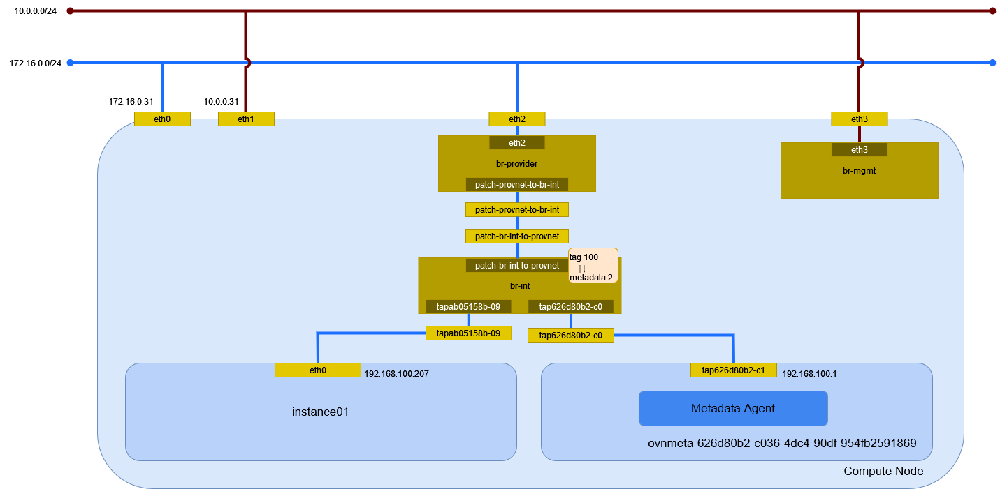

# インスタンスの作成 (vlan/Open Virtual Network)

vlan ネットワーク(Open Viirtual Network)に接続するインスタンスを作成する。

## 前提条件

* [](../network/ovn_vlan) を作成していること。
* flavor [](../flavor/m1_milli) を作成していること。
* イメージ [](../../installation/controller/glance) でイメージを作成していること。
* [](../sshkey/keypair.md) を作成していること。
* セキュリティグループのルール [](../security_group/icmp) を作成していること。
* セキュリティグループのルール [](../security_group/ssh) を作成していること。

## インスタンスの作成

```{tip}
myuser で実行
```

インスタンス instance01 を作成する。

```sh
openstack server create \
    --flavor m1.milli \
    --image cirros062 \
    --nic net-id=626d80b2-c036-4dc4-90df-954fb2591869 \
    --security-group mysecurity \
    --key-name mykey \
    instance01
```

```
+--------------------------------------+--------------------------------------------------+
| Field                                | Value                                            |
+--------------------------------------+--------------------------------------------------+
| OS-DCF:diskConfig                    | MANUAL                                           |
| OS-EXT-AZ:availability_zone          |                                                  |
| OS-EXT-SRV-ATTR:host                 | None                                             |
| OS-EXT-SRV-ATTR:hypervisor_hostname  | None                                             |
| OS-EXT-SRV-ATTR:instance_name        |                                                  |
| OS-EXT-STS:power_state               | NOSTATE                                          |
| OS-EXT-STS:task_state                | scheduling                                       |
| OS-EXT-STS:vm_state                  | building                                         |
| OS-SRV-USG:launched_at               | None                                             |
| OS-SRV-USG:terminated_at             | None                                             |
| accessIPv4                           |                                                  |
| accessIPv6                           |                                                  |
| addresses                            |                                                  |
| adminPass                            | NY5RwBsHcaq9                                     |
| config_drive                         |                                                  |
| created                              | 2024-05-26T00:14:50Z                             |
| flavor                               | m1.milli (1)                                     |
| hostId                               |                                                  |
| id                                   | cf4ff9cd-a12c-4498-96cb-7ce108e3a92b             |
| image                                | cirros062 (c9f4c32e-f310-4b92-bb5b-0e1896eea2a4) |
| key_name                             | mykey                                            |
| name                                 | instance01                                       |
| os-extended-volumes:volumes_attached | []                                               |
| progress                             | 0                                                |
| project_id                           | bccf406c045d401b91ba5c7552a124ae                 |
| properties                           |                                                  |
| security_groups                      | name='158f2c45-1393-46e4-8093-6e82e4d876c9'      |
| status                               | BUILD                                            |
| updated                              | 2024-05-26T00:14:50Z                             |
| user_id                              | 7f3acb28d26943bab9510df3a6edf3b0                 |
+--------------------------------------+--------------------------------------------------+
```

## インスタンスの確認

インスタンスが ACTIVE になったことを確認する。

```sh
openstack server list
```

```
+--------------------------------------+------------+---------+------------------------------+-----------+----------+
| ID                                   | Name       | Status  | Networks                     | Image     | Flavor   |
+--------------------------------------+------------+---------+------------------------------+-----------+----------+
| cf4ff9cd-a12c-4498-96cb-7ce108e3a92b | instance01 | ACTIVE  | provider-100=192.168.100.207 | cirros062 | m1.milli |
+--------------------------------------+------------+---------+------------------------------+-----------+----------+
```

## 環境の確認

### インスタンス

Compute Node で確認する。

```sh
virsh list
```

```
 Id   名前                状態
----------------------------------
 1    instance-00000004   実行中
```

ネットワークインターフェイスの設定を確認する。

```sh
virsh dumpxml 1 | sed -n -e '/<interface/,/<\/interface>/ { p }'
```

```xml
<interface type='ethernet'>
  <mac address='fa:16:3e:48:79:07'/>
  <target dev='tapab05158b-09'/>
  <model type='virtio'/>
  <driver name='qemu'/>
  <mtu size='1500'/>
  <alias name='net0'/>
  <address type='pci' domain='0x0000' bus='0x00' slot='0x03' function='0x0'/>
</interface>
```

### Controller Node

#### ネットワーク名前空間

ネットワーク名前空間は作成されない。

#### Northband データベース

ポートを確認する。

```sh
ovn-nbctl list Logical_Switch_Port
```

```
_uuid               : a530191d-1ada-42f6-a12b-4adcdfa09058
addresses           : ["fa:16:3e:48:79:07 192.168.100.207"]
dhcpv4_options      : 9e90a662-4081-4066-b8b1-aea4bdf76c22
dhcpv6_options      : []
dynamic_addresses   : []
enabled             : true
external_ids        : {"neutron:cidrs"="192.168.100.207/24", "neutron:device_id"="cf4ff9cd-a12c-4498-96cb-7ce108e3a92b", "neutron:device_owner"="compute:nova", "neutron:host_id"=compute.home.local, "neutron:mtu"="", "neutron:network_name"=neutron-626d80b2-c036-4dc4-90df-954fb2591869, "neutron:port_capabilities"="", "neutron:port_name"="", "neutron:project_id"=bccf406c045d401b91ba5c7552a124ae, "neutron:revision_number"="4", "neutron:security_group_ids"="158f2c45-1393-46e4-8093-6e82e4d876c9", "neutron:subnet_pool_addr_scope4"="", "neutron:subnet_pool_addr_scope6"="", "neutron:vnic_type"=normal}
ha_chassis_group    : []
mirror_rules        : []
name                : "ab05158b-0980-4587-a0e2-2f945bcf6d82"
options             : {requested-chassis=compute.home.local}
parent_name         : []
port_security       : ["fa:16:3e:48:79:07 192.168.100.207"]
tag                 : []
tag_request         : []
type                : ""
up                  : true

_uuid               : 5e20e112-a7d4-438f-81ff-e6540effedd8
addresses           : ["fa:16:3e:1e:cf:67 192.168.100.1"]
dhcpv4_options      : []
dhcpv6_options      : []
dynamic_addresses   : []
enabled             : true
external_ids        : {"neutron:cidrs"="192.168.100.1/24", "neutron:device_id"=ovnmeta-626d80b2-c036-4dc4-90df-954fb2591869, "neutron:device_owner"="network:distributed", "neutron:mtu"="", "neutron:network_name"=neutron-626d80b2-c036-4dc4-90df-954fb2591869, "neutron:port_capabilities"="", "neutron:port_name"="", "neutron:project_id"=be94f4411bd74f249f5e25f642209b82, "neutron:revision_number"="2", "neutron:security_group_ids"="", "neutron:subnet_pool_addr_scope4"="", "neutron:subnet_pool_addr_scope6"="", "neutron:vnic_type"=normal}
ha_chassis_group    : []
mirror_rules        : []
name                : "fddff5b2-0987-4644-bae9-b915f9b572aa"
options             : {}
parent_name         : []
port_security       : []
tag                 : []
tag_request         : []
type                : localport
up                  : false

_uuid               : f196fd5b-b0b8-4b9d-be4c-8e93011ea20f
addresses           : [unknown]
dhcpv4_options      : []
dhcpv6_options      : []
dynamic_addresses   : []
enabled             : []
external_ids        : {}
ha_chassis_group    : []
mirror_rules        : []
name                : provnet-ed5b0e1e-fa10-4dd3-ac28-afec8481da62
options             : {localnet_learn_fdb="false", mcast_flood="false", mcast_flood_reports="true", network_name=provider}
parent_name         : []
port_security       : []
tag                 : 100
tag_request         : []
type                : localnet
up                  : false
```

DHCP オプションを確認する。

```sh
ovn-nbctl list DHCP_options 9e90a662-4081-4066-b8b1-aea4bdf76c22
```

```
_uuid               : 9e90a662-4081-4066-b8b1-aea4bdf76c22
cidr                : "192.168.100.0/24"
external_ids        : {"neutron:revision_number"="0", subnet_id="f399a277-8df8-4d77-9b07-0858cdc4a36e"}
options             : {classless_static_route="{169.254.169.254/32,192.168.100.1, 0.0.0.0/0,192.168.100.254}", dns_server="{10.0.0.254}", lease_time="43200", mtu="1500", router="192.168.100.254", server_id="192.168.100.254", server_mac="fa:16:3e:d6:c3:7a"}
```

セキュリティグループの設定を確認する。

```sh
ovn-nbctl list ACL
```

```
_uuid               : 31bacda3-d31c-4739-8637-f30b4c1b47ac
action              : allow-related
direction           : from-lport
external_ids        : {"neutron:security_group_rule_id"="a0ec8f7c-0c17-496d-86c5-6bbd545f9b03"}
label               : 0
log                 : false
match               : "inport == @pg_158f2c45_1393_46e4_8093_6e82e4d876c9 && ip6"
meter               : []
name                : []
options             : {}
priority            : 1002
severity            : []
tier                : 0

_uuid               : a5e40279-0698-4d4e-82c0-349b3f5e368f
action              : allow-related
direction           : to-lport
external_ids        : {"neutron:security_group_rule_id"="6e1cb864-a5a8-49e9-ba76-4d47fb265ee2"}
label               : 0
log                 : false
match               : "outport == @pg_158f2c45_1393_46e4_8093_6e82e4d876c9 && ip4 && ip4.src == 0.0.0.0/0 && tcp && tcp.dst == 22"
meter               : []
name                : []
options             : {}
priority            : 1002
severity            : []
tier                : 0

_uuid               : 655423fa-e375-41de-b063-40507c2ef83d
action              : drop
direction           : from-lport
external_ids        : {}
label               : 0
log                 : false
match               : "inport == @neutron_pg_drop && ip"
meter               : []
name                : []
options             : {}
priority            : 1001
severity            : []
tier                : 0

_uuid               : 17be7dac-406b-4fb3-a036-238248cbcff7
action              : drop
direction           : to-lport
external_ids        : {}
label               : 0
log                 : false
match               : "outport == @neutron_pg_drop && ip"
meter               : []
name                : []
options             : {}
priority            : 1001
severity            : []
tier                : 0

_uuid               : 6af3a7fd-e126-4b94-8f13-35061fbc1291
action              : allow-related
direction           : from-lport
external_ids        : {"neutron:security_group_rule_id"="12dab7f7-5c98-436d-9ff1-fb9ab179f5c4"}
label               : 0
log                 : false
match               : "inport == @pg_158f2c45_1393_46e4_8093_6e82e4d876c9 && ip4"
meter               : []
name                : []
options             : {}
priority            : 1002
severity            : []
tier                : 0

_uuid               : 7b75e62e-e06f-4ea3-b4ad-6204168b58f8
action              : allow-related
direction           : to-lport
external_ids        : {"neutron:security_group_rule_id"="d84d5d71-ad24-4072-a5c1-fa950ac6fdc9"}
label               : 0
log                 : false
match               : "outport == @pg_158f2c45_1393_46e4_8093_6e82e4d876c9 && ip4 && ip4.src == 0.0.0.0/0 && icmp4"
meter               : []
name                : []
options             : {}
priority            : 1002
severity            : []
tier                : 0
```

#### Southbound データベース

フローを確認する。

```sh
ovn-sbctl lflow-list
```

```
Datapath: "neutron-626d80b2-c036-4dc4-90df-954fb2591869" aka "provider-100" (7869b546-90fb-40f4-adbc-026b46b278f4)  Pipeline: ingress
  table=0 (ls_in_check_port_sec), priority=110  , match=(((ip4 && icmp4.type == 3 && icmp4.code == 4) || (ip6 && icmp6.type == 2 && icmp6.code == 0)) && flags.tunnel_rx == 1), action=(drop;)
  table=0 (ls_in_check_port_sec), priority=100  , match=(eth.src[40]), action=(drop;)
  table=0 (ls_in_check_port_sec), priority=100  , match=(vlan.present), action=(drop;)
  table=0 (ls_in_check_port_sec), priority=50   , match=(1), action=(reg0[15] = check_in_port_sec(); next;)
  table=1 (ls_in_apply_port_sec), priority=50   , match=(reg0[15] == 1), action=(drop;)
  table=1 (ls_in_apply_port_sec), priority=0    , match=(1), action=(next;)
  table=2 (ls_in_lookup_fdb   ), priority=0    , match=(1), action=(next;)
  table=3 (ls_in_put_fdb      ), priority=0    , match=(1), action=(next;)
  table=4 (ls_in_pre_acl      ), priority=110  , match=(eth.dst == $svc_monitor_mac), action=(next;)
  table=4 (ls_in_pre_acl      ), priority=110  , match=(eth.mcast), action=(next;)
  table=4 (ls_in_pre_acl      ), priority=110  , match=(ip && inport == "provnet-ed5b0e1e-fa10-4dd3-ac28-afec8481da62"), action=(next;)
  table=4 (ls_in_pre_acl      ), priority=110  , match=(nd || nd_rs || nd_ra || mldv1 || mldv2 || (udp && udp.src == 546 && udp.dst == 547)), action=(next;)
  table=4 (ls_in_pre_acl      ), priority=100  , match=(ip), action=(reg0[0] = 1; next;)
  table=4 (ls_in_pre_acl      ), priority=0    , match=(1), action=(next;)
  table=5 (ls_in_pre_lb       ), priority=110  , match=(eth.dst == $svc_monitor_mac), action=(next;)
  table=5 (ls_in_pre_lb       ), priority=110  , match=(eth.mcast), action=(next;)
  table=5 (ls_in_pre_lb       ), priority=110  , match=(ip && inport == "provnet-ed5b0e1e-fa10-4dd3-ac28-afec8481da62"), action=(next;)
  table=5 (ls_in_pre_lb       ), priority=110  , match=(nd || nd_rs || nd_ra || mldv1 || mldv2), action=(next;)
  table=5 (ls_in_pre_lb       ), priority=110  , match=(reg0[16] == 1), action=(next;)
  table=5 (ls_in_pre_lb       ), priority=0    , match=(1), action=(next;)
  table=6 (ls_in_pre_stateful ), priority=110  , match=(reg0[2] == 1), action=(ct_lb_mark;)
  table=6 (ls_in_pre_stateful ), priority=100  , match=(reg0[0] == 1), action=(ct_next;)
  table=6 (ls_in_pre_stateful ), priority=0    , match=(1), action=(next;)
  table=7 (ls_in_acl_hint     ), priority=7    , match=(ct.new && !ct.est), action=(reg0[7] = 1; reg0[9] = 1; next;)
  table=7 (ls_in_acl_hint     ), priority=6    , match=(!ct.new && ct.est && !ct.rpl && ct_mark.blocked == 1), action=(reg0[7] = 1; reg0[9] = 1; next;)
  table=7 (ls_in_acl_hint     ), priority=5    , match=(!ct.trk), action=(reg0[8] = 1; reg0[9] = 1; next;)
  table=7 (ls_in_acl_hint     ), priority=4    , match=(!ct.new && ct.est && !ct.rpl && ct_mark.blocked == 0), action=(reg0[8] = 1; reg0[10] = 1; next;)
  table=7 (ls_in_acl_hint     ), priority=3    , match=(!ct.est), action=(reg0[9] = 1; next;)
  table=7 (ls_in_acl_hint     ), priority=2    , match=(ct.est && ct_mark.blocked == 1), action=(reg0[9] = 1; next;)
  table=7 (ls_in_acl_hint     ), priority=1    , match=(ct.est && ct_mark.blocked == 0), action=(reg0[10] = 1; next;)
  table=7 (ls_in_acl_hint     ), priority=0    , match=(1), action=(next;)
  table=8 (ls_in_acl_eval     ), priority=65532, match=(!ct.est && ct.rel && !ct.new && !ct.inv && ct_mark.blocked == 0), action=(reg0[17] = 1; reg8[16] = 1; ct_commit_nat;)
  table=8 (ls_in_acl_eval     ), priority=65532, match=(ct.est && !ct.rel && !ct.new && !ct.inv && ct.rpl && ct_mark.blocked == 0), action=(reg0[9] = 0; reg0[10] = 0; reg0[17] = 1; reg8[16] = 1; next;)
  table=8 (ls_in_acl_eval     ), priority=65532, match=(ct.inv || (ct.est && ct.rpl && ct_mark.blocked == 1)), action=(reg8[17] = 1; next;)
  table=8 (ls_in_acl_eval     ), priority=65532, match=(nd || nd_ra || nd_rs || mldv1 || mldv2), action=(reg8[16] = 1; next;)
  table=8 (ls_in_acl_eval     ), priority=34000, match=(eth.dst == $svc_monitor_mac), action=(reg8[16] = 1; next;)
  table=8 (ls_in_acl_eval     ), priority=2002 , match=(reg0[7] == 1 && (inport == @pg_158f2c45_1393_46e4_8093_6e82e4d876c9 && ip4)), action=(reg8[16] = 1; reg0[1] = 1; next;)
  table=8 (ls_in_acl_eval     ), priority=2002 , match=(reg0[7] == 1 && (inport == @pg_158f2c45_1393_46e4_8093_6e82e4d876c9 && ip6)), action=(reg8[16] = 1; reg0[1] = 1; next;)
  table=8 (ls_in_acl_eval     ), priority=2002 , match=(reg0[8] == 1 && (inport == @pg_158f2c45_1393_46e4_8093_6e82e4d876c9 && ip4)), action=(reg8[16] = 1; next;)
  table=8 (ls_in_acl_eval     ), priority=2002 , match=(reg0[8] == 1 && (inport == @pg_158f2c45_1393_46e4_8093_6e82e4d876c9 && ip6)), action=(reg8[16] = 1; next;)
  table=8 (ls_in_acl_eval     ), priority=2001 , match=(reg0[10] == 1 && (inport == @neutron_pg_drop && ip)), action=(reg8[17] = 1; ct_commit { ct_mark.blocked = 1; }; next;)
  table=8 (ls_in_acl_eval     ), priority=2001 , match=(reg0[9] == 1 && (inport == @neutron_pg_drop && ip)), action=(reg8[17] = 1; next;)
  table=8 (ls_in_acl_eval     ), priority=1    , match=(ip && !ct.est), action=(reg0[1] = 1; next;)
  table=8 (ls_in_acl_eval     ), priority=1    , match=(ip && ct.est && ct_mark.blocked == 1), action=(reg0[1] = 1; reg8[16] = 1; next;)
  table=8 (ls_in_acl_eval     ), priority=0    , match=(1), action=(next;)
  table=9 (ls_in_acl_action   ), priority=1000 , match=(reg8[16] == 1), action=(reg8[16] = 0; reg8[17] = 0; reg8[18] = 0; next;)
  table=9 (ls_in_acl_action   ), priority=1000 , match=(reg8[17] == 1), action=(reg8[16] = 0; reg8[17] = 0; reg8[18] = 0; /* drop */)
  table=9 (ls_in_acl_action   ), priority=1000 , match=(reg8[18] == 1), action=(reg8[16] = 0; reg8[17] = 0; reg8[18] = 0; reg0 = 0; reject { /* eth.dst <-> eth.src; ip.dst <-> ip.src; is implicit. */ outport <-> inport; next(pipeline=egress,table=6); };)
  table=9 (ls_in_acl_action   ), priority=0    , match=(1), action=(reg8[16] = 0; reg8[17] = 0; reg8[18] = 0; next;)
  table=10(ls_in_qos_mark     ), priority=0    , match=(1), action=(next;)
  table=11(ls_in_qos_meter    ), priority=0    , match=(1), action=(next;)
  table=12(ls_in_lb_aff_check ), priority=0    , match=(1), action=(next;)
  table=13(ls_in_lb           ), priority=0    , match=(1), action=(next;)
  table=14(ls_in_lb_aff_learn ), priority=0    , match=(1), action=(next;)
  table=15(ls_in_pre_hairpin  ), priority=0    , match=(1), action=(next;)
  table=16(ls_in_nat_hairpin  ), priority=0    , match=(1), action=(next;)
  table=17(ls_in_hairpin      ), priority=0    , match=(1), action=(next;)
  table=18(ls_in_acl_after_lb_eval), priority=65532, match=(nd || nd_ra || nd_rs || mldv1 || mldv2), action=(reg8[16] = 1; next;)
  table=18(ls_in_acl_after_lb_eval), priority=65532, match=(reg0[17] == 1), action=(reg8[16] = 1; next;)
  table=18(ls_in_acl_after_lb_eval), priority=0    , match=(1), action=(next;)
  table=19(ls_in_acl_after_lb_action), priority=1000 , match=(reg8[16] == 1), action=(reg8[16] = 0; reg8[17] = 0; reg8[18] = 0; next;)
  table=19(ls_in_acl_after_lb_action), priority=1000 , match=(reg8[17] == 1), action=(reg8[16] = 0; reg8[17] = 0; reg8[18] = 0; /* drop */)
  table=19(ls_in_acl_after_lb_action), priority=1000 , match=(reg8[18] == 1), action=(reg8[16] = 0; reg8[17] = 0; reg8[18] = 0; reg0 = 0; reject { /* eth.dst <-> eth.src; ip.dst <-> ip.src; is implicit. */ outport <-> inport; next(pipeline=egress,table=6); };)
  table=19(ls_in_acl_after_lb_action), priority=0    , match=(1), action=(reg8[16] = 0; reg8[17] = 0; reg8[18] = 0; next;)
  table=20(ls_in_stateful     ), priority=100  , match=(reg0[1] == 1 && reg0[13] == 0), action=(ct_commit { ct_mark.blocked = 0; }; next;)
  table=20(ls_in_stateful     ), priority=100  , match=(reg0[1] == 1 && reg0[13] == 1), action=(ct_commit { ct_mark.blocked = 0; ct_label.label = reg3; }; next;)
  table=20(ls_in_stateful     ), priority=0    , match=(1), action=(next;)
  table=21(ls_in_arp_rsp      ), priority=100  , match=(arp.tpa == 192.168.100.1 && arp.op == 1 && inport == "fddff5b2-0987-4644-bae9-b915f9b572aa"), action=(next;)
  table=21(ls_in_arp_rsp      ), priority=100  , match=(arp.tpa == 192.168.100.207 && arp.op == 1 && inport == "ab05158b-0980-4587-a0e2-2f945bcf6d82"), action=(next;)
  table=21(ls_in_arp_rsp      ), priority=100  , match=(inport == "provnet-ed5b0e1e-fa10-4dd3-ac28-afec8481da62"), action=(next;)
  table=21(ls_in_arp_rsp      ), priority=50   , match=(arp.tpa == 192.168.100.1 && arp.op == 1), action=(eth.dst = eth.src; eth.src = fa:16:3e:1e:cf:67; arp.op = 2; /* ARP reply */ arp.tha = arp.sha; arp.sha = fa:16:3e:1e:cf:67; arp.tpa = arp.spa; arp.spa = 192.168.100.1; outport = inport; flags.loopback = 1; output;)
  table=21(ls_in_arp_rsp      ), priority=50   , match=(arp.tpa == 192.168.100.207 && arp.op == 1), action=(eth.dst = eth.src; eth.src = fa:16:3e:48:79:07; arp.op = 2; /* ARP reply */ arp.tha = arp.sha; arp.sha = fa:16:3e:48:79:07; arp.tpa = arp.spa; arp.spa = 192.168.100.207; outport = inport; flags.loopback = 1; output;)
  table=21(ls_in_arp_rsp      ), priority=0    , match=(1), action=(next;)
  table=22(ls_in_dhcp_options ), priority=100  , match=(inport == "ab05158b-0980-4587-a0e2-2f945bcf6d82" && eth.src == fa:16:3e:48:79:07 && (ip4.src == {192.168.100.207, 0.0.0.0} && ip4.dst == {192.168.100.254, 255.255.255.255}) && udp.src == 68 && udp.dst == 67), action=(reg0[3] = put_dhcp_opts(offerip = 192.168.100.207, classless_static_route = {169.254.169.254/32,192.168.100.1, 0.0.0.0/0,192.168.100.254}, dns_server = {10.0.0.254}, lease_time = 43200, mtu = 1500, netmask = 255.255.255.0, router = 192.168.100.254, server_id = 192.168.100.254); next;)
  table=22(ls_in_dhcp_options ), priority=0    , match=(1), action=(next;)
  table=23(ls_in_dhcp_response), priority=100  , match=(inport == "ab05158b-0980-4587-a0e2-2f945bcf6d82" && eth.src == fa:16:3e:48:79:07 && ip4 && udp.src == 68 && udp.dst == 67 && reg0[3]), action=(eth.dst = eth.src; eth.src = fa:16:3e:d6:c3:7a; ip4.src = 192.168.100.254; udp.src = 67; udp.dst = 68; outport = inport; flags.loopback = 1; output;)
  table=23(ls_in_dhcp_response), priority=0    , match=(1), action=(next;)
  table=24(ls_in_dns_lookup   ), priority=0    , match=(1), action=(next;)
  table=25(ls_in_dns_response ), priority=0    , match=(1), action=(next;)
  table=26(ls_in_external_port), priority=0    , match=(1), action=(next;)
  table=27(ls_in_l2_lkup      ), priority=110  , match=(eth.dst == $svc_monitor_mac && (tcp || icmp || icmp6)), action=(handle_svc_check(inport);)
  table=27(ls_in_l2_lkup      ), priority=70   , match=(eth.mcast), action=(outport = "_MC_flood"; output;)
  table=27(ls_in_l2_lkup      ), priority=50   , match=(eth.dst == fa:16:3e:1e:cf:67), action=(outport = "fddff5b2-0987-4644-bae9-b915f9b572aa"; output;)
  table=27(ls_in_l2_lkup      ), priority=50   , match=(eth.dst == fa:16:3e:48:79:07), action=(outport = "ab05158b-0980-4587-a0e2-2f945bcf6d82"; output;)
  table=27(ls_in_l2_lkup      ), priority=0    , match=(1), action=(outport = get_fdb(eth.dst); next;)
  table=28(ls_in_l2_unknown   ), priority=50   , match=(outport == "none"), action=(outport = "_MC_unknown"; output;)
  table=28(ls_in_l2_unknown   ), priority=0    , match=(1), action=(output;)
Datapath: "neutron-626d80b2-c036-4dc4-90df-954fb2591869" aka "provider-100" (7869b546-90fb-40f4-adbc-026b46b278f4)  Pipeline: egress
  table=0 (ls_out_pre_acl     ), priority=110  , match=(eth.mcast), action=(next;)
  table=0 (ls_out_pre_acl     ), priority=110  , match=(eth.src == $svc_monitor_mac), action=(next;)
  table=0 (ls_out_pre_acl     ), priority=110  , match=(ip && outport == "provnet-ed5b0e1e-fa10-4dd3-ac28-afec8481da62"), action=(next;)
  table=0 (ls_out_pre_acl     ), priority=110  , match=(nd || nd_rs || nd_ra || mldv1 || mldv2 || (udp && udp.src == 546 && udp.dst == 547)), action=(next;)
  table=0 (ls_out_pre_acl     ), priority=100  , match=(ip), action=(reg0[0] = 1; next;)
  table=0 (ls_out_pre_acl     ), priority=0    , match=(1), action=(next;)
  table=1 (ls_out_pre_lb      ), priority=110  , match=(eth.mcast), action=(next;)
  table=1 (ls_out_pre_lb      ), priority=110  , match=(eth.src == $svc_monitor_mac), action=(next;)
  table=1 (ls_out_pre_lb      ), priority=110  , match=(ip && outport == "provnet-ed5b0e1e-fa10-4dd3-ac28-afec8481da62"), action=(next;)
  table=1 (ls_out_pre_lb      ), priority=110  , match=(nd || nd_rs || nd_ra || mldv1 || mldv2), action=(next;)
  table=1 (ls_out_pre_lb      ), priority=110  , match=(reg0[16] == 1), action=(next;)
  table=1 (ls_out_pre_lb      ), priority=0    , match=(1), action=(next;)
  table=2 (ls_out_pre_stateful), priority=110  , match=(reg0[2] == 1), action=(ct_lb_mark;)
  table=2 (ls_out_pre_stateful), priority=100  , match=(reg0[0] == 1), action=(ct_next;)
  table=2 (ls_out_pre_stateful), priority=0    , match=(1), action=(next;)
  table=3 (ls_out_acl_hint    ), priority=7    , match=(ct.new && !ct.est), action=(reg0[7] = 1; reg0[9] = 1; next;)
  table=3 (ls_out_acl_hint    ), priority=6    , match=(!ct.new && ct.est && !ct.rpl && ct_mark.blocked == 1), action=(reg0[7] = 1; reg0[9] = 1; next;)
  table=3 (ls_out_acl_hint    ), priority=5    , match=(!ct.trk), action=(reg0[8] = 1; reg0[9] = 1; next;)
  table=3 (ls_out_acl_hint    ), priority=4    , match=(!ct.new && ct.est && !ct.rpl && ct_mark.blocked == 0), action=(reg0[8] = 1; reg0[10] = 1; next;)
  table=3 (ls_out_acl_hint    ), priority=3    , match=(!ct.est), action=(reg0[9] = 1; next;)
  table=3 (ls_out_acl_hint    ), priority=2    , match=(ct.est && ct_mark.blocked == 1), action=(reg0[9] = 1; next;)
  table=3 (ls_out_acl_hint    ), priority=1    , match=(ct.est && ct_mark.blocked == 0), action=(reg0[10] = 1; next;)
  table=3 (ls_out_acl_hint    ), priority=0    , match=(1), action=(next;)
  table=4 (ls_out_acl_eval    ), priority=65532, match=(!ct.est && ct.rel && !ct.new && !ct.inv && ct_mark.blocked == 0), action=(reg8[16] = 1; ct_commit_nat;)
  table=4 (ls_out_acl_eval    ), priority=65532, match=(ct.est && !ct.rel && !ct.new && !ct.inv && ct.rpl && ct_mark.blocked == 0), action=(reg8[16] = 1; next;)
  table=4 (ls_out_acl_eval    ), priority=65532, match=(ct.inv || (ct.est && ct.rpl && ct_mark.blocked == 1)), action=(reg8[17] = 1; next;)
  table=4 (ls_out_acl_eval    ), priority=65532, match=(nd || nd_ra || nd_rs || mldv1 || mldv2), action=(reg8[16] = 1; next;)
  table=4 (ls_out_acl_eval    ), priority=34000, match=(eth.src == $svc_monitor_mac), action=(reg8[16] = 1; next;)
  table=4 (ls_out_acl_eval    ), priority=34000, match=(outport == "ab05158b-0980-4587-a0e2-2f945bcf6d82" && eth.src == fa:16:3e:d6:c3:7a && ip4.src == 192.168.100.254 && udp && udp.src == 67 && udp.dst == 68), action=(reg8[16] = 1; next;)
  table=4 (ls_out_acl_eval    ), priority=2002 , match=(reg0[7] == 1 && (outport == @pg_158f2c45_1393_46e4_8093_6e82e4d876c9 && ip4 && ip4.src == 0.0.0.0/0 && icmp4)), action=(reg8[16] = 1; reg0[1] = 1; next;)
  table=4 (ls_out_acl_eval    ), priority=2002 , match=(reg0[7] == 1 && (outport == @pg_158f2c45_1393_46e4_8093_6e82e4d876c9 && ip4 && ip4.src == 0.0.0.0/0 && tcp && tcp.dst == 22)), action=(reg8[16] = 1; reg0[1] = 1; next;)
  table=4 (ls_out_acl_eval    ), priority=2002 , match=(reg0[8] == 1 && (outport == @pg_158f2c45_1393_46e4_8093_6e82e4d876c9 && ip4 && ip4.src == 0.0.0.0/0 && icmp4)), action=(reg8[16] = 1; next;)
  table=4 (ls_out_acl_eval    ), priority=2002 , match=(reg0[8] == 1 && (outport == @pg_158f2c45_1393_46e4_8093_6e82e4d876c9 && ip4 && ip4.src == 0.0.0.0/0 && tcp && tcp.dst == 22)), action=(reg8[16] = 1; next;)
  table=4 (ls_out_acl_eval    ), priority=2001 , match=(reg0[10] == 1 && (outport == @neutron_pg_drop && ip)), action=(reg8[17] = 1; ct_commit { ct_mark.blocked = 1; }; next;)
  table=4 (ls_out_acl_eval    ), priority=2001 , match=(reg0[9] == 1 && (outport == @neutron_pg_drop && ip)), action=(reg8[17] = 1; next;)
  table=4 (ls_out_acl_eval    ), priority=1    , match=(ip && !ct.est), action=(reg0[1] = 1; next;)
  table=4 (ls_out_acl_eval    ), priority=1    , match=(ip && ct.est && ct_mark.blocked == 1), action=(reg0[1] = 1; reg8[16] = 1; next;)
  table=4 (ls_out_acl_eval    ), priority=0    , match=(1), action=(next;)
  table=5 (ls_out_acl_action  ), priority=1000 , match=(reg8[16] == 1), action=(reg8[16] = 0; reg8[17] = 0; reg8[18] = 0; next;)
  table=5 (ls_out_acl_action  ), priority=1000 , match=(reg8[17] == 1), action=(reg8[16] = 0; reg8[17] = 0; reg8[18] = 0; /* drop */)
  table=5 (ls_out_acl_action  ), priority=1000 , match=(reg8[18] == 1), action=(reg8[16] = 0; reg8[17] = 0; reg8[18] = 0; reg0 = 0; reject { /* eth.dst <-> eth.src; ip.dst <-> ip.src; is implicit. */ outport <-> inport; next(pipeline=ingress,table=27); };)
  table=5 (ls_out_acl_action  ), priority=0    , match=(1), action=(reg8[16] = 0; reg8[17] = 0; reg8[18] = 0; next;)
  table=6 (ls_out_qos_mark    ), priority=0    , match=(1), action=(next;)
  table=7 (ls_out_qos_meter   ), priority=0    , match=(1), action=(next;)
  table=8 (ls_out_stateful    ), priority=100  , match=(reg0[1] == 1 && reg0[13] == 0), action=(ct_commit { ct_mark.blocked = 0; }; next;)
  table=8 (ls_out_stateful    ), priority=100  , match=(reg0[1] == 1 && reg0[13] == 1), action=(ct_commit { ct_mark.blocked = 0; ct_label.label = reg3; }; next;)
  table=8 (ls_out_stateful    ), priority=0    , match=(1), action=(next;)
  table=9 (ls_out_check_port_sec), priority=100  , match=(eth.mcast), action=(reg0[15] = 0; next;)
  table=9 (ls_out_check_port_sec), priority=0    , match=(1), action=(reg0[15] = check_out_port_sec(); next;)
  table=10(ls_out_apply_port_sec), priority=50   , match=(reg0[15] == 1), action=(drop;)
  table=10(ls_out_apply_port_sec), priority=0    , match=(1), action=(output;)
```

マルチキャストグループを確認する。

```sh
ovn-sbctl list Multicast_Group
```

```
_uuid               : 25e1c74a-7e38-48a3-b2c9-265048727cf7
datapath            : 7869b546-90fb-40f4-adbc-026b46b278f4
name                : _MC_mrouter_flood
ports               : [d56c6207-93d8-4f3b-873b-1589e983d6e4]
tunnel_key          : 32770

_uuid               : 93ab4c5b-87c3-43d2-a827-4e61a01f3605
datapath            : 7869b546-90fb-40f4-adbc-026b46b278f4
name                : _MC_flood_l2
ports               : [08de8752-4ed2-4a7e-918f-34d33706bae3, aa90ca59-9fb3-4be0-8315-fac94312915b, d56c6207-93d8-4f3b-873b-1589e983d6e4]
tunnel_key          : 32772

_uuid               : 179a43fc-33c3-4126-bde1-0debf133a4c8
datapath            : 7869b546-90fb-40f4-adbc-026b46b278f4
name                : _MC_unknown
ports               : [d56c6207-93d8-4f3b-873b-1589e983d6e4]
tunnel_key          : 32769

_uuid               : d1bdde16-1c51-4050-a3c6-d5ddab5cb4d8
datapath            : 7869b546-90fb-40f4-adbc-026b46b278f4
name                : _MC_flood
ports               : [08de8752-4ed2-4a7e-918f-34d33706bae3, aa90ca59-9fb3-4be0-8315-fac94312915b, d56c6207-93d8-4f3b-873b-1589e983d6e4]
tunnel_key          : 32768
```

ポートを確認する。

```sh
ovn-sbctl list Port_Binding
```

```
_uuid               : aa90ca59-9fb3-4be0-8315-fac94312915b
additional_chassis  : []
additional_encap    : []
chassis             : []
datapath            : 7869b546-90fb-40f4-adbc-026b46b278f4
encap               : []
external_ids        : {"neutron:cidrs"="192.168.100.1/24", "neutron:device_id"=ovnmeta-626d80b2-c036-4dc4-90df-954fb2591869, "neutron:device_owner"="network:distributed", "neutron:mtu"="", "neutron:network_name"=neutron-626d80b2-c036-4dc4-90df-954fb2591869, "neutron:port_capabilities"="", "neutron:port_name"="", "neutron:project_id"=be94f4411bd74f249f5e25f642209b82, "neutron:revision_number"="2", "neutron:security_group_ids"="", "neutron:subnet_pool_addr_scope4"="", "neutron:subnet_pool_addr_scope6"="", "neutron:vnic_type"=normal}
gateway_chassis     : []
ha_chassis_group    : []
logical_port        : "fddff5b2-0987-4644-bae9-b915f9b572aa"
mac                 : ["fa:16:3e:1e:cf:67 192.168.100.1"]
mirror_rules        : []
nat_addresses       : []
options             : {}
parent_port         : []
port_security       : []
requested_additional_chassis: []
requested_chassis   : []
tag                 : []
tunnel_key          : 2
type                : localport
up                  : false
virtual_parent      : []

_uuid               : 08de8752-4ed2-4a7e-918f-34d33706bae3
additional_chassis  : []
additional_encap    : []
chassis             : 4c169564-02be-4ef2-acfc-1740feeb629c
datapath            : 7869b546-90fb-40f4-adbc-026b46b278f4
encap               : []
external_ids        : {"neutron:cidrs"="192.168.100.207/24", "neutron:device_id"="cf4ff9cd-a12c-4498-96cb-7ce108e3a92b", "neutron:device_owner"="compute:nova", "neutron:host_id"=compute.home.local, "neutron:mtu"="", "neutron:network_name"=neutron-626d80b2-c036-4dc4-90df-954fb2591869, "neutron:port_capabilities"="", "neutron:port_name"="", "neutron:project_id"=bccf406c045d401b91ba5c7552a124ae, "neutron:revision_number"="4", "neutron:security_group_ids"="158f2c45-1393-46e4-8093-6e82e4d876c9", "neutron:subnet_pool_addr_scope4"="", "neutron:subnet_pool_addr_scope6"="", "neutron:vnic_type"=normal}
gateway_chassis     : []
ha_chassis_group    : []
logical_port        : "ab05158b-0980-4587-a0e2-2f945bcf6d82"
mac                 : ["fa:16:3e:48:79:07 192.168.100.207"]
mirror_rules        : []
nat_addresses       : []
options             : {requested-chassis=compute.home.local}
parent_port         : []
port_security       : ["fa:16:3e:48:79:07 192.168.100.207"]
requested_additional_chassis: []
requested_chassis   : 4c169564-02be-4ef2-acfc-1740feeb629c
tag                 : []
tunnel_key          : 3
type                : ""
up                  : true
virtual_parent      : []

_uuid               : d56c6207-93d8-4f3b-873b-1589e983d6e4
additional_chassis  : []
additional_encap    : []
chassis             : []
datapath            : 7869b546-90fb-40f4-adbc-026b46b278f4
encap               : []
external_ids        : {}
gateway_chassis     : []
ha_chassis_group    : []
logical_port        : provnet-ed5b0e1e-fa10-4dd3-ac28-afec8481da62
mac                 : [unknown]
mirror_rules        : []
nat_addresses       : []
options             : {localnet_learn_fdb="false", mcast_flood="false", mcast_flood_reports="true", network_name=provider}
parent_port         : []
port_security       : []
requested_additional_chassis: []
requested_chassis   : []
tag                 : 100
tunnel_key          : 1
type                : localnet
up                  : false
virtual_parent      : []
```

#### Open vSwitch

Open vSwitch にブリッジは作成されない。

```sh
ovs-vsctl show
```

```
f6d63fd3-3bf4-45eb-afc6-603984ff8667
    ovs_version: "3.3.1"
```

### Compute Node

ネットワーク構成を確認する。



#### ネットワーク名前空間

インスタンスが立ち上がるとネットワーク名前空間が作成される。

```sh
ip netns
```

```
ovnmeta-626d80b2-c036-4dc4-90df-954fb2591869 (id: 0)
```

#### デバイス

TAP デバイスが追加される。

```sh
ip -d link show
```

```
1: lo: <LOOPBACK,UP,LOWER_UP> mtu 65536 qdisc noqueue state UNKNOWN mode DEFAULT group default qlen 1000
    link/loopback 00:00:00:00:00:00 brd 00:00:00:00:00:00 promiscuity 0  allmulti 0 minmtu 0 maxmtu 0 addrgenmode eui64 numtxqueues 1 numrxqueues 1 gso_max_size 65536 gso_max_segs 65535 tso_max_size 524280 tso_max_segs 65535 gro_max_size 65536
2: eth0: <BROADCAST,MULTICAST,UP,LOWER_UP> mtu 1500 qdisc mq state UP mode DEFAULT group default qlen 1000
    link/ether 00:15:5d:bf:ba:50 brd ff:ff:ff:ff:ff:ff promiscuity 0  allmulti 0 minmtu 68 maxmtu 65521 addrgenmode none numtxqueues 64 numrxqueues 64 gso_max_size 62780 gso_max_segs 65535 tso_max_size 62780 tso_max_segs 65535 gro_max_size 65536 parentbus vmbus parentdev f4fd36cf-d20d-4c23-83bb-e1b5cc9fbfbc
3: eth1: <BROADCAST,MULTICAST,UP,LOWER_UP> mtu 1500 qdisc mq state UP mode DEFAULT group default qlen 1000
    link/ether 00:15:5d:bf:ba:57 brd ff:ff:ff:ff:ff:ff promiscuity 0  allmulti 0 minmtu 68 maxmtu 65521 addrgenmode none numtxqueues 64 numrxqueues 64 gso_max_size 62780 gso_max_segs 65535 tso_max_size 62780 tso_max_segs 65535 gro_max_size 65536 parentbus vmbus parentdev 1e1fc9b9-f159-4473-9410-cf7db6750e26
4: eth2: <BROADCAST,MULTICAST,UP,LOWER_UP> mtu 1500 qdisc mq master ovs-system state UP mode DEFAULT group default qlen 1000
    link/ether 00:15:5d:bf:ba:58 brd ff:ff:ff:ff:ff:ff promiscuity 1  allmulti 0 minmtu 68 maxmtu 65521
    openvswitch_slave addrgenmode none numtxqueues 64 numrxqueues 64 gso_max_size 62780 gso_max_segs 65535 tso_max_size 62780 tso_max_segs 65535 gro_max_size 65536 parentbus vmbus parentdev fb193242-70ac-437d-9008-4382b02d2a70
5: eth3: <BROADCAST,MULTICAST,UP,LOWER_UP> mtu 1500 qdisc mq master ovs-system state UP mode DEFAULT group default qlen 1000
    link/ether 00:15:5d:bf:ba:59 brd ff:ff:ff:ff:ff:ff promiscuity 1  allmulti 0 minmtu 68 maxmtu 65521
    openvswitch_slave addrgenmode none numtxqueues 64 numrxqueues 64 gso_max_size 62780 gso_max_segs 65535 tso_max_size 62780 tso_max_segs 65535 gro_max_size 65536 parentbus vmbus parentdev 6de0f76b-b7bc-45ba-9087-d8bee9131e1c
6: ovs-system: <BROADCAST,MULTICAST> mtu 1500 qdisc noop state DOWN mode DEFAULT group default qlen 1000
    link/ether 76:52:20:9e:b9:c6 brd ff:ff:ff:ff:ff:ff promiscuity 1  allmulti 0 minmtu 68 maxmtu 65535
    openvswitch addrgenmode eui64 numtxqueues 1 numrxqueues 1 gso_max_size 65536 gso_max_segs 65535 tso_max_size 65536 tso_max_segs 65535 gro_max_size 65536
7: br-int: <BROADCAST,MULTICAST,UP,LOWER_UP> mtu 1500 qdisc noqueue state UNKNOWN mode DEFAULT group default qlen 1000
    link/ether 9e:df:11:29:6c:ab brd ff:ff:ff:ff:ff:ff promiscuity 1  allmulti 0 minmtu 68 maxmtu 65535
    openvswitch addrgenmode none numtxqueues 1 numrxqueues 1 gso_max_size 65536 gso_max_segs 65535 tso_max_size 65536 tso_max_segs 65535 gro_max_size 65536
8: tapab05158b-09: <BROADCAST,MULTICAST,UP,LOWER_UP> mtu 1500 qdisc noqueue master ovs-system state UNKNOWN mode DEFAULT group default qlen 1000
    link/ether fe:16:3e:48:79:07 brd ff:ff:ff:ff:ff:ff promiscuity 1  allmulti 0 minmtu 68 maxmtu 65521
    tun type tap pi off vnet_hdr on persist off
    openvswitch_slave addrgenmode eui64 numtxqueues 1 numrxqueues 1 gso_max_size 65536 gso_max_segs 65535 tso_max_size 65536 tso_max_segs 65535 gro_max_size 65536
9: tap626d80b2-c0@if2: <BROADCAST,MULTICAST,UP,LOWER_UP> mtu 1500 qdisc noqueue master ovs-system state UP mode DEFAULT group default qlen 1000
    link/ether 4e:9b:42:8d:4a:a1 brd ff:ff:ff:ff:ff:ff link-netns ovnmeta-626d80b2-c036-4dc4-90df-954fb2591869 promiscuity 1  allmulti 0 minmtu 68 maxmtu 65535
    veth
    openvswitch_slave addrgenmode eui64 numtxqueues 1 numrxqueues 1 gso_max_size 65536 gso_max_segs 65535 tso_max_size 524280 tso_max_segs 65535 gro_max_size 65536
```

ネットワーク名前空間内のデバイスを確認する。

```sh
ip netns exec ovnmeta-626d80b2-c036-4dc4-90df-954fb2591869 ip -d link show
```

```
1: lo: <LOOPBACK,UP,LOWER_UP> mtu 65536 qdisc noqueue state UNKNOWN mode DEFAULT group default qlen 1000
    link/loopback 00:00:00:00:00:00 brd 00:00:00:00:00:00 promiscuity 0  allmulti 0 minmtu 0 maxmtu 0 addrgenmode eui64 numtxqueues 1 numrxqueues 1 gso_max_size 65536 gso_max_segs 65535 tso_max_size 524280 tso_max_segs 65535 gro_max_size 65536
2: tap626d80b2-c1@if9: <BROADCAST,MULTICAST,UP,LOWER_UP> mtu 1500 qdisc noqueue state UP mode DEFAULT group default qlen 1000
    link/ether fa:16:3e:1e:cf:67 brd ff:ff:ff:ff:ff:ff link-netnsid 0 promiscuity 0  allmulti 0 minmtu 68 maxmtu 65535
    veth addrgenmode eui64 numtxqueues 1 numrxqueues 1 gso_max_size 65536 gso_max_segs 65535 tso_max_size 524280 tso_max_segs 65535 gro_max_size 65536
```

#### Open vSwitch

ブリッジの構成を確認する。

```sh
ovs-vsctl show
```

```
210309a0-2cc9-4a7f-96af-960f78c1c32d
    Bridge br-int
        fail_mode: secure
        datapath_type: system
        Port br-int
            Interface br-int
                type: internal
        Port tapab05158b-09
            Interface tapab05158b-09
        Port tap7b43909d-8a
            Interface tap7b43909d-8a
                error: "could not open network device tap7b43909d-8a (No such device)"
        Port patch-br-int-to-provnet-ed5b0e1e-fa10-4dd3-ac28-afec8481da62
            Interface patch-br-int-to-provnet-ed5b0e1e-fa10-4dd3-ac28-afec8481da62
                type: patch
                options: {peer=patch-provnet-ed5b0e1e-fa10-4dd3-ac28-afec8481da62-to-br-int}
        Port tap626d80b2-c0
            Interface tap626d80b2-c0
    Bridge br-provider
        Port eth2
            Interface eth2
                type: system
        Port patch-provnet-ed5b0e1e-fa10-4dd3-ac28-afec8481da62-to-br-int
            Interface patch-provnet-ed5b0e1e-fa10-4dd3-ac28-afec8481da62-to-br-int
                type: patch
                options: {peer=patch-br-int-to-provnet-ed5b0e1e-fa10-4dd3-ac28-afec8481da62}
    Bridge br-mgmt
        Port eth3
            Interface eth3
                type: system
    ovs_version: "3.3.1"
```

データパスを確認する。

```sh
ovs-dpctl show
```

```
system@ovs-system:
  lookups: hit:1609 missed:749 lost:0
  flows: 6
  masks: hit:3969 total:2 hit/pkt:1.68
  cache: hit:1000 hit-rate:42.41%
  caches:
    masks-cache: size:256
  port 0: ovs-system (internal)
  port 1: eth2
  port 2: eth3
  port 3: br-int (internal)
  port 4: tapab05158b-09
  port 5: tap626d80b2-c0
```

ブリッジ br-int のフローのエントリを確認する。

```sh
ovs-ofctl dump-flows br-int
```

```
 cookie=0xd56c6207, duration=1151.223s, table=0, n_packets=0, n_bytes=0, priority=150,in_port="patch-br-int-to",dl_vlan=100 actions=strip_vlan,load:0x4->NXM_NX_REG13[0..15],load:0x1->NXM_NX_REG11[],load:0x2->NXM_NX_REG12[],load:0x2->OXM_OF_METADATA[],load:0x1->NXM_NX_REG14[],load:0->NXM_NX_REG13[16..31],resubmit(,8)
 cookie=0x8de8752, duration=1151.237s, table=0, n_packets=134, n_bytes=10848, priority=100,in_port="tapab05158b-09" actions=load:0x3->NXM_NX_REG13[0..15],load:0x1->NXM_NX_REG11[],load:0x2->NXM_NX_REG12[],load:0x2->OXM_OF_METADATA[],load:0x3->NXM_NX_REG14[],load:0->NXM_NX_REG13[16..31],resubmit(,8)
 cookie=0xaa90ca59, duration=1143.931s, table=0, n_packets=65, n_bytes=7342, priority=100,in_port="tap626d80b2-c0" actions=load:0x5->NXM_NX_REG13[0..15],load:0x1->NXM_NX_REG11[],load:0x2->NXM_NX_REG12[],load:0x2->OXM_OF_METADATA[],load:0x2->NXM_NX_REG14[],load:0->NXM_NX_REG13[16..31],load:0x1->NXM_NX_REG10[10],resubmit(,8)
 cookie=0x0, duration=5839.934s, table=0, n_packets=918, n_bytes=160164, priority=0 actions=drop
 cookie=0xe79cb8cc, duration=1151.252s, table=8, n_packets=0, n_bytes=0, priority=110,icmp6,reg10=0x10000/0x10000,metadata=0x2,icmp_type=2,icmp_code=0 actions=drop
 cookie=0xe79cb8cc, duration=1151.252s, table=8, n_packets=0, n_bytes=0, priority=110,icmp,reg10=0x10000/0x10000,metadata=0x2,icmp_type=3,icmp_code=4 actions=drop
 cookie=0x6fe066f3, duration=1151.285s, table=8, n_packets=0, n_bytes=0, priority=100,metadata=0x2,vlan_tci=0x1000/0x1000 actions=drop
 cookie=0xc6a42719, duration=1151.253s, table=8, n_packets=0, n_bytes=0, priority=100,metadata=0x2,dl_src=01:00:00:00:00:00/01:00:00:00:00:00 actions=drop
 cookie=0x9b517dee, duration=1151.284s, table=8, n_packets=204, n_bytes=18400, priority=50,metadata=0x2 actions=load:0->NXM_NX_REG10[12],resubmit(,73),move:NXM_NX_REG10[12]->NXM_NX_XXREG0[111],resubmit(,9)
 cookie=0xd524109e, duration=1151.253s, table=9, n_packets=12, n_bytes=852, priority=50,reg0=0x8000/0x8000,metadata=0x2 actions=drop
 cookie=0x50d7abc2, duration=1151.285s, table=9, n_packets=192, n_bytes=17548, priority=0,metadata=0x2 actions=resubmit(,10)
 cookie=0x94d4f04, duration=1151.293s, table=10, n_packets=192, n_bytes=17548, priority=0,metadata=0x2 actions=resubmit(,11)
 cookie=0x99a645, duration=1151.293s, table=11, n_packets=192, n_bytes=17548, priority=0,metadata=0x2 actions=resubmit(,12)
 cookie=0x1c40e6e, duration=1151.293s, table=12, n_packets=0, n_bytes=0, priority=110,metadata=0x2,dl_dst=b6:9c:90:73:34:da actions=resubmit(,13)
 cookie=0x4ed1c2cd, duration=1151.285s, table=12, n_packets=2, n_bytes=172, priority=110,icmp6,metadata=0x2,nw_ttl=255,icmp_type=135,icmp_code=0 actions=resubmit(,13)
 cookie=0x4ed1c2cd, duration=1151.285s, table=12, n_packets=0, n_bytes=0, priority=110,icmp6,metadata=0x2,nw_ttl=255,icmp_type=136,icmp_code=0 actions=resubmit(,13)
 cookie=0x4ed1c2cd, duration=1151.285s, table=12, n_packets=0, n_bytes=0, priority=110,icmp6,metadata=0x2,nw_ttl=255,icmp_type=134,icmp_code=0 actions=resubmit(,13)
 cookie=0x4ed1c2cd, duration=1151.285s, table=12, n_packets=9, n_bytes=630, priority=110,icmp6,metadata=0x2,nw_ttl=255,icmp_type=133,icmp_code=0 actions=resubmit(,13)
 cookie=0x4ed1c2cd, duration=1151.285s, table=12, n_packets=0, n_bytes=0, priority=110,icmp6,metadata=0x2,ipv6_src=fe80::/10,icmp_type=130 actions=resubmit(,13)
 cookie=0x4ed1c2cd, duration=1151.285s, table=12, n_packets=0, n_bytes=0, priority=110,icmp6,metadata=0x2,ipv6_src=fe80::/10,icmp_type=131 actions=resubmit(,13)
 cookie=0x4ed1c2cd, duration=1151.285s, table=12, n_packets=0, n_bytes=0, priority=110,icmp6,metadata=0x2,ipv6_src=fe80::/10,icmp_type=132 actions=resubmit(,13)
 cookie=0x4ed1c2cd, duration=1151.285s, table=12, n_packets=0, n_bytes=0, priority=110,udp6,metadata=0x2,tp_src=546,tp_dst=547 actions=resubmit(,13)
 cookie=0x4ed1c2cd, duration=1151.285s, table=12, n_packets=0, n_bytes=0, priority=110,udp,metadata=0x2,tp_src=546,tp_dst=547 actions=resubmit(,13)
 cookie=0x4ed1c2cd, duration=1151.285s, table=12, n_packets=3, n_bytes=330, priority=110,icmp6,metadata=0x2,ipv6_dst=ff02::16,icmp_type=143 actions=resubmit(,13)
 cookie=0x8a859fb5, duration=1151.284s, table=12, n_packets=32, n_bytes=1944, priority=110,metadata=0x2,dl_dst=01:00:00:00:00:00/01:00:00:00:00:00 actions=resubmit(,13)
 cookie=0xda2081fd, duration=1151.234s, table=12, n_packets=0, n_bytes=0, priority=110,ip,reg14=0x1,metadata=0x2 actions=resubmit(,13)
 cookie=0xda2081fd, duration=1151.234s, table=12, n_packets=0, n_bytes=0, priority=110,ipv6,reg14=0x1,metadata=0x2 actions=resubmit(,13)
 cookie=0xd09ee163, duration=1151.253s, table=12, n_packets=0, n_bytes=0, priority=100,ipv6,metadata=0x2 actions=load:0x1->NXM_NX_XXREG0[96],resubmit(,13)
 cookie=0xd09ee163, duration=1151.253s, table=12, n_packets=146, n_bytes=14472, priority=100,ip,metadata=0x2 actions=load:0x1->NXM_NX_XXREG0[96],resubmit(,13)
 cookie=0xa8889c2a, duration=1151.284s, table=12, n_packets=0, n_bytes=0, priority=0,metadata=0x2 actions=resubmit(,13)
 cookie=0x18ef1d8, duration=1151.293s, table=13, n_packets=2, n_bytes=172, priority=110,icmp6,metadata=0x2,nw_ttl=255,icmp_type=135,icmp_code=0 actions=resubmit(,14)
 cookie=0x18ef1d8, duration=1151.293s, table=13, n_packets=0, n_bytes=0, priority=110,icmp6,metadata=0x2,nw_ttl=255,icmp_type=136,icmp_code=0 actions=resubmit(,14)
 cookie=0x18ef1d8, duration=1151.293s, table=13, n_packets=0, n_bytes=0, priority=110,icmp6,metadata=0x2,nw_ttl=255,icmp_type=134,icmp_code=0 actions=resubmit(,14)
 cookie=0x18ef1d8, duration=1151.293s, table=13, n_packets=9, n_bytes=630, priority=110,icmp6,metadata=0x2,nw_ttl=255,icmp_type=133,icmp_code=0 actions=resubmit(,14)
 cookie=0x18ef1d8, duration=1151.293s, table=13, n_packets=0, n_bytes=0, priority=110,icmp6,metadata=0x2,ipv6_src=fe80::/10,icmp_type=130 actions=resubmit(,14)
 cookie=0x18ef1d8, duration=1151.293s, table=13, n_packets=0, n_bytes=0, priority=110,icmp6,metadata=0x2,ipv6_src=fe80::/10,icmp_type=131 actions=resubmit(,14)
 cookie=0x18ef1d8, duration=1151.293s, table=13, n_packets=0, n_bytes=0, priority=110,icmp6,metadata=0x2,ipv6_src=fe80::/10,icmp_type=132 actions=resubmit(,14)
 cookie=0x18ef1d8, duration=1151.293s, table=13, n_packets=3, n_bytes=330, priority=110,icmp6,metadata=0x2,ipv6_dst=ff02::16,icmp_type=143 actions=resubmit(,14)
 cookie=0x13514752, duration=1151.293s, table=13, n_packets=0, n_bytes=0, priority=110,metadata=0x2,dl_dst=b6:9c:90:73:34:da actions=resubmit(,14)
 cookie=0x3dcac7c2, duration=1151.286s, table=13, n_packets=32, n_bytes=1944, priority=110,metadata=0x2,dl_dst=01:00:00:00:00:00/01:00:00:00:00:00 actions=resubmit(,14)
 cookie=0xe6437fe2, duration=1151.252s, table=13, n_packets=0, n_bytes=0, priority=110,reg0=0x10000/0x10000,metadata=0x2 actions=resubmit(,14)
 cookie=0xc27e9b3f, duration=1151.223s, table=13, n_packets=0, n_bytes=0, priority=110,ip,reg14=0x1,metadata=0x2 actions=resubmit(,14)
 cookie=0xc27e9b3f, duration=1151.223s, table=13, n_packets=0, n_bytes=0, priority=110,ipv6,reg14=0x1,metadata=0x2 actions=resubmit(,14)
 cookie=0x7fcfc69d, duration=1151.284s, table=13, n_packets=146, n_bytes=14472, priority=0,metadata=0x2 actions=resubmit(,14)
 cookie=0xb6a4cceb, duration=1151.284s, table=14, n_packets=0, n_bytes=0, priority=110,ipv6,reg0=0x4/0x4,metadata=0x2 actions=ct(table=15,zone=NXM_NX_REG13[0..15],nat)
 cookie=0xb6a4cceb, duration=1151.284s, table=14, n_packets=0, n_bytes=0, priority=110,ip,reg0=0x4/0x4,metadata=0x2 actions=ct(table=15,zone=NXM_NX_REG13[0..15],nat)
 cookie=0xdd7d3fe8, duration=1151.253s, table=14, n_packets=0, n_bytes=0, priority=100,ipv6,reg0=0x1/0x1,metadata=0x2 actions=ct(table=15,zone=NXM_NX_REG13[0..15])
 cookie=0xdd7d3fe8, duration=1151.252s, table=14, n_packets=146, n_bytes=14472, priority=100,ip,reg0=0x1/0x1,metadata=0x2 actions=ct(table=15,zone=NXM_NX_REG13[0..15])
 cookie=0x63cc265d, duration=1151.285s, table=14, n_packets=46, n_bytes=3076, priority=0,metadata=0x2 actions=resubmit(,15)
 cookie=0xa610f851, duration=1151.284s, table=15, n_packets=16, n_bytes=1184, priority=7,ct_state=+new-est+trk,metadata=0x2 actions=load:0x1->NXM_NX_XXREG0[103],load:0x1->NXM_NX_XXREG0[105],resubmit(,16)
 cookie=0x5418d02b, duration=1151.285s, table=15, n_packets=0, n_bytes=0, priority=6,ct_state=-new+est-rpl+trk,ct_mark=0x1/0x1,metadata=0x2 actions=load:0x1->NXM_NX_XXREG0[103],load:0x1->NXM_NX_XXREG0[105],resubmit(,16)
 cookie=0x58a7f520, duration=1151.285s, table=15, n_packets=80, n_bytes=7120, priority=4,ct_state=-new+est-rpl+trk,ct_mark=0/0x1,metadata=0x2 actions=load:0x1->NXM_NX_XXREG0[104],load:0x1->NXM_NX_XXREG0[106],resubmit(,16)
 cookie=0xad4144c7, duration=1151.284s, table=15, n_packets=46, n_bytes=3076, priority=5,ct_state=-trk,metadata=0x2 actions=load:0x1->NXM_NX_XXREG0[104],load:0x1->NXM_NX_XXREG0[105],resubmit(,16)
 cookie=0xc9f7c6e8, duration=1151.253s, table=15, n_packets=0, n_bytes=0, priority=3,ct_state=-est+trk,metadata=0x2 actions=load:0x1->NXM_NX_XXREG0[105],resubmit(,16)
 cookie=0xb65e896, duration=1151.293s, table=15, n_packets=50, n_bytes=6168, priority=1,ct_state=+est+trk,ct_mark=0/0x1,metadata=0x2 actions=load:0x1->NXM_NX_XXREG0[106],resubmit(,16)
 cookie=0x83467ed0, duration=1151.284s, table=15, n_packets=0, n_bytes=0, priority=2,ct_state=+est+trk,ct_mark=0x1/0x1,metadata=0x2 actions=load:0x1->NXM_NX_XXREG0[105],resubmit(,16)
 cookie=0x8753dab9, duration=1151.284s, table=15, n_packets=0, n_bytes=0, priority=0,metadata=0x2 actions=resubmit(,16)
 cookie=0x699c65a3, duration=1151.285s, table=16, n_packets=0, n_bytes=0, priority=65532,ct_state=+inv+trk,metadata=0x2 actions=load:0x1->OXM_OF_PKT_REG4[49],resubmit(,17)
 cookie=0x699c65a3, duration=1151.285s, table=16, n_packets=0, n_bytes=0, priority=65532,ct_state=+est+rpl+trk,ct_mark=0x1/0x1,metadata=0x2 actions=load:0x1->OXM_OF_PKT_REG4[49],resubmit(,17)
 cookie=0x9057aa86, duration=1151.284s, table=16, n_packets=50, n_bytes=6168, priority=65532,ct_state=-new+est-rel+rpl-inv+trk,ct_mark=0/0x1,metadata=0x2 actions=load:0->NXM_NX_XXREG0[105],load:0->NXM_NX_XXREG0[106],load:0x1->NXM_NX_XXREG0[113],load:0x1->OXM_OF_PKT_REG4[48],resubmit(,17)
 cookie=0xaca2a410, duration=1151.284s, table=16, n_packets=2, n_bytes=172, priority=65532,icmp6,metadata=0x2,nw_ttl=255,icmp_type=135,icmp_code=0 actions=load:0x1->OXM_OF_PKT_REG4[48],resubmit(,17)
 cookie=0xaca2a410, duration=1151.284s, table=16, n_packets=0, n_bytes=0, priority=65532,icmp6,metadata=0x2,nw_ttl=255,icmp_type=136,icmp_code=0 actions=load:0x1->OXM_OF_PKT_REG4[48],resubmit(,17)
 cookie=0xaca2a410, duration=1151.284s, table=16, n_packets=0, n_bytes=0, priority=65532,icmp6,metadata=0x2,nw_ttl=255,icmp_type=134,icmp_code=0 actions=load:0x1->OXM_OF_PKT_REG4[48],resubmit(,17)
 cookie=0xaca2a410, duration=1151.284s, table=16, n_packets=9, n_bytes=630, priority=65532,icmp6,metadata=0x2,nw_ttl=255,icmp_type=133,icmp_code=0 actions=load:0x1->OXM_OF_PKT_REG4[48],resubmit(,17)
 cookie=0xaca2a410, duration=1151.284s, table=16, n_packets=0, n_bytes=0, priority=65532,icmp6,metadata=0x2,ipv6_src=fe80::/10,icmp_type=130 actions=load:0x1->OXM_OF_PKT_REG4[48],resubmit(,17)
 cookie=0xaca2a410, duration=1151.284s, table=16, n_packets=0, n_bytes=0, priority=65532,icmp6,metadata=0x2,ipv6_src=fe80::/10,icmp_type=131 actions=load:0x1->OXM_OF_PKT_REG4[48],resubmit(,17)
 cookie=0xaca2a410, duration=1151.284s, table=16, n_packets=0, n_bytes=0, priority=65532,icmp6,metadata=0x2,ipv6_src=fe80::/10,icmp_type=132 actions=load:0x1->OXM_OF_PKT_REG4[48],resubmit(,17)
 cookie=0xaca2a410, duration=1151.284s, table=16, n_packets=3, n_bytes=330, priority=65532,icmp6,metadata=0x2,ipv6_dst=ff02::16,icmp_type=143 actions=load:0x1->OXM_OF_PKT_REG4[48],resubmit(,17)
 cookie=0xb7784997, duration=1151.284s, table=16, n_packets=0, n_bytes=0, priority=65532,ct_state=-new-est+rel-inv+trk,ct_mark=0/0x1,ipv6,metadata=0x2 actions=load:0x1->NXM_NX_XXREG0[113],load:0x1->OXM_OF_PKT_REG4[48],ct(commit,table=17,zone=NXM_NX_REG13[0..15],nat)
 cookie=0xb7784997, duration=1151.284s, table=16, n_packets=0, n_bytes=0, priority=65532,ct_state=-new-est+rel-inv+trk,ct_mark=0/0x1,ip,metadata=0x2 actions=load:0x1->NXM_NX_XXREG0[113],load:0x1->OXM_OF_PKT_REG4[48],ct(commit,table=17,zone=NXM_NX_REG13[0..15],nat)
 cookie=0x27bede58, duration=1151.293s, table=16, n_packets=0, n_bytes=0, priority=34000,metadata=0x2,dl_dst=b6:9c:90:73:34:da actions=load:0x1->OXM_OF_PKT_REG4[48],resubmit(,17)
 cookie=0xd64d1438, duration=1151.252s, table=16, n_packets=82, n_bytes=7804, priority=2002,ip,reg0=0x100/0x100,reg14=0x3,metadata=0x2 actions=load:0x1->OXM_OF_PKT_REG4[48],resubmit(,17)
 cookie=0xa8785c27, duration=1151.237s, table=16, n_packets=0, n_bytes=0, priority=2002,ipv6,reg0=0x100/0x100,reg14=0x3,metadata=0x2 actions=load:0x1->OXM_OF_PKT_REG4[48],resubmit(,17)
 cookie=0x97c7289d, duration=1151.237s, table=16, n_packets=16, n_bytes=1184, priority=2002,ip,reg0=0x80/0x80,reg14=0x3,metadata=0x2 actions=load:0x1->OXM_OF_PKT_REG4[48],load:0x1->NXM_NX_XXREG0[97],resubmit(,17)
 cookie=0xeae4871e, duration=1151.237s, table=16, n_packets=0, n_bytes=0, priority=2002,ipv6,reg0=0x80/0x80,reg14=0x3,metadata=0x2 actions=load:0x1->OXM_OF_PKT_REG4[48],load:0x1->NXM_NX_XXREG0[97],resubmit(,17)
 cookie=0xf2ba8941, duration=1151.252s, table=16, n_packets=0, n_bytes=0, priority=2001,ipv6,reg0=0x200/0x200,reg14=0x3,metadata=0x2 actions=load:0x1->OXM_OF_PKT_REG4[49],resubmit(,17)
 cookie=0xf2ba8941, duration=1151.252s, table=16, n_packets=0, n_bytes=0, priority=2001,ip,reg0=0x200/0x200,reg14=0x3,metadata=0x2 actions=load:0x1->OXM_OF_PKT_REG4[49],resubmit(,17)
 cookie=0xff1901d5, duration=1151.237s, table=16, n_packets=0, n_bytes=0, priority=2001,ipv6,reg0=0x400/0x400,reg14=0x3,metadata=0x2 actions=load:0x1->OXM_OF_PKT_REG4[49],resubmit(,17)
 cookie=0xff1901d5, duration=1151.237s, table=16, n_packets=0, n_bytes=0, priority=2001,ip,reg0=0x400/0x400,reg14=0x3,metadata=0x2 actions=load:0x1->OXM_OF_PKT_REG4[49],resubmit(,17)
 cookie=0x88f83281, duration=1151.284s, table=16, n_packets=0, n_bytes=0, priority=1,ct_state=+est+trk,ct_mark=0x1/0x1,ip,metadata=0x2 actions=load:0x1->NXM_NX_XXREG0[97],load:0x1->OXM_OF_PKT_REG4[48],resubmit(,17)
 cookie=0x88f83281, duration=1151.284s, table=16, n_packets=0, n_bytes=0, priority=1,ct_state=+est+trk,ct_mark=0x1/0x1,ipv6,metadata=0x2 actions=load:0x1->NXM_NX_XXREG0[97],load:0x1->OXM_OF_PKT_REG4[48],resubmit(,17)
 cookie=0xe179bee6, duration=1151.252s, table=16, n_packets=0, n_bytes=0, priority=1,ct_state=-est+trk,ip,metadata=0x2 actions=load:0x1->NXM_NX_XXREG0[97],resubmit(,17)
 cookie=0xe179bee6, duration=1151.252s, table=16, n_packets=0, n_bytes=0, priority=1,ct_state=-est+trk,ipv6,metadata=0x2 actions=load:0x1->NXM_NX_XXREG0[97],resubmit(,17)
 cookie=0xc0887f73, duration=1151.253s, table=16, n_packets=30, n_bytes=1260, priority=0,metadata=0x2 actions=resubmit(,17)
 cookie=0x54304388, duration=1151.285s, table=17, n_packets=0, n_bytes=0, priority=1000,reg8=0x20000/0x20000,metadata=0x2 actions=load:0->OXM_OF_PKT_REG4[48],load:0->OXM_OF_PKT_REG4[49],load:0->OXM_OF_PKT_REG4[50]
 cookie=0xb23c013f, duration=1151.284s, table=17, n_packets=162, n_bytes=16288, priority=1000,reg8=0x10000/0x10000,metadata=0x2 actions=load:0->OXM_OF_PKT_REG4[48],load:0->OXM_OF_PKT_REG4[49],load:0->OXM_OF_PKT_REG4[50],resubmit(,18)
 cookie=0xfe496347, duration=1151.252s, table=17, n_packets=0, n_bytes=0, priority=1000,reg8=0x40000/0x40000,metadata=0x2 actions=load:0->OXM_OF_PKT_REG4[48],load:0->OXM_OF_PKT_REG4[49],load:0->OXM_OF_PKT_REG4[50],load:0->NXM_NX_XXREG0[96..127],controller(userdata=00.00.00.16.00.00.00.00.ff.ff.00.18.00.00.23.20.00.1b.00.00.00.01.1c.04.00.20.00.00.00.00.00.00.ff.ff.00.18.00.00.23.20.00.1b.00.00.00.01.1e.04.00.20.00.00.00.00.00.00.ff.ff.00.18.00.00.23.20.00.1c.00.00.00.01.1c.04.00.20.00.00.00.00.00.00.ff.ff.00.18.00.00.23.20.00.1c.00.00.00.01.1e.04.00.20.00.00.00.00.00.00.ff.ff.00.10.00.00.23.20.00.0e.ff.f8.30.00.00.00)
 cookie=0x9980aba1, duration=1151.284s, table=17, n_packets=30, n_bytes=1260, priority=0,metadata=0x2 actions=load:0->OXM_OF_PKT_REG4[48],load:0->OXM_OF_PKT_REG4[49],load:0->OXM_OF_PKT_REG4[50],resubmit(,18)
 cookie=0x51dd0f56, duration=1151.285s, table=18, n_packets=192, n_bytes=17548, priority=0,metadata=0x2 actions=resubmit(,19)
 cookie=0xefdd4d3, duration=1151.293s, table=19, n_packets=192, n_bytes=17548, priority=0,metadata=0x2 actions=resubmit(,20)
 cookie=0xfbd881a, duration=1151.293s, table=20, n_packets=192, n_bytes=17548, priority=0,metadata=0x2 actions=resubmit(,21)
 cookie=0xca40fba0, duration=1151.253s, table=21, n_packets=192, n_bytes=17548, priority=0,metadata=0x2 actions=resubmit(,22)
 cookie=0x4ceeb63d, duration=1151.286s, table=22, n_packets=192, n_bytes=17548, priority=0,metadata=0x2 actions=resubmit(,23)
 cookie=0xc554645a, duration=1151.253s, table=23, n_packets=192, n_bytes=17548, priority=0,metadata=0x2 actions=resubmit(,24)
 cookie=0x729fa573, duration=1151.285s, table=24, n_packets=192, n_bytes=17548, priority=0,metadata=0x2 actions=resubmit(,25)
 cookie=0xfeeff10a, duration=1151.252s, table=25, n_packets=192, n_bytes=17548, priority=0,metadata=0x2 actions=resubmit(,26)
 cookie=0x4f3941f3, duration=1151.285s, table=26, n_packets=2, n_bytes=172, priority=65532,icmp6,metadata=0x2,nw_ttl=255,icmp_type=135,icmp_code=0 actions=load:0x1->OXM_OF_PKT_REG4[48],resubmit(,27)
 cookie=0x4f3941f3, duration=1151.285s, table=26, n_packets=0, n_bytes=0, priority=65532,icmp6,metadata=0x2,nw_ttl=255,icmp_type=136,icmp_code=0 actions=load:0x1->OXM_OF_PKT_REG4[48],resubmit(,27)
 cookie=0x4f3941f3, duration=1151.285s, table=26, n_packets=0, n_bytes=0, priority=65532,icmp6,metadata=0x2,nw_ttl=255,icmp_type=134,icmp_code=0 actions=load:0x1->OXM_OF_PKT_REG4[48],resubmit(,27)
 cookie=0x4f3941f3, duration=1151.285s, table=26, n_packets=9, n_bytes=630, priority=65532,icmp6,metadata=0x2,nw_ttl=255,icmp_type=133,icmp_code=0 actions=load:0x1->OXM_OF_PKT_REG4[48],resubmit(,27)
 cookie=0x4f3941f3, duration=1151.285s, table=26, n_packets=0, n_bytes=0, priority=65532,icmp6,metadata=0x2,ipv6_src=fe80::/10,icmp_type=130 actions=load:0x1->OXM_OF_PKT_REG4[48],resubmit(,27)
 cookie=0x4f3941f3, duration=1151.285s, table=26, n_packets=0, n_bytes=0, priority=65532,icmp6,metadata=0x2,ipv6_src=fe80::/10,icmp_type=131 actions=load:0x1->OXM_OF_PKT_REG4[48],resubmit(,27)
 cookie=0x4f3941f3, duration=1151.285s, table=26, n_packets=0, n_bytes=0, priority=65532,icmp6,metadata=0x2,ipv6_src=fe80::/10,icmp_type=132 actions=load:0x1->OXM_OF_PKT_REG4[48],resubmit(,27)
 cookie=0x4f3941f3, duration=1151.285s, table=26, n_packets=3, n_bytes=330, priority=65532,icmp6,metadata=0x2,ipv6_dst=ff02::16,icmp_type=143 actions=load:0x1->OXM_OF_PKT_REG4[48],resubmit(,27)
 cookie=0x88f43f04, duration=1151.284s, table=26, n_packets=50, n_bytes=6168, priority=65532,reg0=0x20000/0x20000,metadata=0x2 actions=load:0x1->OXM_OF_PKT_REG4[48],resubmit(,27)
 cookie=0x2287e941, duration=1151.293s, table=26, n_packets=128, n_bytes=10248, priority=0,metadata=0x2 actions=resubmit(,27)
 cookie=0x154425f, duration=1151.293s, table=27, n_packets=0, n_bytes=0, priority=1000,reg8=0x40000/0x40000,metadata=0x2 actions=load:0->OXM_OF_PKT_REG4[48],load:0->OXM_OF_PKT_REG4[49],load:0->OXM_OF_PKT_REG4[50],load:0->NXM_NX_XXREG0[96..127],controller(userdata=00.00.00.16.00.00.00.00.ff.ff.00.18.00.00.23.20.00.1b.00.00.00.01.1c.04.00.20.00.00.00.00.00.00.ff.ff.00.18.00.00.23.20.00.1b.00.00.00.01.1e.04.00.20.00.00.00.00.00.00.ff.ff.00.18.00.00.23.20.00.1c.00.00.00.01.1c.04.00.20.00.00.00.00.00.00.ff.ff.00.18.00.00.23.20.00.1c.00.00.00.01.1e.04.00.20.00.00.00.00.00.00.ff.ff.00.10.00.00.23.20.00.0e.ff.f8.30.00.00.00)
 cookie=0x8eb10ae1, duration=1151.284s, table=27, n_packets=64, n_bytes=7300, priority=1000,reg8=0x10000/0x10000,metadata=0x2 actions=load:0->OXM_OF_PKT_REG4[48],load:0->OXM_OF_PKT_REG4[49],load:0->OXM_OF_PKT_REG4[50],resubmit(,28)
 cookie=0xc04ee3cc, duration=1151.253s, table=27, n_packets=0, n_bytes=0, priority=1000,reg8=0x20000/0x20000,metadata=0x2 actions=load:0->OXM_OF_PKT_REG4[48],load:0->OXM_OF_PKT_REG4[49],load:0->OXM_OF_PKT_REG4[50]
 cookie=0x758e98d1, duration=1151.285s, table=27, n_packets=128, n_bytes=10248, priority=0,metadata=0x2 actions=load:0->OXM_OF_PKT_REG4[48],load:0->OXM_OF_PKT_REG4[49],load:0->OXM_OF_PKT_REG4[50],resubmit(,28)
 cookie=0x6d95a6d5, duration=1151.285s, table=28, n_packets=0, n_bytes=0, priority=100,ipv6,reg0=0x2002/0x2002,metadata=0x2 actions=ct(commit,zone=NXM_NX_REG13[0..15],nat(src),exec(load:0->NXM_NX_CT_MARK[0],move:NXM_NX_XXREG0[0..31]->NXM_NX_CT_LABEL[96..127])),resubmit(,29)
 cookie=0x6d95a6d5, duration=1151.285s, table=28, n_packets=0, n_bytes=0, priority=100,ip,reg0=0x2002/0x2002,metadata=0x2 actions=ct(commit,zone=NXM_NX_REG13[0..15],nat(src),exec(load:0->NXM_NX_CT_MARK[0],move:NXM_NX_XXREG0[0..31]->NXM_NX_CT_LABEL[96..127])),resubmit(,29)
 cookie=0x73c54fdb, duration=1151.285s, table=28, n_packets=16, n_bytes=1184, priority=100,ip,reg0=0x2/0x2002,metadata=0x2 actions=ct(commit,zone=NXM_NX_REG13[0..15],nat(src),exec(load:0->NXM_NX_CT_MARK[0])),resubmit(,29)
 cookie=0x73c54fdb, duration=1151.285s, table=28, n_packets=0, n_bytes=0, priority=100,ipv6,reg0=0x2/0x2002,metadata=0x2 actions=ct(commit,zone=NXM_NX_REG13[0..15],nat(src),exec(load:0->NXM_NX_CT_MARK[0])),resubmit(,29)
 cookie=0x76504d1, duration=1151.293s, table=28, n_packets=176, n_bytes=16364, priority=0,metadata=0x2 actions=resubmit(,29)
 cookie=0x17eaea7c, duration=1151.234s, table=29, n_packets=0, n_bytes=0, priority=100,reg14=0x1,metadata=0x2 actions=resubmit(,30)
 cookie=0xf69e5641, duration=1151.184s, table=29, n_packets=7, n_bytes=294, priority=100,arp,reg14=0x3,metadata=0x2,arp_tpa=192.168.100.207,arp_op=1 actions=resubmit(,30)
 cookie=0x5793ebf5, duration=1143.931s, table=29, n_packets=0, n_bytes=0, priority=100,arp,reg14=0x2,metadata=0x2,arp_tpa=192.168.100.1,arp_op=1 actions=resubmit(,30)
 cookie=0x8439ebf, duration=1151.223s, table=29, n_packets=1, n_bytes=42, priority=50,arp,metadata=0x2,arp_tpa=192.168.100.1,arp_op=1 actions=move:NXM_OF_ETH_SRC[]->NXM_OF_ETH_DST[],mod_dl_src:fa:16:3e:1e:cf:67,load:0x2->NXM_OF_ARP_OP[],move:NXM_NX_ARP_SHA[]->NXM_NX_ARP_THA[],load:0xfa163e1ecf67->NXM_NX_ARP_SHA[],move:NXM_OF_ARP_SPA[]->NXM_OF_ARP_TPA[],load:0xc0a86401->NXM_OF_ARP_SPA[],move:NXM_NX_REG14[]->NXM_NX_REG15[],load:0x1->NXM_NX_REG10[0],resubmit(,37)
 cookie=0xc71356f9, duration=1151.184s, table=29, n_packets=1, n_bytes=42, priority=50,arp,metadata=0x2,arp_tpa=192.168.100.207,arp_op=1 actions=move:NXM_OF_ETH_SRC[]->NXM_OF_ETH_DST[],mod_dl_src:fa:16:3e:48:79:07,load:0x2->NXM_OF_ARP_OP[],move:NXM_NX_ARP_SHA[]->NXM_NX_ARP_THA[],load:0xfa163e487907->NXM_NX_ARP_SHA[],move:NXM_OF_ARP_SPA[]->NXM_OF_ARP_TPA[],load:0xc0a864cf->NXM_OF_ARP_SPA[],move:NXM_NX_REG14[]->NXM_NX_REG15[],load:0x1->NXM_NX_REG10[0],resubmit(,37)
 cookie=0x97308c22, duration=1151.284s, table=29, n_packets=183, n_bytes=17170, priority=0,metadata=0x2 actions=resubmit(,30)
 cookie=0x0, duration=1151.234s, table=30, n_packets=0, n_bytes=0, priority=100,udp,reg14=0x3,metadata=0x2,dl_src=fa:16:3e:48:79:07,nw_src=192.168.100.207,tp_src=68,tp_dst=67 actions=conjunction(2777113398,2/2)
 cookie=0x0, duration=1151.234s, table=30, n_packets=0, n_bytes=0, priority=100,udp,reg14=0x3,metadata=0x2,dl_src=fa:16:3e:48:79:07,nw_src=0.0.0.0,tp_src=68,tp_dst=67 actions=conjunction(2777113398,2/2)
 cookie=0xde02f356, duration=1151.234s, table=30, n_packets=2, n_bytes=684, priority=100,conj_id=2777113398,udp,reg14=0x3,metadata=0x2,dl_src=fa:16:3e:48:79:07,tp_src=68,tp_dst=67 actions=controller(userdata=00.00.00.02.00.00.00.00.00.01.de.10.00.00.00.63.c0.a8.64.cf.79.0e.20.a9.fe.a9.fe.c0.a8.64.01.00.c0.a8.64.fe.06.04.0a.00.00.fe.33.04.00.00.a8.c0.1a.02.05.dc.01.04.ff.ff.ff.00.03.04.c0.a8.64.fe.36.04.c0.a8.64.fe,pause),resubmit(,31)
 cookie=0x0, duration=1151.223s, table=30, n_packets=0, n_bytes=0, priority=100,udp,reg14=0x3,metadata=0x2,dl_src=fa:16:3e:48:79:07,nw_dst=255.255.255.255,tp_src=68,tp_dst=67 actions=conjunction(2777113398,1/2)
 cookie=0x0, duration=1151.223s, table=30, n_packets=0, n_bytes=0, priority=100,udp,reg14=0x3,metadata=0x2,dl_src=fa:16:3e:48:79:07,nw_dst=192.168.100.254,tp_src=68,tp_dst=67 actions=conjunction(2777113398,1/2)
 cookie=0xb85f6e91, duration=1151.284s, table=30, n_packets=188, n_bytes=16780, priority=0,metadata=0x2 actions=resubmit(,31)
 cookie=0x7d973199, duration=1151.234s, table=31, n_packets=2, n_bytes=688, priority=100,udp,reg0=0x8/0x8,reg14=0x3,metadata=0x2,dl_src=fa:16:3e:48:79:07,tp_src=68,tp_dst=67 actions=move:NXM_OF_ETH_SRC[]->NXM_OF_ETH_DST[],mod_dl_src:fa:16:3e:d6:c3:7a,mod_nw_src:192.168.100.254,mod_tp_src:67,mod_tp_dst:68,move:NXM_NX_REG14[]->NXM_NX_REG15[],load:0x1->NXM_NX_REG10[0],resubmit(,37)
 cookie=0xe0ec5c52, duration=1151.252s, table=31, n_packets=188, n_bytes=16780, priority=0,metadata=0x2 actions=resubmit(,32)
 cookie=0x7db3f230, duration=1151.284s, table=32, n_packets=188, n_bytes=16780, priority=0,metadata=0x2 actions=resubmit(,33)
 cookie=0xe941f155, duration=1151.252s, table=33, n_packets=188, n_bytes=16780, priority=0,metadata=0x2 actions=resubmit(,34)
 cookie=0x2ada6e51, duration=1151.293s, table=34, n_packets=188, n_bytes=16780, priority=0,metadata=0x2 actions=resubmit(,35)
 cookie=0x4de78d87, duration=1151.286s, table=35, n_packets=0, n_bytes=0, priority=110,tcp,metadata=0x2,dl_dst=b6:9c:90:73:34:da actions=controller(userdata=00.00.00.12.00.00.00.00)
 cookie=0x4de78d87, duration=1151.285s, table=35, n_packets=0, n_bytes=0, priority=110,icmp6,metadata=0x2,dl_dst=b6:9c:90:73:34:da actions=controller(userdata=00.00.00.12.00.00.00.00)
 cookie=0x4de78d87, duration=1151.285s, table=35, n_packets=0, n_bytes=0, priority=110,icmp,metadata=0x2,dl_dst=b6:9c:90:73:34:da actions=controller(userdata=00.00.00.12.00.00.00.00)
 cookie=0x4de78d87, duration=1151.285s, table=35, n_packets=0, n_bytes=0, priority=110,tcp6,metadata=0x2,dl_dst=b6:9c:90:73:34:da actions=controller(userdata=00.00.00.12.00.00.00.00)
 cookie=0x2dface73, duration=1151.234s, table=35, n_packets=42, n_bytes=2308, priority=70,metadata=0x2,dl_dst=01:00:00:00:00:00/01:00:00:00:00:00 actions=load:0x8000->NXM_NX_REG15[],resubmit(,37)
 cookie=0x58e00353, duration=1151.234s, table=35, n_packets=50, n_bytes=6168, priority=50,metadata=0x2,dl_dst=fa:16:3e:48:79:07 actions=load:0x3->NXM_NX_REG15[],resubmit(,37)
 cookie=0x78e62d2f, duration=1151.223s, table=35, n_packets=96, n_bytes=8304, priority=50,metadata=0x2,dl_dst=fa:16:3e:1e:cf:67 actions=load:0x2->NXM_NX_REG15[],resubmit(,37)
 cookie=0xa8092c9c, duration=1151.284s, table=35, n_packets=0, n_bytes=0, priority=0,metadata=0x2 actions=load:0->NXM_NX_REG15[],resubmit(,71),resubmit(,36)
 cookie=0x61ea2c49, duration=1151.234s, table=36, n_packets=0, n_bytes=0, priority=50,reg15=0,metadata=0x2 actions=load:0x8001->NXM_NX_REG15[],resubmit(,37)
 cookie=0x98c8931d, duration=1151.284s, table=36, n_packets=0, n_bytes=0, priority=0,metadata=0x2 actions=resubmit(,37)
 cookie=0x0, duration=5839.934s, table=37, n_packets=192, n_bytes=17552, priority=0 actions=resubmit(,39)
 cookie=0x0, duration=5839.934s, table=38, n_packets=0, n_bytes=0, priority=10,reg10=0x1/0x1 actions=resubmit(,40)
 cookie=0x0, duration=5839.934s, table=38, n_packets=0, n_bytes=0, priority=0 actions=resubmit(,39)
 cookie=0x0, duration=5839.934s, table=39, n_packets=0, n_bytes=0, priority=150,reg10=0x2/0x3 actions=resubmit(,40)
 cookie=0x0, duration=5839.934s, table=39, n_packets=0, n_bytes=0, priority=150,reg10=0x10/0x10 actions=resubmit(,40)
 cookie=0xaa90ca59, duration=1143.931s, table=39, n_packets=65, n_bytes=7342, priority=150,reg14=0x2,metadata=0x2 actions=resubmit(,40)
 cookie=0x93ab4c5b, duration=1151.223s, table=39, n_packets=0, n_bytes=0, priority=100,reg15=0x8004,metadata=0x2 actions=load:0->NXM_NX_REG6[],load:0x2->NXM_NX_REG15[],resubmit(,41),load:0x8004->NXM_NX_REG15[],resubmit(,40)
 cookie=0xd1bdde16, duration=1151.223s, table=39, n_packets=28, n_bytes=1176, priority=100,reg15=0x8000,metadata=0x2 actions=load:0->NXM_NX_REG6[],load:0x2->NXM_NX_REG15[],resubmit(,41),load:0x8000->NXM_NX_REG15[],resubmit(,40)
 cookie=0x0, duration=5839.934s, table=39, n_packets=99, n_bytes=9034, priority=0 actions=resubmit(,40)
 cookie=0x8de8752, duration=1151.237s, table=40, n_packets=53, n_bytes=6898, priority=100,reg15=0x3,metadata=0x2 actions=load:0x3->NXM_NX_REG13[0..15],load:0x1->NXM_NX_REG11[],load:0x2->NXM_NX_REG12[],resubmit(,41)
 cookie=0x93ab4c5b, duration=1151.223s, table=40, n_packets=0, n_bytes=0, priority=100,reg15=0x8004,metadata=0x2 actions=load:0->NXM_NX_REG6[],load:0x3->NXM_NX_REG13[0..15],load:0x3->NXM_NX_REG15[],resubmit(,41),load:0x4->NXM_NX_REG13[0..15],load:0x1->NXM_NX_REG15[],resubmit(,41),load:0x8004->NXM_NX_REG15[]
 cookie=0xd1bdde16, duration=1151.223s, table=40, n_packets=42, n_bytes=2308, priority=100,reg15=0x8000,metadata=0x2 actions=load:0->NXM_NX_REG6[],load:0x3->NXM_NX_REG13[0..15],load:0x3->NXM_NX_REG15[],resubmit(,41),load:0x4->NXM_NX_REG13[0..15],load:0x1->NXM_NX_REG15[],resubmit(,41),load:0x8000->NXM_NX_REG15[]
 cookie=0x25e1c74a, duration=1151.223s, table=40, n_packets=0, n_bytes=0, priority=100,reg15=0x8002,metadata=0x2 actions=load:0->NXM_NX_REG6[],load:0x4->NXM_NX_REG13[0..15],load:0x1->NXM_NX_REG15[],resubmit(,41),load:0x8002->NXM_NX_REG15[]
 cookie=0x179a43fc, duration=1151.223s, table=40, n_packets=0, n_bytes=0, priority=100,reg15=0x8001,metadata=0x2 actions=load:0->NXM_NX_REG6[],load:0x4->NXM_NX_REG13[0..15],load:0x1->NXM_NX_REG15[],resubmit(,41),load:0x8001->NXM_NX_REG15[]
 cookie=0xd56c6207, duration=1151.223s, table=40, n_packets=0, n_bytes=0, priority=100,reg15=0x1,metadata=0x2 actions=load:0x4->NXM_NX_REG13[0..15],load:0x1->NXM_NX_REG11[],load:0x2->NXM_NX_REG12[],resubmit(,41)
 cookie=0xaa90ca59, duration=1143.931s, table=40, n_packets=97, n_bytes=8346, priority=100,reg15=0x2,metadata=0x2 actions=load:0x5->NXM_NX_REG13[0..15],load:0x1->NXM_NX_REG11[],load:0x2->NXM_NX_REG12[],resubmit(,41)
 cookie=0x0, duration=5839.934s, table=40, n_packets=0, n_bytes=0, priority=0 actions=drop
 cookie=0xd56c6207, duration=1151.223s, table=41, n_packets=0, n_bytes=0, priority=160,reg10=0x10/0x10,reg15=0x1,metadata=0x2 actions=drop
 cookie=0xd56c6207, duration=1151.223s, table=41, n_packets=14, n_bytes=1132, priority=160,reg10=0x400/0x400,reg15=0x1,metadata=0x2 actions=drop
 cookie=0x8de8752, duration=1151.237s, table=41, n_packets=28, n_bytes=1176, priority=100,reg10=0/0x1,reg14=0x3,reg15=0x3,metadata=0x2 actions=drop
 cookie=0xd56c6207, duration=1151.223s, table=41, n_packets=0, n_bytes=0, priority=100,reg10=0/0x1,reg14=0x1,reg15=0x1,metadata=0x2 actions=drop
 cookie=0xaa90ca59, duration=1143.931s, table=41, n_packets=0, n_bytes=0, priority=100,reg10=0/0x1,reg14=0x2,reg15=0x2,metadata=0x2 actions=drop
 cookie=0x0, duration=5839.934s, table=41, n_packets=220, n_bytes=18728, priority=0 actions=load:0->NXM_NX_REG0[],load:0->NXM_NX_REG1[],load:0->NXM_NX_REG2[],load:0->NXM_NX_REG3[],load:0->NXM_NX_REG4[],load:0->NXM_NX_REG5[],load:0->NXM_NX_REG6[],load:0->NXM_NX_REG7[],load:0->NXM_NX_REG8[],load:0->NXM_NX_REG9[],resubmit(,42)
 cookie=0x2c598801, duration=1151.293s, table=42, n_packets=2, n_bytes=172, priority=110,icmp6,metadata=0x2,nw_ttl=255,icmp_type=135,icmp_code=0 actions=resubmit(,43)
 cookie=0x2c598801, duration=1151.293s, table=42, n_packets=0, n_bytes=0, priority=110,icmp6,metadata=0x2,nw_ttl=255,icmp_type=136,icmp_code=0 actions=resubmit(,43)
 cookie=0x2c598801, duration=1151.293s, table=42, n_packets=0, n_bytes=0, priority=110,icmp6,metadata=0x2,nw_ttl=255,icmp_type=134,icmp_code=0 actions=resubmit(,43)
 cookie=0x2c598801, duration=1151.293s, table=42, n_packets=9, n_bytes=630, priority=110,icmp6,metadata=0x2,nw_ttl=255,icmp_type=133,icmp_code=0 actions=resubmit(,43)
 cookie=0x2c598801, duration=1151.293s, table=42, n_packets=0, n_bytes=0, priority=110,icmp6,metadata=0x2,ipv6_src=fe80::/10,icmp_type=130 actions=resubmit(,43)
 cookie=0x2c598801, duration=1151.293s, table=42, n_packets=0, n_bytes=0, priority=110,icmp6,metadata=0x2,ipv6_src=fe80::/10,icmp_type=131 actions=resubmit(,43)
 cookie=0x2c598801, duration=1151.293s, table=42, n_packets=0, n_bytes=0, priority=110,icmp6,metadata=0x2,ipv6_src=fe80::/10,icmp_type=132 actions=resubmit(,43)
 cookie=0x2c598801, duration=1151.293s, table=42, n_packets=0, n_bytes=0, priority=110,udp6,metadata=0x2,tp_src=546,tp_dst=547 actions=resubmit(,43)
 cookie=0x2c598801, duration=1151.293s, table=42, n_packets=0, n_bytes=0, priority=110,udp,metadata=0x2,tp_src=546,tp_dst=547 actions=resubmit(,43)
 cookie=0x2c598801, duration=1151.293s, table=42, n_packets=3, n_bytes=330, priority=110,icmp6,metadata=0x2,ipv6_dst=ff02::16,icmp_type=143 actions=resubmit(,43)
 cookie=0x340f8bcf, duration=1151.286s, table=42, n_packets=0, n_bytes=0, priority=110,metadata=0x2,dl_src=b6:9c:90:73:34:da actions=resubmit(,43)
 cookie=0x9946f595, duration=1151.284s, table=42, n_packets=56, n_bytes=2352, priority=110,metadata=0x2,dl_dst=01:00:00:00:00:00/01:00:00:00:00:00 actions=resubmit(,43)
 cookie=0xd3a705cb, duration=1151.234s, table=42, n_packets=0, n_bytes=0, priority=110,ipv6,reg15=0x1,metadata=0x2 actions=resubmit(,43)
 cookie=0xd3a705cb, duration=1151.234s, table=42, n_packets=0, n_bytes=0, priority=110,ip,reg15=0x1,metadata=0x2 actions=resubmit(,43)
 cookie=0x2201098a, duration=1151.293s, table=42, n_packets=0, n_bytes=0, priority=100,ipv6,metadata=0x2 actions=load:0x1->NXM_NX_XXREG0[96],resubmit(,43)
 cookie=0x2201098a, duration=1151.293s, table=42, n_packets=148, n_bytes=15160, priority=100,ip,metadata=0x2 actions=load:0x1->NXM_NX_XXREG0[96],resubmit(,43)
 cookie=0x4d6ec236, duration=1151.286s, table=42, n_packets=2, n_bytes=84, priority=0,metadata=0x2 actions=resubmit(,43)
 cookie=0x22e7aaf5, duration=1151.293s, table=43, n_packets=2, n_bytes=172, priority=110,icmp6,metadata=0x2,nw_ttl=255,icmp_type=135,icmp_code=0 actions=resubmit(,44)
 cookie=0x22e7aaf5, duration=1151.293s, table=43, n_packets=0, n_bytes=0, priority=110,icmp6,metadata=0x2,nw_ttl=255,icmp_type=136,icmp_code=0 actions=resubmit(,44)
 cookie=0x22e7aaf5, duration=1151.293s, table=43, n_packets=0, n_bytes=0, priority=110,icmp6,metadata=0x2,nw_ttl=255,icmp_type=134,icmp_code=0 actions=resubmit(,44)
 cookie=0x22e7aaf5, duration=1151.293s, table=43, n_packets=9, n_bytes=630, priority=110,icmp6,metadata=0x2,nw_ttl=255,icmp_type=133,icmp_code=0 actions=resubmit(,44)
 cookie=0x22e7aaf5, duration=1151.293s, table=43, n_packets=0, n_bytes=0, priority=110,icmp6,metadata=0x2,ipv6_src=fe80::/10,icmp_type=130 actions=resubmit(,44)
 cookie=0x22e7aaf5, duration=1151.293s, table=43, n_packets=0, n_bytes=0, priority=110,icmp6,metadata=0x2,ipv6_src=fe80::/10,icmp_type=131 actions=resubmit(,44)
 cookie=0x22e7aaf5, duration=1151.293s, table=43, n_packets=0, n_bytes=0, priority=110,icmp6,metadata=0x2,ipv6_src=fe80::/10,icmp_type=132 actions=resubmit(,44)
 cookie=0x22e7aaf5, duration=1151.293s, table=43, n_packets=3, n_bytes=330, priority=110,icmp6,metadata=0x2,ipv6_dst=ff02::16,icmp_type=143 actions=resubmit(,44)
 cookie=0x69538864, duration=1151.285s, table=43, n_packets=56, n_bytes=2352, priority=110,metadata=0x2,dl_dst=01:00:00:00:00:00/01:00:00:00:00:00 actions=resubmit(,44)
 cookie=0x6a27c333, duration=1151.285s, table=43, n_packets=0, n_bytes=0, priority=110,reg0=0x10000/0x10000,metadata=0x2 actions=resubmit(,44)
 cookie=0xc1c30dd5, duration=1151.253s, table=43, n_packets=0, n_bytes=0, priority=110,metadata=0x2,dl_src=b6:9c:90:73:34:da actions=resubmit(,44)
 cookie=0x90982d87, duration=1151.223s, table=43, n_packets=0, n_bytes=0, priority=110,ipv6,reg15=0x1,metadata=0x2 actions=resubmit(,44)
 cookie=0x90982d87, duration=1151.223s, table=43, n_packets=0, n_bytes=0, priority=110,ip,reg15=0x1,metadata=0x2 actions=resubmit(,44)
 cookie=0xca2e2bcc, duration=1151.253s, table=43, n_packets=150, n_bytes=15244, priority=0,metadata=0x2 actions=resubmit(,44)
 cookie=0x401b44bd, duration=1151.286s, table=44, n_packets=0, n_bytes=0, priority=110,ipv6,reg0=0x4/0x4,metadata=0x2 actions=ct(table=45,zone=NXM_NX_REG13[0..15],nat)
 cookie=0x401b44bd, duration=1151.286s, table=44, n_packets=0, n_bytes=0, priority=110,ip,reg0=0x4/0x4,metadata=0x2 actions=ct(table=45,zone=NXM_NX_REG13[0..15],nat)
 cookie=0xdb8c395c, duration=1151.253s, table=44, n_packets=0, n_bytes=0, priority=100,ipv6,reg0=0x1/0x1,metadata=0x2 actions=ct(table=45,zone=NXM_NX_REG13[0..15])
 cookie=0xdb8c395c, duration=1151.253s, table=44, n_packets=148, n_bytes=15160, priority=100,ip,reg0=0x1/0x1,metadata=0x2 actions=ct(table=45,zone=NXM_NX_REG13[0..15])
 cookie=0x5ae2385c, duration=1151.285s, table=44, n_packets=72, n_bytes=3568, priority=0,metadata=0x2 actions=resubmit(,45)
 cookie=0x5d97bb3c, duration=1151.285s, table=45, n_packets=18, n_bytes=1872, priority=7,ct_state=+new-est+trk,metadata=0x2 actions=load:0x1->NXM_NX_XXREG0[103],load:0x1->NXM_NX_XXREG0[105],resubmit(,46)
 cookie=0x77b42c79, duration=1151.285s, table=45, n_packets=80, n_bytes=7120, priority=4,ct_state=-new+est-rpl+trk,ct_mark=0/0x1,metadata=0x2 actions=load:0x1->NXM_NX_XXREG0[104],load:0x1->NXM_NX_XXREG0[106],resubmit(,46)
 cookie=0xb06d0ee4, duration=1151.284s, table=45, n_packets=0, n_bytes=0, priority=6,ct_state=-new+est-rpl+trk,ct_mark=0x1/0x1,metadata=0x2 actions=load:0x1->NXM_NX_XXREG0[103],load:0x1->NXM_NX_XXREG0[105],resubmit(,46)
 cookie=0x4275ecd8, duration=1151.286s, table=45, n_packets=72, n_bytes=3568, priority=5,ct_state=-trk,metadata=0x2 actions=load:0x1->NXM_NX_XXREG0[104],load:0x1->NXM_NX_XXREG0[105],resubmit(,46)
 cookie=0x2b46bae1, duration=1151.293s, table=45, n_packets=0, n_bytes=0, priority=3,ct_state=-est+trk,metadata=0x2 actions=load:0x1->NXM_NX_XXREG0[105],resubmit(,46)
 cookie=0xbbf6f3fd, duration=1151.284s, table=45, n_packets=0, n_bytes=0, priority=2,ct_state=+est+trk,ct_mark=0x1/0x1,metadata=0x2 actions=load:0x1->NXM_NX_XXREG0[105],resubmit(,46)
 cookie=0xf6de0452, duration=1151.252s, table=45, n_packets=50, n_bytes=6168, priority=1,ct_state=+est+trk,ct_mark=0/0x1,metadata=0x2 actions=load:0x1->NXM_NX_XXREG0[106],resubmit(,46)
 cookie=0xe629d07, duration=1151.293s, table=45, n_packets=0, n_bytes=0, priority=0,metadata=0x2 actions=resubmit(,46)
 cookie=0x793e8d13, duration=1151.284s, table=46, n_packets=50, n_bytes=6168, priority=65532,ct_state=-new+est-rel+rpl-inv+trk,ct_mark=0/0x1,metadata=0x2 actions=load:0x1->OXM_OF_PKT_REG4[48],resubmit(,47)
 cookie=0x9b3cd3bb, duration=1151.284s, table=46, n_packets=0, n_bytes=0, priority=65532,ct_state=-new-est+rel-inv+trk,ct_mark=0/0x1,ipv6,metadata=0x2 actions=load:0x1->OXM_OF_PKT_REG4[48],ct(commit,table=47,zone=NXM_NX_REG13[0..15],nat)
 cookie=0x9b3cd3bb, duration=1151.284s, table=46, n_packets=0, n_bytes=0, priority=65532,ct_state=-new-est+rel-inv+trk,ct_mark=0/0x1,ip,metadata=0x2 actions=load:0x1->OXM_OF_PKT_REG4[48],ct(commit,table=47,zone=NXM_NX_REG13[0..15],nat)
 cookie=0xcd683e89, duration=1151.253s, table=46, n_packets=0, n_bytes=0, priority=65532,ct_state=+inv+trk,metadata=0x2 actions=load:0x1->OXM_OF_PKT_REG4[49],resubmit(,47)
 cookie=0xcd683e89, duration=1151.253s, table=46, n_packets=0, n_bytes=0, priority=65532,ct_state=+est+rpl+trk,ct_mark=0x1/0x1,metadata=0x2 actions=load:0x1->OXM_OF_PKT_REG4[49],resubmit(,47)
 cookie=0xf8093db0, duration=1151.252s, table=46, n_packets=2, n_bytes=172, priority=65532,icmp6,metadata=0x2,nw_ttl=255,icmp_type=135,icmp_code=0 actions=load:0x1->OXM_OF_PKT_REG4[48],resubmit(,47)
 cookie=0xf8093db0, duration=1151.252s, table=46, n_packets=0, n_bytes=0, priority=65532,icmp6,metadata=0x2,nw_ttl=255,icmp_type=136,icmp_code=0 actions=load:0x1->OXM_OF_PKT_REG4[48],resubmit(,47)
 cookie=0xf8093db0, duration=1151.252s, table=46, n_packets=0, n_bytes=0, priority=65532,icmp6,metadata=0x2,nw_ttl=255,icmp_type=134,icmp_code=0 actions=load:0x1->OXM_OF_PKT_REG4[48],resubmit(,47)
 cookie=0xf8093db0, duration=1151.252s, table=46, n_packets=9, n_bytes=630, priority=65532,icmp6,metadata=0x2,nw_ttl=255,icmp_type=133,icmp_code=0 actions=load:0x1->OXM_OF_PKT_REG4[48],resubmit(,47)
 cookie=0xf8093db0, duration=1151.252s, table=46, n_packets=0, n_bytes=0, priority=65532,icmp6,metadata=0x2,ipv6_src=fe80::/10,icmp_type=130 actions=load:0x1->OXM_OF_PKT_REG4[48],resubmit(,47)
 cookie=0xf8093db0, duration=1151.252s, table=46, n_packets=0, n_bytes=0, priority=65532,icmp6,metadata=0x2,ipv6_src=fe80::/10,icmp_type=131 actions=load:0x1->OXM_OF_PKT_REG4[48],resubmit(,47)
 cookie=0xf8093db0, duration=1151.252s, table=46, n_packets=0, n_bytes=0, priority=65532,icmp6,metadata=0x2,ipv6_src=fe80::/10,icmp_type=132 actions=load:0x1->OXM_OF_PKT_REG4[48],resubmit(,47)
 cookie=0xf8093db0, duration=1151.252s, table=46, n_packets=3, n_bytes=330, priority=65532,icmp6,metadata=0x2,ipv6_dst=ff02::16,icmp_type=143 actions=load:0x1->OXM_OF_PKT_REG4[48],resubmit(,47)
 cookie=0xbd3202b9, duration=1151.284s, table=46, n_packets=0, n_bytes=0, priority=34000,metadata=0x2,dl_src=b6:9c:90:73:34:da actions=load:0x1->OXM_OF_PKT_REG4[48],resubmit(,47)
 cookie=0x11d48c32, duration=1151.234s, table=46, n_packets=2, n_bytes=688, priority=34000,udp,reg15=0x3,metadata=0x2,dl_src=fa:16:3e:d6:c3:7a,nw_src=192.168.100.254,tp_src=67,tp_dst=68 actions=load:0x1->OXM_OF_PKT_REG4[48],resubmit(,47)
 cookie=0xe20f1c10, duration=1151.252s, table=46, n_packets=0, n_bytes=0, priority=2002,icmp,reg0=0x80/0x80,reg15=0x3,metadata=0x2 actions=load:0x1->OXM_OF_PKT_REG4[48],load:0x1->NXM_NX_XXREG0[97],resubmit(,47)
 cookie=0x8037f919, duration=1151.252s, table=46, n_packets=0, n_bytes=0, priority=2002,tcp,reg0=0x80/0x80,reg15=0x3,metadata=0x2,tp_dst=22 actions=load:0x1->OXM_OF_PKT_REG4[48],load:0x1->NXM_NX_XXREG0[97],resubmit(,47)
 cookie=0x75db984e, duration=1151.237s, table=46, n_packets=0, n_bytes=0, priority=2002,tcp,reg0=0x100/0x100,reg15=0x3,metadata=0x2,tp_dst=22 actions=load:0x1->OXM_OF_PKT_REG4[48],resubmit(,47)
 cookie=0xf3aa0b16, duration=1151.237s, table=46, n_packets=0, n_bytes=0, priority=2002,icmp,reg0=0x100/0x100,reg15=0x3,metadata=0x2 actions=load:0x1->OXM_OF_PKT_REG4[48],resubmit(,47)
 cookie=0xa4beae28, duration=1151.252s, table=46, n_packets=0, n_bytes=0, priority=2001,ipv6,reg0=0x200/0x200,reg15=0x3,metadata=0x2 actions=load:0x1->OXM_OF_PKT_REG4[49],resubmit(,47)
 cookie=0xa4beae28, duration=1151.252s, table=46, n_packets=0, n_bytes=0, priority=2001,ip,reg0=0x200/0x200,reg15=0x3,metadata=0x2 actions=load:0x1->OXM_OF_PKT_REG4[49],resubmit(,47)
 cookie=0x2997c07b, duration=1151.252s, table=46, n_packets=0, n_bytes=0, priority=2001,ip,reg0=0x400/0x400,reg15=0x3,metadata=0x2 actions=load:0x1->OXM_OF_PKT_REG4[49],resubmit(,47)
 cookie=0x2997c07b, duration=1151.252s, table=46, n_packets=0, n_bytes=0, priority=2001,ipv6,reg0=0x400/0x400,reg15=0x3,metadata=0x2 actions=load:0x1->OXM_OF_PKT_REG4[49],resubmit(,47)
 cookie=0x5c31dec7, duration=1151.285s, table=46, n_packets=0, n_bytes=0, priority=1,ct_state=+est+trk,ct_mark=0x1/0x1,ip,metadata=0x2 actions=load:0x1->NXM_NX_XXREG0[97],load:0x1->OXM_OF_PKT_REG4[48],resubmit(,47)
 cookie=0x5c31dec7, duration=1151.285s, table=46, n_packets=0, n_bytes=0, priority=1,ct_state=+est+trk,ct_mark=0x1/0x1,ipv6,metadata=0x2 actions=load:0x1->NXM_NX_XXREG0[97],load:0x1->OXM_OF_PKT_REG4[48],resubmit(,47)
 cookie=0xf60851a2, duration=1151.252s, table=46, n_packets=16, n_bytes=1184, priority=1,ct_state=-est+trk,ip,metadata=0x2 actions=load:0x1->NXM_NX_XXREG0[97],resubmit(,47)
 cookie=0xf60851a2, duration=1151.252s, table=46, n_packets=0, n_bytes=0, priority=1,ct_state=-est+trk,ipv6,metadata=0x2 actions=load:0x1->NXM_NX_XXREG0[97],resubmit(,47)
 cookie=0x75f1a714, duration=1151.285s, table=46, n_packets=138, n_bytes=9556, priority=0,metadata=0x2 actions=resubmit(,47)
 cookie=0x93662581, duration=1151.284s, table=47, n_packets=0, n_bytes=0, priority=1000,reg8=0x20000/0x20000,metadata=0x2 actions=load:0->OXM_OF_PKT_REG4[48],load:0->OXM_OF_PKT_REG4[49],load:0->OXM_OF_PKT_REG4[50]
 cookie=0xcc2d80c0, duration=1151.253s, table=47, n_packets=66, n_bytes=7988, priority=1000,reg8=0x10000/0x10000,metadata=0x2 actions=load:0->OXM_OF_PKT_REG4[48],load:0->OXM_OF_PKT_REG4[49],load:0->OXM_OF_PKT_REG4[50],resubmit(,48)
 cookie=0xe663e59c, duration=1151.252s, table=47, n_packets=0, n_bytes=0, priority=1000,reg8=0x40000/0x40000,metadata=0x2 actions=load:0->OXM_OF_PKT_REG4[48],load:0->OXM_OF_PKT_REG4[49],load:0->OXM_OF_PKT_REG4[50],load:0->NXM_NX_XXREG0[96..127],controller(userdata=00.00.00.16.00.00.00.00.ff.ff.00.18.00.00.23.20.00.1b.00.00.00.01.1c.04.00.20.00.00.00.00.00.00.ff.ff.00.18.00.00.23.20.00.1b.00.00.00.01.1e.04.00.20.00.00.00.00.00.00.ff.ff.00.18.00.00.23.20.00.1c.00.00.00.01.1c.04.00.20.00.00.00.00.00.00.ff.ff.00.18.00.00.23.20.00.1c.00.00.00.01.1e.04.00.20.00.00.00.00.00.00.ff.ff.00.10.00.00.23.20.00.0e.ff.f8.23.00.00.00)
 cookie=0xb4d7dee5, duration=1151.284s, table=47, n_packets=154, n_bytes=10740, priority=0,metadata=0x2 actions=load:0->OXM_OF_PKT_REG4[48],load:0->OXM_OF_PKT_REG4[49],load:0->OXM_OF_PKT_REG4[50],resubmit(,48)
 cookie=0x32c957cf, duration=1151.293s, table=48, n_packets=220, n_bytes=18728, priority=0,metadata=0x2 actions=resubmit(,49)
 cookie=0x6115534a, duration=1151.285s, table=49, n_packets=220, n_bytes=18728, priority=0,metadata=0x2 actions=resubmit(,50)
 cookie=0x973651a0, duration=1151.284s, table=50, n_packets=0, n_bytes=0, priority=100,ipv6,reg0=0x2002/0x2002,metadata=0x2 actions=ct(commit,zone=NXM_NX_REG13[0..15],nat(src),exec(load:0->NXM_NX_CT_MARK[0],move:NXM_NX_XXREG0[0..31]->NXM_NX_CT_LABEL[96..127])),resubmit(,51)
 cookie=0x973651a0, duration=1151.284s, table=50, n_packets=0, n_bytes=0, priority=100,ip,reg0=0x2002/0x2002,metadata=0x2 actions=ct(commit,zone=NXM_NX_REG13[0..15],nat(src),exec(load:0->NXM_NX_CT_MARK[0],move:NXM_NX_XXREG0[0..31]->NXM_NX_CT_LABEL[96..127])),resubmit(,51)
 cookie=0xb65a221c, duration=1151.284s, table=50, n_packets=16, n_bytes=1184, priority=100,ip,reg0=0x2/0x2002,metadata=0x2 actions=ct(commit,zone=NXM_NX_REG13[0..15],nat(src),exec(load:0->NXM_NX_CT_MARK[0])),resubmit(,51)
 cookie=0xb65a221c, duration=1151.284s, table=50, n_packets=0, n_bytes=0, priority=100,ipv6,reg0=0x2/0x2002,metadata=0x2 actions=ct(commit,zone=NXM_NX_REG13[0..15],nat(src),exec(load:0->NXM_NX_CT_MARK[0])),resubmit(,51)
 cookie=0x301b84d9, duration=1151.293s, table=50, n_packets=204, n_bytes=17544, priority=0,metadata=0x2 actions=resubmit(,51)
 cookie=0xec2ce71d, duration=1151.252s, table=51, n_packets=70, n_bytes=3484, priority=100,metadata=0x2,dl_dst=01:00:00:00:00:00/01:00:00:00:00:00 actions=load:0->NXM_NX_XXREG0[111],resubmit(,52)
 cookie=0x5415bc0d, duration=1151.285s, table=51, n_packets=150, n_bytes=15244, priority=0,metadata=0x2 actions=load:0->NXM_NX_REG10[12],resubmit(,75),move:NXM_NX_REG10[12]->NXM_NX_XXREG0[111],resubmit(,52)
 cookie=0xbdf1791d, duration=1151.253s, table=52, n_packets=0, n_bytes=0, priority=50,reg0=0x8000/0x8000,metadata=0x2 actions=drop
 cookie=0x265bdfed, duration=1151.293s, table=52, n_packets=220, n_bytes=18728, priority=0,metadata=0x2 actions=resubmit(,64)
 cookie=0x8de8752, duration=1151.237s, table=64, n_packets=3, n_bytes=730, priority=100,reg10=0x1/0x1,reg15=0x3,metadata=0x2 actions=push:NXM_OF_IN_PORT[],load:0xffff->NXM_OF_IN_PORT[],resubmit(,65),pop:NXM_OF_IN_PORT[]
 cookie=0xd56c6207, duration=1151.223s, table=64, n_packets=0, n_bytes=0, priority=100,reg10=0x1/0x1,reg15=0x1,metadata=0x2 actions=push:NXM_OF_IN_PORT[],load:0xffff->NXM_OF_IN_PORT[],resubmit(,65),pop:NXM_OF_IN_PORT[]
 cookie=0xaa90ca59, duration=1143.931s, table=64, n_packets=1, n_bytes=42, priority=100,reg10=0x1/0x1,reg15=0x2,metadata=0x2 actions=push:NXM_OF_IN_PORT[],load:0xffff->NXM_OF_IN_PORT[],resubmit(,65),pop:NXM_OF_IN_PORT[]
 cookie=0x0, duration=5839.934s, table=64, n_packets=216, n_bytes=17956, priority=0 actions=resubmit(,65)
 cookie=0x8de8752, duration=1151.237s, table=65, n_packets=67, n_bytes=8030, priority=100,reg15=0x3,metadata=0x2 actions=output:"tapab05158b-09"
 cookie=0xd56c6207, duration=1151.223s, table=65, n_packets=28, n_bytes=1176, priority=100,reg15=0x1,metadata=0x2 actions=mod_vlan_vid:100,output:"patch-br-int-to",strip_vlan
 cookie=0xaa90ca59, duration=1143.931s, table=65, n_packets=122, n_bytes=9396, priority=100,reg15=0x2,metadata=0x2 actions=output:"tap626d80b2-c0"
 cookie=0x0, duration=5839.934s, table=65, n_packets=3, n_bytes=126, priority=0 actions=drop
 cookie=0x8de8752, duration=1151.237s, table=73, n_packets=32, n_bytes=1344, priority=95,arp,reg14=0x3,metadata=0x2 actions=resubmit(,74)
 cookie=0x8de8752, duration=1151.237s, table=73, n_packets=96, n_bytes=8304, priority=90,ip,reg14=0x3,metadata=0x2,dl_src=fa:16:3e:48:79:07,nw_src=192.168.100.207 actions=load:0->NXM_NX_REG10[12]
 cookie=0x8de8752, duration=1151.237s, table=73, n_packets=2, n_bytes=684, priority=90,udp,reg14=0x3,metadata=0x2,dl_src=fa:16:3e:48:79:07,nw_src=0.0.0.0,nw_dst=255.255.255.255,tp_src=68,tp_dst=67 actions=load:0->NXM_NX_REG10[12]
 cookie=0x8de8752, duration=1151.237s, table=73, n_packets=9, n_bytes=726, priority=80,reg14=0x3,metadata=0x2 actions=load:0x1->NXM_NX_REG10[12]
 cookie=0x8de8752, duration=1151.237s, table=74, n_packets=29, n_bytes=1218, priority=90,arp,reg14=0x3,metadata=0x2,dl_src=fa:16:3e:48:79:07,arp_spa=192.168.100.207,arp_sha=fa:16:3e:48:79:07 actions=load:0->NXM_NX_REG10[12]
 cookie=0x8de8752, duration=1151.237s, table=74, n_packets=0, n_bytes=0, priority=90,icmp6,reg14=0x3,metadata=0x2,nw_ttl=255,icmp_type=135,icmp_code=0,nd_sll=00:00:00:00:00:00 actions=load:0->NXM_NX_REG10[12]
 cookie=0x8de8752, duration=1151.237s, table=74, n_packets=0, n_bytes=0, priority=90,icmp6,reg14=0x3,metadata=0x2,nw_ttl=255,icmp_type=135,icmp_code=0,nd_sll=fa:16:3e:48:79:07 actions=load:0->NXM_NX_REG10[12]
 cookie=0x8de8752, duration=1151.237s, table=74, n_packets=0, n_bytes=0, priority=90,icmp6,reg14=0x3,metadata=0x2,nw_ttl=255,icmp_type=136,icmp_code=0,nd_tll=00:00:00:00:00:00 actions=load:0->NXM_NX_REG10[12]
 cookie=0x8de8752, duration=1151.237s, table=74, n_packets=0, n_bytes=0, priority=90,icmp6,reg14=0x3,metadata=0x2,nw_ttl=255,icmp_type=136,icmp_code=0,nd_tll=fa:16:3e:48:79:07 actions=load:0->NXM_NX_REG10[12]
 cookie=0x8de8752, duration=1151.237s, table=74, n_packets=3, n_bytes=126, priority=80,arp,reg14=0x3,metadata=0x2 actions=load:0x1->NXM_NX_REG10[12]
 cookie=0x8de8752, duration=1151.237s, table=74, n_packets=0, n_bytes=0, priority=80,icmp6,reg14=0x3,metadata=0x2,nw_ttl=255,icmp_type=136 actions=load:0x1->NXM_NX_REG10[12]
 cookie=0x8de8752, duration=1151.237s, table=74, n_packets=0, n_bytes=0, priority=80,icmp6,reg14=0x3,metadata=0x2,nw_ttl=255,icmp_type=135 actions=load:0->NXM_NX_REG10[12]
 cookie=0x8de8752, duration=1151.237s, table=75, n_packets=52, n_bytes=6856, priority=95,ip,reg15=0x3,metadata=0x2,dl_dst=fa:16:3e:48:79:07,nw_dst=192.168.100.207 actions=load:0->NXM_NX_REG10[12]
 cookie=0x8de8752, duration=1151.237s, table=75, n_packets=0, n_bytes=0, priority=95,ip,reg15=0x3,metadata=0x2,dl_dst=fa:16:3e:48:79:07,nw_dst=255.255.255.255 actions=load:0->NXM_NX_REG10[12]
 cookie=0x8de8752, duration=1151.237s, table=75, n_packets=0, n_bytes=0, priority=95,ip,reg15=0x3,metadata=0x2,dl_dst=fa:16:3e:48:79:07,nw_dst=224.0.0.0/4 actions=load:0->NXM_NX_REG10[12]
 cookie=0x8de8752, duration=1151.237s, table=75, n_packets=0, n_bytes=0, priority=90,ip,reg15=0x3,metadata=0x2,dl_dst=fa:16:3e:48:79:07 actions=load:0x1->NXM_NX_REG10[12]
 cookie=0x8de8752, duration=1151.237s, table=75, n_packets=0, n_bytes=0, priority=90,ipv6,reg15=0x3,metadata=0x2,dl_dst=fa:16:3e:48:79:07 actions=load:0x1->NXM_NX_REG10[12]
 cookie=0x8de8752, duration=1151.237s, table=75, n_packets=1, n_bytes=42, priority=85,reg15=0x3,metadata=0x2,dl_dst=fa:16:3e:48:79:07 actions=load:0->NXM_NX_REG10[12]
 cookie=0x8de8752, duration=1151.237s, table=75, n_packets=0, n_bytes=0, priority=80,reg15=0x3,metadata=0x2 actions=load:0x1->NXM_NX_REG10[12]
```

ブリッジ br-provider のフローのエントリを確認する。

```sh
ovs-ofctl dump-flows br-provider
```

```
 cookie=0x0, duration=5885.474s, table=0, n_packets=946, n_bytes=161340, priority=0 actions=NORMAL
```

ブリッジ br-mgmt のフローのエントリを確認する。

```sh
ovs-ofctl dump-flows br-mgmt
```

```
 cookie=0x0, duration=5893.401s, table=0, n_packets=947, n_bytes=163242, priority=0 actions=NORMAL
```

#### イーサネット

ネットワーク名前空間内のイーサネットの情報を確認する。 169.254.169.254 は Metadata agent が使用する。

```sh
ip netns exec ovnmeta-626d80b2-c036-4dc4-90df-954fb2591869 ip addr show
```

```
1: lo: <LOOPBACK,UP,LOWER_UP> mtu 65536 qdisc noqueue state UNKNOWN group default qlen 1000
    link/loopback 00:00:00:00:00:00 brd 00:00:00:00:00:00
    inet 127.0.0.1/8 scope host lo
       valid_lft forever preferred_lft forever
    inet6 ::1/128 scope host
       valid_lft forever preferred_lft forever
2: tap626d80b2-c1@if9: <BROADCAST,MULTICAST,UP,LOWER_UP> mtu 1500 qdisc noqueue state UP group default qlen 1000
    link/ether fa:16:3e:1e:cf:67 brd ff:ff:ff:ff:ff:ff link-netnsid 0
    inet 169.254.169.254/32 brd 169.254.169.254 scope global tap626d80b2-c1
       valid_lft forever preferred_lft forever
    inet 192.168.100.1/24 brd 192.168.100.255 scope global tap626d80b2-c1
       valid_lft forever preferred_lft forever
    inet6 fe80::a9fe:a9fe/128 scope link
       valid_lft forever preferred_lft forever
    inet6 fe80::f816:3eff:fe1e:cf67/64 scope link
       valid_lft forever preferred_lft forever
```

ルーティングを確認する。

```sh
ip netns exec ovnmeta-626d80b2-c036-4dc4-90df-954fb2591869 ip route show
```

```
192.168.100.0/24 dev tap626d80b2-c1 proto kernel scope link src 192.168.100.1
```

待ち受けているポートを確認する。

```sh
ip netns exec ovnmeta-626d80b2-c036-4dc4-90df-954fb2591869 ss -ano -4
```

```
Netid           State             Recv-Q            Send-Q                         Local Address:Port                       Peer Address:Port           Process
tcp             LISTEN            0                 1024                         169.254.169.254:80                              0.0.0.0:*
```

#### メタデータサービス

```sh
cat /var/lib/neutron/ovn-metadata-proxy/626d80b2-c036-4dc4-90df-954fb2591869.conf
```

リンクローカルで待ち受けて UNIX ドメインソケットを経由して neutron-ovn-metadata-agent に転送して、
nova metadata と通信する。

```
global
    log         /dev/log local0 info
    log-tag     haproxy-metadata-proxy-626d80b2-c036-4dc4-90df-954fb2591869
    user        neutron
    group       neutron
    maxconn     1024
    pidfile     /var/lib/neutron/external/pids/626d80b2-c036-4dc4-90df-954fb2591869.pid.haproxy
    daemon

defaults
    log global
    mode http
    option httplog
    option dontlognull
    option http-server-close
    option forwardfor
    retries                 3
    timeout http-request    30s
    timeout connect         30s
    timeout client          32s
    timeout server          32s
    timeout http-keep-alive 30s

listen listener
    bind 169.254.169.254:80
    bind fe80::a9fe:a9fe:80 interface tap626d80b2-c1
    server metadata /var/lib/neutron/metadata_proxy

    http-request add-header X-OVN-Network-ID 626d80b2-c036-4dc4-90df-954fb2591869
```
