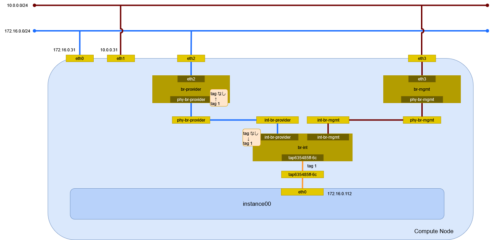

# インスタンスの作成 (flat/Open vSwitch)

flat ネットワーク(Open vSwitch)に接続するインスタンスを作成する。

## 前提条件

* [](../network/ovs_flat) を作成していること。
* flavor [](../flavor/m1_nano) を作成していること。
* イメージ [](../../installation/controller/glance) でイメージを作成していること。
* セキュリティグループのルール [](../security_group/icmp) を作成していること。
* セキュリティグループのルール [](../security_group/ssh) を作成していること。

## インスタンスの作成

インスタンス instance00 を作成する。

```sh
openstack server create \
    --flavor m1.nano \
    --image cirros \
    --nic net-id=85f372ef-f39a-42bb-a06b-9f9ed8e4e58e \
    --security-group default \
    --key-name mykey \
    instance00
```

```
+-----------------------------+-----------------------------------------------+
| Field                       | Value                                         |
+-----------------------------+-----------------------------------------------+
| OS-DCF:diskConfig           | MANUAL                                        |
| OS-EXT-AZ:availability_zone |                                               |
| OS-EXT-STS:power_state      | NOSTATE                                       |
| OS-EXT-STS:task_state       | scheduling                                    |
| OS-EXT-STS:vm_state         | building                                      |
| OS-SRV-USG:launched_at      | None                                          |
| OS-SRV-USG:terminated_at    | None                                          |
| accessIPv4                  |                                               |
| accessIPv6                  |                                               |
| addresses                   |                                               |
| adminPass                   | AL6hmBbNETWp                                  |
| config_drive                |                                               |
| created                     | 2024-04-21T14:36:39Z                          |
| flavor                      | m1.nano (0)                                   |
| hostId                      |                                               |
| id                          | 5aa817f3-b106-42b0-95d6-f2a8d1b6bea0          |
| image                       | cirros (e83903c4-7fa8-42a7-b693-f5034bc33603) |
| key_name                    | mykey                                         |
| name                        | instance00                                    |
| progress                    | 0                                             |
| project_id                  | f2aeffb34ff34ffb8959f1cd813655c6              |
| properties                  |                                               |
| security_groups             | name='87fd4685-d317-42fb-a487-28382d2c2750'   |
| status                      | BUILD                                         |
| updated                     | 2024-04-21T14:36:39Z                          |
| user_id                     | 71b5948c75f24c0f841dbf1c4eb4c4a7              |
| volumes_attached            |                                               |
+-----------------------------+-----------------------------------------------+
```

## インスタンスの確認

インスタンスが ACTIVE になったことを確認する。

```sh
openstack server list
```

```
+--------------------------------------+------------+--------+-----------------------+--------+---------+
| ID                                   | Name       | Status | Networks              | Image  | Flavor  |
+--------------------------------------+------------+--------+-----------------------+--------+---------+
| 5aa817f3-b106-42b0-95d6-f2a8d1b6bea0 | instance00 | ACTIVE | provider=172.17.0.153 | cirros | m1.nano |
+--------------------------------------+------------+--------+-----------------------+--------+---------+
```

SSH で接続できるか確認する。

```sh
ssh -i demo_rsa cirros@172.17.0.153 /sbin/ip addr
```

```
1: lo: <LOOPBACK,UP,LOWER_UP> mtu 65536 qdisc noqueue qlen 1
    link/loopback 00:00:00:00:00:00 brd 00:00:00:00:00:00
    inet 127.0.0.1/8 scope host lo
       valid_lft forever preferred_lft forever
    inet6 ::1/128 scope host
       valid_lft forever preferred_lft forever
2: eth0: <BROADCAST,MULTICAST,UP,LOWER_UP> mtu 1500 qdisc pfifo_fast qlen 1000
    link/ether fa:16:3e:e9:6a:38 brd ff:ff:ff:ff:ff:ff
    inet 172.17.0.153/12 brd 172.31.255.255 scope global eth0
       valid_lft forever preferred_lft forever
    inet6 fe80::f816:3eff:fee9:6a38/64 scope link
       valid_lft forever preferred_lft forever
```

## 環境の確認

### dnsmasq

DHCP で IP アドレスが払い出されている。

```sh
cat /var/lib/neutron/dhcp/85f372ef-f39a-42bb-a06b-9f9ed8e4e58e/leases
```

```
1713796643 fa:16:3e:e9:6a:38 172.17.0.153 host-172-17-0-153 01:fa:16:3e:e9:6a:38
```

DHCP に MAC アドレスと IP アドレスの関連が追加される。

```sh
cat /var/lib/neutron/dhcp/85f372ef-f39a-42bb-a06b-9f9ed8e4e58e/host
```

```
fa:16:3e:e9:6a:38,host-172-17-0-153.openstacklocal,172.17.0.153
```

DNS のエントリが追加される。

```sh
cat /var/lib/neutron/dhcp/85f372ef-f39a-42bb-a06b-9f9ed8e4e58e/addn_hosts
```

```
172.17.0.153    host-172-17-0-153.openstacklocal host-172-17-0-153
```

### インスタンス

Compute Node で確認する。

```sh
virsh list
```

```
 Id   名前                状態
----------------------------------
 1    instance-00000026   実行中
```

ネットワークインターフェイスの設定を確認する。

```sh
virsh dumpxml 1 | sed -n -e '/<interface/,/<\/interface>/ { p }'
```

```xml
<interface type='ethernet'>
  <mac address='fa:16:3e:e9:6a:38'/>
  <target dev='tap60ad2c85-f3'/>
  <model type='virtio'/>
  <driver name='qemu'/>
  <mtu size='1500'/>
  <alias name='net0'/>
  <address type='pci' domain='0x0000' bus='0x00' slot='0x03' function='0x0'/>
</interface>
```

### ネットワーク

Compute Node でネットワーク構成を確認する。



#### ネットワーク名前空間

ネットワーク名前空間は作成されない。

#### デバイス

TAP デバイスが追加される。

```sh
ip -d link show
```

```
(...)

7: tap60ad2c85-f3: <BROADCAST,MULTICAST,UP,LOWER_UP> mtu 1500 qdisc noqueue master ovs-system state UNKNOWN mode DEFAULT group default qlen 1000
    link/ether fe:16:3e:e9:6a:38 brd ff:ff:ff:ff:ff:ff promiscuity 1 minmtu 68 maxmtu 65521
    tun type tap pi off vnet_hdr on persist off
    openvswitch_slave addrgenmode eui64 numtxqueues 1 numrxqueues 1 gso_max_size 65536 gso_max_segs 65535
```

ブリッジを確認する。

```sh
ovs-vsctl show
```

```
9ab7209e-d2af-4403-9ddb-416bc283b632
    Manager "ptcp:6640:127.0.0.1"
        is_connected: true
    Bridge br-provider
        Controller "tcp:127.0.0.1:6633"
            is_connected: true
        fail_mode: secure
        datapath_type: system
        Port br-provider
            Interface br-provider
                type: internal
        Port phy-br-provider
            Interface phy-br-provider
                type: patch
                options: {peer=int-br-provider}
        Port eth0
            Interface eth0
                type: system
    Bridge br-int
        Controller "tcp:127.0.0.1:6633"
            is_connected: true
        fail_mode: secure
        datapath_type: system
        Port int-br-provider
            Interface int-br-provider
                type: patch
                options: {peer=phy-br-provider}
        Port tap60ad2c85-f3
            tag: 1
            Interface tap60ad2c85-f3
        Port br-int
            Interface br-int
                type: internal
    ovs_version: "3.1.4"
```

