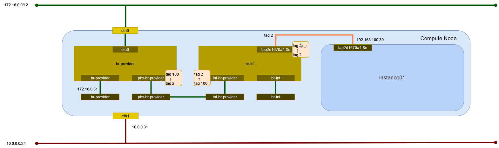

# インスタンスの作成 (vlan/Open vSwitch)

vlan ネットワーク(Open vSwitch)に接続するインスタンスを作成する。

## 前提条件

* [](../network/ovs_vlan) を作成していること。
* flavor [](../flavor/m1_milli) を作成していること。
* イメージ [](../../installation/controller/glance) でイメージを作成していること。
* [](../sshkey/keypair.md) を作成していること。
* セキュリティグループのルール [](../security_group/icmp) を作成していること。
* セキュリティグループのルール [](../security_group/ssh) を作成していること。

## インスタンスの作成

```{tip}
myuser で実行
```

インスタンス instance01 を作成する。

```sh
openstack server create \
    --flavor m1.milli \
    --image cirros062 \
    --nic net-id=d46c9e95-3ec9-4066-a5f4-6fb6aa96d386 \
    --security-group mysecurity \
    --key-name mykey \
    instance01
```

```
+--------------------------------------+--------------------------------------------------+
| Field                                | Value                                            |
+--------------------------------------+--------------------------------------------------+
| OS-DCF:diskConfig                    | MANUAL                                           |
| OS-EXT-AZ:availability_zone          |                                                  |
| OS-EXT-SRV-ATTR:host                 | None                                             |
| OS-EXT-SRV-ATTR:hypervisor_hostname  | None                                             |
| OS-EXT-SRV-ATTR:instance_name        |                                                  |
| OS-EXT-STS:power_state               | NOSTATE                                          |
| OS-EXT-STS:task_state                | scheduling                                       |
| OS-EXT-STS:vm_state                  | building                                         |
| OS-SRV-USG:launched_at               | None                                             |
| OS-SRV-USG:terminated_at             | None                                             |
| accessIPv4                           |                                                  |
| accessIPv6                           |                                                  |
| addresses                            |                                                  |
| adminPass                            | 6khdCznn9fwi                                     |
| config_drive                         |                                                  |
| created                              | 2024-05-15T15:54:52Z                             |
| flavor                               | m1.milli (1)                                     |
| hostId                               |                                                  |
| id                                   | da861f02-dad6-45e8-b82a-554204302958             |
| image                                | cirros062 (6793c9b2-7cb6-4796-b477-9e22d985ea2b) |
| key_name                             | mykey                                            |
| name                                 | instance01                                       |
| os-extended-volumes:volumes_attached | []                                               |
| progress                             | 0                                                |
| project_id                           | bccf406c045d401b91ba5c7552a124ae                 |
| properties                           |                                                  |
| security_groups                      | name='a81e0cba-8806-40aa-bde8-c030df1545c9'      |
| status                               | BUILD                                            |
| updated                              | 2024-05-15T15:54:52Z                             |
| user_id                              | 7f3acb28d26943bab9510df3a6edf3b0                 |
+--------------------------------------+--------------------------------------------------+
```

## インスタンスの確認

インスタンスが ACTIVE になったことを確認する。

```sh
openstack server list
```

```
+--------------------------------------+------------+---------+------------------------------+-----------+----------+
| ID                                   | Name       | Status  | Networks                     | Image     | Flavor   |
+--------------------------------------+------------+---------+------------------------------+-----------+----------+
| da861f02-dad6-45e8-b82a-554204302958 | instance01 | ACTIVE  | provider-100=192.168.100.200 | cirros062 | m1.milli |
+--------------------------------------+------------+---------+------------------------------+-----------+----------+
```

## 環境の確認

### dnsmasq

DHCP で IP アドレスが払い出されている。

```sh
cat /var/lib/neutron/dhcp/d46c9e95-3ec9-4066-a5f4-6fb6aa96d386/leases
```

```
1715874926 fa:16:3e:ac:ee:39 192.168.100.200 host-192-168-100-200 01:fa:16:3e:ac:ee:39
```

DHCP に MAC アドレスと IP アドレスの関連が追加される。

```sh
cat /var/lib/neutron/dhcp/d46c9e95-3ec9-4066-a5f4-6fb6aa96d386/host
```

```
fa:16:3e:ac:ee:39,host-192-168-100-200.openstacklocal,192.168.100.200
```

DNS のエントリが追加される。

```sh
cat /var/lib/neutron/dhcp/d46c9e95-3ec9-4066-a5f4-6fb6aa96d386/addn_hosts
```

```
192.168.100.200 host-192-168-100-200.openstacklocal host-192-168-100-200
```

### インスタンス

Compute Node で確認する。

```sh
virsh list
```

```
 Id   名前                状態
----------------------------------
 2    instance-00000005   実行中
```

ネットワークインターフェイスの設定を確認する。

```sh
virsh dumpxml 2 | sed -n -e '/<interface/,/<\/interface>/ { p }'
```

```xml
<interface type='ethernet'>
  <mac address='fa:16:3e:ac:ee:39'/>
  <target dev='tap0ab9a23c-99'/>
  <model type='virtio'/>
  <driver name='qemu'/>
  <mtu size='1500'/>
  <alias name='net0'/>
  <address type='pci' domain='0x0000' bus='0x00' slot='0x03' function='0x0'/>
</interface>
```

### ネットワーク

Compute Node でネットワーク構成を確認する。



#### ネットワーク名前空間

ネットワーク名前空間は作成されない。

#### デバイス

TAP デバイスが追加される。

```sh
ip -d link show
```

```
1: lo: <LOOPBACK,UP,LOWER_UP> mtu 65536 qdisc noqueue state UNKNOWN mode DEFAULT group default qlen 1000
    link/loopback 00:00:00:00:00:00 brd 00:00:00:00:00:00 promiscuity 0  allmulti 0 minmtu 0 maxmtu 0 addrgenmode eui64 numtxqueues 1 numrxqueues 1 gso_max_size 65536 gso_max_segs 65535 tso_max_size 524280 tso_max_segs 65535 gro_max_size 65536
2: eth0: <BROADCAST,MULTICAST,UP,LOWER_UP> mtu 1500 qdisc mq state UP mode DEFAULT group default qlen 1000
    link/ether 00:15:5d:bf:ba:50 brd ff:ff:ff:ff:ff:ff promiscuity 0  allmulti 0 minmtu 68 maxmtu 65521 addrgenmode none numtxqueues 64 numrxqueues 64 gso_max_size 62780 gso_max_segs 65535 tso_max_size 62780 tso_max_segs 65535 gro_max_size 65536 parentbus vmbus parentdev f4fd36cf-d20d-4c23-83bb-e1b5cc9fbfbc
3: eth1: <BROADCAST,MULTICAST,UP,LOWER_UP> mtu 1500 qdisc mq state UP mode DEFAULT group default qlen 1000
    link/ether 00:15:5d:bf:ba:57 brd ff:ff:ff:ff:ff:ff promiscuity 0  allmulti 0 minmtu 68 maxmtu 65521 addrgenmode none numtxqueues 64 numrxqueues 64 gso_max_size 62780 gso_max_segs 65535 tso_max_size 62780 tso_max_segs 65535 gro_max_size 65536 parentbus vmbus parentdev 1e1fc9b9-f159-4473-9410-cf7db6750e26
4: eth2: <BROADCAST,MULTICAST,UP,LOWER_UP> mtu 1500 qdisc mq master ovs-system state UP mode DEFAULT group default qlen 1000
    link/ether 00:15:5d:bf:ba:58 brd ff:ff:ff:ff:ff:ff promiscuity 1  allmulti 0 minmtu 68 maxmtu 65521
    openvswitch_slave addrgenmode none numtxqueues 64 numrxqueues 64 gso_max_size 62780 gso_max_segs 65535 tso_max_size 62780 tso_max_segs 65535 gro_max_size 65536 parentbus vmbus parentdev fb193242-70ac-437d-9008-4382b02d2a70
5: eth3: <BROADCAST,MULTICAST,UP,LOWER_UP> mtu 1500 qdisc mq master ovs-system state UP mode DEFAULT group default qlen 1000
    link/ether 00:15:5d:bf:ba:59 brd ff:ff:ff:ff:ff:ff promiscuity 1  allmulti 0 minmtu 68 maxmtu 65521
    openvswitch_slave addrgenmode none numtxqueues 64 numrxqueues 64 gso_max_size 62780 gso_max_segs 65535 tso_max_size 62780 tso_max_segs 65535 gro_max_size 65536 parentbus vmbus parentdev 6de0f76b-b7bc-45ba-9087-d8bee9131e1c
6: ovs-system: <BROADCAST,MULTICAST> mtu 1500 qdisc noop state DOWN mode DEFAULT group default qlen 1000
    link/ether 9a:52:96:fb:3e:83 brd ff:ff:ff:ff:ff:ff promiscuity 1  allmulti 0 minmtu 68 maxmtu 65535
    openvswitch addrgenmode eui64 numtxqueues 1 numrxqueues 1 gso_max_size 65536 gso_max_segs 65535 tso_max_size 65536 tso_max_segs 65535 gro_max_size 65536
7: br-provider: <BROADCAST,MULTICAST,UP,LOWER_UP> mtu 1500 qdisc noqueue state UNKNOWN mode DEFAULT group default qlen 1000
    link/ether 00:15:5d:bf:ba:58 brd ff:ff:ff:ff:ff:ff promiscuity 1  allmulti 0 minmtu 68 maxmtu 65535
    openvswitch addrgenmode none numtxqueues 1 numrxqueues 1 gso_max_size 65536 gso_max_segs 65535 tso_max_size 65536 tso_max_segs 65535 gro_max_size 65536
8: br-mgmt: <BROADCAST,MULTICAST,UP,LOWER_UP> mtu 1500 qdisc noqueue state UNKNOWN mode DEFAULT group default qlen 1000
    link/ether 00:15:5d:bf:ba:59 brd ff:ff:ff:ff:ff:ff promiscuity 1  allmulti 0 minmtu 68 maxmtu 65535
    openvswitch addrgenmode none numtxqueues 1 numrxqueues 1 gso_max_size 65536 gso_max_segs 65535 tso_max_size 65536 tso_max_segs 65535 gro_max_size 65536
9: br-int: <BROADCAST,MULTICAST,UP,LOWER_UP> mtu 1500 qdisc noqueue state UNKNOWN mode DEFAULT group default qlen 1000
    link/ether 42:f0:8b:66:da:47 brd ff:ff:ff:ff:ff:ff promiscuity 1  allmulti 0 minmtu 68 maxmtu 65535
    openvswitch addrgenmode none numtxqueues 1 numrxqueues 1 gso_max_size 65536 gso_max_segs 65535 tso_max_size 65536 tso_max_segs 65535 gro_max_size 65536
12: tap0ab9a23c-99: <BROADCAST,MULTICAST,UP,LOWER_UP> mtu 1500 qdisc noqueue master ovs-system state UNKNOWN mode DEFAULT group default qlen 1000
    link/ether fe:16:3e:ac:ee:39 brd ff:ff:ff:ff:ff:ff promiscuity 1  allmulti 0 minmtu 68 maxmtu 65521
    tun type tap pi off vnet_hdr on persist off
    openvswitch_slave addrgenmode eui64 numtxqueues 1 numrxqueues 1 gso_max_size 65536 gso_max_segs 65535 tso_max_size 65536 tso_max_segs 65535 gro_max_size 65536
```

#### Open vSwitch

ブリッジを確認する。

```sh
ovs-vsctl show
```

```
698493db-95ef-4c31-b419-56b3d4096f2b
    Manager "ptcp:6640:127.0.0.1"
        is_connected: true
    Bridge br-mgmt
        Controller "tcp:127.0.0.1:6633"
            is_connected: true
        fail_mode: secure
        datapath_type: system
        Port phy-br-mgmt
            Interface phy-br-mgmt
                type: patch
                options: {peer=int-br-mgmt}
        Port eth3
            Interface eth3
                type: system
    Bridge br-int
        Controller "tcp:127.0.0.1:6633"
            is_connected: true
        fail_mode: secure
        datapath_type: system
        Port tap0ab9a23c-99
            tag: 2
            Interface tap0ab9a23c-99
        Port br-int
            Interface br-int
                type: internal
        Port int-br-mgmt
            Interface int-br-mgmt
                type: patch
                options: {peer=phy-br-mgmt}
        Port tap635485ff-6c
            tag: 1
            Interface tap635485ff-6c
                error: "could not open network device tap635485ff-6c (No such device)"
        Port int-br-provider
            Interface int-br-provider
                type: patch
                options: {peer=phy-br-provider}
    Bridge br-provider
        Controller "tcp:127.0.0.1:6633"
            is_connected: true
        fail_mode: secure
        datapath_type: system
        Port eth2
            Interface eth2
                type: system
        Port phy-br-provider
            Interface phy-br-provider
                type: patch
                options: {peer=int-br-provider}
    ovs_version: "3.3.1"
```

データパスを確認する。

```sh
ovs-dpctl show
```

```
system@ovs-system:
  lookups: hit:1916 missed:427 lost:0
  flows: 0
  masks: hit:3507 total:0 hit/pkt:1.50
  cache: hit:1174 hit-rate:50.11%
  caches:
    masks-cache: size:256
  port 0: ovs-system (internal)
  port 1: br-provider (internal)
  port 2: eth2
  port 3: eth3
  port 4: br-mgmt (internal)
  port 5: br-int (internal)
  port 6: tap0ab9a23c-99
```

ブリッジ br-provider のフローのエントリを確認する。

```sh
ovs-ofctl dump-flows br-provider
```

```
 cookie=0x5c314fae3a19481b, duration=12706.145s, table=0, n_packets=134, n_bytes=13724, priority=4,in_port="phy-br-provider",dl_vlan=1 actions=strip_vlan,NORMAL
 cookie=0x5c314fae3a19481b, duration=464.991s, table=0, n_packets=126, n_bytes=10814, priority=4,in_port="phy-br-provider",dl_vlan=2 actions=mod_vlan_vid:100,NORMAL
 cookie=0x5c314fae3a19481b, duration=13801.828s, table=0, n_packets=0, n_bytes=0, priority=2,in_port="phy-br-provider" actions=drop
 cookie=0x5c314fae3a19481b, duration=13801.833s, table=0, n_packets=864, n_bytes=139009, priority=0 actions=NORMAL
```

ブリッジ br-mgmt のフローのエントリを確認する。

```sh
ovs-ofctl dump-flows br-mgmt
```

```
 cookie=0x96f7d6f4b3d5a1d8, duration=13812.811s, table=0, n_packets=876, n_bytes=129053, priority=2,in_port="phy-br-mgmt" actions=drop
 cookie=0x96f7d6f4b3d5a1d8, duration=13812.814s, table=0, n_packets=814, n_bytes=130009, priority=0 actions=NORMAL
```

ブリッジ br-int のフローのエントリを確認する。

```sh
ovs-ofctl dump-flows br-int
```

```
 cookie=0x495e20e8d5566065, duration=13822.678s, table=0, n_packets=0, n_bytes=0, priority=65535,dl_vlan=4095 actions=drop
 cookie=0x495e20e8d5566065, duration=12726.978s, table=0, n_packets=721, n_bytes=120537, priority=3,in_port="int-br-provider",vlan_tci=0x0000/0x1fff actions=mod_vlan_vid:1,resubmit(,58)
 cookie=0x495e20e8d5566065, duration=485.814s, table=0, n_packets=69, n_bytes=8552, priority=3,in_port="int-br-provider",dl_vlan=100 actions=mod_vlan_vid:2,resubmit(,58)
 cookie=0x495e20e8d5566065, duration=13822.664s, table=0, n_packets=78, n_bytes=10788, priority=2,in_port="int-br-provider" actions=drop
 cookie=0x495e20e8d5566065, duration=13822.650s, table=0, n_packets=814, n_bytes=130009, priority=2,in_port="int-br-mgmt" actions=drop
 cookie=0x495e20e8d5566065, duration=13822.681s, table=0, n_packets=276, n_bytes=25682, priority=0 actions=resubmit(,58)
 cookie=0x495e20e8d5566065, duration=13822.682s, table=23, n_packets=0, n_bytes=0, priority=0 actions=drop
 cookie=0x495e20e8d5566065, duration=13822.678s, table=24, n_packets=0, n_bytes=0, priority=0 actions=drop
 cookie=0x495e20e8d5566065, duration=13822.676s, table=30, n_packets=0, n_bytes=0, priority=0 actions=resubmit(,58)
 cookie=0x495e20e8d5566065, duration=13822.675s, table=31, n_packets=0, n_bytes=0, priority=0 actions=resubmit(,58)
 cookie=0x495e20e8d5566065, duration=13822.680s, table=58, n_packets=1066, n_bytes=154771, priority=0 actions=resubmit(,60)
 cookie=0x495e20e8d5566065, duration=483.564s, table=60, n_packets=134, n_bytes=11386, priority=100,in_port="tap0ab9a23c-99" actions=load:0x5->NXM_NX_REG5[],load:0x2->NXM_NX_REG6[],resubmit(,71)
 cookie=0x495e20e8d5566065, duration=12724.900s, table=60, n_packets=0, n_bytes=0, priority=90,vlan_tci=0x0000/0x1fff,dl_dst=fa:16:3e:55:2a:5d actions=load:0x3->NXM_NX_REG5[],load:0x1->NXM_NX_REG6[],resubmit(,81)
 cookie=0x495e20e8d5566065, duration=12724.900s, table=60, n_packets=85, n_bytes=12384, priority=90,dl_vlan=1,dl_dst=fa:16:3e:55:2a:5d actions=load:0x3->NXM_NX_REG5[],load:0x1->NXM_NX_REG6[],strip_vlan,resubmit(,81)
 cookie=0x495e20e8d5566065, duration=483.564s, table=60, n_packets=0, n_bytes=0, priority=90,dl_vlan=100,dl_dst=fa:16:3e:ac:ee:39 actions=load:0x5->NXM_NX_REG5[],load:0x2->NXM_NX_REG6[],strip_vlan,resubmit(,81)
 cookie=0x495e20e8d5566065, duration=483.564s, table=60, n_packets=69, n_bytes=8552, priority=90,dl_vlan=2,dl_dst=fa:16:3e:ac:ee:39 actions=load:0x5->NXM_NX_REG5[],load:0x2->NXM_NX_REG6[],strip_vlan,resubmit(,81)
 cookie=0x495e20e8d5566065, duration=13822.679s, table=60, n_packets=636, n_bytes=108153, priority=3 actions=NORMAL
 cookie=0x495e20e8d5566065, duration=13822.677s, table=62, n_packets=0, n_bytes=0, priority=3 actions=NORMAL
 cookie=0x495e20e8d5566065, duration=13730.407s, table=71, n_packets=0, n_bytes=0, priority=110,ct_state=+trk actions=ct_clear,resubmit(,71)
 cookie=0x495e20e8d5566065, duration=483.564s, table=71, n_packets=13, n_bytes=546, priority=95,arp,reg5=0x5,in_port="tap0ab9a23c-99",dl_src=fa:16:3e:ac:ee:39,arp_spa=192.168.100.200 actions=resubmit(,94)
 cookie=0x495e20e8d5566065, duration=483.564s, table=71, n_packets=107, n_bytes=9304, priority=65,ip,reg5=0x5,in_port="tap0ab9a23c-99",dl_src=fa:16:3e:ac:ee:39,nw_src=192.168.100.200 actions=ct(table=72,zone=NXM_NX_REG6[0..15])
 cookie=0x495e20e8d5566065, duration=483.564s, table=71, n_packets=0, n_bytes=0, priority=95,rarp,reg5=0x5,in_port="tap0ab9a23c-99",dl_src=fa:16:3e:ac:ee:39 actions=resubmit(,94)
 cookie=0x495e20e8d5566065, duration=483.563s, table=71, n_packets=0, n_bytes=0, priority=95,icmp6,reg5=0x5,in_port="tap0ab9a23c-99",dl_src=fa:16:3e:ac:ee:39,ipv6_src=fe80::f816:3eff:feac:ee39,icmp_type=130 actions=resubmit(,94)
 cookie=0x495e20e8d5566065, duration=483.563s, table=71, n_packets=4, n_bytes=280, priority=95,icmp6,reg5=0x5,in_port="tap0ab9a23c-99",dl_src=fa:16:3e:ac:ee:39,ipv6_src=fe80::f816:3eff:feac:ee39,icmp_type=133 actions=resubmit(,94)
 cookie=0x495e20e8d5566065, duration=483.563s, table=71, n_packets=0, n_bytes=0, priority=95,icmp6,reg5=0x5,in_port="tap0ab9a23c-99",dl_src=fa:16:3e:ac:ee:39,ipv6_src=fe80::f816:3eff:feac:ee39,icmp_type=135 actions=resubmit(,94)
 cookie=0x495e20e8d5566065, duration=483.563s, table=71, n_packets=0, n_bytes=0, priority=95,icmp6,reg5=0x5,in_port="tap0ab9a23c-99",icmp_type=136,nd_target=fe80::f816:3eff:feac:ee39 actions=resubmit(,94)
 cookie=0x495e20e8d5566065, duration=483.563s, table=71, n_packets=0, n_bytes=0, priority=80,udp,reg5=0x5,in_port="tap0ab9a23c-99",dl_src=fa:16:3e:ac:ee:39,nw_src=192.168.100.200,tp_src=68,tp_dst=67 actions=resubmit(,73)
 cookie=0x495e20e8d5566065, duration=483.563s, table=71, n_packets=2, n_bytes=684, priority=80,udp,reg5=0x5,in_port="tap0ab9a23c-99",dl_src=fa:16:3e:ac:ee:39,nw_src=0.0.0.0,tp_src=68,tp_dst=67 actions=resubmit(,73)
 cookie=0x495e20e8d5566065, duration=483.563s, table=71, n_packets=0, n_bytes=0, priority=80,udp6,reg5=0x5,in_port="tap0ab9a23c-99",dl_src=fa:16:3e:ac:ee:39,ipv6_src=fe80::f816:3eff:feac:ee39,tp_src=546,tp_dst=547 actions=resubmit(,73)
 cookie=0x495e20e8d5566065, duration=483.563s, table=71, n_packets=0, n_bytes=0, priority=70,udp,reg5=0x5,in_port="tap0ab9a23c-99",tp_src=67,tp_dst=68 actions=resubmit(,93)
 cookie=0x495e20e8d5566065, duration=483.563s, table=71, n_packets=0, n_bytes=0, priority=70,udp6,reg5=0x5,in_port="tap0ab9a23c-99",tp_src=547,tp_dst=546 actions=resubmit(,93)
 cookie=0x495e20e8d5566065, duration=483.563s, table=71, n_packets=0, n_bytes=0, priority=70,icmp6,reg5=0x5,in_port="tap0ab9a23c-99",icmp_type=134 actions=resubmit(,93)
 cookie=0x495e20e8d5566065, duration=483.563s, table=71, n_packets=2, n_bytes=180, priority=65,ipv6,reg5=0x5,in_port="tap0ab9a23c-99",dl_src=fa:16:3e:ac:ee:39,ipv6_src=fe80::f816:3eff:feac:ee39 actions=ct(table=72,zone=NXM_NX_REG6[0..15])
 cookie=0x495e20e8d5566065, duration=483.563s, table=71, n_packets=6, n_bytes=392, priority=10,reg5=0x5,in_port="tap0ab9a23c-99" actions=ct_clear,resubmit(,93)
 cookie=0x495e20e8d5566065, duration=13730.562s, table=71, n_packets=0, n_bytes=0, priority=0 actions=drop
 cookie=0x495e20e8d5566065, duration=12724.898s, table=72, n_packets=0, n_bytes=0, priority=74,ct_state=+est-rel-rpl,ipv6,reg5=0x3 actions=resubmit(,73)
 cookie=0x495e20e8d5566065, duration=12724.898s, table=72, n_packets=80, n_bytes=7120, priority=74,ct_state=+est-rel-rpl,ip,reg5=0x3 actions=resubmit(,73)
 cookie=0x495e20e8d5566065, duration=483.563s, table=72, n_packets=0, n_bytes=0, priority=74,ct_state=+est-rel-rpl,ipv6,reg5=0x5 actions=resubmit(,73)
 cookie=0x495e20e8d5566065, duration=483.563s, table=72, n_packets=84, n_bytes=7512, priority=74,ct_state=+est-rel-rpl,ip,reg5=0x5 actions=resubmit(,73)
 cookie=0x495e20e8d5566065, duration=12724.898s, table=72, n_packets=0, n_bytes=0, priority=74,ct_state=+new-est,ipv6,reg5=0x3 actions=resubmit(,73)
 cookie=0x495e20e8d5566065, duration=12724.898s, table=72, n_packets=23, n_bytes=1792, priority=74,ct_state=+new-est,ip,reg5=0x3 actions=resubmit(,73)
 cookie=0x495e20e8d5566065, duration=483.563s, table=72, n_packets=0, n_bytes=0, priority=74,ct_state=+new-est,ipv6,reg5=0x5 actions=resubmit(,73)
 cookie=0x495e20e8d5566065, duration=483.563s, table=72, n_packets=23, n_bytes=1792, priority=74,ct_state=+new-est,ip,reg5=0x5 actions=resubmit(,73)
 cookie=0x495e20e8d5566065, duration=483.563s, table=72, n_packets=4, n_bytes=360, priority=50,ct_state=+inv+trk actions=resubmit(,93)
 cookie=0x495e20e8d5566065, duration=12724.898s, table=72, n_packets=0, n_bytes=0, priority=50,ct_mark=0x1,reg5=0x3 actions=resubmit(,93)
 cookie=0x495e20e8d5566065, duration=483.563s, table=72, n_packets=0, n_bytes=0, priority=50,ct_mark=0x1,reg5=0x5 actions=resubmit(,93)
 cookie=0x495e20e8d5566065, duration=12724.898s, table=72, n_packets=19, n_bytes=3596, priority=50,ct_state=+est-rel+rpl,ct_zone=1,ct_mark=0,reg5=0x3 actions=resubmit(,94)
 cookie=0x495e20e8d5566065, duration=483.563s, table=72, n_packets=0, n_bytes=0, priority=50,ct_state=+est-rel+rpl,ct_zone=2,ct_mark=0,reg5=0x5 actions=resubmit(,94)
 cookie=0x495e20e8d5566065, duration=12724.898s, table=72, n_packets=0, n_bytes=0, priority=50,ct_state=-new-est+rel-inv,ct_zone=1,ct_mark=0,reg5=0x3 actions=resubmit(,94)
 cookie=0x495e20e8d5566065, duration=483.563s, table=72, n_packets=0, n_bytes=0, priority=50,ct_state=-new-est+rel-inv,ct_zone=2,ct_mark=0,reg5=0x5 actions=resubmit(,94)
 cookie=0x495e20e8d5566065, duration=12724.898s, table=72, n_packets=0, n_bytes=0, priority=40,ct_state=-est,reg5=0x3 actions=resubmit(,93)
 cookie=0x495e20e8d5566065, duration=483.563s, table=72, n_packets=0, n_bytes=0, priority=40,ct_state=-est,reg5=0x5 actions=resubmit(,93)
 cookie=0x495e20e8d5566065, duration=12724.898s, table=72, n_packets=0, n_bytes=0, priority=40,ct_state=+est,ip,reg5=0x3 actions=ct(commit,zone=NXM_NX_REG6[0..15],exec(load:0x1->NXM_NX_CT_MARK[]))
 cookie=0x495e20e8d5566065, duration=12724.898s, table=72, n_packets=0, n_bytes=0, priority=40,ct_state=+est,ipv6,reg5=0x3 actions=ct(commit,zone=NXM_NX_REG6[0..15],exec(load:0x1->NXM_NX_CT_MARK[]))
 cookie=0x495e20e8d5566065, duration=483.563s, table=72, n_packets=0, n_bytes=0, priority=40,ct_state=+est,ip,reg5=0x5 actions=ct(commit,zone=NXM_NX_REG6[0..15],exec(load:0x1->NXM_NX_CT_MARK[]))
 cookie=0x495e20e8d5566065, duration=483.563s, table=72, n_packets=0, n_bytes=0, priority=40,ct_state=+est,ipv6,reg5=0x5 actions=ct(commit,zone=NXM_NX_REG6[0..15],exec(load:0x1->NXM_NX_CT_MARK[]))
 cookie=0x495e20e8d5566065, duration=13730.532s, table=72, n_packets=0, n_bytes=0, priority=0 actions=drop
 cookie=0x495e20e8d5566065, duration=12724.899s, table=73, n_packets=0, n_bytes=0, priority=100,reg6=0x1,dl_dst=fa:16:3e:55:2a:5d actions=load:0x3->NXM_NX_REG5[],resubmit(,81)
 cookie=0x495e20e8d5566065, duration=483.563s, table=73, n_packets=0, n_bytes=0, priority=100,reg6=0x2,dl_dst=fa:16:3e:ac:ee:39 actions=load:0x5->NXM_NX_REG5[],resubmit(,81)
 cookie=0x495e20e8d5566065, duration=12724.899s, table=73, n_packets=23, n_bytes=1792, priority=90,ct_state=+new-est,ip,reg5=0x3 actions=ct(commit,zone=NXM_NX_REG6[0..15]),resubmit(,91)
 cookie=0x495e20e8d5566065, duration=12724.899s, table=73, n_packets=0, n_bytes=0, priority=90,ct_state=+new-est,ipv6,reg5=0x3 actions=ct(commit,zone=NXM_NX_REG6[0..15]),resubmit(,91)
 cookie=0x495e20e8d5566065, duration=483.563s, table=73, n_packets=23, n_bytes=1792, priority=90,ct_state=+new-est,ip,reg5=0x5 actions=ct(commit,zone=NXM_NX_REG6[0..15]),resubmit(,91)
 cookie=0x495e20e8d5566065, duration=483.563s, table=73, n_packets=0, n_bytes=0, priority=90,ct_state=+new-est,ipv6,reg5=0x5 actions=ct(commit,zone=NXM_NX_REG6[0..15]),resubmit(,91)
 cookie=0x495e20e8d5566065, duration=12724.899s, table=73, n_packets=82, n_bytes=7804, priority=80,reg5=0x3 actions=resubmit(,94)
 cookie=0x495e20e8d5566065, duration=483.563s, table=73, n_packets=86, n_bytes=8196, priority=80,reg5=0x5 actions=resubmit(,94)
 cookie=0x495e20e8d5566065, duration=13730.498s, table=73, n_packets=0, n_bytes=0, priority=0 actions=drop
 cookie=0x495e20e8d5566065, duration=12724.899s, table=81, n_packets=4, n_bytes=168, priority=100,arp,reg5=0x3 actions=output:3
 cookie=0x495e20e8d5566065, duration=483.563s, table=81, n_packets=3, n_bytes=138, priority=100,arp,reg5=0x5 actions=output:"tap0ab9a23c-99"
 cookie=0x495e20e8d5566065, duration=12724.899s, table=81, n_packets=0, n_bytes=0, priority=100,icmp6,reg5=0x3,icmp_type=130 actions=output:3
 cookie=0x495e20e8d5566065, duration=12724.898s, table=81, n_packets=0, n_bytes=0, priority=100,icmp6,reg5=0x3,icmp_type=135 actions=output:3
 cookie=0x495e20e8d5566065, duration=12724.898s, table=81, n_packets=0, n_bytes=0, priority=100,icmp6,reg5=0x3,icmp_type=136 actions=output:3
 cookie=0x495e20e8d5566065, duration=12724.898s, table=81, n_packets=0, n_bytes=0, priority=100,icmp6,reg5=0x3,icmp_type=134 actions=output:3
 cookie=0x495e20e8d5566065, duration=483.563s, table=81, n_packets=0, n_bytes=0, priority=100,icmp6,reg5=0x5,icmp_type=130 actions=output:"tap0ab9a23c-99"
 cookie=0x495e20e8d5566065, duration=483.563s, table=81, n_packets=0, n_bytes=0, priority=100,icmp6,reg5=0x5,icmp_type=135 actions=output:"tap0ab9a23c-99"
 cookie=0x495e20e8d5566065, duration=483.563s, table=81, n_packets=0, n_bytes=0, priority=100,icmp6,reg5=0x5,icmp_type=136 actions=output:"tap0ab9a23c-99"
 cookie=0x495e20e8d5566065, duration=483.563s, table=81, n_packets=0, n_bytes=0, priority=100,icmp6,reg5=0x5,icmp_type=134 actions=output:"tap0ab9a23c-99"
 cookie=0x495e20e8d5566065, duration=12724.898s, table=81, n_packets=2, n_bytes=778, priority=95,udp,reg5=0x3,tp_src=67,tp_dst=68 actions=output:3
 cookie=0x495e20e8d5566065, duration=12724.898s, table=81, n_packets=0, n_bytes=0, priority=95,udp6,reg5=0x3,tp_src=547,tp_dst=546 actions=output:3
 cookie=0x495e20e8d5566065, duration=483.563s, table=81, n_packets=2, n_bytes=792, priority=95,udp,reg5=0x5,tp_src=67,tp_dst=68 actions=output:"tap0ab9a23c-99"
 cookie=0x495e20e8d5566065, duration=483.563s, table=81, n_packets=0, n_bytes=0, priority=95,udp6,reg5=0x5,tp_src=547,tp_dst=546 actions=output:"tap0ab9a23c-99"
 cookie=0x495e20e8d5566065, duration=12724.898s, table=81, n_packets=79, n_bytes=11438, priority=90,ct_state=-trk,ip,reg5=0x3 actions=ct(table=82,zone=NXM_NX_REG6[0..15])
 cookie=0x495e20e8d5566065, duration=12724.898s, table=81, n_packets=0, n_bytes=0, priority=90,ct_state=-trk,ipv6,reg5=0x3 actions=ct(table=82,zone=NXM_NX_REG6[0..15])
 cookie=0x495e20e8d5566065, duration=483.563s, table=81, n_packets=64, n_bytes=7622, priority=90,ct_state=-trk,ip,reg5=0x5 actions=ct(table=82,zone=NXM_NX_REG6[0..15])
 cookie=0x495e20e8d5566065, duration=483.563s, table=81, n_packets=0, n_bytes=0, priority=90,ct_state=-trk,ipv6,reg5=0x5 actions=ct(table=82,zone=NXM_NX_REG6[0..15])
 cookie=0x495e20e8d5566065, duration=12724.898s, table=81, n_packets=0, n_bytes=0, priority=80,ct_state=+trk,reg5=0x3 actions=resubmit(,82)
 cookie=0x495e20e8d5566065, duration=483.563s, table=81, n_packets=0, n_bytes=0, priority=80,ct_state=+trk,reg5=0x5 actions=resubmit(,82)
 cookie=0x495e20e8d5566065, duration=13730.465s, table=81, n_packets=0, n_bytes=0, priority=0 actions=drop
 cookie=0x495e20e8d5566065, duration=12724.898s, table=82, n_packets=20, n_bytes=4525, priority=77,ct_state=+est-rel-rpl,tcp,reg5=0x3,tp_dst=22 actions=output:3
 cookie=0x495e20e8d5566065, duration=483.563s, table=82, n_packets=0, n_bytes=0, priority=77,ct_state=+est-rel-rpl,tcp,reg5=0x5,tp_dst=22 actions=output:"tap0ab9a23c-99"
 cookie=0x495e20e8d5566065, duration=12724.898s, table=82, n_packets=1, n_bytes=74, priority=77,ct_state=+new-est,tcp,reg5=0x3,tp_dst=22 actions=ct(commit,zone=NXM_NX_REG6[0..15]),output:3,resubmit(,92)
 cookie=0x495e20e8d5566065, duration=483.563s, table=82, n_packets=0, n_bytes=0, priority=77,ct_state=+new-est,tcp,reg5=0x5,tp_dst=22 actions=ct(commit,zone=NXM_NX_REG6[0..15]),output:"tap0ab9a23c-99",resubmit(,92)
 cookie=0x495e20e8d5566065, duration=12724.898s, table=82, n_packets=0, n_bytes=0, priority=75,ct_state=+est-rel-rpl,icmp,reg5=0x3 actions=output:3
 cookie=0x495e20e8d5566065, duration=483.563s, table=82, n_packets=0, n_bytes=0, priority=75,ct_state=+est-rel-rpl,icmp,reg5=0x5 actions=output:"tap0ab9a23c-99"
 cookie=0x495e20e8d5566065, duration=12724.898s, table=82, n_packets=0, n_bytes=0, priority=75,ct_state=+new-est,icmp,reg5=0x3 actions=ct(commit,zone=NXM_NX_REG6[0..15]),output:3,resubmit(,92)
 cookie=0x495e20e8d5566065, duration=483.563s, table=82, n_packets=0, n_bytes=0, priority=75,ct_state=+new-est,icmp,reg5=0x5 actions=ct(commit,zone=NXM_NX_REG6[0..15]),output:"tap0ab9a23c-99",resubmit(,92)
 cookie=0x495e20e8d5566065, duration=483.563s, table=82, n_packets=0, n_bytes=0, priority=50,ct_state=+inv+trk actions=resubmit(,93)
 cookie=0x495e20e8d5566065, duration=12724.898s, table=82, n_packets=0, n_bytes=0, priority=50,ct_mark=0x1,reg5=0x3 actions=resubmit(,93)
 cookie=0x495e20e8d5566065, duration=483.563s, table=82, n_packets=0, n_bytes=0, priority=50,ct_mark=0x1,reg5=0x5 actions=resubmit(,93)
 cookie=0x495e20e8d5566065, duration=12724.898s, table=82, n_packets=58, n_bytes=6839, priority=50,ct_state=+est-rel+rpl,ct_zone=1,ct_mark=0,reg5=0x3 actions=output:3
 cookie=0x495e20e8d5566065, duration=483.563s, table=82, n_packets=64, n_bytes=7366, priority=50,ct_state=+est-rel+rpl,ct_zone=2,ct_mark=0,reg5=0x5 actions=output:"tap0ab9a23c-99"
 cookie=0x495e20e8d5566065, duration=12724.898s, table=82, n_packets=0, n_bytes=0, priority=50,ct_state=-new-est+rel-inv,ct_zone=1,ct_mark=0,reg5=0x3 actions=output:3
 cookie=0x495e20e8d5566065, duration=483.563s, table=82, n_packets=0, n_bytes=0, priority=50,ct_state=-new-est+rel-inv,ct_zone=2,ct_mark=0,reg5=0x5 actions=output:"tap0ab9a23c-99"
 cookie=0x495e20e8d5566065, duration=12724.898s, table=82, n_packets=0, n_bytes=0, priority=40,ct_state=-est,reg5=0x3 actions=resubmit(,93)
 cookie=0x495e20e8d5566065, duration=483.563s, table=82, n_packets=0, n_bytes=0, priority=40,ct_state=-est,reg5=0x5 actions=resubmit(,93)
 cookie=0x495e20e8d5566065, duration=12724.898s, table=82, n_packets=0, n_bytes=0, priority=40,ct_state=+est,ip,reg5=0x3 actions=ct(commit,zone=NXM_NX_REG6[0..15],exec(load:0x1->NXM_NX_CT_MARK[]))
 cookie=0x495e20e8d5566065, duration=12724.898s, table=82, n_packets=0, n_bytes=0, priority=40,ct_state=+est,ipv6,reg5=0x3 actions=ct(commit,zone=NXM_NX_REG6[0..15],exec(load:0x1->NXM_NX_CT_MARK[]))
 cookie=0x495e20e8d5566065, duration=483.563s, table=82, n_packets=0, n_bytes=0, priority=40,ct_state=+est,ip,reg5=0x5 actions=ct(commit,zone=NXM_NX_REG6[0..15],exec(load:0x1->NXM_NX_CT_MARK[]))
 cookie=0x495e20e8d5566065, duration=483.563s, table=82, n_packets=0, n_bytes=0, priority=40,ct_state=+est,ipv6,reg5=0x5 actions=ct(commit,zone=NXM_NX_REG6[0..15],exec(load:0x1->NXM_NX_CT_MARK[]))
 cookie=0x495e20e8d5566065, duration=13730.436s, table=82, n_packets=0, n_bytes=0, priority=0 actions=drop
 cookie=0x495e20e8d5566065, duration=13730.333s, table=91, n_packets=46, n_bytes=3584, priority=1 actions=resubmit(,94)
 cookie=0x495e20e8d5566065, duration=13730.297s, table=92, n_packets=1, n_bytes=74, priority=0 actions=drop
 cookie=0x495e20e8d5566065, duration=13730.266s, table=93, n_packets=16, n_bytes=1144, priority=0 actions=drop
 cookie=0x495e20e8d5566065, duration=13730.376s, table=94, n_packets=260, n_bytes=24538, priority=1 actions=NORMAL
```
