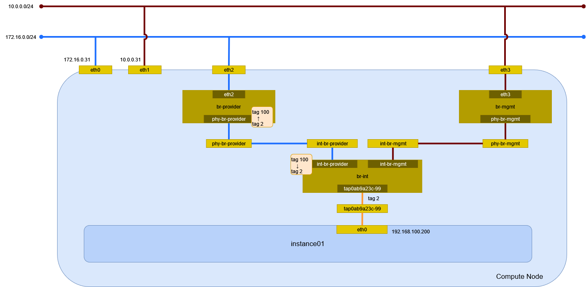

# インスタンスの作成 (vlan/Open vSwitch)

vlan ネットワーク(Open vSwitch)に接続するインスタンスを作成する。

## 前提条件

* [](../network/ovs_vlan) を作成していること。
* flavor [](../flavor/m1_nano) を作成していること。
* イメージ [](../../installation/controller/glance) でイメージを作成していること。
* セキュリティグループのルール [](../security_group/icmp) を作成していること。
* セキュリティグループのルール [](../security_group/ssh) を作成していること。

## インスタンスの作成

インスタンス instance01 を作成する。

```sh
openstack server create \
    --flavor m1.nano \
    --image cirros \
    --nic net-id=fab2345c-5de9-4fda-8342-f0430a9239ea \
    --security-group default \
    --key-name mykey \
    instance01
```

```
+-----------------------------+-----------------------------------------------+
| Field                       | Value                                         |
+-----------------------------+-----------------------------------------------+
| OS-DCF:diskConfig           | MANUAL                                        |
| OS-EXT-AZ:availability_zone |                                               |
| OS-EXT-STS:power_state      | NOSTATE                                       |
| OS-EXT-STS:task_state       | scheduling                                    |
| OS-EXT-STS:vm_state         | building                                      |
| OS-SRV-USG:launched_at      | None                                          |
| OS-SRV-USG:terminated_at    | None                                          |
| accessIPv4                  |                                               |
| accessIPv6                  |                                               |
| addresses                   |                                               |
| adminPass                   | nTdMe5yk7pAi                                  |
| config_drive                |                                               |
| created                     | 2024-04-21T15:56:11Z                          |
| flavor                      | m1.nano (0)                                   |
| hostId                      |                                               |
| id                          | 45ee5234-e888-4ab8-91d1-d8d646a382ae          |
| image                       | cirros (e83903c4-7fa8-42a7-b693-f5034bc33603) |
| key_name                    | mykey                                         |
| name                        | instance01                                    |
| progress                    | 0                                             |
| project_id                  | f2aeffb34ff34ffb8959f1cd813655c6              |
| properties                  |                                               |
| security_groups             | name='87fd4685-d317-42fb-a487-28382d2c2750'   |
| status                      | BUILD                                         |
| updated                     | 2024-04-21T15:56:11Z                          |
| user_id                     | 71b5948c75f24c0f841dbf1c4eb4c4a7              |
| volumes_attached            |                                               |
+-----------------------------+-----------------------------------------------+
```

## インスタンスの確認

インスタンスが ACTIVE になったことを確認する。

```sh
openstack server list
```

```
+--------------------------------------+------------+--------+-----------------------------+--------+---------+
| ID                                   | Name       | Status | Networks                    | Image  | Flavor  |
+--------------------------------------+------------+--------+-----------------------------+--------+---------+
| 45ee5234-e888-4ab8-91d1-d8d646a382ae | instance01 | ACTIVE | provider-100=192.168.100.30 | cirros | m1.nano |
+--------------------------------------+------------+--------+-----------------------------+--------+---------+
```

## 環境の確認

### dnsmasq

DHCP で IP アドレスが払い出されている。

```sh
cat /var/lib/neutron/dhcp/fab2345c-5de9-4fda-8342-f0430a9239ea/leases
```

```
1713801412 fa:16:3e:bc:78:a8 192.168.100.30 host-192-168-100-30 01:fa:16:3e:bc:78:a8
```

DHCP に MAC アドレスと IP アドレスの関連が追加される。

```sh
cat /var/lib/neutron/dhcp/fab2345c-5de9-4fda-8342-f0430a9239ea/host
```

```
fa:16:3e:bc:78:a8,host-192-168-100-30.openstacklocal,192.168.100.30
```

DNS のエントリが追加される。

```sh
cat /var/lib/neutron/dhcp/fab2345c-5de9-4fda-8342-f0430a9239ea/addn_hosts
```

```
192.168.100.30  host-192-168-100-30.openstacklocal host-192-168-100-30
```

### インスタンス

Compute Node で確認する。

```sh
virsh list
```

```
 Id   名前                状態
----------------------------------
 2    instance-00000027   実行中
```

ネットワークインターフェイスの設定を確認する。

```sh
virsh dumpxml 2 | sed -n -e '/<interface/,/<\/interface>/ { p }'
```

```xml
<interface type='ethernet'>
  <mac address='fa:16:3e:bc:78:a8'/>
  <target dev='tap2d1670a4-8e'/>
  <model type='virtio'/>
  <driver name='qemu'/>
  <mtu size='1500'/>
  <alias name='net0'/>
  <address type='pci' domain='0x0000' bus='0x00' slot='0x03' function='0x0'/>
</interface>
```

### ネットワーク

Compute Node でネットワーク構成を確認する。



#### ネットワーク名前空間

ネットワーク名前空間は作成されない。

#### デバイス

TAP デバイスが追加される。

```sh
ip -d link show
```

```
(...)

8: tap2d1670a4-8e: <BROADCAST,MULTICAST,UP,LOWER_UP> mtu 1500 qdisc noqueue master ovs-system state UNKNOWN mode DEFAULT group default qlen 1000
    link/ether fe:16:3e:bc:78:a8 brd ff:ff:ff:ff:ff:ff promiscuity 1 minmtu 68 maxmtu 65521
    tun type tap pi off vnet_hdr on persist off
    openvswitch_slave addrgenmode eui64 numtxqueues 1 numrxqueues 1 gso_max_size 65536 gso_max_segs 65535
```

#### Open vSwitch

ブリッジを確認する。

```sh
ovs-vsctl show
```

```
9ab7209e-d2af-4403-9ddb-416bc283b632
    Manager "ptcp:6640:127.0.0.1"
        is_connected: true
    Bridge br-provider
        Controller "tcp:127.0.0.1:6633"
            is_connected: true
        fail_mode: secure
        datapath_type: system
        Port br-provider
            Interface br-provider
                type: internal
        Port eth0
            Interface eth0
                type: system
        Port phy-br-provider
            Interface phy-br-provider
                type: patch
                options: {peer=int-br-provider}
    Bridge br-int
        Controller "tcp:127.0.0.1:6633"
            is_connected: true
        fail_mode: secure
        datapath_type: system
        Port tap60ad2c85-f3
            tag: 1
            Interface tap60ad2c85-f3
        Port int-br-provider
            Interface int-br-provider
                type: patch
                options: {peer=phy-br-provider}
        Port tap2d1670a4-8e
            tag: 2
            Interface tap2d1670a4-8e
        Port br-int
            Interface br-int
                type: internal
    ovs_version: "3.1.4"
```

フローを確認する。

```sh
ovs-ofctl show br-provider
```

```
OFPT_FEATURES_REPLY (xid=0x2): dpid:000000155dbfba42
n_tables:254, n_buffers:0
capabilities: FLOW_STATS TABLE_STATS PORT_STATS QUEUE_STATS ARP_MATCH_IP
actions: output enqueue set_vlan_vid set_vlan_pcp strip_vlan mod_dl_src mod_dl_dst mod_nw_src mod_nw_dst mod_nw_tos mod_tp_src mod_tp_dst
 1(eth0): addr:00:15:5d:bf:ba:42
     config:     0
     state:      0
     current:    10GB-FD
     speed: 10000 Mbps now, 0 Mbps max
 2(phy-br-provider): addr:9a:9c:17:6c:1a:b8
     config:     0
     state:      0
     speed: 0 Mbps now, 0 Mbps max
 LOCAL(br-provider): addr:00:15:5d:bf:ba:42
     config:     0
     state:      0
     speed: 0 Mbps now, 0 Mbps max
OFPT_GET_CONFIG_REPLY (xid=0x4): frags=normal miss_send_len=0
```

```sh
ovs-ofctl show br-int
```

```
OFPT_FEATURES_REPLY (xid=0x2): dpid:0000d68b3895ac45
n_tables:254, n_buffers:0
capabilities: FLOW_STATS TABLE_STATS PORT_STATS QUEUE_STATS ARP_MATCH_IP
actions: output enqueue set_vlan_vid set_vlan_pcp strip_vlan mod_dl_src mod_dl_dst mod_nw_src mod_nw_dst mod_nw_tos mod_tp_src mod_tp_dst
 1(int-br-provider): addr:2e:aa:84:09:8e:ad
     config:     0
     state:      0
     speed: 0 Mbps now, 0 Mbps max
 2(tap60ad2c85-f3): addr:fe:16:3e:e9:6a:38
     config:     0
     state:      0
     current:    10MB-FD COPPER
     speed: 10 Mbps now, 0 Mbps max
 3(tap2d1670a4-8e): addr:fe:16:3e:bc:78:a8
     config:     0
     state:      0
     current:    10MB-FD COPPER
     speed: 10 Mbps now, 0 Mbps max
 LOCAL(br-int): addr:d6:8b:38:95:ac:45
     config:     0
     state:      0
     speed: 0 Mbps now, 0 Mbps max
OFPT_GET_CONFIG_REPLY (xid=0x4): frags=normal miss_send_len=0
```

フローのエントリを確認する。

```sh
ovs-ofctl dump-flows br-provider
```

```
 cookie=0x5cba03097712b897, duration=4457.758s, table=0, n_packets=114, n_bytes=10366, priority=4,in_port="phy-br-provider",dl_vlan=1 actions=strip_vlan,NORMAL
 cookie=0x5cba03097712b897, duration=832.490s, table=0, n_packets=124, n_bytes=10704, priority=4,in_port="phy-br-provider",dl_vlan=2 actions=mod_vlan_vid:100,NORMAL
 cookie=0x5cba03097712b897, duration=4609.748s, table=0, n_packets=0, n_bytes=0, priority=2,in_port="phy-br-provider" actions=drop
 cookie=0x5cba03097712b897, duration=4609.751s, table=0, n_packets=416, n_bytes=58734, priority=0 actions=NORMAL
```

```sh
ovs-ofctl dump-flows br-int
```

```
(...)

 cookie=0xcd5d17f4f72cc4b6, duration=880.789s, table=0, n_packets=70, n_bytes=8597, priority=3,in_port="int-br-provider",dl_vlan=100 actions=mod_vlan_vid:2,resubmit(,59)
 cookie=0xcd5d17f4f72cc4b6, duration=878.554s, table=60, n_packets=129, n_bytes=11142, priority=100,in_port="tap2d1670a4-8e" actions=load:0x3->NXM_NX_REG5[],load:0x2->NXM_NX_REG6[],resubmit(,71)
 cookie=0xcd5d17f4f72cc4b6, duration=878.554s, table=60, n_packets=0, n_bytes=0, priority=90,dl_vlan=100,dl_dst=fa:16:3e:bc:78:a8 actions=load:0x3->NXM_NX_REG5[],load:0x2->NXM_NX_REG6[],strip_vlan,resubmit(,81)
 cookie=0xcd5d17f4f72cc4b6, duration=878.554s, table=60, n_packets=70, n_bytes=8597, priority=90,dl_vlan=2,dl_dst=fa:16:3e:bc:78:a8 actions=load:0x3->NXM_NX_REG5[],load:0x2->NXM_NX_REG6[],strip_vlan,resubmit(,81)
 cookie=0xcd5d17f4f72cc4b6, duration=878.554s, table=71, n_packets=12, n_bytes=504, priority=95,arp,reg5=0x3,in_port="tap2d1670a4-8e",dl_src=fa:16:3e:bc:78:a8,arp_spa=192.168.100.30 actions=resubmit(,94)
 cookie=0xcd5d17f4f72cc4b6, duration=878.554s, table=71, n_packets=107, n_bytes=9304, priority=65,ip,reg5=0x3,in_port="tap2d1670a4-8e",dl_src=fa:16:3e:bc:78:a8,nw_src=192.168.100.30 actions=ct(table=72,zone=NXM_NX_REG6[0..15])
 cookie=0xcd5d17f4f72cc4b6, duration=878.554s, table=71, n_packets=0, n_bytes=0, priority=95,icmp6,reg5=0x3,in_port="tap2d1670a4-8e",dl_src=fa:16:3e:bc:78:a8,ipv6_src=fe80::f816:3eff:febc:78a8,icmp_type=130 actions=resubmit(,94)
 cookie=0xcd5d17f4f72cc4b6, duration=878.554s, table=71, n_packets=3, n_bytes=210, priority=95,icmp6,reg5=0x3,in_port="tap2d1670a4-8e",dl_src=fa:16:3e:bc:78:a8,ipv6_src=fe80::f816:3eff:febc:78a8,icmp_type=133 actions=resubmit(,94)
 cookie=0xcd5d17f4f72cc4b6, duration=878.554s, table=71, n_packets=0, n_bytes=0, priority=95,icmp6,reg5=0x3,in_port="tap2d1670a4-8e",dl_src=fa:16:3e:bc:78:a8,ipv6_src=fe80::f816:3eff:febc:78a8,icmp_type=135 actions=resubmit(,94)
 cookie=0xcd5d17f4f72cc4b6, duration=878.553s, table=71, n_packets=0, n_bytes=0, priority=95,icmp6,reg5=0x3,in_port="tap2d1670a4-8e",icmp_type=136,nd_target=fe80::f816:3eff:febc:78a8 actions=resubmit(,94)
 cookie=0xcd5d17f4f72cc4b6, duration=878.553s, table=71, n_packets=0, n_bytes=0, priority=80,udp,reg5=0x3,in_port="tap2d1670a4-8e",dl_src=fa:16:3e:bc:78:a8,nw_src=192.168.100.30,tp_src=68,tp_dst=67 actions=resubmit(,73)
 cookie=0xcd5d17f4f72cc4b6, duration=878.553s, table=71, n_packets=2, n_bytes=686, priority=80,udp,reg5=0x3,in_port="tap2d1670a4-8e",dl_src=fa:16:3e:bc:78:a8,nw_src=0.0.0.0,tp_src=68,tp_dst=67 actions=resubmit(,73)
 cookie=0xcd5d17f4f72cc4b6, duration=878.553s, table=71, n_packets=0, n_bytes=0, priority=80,udp6,reg5=0x3,in_port="tap2d1670a4-8e",dl_src=fa:16:3e:bc:78:a8,ipv6_src=fe80::f816:3eff:febc:78a8,tp_src=546,tp_dst=547 actions=resubmit(,73)
 cookie=0xcd5d17f4f72cc4b6, duration=878.553s, table=71, n_packets=0, n_bytes=0, priority=70,udp,reg5=0x3,in_port="tap2d1670a4-8e",tp_src=67,tp_dst=68 actions=resubmit(,93)
 cookie=0xcd5d17f4f72cc4b6, duration=878.553s, table=71, n_packets=0, n_bytes=0, priority=70,udp6,reg5=0x3,in_port="tap2d1670a4-8e",tp_src=547,tp_dst=546 actions=resubmit(,93)
 cookie=0xcd5d17f4f72cc4b6, duration=878.553s, table=71, n_packets=0, n_bytes=0, priority=70,icmp6,reg5=0x3,in_port="tap2d1670a4-8e",icmp_type=134 actions=resubmit(,93)
 cookie=0xcd5d17f4f72cc4b6, duration=878.553s, table=71, n_packets=2, n_bytes=180, priority=65,ipv6,reg5=0x3,in_port="tap2d1670a4-8e",dl_src=fa:16:3e:bc:78:a8,ipv6_src=fe80::f816:3eff:febc:78a8 actions=ct(table=72,zone=NXM_NX_REG6[0..15])
 cookie=0xcd5d17f4f72cc4b6, duration=878.552s, table=71, n_packets=3, n_bytes=258, priority=10,reg5=0x3,in_port="tap2d1670a4-8e" actions=ct_clear,resubmit(,93)
 cookie=0xcd5d17f4f72cc4b6, duration=878.552s, table=73, n_packets=0, n_bytes=0, priority=100,reg6=0x2,dl_dst=fa:16:3e:bc:78:a8 actions=load:0x3->NXM_NX_REG5[],resubmit(,81)
 cookie=0xcd5d17f4f72cc4b6, duration=878.549s, table=81, n_packets=3, n_bytes=138, priority=100,arp,reg5=0x3 actions=output:"tap2d1670a4-8e"
 cookie=0xcd5d17f4f72cc4b6, duration=878.549s, table=81, n_packets=0, n_bytes=0, priority=100,icmp6,reg5=0x3,icmp_type=130 actions=output:"tap2d1670a4-8e"
 cookie=0xcd5d17f4f72cc4b6, duration=878.548s, table=81, n_packets=0, n_bytes=0, priority=100,icmp6,reg5=0x3,icmp_type=135 actions=output:"tap2d1670a4-8e"
 cookie=0xcd5d17f4f72cc4b6, duration=878.548s, table=81, n_packets=0, n_bytes=0, priority=100,icmp6,reg5=0x3,icmp_type=136 actions=output:"tap2d1670a4-8e"
 cookie=0xcd5d17f4f72cc4b6, duration=878.548s, table=81, n_packets=0, n_bytes=0, priority=100,icmp6,reg5=0x3,icmp_type=134 actions=output:"tap2d1670a4-8e"
 cookie=0xcd5d17f4f72cc4b6, duration=878.548s, table=81, n_packets=2, n_bytes=769, priority=95,udp,reg5=0x3,tp_src=67,tp_dst=68 actions=output:"tap2d1670a4-8e"
 cookie=0xcd5d17f4f72cc4b6, duration=878.544s, table=81, n_packets=0, n_bytes=0, priority=95,udp6,reg5=0x3,tp_src=547,tp_dst=546 actions=output:"tap2d1670a4-8e"
 cookie=0xcd5d17f4f72cc4b6, duration=878.541s, table=82, n_packets=0, n_bytes=0, priority=77,ct_state=+est-rel-rpl,tcp,reg5=0x3,tp_dst=22 actions=output:"tap2d1670a4-8e"
 cookie=0xcd5d17f4f72cc4b6, duration=878.541s, table=82, n_packets=0, n_bytes=0, priority=77,ct_state=+new-est,tcp,reg5=0x3,tp_dst=22 actions=ct(commit,zone=NXM_NX_REG6[0..15]),output:"tap2d1670a4-8e",resubmit(,92)
 cookie=0xcd5d17f4f72cc4b6, duration=878.541s, table=82, n_packets=0, n_bytes=0, priority=75,ct_state=+est-rel-rpl,icmp,reg5=0x3 actions=output:"tap2d1670a4-8e"
 cookie=0xcd5d17f4f72cc4b6, duration=878.541s, table=82, n_packets=0, n_bytes=0, priority=75,ct_state=+new-est,icmp,reg5=0x3 actions=ct(commit,zone=NXM_NX_REG6[0..15]),output:"tap2d1670a4-8e",resubmit(,92)
 cookie=0xcd5d17f4f72cc4b6, duration=878.540s, table=82, n_packets=0, n_bytes=0, priority=70,conj_id=16,ct_state=+est-rel-rpl,ip,reg5=0x3 actions=load:0x10->NXM_NX_REG7[],output:"tap2d1670a4-8e"
 cookie=0xcd5d17f4f72cc4b6, duration=878.540s, table=82, n_packets=0, n_bytes=0, priority=70,conj_id=24,ct_state=+est-rel-rpl,ipv6,reg5=0x3 actions=load:0x18->NXM_NX_REG7[],output:"tap2d1670a4-8e"
 cookie=0xcd5d17f4f72cc4b6, duration=878.540s, table=82, n_packets=0, n_bytes=0, priority=70,conj_id=17,ct_state=+new-est,ip,reg5=0x3 actions=load:0x11->NXM_NX_REG7[],ct(commit,zone=NXM_NX_REG6[0..15]),output:"tap2d1670a4-8e",resubmit(,92)
 cookie=0xcd5d17f4f72cc4b6, duration=878.540s, table=82, n_packets=0, n_bytes=0, priority=70,conj_id=25,ct_state=+new-est,ipv6,reg5=0x3 actions=load:0x19->NXM_NX_REG7[],ct(commit,zone=NXM_NX_REG6[0..15]),output:"tap2d1670a4-8e",resubmit(,92)
 cookie=0x1d8e74efef4967c4, duration=882.743s, table=82, n_packets=0, n_bytes=0, priority=70,ct_state=+est-rel-rpl,ip,reg6=0x1,nw_src=192.168.100.30 actions=conjunction(16,1/2)
 cookie=0xcd5d17f4f72cc4b6, duration=880.736s, table=82, n_packets=0, n_bytes=0, priority=70,ct_state=+est-rel-rpl,ip,reg6=0x2,nw_src=192.168.100.30 actions=conjunction(16,1/2)
 cookie=0x1d8e74efef4967c4, duration=882.743s, table=82, n_packets=0, n_bytes=0, priority=70,ct_state=+new-est,ip,reg6=0x1,nw_src=192.168.100.30 actions=conjunction(17,1/2)
 cookie=0xcd5d17f4f72cc4b6, duration=880.736s, table=82, n_packets=0, n_bytes=0, priority=70,ct_state=+new-est,ip,reg6=0x2,nw_src=192.168.100.30 actions=conjunction(17,1/2)
 cookie=0xcd5d17f4f72cc4b6, duration=878.543s, table=82, n_packets=65, n_bytes=7430, priority=50,ct_state=+est-rel+rpl,ct_zone=2,ct_mark=0,reg5=0x3 actions=output:"tap2d1670a4-8e"
 cookie=0xcd5d17f4f72cc4b6, duration=878.543s, table=82, n_packets=0, n_bytes=0, priority=50,ct_state=-new-est+rel-inv,ct_zone=2,ct_mark=0,reg5=0x3 actions=output:"tap2d1670a4-8e"
```
