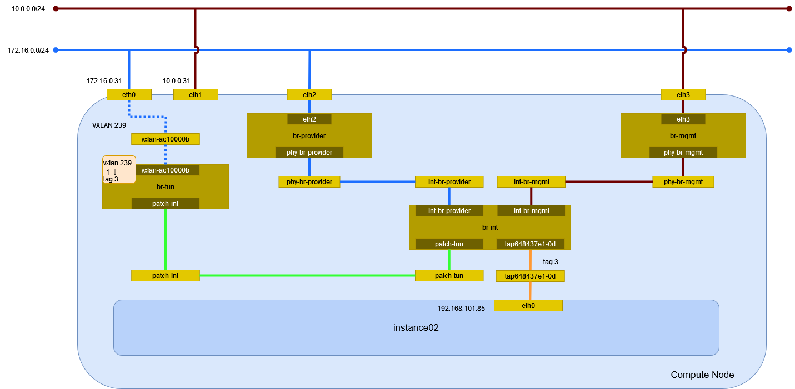

# インスタンスの作成 (vxlan/Open vSwitch)

vxlan ネットワーク(Open vSwitch)に接続するインスタンスを作成する。

## 前提条件

* [](../network/ovs_vxlan) を作成していること。
* flavor [](../flavor/m1_milli) を作成していること。
* イメージ [](../../installation/controller/glance) でイメージを作成していること。
* [](../sshkey/keypair.md) を作成していること。
* セキュリティグループのルール [](../security_group/icmp) を作成していること。
* セキュリティグループのルール [](../security_group/ssh) を作成していること。

## インスタンスの作成

```{tip}
myuser で実行
```

インスタンス instance02 を作成する。

```sh
openstack server create \
    --flavor m1.milli \
    --image cirros062 \
    --nic net-id=6ee86f5e-5d22-4c00-a2cd-6622ec856e17 \
    --security-group mysecurity \
    --key-name mykey \
    instance02
```

```
+--------------------------------------+--------------------------------------------------+
| Field                                | Value                                            |
+--------------------------------------+--------------------------------------------------+
| OS-DCF:diskConfig                    | MANUAL                                           |
| OS-EXT-AZ:availability_zone          |                                                  |
| OS-EXT-SRV-ATTR:host                 | None                                             |
| OS-EXT-SRV-ATTR:hypervisor_hostname  | None                                             |
| OS-EXT-SRV-ATTR:instance_name        |                                                  |
| OS-EXT-STS:power_state               | NOSTATE                                          |
| OS-EXT-STS:task_state                | scheduling                                       |
| OS-EXT-STS:vm_state                  | building                                         |
| OS-SRV-USG:launched_at               | None                                             |
| OS-SRV-USG:terminated_at             | None                                             |
| accessIPv4                           |                                                  |
| accessIPv6                           |                                                  |
| addresses                            |                                                  |
| adminPass                            | moWp2AzG9vDe                                     |
| config_drive                         |                                                  |
| created                              | 2024-05-16T15:41:25Z                             |
| flavor                               | m1.milli (1)                                     |
| hostId                               |                                                  |
| id                                   | 2337b0eb-372c-43b8-923e-90a89337d211             |
| image                                | cirros062 (6793c9b2-7cb6-4796-b477-9e22d985ea2b) |
| key_name                             | mykey                                            |
| name                                 | instance02                                       |
| os-extended-volumes:volumes_attached | []                                               |
| progress                             | 0                                                |
| project_id                           | bccf406c045d401b91ba5c7552a124ae                 |
| properties                           |                                                  |
| security_groups                      | name='a81e0cba-8806-40aa-bde8-c030df1545c9'      |
| status                               | BUILD                                            |
| updated                              | 2024-05-16T15:41:25Z                             |
| user_id                              | 7f3acb28d26943bab9510df3a6edf3b0                 |
+--------------------------------------+--------------------------------------------------+
```

## インスタンスの確認

インスタンスが ACTIVE になったことを確認する。

```sh
openstack server list
```

```
+--------------------------------------+------------+---------+------------------------------+-----------+----------+
| ID                                   | Name       | Status  | Networks                     | Image     | Flavor   |
+--------------------------------------+------------+---------+------------------------------+-----------+----------+
| 2337b0eb-372c-43b8-923e-90a89337d211 | instance02 | ACTIVE  | selfservice=192.168.101.85   | cirros062 | m1.milli |
+--------------------------------------+------------+---------+------------------------------+-----------+----------+
```

## 環境の確認

### dnsmasq

DHCP で IP アドレスが払い出されている。

```sh
cat /var/lib/neutron/dhcp/6ee86f5e-5d22-4c00-a2cd-6622ec856e17/leases
```

```
1715960522 fa:16:3e:61:21:c6 192.168.101.85 host-192-168-101-85 01:fa:16:3e:61:21:c6
```

DHCP に MAC アドレスと IP アドレスの関連が追加される。

```sh
cat /var/lib/neutron/dhcp/6ee86f5e-5d22-4c00-a2cd-6622ec856e17/host
```

```
fa:16:3e:61:21:c6,host-192-168-101-85.openstacklocal,192.168.101.85
```

DNS のエントリが追加される。

```sh
cat /var/lib/neutron/dhcp/6ee86f5e-5d22-4c00-a2cd-6622ec856e17/addn_hosts
```

```
192.168.101.85  host-192-168-101-85.openstacklocal host-192-168-101-85
```

### インスタンス

Compute Node で確認する。

```sh
virsh list
```

```
 Id   名前                状態
----------------------------------
 1    instance-00000006   実行中
```

ネットワークインターフェイスの設定を確認する。

```sh
virsh dumpxml 1 | sed -n -e '/<interface/,/<\/interface>/ { p }'
```

```xml
<interface type='ethernet'>
  <mac address='fa:16:3e:61:21:c6'/>
  <target dev='tap648437e1-0d'/>
  <model type='virtio'/>
  <driver name='qemu'/>
  <mtu size='1450'/>
  <alias name='net0'/>
  <address type='pci' domain='0x0000' bus='0x00' slot='0x03' function='0x0'/>
</interface>
```

### ネットワーク

Compute Node でネットワーク構成を確認する。



#### ネットワーク名前空間

ネットワーク名前空間は作成されない。

#### デバイス

TAP デバイスが追加される。

```sh
ip -d link show
```

```
1: lo: <LOOPBACK,UP,LOWER_UP> mtu 65536 qdisc noqueue state UNKNOWN mode DEFAULT group default qlen 1000
    link/loopback 00:00:00:00:00:00 brd 00:00:00:00:00:00 promiscuity 0  allmulti 0 minmtu 0 maxmtu 0 addrgenmode eui64 numtxqueues 1 numrxqueues 1 gso_max_size 65536 gso_max_segs 65535 tso_max_size 524280 tso_max_segs 65535 gro_max_size 65536
2: eth0: <BROADCAST,MULTICAST,UP,LOWER_UP> mtu 1500 qdisc mq state UP mode DEFAULT group default qlen 1000
    link/ether 00:15:5d:bf:ba:50 brd ff:ff:ff:ff:ff:ff promiscuity 0  allmulti 0 minmtu 68 maxmtu 65521 addrgenmode none numtxqueues 64 numrxqueues 64 gso_max_size 62780 gso_max_segs 65535 tso_max_size 62780 tso_max_segs 65535 gro_max_size 65536 parentbus vmbus parentdev f4fd36cf-d20d-4c23-83bb-e1b5cc9fbfbc
3: eth1: <BROADCAST,MULTICAST,UP,LOWER_UP> mtu 1500 qdisc mq state UP mode DEFAULT group default qlen 1000
    link/ether 00:15:5d:bf:ba:57 brd ff:ff:ff:ff:ff:ff promiscuity 0  allmulti 0 minmtu 68 maxmtu 65521 addrgenmode none numtxqueues 64 numrxqueues 64 gso_max_size 62780 gso_max_segs 65535 tso_max_size 62780 tso_max_segs 65535 gro_max_size 65536 parentbus vmbus parentdev 1e1fc9b9-f159-4473-9410-cf7db6750e26
4: eth2: <BROADCAST,MULTICAST,UP,LOWER_UP> mtu 1500 qdisc mq master ovs-system state UP mode DEFAULT group default qlen 1000
    link/ether 00:15:5d:bf:ba:58 brd ff:ff:ff:ff:ff:ff promiscuity 1  allmulti 0 minmtu 68 maxmtu 65521
    openvswitch_slave addrgenmode none numtxqueues 64 numrxqueues 64 gso_max_size 62780 gso_max_segs 65535 tso_max_size 62780 tso_max_segs 65535 gro_max_size 65536 parentbus vmbus parentdev fb193242-70ac-437d-9008-4382b02d2a70
5: eth3: <BROADCAST,MULTICAST,UP,LOWER_UP> mtu 1500 qdisc mq master ovs-system state UP mode DEFAULT group default qlen 1000
    link/ether 00:15:5d:bf:ba:59 brd ff:ff:ff:ff:ff:ff promiscuity 1  allmulti 0 minmtu 68 maxmtu 65521
    openvswitch_slave addrgenmode none numtxqueues 64 numrxqueues 64 gso_max_size 62780 gso_max_segs 65535 tso_max_size 62780 tso_max_segs 65535 gro_max_size 65536 parentbus vmbus parentdev 6de0f76b-b7bc-45ba-9087-d8bee9131e1c
6: ovs-system: <BROADCAST,MULTICAST> mtu 1500 qdisc noop state DOWN mode DEFAULT group default qlen 1000
    link/ether b6:90:f9:b1:17:68 brd ff:ff:ff:ff:ff:ff promiscuity 1  allmulti 0 minmtu 68 maxmtu 65535
    openvswitch addrgenmode eui64 numtxqueues 1 numrxqueues 1 gso_max_size 65536 gso_max_segs 65535 tso_max_size 65536 tso_max_segs 65535 gro_max_size 65536
7: br-provider: <BROADCAST,MULTICAST,UP,LOWER_UP> mtu 1500 qdisc noqueue state UNKNOWN mode DEFAULT group default qlen 1000
    link/ether 00:15:5d:bf:ba:58 brd ff:ff:ff:ff:ff:ff promiscuity 1  allmulti 0 minmtu 68 maxmtu 65535
    openvswitch addrgenmode none numtxqueues 1 numrxqueues 1 gso_max_size 65536 gso_max_segs 65535 tso_max_size 65536 tso_max_segs 65535 gro_max_size 65536
8: br-mgmt: <BROADCAST,MULTICAST,UP,LOWER_UP> mtu 1500 qdisc noqueue state UNKNOWN mode DEFAULT group default qlen 1000
    link/ether 00:15:5d:bf:ba:59 brd ff:ff:ff:ff:ff:ff promiscuity 1  allmulti 0 minmtu 68 maxmtu 65535
    openvswitch addrgenmode none numtxqueues 1 numrxqueues 1 gso_max_size 65536 gso_max_segs 65535 tso_max_size 65536 tso_max_segs 65535 gro_max_size 65536
9: br-int: <BROADCAST,MULTICAST,UP,LOWER_UP> mtu 1450 qdisc noqueue state UNKNOWN mode DEFAULT group default qlen 1000
    link/ether 42:f0:8b:66:da:47 brd ff:ff:ff:ff:ff:ff promiscuity 1  allmulti 0 minmtu 68 maxmtu 65535
    openvswitch addrgenmode none numtxqueues 1 numrxqueues 1 gso_max_size 65536 gso_max_segs 65535 tso_max_size 65536 tso_max_segs 65535 gro_max_size 65536
10: br-tun: <BROADCAST,MULTICAST> mtu 1500 qdisc noop state DOWN mode DEFAULT group default qlen 1000
    link/ether b2:86:16:72:d5:43 brd ff:ff:ff:ff:ff:ff promiscuity 1  allmulti 0 minmtu 68 maxmtu 65535
    openvswitch addrgenmode eui64 numtxqueues 1 numrxqueues 1 gso_max_size 65536 gso_max_segs 65535 tso_max_size 65536 tso_max_segs 65535 gro_max_size 65536
11: vxlan_sys_4789: <BROADCAST,MULTICAST,UP,LOWER_UP> mtu 65000 qdisc noqueue master ovs-system state UNKNOWN mode DEFAULT group default qlen 1000
    link/ether 4a:86:dd:a7:7f:da brd ff:ff:ff:ff:ff:ff promiscuity 1  allmulti 0 minmtu 68 maxmtu 65535
    vxlan external id 0 srcport 0 0 dstport 4789 nolearning ttl auto ageing 300 udpcsum noudp6zerocsumtx udp6zerocsumrx
    openvswitch_slave addrgenmode eui64 numtxqueues 1 numrxqueues 1 gso_max_size 65536 gso_max_segs 65535 tso_max_size 65536 tso_max_segs 65535 gro_max_size 65536
12: tap648437e1-0d: <BROADCAST,MULTICAST,UP,LOWER_UP> mtu 1450 qdisc noqueue master ovs-system state UNKNOWN mode DEFAULT group default qlen 1000
    link/ether fe:16:3e:61:21:c6 brd ff:ff:ff:ff:ff:ff promiscuity 1  allmulti 0 minmtu 68 maxmtu 65521
    tun type tap pi off vnet_hdr on persist off
    openvswitch_slave addrgenmode eui64 numtxqueues 1 numrxqueues 1 gso_max_size 65536 gso_max_segs 65535 tso_max_size 65536 tso_max_segs 65535 gro_max_size 65536
```

#### Open vSwitch

ブリッジを確認する。

VNI は `in_key`, `out_key` の設定に従って flow で決まる。

```sh
ovs-vsctl show
```

```
698493db-95ef-4c31-b419-56b3d4096f2b
    Manager "ptcp:6640:127.0.0.1"
        is_connected: true
    Bridge br-mgmt
        Controller "tcp:127.0.0.1:6633"
            is_connected: true
        fail_mode: secure
        datapath_type: system
        Port phy-br-mgmt
            Interface phy-br-mgmt
                type: patch
                options: {peer=int-br-mgmt}
        Port eth3
            Interface eth3
                type: system
    Bridge br-int
        Controller "tcp:127.0.0.1:6633"
            is_connected: true
        fail_mode: secure
        datapath_type: system
        Port patch-tun
            Interface patch-tun
                type: patch
                options: {peer=patch-int}
        Port tap648437e1-0d
            tag: 3
            Interface tap648437e1-0d
        Port tap0ab9a23c-99
            tag: 1
            Interface tap0ab9a23c-99
                error: "could not open network device tap0ab9a23c-99 (No such device)"
        Port br-int
            Interface br-int
                type: internal
        Port int-br-mgmt
            Interface int-br-mgmt
                type: patch
                options: {peer=phy-br-mgmt}
        Port tap635485ff-6c
            tag: 2
            Interface tap635485ff-6c
                error: "could not open network device tap635485ff-6c (No such device)"
        Port int-br-provider
            Interface int-br-provider
                type: patch
                options: {peer=phy-br-provider}
    Bridge br-tun
        Controller "tcp:127.0.0.1:6633"
            is_connected: true
        fail_mode: secure
        datapath_type: system
        Port patch-int
            Interface patch-int
                type: patch
                options: {peer=patch-tun}
        Port br-tun
            Interface br-tun
                type: internal
        Port vxlan-ac10000b
            Interface vxlan-ac10000b
                type: vxlan
                options: {df_default="true", egress_pkt_mark="0", in_key=flow, local_ip="172.16.0.31", out_key=flow, remote_ip="172.16.0.11"}
    Bridge br-provider
        Controller "tcp:127.0.0.1:6633"
            is_connected: true
        fail_mode: secure
        datapath_type: system
        Port eth2
            Interface eth2
                type: system
        Port phy-br-provider
            Interface phy-br-provider
                type: patch
                options: {peer=int-br-provider}
    ovs_version: "3.3.1"
```

データパスを確認する。

```sh
ovs-dpctl show
```

```
system@ovs-system:
  lookups: hit:765 missed:147 lost:0
  flows: 0
  masks: hit:1870 total:0 hit/pkt:2.05
  cache: hit:418 hit-rate:45.83%
  caches:
    masks-cache: size:256
  port 0: ovs-system (internal)
  port 1: br-provider (internal)
  port 2: eth2
  port 3: eth3
  port 4: br-mgmt (internal)
  port 5: br-int (internal)
  port 6: br-tun (internal)
  port 7: vxlan_sys_4789 (vxlan: packet_type=ptap)
  port 8: tap648437e1-0d
```

ブリッジ br-provider のフローのエントリを確認する。

```sh
ovs-ofctl dump-flows br-provider
```

```
 cookie=0x54777dab8546811, duration=2176.310s, table=0, n_packets=0, n_bytes=0, priority=4,in_port="phy-br-provider",dl_vlan=1 actions=mod_vlan_vid:100,NORMAL
 cookie=0x54777dab8546811, duration=2176.301s, table=0, n_packets=0, n_bytes=0, priority=4,in_port="phy-br-provider",dl_vlan=2 actions=strip_vlan,NORMAL
 cookie=0x54777dab8546811, duration=2179.834s, table=0, n_packets=127, n_bytes=10884, priority=2,in_port="phy-br-provider" actions=drop
 cookie=0x54777dab8546811, duration=2179.837s, table=0, n_packets=245, n_bytes=35742, priority=0 actions=NORMAL
```

ブリッジ br-mgmt のフローのエントリを確認する。

```sh
ovs-ofctl dump-flows br-mgmt
```

```
 cookie=0x52f8f2f071ca028b, duration=2190.700s, table=0, n_packets=372, n_bytes=46626, priority=2,in_port="phy-br-mgmt" actions=drop
 cookie=0x52f8f2f071ca028b, duration=2190.703s, table=0, n_packets=274, n_bytes=39586, priority=0 actions=NORMAL
```

ブリッジ br-int のフローのエントリを確認する。

```sh
ovs-ofctl dump-flows br-int
```

```
 cookie=0x9b32c8053d494869, duration=2200.748s, table=0, n_packets=0, n_bytes=0, priority=65535,dl_vlan=4095 actions=drop
 cookie=0x9b32c8053d494869, duration=2197.201s, table=0, n_packets=9, n_bytes=666, priority=3,in_port="int-br-provider",dl_vlan=100 actions=mod_vlan_vid:1,resubmit(,58)
 cookie=0x9b32c8053d494869, duration=2197.193s, table=0, n_packets=236, n_bytes=35076, priority=3,in_port="int-br-provider",vlan_tci=0x0000/0x1fff actions=mod_vlan_vid:2,resubmit(,58)
 cookie=0x9b32c8053d494869, duration=2200.728s, table=0, n_packets=0, n_bytes=0, priority=2,in_port="int-br-provider" actions=drop
 cookie=0x9b32c8053d494869, duration=2200.715s, table=0, n_packets=274, n_bytes=39586, priority=2,in_port="int-br-mgmt" actions=drop
 cookie=0x9b32c8053d494869, duration=2200.752s, table=0, n_packets=202, n_bytes=19597, priority=0 actions=resubmit(,58)
 cookie=0x9b32c8053d494869, duration=2200.755s, table=23, n_packets=0, n_bytes=0, priority=0 actions=drop
 cookie=0x9b32c8053d494869, duration=2200.749s, table=24, n_packets=0, n_bytes=0, priority=0 actions=drop
 cookie=0x9b32c8053d494869, duration=2200.746s, table=30, n_packets=0, n_bytes=0, priority=0 actions=resubmit(,58)
 cookie=0x9b32c8053d494869, duration=2200.746s, table=31, n_packets=0, n_bytes=0, priority=0 actions=resubmit(,58)
 cookie=0x9b32c8053d494869, duration=2200.751s, table=58, n_packets=447, n_bytes=55339, priority=0 actions=resubmit(,60)
 cookie=0x9b32c8053d494869, duration=587.924s, table=60, n_packets=134, n_bytes=11386, priority=100,in_port="tap648437e1-0d" actions=load:0x4->NXM_NX_REG5[],load:0x3->NXM_NX_REG6[],resubmit(,71)
 cookie=0x9b32c8053d494869, duration=587.924s, table=60, n_packets=67, n_bytes=8141, priority=90,dl_vlan=3,dl_dst=fa:16:3e:61:21:c6 actions=load:0x4->NXM_NX_REG5[],load:0x3->NXM_NX_REG6[],strip_vlan,resubmit(,81)
 cookie=0x9b32c8053d494869, duration=2200.750s, table=60, n_packets=246, n_bytes=35812, priority=3 actions=NORMAL
 cookie=0x9b32c8053d494869, duration=2200.747s, table=62, n_packets=0, n_bytes=0, priority=3 actions=NORMAL
 cookie=0x9b32c8053d494869, duration=2199.154s, table=71, n_packets=0, n_bytes=0, priority=110,ct_state=+trk actions=ct_clear,resubmit(,71)
 cookie=0x9b32c8053d494869, duration=587.924s, table=71, n_packets=13, n_bytes=546, priority=95,arp,reg5=0x4,in_port="tap648437e1-0d",dl_src=fa:16:3e:61:21:c6,arp_spa=192.168.101.85 actions=resubmit(,94)
 cookie=0x9b32c8053d494869, duration=587.924s, table=71, n_packets=107, n_bytes=9304, priority=65,ip,reg5=0x4,in_port="tap648437e1-0d",dl_src=fa:16:3e:61:21:c6,nw_src=192.168.101.85 actions=ct(table=72,zone=NXM_NX_REG6[0..15])
 cookie=0x9b32c8053d494869, duration=587.924s, table=71, n_packets=0, n_bytes=0, priority=95,rarp,reg5=0x4,in_port="tap648437e1-0d",dl_src=fa:16:3e:61:21:c6 actions=resubmit(,94)
 cookie=0x9b32c8053d494869, duration=587.924s, table=71, n_packets=0, n_bytes=0, priority=95,icmp6,reg5=0x4,in_port="tap648437e1-0d",dl_src=fa:16:3e:61:21:c6,ipv6_src=fe80::f816:3eff:fe61:21c6,icmp_type=130 actions=resubmit(,94)
 cookie=0x9b32c8053d494869, duration=587.924s, table=71, n_packets=4, n_bytes=280, priority=95,icmp6,reg5=0x4,in_port="tap648437e1-0d",dl_src=fa:16:3e:61:21:c6,ipv6_src=fe80::f816:3eff:fe61:21c6,icmp_type=133 actions=resubmit(,94)
 cookie=0x9b32c8053d494869, duration=587.924s, table=71, n_packets=0, n_bytes=0, priority=95,icmp6,reg5=0x4,in_port="tap648437e1-0d",dl_src=fa:16:3e:61:21:c6,ipv6_src=fe80::f816:3eff:fe61:21c6,icmp_type=135 actions=resubmit(,94)
 cookie=0x9b32c8053d494869, duration=587.924s, table=71, n_packets=0, n_bytes=0, priority=95,icmp6,reg5=0x4,in_port="tap648437e1-0d",icmp_type=136,nd_target=fe80::f816:3eff:fe61:21c6 actions=resubmit(,94)
 cookie=0x9b32c8053d494869, duration=587.924s, table=71, n_packets=0, n_bytes=0, priority=80,udp,reg5=0x4,in_port="tap648437e1-0d",dl_src=fa:16:3e:61:21:c6,nw_src=192.168.101.85,tp_src=68,tp_dst=67 actions=resubmit(,73)
 cookie=0x9b32c8053d494869, duration=587.924s, table=71, n_packets=2, n_bytes=684, priority=80,udp,reg5=0x4,in_port="tap648437e1-0d",dl_src=fa:16:3e:61:21:c6,nw_src=0.0.0.0,tp_src=68,tp_dst=67 actions=resubmit(,73)
 cookie=0x9b32c8053d494869, duration=587.924s, table=71, n_packets=0, n_bytes=0, priority=80,udp6,reg5=0x4,in_port="tap648437e1-0d",dl_src=fa:16:3e:61:21:c6,ipv6_src=fe80::f816:3eff:fe61:21c6,tp_src=546,tp_dst=547 actions=resubmit(,73)
 cookie=0x9b32c8053d494869, duration=587.924s, table=71, n_packets=0, n_bytes=0, priority=70,udp,reg5=0x4,in_port="tap648437e1-0d",tp_src=67,tp_dst=68 actions=resubmit(,93)
 cookie=0x9b32c8053d494869, duration=587.924s, table=71, n_packets=0, n_bytes=0, priority=70,udp6,reg5=0x4,in_port="tap648437e1-0d",tp_src=547,tp_dst=546 actions=resubmit(,93)
 cookie=0x9b32c8053d494869, duration=587.924s, table=71, n_packets=0, n_bytes=0, priority=70,icmp6,reg5=0x4,in_port="tap648437e1-0d",icmp_type=134 actions=resubmit(,93)
 cookie=0x9b32c8053d494869, duration=587.924s, table=71, n_packets=2, n_bytes=180, priority=65,ipv6,reg5=0x4,in_port="tap648437e1-0d",dl_src=fa:16:3e:61:21:c6,ipv6_src=fe80::f816:3eff:fe61:21c6 actions=ct(table=72,zone=NXM_NX_REG6[0..15])
 cookie=0x9b32c8053d494869, duration=587.924s, table=71, n_packets=6, n_bytes=392, priority=10,reg5=0x4,in_port="tap648437e1-0d" actions=ct_clear,resubmit(,93)
 cookie=0x9b32c8053d494869, duration=2199.322s, table=71, n_packets=0, n_bytes=0, priority=0 actions=drop
 cookie=0x9b32c8053d494869, duration=587.924s, table=72, n_packets=0, n_bytes=0, priority=74,ct_state=+est-rel-rpl,ipv6,reg5=0x4 actions=resubmit(,73)
 cookie=0x9b32c8053d494869, duration=587.913s, table=72, n_packets=84, n_bytes=7512, priority=74,ct_state=+est-rel-rpl,ip,reg5=0x4 actions=resubmit(,73)
 cookie=0x9b32c8053d494869, duration=587.924s, table=72, n_packets=0, n_bytes=0, priority=74,ct_state=+new-est,ipv6,reg5=0x4 actions=resubmit(,73)
 cookie=0x9b32c8053d494869, duration=587.913s, table=72, n_packets=23, n_bytes=1792, priority=74,ct_state=+new-est,ip,reg5=0x4 actions=resubmit(,73)
 cookie=0x9b32c8053d494869, duration=587.924s, table=72, n_packets=2, n_bytes=180, priority=50,ct_state=+inv+trk actions=resubmit(,93)
 cookie=0x9b32c8053d494869, duration=587.924s, table=72, n_packets=0, n_bytes=0, priority=50,ct_mark=0x1,reg5=0x4 actions=resubmit(,93)
 cookie=0x9b32c8053d494869, duration=587.924s, table=72, n_packets=0, n_bytes=0, priority=50,ct_state=+est-rel+rpl,ct_zone=3,ct_mark=0,reg5=0x4 actions=resubmit(,94)
 cookie=0x9b32c8053d494869, duration=587.924s, table=72, n_packets=0, n_bytes=0, priority=50,ct_state=-new-est+rel-inv,ct_zone=3,ct_mark=0,reg5=0x4 actions=resubmit(,94)
 cookie=0x9b32c8053d494869, duration=587.924s, table=72, n_packets=0, n_bytes=0, priority=40,ct_state=-est,reg5=0x4 actions=resubmit(,93)
 cookie=0x9b32c8053d494869, duration=587.924s, table=72, n_packets=0, n_bytes=0, priority=40,ct_state=+est,ip,reg5=0x4 actions=ct(commit,zone=NXM_NX_REG6[0..15],exec(load:0x1->NXM_NX_CT_MARK[]))
 cookie=0x9b32c8053d494869, duration=587.924s, table=72, n_packets=0, n_bytes=0, priority=40,ct_state=+est,ipv6,reg5=0x4 actions=ct(commit,zone=NXM_NX_REG6[0..15],exec(load:0x1->NXM_NX_CT_MARK[]))
 cookie=0x9b32c8053d494869, duration=2199.300s, table=72, n_packets=0, n_bytes=0, priority=0 actions=drop
 cookie=0x9b32c8053d494869, duration=587.924s, table=73, n_packets=0, n_bytes=0, priority=100,reg6=0x3,dl_dst=fa:16:3e:61:21:c6 actions=load:0x4->NXM_NX_REG5[],resubmit(,81)
 cookie=0x9b32c8053d494869, duration=587.924s, table=73, n_packets=23, n_bytes=1792, priority=90,ct_state=+new-est,ip,reg5=0x4 actions=ct(commit,zone=NXM_NX_REG6[0..15]),resubmit(,91)
 cookie=0x9b32c8053d494869, duration=587.924s, table=73, n_packets=0, n_bytes=0, priority=90,ct_state=+new-est,ipv6,reg5=0x4 actions=ct(commit,zone=NXM_NX_REG6[0..15]),resubmit(,91)
 cookie=0x9b32c8053d494869, duration=587.924s, table=73, n_packets=86, n_bytes=8196, priority=80,reg5=0x4 actions=resubmit(,94)
 cookie=0x9b32c8053d494869, duration=2199.263s, table=73, n_packets=0, n_bytes=0, priority=0 actions=drop
 cookie=0x9b32c8053d494869, duration=587.924s, table=81, n_packets=3, n_bytes=126, priority=100,arp,reg5=0x4 actions=output:"tap648437e1-0d"
 cookie=0x9b32c8053d494869, duration=587.924s, table=81, n_packets=0, n_bytes=0, priority=100,icmp6,reg5=0x4,icmp_type=130 actions=output:"tap648437e1-0d"
 cookie=0x9b32c8053d494869, duration=587.924s, table=81, n_packets=0, n_bytes=0, priority=100,icmp6,reg5=0x4,icmp_type=135 actions=output:"tap648437e1-0d"
 cookie=0x9b32c8053d494869, duration=587.924s, table=81, n_packets=0, n_bytes=0, priority=100,icmp6,reg5=0x4,icmp_type=136 actions=output:"tap648437e1-0d"
 cookie=0x9b32c8053d494869, duration=587.924s, table=81, n_packets=0, n_bytes=0, priority=100,icmp6,reg5=0x4,icmp_type=134 actions=output:"tap648437e1-0d"
 cookie=0x9b32c8053d494869, duration=587.924s, table=81, n_packets=2, n_bytes=782, priority=95,udp,reg5=0x4,tp_src=67,tp_dst=68 actions=output:"tap648437e1-0d"
 cookie=0x9b32c8053d494869, duration=587.924s, table=81, n_packets=0, n_bytes=0, priority=95,udp6,reg5=0x4,tp_src=547,tp_dst=546 actions=output:"tap648437e1-0d"
 cookie=0x9b32c8053d494869, duration=587.924s, table=81, n_packets=62, n_bytes=7233, priority=90,ct_state=-trk,ip,reg5=0x4 actions=ct(table=82,zone=NXM_NX_REG6[0..15])
 cookie=0x9b32c8053d494869, duration=587.924s, table=81, n_packets=0, n_bytes=0, priority=90,ct_state=-trk,ipv6,reg5=0x4 actions=ct(table=82,zone=NXM_NX_REG6[0..15])
 cookie=0x9b32c8053d494869, duration=587.924s, table=81, n_packets=0, n_bytes=0, priority=80,ct_state=+trk,reg5=0x4 actions=resubmit(,82)
 cookie=0x9b32c8053d494869, duration=2199.238s, table=81, n_packets=0, n_bytes=0, priority=0 actions=drop
 cookie=0x9b32c8053d494869, duration=587.924s, table=82, n_packets=0, n_bytes=0, priority=77,ct_state=+est-rel-rpl,tcp,reg5=0x4,tp_dst=22 actions=output:"tap648437e1-0d"
 cookie=0x9b32c8053d494869, duration=587.924s, table=82, n_packets=0, n_bytes=0, priority=77,ct_state=+new-est,tcp,reg5=0x4,tp_dst=22 actions=ct(commit,zone=NXM_NX_REG6[0..15]),output:"tap648437e1-0d",resubmit(,92)
 cookie=0x9b32c8053d494869, duration=587.913s, table=82, n_packets=0, n_bytes=0, priority=75,ct_state=+est-rel-rpl,icmp,reg5=0x4 actions=output:"tap648437e1-0d"
 cookie=0x9b32c8053d494869, duration=587.913s, table=82, n_packets=0, n_bytes=0, priority=75,ct_state=+new-est,icmp,reg5=0x4 actions=ct(commit,zone=NXM_NX_REG6[0..15]),output:"tap648437e1-0d",resubmit(,92)
 cookie=0x9b32c8053d494869, duration=587.924s, table=82, n_packets=0, n_bytes=0, priority=50,ct_state=+inv+trk actions=resubmit(,93)
 cookie=0x9b32c8053d494869, duration=587.924s, table=82, n_packets=0, n_bytes=0, priority=50,ct_mark=0x1,reg5=0x4 actions=resubmit(,93)
 cookie=0x9b32c8053d494869, duration=587.924s, table=82, n_packets=62, n_bytes=7233, priority=50,ct_state=+est-rel+rpl,ct_zone=3,ct_mark=0,reg5=0x4 actions=output:"tap648437e1-0d"
 cookie=0x9b32c8053d494869, duration=587.924s, table=82, n_packets=0, n_bytes=0, priority=50,ct_state=-new-est+rel-inv,ct_zone=3,ct_mark=0,reg5=0x4 actions=output:"tap648437e1-0d"
 cookie=0x9b32c8053d494869, duration=587.924s, table=82, n_packets=0, n_bytes=0, priority=40,ct_state=-est,reg5=0x4 actions=resubmit(,93)
 cookie=0x9b32c8053d494869, duration=587.924s, table=82, n_packets=0, n_bytes=0, priority=40,ct_state=+est,ip,reg5=0x4 actions=ct(commit,zone=NXM_NX_REG6[0..15],exec(load:0x1->NXM_NX_CT_MARK[]))
 cookie=0x9b32c8053d494869, duration=587.924s, table=82, n_packets=0, n_bytes=0, priority=40,ct_state=+est,ipv6,reg5=0x4 actions=ct(commit,zone=NXM_NX_REG6[0..15],exec(load:0x1->NXM_NX_CT_MARK[]))
 cookie=0x9b32c8053d494869, duration=2199.195s, table=82, n_packets=0, n_bytes=0, priority=0 actions=drop
 cookie=0x9b32c8053d494869, duration=2199.086s, table=91, n_packets=23, n_bytes=1792, priority=1 actions=resubmit(,94)
 cookie=0x9b32c8053d494869, duration=2199.055s, table=92, n_packets=0, n_bytes=0, priority=0 actions=drop
 cookie=0x9b32c8053d494869, duration=2199.023s, table=93, n_packets=8, n_bytes=572, priority=0 actions=drop
 cookie=0x9b32c8053d494869, duration=2199.120s, table=94, n_packets=126, n_bytes=10814, priority=1 actions=NORMAL
```

ブリッジ br-tun のフローのエントリを確認する。

```sh
ovs-ofctl dump-flows br-tun
```

tag 3 のパケットは VNI 239 (0xef) で vxlan-ac10000b に流れる。

```
 cookie=0x8a8d4d7575036c1a, duration=2225.575s, table=0, n_packets=216, n_bytes=28282, priority=1,in_port="patch-int" actions=resubmit(,2)
 cookie=0x8a8d4d7575036c1a, duration=2223.456s, table=0, n_packets=81, n_bytes=9197, priority=1,in_port="vxlan-ac10000b" actions=resubmit(,4)
 cookie=0x8a8d4d7575036c1a, duration=2225.573s, table=0, n_packets=0, n_bytes=0, priority=0 actions=drop
 cookie=0x8a8d4d7575036c1a, duration=2225.568s, table=2, n_packets=109, n_bytes=9388, priority=0,dl_dst=00:00:00:00:00:00/01:00:00:00:00:00 actions=resubmit(,20)
 cookie=0x8a8d4d7575036c1a, duration=2225.566s, table=2, n_packets=107, n_bytes=18894, priority=0,dl_dst=01:00:00:00:00:00/01:00:00:00:00:00 actions=resubmit(,22)
 cookie=0x8a8d4d7575036c1a, duration=2225.565s, table=3, n_packets=0, n_bytes=0, priority=0 actions=drop
 cookie=0x8a8d4d7575036c1a, duration=616.221s, table=4, n_packets=68, n_bytes=8211, priority=1,tun_id=0xef actions=mod_vlan_vid:3,resubmit(,10)
 cookie=0x8a8d4d7575036c1a, duration=2225.564s, table=4, n_packets=13, n_bytes=986, priority=0 actions=drop
 cookie=0x8a8d4d7575036c1a, duration=2225.562s, table=6, n_packets=0, n_bytes=0, priority=0 actions=drop
 cookie=0x8a8d4d7575036c1a, duration=2225.561s, table=10, n_packets=68, n_bytes=8211, priority=1 actions=learn(table=20,hard_timeout=300,priority=1,cookie=0x8a8d4d7575036c1a,NXM_OF_VLAN_TCI[0..11],NXM_OF_ETH_DST[]=NXM_OF_ETH_SRC[],load:0->NXM_OF_VLAN_TCI[],load:NXM_NX_TUN_ID[]->NXM_NX_TUN_ID[],output:OXM_OF_IN_PORT[]),output:"patch-int"
 cookie=0x8a8d4d7575036c1a, duration=248.058s, table=20, n_packets=0, n_bytes=0, hard_timeout=300, priority=1,vlan_tci=0x0003/0x0fff,dl_dst=fa:16:3e:e9:26:5b actions=load:0->NXM_OF_VLAN_TCI[],load:0xef->NXM_NX_TUN_ID[],output:"vxlan-ac10000b"
 cookie=0x8a8d4d7575036c1a, duration=2225.560s, table=20, n_packets=0, n_bytes=0, priority=0 actions=resubmit(,22)
 cookie=0x8a8d4d7575036c1a, duration=616.224s, table=22, n_packets=17, n_bytes=1426, priority=1,dl_vlan=3 actions=strip_vlan,load:0xef->NXM_NX_TUN_ID[],output:"vxlan-ac10000b"
 cookie=0x8a8d4d7575036c1a, duration=2225.559s, table=22, n_packets=90, n_bytes=17468, priority=0 actions=drop
```

トンネルを確認する。

```sh
ovs-appctl ofproto/list-tunnels
```

```
port 7: vxlan-ac10000b (vxlan: 172.16.0.31->172.16.0.11, key=flow, legacy_l2, dp port=7, ttl=64)
```

#### パケット

eth0 を通るパケットを確認する。

```sh
tcpdump -n -e -i eth0
```

```
00:53:23.602142 00:15:5d:bf:ba:50 > 00:15:5d:bf:ba:4f, ethertype IPv4 (0x0800), length 148: 172.16.0.31.44874 > 172.16.0.11.vxlan: VXLAN, flags [I] (0x08), vni 239
fa:16:3e:61:21:c6 > fa:16:3e:e9:26:5b, ethertype IPv4 (0x0800), length 98: 192.168.101.85 > 192.168.101.1: ICMP echo request, id 7692, seq 1, length 64
```

vxlan_sys_4789 を通るパケットを確認する。

```sh
tcpdump -n -e -i  vxlan_sys_4789
```

```
00:55:59.721276 fa:16:3e:61:21:c6 > fa:16:3e:e9:26:5b, ethertype IPv4 (0x0800), length 98: 192.168.101.85 > 192.168.101.1: ICMP echo request, id 24285, seq 1, length 64
```
