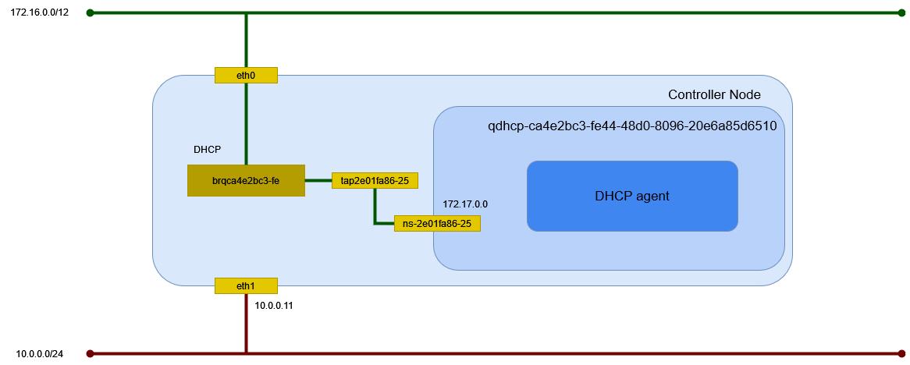

# flat ネットワーク (Linux Bridge)

Linux Bridge を利用した flat ネットワークを作成する。

## 外部ネットワークの作成

eth2 に繋がる外部ネットワークに flat ネットワークを作成する。

| オプション                  | 説明                                                                  |
| --------------------------- | --------------------------------------------------------------------- |
| --share                     | プロジェクトで共有                                                    |
| -external                   | OpenStack 外部のネットワーク                                          |
| --provider-physical-network | */etc/neutron/plugins/ml2/ml2_conf.ini* の flat_networks に指定した値 |
| --provider-physical-network | flat                                                                  |

```sh
openstack network create \
    --share \
    --external \
    --provider-physical-network provider \
    --provider-network-type flat \
    provider
```

```text
+---------------------------+--------------------------------------+
| Field                     | Value                                |
+---------------------------+--------------------------------------+
| admin_state_up            | UP                                   |
| availability_zone_hints   |                                      |
| availability_zones        |                                      |
| created_at                | 2024-05-10T11:28:35Z                 |
| description               |                                      |
| dns_domain                | None                                 |
| id                        | 83a19a08-f066-465f-a5e1-23b4fc66e5ac |
| ipv4_address_scope        | None                                 |
| ipv6_address_scope        | None                                 |
| is_default                | None                                 |
| is_vlan_transparent       | None                                 |
| mtu                       | 1500                                 |
| name                      | provider                             |
| port_security_enabled     | True                                 |
| project_id                | be94f4411bd74f249f5e25f642209b82     |
| provider:network_type     | flat                                 |
| provider:physical_network | provider                             |
| provider:segmentation_id  | None                                 |
| qos_policy_id             | None                                 |
| revision_number           | 1                                    |
| router:external           | External                             |
| segments                  | None                                 |
| shared                    | True                                 |
| status                    | ACTIVE                               |
| subnets                   |                                      |
| tags                      |                                      |
| tenant_id                 | be94f4411bd74f249f5e25f642209b82     |
| updated_at                | 2024-05-10T11:28:35Z                 |
+---------------------------+--------------------------------------+
```

## サブネットの作成

サブネットを作成する。

| オプション        | 説明                     |
| ----------------- | ------------------------ |
| --network         | ネットワーク             |
| --allocation-pool | IP アドレス範囲          |
| --gateway         | ゲートウェイ IP アドレス |
| -subnet-range     | サブネットの CIDR        |

```sh
openstack subnet create \
    --network provider \
    --allocation-pool start=172.16.0.100,end=172.16.0.199 \
    --gateway 172.16.0.254 \
    --subnet-range 172.16.0.0/24 \
    provider
```

```text
+----------------------+--------------------------------------+
| Field                | Value                                |
+----------------------+--------------------------------------+
| allocation_pools     | 172.16.0.100-172.16.0.199            |
| cidr                 | 172.16.0.0/24                        |
| created_at           | 2024-05-10T11:31:04Z                 |
| description          |                                      |
| dns_nameservers      |                                      |
| dns_publish_fixed_ip | None                                 |
| enable_dhcp          | True                                 |
| gateway_ip           | 172.16.0.254                         |
| host_routes          |                                      |
| id                   | 7555697f-f6f4-4b00-af7b-e06bd9997226 |
| ip_version           | 4                                    |
| ipv6_address_mode    | None                                 |
| ipv6_ra_mode         | None                                 |
| name                 | provider                             |
| network_id           | 83a19a08-f066-465f-a5e1-23b4fc66e5ac |
| project_id           | be94f4411bd74f249f5e25f642209b82     |
| revision_number      | 0                                    |
| segment_id           | None                                 |
| service_types        |                                      |
| subnetpool_id        | None                                 |
| tags                 |                                      |
| updated_at           | 2024-05-10T11:31:04Z                 |
+----------------------+--------------------------------------+
```

DHCP サーバのポートの作成を確認する。

```sh
openstack port list
```

```text
+--------------------------------------+------+-------------------+-----------------------------------------------------------------------------+--------+
| ID                                   | Name | MAC Address       | Fixed IP Addresses                                                          | Status |
+--------------------------------------+------+-------------------+-----------------------------------------------------------------------------+--------+
| 61b7b8c3-8fa6-4213-9b86-eaff4e78bf5b |      | fa:16:3e:ee:3e:40 | ip_address='172.16.0.100', subnet_id='7555697f-f6f4-4b00-af7b-e06bd9997226' | ACTIVE |
+--------------------------------------+------+-------------------+-----------------------------------------------------------------------------+--------+
```

```sh
openstack port show 61b7b8c3-8fa6-4213-9b86-eaff4e78bf5b
```

```text
+-------------------------+-------------------------------------------------------------------------------+
| Field                   | Value                                                                         |
+-------------------------+-------------------------------------------------------------------------------+
| admin_state_up          | UP                                                                            |
| allowed_address_pairs   |                                                                               |
| binding_host_id         | controller.home.local                                                         |
| binding_profile         |                                                                               |
| binding_vif_details     | bound_drivers.0='linuxbridge', connectivity='l2', port_filter='True'          |
| binding_vif_type        | bridge                                                                        |
| binding_vnic_type       | normal                                                                        |
| created_at              | 2024-05-10T11:44:35Z                                                          |
| data_plane_status       | None                                                                          |
| description             |                                                                               |
| device_id               | dhcpd3377d3c-a0d1-5d71-9947-f17125c357bb-83a19a08-f066-465f-a5e1-23b4fc66e5ac |
| device_owner            | network:dhcp                                                                  |
| device_profile          | None                                                                          |
| dns_assignment          | None                                                                          |
| dns_domain              | None                                                                          |
| dns_name                | None                                                                          |
| extra_dhcp_opts         |                                                                               |
| fixed_ips               | ip_address='172.16.0.100', subnet_id='7555697f-f6f4-4b00-af7b-e06bd9997226'   |
| hardware_offload_type   | None                                                                          |
| hints                   |                                                                               |
| id                      | 61b7b8c3-8fa6-4213-9b86-eaff4e78bf5b                                          |
| ip_allocation           | None                                                                          |
| mac_address             | fa:16:3e:ee:3e:40                                                             |
| name                    |                                                                               |
| network_id              | 83a19a08-f066-465f-a5e1-23b4fc66e5ac                                          |
| numa_affinity_policy    | None                                                                          |
| port_security_enabled   | False                                                                         |
| project_id              | be94f4411bd74f249f5e25f642209b82                                              |
| propagate_uplink_status | None                                                                          |
| resource_request        | None                                                                          |
| revision_number         | 5                                                                             |
| qos_network_policy_id   | None                                                                          |
| qos_policy_id           | None                                                                          |
| security_group_ids      |                                                                               |
| status                  | ACTIVE                                                                        |
| tags                    |                                                                               |
| trunk_details           | None                                                                          |
| updated_at              | 2024-05-10T11:44:43Z                                                          |
+-------------------------+-------------------------------------------------------------------------------+
```

## 環境の確認

Controller Node でネットワーク構成を確認する。



### ネットワーク名前空間

サブネットを作成するとネットワーク名前空間が作成される。

```sh
ip netns
```

```text
qdhcp-83a19a08-f066-465f-a5e1-23b4fc66e5ac (id: 0)
```

### デバイス

ブリッジと veth peer が作成される。

```sh
ip -d link show
```

```text
1: lo: <LOOPBACK,UP,LOWER_UP> mtu 65536 qdisc noqueue state UNKNOWN mode DEFAULT group default qlen 1000
    link/loopback 00:00:00:00:00:00 brd 00:00:00:00:00:00 promiscuity 0  allmulti 0 minmtu 0 maxmtu 0 addrgenmode eui64 numtxqueues 1 numrxqueues 1 gso_max_size 65536 gso_max_segs 65535 tso_max_size 524280 tso_max_segs 65535 gro_max_size 65536
2: eth0: <BROADCAST,MULTICAST,UP,LOWER_UP> mtu 1500 qdisc mq state UP mode DEFAULT group default qlen 1000
    link/ether 00:15:5d:bf:ba:4f brd ff:ff:ff:ff:ff:ff promiscuity 0  allmulti 0 minmtu 68 maxmtu 65521 addrgenmode none numtxqueues 64 numrxqueues 64 gso_max_size 62780 gso_max_segs 65535 tso_max_size 62780 tso_max_segs 65535 gro_max_size 65536 parentbus vmbus parentdev b7c073a0-7837-4a9f-94e7-eba43ef222ef
3: eth1: <BROADCAST,MULTICAST,UP,LOWER_UP> mtu 1500 qdisc mq state UP mode DEFAULT group default qlen 1000
    link/ether 00:15:5d:bf:ba:54 brd ff:ff:ff:ff:ff:ff promiscuity 0  allmulti 0 minmtu 68 maxmtu 65521 addrgenmode none numtxqueues 64 numrxqueues 64 gso_max_size 62780 gso_max_segs 65535 tso_max_size 62780 tso_max_segs 65535 gro_max_size 65536 parentbus vmbus parentdev 0f15ccb6-3ab3-45ce-b737-a73ecf5a6339
4: eth2: <BROADCAST,MULTICAST,UP,LOWER_UP> mtu 1500 qdisc mq master brq83a19a08-f0 state UP mode DEFAULT group default qlen 1000
    link/ether 00:15:5d:bf:ba:55 brd ff:ff:ff:ff:ff:ff promiscuity 1  allmulti 1 minmtu 68 maxmtu 65521
    bridge_slave state forwarding priority 32 cost 2 hairpin off guard off root_block off fastleave off learning on flood on port_id 0x8001 port_no 0x1 designated_port 32769 designated_cost 0 designated_bridge 8000.0:15:5d:bf:ba:55 designated_root 8000.0:15:5d:bf:ba:55 hold_timer    0.00 message_age_timer    0.00 forward_delay_timer    0.00 topology_change_ack 0 config_pending 0 proxy_arp off proxy_arp_wifi off mcast_router 1 mcast_fast_leave off mcast_flood on bcast_flood on mcast_to_unicast off neigh_suppress off group_fwd_mask 0 group_fwd_mask_str 0x0 vlan_tunnel off isolated off locked off mab off addrgenmode none numtxqueues 64 numrxqueues 64 gso_max_size 62780 gso_max_segs 65535 tso_max_size 62780 tso_max_segs 65535 gro_max_size 65536 parentbus vmbus parentdev dffbd9a0-19dd-44c1-9b46-6dfba9829d73
5: eth3: <BROADCAST,MULTICAST,UP,LOWER_UP> mtu 1500 qdisc mq state UP mode DEFAULT group default qlen 1000
    link/ether 00:15:5d:bf:ba:56 brd ff:ff:ff:ff:ff:ff promiscuity 0  allmulti 0 minmtu 68 maxmtu 65521 addrgenmode none numtxqueues 64 numrxqueues 64 gso_max_size 62780 gso_max_segs 65535 tso_max_size 62780 tso_max_segs 65535 gro_max_size 65536 parentbus vmbus parentdev 31e9f926-7af1-481e-bf58-cbca38bc3cba
6: tap61b7b8c3-8f@if2: <BROADCAST,MULTICAST,UP,LOWER_UP> mtu 1500 qdisc noqueue master brq83a19a08-f0 state UP mode DEFAULT group default qlen 1000
    link/ether 9a:5d:0d:70:96:53 brd ff:ff:ff:ff:ff:ff link-netns qdhcp-83a19a08-f066-465f-a5e1-23b4fc66e5ac promiscuity 1  allmulti 1 minmtu 68 maxmtu 65535
    veth
    bridge_slave state forwarding priority 32 cost 2 hairpin off guard off root_block off fastleave off learning on flood on port_id 0x8002 port_no 0x2 designated_port 32770 designated_cost 0 designated_bridge 8000.0:15:5d:bf:ba:55 designated_root 8000.0:15:5d:bf:ba:55 hold_timer    0.00 message_age_timer    0.00 forward_delay_timer    0.00 topology_change_ack 0 config_pending 0 proxy_arp off proxy_arp_wifi off mcast_router 1 mcast_fast_leave off mcast_flood on bcast_flood on mcast_to_unicast off neigh_suppress off group_fwd_mask 0 group_fwd_mask_str 0x0 vlan_tunnel off isolated off locked off mab off addrgenmode eui64 numtxqueues 2 numrxqueues 2 gso_max_size 65536 gso_max_segs 65535 tso_max_size 524280 tso_max_segs 65535 gro_max_size 65536
7: brq83a19a08-f0: <BROADCAST,MULTICAST,UP,LOWER_UP> mtu 1500 qdisc noqueue state UP mode DEFAULT group default qlen 1000
    link/ether 00:15:5d:bf:ba:55 brd ff:ff:ff:ff:ff:ff promiscuity 0  allmulti 0 minmtu 68 maxmtu 65535
    bridge forward_delay 0 hello_time 200 max_age 2000 ageing_time 30000 stp_state 0 priority 32768 vlan_filtering 0 vlan_protocol 802.1Q bridge_id 8000.0:15:5d:bf:ba:55 designated_root 8000.0:15:5d:bf:ba:55 root_port 0 root_path_cost 0 topology_change 0 topology_change_detected 0 hello_timer    0.00 tcn_timer    0.00 topology_change_timer    0.00 gc_timer  179.65 vlan_default_pvid 1 vlan_stats_enabled 0 vlan_stats_per_port 0 group_fwd_mask 0 group_address 01:80:c2:00:00:00 mcast_snooping 1 no_linklocal_learn 0 mcast_vlan_snooping 0 mcast_router 1 mcast_query_use_ifaddr 0 mcast_querier 0 mcast_hash_elasticity 16 mcast_hash_max 4096 mcast_last_member_count 2 mcast_startup_query_count 2 mcast_last_member_interval 100 mcast_membership_interval 26000 mcast_querier_interval 25500 mcast_query_interval 12500 mcast_query_response_interval 1000 mcast_startup_query_interval 3125 mcast_stats_enabled 0 mcast_igmp_version 2 mcast_mld_version 1 nf_call_iptables 0 nf_call_ip6tables 0 nf_call_arptables 0 addrgenmode eui64 numtxqueues 1 numrxqueues 1 gso_max_size 62780 gso_max_segs 65535 tso_max_size 62780 tso_max_segs 65535 gro_max_size 65536
```

ネットワーク名前空間内のデバイスを確認する。

```sh
ip netns exec qdhcp-83a19a08-f066-465f-a5e1-23b4fc66e5ac ip -d link show
```

```text
1: lo: <LOOPBACK,UP,LOWER_UP> mtu 65536 qdisc noqueue state UNKNOWN mode DEFAULT group default qlen 1000
    link/loopback 00:00:00:00:00:00 brd 00:00:00:00:00:00 promiscuity 0  allmulti 0 minmtu 0 maxmtu 0 addrgenmode eui64 numtxqueues 1 numrxqueues 1 gso_max_size 65536 gso_max_segs 65535 tso_max_size 524280 tso_max_segs 65535 gro_max_size 65536
2: ns-61b7b8c3-8f@if6: <BROADCAST,MULTICAST,UP,LOWER_UP> mtu 1500 qdisc noqueue state UP mode DEFAULT group default qlen 1000
    link/ether fa:16:3e:ee:3e:40 brd ff:ff:ff:ff:ff:ff link-netnsid 0 promiscuity 0  allmulti 0 minmtu 68 maxmtu 65535
    veth addrgenmode eui64 numtxqueues 2 numrxqueues 2 gso_max_size 65536 gso_max_segs 65535 tso_max_size 524280 tso_max_segs 65535 gro_max_size 65536
```

tap61b7b8c3-8f@**if2** と ns-61b7b8c3-8f@**if6** が接続している。

veth peer の接続先は sysfs でも確認できる。接続先の Index が取得できる。

```sh
cat /sys/class/net/tap61b7b8c3-8f/iflink
```

```text
2
```

### イーサネット

イーサネットの情報を確認する。

```sh
ip addr show
```

```text
1: lo: <LOOPBACK,UP,LOWER_UP> mtu 65536 qdisc noqueue state UNKNOWN group default qlen 1000
    link/loopback 00:00:00:00:00:00 brd 00:00:00:00:00:00
    inet 127.0.0.1/8 scope host lo
       valid_lft forever preferred_lft forever
2: eth0: <BROADCAST,MULTICAST,UP,LOWER_UP> mtu 1500 qdisc mq state UP group default qlen 1000
    link/ether 00:15:5d:bf:ba:4f brd ff:ff:ff:ff:ff:ff
    inet 172.16.0.11/24 brd 172.16.0.255 scope global noprefixroute eth0
       valid_lft forever preferred_lft forever
3: eth1: <BROADCAST,MULTICAST,UP,LOWER_UP> mtu 1500 qdisc mq state UP group default qlen 1000
    link/ether 00:15:5d:bf:ba:54 brd ff:ff:ff:ff:ff:ff
    inet 10.0.0.11/24 brd 10.0.0.255 scope global noprefixroute eth1
       valid_lft forever preferred_lft forever
4: eth2: <BROADCAST,MULTICAST,UP,LOWER_UP> mtu 1500 qdisc mq master brq83a19a08-f0 state UP group default qlen 1000
    link/ether 00:15:5d:bf:ba:55 brd ff:ff:ff:ff:ff:ff
5: eth3: <BROADCAST,MULTICAST,UP,LOWER_UP> mtu 1500 qdisc mq state UP group default qlen 1000
    link/ether 00:15:5d:bf:ba:56 brd ff:ff:ff:ff:ff:ff
6: tap61b7b8c3-8f@if2: <BROADCAST,MULTICAST,UP,LOWER_UP> mtu 1500 qdisc noqueue master brq83a19a08-f0 state UP group default qlen 1000
    link/ether 9a:5d:0d:70:96:53 brd ff:ff:ff:ff:ff:ff link-netns qdhcp-83a19a08-f066-465f-a5e1-23b4fc66e5ac
7: brq83a19a08-f0: <BROADCAST,MULTICAST,UP,LOWER_UP> mtu 1500 qdisc noqueue state UP group default qlen 1000
    link/ether 00:15:5d:bf:ba:55 brd ff:ff:ff:ff:ff:ff
```

ネットワーク名前空間内のイーサネットの情報を確認する。
169.254.169.254 は Metadata agent が使用する。

```sh
ip netns exec qdhcp-83a19a08-f066-465f-a5e1-23b4fc66e5ac ip addr show
```

```text
1: lo: <LOOPBACK,UP,LOWER_UP> mtu 65536 qdisc noqueue state UNKNOWN group default qlen 1000
    link/loopback 00:00:00:00:00:00 brd 00:00:00:00:00:00
    inet 127.0.0.1/8 scope host lo
       valid_lft forever preferred_lft forever
    inet6 ::1/128 scope host
       valid_lft forever preferred_lft forever
2: ns-61b7b8c3-8f@if6: <BROADCAST,MULTICAST,UP,LOWER_UP> mtu 1500 qdisc noqueue state UP group default qlen 1000
    link/ether fa:16:3e:ee:3e:40 brd ff:ff:ff:ff:ff:ff link-netnsid 0
    inet 172.16.0.100/24 brd 172.16.0.255 scope global ns-61b7b8c3-8f
       valid_lft forever preferred_lft forever
    inet6 fe80::f816:3eff:feee:3e40/64 scope link
       valid_lft forever preferred_lft forever
```

ルーティングを確認する。

```sh
ip netns exec qdhcp-83a19a08-f066-465f-a5e1-23b4fc66e5ac ip route show
```

```text
default via 172.16.0.254 dev ns-61b7b8c3-8f proto static
172.16.0.0/24 dev ns-61b7b8c3-8f proto kernel scope link src 172.16.0.100
```

待ち受けているポートを確認する。

```sh
ip netns exec qdhcp-83a19a08-f066-465f-a5e1-23b4fc66e5ac ss -ano -4
```

`enable_isolated_metadata` が `true` なのでメタデータサービス(169.254.169.254)が起動する。

```text
Netid               State                Recv-Q               Send-Q                               Local Address:Port                             Peer Address:Port              Process
udp                 UNCONN               0                    0                                        127.0.0.1:53                                    0.0.0.0:*
udp                 UNCONN               0                    0                                     172.16.0.100:53                                    0.0.0.0:*
udp                 UNCONN               0                    0                                  169.254.169.254:53                                    0.0.0.0:*
udp                 UNCONN               0                    0                                          0.0.0.0:67                                    0.0.0.0:*
tcp                 LISTEN               0                    32                                       127.0.0.1:53                                    0.0.0.0:*
tcp                 LISTEN               0                    1024                               169.254.169.254:80                                    0.0.0.0:*
tcp                 LISTEN               0                    32                                 169.254.169.254:53                                    0.0.0.0:*
tcp                 LISTEN               0                    32                                    172.16.0.100:53                                    0.0.0.0:*
```

### DHCP agent

dnsmasq のプロセスを確認する。

```sh
ps ax | grep dnsmasq
```

以下が動作していることが確認できる。

```sh
dnsmasq \
    --no-hosts \
    --no-resolv \
    --pid-file=/var/lib/neutron/dhcp/83a19a08-f066-465f-a5e1-23b4fc66e5ac/pid \
    --dhcp-hostsfile=/var/lib/neutron/dhcp/83a19a08-f066-465f-a5e1-23b4fc66e5ac/host \
    --addn-hosts=/var/lib/neutron/dhcp/83a19a08-f066-465f-a5e1-23b4fc66e5ac/addn_hosts \
    --dhcp-optsfile=/var/lib/neutron/dhcp/83a19a08-f066-465f-a5e1-23b4fc66e5ac/opts \
    --dhcp-leasefile=/var/lib/neutron/dhcp/83a19a08-f066-465f-a5e1-23b4fc66e5ac/leases \
    --dhcp-match=set:ipxe,175 \
    --dhcp-userclass=set:ipxe6,iPXE \
    --local-service \
    --bind-dynamic \
    --dhcp-range=set:subnet-7555697f-f6f4-4b00-af7b-e06bd9997226,172.16.0.0,static,255.255.255.0,86400s \
    --dhcp-option-force=option:mtu,1500 \
    --dhcp-lease-max=256 \
    --conf-file=/dev/null \
    --domain=openstacklocal
```

使用しているインターフェイスを確認する。

```sh
cat /var/lib/neutron/dhcp/83a19a08-f066-465f-a5e1-23b4fc66e5ac/interface
```

```text
ns-61b7b8c3-8f
```
