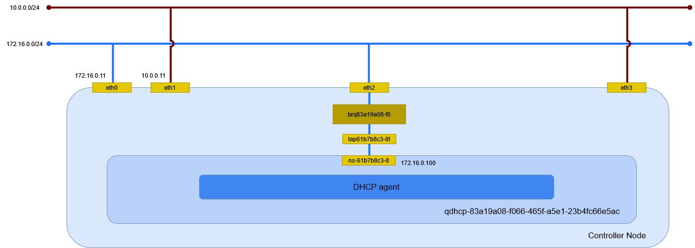

# flat ネットワーク (Linux Bridge)

Linux Bridge を利用した flat ネットワークを作成する。

## 外部ネットワークの作成

eth0 に繋がる外部ネットワークに flat ネットワークを作成する。

| オプション                  | 説明                         |
| --------------------------- | ---------------------------- |
| --share                     | プロジェクトで共有           |
| -external                   | OpenStack 外部のネットワーク |
| --provider-physical-network | */etc/neutron/plugins/ml2/ml2_conf.ini* の flat_networks に指定した値 |
| --provider-physical-network | flat                         |

```sh
openstack network create \
    --share \
    --external \
    --provider-physical-network provider \
    --provider-network-type flat \
    provider
```

```
+---------------------------+--------------------------------------+
| Field                     | Value                                |
+---------------------------+--------------------------------------+
| admin_state_up            | UP                                   |
| availability_zone_hints   |                                      |
| availability_zones        |                                      |
| created_at                | 2024-04-13T15:04:02Z                 |
| description               |                                      |
| dns_domain                | None                                 |
| id                        | ca4e2bc3-fe44-48d0-8096-20e6a85d6510 |
| ipv4_address_scope        | None                                 |
| ipv6_address_scope        | None                                 |
| is_default                | None                                 |
| is_vlan_transparent       | None                                 |
| mtu                       | 1500                                 |
| name                      | provider                             |
| port_security_enabled     | True                                 |
| project_id                | 1e3ac7ae10e24515a0956beaa1d8073c     |
| provider:network_type     | flat                                 |
| provider:physical_network | provider                             |
| provider:segmentation_id  | None                                 |
| qos_policy_id             | None                                 |
| revision_number           | 1                                    |
| router:external           | External                             |
| segments                  | None                                 |
| shared                    | True                                 |
| status                    | ACTIVE                               |
| subnets                   |                                      |
| tags                      |                                      |
| updated_at                | 2024-04-13T15:04:03Z                 |
+---------------------------+--------------------------------------+
```

## サブネットの作成

サブネットを作成する。


| オプション                  | 説明                         |
| --------------------------- | ---------------------------- |
| --network                   | ネットワーク                 |
| --allocation-pool           | IP アドレス範囲              |
| --gateway                   | ゲートウェイ IP アドレス     |
| -subnet-range               | サブネットの CIDR            |

```sh
openstack subnet create \
    --network provider \
    --allocation-pool start=172.17.0.0,end=172.17.0.255 \
    --gateway 172.16.0.1 \
    --subnet-range 172.16.0.0/12 \
    provider
```

```
+----------------------+--------------------------------------+
| Field                | Value                                |
+----------------------+--------------------------------------+
| allocation_pools     | 172.17.0.0-172.17.0.255              |
| cidr                 | 172.16.0.0/12                        |
| created_at           | 2024-04-13T15:05:23Z                 |
| description          |                                      |
| dns_nameservers      |                                      |
| dns_publish_fixed_ip | None                                 |
| enable_dhcp          | True                                 |
| gateway_ip           | 172.16.0.1                           |
| host_routes          |                                      |
| id                   | e6c2f88d-900a-4646-b395-eb1ead8d2227 |
| ip_version           | 4                                    |
| ipv6_address_mode    | None                                 |
| ipv6_ra_mode         | None                                 |
| name                 | provider                             |
| network_id           | ca4e2bc3-fe44-48d0-8096-20e6a85d6510 |
| project_id           | 1e3ac7ae10e24515a0956beaa1d8073c     |
| revision_number      | 0                                    |
| segment_id           | None                                 |
| service_types        |                                      |
| subnetpool_id        | None                                 |
| tags                 |                                      |
| updated_at           | 2024-04-13T15:05:23Z                 |
+----------------------+--------------------------------------+
```

DHCP サーバのポートの作成を確認する。

```sh
openstack port list
```

```
+--------------------------------------+------+-------------------+---------------------------------------------------------------------------+--------+
| ID                                   | Name | MAC Address       | Fixed IP Addresses                                                        | Status |
+--------------------------------------+------+-------------------+---------------------------------------------------------------------------+--------+
| 2e01fa86-2531-4855-92e8-498cf618043a |      | fa:16:3e:40:f8:7c | ip_address='172.17.0.0', subnet_id='e6c2f88d-900a-4646-b395-eb1ead8d2227' | ACTIVE |
+--------------------------------------+------+-------------------+---------------------------------------------------------------------------+--------+
```

```sh
openstack port show 2e01fa86-2531-4855-92e8-498cf618043a
```

```
+-------------------------+-------------------------------------------------------------------------------+
| Field                   | Value                                                                         |
+-------------------------+-------------------------------------------------------------------------------+
| admin_state_up          | UP                                                                            |
| allowed_address_pairs   |                                                                               |
| binding_host_id         | controller.home.local                                                         |
| binding_profile         |                                                                               |
| binding_vif_details     | bound_drivers.0='linuxbridge', connectivity='l2', port_filter='True'          |
| binding_vif_type        | bridge                                                                        |
| binding_vnic_type       | normal                                                                        |
| created_at              | 2024-04-13T15:05:25Z                                                          |
| data_plane_status       | None                                                                          |
| description             |                                                                               |
| device_id               | dhcpd3377d3c-a0d1-5d71-9947-f17125c357bb-ca4e2bc3-fe44-48d0-8096-20e6a85d6510 |
| device_owner            | network:dhcp                                                                  |
| device_profile          | None                                                                          |
| dns_assignment          | None                                                                          |
| dns_domain              | None                                                                          |
| dns_name                | None                                                                          |
| extra_dhcp_opts         |                                                                               |
| fixed_ips               | ip_address='172.17.0.0', subnet_id='e6c2f88d-900a-4646-b395-eb1ead8d2227'     |
| id                      | 2e01fa86-2531-4855-92e8-498cf618043a                                          |
| ip_allocation           | None                                                                          |
| mac_address             | fa:16:3e:40:f8:7c                                                             |
| name                    |                                                                               |
| network_id              | ca4e2bc3-fe44-48d0-8096-20e6a85d6510                                          |
| numa_affinity_policy    | None                                                                          |
| port_security_enabled   | False                                                                         |
| project_id              | 1e3ac7ae10e24515a0956beaa1d8073c                                              |
| propagate_uplink_status | None                                                                          |
| qos_network_policy_id   | None                                                                          |
| qos_policy_id           | None                                                                          |
| resource_request        | None                                                                          |
| revision_number         | 4                                                                             |
| security_group_ids      |                                                                               |
| status                  | ACTIVE                                                                        |
| tags                    |                                                                               |
| trunk_details           | None                                                                          |
| updated_at              | 2024-04-13T15:05:26Z                                                          |
+-------------------------+-------------------------------------------------------------------------------+
```

## 環境の確認

Controller Node でネットワーク構成を確認する。



### ネットワーク名前空間

サブネットを作成するとネットワーク名前空間が作成される。

```sh
ip netns
```

```
qdhcp-ca4e2bc3-fe44-48d0-8096-20e6a85d6510 (id: 0)
```

### デバイス

ブリッジと veth peer が作成される。

```sh
ip -d link show
```

```
1: lo: <LOOPBACK,UP,LOWER_UP> mtu 65536 qdisc noqueue state UNKNOWN mode DEFAULT group default qlen 1000
    link/loopback 00:00:00:00:00:00 brd 00:00:00:00:00:00 promiscuity 0 minmtu 0 maxmtu 0 addrgenmode eui64 numtxqueues 1 numrxqueues 1 gso_max_size 65536 gso_max_segs 65535
2: eth0: <BROADCAST,MULTICAST,UP,LOWER_UP> mtu 1500 qdisc mq master brqca4e2bc3-fe state UP mode DEFAULT group default qlen 1000
    link/ether 00:15:5d:bf:ba:43 brd ff:ff:ff:ff:ff:ff promiscuity 1 minmtu 68 maxmtu 65521
    bridge_slave state forwarding priority 32 cost 2 hairpin off guard off root_block off fastleave off learning on flood on port_id 0x8001 port_no 0x1 designated_port 32769 designated_cost 0 designated_bridge 8000.0:15:5d:bf:ba:43 designated_root 8000.0:15:5d:bf:ba:43 hold_timer    0.00 message_age_timer    0.00 forward_delay_timer    0.00 topology_change_ack 0 config_pending 0 proxy_arp off proxy_arp_wifi off mcast_router 1 mcast_fast_leave off mcast_flood on bcast_flood on mcast_to_unicast off neigh_suppress off group_fwd_mask 0 group_fwd_mask_str 0x0 vlan_tunnel off isolated off locked off addrgenmode eui64 numtxqueues 64 numrxqueues 64 gso_max_size 62780 gso_max_segs 65535 parentbus vmbus parentdev 32e6c4c2-ccf5-4432-b0ff-a854fd65c7e7
3: eth1: <BROADCAST,MULTICAST,UP,LOWER_UP> mtu 1500 qdisc mq state UP mode DEFAULT group default qlen 1000
    link/ether 00:15:5d:bf:ba:45 brd ff:ff:ff:ff:ff:ff promiscuity 0 minmtu 68 maxmtu 65521 addrgenmode eui64 numtxqueues 64 numrxqueues 64 gso_max_size 62780 gso_max_segs 65535 parentbus vmbus parentdev d2418736-9a08-43b7-9980-c3f9ebbe063b
4: tap2e01fa86-25@if2: <BROADCAST,MULTICAST,UP,LOWER_UP> mtu 1500 qdisc noqueue master brqca4e2bc3-fe state UP mode DEFAULT group default qlen 1000
    link/ether c6:5d:c5:be:f8:7b brd ff:ff:ff:ff:ff:ff link-netns qdhcp-ca4e2bc3-fe44-48d0-8096-20e6a85d6510 promiscuity 1 minmtu 68 maxmtu 65535
    veth
    bridge_slave state forwarding priority 32 cost 2 hairpin off guard off root_block off fastleave off learning on flood on port_id 0x8002 port_no 0x2 designated_port 32770 designated_cost 0 designated_bridge 8000.0:15:5d:bf:ba:43 designated_root 8000.0:15:5d:bf:ba:43 hold_timer    0.00 message_age_timer    0.00 forward_delay_timer    0.00 topology_change_ack 0 config_pending 0 proxy_arp off proxy_arp_wifi off mcast_router 1 mcast_fast_leave off mcast_flood on bcast_flood on mcast_to_unicast off neigh_suppress off group_fwd_mask 0 group_fwd_mask_str 0x0 vlan_tunnel off isolated off locked off addrgenmode eui64 numtxqueues 2 numrxqueues 2 gso_max_size 65536 gso_max_segs 65535
5: brqca4e2bc3-fe: <BROADCAST,MULTICAST,UP,LOWER_UP> mtu 1500 qdisc noqueue state UP mode DEFAULT group default qlen 1000
    link/ether 00:15:5d:bf:ba:43 brd ff:ff:ff:ff:ff:ff promiscuity 0 minmtu 68 maxmtu 65535
    bridge forward_delay 0 hello_time 200 max_age 2000 ageing_time 30000 stp_state 0 priority 32768 vlan_filtering 0 vlan_protocol 802.1Q bridge_id 8000.0:15:5d:bf:ba:43 designated_root 8000.0:15:5d:bf:ba:43 root_port 0 root_path_cost 0 topology_change 0 topology_change_detected 0 hello_timer    0.00 tcn_timer    0.00 topology_change_timer    0.00 gc_timer   30.94 vlan_default_pvid 1 vlan_stats_enabled 0 vlan_stats_per_port 0 group_fwd_mask 0 group_address 01:80:c2:00:00:00 mcast_snooping 1 no_linklocal_learn 0 mcast_vlan_snooping 0 mcast_router 1 mcast_query_use_ifaddr 0 mcast_querier 0 mcast_hash_elasticity 16 mcast_hash_max 4096 mcast_last_member_count 2 mcast_startup_query_count 2 mcast_last_member_interval 100 mcast_membership_interval 26000 mcast_querier_interval 25500 mcast_query_interval 12500 mcast_query_response_interval 1000 mcast_startup_query_interval 3125 mcast_stats_enabled 0 mcast_igmp_version 2 mcast_mld_version 1 nf_call_iptables 0 nf_call_ip6tables 0 nf_call_arptables 0 addrgenmode eui64 numtxqueues 1 numrxqueues 1 gso_max_size 62780 gso_max_segs 65535
```

ネットワーク名前空間内のデバイスを確認する。

```sh
ip netns exec qdhcp-ca4e2bc3-fe44-48d0-8096-20e6a85d6510 ip -d link show
```

```
1: lo: <LOOPBACK,UP,LOWER_UP> mtu 65536 qdisc noqueue state UNKNOWN mode DEFAULT group default qlen 1000
    link/loopback 00:00:00:00:00:00 brd 00:00:00:00:00:00 promiscuity 0 minmtu 0 maxmtu 0 addrgenmode eui64 numtxqueues 1 numrxqueues 1 gso_max_size 65536 gso_max_segs 65535
2: ns-2e01fa86-25@if4: <BROADCAST,MULTICAST,UP,LOWER_UP> mtu 1500 qdisc noqueue state UP mode DEFAULT group default qlen 1000
    link/ether fa:16:3e:40:f8:7c brd ff:ff:ff:ff:ff:ff link-netnsid 0 promiscuity 0 minmtu 68 maxmtu 65535
    veth addrgenmode eui64 numtxqueues 2 numrxqueues 2 gso_max_size 65536 gso_max_segs 65535
```

tap2e01fa86-25@**if2** と ns-2e01fa86-25@**if4** が接続している。

veth peer の接続先は sysfs でも確認できる。接続先の Index が取得できる。

```sh
cat /sys/class/net/tap2e01fa86-25/iflink
```

```
2
```

ブリッジを確認する。

```sh
bridge -d link show
```

```{note}
veth peer の先が異なる。ネットワーク名前空間を認識しないのか？
```

```
2: eth0: <BROADCAST,MULTICAST,UP,LOWER_UP> mtu 1500 master brqca4e2bc3-fe state forwarding priority 32 cost 2
    hairpin off guard off root_block off fastleave off learning on flood on mcast_flood on bcast_flood on mcast_router 1 mcast_to_unicast off neigh_suppress off vlan_tunnel off isolated off locked off
4: tap2e01fa86-25@eth0: <BROADCAST,MULTICAST,UP,LOWER_UP> mtu 1500 master brqca4e2bc3-fe state forwarding priority 32 cost 2
    hairpin off guard off root_block off fastleave off learning on flood on mcast_flood on bcast_flood on mcast_router 1 mcast_to_unicast off neigh_suppress off vlan_tunnel off isolated off locked off
```

### イーサネット

イーサネットの情報を確認する。

```sh
ip addr show
```

```
1: lo: <LOOPBACK,UP,LOWER_UP> mtu 65536 qdisc noqueue state UNKNOWN group default qlen 1000
    link/loopback 00:00:00:00:00:00 brd 00:00:00:00:00:00
    inet 127.0.0.1/8 scope host lo
       valid_lft forever preferred_lft forever
2: eth0: <BROADCAST,MULTICAST,UP,LOWER_UP> mtu 1500 qdisc mq master brqca4e2bc3-fe state UP group default qlen 1000
    link/ether 00:15:5d:bf:ba:43 brd ff:ff:ff:ff:ff:ff
3: eth1: <BROADCAST,MULTICAST,UP,LOWER_UP> mtu 1500 qdisc mq state UP group default qlen 1000
    link/ether 00:15:5d:bf:ba:45 brd ff:ff:ff:ff:ff:ff
    inet 10.0.0.11/24 brd 10.0.0.255 scope global noprefixroute eth1
       valid_lft forever preferred_lft forever
4: tap2e01fa86-25@if2: <BROADCAST,MULTICAST,UP,LOWER_UP> mtu 1500 qdisc noqueue master brqca4e2bc3-fe state UP group default qlen 1000
    link/ether c6:5d:c5:be:f8:7b brd ff:ff:ff:ff:ff:ff link-netns qdhcp-ca4e2bc3-fe44-48d0-8096-20e6a85d6510
5: brqca4e2bc3-fe: <BROADCAST,MULTICAST,UP,LOWER_UP> mtu 1500 qdisc noqueue state UP group default qlen 1000
    link/ether 00:15:5d:bf:ba:43 brd ff:ff:ff:ff:ff:ff
    inet 172.16.0.11/12 brd 172.31.255.255 scope global brqca4e2bc3-fe
       valid_lft forever preferred_lft forever
```

ネットワーク名前空間内のイーサネットの情報を確認する。
169.254.169.254 は Metadata agent が使用する。

```sh
ip netns exec qdhcp-ca4e2bc3-fe44-48d0-8096-20e6a85d6510 ip addr
```

```
1: lo: <LOOPBACK,UP,LOWER_UP> mtu 65536 qdisc noqueue state UNKNOWN group default qlen 1000
    link/loopback 00:00:00:00:00:00 brd 00:00:00:00:00:00
    inet 127.0.0.1/8 scope host lo
       valid_lft forever preferred_lft forever
    inet6 ::1/128 scope host
       valid_lft forever preferred_lft forever
2: ns-2e01fa86-25@if6: <BROADCAST,MULTICAST,UP,LOWER_UP> mtu 1500 qdisc noqueue state UP group default qlen 1000
    link/ether fa:16:3e:40:f8:7c brd ff:ff:ff:ff:ff:ff link-netnsid 0
    inet 172.17.0.0/12 brd 172.31.255.255 scope global ns-2e01fa86-25
       valid_lft forever preferred_lft forever
    inet 169.254.169.254/32 brd 169.254.169.254 scope global ns-2e01fa86-25
       valid_lft forever preferred_lft forever
    inet6 fe80::f816:3eff:fe40:f87c/64 scope link
       valid_lft forever preferred_lft forever
```

ルーティングを確認する。

```sh
ip netns exec qdhcp-ca4e2bc3-fe44-48d0-8096-20e6a85d6510 ip route
```

```
default via 172.16.0.1 dev ns-2e01fa86-25 proto static
172.16.0.0/12 dev ns-2e01fa86-25 proto kernel scope link src 172.17.0.0
```

待ち受けているポートを確認する。

```sh
ip netns exec qdhcp-ca4e2bc3-fe44-48d0-8096-20e6a85d6510 ss -ano -4
```

```
etid               State                Recv-Q               Send-Q                               Local Address:Port                              Peer Address:Port               Process
udp                 UNCONN               0                    0                                        127.0.0.1:53                                     0.0.0.0:*
udp                 UNCONN               0                    0                                       172.17.0.0:53                                     0.0.0.0:*
udp                 UNCONN               0                    0                                  169.254.169.254:53                                     0.0.0.0:*
udp                 UNCONN               0                    0                                          0.0.0.0:67                                     0.0.0.0:*
tcp                 LISTEN               0                    128                                169.254.169.254:80                                     0.0.0.0:*
tcp                 LISTEN               0                    32                                       127.0.0.1:53                                     0.0.0.0:*
tcp                 LISTEN               0                    32                                      172.17.0.0:53                                     0.0.0.0:*
tcp                 LISTEN               0                    32                                 169.254.169.254:53                                     0.0.0.0:*
```

### DHCP agent

dnsmasq のプロセスを確認する。

```sh
ps ax | grep dnsmasq
```

以下が動作していることが確認できる。

```
dnsmasq \
    --no-hosts \
    --no-resolv \
    --pid-file=/var/lib/neutron/dhcp/ca4e2bc3-fe44-48d0-8096-20e6a85d6510/pid \
    --dhcp-hostsfile=/var/lib/neutron/dhcp/ca4e2bc3-fe44-48d0-8096-20e6a85d6510/host \
    --addn-hosts=/var/lib/neutron/dhcp/ca4e2bc3-fe44-48d0-8096-20e6a85d6510/addn_hosts \
    --dhcp-optsfile=/var/lib/neutron/dhcp/ca4e2bc3-fe44-48d0-8096-20e6a85d6510/opts \
    --dhcp-leasefile=/var/lib/neutron/dhcp/ca4e2bc3-fe44-48d0-8096-20e6a85d6510/leases \
    --dhcp-match=set:ipxe,175 \
    --dhcp-userclass=set:ipxe6,iPXE \
    --local-service \
    --bind-dynamic \
    --dhcp-range=set:subnet-e6c2f88d-900a-4646-b395-eb1ead8d2227,172.16.0.0,static,255.240.0.0,86400s \
    --dhcp-option-force=option:mtu,1500 \
    --dhcp-lease-max=256 \
    --conf-file=/dev/null \
    --domain=openstacklocal
```

使用しているインターフェイスを確認する。

```sh
cat /var/lib/neutron/dhcp/ca4e2bc3-fe44-48d0-8096-20e6a85d6510/interface
```

```
ns-2e01fa86-25
```
