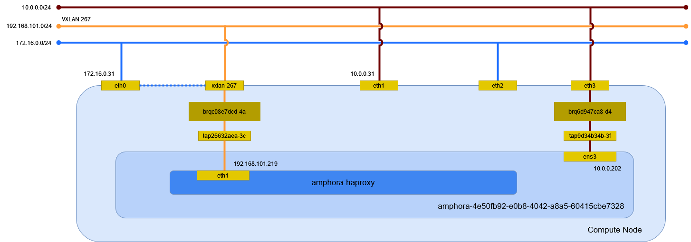

# ロードバランサ (Linux Bridge)

## 前提条件

* [](../network/linuxbridge_router) を作成していること。
* [](../instance/linuxbridge_vxlan.md) を 2 つ作成していること。

## ロードバランサの作成

```{tip}
myuser で実行
```

ロードバランサのサービスを提供するサブネット selfservice を指定してロードバランサを作成する。

```sh
openstack loadbalancer create \
    --name lb \
    --vip-subnet-id selfservice
```

```text
+---------------------+--------------------------------------+
| Field               | Value                                |
+---------------------+--------------------------------------+
| admin_state_up      | True                                 |
| availability_zone   | None                                 |
| created_at          | 2024-05-13T11:39:43                  |
| description         |                                      |
| flavor_id           | None                                 |
| id                  | 05d068a5-17f7-46a8-b2b9-415416782f2c |
| listeners           |                                      |
| name                | lb                                   |
| operating_status    | OFFLINE                              |
| pools               |                                      |
| project_id          | bccf406c045d401b91ba5c7552a124ae     |
| provider            | amphora                              |
| provisioning_status | PENDING_CREATE                       |
| updated_at          | None                                 |
| vip_address         | 192.168.101.219                      |
| vip_network_id      | c08e7dcd-4acb-4cd0-ad08-ebd3b48467ee |
| vip_port_id         | 4a1c0a2f-b8e7-42cf-8b86-99ebf318db2d |
| vip_qos_policy_id   | None                                 |
| vip_subnet_id       | 8abd1d19-1fed-412a-83d0-39e098708648 |
| vip_vnic_type       | normal                               |
| tags                |                                      |
| additional_vips     | []                                   |
+---------------------+--------------------------------------+
```

イメージ amphora からインスタンスが作成される。

```{tip}
octavia で実行
```

```sh
openstack server list
```

```text
+--------------------------------------+----------------------------------------------+--------+-----------------+---------------------+---------+
| ID                                   | Name                                         | Status | Networks        | Image               | Flavor  |
+--------------------------------------+----------------------------------------------+--------+-----------------+---------------------+---------+
| c6a81e18-1a6f-46f6-a8bd-23677e3f0970 | amphora-4e50fb92-e0b8-4042-a8a5-60415cbe7328 | ACTIVE | mgmt=10.0.0.202 | amphora-x64-haproxy | amphora |
+--------------------------------------+----------------------------------------------+--------+-----------------+---------------------+---------+
```

しばらく時間が経過するとロードバランサのサービスが機能する。

```sh
curl -E /etc/octavia/certs/private/client.cert-and-key.pem -ksS https://10.0.0.202:9443
```

```json
{"api_version":"1.0"}
```

*/etc/octavia/octavia.conf* に指定したネットワークと `openstack loadbalancer create` に指定したネットワークに
接続された構成となることを確認する。

```sh
openstack server list
```

```text
+--------------------------------------+----------------------------------------------+--------+---------------------------------------------+---------------------+---------+
| ID                                   | Name                                         | Status | Networks                                    | Image               | Flavor  |
+--------------------------------------+----------------------------------------------+--------+---------------------------------------------+---------------------+---------+
| c6a81e18-1a6f-46f6-a8bd-23677e3f0970 | amphora-4e50fb92-e0b8-4042-a8a5-60415cbe7328 | ACTIVE | mgmt=10.0.0.202; selfservice=192.168.101.69 | amphora-x64-haproxy | amphora |
+--------------------------------------+----------------------------------------------+--------+---------------------------------------------+---------------------+---------+
```

ロードバランサが作成されたことを確認する。

```sh
openstack loadbalancer list
```

```text
+--------------------------------------+------+----------------------------------+-----------------+---------------------+------------------+----------+
| id                                   | name | project_id                       | vip_address     | provisioning_status | operating_status | provider |
+--------------------------------------+------+----------------------------------+-----------------+---------------------+------------------+----------+
| 05d068a5-17f7-46a8-b2b9-415416782f2c | lb   | bccf406c045d401b91ba5c7552a124ae | 192.168.101.219 | ACTIVE              | OFFLINE          | amphora  |
+--------------------------------------+------+----------------------------------+-----------------+---------------------+------------------+----------+
```

## 環境の確認

Compute Node でネットワーク構成を確認する。



### インスタンス

amphora のインスタンスを確認する。

```sh
virsh list
```

```text
 Id   名前                状態
----------------------------------
 1    instance-0000000f   実行中
```

ネットワークインターフェイスの設定を確認する。

```sh
virsh dumpxml 1 | sed -n -e '/<interface/,/<\/interface>/ { p }'
```

```xml
<interface type='bridge'>
  <mac address='fa:16:3e:79:bb:0b'/>
  <source bridge='brq6d947ca8-d4'/>
  <target dev='tap9d34b34b-3f'/>
  <model type='virtio'/>
  <driver name='qemu'/>
  <mtu size='1500'/>
  <alias name='net0'/>
  <address type='pci' domain='0x0000' bus='0x00' slot='0x03' function='0x0'/>
</interface>
<interface type='bridge'>
  <mac address='fa:16:3e:bb:f5:60'/>
  <source bridge='brqc08e7dcd-4a'/>
  <target dev='tap26632aea-3c'/>
  <model type='virtio'/>
  <driver name='qemu'/>
  <mtu size='1450'/>
  <alias name='net1'/>
  <address type='pci' domain='0x0000' bus='0x00' slot='0x07' function='0x0'/>
</interface>
```

### ネットワーク

#### ネットワーク名前空間

amphora インスタンスのネットワーク名前空間を確認する。

```sh
ssh -i ./demo_rsa cloud-user@10.0.0.202 ip netns
```

```text
amphora-haproxy (id: 0)
```

#### デバイス

Compute Node のデバイスを確認する。

```sh
ip -d link show
```

```text
(...)

2: eth0: <BROADCAST,MULTICAST,UP,LOWER_UP> mtu 1500 qdisc mq state UP mode DEFAULT group default qlen 1000
    link/ether 00:15:5d:bf:ba:50 brd ff:ff:ff:ff:ff:ff promiscuity 0  allmulti 0 minmtu 68 maxmtu 65521 addrgenmode none numtxqueues 64 numrxqueues 64 gso_max_size 62780 gso_max_segs 65535 tso_max_size 62780 tso_max_segs 65535 gro_max_size 65536 parentbus vmbus parentdev f4fd36cf-d20d-4c23-83bb-e1b5cc9fbfbc
5: eth3: <BROADCAST,MULTICAST,UP,LOWER_UP> mtu 1500 qdisc mq master brq6d947ca8-d4 state UP mode DEFAULT group default qlen 1000
    link/ether 00:15:5d:bf:ba:59 brd ff:ff:ff:ff:ff:ff promiscuity 1  allmulti 1 minmtu 68 maxmtu 65521
    bridge_slave state forwarding priority 32 cost 2 hairpin off guard off root_block off fastleave off learning on flood on port_id 0x8002 port_no 0x2 designated_port 32770 designated_cost 0 designated_bridge 8000.0:15:5d:bf:ba:59 designated_root 8000.0:15:5d:bf:ba:59 hold_timer    0.00 message_age_timer    0.00 forward_delay_timer    0.00 topology_change_ack 0 config_pending 0 proxy_arp off proxy_arp_wifi off mcast_router 1 mcast_fast_leave off mcast_flood on bcast_flood on mcast_to_unicast off neigh_suppress off group_fwd_mask 0 group_fwd_mask_str 0x0 vlan_tunnel off isolated off locked off mab off addrgenmode none numtxqueues 64 numrxqueues 64 gso_max_size 62780 gso_max_segs 65535 tso_max_size 62780 tso_max_segs 65535 gro_max_size 65536 parentbus vmbus parentdev 6de0f76b-b7bc-45ba-9087-d8bee9131e1c
9: brqc08e7dcd-4a: <BROADCAST,MULTICAST,UP,LOWER_UP> mtu 1450 qdisc noqueue state UP mode DEFAULT group default qlen 1000
    link/ether ca:08:b8:a0:9b:e6 brd ff:ff:ff:ff:ff:ff promiscuity 0  allmulti 0 minmtu 68 maxmtu 65535
    bridge forward_delay 0 hello_time 200 max_age 2000 ageing_time 30000 stp_state 0 priority 32768 vlan_filtering 0 vlan_protocol 802.1Q bridge_id 8000.ca:8:b8:a0:9b:e6 designated_root 8000.ca:8:b8:a0:9b:e6 root_port 0 root_path_cost 0 topology_change 0 topology_change_detected 0 hello_timer    0.00 tcn_timer    0.00 topology_change_timer    0.00 gc_timer  207.77 vlan_default_pvid 1 vlan_stats_enabled 0 vlan_stats_per_port 0 group_fwd_mask 0 group_address 01:80:c2:00:00:00 mcast_snooping 0 no_linklocal_learn 0 mcast_vlan_snooping 0 mcast_router 1 mcast_query_use_ifaddr 0 mcast_querier 0 mcast_hash_elasticity 16 mcast_hash_max 4096 mcast_last_member_count 2 mcast_startup_query_count 2 mcast_last_member_interval 100 mcast_membership_interval 26000 mcast_querier_interval 25500 mcast_query_interval 12500 mcast_query_response_interval 1000 mcast_startup_query_interval 3125 mcast_stats_enabled 0 mcast_igmp_version 2 mcast_mld_version 1 nf_call_iptables 0 nf_call_ip6tables 0 nf_call_arptables 0 addrgenmode eui64 numtxqueues 1 numrxqueues 1 gso_max_size 62780 gso_max_segs 65535 tso_max_size 62780 tso_max_segs 65535 gro_max_size 65536
10: brq6d947ca8-d4: <BROADCAST,MULTICAST,UP,LOWER_UP> mtu 1500 qdisc noqueue state UP mode DEFAULT group default qlen 1000
    link/ether 00:15:5d:bf:ba:59 brd ff:ff:ff:ff:ff:ff promiscuity 0  allmulti 0 minmtu 68 maxmtu 65535
    bridge forward_delay 0 hello_time 200 max_age 2000 ageing_time 30000 stp_state 0 priority 32768 vlan_filtering 0 vlan_protocol 802.1Q bridge_id 8000.0:15:5d:bf:ba:59 designated_root 8000.0:15:5d:bf:ba:59 root_port 0 root_path_cost 0 topology_change 0 topology_change_detected 0 hello_timer    0.00 tcn_timer    0.00 topology_change_timer    0.00 gc_timer   31.12 vlan_default_pvid 1 vlan_stats_enabled 0 vlan_stats_per_port 0 group_fwd_mask 0 group_address 01:80:c2:00:00:00 mcast_snooping 0 no_linklocal_learn 0 mcast_vlan_snooping 0 mcast_router 1 mcast_query_use_ifaddr 0 mcast_querier 0 mcast_hash_elasticity 16 mcast_hash_max 4096 mcast_last_member_count 2 mcast_startup_query_count 2 mcast_last_member_interval 100 mcast_membership_interval 26000 mcast_querier_interval 25500 mcast_query_interval 12500 mcast_query_response_interval 1000 mcast_startup_query_interval 3125 mcast_stats_enabled 0 mcast_igmp_version 2 mcast_mld_version 1 nf_call_iptables 0 nf_call_ip6tables 0 nf_call_arptables 0 addrgenmode eui64 numtxqueues 1 numrxqueues 1 gso_max_size 62780 gso_max_segs 65535 tso_max_size 62780 tso_max_segs 65535 gro_max_size 65536
11: tap9d34b34b-3f: <BROADCAST,MULTICAST,UP,LOWER_UP> mtu 1500 qdisc noqueue master brq6d947ca8-d4 state UNKNOWN mode DEFAULT group default qlen 1000
    link/ether fe:16:3e:79:bb:0b brd ff:ff:ff:ff:ff:ff promiscuity 1  allmulti 1 minmtu 68 maxmtu 65521
    tun type tap pi off vnet_hdr on persist off
    bridge_slave state forwarding priority 32 cost 100 hairpin off guard off root_block off fastleave off learning on flood on port_id 0x8001 port_no 0x1 designated_port 32769 designated_cost 0 designated_bridge 8000.0:15:5d:bf:ba:59 designated_root 8000.0:15:5d:bf:ba:59 hold_timer    0.00 message_age_timer    0.00 forward_delay_timer    0.00 topology_change_ack 0 config_pending 0 proxy_arp off proxy_arp_wifi off mcast_router 1 mcast_fast_leave off mcast_flood on bcast_flood on mcast_to_unicast off neigh_suppress off group_fwd_mask 0 group_fwd_mask_str 0x0 vlan_tunnel off isolated off locked off mab off addrgenmode eui64 numtxqueues 1 numrxqueues 1 gso_max_size 65536 gso_max_segs 65535 tso_max_size 65536 tso_max_segs 65535 gro_max_size 65536
12: tap26632aea-3c: <BROADCAST,MULTICAST,UP,LOWER_UP> mtu 1450 qdisc noqueue master brqc08e7dcd-4a state UNKNOWN mode DEFAULT group default qlen 1000
    link/ether fe:16:3e:bb:f5:60 brd ff:ff:ff:ff:ff:ff promiscuity 1  allmulti 1 minmtu 68 maxmtu 65521
    tun type tap pi off vnet_hdr on persist off
    bridge_slave state forwarding priority 32 cost 100 hairpin off guard off root_block off fastleave off learning on flood on port_id 0x8001 port_no 0x1 designated_port 32769 designated_cost 0 designated_bridge 8000.ca:8:b8:a0:9b:e6 designated_root 8000.ca:8:b8:a0:9b:e6 hold_timer    0.00 message_age_timer    0.00 forward_delay_timer    0.00 topology_change_ack 0 config_pending 0 proxy_arp off proxy_arp_wifi off mcast_router 1 mcast_fast_leave off mcast_flood on bcast_flood on mcast_to_unicast off neigh_suppress off group_fwd_mask 0 group_fwd_mask_str 0x0 vlan_tunnel off isolated off locked off mab off addrgenmode eui64 numtxqueues 1 numrxqueues 1 gso_max_size 65536 gso_max_segs 65535 tso_max_size 65536 tso_max_segs 65535 gro_max_size 65536
13: vxlan-267: <BROADCAST,MULTICAST,UP,LOWER_UP> mtu 1450 qdisc noqueue master brqc08e7dcd-4a state UNKNOWN mode DEFAULT group default qlen 1000
    link/ether ca:08:b8:a0:9b:e6 brd ff:ff:ff:ff:ff:ff promiscuity 1  allmulti 1 minmtu 68 maxmtu 65535
    vxlan id 267 local 172.16.0.31 dev eth0 srcport 0 0 dstport 8472 ttl auto ageing 300 udpcsum noudp6zerocsumtx noudp6zerocsumrx
    bridge_slave state forwarding priority 32 cost 2 hairpin off guard off root_block off fastleave off learning on flood on port_id 0x8002 port_no 0x2 designated_port 32770 designated_cost 0 designated_bridge 8000.ca:8:b8:a0:9b:e6 designated_root 8000.ca:8:b8:a0:9b:e6 hold_timer    0.00 message_age_timer    0.00 forward_delay_timer    0.00 topology_change_ack 0 config_pending 0 proxy_arp off proxy_arp_wifi off mcast_router 1 mcast_fast_leave off mcast_flood on bcast_flood on mcast_to_unicast off neigh_suppress off group_fwd_mask 0 group_fwd_mask_str 0x0 vlan_tunnel off isolated off locked off mab off addrgenmode eui64 numtxqueues 1 numrxqueues 1 gso_max_size 62780 gso_max_segs 65535 tso_max_size 62780 tso_max_segs 65535 gro_max_size 65536
```

amphora インスタンスのデバイスを確認する。

```sh
ssh -i ./demo_rsa cloud-user@10.0.0.202 ip -d link show
```

```text
1: lo: <LOOPBACK,UP,LOWER_UP> mtu 65536 qdisc noqueue state UNKNOWN mode DEFAULT group default qlen 1000
    link/loopback 00:00:00:00:00:00 brd 00:00:00:00:00:00 promiscuity 0  allmulti 0 minmtu 0 maxmtu 0 addrgenmode eui64 numtxqueues 1 numrxqueues 1 gso_max_size 65536 gso_max_segs 65535 tso_max_size 524280 tso_max_segs 65535 gro_max_size 65536
2: ens3: <BROADCAST,MULTICAST,UP,LOWER_UP> mtu 1500 qdisc fq_codel state UP mode DEFAULT group default qlen 1000
    link/ether fa:16:3e:79:bb:0b brd ff:ff:ff:ff:ff:ff promiscuity 0  allmulti 0 minmtu 68 maxmtu 1500 addrgenmode eui64 numtxqueues 1 numrxqueues 1 gso_max_size 65536 gso_max_segs 65535 tso_max_size 65536 tso_max_segs 65535 gro_max_size 65536 parentbus virtio parentdev virtio0
    altname enp0s3
```

ネットワーク名前空間内のデバイスを確認する。

```sh
ssh -i ./demo_rsa cloud-user@10.0.0.202 sudo ip netns exec amphora-haproxy ip -d link show
```

```text
1: lo: <LOOPBACK> mtu 65536 qdisc noop state DOWN mode DEFAULT group default qlen 1000
    link/loopback 00:00:00:00:00:00 brd 00:00:00:00:00:00 promiscuity 0  allmulti 0 minmtu 0 maxmtu 0 addrgenmode eui64 numtxqueues 1 numrxqueues 1 gso_max_size 65536 gso_max_segs 65535 tso_max_size 524280 tso_max_segs 65535 gro_max_size 65536
3: eth1: <BROADCAST,MULTICAST,UP,LOWER_UP> mtu 1450 qdisc fq_codel state UP mode DEFAULT group default qlen 1000
    link/ether fa:16:3e:bb:f5:60 brd ff:ff:ff:ff:ff:ff promiscuity 0  allmulti 0 minmtu 68 maxmtu 1450 addrgenmode eui64 numtxqueues 1 numrxqueues 1 gso_max_size 65536 gso_max_segs 65535 tso_max_size 65536 tso_max_segs 65535 gro_max_size 65536 parentbus virtio parentdev virtio4
    altname enp0s7
```

#### イーサネット

amphora インスタンスのイーサネットの情報を確認する。

```sh
ssh -i ./demo_rsa cloud-user@10.0.0.202 ip addr show
```

```text
1: lo: <LOOPBACK,UP,LOWER_UP> mtu 65536 qdisc noqueue state UNKNOWN group default qlen 1000
    link/loopback 00:00:00:00:00:00 brd 00:00:00:00:00:00
    inet 127.0.0.1/8 scope host lo
       valid_lft forever preferred_lft forever
    inet6 ::1/128 scope host
       valid_lft forever preferred_lft forever
2: ens3: <BROADCAST,MULTICAST,UP,LOWER_UP> mtu 1500 qdisc fq_codel state UP group default qlen 1000
    link/ether fa:16:3e:79:bb:0b brd ff:ff:ff:ff:ff:ff
    altname enp0s3
    inet 10.0.0.202/24 brd 10.0.0.255 scope global dynamic noprefixroute ens3
       valid_lft 85797sec preferred_lft 85797sec
    inet6 fe80::f816:3eff:fe79:bb0b/64 scope link
       valid_lft forever preferred_lft forever
```

ネットワーク名前空間内のイーサネットの情報を確認する。

```sh
ssh -i ./demo_rsa cloud-user@10.0.0.202 sudo ip netns exec amphora-haproxy ip addr show
```

```text
1: lo: <LOOPBACK> mtu 65536 qdisc noop state DOWN group default qlen 1000
    link/loopback 00:00:00:00:00:00 brd 00:00:00:00:00:00
3: eth1: <BROADCAST,MULTICAST,UP,LOWER_UP> mtu 1450 qdisc fq_codel state UP group default qlen 1000
    link/ether fa:16:3e:bb:f5:60 brd ff:ff:ff:ff:ff:ff
    altname enp0s7
    inet 192.168.101.69/24 scope global eth1
       valid_lft forever preferred_lft forever
    inet 192.168.101.219/32 scope global eth1
       valid_lft forever preferred_lft forever
```

## リスナの作成

ロードバランサに SSH で待ち受けるリスナを作成する。

```sh
openstack loadbalancer listener create \
    --name lb-ssh \
    --protocol TCP \
    --protocol-port 22 \
    05d068a5-17f7-46a8-b2b9-415416782f2c
```

```text
+-----------------------------+--------------------------------------+
| Field                       | Value                                |
+-----------------------------+--------------------------------------+
| admin_state_up              | True                                 |
| connection_limit            | -1                                   |
| created_at                  | 2024-05-13T11:57:56                  |
| default_pool_id             | None                                 |
| default_tls_container_ref   | None                                 |
| description                 |                                      |
| id                          | 0f456a63-2634-4721-90d0-090067cf73ac |
| insert_headers              | None                                 |
| l7policies                  |                                      |
| loadbalancers               | 05d068a5-17f7-46a8-b2b9-415416782f2c |
| name                        | lb-ssh                               |
| operating_status            | OFFLINE                              |
| project_id                  | bccf406c045d401b91ba5c7552a124ae     |
| protocol                    | TCP                                  |
| protocol_port               | 22                                   |
| provisioning_status         | PENDING_CREATE                       |
| sni_container_refs          | []                                   |
| timeout_client_data         | 50000                                |
| timeout_member_connect      | 5000                                 |
| timeout_member_data         | 50000                                |
| timeout_tcp_inspect         | 0                                    |
| updated_at                  | None                                 |
| client_ca_tls_container_ref | None                                 |
| client_authentication       | NONE                                 |
| client_crl_container_ref    | None                                 |
| allowed_cidrs               | None                                 |
| tls_ciphers                 | None                                 |
| tls_versions                | None                                 |
| alpn_protocols              | None                                 |
| tags                        |                                      |
| hsts_max_age                | None                                 |
| hsts_include_subdomains     | False                                |
| hsts_preload                | False                                |
+-----------------------------+--------------------------------------+
```

`provisioning_status` が `ACTIVE` になることを確認する。

```sh
openstack loadbalancer listener show 0f456a63-2634-4721-90d0-090067cf73ac
```

```text
+-----------------------------+--------------------------------------+
| Field                       | Value                                |
+-----------------------------+--------------------------------------+
| admin_state_up              | True                                 |
| connection_limit            | -1                                   |
| created_at                  | 2024-05-13T11:57:56                  |
| default_pool_id             | None                                 |
| default_tls_container_ref   | None                                 |
| description                 |                                      |
| id                          | 0f456a63-2634-4721-90d0-090067cf73ac |
| insert_headers              | None                                 |
| l7policies                  |                                      |
| loadbalancers               | 05d068a5-17f7-46a8-b2b9-415416782f2c |
| name                        | lb-ssh                               |
| operating_status            | OFFLINE                              |
| project_id                  | bccf406c045d401b91ba5c7552a124ae     |
| protocol                    | TCP                                  |
| protocol_port               | 22                                   |
| provisioning_status         | ACTIVE                               |
| sni_container_refs          | []                                   |
| timeout_client_data         | 50000                                |
| timeout_member_connect      | 5000                                 |
| timeout_member_data         | 50000                                |
| timeout_tcp_inspect         | 0                                    |
| updated_at                  | 2024-05-13T11:58:34                  |
| client_ca_tls_container_ref | None                                 |
| client_authentication       | NONE                                 |
| client_crl_container_ref    | None                                 |
| allowed_cidrs               | None                                 |
| tls_ciphers                 | None                                 |
| tls_versions                | None                                 |
| alpn_protocols              | None                                 |
| tags                        |                                      |
| hsts_max_age                | None                                 |
| hsts_include_subdomains     | False                                |
| hsts_preload                | False                                |
+-----------------------------+--------------------------------------+
```

## プールの作成

リスナにプールを作成する。

```sh
openstack loadbalancer pool create \
    --name lb-ssh-pool \
    --lb-algorithm ROUND_ROBIN \
    --listener lb-ssh \
    --protocol TCP
```

```text
+----------------------+--------------------------------------+
| Field                | Value                                |
+----------------------+--------------------------------------+
| admin_state_up       | True                                 |
| created_at           | 2024-05-13T12:00:47                  |
| description          |                                      |
| healthmonitor_id     |                                      |
| id                   | 6e971b0d-1290-4b1f-9086-6de666b52755 |
| lb_algorithm         | ROUND_ROBIN                          |
| listeners            | 0f456a63-2634-4721-90d0-090067cf73ac |
| loadbalancers        | 05d068a5-17f7-46a8-b2b9-415416782f2c |
| members              |                                      |
| name                 | lb-ssh-pool                          |
| operating_status     | OFFLINE                              |
| project_id           | bccf406c045d401b91ba5c7552a124ae     |
| protocol             | TCP                                  |
| provisioning_status  | PENDING_CREATE                       |
| session_persistence  | None                                 |
| updated_at           | None                                 |
| tls_container_ref    | None                                 |
| ca_tls_container_ref | None                                 |
| crl_container_ref    | None                                 |
| tls_enabled          | False                                |
| tls_ciphers          | None                                 |
| tls_versions         | None                                 |
| tags                 |                                      |
| alpn_protocols       | None                                 |
+----------------------+--------------------------------------+
```

`provisioning_status` が `ACTIVE` になることを確認する。

```sh
openstack loadbalancer pool show 6e971b0d-1290-4b1f-9086-6de666b52755
```

```text
+----------------------+--------------------------------------+
| Field                | Value                                |
+----------------------+--------------------------------------+
| admin_state_up       | True                                 |
| created_at           | 2024-05-13T12:00:47                  |
| description          |                                      |
| healthmonitor_id     |                                      |
| id                   | 6e971b0d-1290-4b1f-9086-6de666b52755 |
| lb_algorithm         | ROUND_ROBIN                          |
| listeners            | 0f456a63-2634-4721-90d0-090067cf73ac |
| loadbalancers        | 05d068a5-17f7-46a8-b2b9-415416782f2c |
| members              |                                      |
| name                 | lb-ssh-pool                          |
| operating_status     | OFFLINE                              |
| project_id           | bccf406c045d401b91ba5c7552a124ae     |
| protocol             | TCP                                  |
| provisioning_status  | ACTIVE                               |
| session_persistence  | None                                 |
| updated_at           | 2024-05-13T12:01:04                  |
| tls_container_ref    | None                                 |
| ca_tls_container_ref | None                                 |
| crl_container_ref    | None                                 |
| tls_enabled          | False                                |
| tls_ciphers          | None                                 |
| tls_versions         | None                                 |
| tags                 |                                      |
| alpn_protocols       | None                                 |
+----------------------+--------------------------------------+
```

## プールにメンバを追加

プールにインスタンスの IP を登録する。

```sh
openstack server list
```

```text
+--------------------------------------+------------+--------+------------------------------------------+-----------+----------+
| ID                                   | Name       | Status | Networks                                 | Image     | Flavor   |
+--------------------------------------+------------+--------+------------------------------------------+-----------+----------+
| 90895172-b654-417f-989a-5655b4639b4f | instance03 | ACTIVE | selfservice=192.168.101.79               | cirros062 | m1.milli |
| df970ec9-8410-48a6-9f04-d4621c967fce | instance02 | ACTIVE | selfservice=172.16.0.168, 192.168.101.88 | cirros062 | m1.milli |
+--------------------------------------+------------+--------+------------------------------------------+-----------+----------+
```

メンバを追加する。

```sh
openstack loadbalancer member create \
    --subnet-id selfservice \
    --address 192.168.101.79 \
    --protocol-port 22 \
    lb-ssh-pool
```

```text
+---------------------+--------------------------------------+
| Field               | Value                                |
+---------------------+--------------------------------------+
| address             | 192.168.101.79                       |
| admin_state_up      | True                                 |
| created_at          | 2024-05-13T12:17:00                  |
| id                  | e233ccec-db0e-4966-acda-493eb35d77de |
| name                |                                      |
| operating_status    | NO_MONITOR                           |
| project_id          | bccf406c045d401b91ba5c7552a124ae     |
| protocol_port       | 22                                   |
| provisioning_status | PENDING_CREATE                       |
| subnet_id           | 8abd1d19-1fed-412a-83d0-39e098708648 |
| updated_at          | None                                 |
| weight              | 1                                    |
| monitor_port        | None                                 |
| monitor_address     | None                                 |
| backup              | False                                |
| tags                |                                      |
+---------------------+--------------------------------------+
```

```sh
openstack loadbalancer member create \
    --subnet-id selfservice \
    --address 192.168.101.88 \
    --protocol-port 22 \
    lb-ssh-pool
```

```text
+---------------------+--------------------------------------+
| Field               | Value                                |
+---------------------+--------------------------------------+
| address             | 192.168.101.88                       |
| admin_state_up      | True                                 |
| created_at          | 2024-05-13T12:17:35                  |
| id                  | b4cad0a3-64e9-47dd-b19d-8f784e9ea4c1 |
| name                |                                      |
| operating_status    | NO_MONITOR                           |
| project_id          | bccf406c045d401b91ba5c7552a124ae     |
| protocol_port       | 22                                   |
| provisioning_status | PENDING_CREATE                       |
| subnet_id           | 8abd1d19-1fed-412a-83d0-39e098708648 |
| updated_at          | None                                 |
| weight              | 1                                    |
| monitor_port        | None                                 |
| monitor_address     | None                                 |
| backup              | False                                |
| tags                |                                      |
+---------------------+--------------------------------------+
```

メンバの追加を確認する。

```sh
openstack loadbalancer member list lb-ssh-pool
```

```text
+--------------------------------------+------+----------------------------------+---------------------+----------------+---------------+------------------+--------+
| id                                   | name | project_id                       | provisioning_status | address        | protocol_port | operating_status | weight |
+--------------------------------------+------+----------------------------------+---------------------+----------------+---------------+------------------+--------+
| e233ccec-db0e-4966-acda-493eb35d77de |      | bccf406c045d401b91ba5c7552a124ae | ACTIVE              | 192.168.101.79 |            22 | NO_MONITOR       |      1 |
| b4cad0a3-64e9-47dd-b19d-8f784e9ea4c1 |      | bccf406c045d401b91ba5c7552a124ae | ACTIVE              | 192.168.101.88 |            22 | NO_MONITOR       |      1 |
+--------------------------------------+------+----------------------------------+---------------------+----------------+---------------+------------------+--------+
```

## Floating IP の作成

ロードバランサを外部ネットワークから接続するため Floating IP を作成する。

```sh
openstack floating ip create provider
```

```text
+---------------------+--------------------------------------+
| Field               | Value                                |
+---------------------+--------------------------------------+
| created_at          | 2024-05-13T12:18:12Z                 |
| description         |                                      |
| dns_domain          | None                                 |
| dns_name            | None                                 |
| fixed_ip_address    | None                                 |
| floating_ip_address | 172.16.0.177                         |
| floating_network_id | 83a19a08-f066-465f-a5e1-23b4fc66e5ac |
| id                  | 56798100-4081-4f52-91ad-b66511f4e124 |
| name                | 172.16.0.177                         |
| port_details        | None                                 |
| port_id             | None                                 |
| project_id          | bccf406c045d401b91ba5c7552a124ae     |
| qos_policy_id       | None                                 |
| revision_number     | 0                                    |
| router_id           | None                                 |
| status              | DOWN                                 |
| subnet_id           | None                                 |
| tags                | []                                   |
| updated_at          | 2024-05-13T12:18:12Z                 |
+---------------------+--------------------------------------+
```

ロードバランサのポートを確認して Floating IP を割り当てる。

```sh
openstack loadbalancer show 05d068a5-17f7-46a8-b2b9-415416782f2c -c vip_port_id -f value
```

```text
4a1c0a2f-b8e7-42cf-8b86-99ebf318db2d
```

```sh
openstack floating ip set \
    --port 4a1c0a2f-b8e7-42cf-8b86-99ebf318db2d \
    172.16.0.177
```

## 動作確認

ラウンドロビンすることを確認する。

1回目。

```sh
ssh -i demo_rsa cirros@172.16.0.177 ip addr show
```

```text
1: lo: <LOOPBACK,UP,LOWER_UP> mtu 65536 qdisc noqueue qlen 1000
    link/loopback 00:00:00:00:00:00 brd 00:00:00:00:00:00
    inet 127.0.0.1/8 scope host lo
       valid_lft forever preferred_lft forever
    inet6 ::1/128 scope host
       valid_lft forever preferred_lft forever
2: eth0: <BROADCAST,MULTICAST,UP,LOWER_UP> mtu 1450 qdisc pfifo_fast qlen 1000
    link/ether fa:16:3e:81:09:d7 brd ff:ff:ff:ff:ff:ff
    inet 192.168.101.79/24 brd 192.168.101.255 scope global dynamic noprefixroute eth0
       valid_lft 79890sec preferred_lft 69090sec
    inet6 fe80::f816:3eff:fe81:9d7/64 scope link
       valid_lft forever preferred_lft forever
```

2回目。

```sh
ssh -i demo_rsa cirros@172.16.0.177 ip addr show
```

```text
1: lo: <LOOPBACK,UP,LOWER_UP> mtu 65536 qdisc noqueue qlen 1000
    link/loopback 00:00:00:00:00:00 brd 00:00:00:00:00:00
    inet 127.0.0.1/8 scope host lo
       valid_lft forever preferred_lft forever
    inet6 ::1/128 scope host
       valid_lft forever preferred_lft forever
2: eth0: <BROADCAST,MULTICAST,UP,LOWER_UP> mtu 1450 qdisc pfifo_fast qlen 1000
    link/ether fa:16:3e:be:71:21 brd ff:ff:ff:ff:ff:ff
    inet 192.168.101.88/24 brd 192.168.101.255 scope global dynamic noprefixroute eth0
       valid_lft 79578sec preferred_lft 68778sec
    inet6 fe80::f816:3eff:febe:7121/64 scope link
       valid_lft forever preferred_lft forever
```

HAProxy の設定が追加されることを確認する。

```sh
ssh -i ./demo_rsa cloud-user@10.0.0.202 sudo cat /var/lib/octavia/05d068a5-17f7-46a8-b2b9-415416782f2c/haproxy.cfg
```

```text
backend 6e971b0d-1290-4b1f-9086-6de666b52755:0f456a63-2634-4721-90d0-090067cf73ac
    mode tcp
    balance roundrobin
    fullconn 50000
    option allbackups
    timeout connect 5000
    timeout server 50000
    server e233ccec-db0e-4966-acda-493eb35d77de 192.168.101.79:22 weight 1
    server b4cad0a3-64e9-47dd-b19d-8f784e9ea4c1 192.168.101.88:22 weight 1
```
