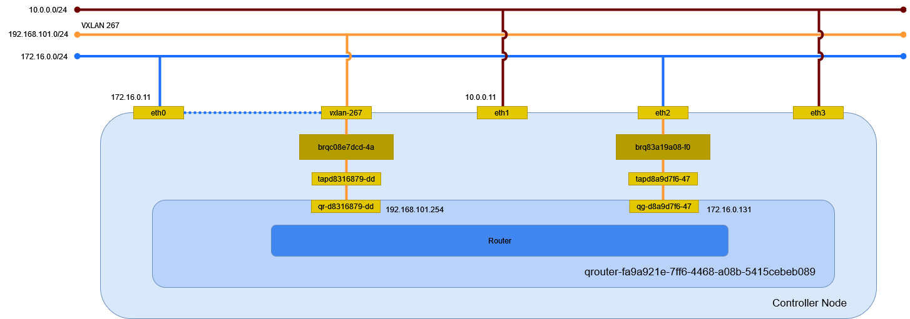

# ルータ (Linux Bridge)

## 前提条件

* [](../network/linuxbridge_flat) を作成していること。
* [](../network/linuxbridge_vxlan) を作成していること。

## ルータの作成

ルータを作成する。

```sh
openstack router create router
```

```
+-------------------------+--------------------------------------+
| Field                   | Value                                |
+-------------------------+--------------------------------------+
| admin_state_up          | UP                                   |
| availability_zone_hints |                                      |
| availability_zones      |                                      |
| created_at              | 2024-04-16T11:14:33Z                 |
| description             |                                      |
| external_gateway_info   | null                                 |
| flavor_id               | None                                 |
| id                      | d0e3870f-c70a-4165-af86-2e34ec001967 |
| name                    | router                               |
| project_id              | f2aeffb34ff34ffb8959f1cd813655c6     |
| revision_number         | 1                                    |
| routes                  |                                      |
| status                  | ACTIVE                               |
| tags                    |                                      |
| updated_at              | 2024-04-16T11:14:33Z                 |
+-------------------------+--------------------------------------+
```

## サブネットに接続

ルータ router をサブネット selfservice に接続する。

```sh
openstack router add subnet router selfservice
```

## ゲートウェイの設定

ルータ router のゲートウェイを設定する。

```sh
openstack router set router --external-gateway provider
```

## ポートの確認

ルータ router に作成されたポートを確認する。


```sh
openstack port list --router router
```

```
+--------------------------------------+------+-------------------+------------------------------------------------------------------------------+--------+
| ID                                   | Name | MAC Address       | Fixed IP Addresses                                                           | Status |
+--------------------------------------+------+-------------------+------------------------------------------------------------------------------+--------+
| 6a1873e6-21c3-432e-81a3-4247f80d13d6 |      | fa:16:3e:58:15:56 | ip_address='172.17.0.135', subnet_id='e6c2f88d-900a-4646-b395-eb1ead8d2227'  | ACTIVE |
| d32eb4b3-78ac-4a49-bc27-a5bccfee7da3 |      | fa:16:3e:a7:f3:e2 | ip_address='192.168.101.1', subnet_id='22d95480-0cbd-4a38-bdc9-550fb10e0a03' | ACTIVE |
+--------------------------------------+------+-------------------+------------------------------------------------------------------------------+--------+
```

## 環境の確認

Controller Node でネットワーク構成を確認する。



### ネットワーク名前空間

ルータを作成するとネットワーク名前空間が作成される。

```sh
ip netns
```

```
(...)

qrouter-d0e3870f-c70a-4165-af86-2e34ec001967 (id: 3)
```

### デバイス

ブリッジと veth peer が作成される。


```sh
ip -d link show
```

```
(...)

2: eth0: <BROADCAST,MULTICAST,UP,LOWER_UP> mtu 1500 qdisc mq master brqca4e2bc3-fe state UP mode DEFAULT group default qlen 1000
    link/ether 00:15:5d:bf:ba:43 brd ff:ff:ff:ff:ff:ff promiscuity 2 minmtu 68 maxmtu 65521
    bridge_slave state forwarding priority 32 cost 2 hairpin off guard off root_block off fastleave off learning on flood on port_id 0x8001 port_no 0x1 designated_port 32769 designated_cost 0 designated_bridge 8000.0:15:5d:bf:ba:43 designated_root 8000.0:15:5d:bf:ba:43 hold_timer    0.00 message_age_timer    0.00 forward_delay_timer    0.00 topology_change_ack 0 config_pending 0 proxy_arp off proxy_arp_wifi off mcast_router 1 mcast_fast_leave off mcast_flood on bcast_flood on mcast_to_unicast off neigh_suppress off group_fwd_mask 0 group_fwd_mask_str 0x0 vlan_tunnel off isolated off locked off addrgenmode eui64 numtxqueues 64 numrxqueues 64 gso_max_size 62780 gso_max_segs 65535 parentbus vmbus parentdev 32e6c4c2-ccf5-4432-b0ff-a854fd65c7e7
10: brqca4e2bc3-fe: <BROADCAST,MULTICAST,UP,LOWER_UP> mtu 1500 qdisc noqueue state UP mode DEFAULT group default qlen 1000
    link/ether 00:15:5d:bf:ba:43 brd ff:ff:ff:ff:ff:ff promiscuity 0 minmtu 68 maxmtu 65535
    bridge forward_delay 0 hello_time 200 max_age 2000 ageing_time 30000 stp_state 0 priority 32768 vlan_filtering 0 vlan_protocol 802.1Q bridge_id 8000.0:15:5d:bf:ba:43 designated_root 8000.0:15:5d:bf:ba:43 root_port 0 root_path_cost 0 topology_change 0 topology_change_detected 0 hello_timer    0.00 tcn_timer    0.00 topology_change_timer    0.00 gc_timer  168.75 vlan_default_pvid 1 vlan_stats_enabled 0 vlan_stats_per_port 0 group_fwd_mask 0 group_address 01:80:c2:00:00:00 mcast_snooping 1 no_linklocal_learn 0 mcast_vlan_snooping 0 mcast_router 1 mcast_query_use_ifaddr 0 mcast_querier 0 mcast_hash_elasticity 16 mcast_hash_max 4096 mcast_last_member_count 2 mcast_startup_query_count 2 mcast_last_member_interval 100 mcast_membership_interval 26000 mcast_querier_interval 25500 mcast_query_interval 12500 mcast_query_response_interval 1000 mcast_startup_query_interval 3125 mcast_stats_enabled 0 mcast_igmp_version 2 mcast_mld_version 1 nf_call_iptables 0 nf_call_ip6tables 0 nf_call_arptables 0 addrgenmode eui64 numtxqueues 1 numrxqueues 1 gso_max_size 62780 gso_max_segs 65535
11: vxlan-288: <BROADCAST,MULTICAST,UP,LOWER_UP> mtu 1450 qdisc noqueue master brq9f175a6d-d0 state UNKNOWN mode DEFAULT group default qlen 1000
    link/ether da:b7:93:4a:f5:71 brd ff:ff:ff:ff:ff:ff promiscuity 1 minmtu 68 maxmtu 65535
    vxlan id 288 local 172.16.0.11 dev eth0 srcport 0 0 dstport 8472 ttl auto ageing 300 udpcsum noudp6zerocsumtx noudp6zerocsumrx
    bridge_slave state forwarding priority 32 cost 2 hairpin off guard off root_block off fastleave off learning on flood on port_id 0x8001 port_no 0x1 designated_port 32769 designated_cost 0 designated_bridge 8000.b6:b4:d9:f4:73:c4 designated_root 8000.b6:b4:d9:f4:73:c4 hold_timer    0.00 message_age_timer    0.00 forward_delay_timer    0.00 topology_change_ack 0 config_pending 0 proxy_arp off proxy_arp_wifi off mcast_router 1 mcast_fast_leave off mcast_flood on bcast_flood on mcast_to_unicast off neigh_suppress off group_fwd_mask 0 group_fwd_mask_str 0x0 vlan_tunnel off isolated off locked off addrgenmode eui64 numtxqueues 1 numrxqueues 1 gso_max_size 62780 gso_max_segs 65535
12: brq9f175a6d-d0: <BROADCAST,MULTICAST,UP,LOWER_UP> mtu 1450 qdisc noqueue state UP mode DEFAULT group default qlen 1000
    link/ether b6:b4:d9:f4:73:c4 brd ff:ff:ff:ff:ff:ff promiscuity 0 minmtu 68 maxmtu 65535
    bridge forward_delay 0 hello_time 200 max_age 2000 ageing_time 30000 stp_state 0 priority 32768 vlan_filtering 0 vlan_protocol 802.1Q bridge_id 8000.b6:b4:d9:f4:73:c4 designated_root 8000.b6:b4:d9:f4:73:c4 root_port 0 root_path_cost 0 topology_change 0 topology_change_detected 0 hello_timer    0.00 tcn_timer    0.00 topology_change_timer    0.00 gc_timer  171.31 vlan_default_pvid 1 vlan_stats_enabled 0 vlan_stats_per_port 0 group_fwd_mask 0 group_address 01:80:c2:00:00:00 mcast_snooping 1 no_linklocal_learn 0 mcast_vlan_snooping 0 mcast_router 1 mcast_query_use_ifaddr 0 mcast_querier 0 mcast_hash_elasticity 16 mcast_hash_max 4096 mcast_last_member_count 2 mcast_startup_query_count 2 mcast_last_member_interval 100 mcast_membership_interval 26000 mcast_querier_interval 25500 mcast_query_interval 12500 mcast_query_response_interval 1000 mcast_startup_query_interval 3125 mcast_stats_enabled 0 mcast_igmp_version 2 mcast_mld_version 1 nf_call_iptables 0 nf_call_ip6tables 0 nf_call_arptables 0 addrgenmode eui64 numtxqueues 1 numrxqueues 1 gso_max_size 62780 gso_max_segs 65535
13: tapd32eb4b3-78@if2: <BROADCAST,MULTICAST,UP,LOWER_UP> mtu 1450 qdisc noqueue master brq9f175a6d-d0 state UP mode DEFAULT group default qlen 1000
    link/ether de:b4:57:2a:9c:35 brd ff:ff:ff:ff:ff:ff link-netns qrouter-d0e3870f-c70a-4165-af86-2e34ec001967 promiscuity 1 minmtu 68 maxmtu 65535
    veth
    bridge_slave state forwarding priority 32 cost 2 hairpin off guard off root_block off fastleave off learning on flood on port_id 0x8003 port_no 0x3 designated_port 32771 designated_cost 0 designated_bridge 8000.b6:b4:d9:f4:73:c4 designated_root 8000.b6:b4:d9:f4:73:c4 hold_timer    0.00 message_age_timer    0.00 forward_delay_timer    0.00 topology_change_ack 0 config_pending 0 proxy_arp off proxy_arp_wifi off mcast_router 1 mcast_fast_leave off mcast_flood on bcast_flood on mcast_to_unicast off neigh_suppress off group_fwd_mask 0 group_fwd_mask_str 0x0 vlan_tunnel off isolated off locked off addrgenmode eui64 numtxqueues 2 numrxqueues 2 gso_max_size 65536 gso_max_segs 65535
14: tap6a1873e6-21@if3: <BROADCAST,MULTICAST,UP,LOWER_UP> mtu 1500 qdisc noqueue master brqca4e2bc3-fe state UP mode DEFAULT group default qlen 1000
    link/ether 02:96:64:58:af:6f brd ff:ff:ff:ff:ff:ff link-netns qrouter-d0e3870f-c70a-4165-af86-2e34ec001967 promiscuity 1 minmtu 68 maxmtu 65535
    veth
    bridge_slave state forwarding priority 32 cost 2 hairpin off guard off root_block off fastleave off learning on flood on port_id 0x8003 port_no 0x3 designated_port 32771 designated_cost 0 designated_bridge 8000.0:15:5d:bf:ba:43 designated_root 8000.0:15:5d:bf:ba:43 hold_timer    0.00 message_age_timer    0.00 forward_delay_timer    0.00 topology_change_ack 0 config_pending 0 proxy_arp off proxy_arp_wifi off mcast_router 1 mcast_fast_leave off mcast_flood on bcast_flood on mcast_to_unicast off neigh_suppress off group_fwd_mask 0 group_fwd_mask_str 0x0 vlan_tunnel off isolated off locked off addrgenmode eui64 numtxqueues 2 numrxqueues 2 gso_max_size 65536 gso_max_segs 65535
```

ネットワーク名前空間内のデバイスを確認する。


```sh
ip netns exec qrouter-d0e3870f-c70a-4165-af86-2e34ec001967 ip -d link show
```

```
1: lo: <LOOPBACK,UP,LOWER_UP> mtu 65536 qdisc noqueue state UNKNOWN mode DEFAULT group default qlen 1000
    link/loopback 00:00:00:00:00:00 brd 00:00:00:00:00:00 promiscuity 0 minmtu 0 maxmtu 0 addrgenmode eui64 numtxqueues 1 numrxqueues 1 gso_max_size 65536 gso_max_segs 65535
2: qr-d32eb4b3-78@if13: <BROADCAST,MULTICAST,UP,LOWER_UP> mtu 1450 qdisc noqueue state UP mode DEFAULT group default qlen 1000
    link/ether fa:16:3e:a7:f3:e2 brd ff:ff:ff:ff:ff:ff link-netnsid 0 promiscuity 0 minmtu 68 maxmtu 65535
    veth addrgenmode eui64 numtxqueues 2 numrxqueues 2 gso_max_size 65536 gso_max_segs 65535
3: qg-6a1873e6-21@if14: <BROADCAST,MULTICAST,UP,LOWER_UP> mtu 1500 qdisc noqueue state UP mode DEFAULT group default qlen 1000
    link/ether fa:16:3e:58:15:56 brd ff:ff:ff:ff:ff:ff link-netnsid 0 promiscuity 0 minmtu 68 maxmtu 65535
    veth addrgenmode eui64 numtxqueues 2 numrxqueues 2 gso_max_size 65536 gso_max_segs 65535
```

tapd32eb4b3-78@**if2** と qr-d32eb4b3-78@**if13** が, tap6a1873e6-21@**if3** と qg-6a1873e6-21@**if14** が接続している。

ブリッジを確認する。


```sh
bridge -d link show
```

```{note}
veth peer の先が異なる。ネットワーク名前空間を認識しないのか？
```

```
(...)

2: eth0: <BROADCAST,MULTICAST,UP,LOWER_UP> mtu 1500 master brqca4e2bc3-fe state forwarding priority 32 cost 2
    hairpin off guard off root_block off fastleave off learning on flood on mcast_flood on bcast_flood on mcast_router 1 mcast_to_unicast off neigh_suppress off vlan_tunnel off isolated off locked off
11: vxlan-288: <BROADCAST,MULTICAST,UP,LOWER_UP> mtu 1450 master brq9f175a6d-d0 state forwarding priority 32 cost 2
    hairpin off guard off root_block off fastleave off learning on flood on mcast_flood on bcast_flood on mcast_router 1 mcast_to_unicast off neigh_suppress off vlan_tunnel off isolated off locked off
13: tapd32eb4b3-78@eth0: <BROADCAST,MULTICAST,UP,LOWER_UP> mtu 1450 master brq9f175a6d-d0 state forwarding priority 32 cost 2
    hairpin off guard off root_block off fastleave off learning on flood on mcast_flood on bcast_flood on mcast_router 1 mcast_to_unicast off neigh_suppress off vlan_tunnel off isolated off locked off
14: tap6a1873e6-21@eth1: <BROADCAST,MULTICAST,UP,LOWER_UP> mtu 1500 master brqca4e2bc3-fe state forwarding priority 32 cost 2
    hairpin off guard off root_block off fastleave off learning on flood on mcast_flood on bcast_flood on mcast_router 1 mcast_to_unicast off neigh_suppress off vlan_tunnel off isolated off locked off
```

### イーサネット

イーサネットの情報を確認する。

```sh
ip addr show
```

```
(...)

2: eth0: <BROADCAST,MULTICAST,UP,LOWER_UP> mtu 1500 qdisc mq master brqca4e2bc3-fe state UP group default qlen 1000
    link/ether 00:15:5d:bf:ba:43 brd ff:ff:ff:ff:ff:ff
10: brqca4e2bc3-fe: <BROADCAST,MULTICAST,UP,LOWER_UP> mtu 1500 qdisc noqueue state UP group default qlen 1000
    link/ether 00:15:5d:bf:ba:43 brd ff:ff:ff:ff:ff:ff
    inet 172.16.0.11/12 brd 172.31.255.255 scope global brqca4e2bc3-fe
       valid_lft forever preferred_lft forever
11: vxlan-288: <BROADCAST,MULTICAST,UP,LOWER_UP> mtu 1450 qdisc noqueue master brq9f175a6d-d0 state UNKNOWN group default qlen 1000
    link/ether da:b7:93:4a:f5:71 brd ff:ff:ff:ff:ff:ff
12: brq9f175a6d-d0: <BROADCAST,MULTICAST,UP,LOWER_UP> mtu 1450 qdisc noqueue state UP group default qlen 1000
    link/ether b6:b4:d9:f4:73:c4 brd ff:ff:ff:ff:ff:ff
13: tapd32eb4b3-78@if2: <BROADCAST,MULTICAST,UP,LOWER_UP> mtu 1450 qdisc noqueue master brq9f175a6d-d0 state UP group default qlen 1000
    link/ether de:b4:57:2a:9c:35 brd ff:ff:ff:ff:ff:ff link-netns qrouter-d0e3870f-c70a-4165-af86-2e34ec001967
14: tap6a1873e6-21@if3: <BROADCAST,MULTICAST,UP,LOWER_UP> mtu 1500 qdisc noqueue master brqca4e2bc3-fe state UP group default qlen 1000
    link/ether 02:96:64:58:af:6f brd ff:ff:ff:ff:ff:ff link-netns qrouter-d0e3870f-c70a-4165-af86-2e34ec001967
```

ネットワーク名前空間内のイーサネットの情報を確認する。

```sh
ip netns exec qrouter-d0e3870f-c70a-4165-af86-2e34ec001967 ip addr show
```

```
1: lo: <LOOPBACK,UP,LOWER_UP> mtu 65536 qdisc noqueue state UNKNOWN group default qlen 1000
    link/loopback 00:00:00:00:00:00 brd 00:00:00:00:00:00
    inet 127.0.0.1/8 scope host lo
       valid_lft forever preferred_lft forever
    inet6 ::1/128 scope host
       valid_lft forever preferred_lft forever
2: qr-d32eb4b3-78@if13: <BROADCAST,MULTICAST,UP,LOWER_UP> mtu 1450 qdisc noqueue state UP group default qlen 1000
    link/ether fa:16:3e:a7:f3:e2 brd ff:ff:ff:ff:ff:ff link-netnsid 0
    inet 192.168.101.1/24 brd 192.168.101.255 scope global qr-d32eb4b3-78
       valid_lft forever preferred_lft forever
    inet6 fe80::f816:3eff:fea7:f3e2/64 scope link
       valid_lft forever preferred_lft forever
3: qg-6a1873e6-21@if14: <BROADCAST,MULTICAST,UP,LOWER_UP> mtu 1500 qdisc noqueue state UP group default qlen 1000
    link/ether fa:16:3e:58:15:56 brd ff:ff:ff:ff:ff:ff link-netnsid 0
    inet 172.17.0.135/12 brd 172.31.255.255 scope global qg-6a1873e6-21
       valid_lft forever preferred_lft forever
    inet6 fe80::f816:3eff:fe58:1556/64 scope link
       valid_lft forever preferred_lft forever
```

ルーティングを確認する。

```sh
ip netns exec qrouter-d0e3870f-c70a-4165-af86-2e34ec001967 ip route
```

```
default via 172.16.0.1 dev qg-6a1873e6-21 proto static
172.16.0.0/12 dev qg-6a1873e6-21 proto kernel scope link src 172.17.0.135
192.168.101.0/24 dev qr-d32eb4b3-78 proto kernel scope link src 192.168.101.1
```

待ち受けているポートを確認する。

```sh
ip netns exec qrouter-d0e3870f-c70a-4165-af86-2e34ec001967 ss -ano -4
```

メタデータのポートが待ち受けている。

```
Netid                State                 Recv-Q                 Send-Q                                 Local Address:Port                                 Peer Address:Port                Process
tcp                  LISTEN                0                      128                                          0.0.0.0:9697                                      0.0.0.0:*
```
