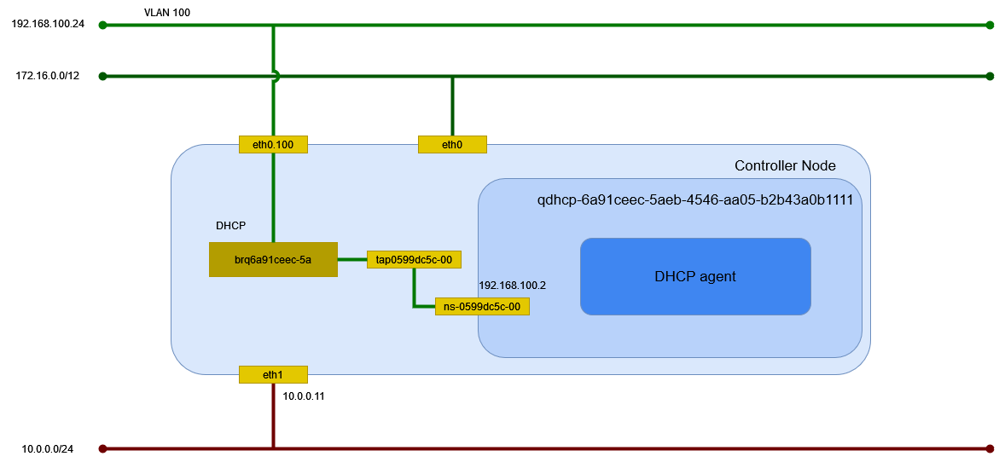

# vlan ネットワーク (Linux Bridge)

Linux Bridge を利用した vlan ネットワークを作成する。

## 前提条件

* [](../../installation/controller/neutron_linuxbridge/vlan) を設定していること。

## 外部ネットワークの作成

eth2 に繋がる外部ネットワークに vlan ネットワークを作成する。

| オプション         | 説明    |
| ------------------ | ------- |
| --provider-segment | VLAN ID |

```sh
openstack network create \
    --share \
    --external \
    --provider-physical-network provider \
    --provider-network-type vlan \
    --provider-segment 100 \
    provider-100
```

```text
+---------------------------+--------------------------------------+
| Field                     | Value                                |
+---------------------------+--------------------------------------+
| admin_state_up            | UP                                   |
| availability_zone_hints   |                                      |
| availability_zones        |                                      |
| created_at                | 2024-05-11T02:02:28Z                 |
| description               |                                      |
| dns_domain                | None                                 |
| id                        | 170db5a3-cc70-4474-a545-eb3a56c254c9 |
| ipv4_address_scope        | None                                 |
| ipv6_address_scope        | None                                 |
| is_default                | None                                 |
| is_vlan_transparent       | None                                 |
| mtu                       | 1500                                 |
| name                      | provider-100                         |
| port_security_enabled     | True                                 |
| project_id                | be94f4411bd74f249f5e25f642209b82     |
| provider:network_type     | vlan                                 |
| provider:physical_network | provider                             |
| provider:segmentation_id  | 100                                  |
| qos_policy_id             | None                                 |
| revision_number           | 1                                    |
| router:external           | External                             |
| segments                  | None                                 |
| shared                    | True                                 |
| status                    | ACTIVE                               |
| subnets                   |                                      |
| tags                      |                                      |
| tenant_id                 | be94f4411bd74f249f5e25f642209b82     |
| updated_at                | 2024-05-11T02:02:28Z                 |
+---------------------------+--------------------------------------+
```

## サブネットの作成

サブネットを作成する。

```sh
openstack subnet create \
    --network provider-100 \
    --allocation-pool start=192.168.100.1,end=192.168.100.253 \
    --gateway 192.168.100.254 \
    --subnet-range 192.168.100.0/24 \
    provider-100
```

```text
+----------------------+--------------------------------------+
| Field                | Value                                |
+----------------------+--------------------------------------+
| allocation_pools     | 192.168.100.1-192.168.100.253        |
| cidr                 | 192.168.100.0/24                     |
| created_at           | 2024-05-11T02:05:17Z                 |
| description          |                                      |
| dns_nameservers      |                                      |
| dns_publish_fixed_ip | None                                 |
| enable_dhcp          | True                                 |
| gateway_ip           | 192.168.100.254                      |
| host_routes          |                                      |
| id                   | ac69d9e8-ca79-4e55-8089-12f177896752 |
| ip_version           | 4                                    |
| ipv6_address_mode    | None                                 |
| ipv6_ra_mode         | None                                 |
| name                 | provider-100                         |
| network_id           | 170db5a3-cc70-4474-a545-eb3a56c254c9 |
| project_id           | be94f4411bd74f249f5e25f642209b82     |
| revision_number      | 0                                    |
| segment_id           | None                                 |
| service_types        |                                      |
| subnetpool_id        | None                                 |
| tags                 |                                      |
| updated_at           | 2024-05-11T02:05:17Z                 |
+----------------------+--------------------------------------+
```

DHCP サーバのポートの作成を確認する。

```sh
openstack port list --network provider-100
```

```text
+--------------------------------------+------+-------------------+------------------------------------------------------------------------------+--------+
| ID                                   | Name | MAC Address       | Fixed IP Addresses                                                           | Status |
+--------------------------------------+------+-------------------+------------------------------------------------------------------------------+--------+
| 39bed5c0-4c17-44b2-b191-c4c8028b8d64 |      | fa:16:3e:ed:27:b4 | ip_address='192.168.100.1', subnet_id='ac69d9e8-ca79-4e55-8089-12f177896752' | ACTIVE |
+--------------------------------------+------+-------------------+------------------------------------------------------------------------------+--------+
```

```sh
openstack port show 39bed5c0-4c17-44b2-b191-c4c8028b8d64
```

```text
+-------------------------+-------------------------------------------------------------------------------+
| Field                   | Value                                                                         |
+-------------------------+-------------------------------------------------------------------------------+
| admin_state_up          | UP                                                                            |
| allowed_address_pairs   |                                                                               |
| binding_host_id         | controller.home.local                                                         |
| binding_profile         |                                                                               |
| binding_vif_details     | bound_drivers.0='linuxbridge', connectivity='l2', port_filter='True'          |
| binding_vif_type        | bridge                                                                        |
| binding_vnic_type       | normal                                                                        |
| created_at              | 2024-05-11T02:05:18Z                                                          |
| data_plane_status       | None                                                                          |
| description             |                                                                               |
| device_id               | dhcpd3377d3c-a0d1-5d71-9947-f17125c357bb-170db5a3-cc70-4474-a545-eb3a56c254c9 |
| device_owner            | network:dhcp                                                                  |
| device_profile          | None                                                                          |
| dns_assignment          | None                                                                          |
| dns_domain              | None                                                                          |
| dns_name                | None                                                                          |
| extra_dhcp_opts         |                                                                               |
| fixed_ips               | ip_address='192.168.100.1', subnet_id='ac69d9e8-ca79-4e55-8089-12f177896752'  |
| hardware_offload_type   | None                                                                          |
| hints                   |                                                                               |
| id                      | 39bed5c0-4c17-44b2-b191-c4c8028b8d64                                          |
| ip_allocation           | None                                                                          |
| mac_address             | fa:16:3e:ed:27:b4                                                             |
| name                    |                                                                               |
| network_id              | 170db5a3-cc70-4474-a545-eb3a56c254c9                                          |
| numa_affinity_policy    | None                                                                          |
| port_security_enabled   | False                                                                         |
| project_id              | be94f4411bd74f249f5e25f642209b82                                              |
| propagate_uplink_status | None                                                                          |
| resource_request        | None                                                                          |
| revision_number         | 4                                                                             |
| qos_network_policy_id   | None                                                                          |
| qos_policy_id           | None                                                                          |
| security_group_ids      |                                                                               |
| status                  | ACTIVE                                                                        |
| tags                    |                                                                               |
| trunk_details           | None                                                                          |
| updated_at              | 2024-05-11T02:05:22Z                                                          |
+-------------------------+-------------------------------------------------------------------------------+
```

## 環境の確認

Controller Node でネットワーク構成を確認する。



### ネットワーク名前空間

サブネットを作成するとネットワーク名前空間が作成される。

```sh
ip netns
```

```text
qdhcp-170db5a3-cc70-4474-a545-eb3a56c254c9 (id: 1)
```

### デバイス

ブリッジと veth peer が作成される。

```sh
ip -d link show
```

```text
(...)

8: tap39bed5c0-4c@if2: <BROADCAST,MULTICAST,UP,LOWER_UP> mtu 1500 qdisc noqueue master brq170db5a3-cc state UP mode DEFAULT group default qlen 1000
    link/ether 7e:1d:14:17:71:a9 brd ff:ff:ff:ff:ff:ff link-netns qdhcp-170db5a3-cc70-4474-a545-eb3a56c254c9 promiscuity 1  allmulti 1 minmtu 68 maxmtu 65535
    veth
    bridge_slave state forwarding priority 32 cost 2 hairpin off guard off root_block off fastleave off learning on flood on port_id 0x8002 port_no 0x2 designated_port 32770 designated_cost 0 designated_bridge 8000.0:15:5d:bf:ba:55 designated_root 8000.0:15:5d:bf:ba:55 hold_timer    0.00 message_age_timer    0.00 forward_delay_timer    0.00 topology_change_ack 0 config_pending 0 proxy_arp off proxy_arp_wifi off mcast_router 1 mcast_fast_leave off mcast_flood on bcast_flood on mcast_to_unicast off neigh_suppress off group_fwd_mask 0 group_fwd_mask_str 0x0 vlan_tunnel off isolated off locked off mab off addrgenmode eui64 numtxqueues 2 numrxqueues 2 gso_max_size 65536 gso_max_segs 65535 tso_max_size 524280 tso_max_segs 65535 gro_max_size 65536
9: eth2.100@eth2: <BROADCAST,MULTICAST,UP,LOWER_UP> mtu 1500 qdisc noqueue master brq170db5a3-cc state UP mode DEFAULT group default qlen 1000
    link/ether 00:15:5d:bf:ba:55 brd ff:ff:ff:ff:ff:ff promiscuity 1  allmulti 1 minmtu 0 maxmtu 65535
    vlan protocol 802.1Q id 100 <REORDER_HDR>
    bridge_slave state forwarding priority 32 cost 2 hairpin off guard off root_block off fastleave off learning on flood on port_id 0x8001 port_no 0x1 designated_port 32769 designated_cost 0 designated_bridge 8000.0:15:5d:bf:ba:55 designated_root 8000.0:15:5d:bf:ba:55 hold_timer    0.00 message_age_timer    0.00 forward_delay_timer    0.00 topology_change_ack 0 config_pending 0 proxy_arp off proxy_arp_wifi off mcast_router 1 mcast_fast_leave off mcast_flood on bcast_flood on mcast_to_unicast off neigh_suppress off group_fwd_mask 0 group_fwd_mask_str 0x0 vlan_tunnel off isolated off locked off mab off addrgenmode eui64 numtxqueues 1 numrxqueues 1 gso_max_size 62780 gso_max_segs 65535 tso_max_size 62780 tso_max_segs 65535 gro_max_size 65536
10: brq170db5a3-cc: <BROADCAST,MULTICAST,UP,LOWER_UP> mtu 1500 qdisc noqueue state UP mode DEFAULT group default qlen 1000
    link/ether 00:15:5d:bf:ba:55 brd ff:ff:ff:ff:ff:ff promiscuity 0  allmulti 0 minmtu 68 maxmtu 65535
    bridge forward_delay 0 hello_time 200 max_age 2000 ageing_time 30000 stp_state 0 priority 32768 vlan_filtering 0 vlan_protocol 802.1Q bridge_id 8000.0:15:5d:bf:ba:55 designated_root 8000.0:15:5d:bf:ba:55 root_port 0 root_path_cost 0 topology_change 0 topology_change_detected 0 hello_timer    0.00 tcn_timer    0.00 topology_change_timer    0.00 gc_timer   35.12 vlan_default_pvid 1 vlan_stats_enabled 0 vlan_stats_per_port 0 group_fwd_mask 0 group_address 01:80:c2:00:00:00 mcast_snooping 1 no_linklocal_learn 0 mcast_vlan_snooping 0 mcast_router 1 mcast_query_use_ifaddr 0 mcast_querier 0 mcast_hash_elasticity 16 mcast_hash_max 4096 mcast_last_member_count 2 mcast_startup_query_count 2 mcast_last_member_interval 100 mcast_membership_interval 26000 mcast_querier_interval 25500 mcast_query_interval 12500 mcast_query_response_interval 1000 mcast_startup_query_interval 3125 mcast_stats_enabled 0 mcast_igmp_version 2 mcast_mld_version 1 nf_call_iptables 0 nf_call_ip6tables 0 nf_call_arptables 0 addrgenmode eui64 numtxqueues 1 numrxqueues 1 gso_max_size 62780 gso_max_segs 65535 tso_max_size 62780 tso_max_segs 65535 gro_max_size 65536
```

ネットワーク名前空間内のデバイスを確認する。

```sh
ip netns exec qdhcp-170db5a3-cc70-4474-a545-eb3a56c254c9 ip -d link show
```

```text
1: lo: <LOOPBACK,UP,LOWER_UP> mtu 65536 qdisc noqueue state UNKNOWN mode DEFAULT group default qlen 1000
    link/loopback 00:00:00:00:00:00 brd 00:00:00:00:00:00 promiscuity 0  allmulti 0 minmtu 0 maxmtu 0 addrgenmode eui64 numtxqueues 1 numrxqueues 1 gso_max_size 65536 gso_max_segs 65535 tso_max_size 524280 tso_max_segs 65535 gro_max_size 65536
2: ns-39bed5c0-4c@if8: <BROADCAST,MULTICAST,UP,LOWER_UP> mtu 1500 qdisc noqueue state UP mode DEFAULT group default qlen 1000
    link/ether fa:16:3e:ed:27:b4 brd ff:ff:ff:ff:ff:ff link-netnsid 0 promiscuity 0  allmulti 0 minmtu 68 maxmtu 65535
    veth addrgenmode eui64 numtxqueues 2 numrxqueues 2 gso_max_size 65536 gso_max_segs 65535 tso_max_size 524280 tso_max_segs 65535 gro_max_size 65536
```

tap39bed5c0-4c@**if2** と ns-39bed5c0-4c@**if8** が接続している。

veth peer の接続先は sysfs でも確認できる。接続先の Index が取得できる。

```sh
cat /sys/class/net/tap39bed5c0-4c/iflink
```

```text
2
```

### イーサネット

イーサネットの情報を確認する。

```sh
ip addr show
```

```text
(...)

8: tap39bed5c0-4c@if2: <BROADCAST,MULTICAST,UP,LOWER_UP> mtu 1500 qdisc noqueue master brq170db5a3-cc state UP group default qlen 1000
    link/ether 7e:1d:14:17:71:a9 brd ff:ff:ff:ff:ff:ff link-netns qdhcp-170db5a3-cc70-4474-a545-eb3a56c254c9
9: eth2.100@eth2: <BROADCAST,MULTICAST,UP,LOWER_UP> mtu 1500 qdisc noqueue master brq170db5a3-cc state UP group default qlen 1000
    link/ether 00:15:5d:bf:ba:55 brd ff:ff:ff:ff:ff:ff
10: brq170db5a3-cc: <BROADCAST,MULTICAST,UP,LOWER_UP> mtu 1500 qdisc noqueue state UP group default qlen 1000
    link/ether 00:15:5d:bf:ba:55 brd ff:ff:ff:ff:ff:ff
```

ネットワーク名前空間内のイーサネットの情報を確認する。
169.254.169.254 は Metadata agent が使用する。

```sh
ip netns exec qdhcp-170db5a3-cc70-4474-a545-eb3a56c254c9 ip addr show
```

```text
1: lo: <LOOPBACK,UP,LOWER_UP> mtu 65536 qdisc noqueue state UNKNOWN group default qlen 1000
    link/loopback 00:00:00:00:00:00 brd 00:00:00:00:00:00
    inet 127.0.0.1/8 scope host lo
       valid_lft forever preferred_lft forever
    inet6 ::1/128 scope host
       valid_lft forever preferred_lft forever
2: ns-39bed5c0-4c@if8: <BROADCAST,MULTICAST,UP,LOWER_UP> mtu 1500 qdisc noqueue state UP group default qlen 1000
    link/ether fa:16:3e:ed:27:b4 brd ff:ff:ff:ff:ff:ff link-netnsid 0
    inet 169.254.169.254/32 brd 169.254.169.254 scope global ns-39bed5c0-4c
       valid_lft forever preferred_lft forever
    inet 192.168.100.1/24 brd 192.168.100.255 scope global ns-39bed5c0-4c
       valid_lft forever preferred_lft forever
    inet6 fe80::f816:3eff:feed:27b4/64 scope link
       valid_lft forever preferred_lft forever
```

ルーティングを確認する。

```sh
ip netns exec qdhcp-170db5a3-cc70-4474-a545-eb3a56c254c9 ip route show
```

```text
default via 192.168.100.254 dev ns-39bed5c0-4c proto static
192.168.100.0/24 dev ns-39bed5c0-4c proto kernel scope link src 192.168.100.1
```

待ち受けているポートを確認する。

```sh
ip netns exec qdhcp-170db5a3-cc70-4474-a545-eb3a56c254c9 ss -ano -4
```

```text
Netid             State              Recv-Q             Send-Q                            Local Address:Port                           Peer Address:Port             Process
udp               UNCONN             0                  0                                     127.0.0.1:53                                  0.0.0.0:*
udp               UNCONN             0                  0                               169.254.169.254:53                                  0.0.0.0:*
udp               UNCONN             0                  0                                 192.168.100.1:53                                  0.0.0.0:*
udp               UNCONN             0                  0                                       0.0.0.0:67                                  0.0.0.0:*
tcp               LISTEN             0                  32                              169.254.169.254:53                                  0.0.0.0:*
tcp               LISTEN             0                  1024                            169.254.169.254:80                                  0.0.0.0:*
tcp               LISTEN             0                  32                                    127.0.0.1:53                                  0.0.0.0:*
tcp               LISTEN             0                  32                                192.168.100.1:53                                  0.0.0.0:*
```

### DHCP agent

dnsmasq のプロセスを確認する。

```sh
ps ax | grep dnsmasq
```

以下が動作していることが確認できる。

```sh
dnsmasq \
    --no-hosts \
    --no-resolv \
    --pid-file=/var/lib/neutron/dhcp/170db5a3-cc70-4474-a545-eb3a56c254c9/pid \
    --dhcp-hostsfile=/var/lib/neutron/dhcp/170db5a3-cc70-4474-a545-eb3a56c254c9/host \
    --addn-hosts=/var/lib/neutron/dhcp/170db5a3-cc70-4474-a545-eb3a56c254c9/addn_hosts \
    --dhcp-optsfile=/var/lib/neutron/dhcp/170db5a3-cc70-4474-a545-eb3a56c254c9/opts \
    --dhcp-leasefile=/var/lib/neutron/dhcp/170db5a3-cc70-4474-a545-eb3a56c254c9/leases \
    --dhcp-match=set:ipxe,175 \
    --dhcp-userclass=set:ipxe6,iPXE \
    --local-service \
    --bind-dynamic \
    --dhcp-range=set:subnet-ac69d9e8-ca79-4e55-8089-12f177896752,192.168.100.0,static,255.255.255.0,86400s \
    --dhcp-option-force=option:mtu,1500 \
    --dhcp-lease-max=256 \
    --conf-file=/dev/null \
    --domain=openstacklocal
```

使用しているインターフェイスを確認する。

```sh
cat /var/lib/neutron/dhcp/170db5a3-cc70-4474-a545-eb3a56c254c9/interface
```

```text
ns-39bed5c0-4c
```
