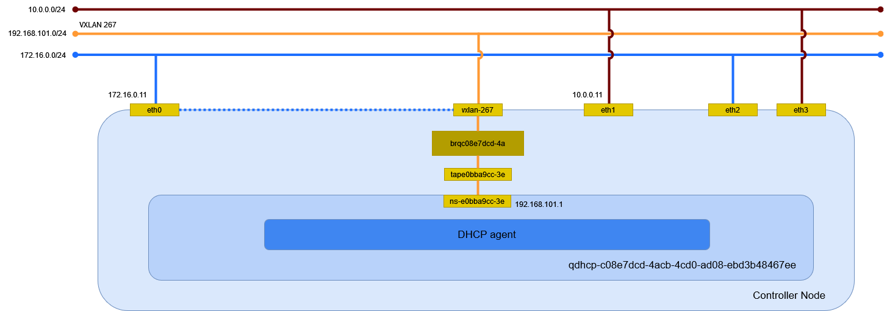

# vxlan ネットワーク (Linux Bridge)

Linux Bridge を利用した vxlan ネットワークを作成する。

## 前提条件

* Controller Node で [](../../installation/controller/neutron_linuxbridge/vxlan) を設定していること。
* Compute Node で [](../../installation/compute/neutron_linuxbridge/vxlan) を設定していること。

## セルフサービスネットワークの作成

管理者以外のユーザで、
eth0 に繋がるセルフサービスネットワークとして vxlan ネットワークを作成する。

```sh
openstack network create selfservice
```

```
+---------------------------+--------------------------------------+
| Field                     | Value                                |
+---------------------------+--------------------------------------+
| admin_state_up            | UP                                   |
| availability_zone_hints   |                                      |
| availability_zones        |                                      |
| created_at                | 2024-04-15T14:03:12Z                 |
| description               |                                      |
| dns_domain                | None                                 |
| id                        | 9f175a6d-d01e-4635-bdf3-244849aefab2 |
| ipv4_address_scope        | None                                 |
| ipv6_address_scope        | None                                 |
| is_default                | False                                |
| is_vxlan_transparent      | None                                 |
| mtu                       | 1450                                 |
| name                      | selfservice                          |
| port_security_enabled     | True                                 |
| project_id                | f2aeffb34ff34ffb8959f1cd813655c6     |
| provider:network_type     | None                                 |
| provider:physical_network | None                                 |
| provider:segmentation_id  | None                                 |
| qos_policy_id             | None                                 |
| revision_number           | 1                                    |
| router:external           | Internal                             |
| segments                  | None                                 |
| shared                    | False                                |
| status                    | ACTIVE                               |
| subnets                   |                                      |
| tags                      |                                      |
| updated_at                | 2024-04-15T14:03:12Z                 |
+---------------------------+--------------------------------------+
```

## サブネットの作成

サブネットを作成する。

```sh
openstack subnet create \
    --network selfservice \
    --gateway 192.168.101.1 \
    --subnet-range 192.168.101.0/24 \
    selfservice
```

```
+----------------------+--------------------------------------+
| Field                | Value                                |
+----------------------+--------------------------------------+
| allocation_pools     | 192.168.101.2-192.168.101.254        |
| cidr                 | 192.168.101.0/24                     |
| created_at           | 2024-04-15T14:05:47Z                 |
| description          |                                      |
| dns_nameservers      |                                      |
| dns_publish_fixed_ip | None                                 |
| enable_dhcp          | True                                 |
| gateway_ip           | 192.168.101.1                        |
| host_routes          |                                      |
| id                   | 22d95480-0cbd-4a38-bdc9-550fb10e0a03 |
| ip_version           | 4                                    |
| ipv6_address_mode    | None                                 |
| ipv6_ra_mode         | None                                 |
| name                 | selfservice                          |
| network_id           | 9f175a6d-d01e-4635-bdf3-244849aefab2 |
| project_id           | f2aeffb34ff34ffb8959f1cd813655c6     |
| revision_number      | 0                                    |
| segment_id           | None                                 |
| service_types        |                                      |
| subnetpool_id        | None                                 |
| tags                 |                                      |
| updated_at           | 2024-04-15T14:05:47Z                 |
+----------------------+--------------------------------------+
```

## 環境の確認

Controller Node でネットワーク構成を確認する。



### ネットワーク名前空間

サブネットを作成するとネットワーク名前空間が作成される。

```sh
ip netns
```

```
(...)

qdhcp-9f175a6d-d01e-4635-bdf3-244849aefab2 (id: 2)
```

### デバイス

ブリッジと veth peer が作成される。

```sh
ip -d link show
```

```
(...)

6: brqca4e2bc3-fe: <BROADCAST,MULTICAST,UP,LOWER_UP> mtu 1500 qdisc noqueue state UP mode DEFAULT group default qlen 1000
    link/ether 00:15:5d:bf:ba:43 brd ff:ff:ff:ff:ff:ff promiscuity 0 minmtu 68 maxmtu 65535
    bridge forward_delay 0 hello_time 200 max_age 2000 ageing_time 30000 stp_state 0 priority 32768 vlan_filtering 0 vlan_protocol 802.1Q bridge_id 8000.0:15:5d:bf:ba:43 designated_root 8000.0:15:5d:bf:ba:43 root_port 0 root_path_cost 0 topology_change 0 topology_change_detected 0 hello_timer    0.00 tcn_timer    0.00 topology_change_timer    0.00 gc_timer  135.41 vlan_default_pvid 1 vlan_stats_enabled 0 vlan_stats_per_port 0 group_fwd_mask 0 group_address 01:80:c2:00:00:00 mcast_snooping 1 no_linklocal_learn 0 mcast_vlan_snooping 0 mcast_router 1 mcast_query_use_ifaddr 0 mcast_querier 0 mcast_hash_elasticity 16 mcast_hash_max 4096 mcast_last_member_count 2 mcast_startup_query_count 2 mcast_last_member_interval 100 mcast_membership_interval 26000 mcast_querier_interval 25500 mcast_query_interval 12500 mcast_query_response_interval 1000 mcast_startup_query_interval 3125 mcast_stats_enabled 0 mcast_igmp_version 2 mcast_mld_version 1 nf_call_iptables 0 nf_call_ip6tables 0 nf_call_arptables 0 addrgenmode eui64 numtxqueues 1 numrxqueues 1 gso_max_size 62780 gso_max_segs 65535
11: tapd572d166-9f@if2: <BROADCAST,MULTICAST,UP,LOWER_UP> mtu 1450 qdisc noqueue master brq9f175a6d-d0 state UP mode DEFAULT group default qlen 1000
    link/ether be:99:ce:53:c3:14 brd ff:ff:ff:ff:ff:ff link-netns qdhcp-9f175a6d-d01e-4635-bdf3-244849aefab2 promiscuity 1 minmtu 68 maxmtu 65535
    veth
    bridge_slave state forwarding priority 32 cost 2 hairpin off guard off root_block off fastleave off learning on flood on port_id 0x8002 port_no 0x2 designated_port 32770 designated_cost 0 designated_bridge 8000.be:99:ce:53:c3:14 designated_root 8000.be:99:ce:53:c3:14 hold_timer    0.00 message_age_timer    0.00 forward_delay_timer    0.00 topology_change_ack 0 config_pending 0 proxy_arp off proxy_arp_wifi off mcast_router 1 mcast_fast_leave off mcast_flood on bcast_flood on mcast_to_unicast off neigh_suppress off group_fwd_mask 0 group_fwd_mask_str 0x0 vlan_tunnel off isolated off locked off addrgenmode eui64 numtxqueues 2 numrxqueues 2 gso_max_size 65536 gso_max_segs 65535
12: vxlan-288: <BROADCAST,MULTICAST,UP,LOWER_UP> mtu 1450 qdisc noqueue master brq9f175a6d-d0 state UNKNOWN mode DEFAULT group default qlen 1000
    link/ether ea:87:6f:ac:42:4f brd ff:ff:ff:ff:ff:ff promiscuity 1 minmtu 68 maxmtu 65535
    vxlan id 288 local 172.16.0.11 dev brqca4e2bc3-fe srcport 0 0 dstport 8472 ttl auto ageing 300 udpcsum noudp6zerocsumtx noudp6zerocsumrx
    bridge_slave state forwarding priority 32 cost 2 hairpin off guard off root_block off fastleave off learning on flood on port_id 0x8001 port_no 0x1 designated_port 32769 designated_cost 0 designated_bridge 8000.be:99:ce:53:c3:14 designated_root 8000.be:99:ce:53:c3:14 hold_timer    0.00 message_age_timer    0.00 forward_delay_timer    0.00 topology_change_ack 0 config_pending 0 proxy_arp off proxy_arp_wifi off mcast_router 1 mcast_fast_leave off mcast_flood on bcast_flood on mcast_to_unicast off neigh_suppress off group_fwd_mask 0 group_fwd_mask_str 0x0 vlan_tunnel off isolated off locked off addrgenmode eui64 numtxqueues 1 numrxqueues 1 gso_max_size 62780 gso_max_segs 65535
13: brq9f175a6d-d0: <BROADCAST,MULTICAST,UP,LOWER_UP> mtu 1450 qdisc noqueue state UP mode DEFAULT group default qlen 1000
    link/ether be:99:ce:53:c3:14 brd ff:ff:ff:ff:ff:ff promiscuity 0 minmtu 68 maxmtu 65535
    bridge forward_delay 0 hello_time 200 max_age 2000 ageing_time 30000 stp_state 0 priority 32768 vlan_filtering 0 vlan_protocol 802.1Q bridge_id 8000.be:99:ce:53:c3:14 designated_root 8000.be:99:ce:53:c3:14 root_port 0 root_path_cost 0 topology_change 0 topology_change_detected 0 hello_timer    0.00 tcn_timer    0.00 topology_change_timer    0.00 gc_timer   38.89 vlan_default_pvid 1 vlan_stats_enabled 0 vlan_stats_per_port 0 group_fwd_mask 0 group_address 01:80:c2:00:00:00 mcast_snooping 1 no_linklocal_learn 0 mcast_vlan_snooping 0 mcast_router 1 mcast_query_use_ifaddr 0 mcast_querier 0 mcast_hash_elasticity 16 mcast_hash_max 4096 mcast_last_member_count 2 mcast_startup_query_count 2 mcast_last_member_interval 100 mcast_membership_interval 26000 mcast_querier_interval 25500 mcast_query_interval 12500 mcast_query_response_interval 1000 mcast_startup_query_interval 3125 mcast_stats_enabled 0 mcast_igmp_version 2 mcast_mld_version 1 nf_call_iptables 0 nf_call_ip6tables 0 nf_call_arptables 0 addrgenmode eui64 numtxqueues 1 numrxqueues 1 gso_max_size 62780 gso_max_segs 65535
```

ネットワーク名前空間内のデバイスを確認する。

```sh
ip netns exec qdhcp-9f175a6d-d01e-4635-bdf3-244849aefab2 ip -d link show
```

```
1: lo: <LOOPBACK,UP,LOWER_UP> mtu 65536 qdisc noqueue state UNKNOWN mode DEFAULT group default qlen 1000
    link/loopback 00:00:00:00:00:00 brd 00:00:00:00:00:00 promiscuity 0 minmtu 0 maxmtu 0 addrgenmode eui64 numtxqueues 1 numrxqueues 1 gso_max_size 65536 gso_max_segs 65535
2: ns-d572d166-9f@if11: <BROADCAST,MULTICAST,UP,LOWER_UP> mtu 1450 qdisc noqueue state UP mode DEFAULT group default qlen 1000
    link/ether fa:16:3e:07:79:d1 brd ff:ff:ff:ff:ff:ff link-netnsid 0 promiscuity 0 minmtu 68 maxmtu 65535
    veth addrgenmode eui64 numtxqueues 2 numrxqueues 2 gso_max_size 65536 gso_max_segs 65535
```

tapd572d166-9f@**if2** と ns-d572d166-9f@**if11** が接続している。


ブリッジを確認する。

```sh
bridge -d link show
```

```{note}
veth peer の先が異なる。ネットワーク名前空間を認識しないのか？
```

```
(...)

2: eth0: <BROADCAST,MULTICAST,UP,LOWER_UP> mtu 1500 master brqca4e2bc3-fe state forwarding priority 32 cost 2
    hairpin off guard off root_block off fastleave off learning on flood on mcast_flood on bcast_flood on mcast_router 1 mcast_to_unicast off neigh_suppress off vlan_tunnel off isolated off locked off
11: tapd572d166-9f@eth0: <BROADCAST,MULTICAST,UP,LOWER_UP> mtu 1450 master brq9f175a6d-d0 state forwarding priority 32 cost 2
    hairpin off guard off root_block off fastleave off learning on flood on mcast_flood on bcast_flood on mcast_router 1 mcast_to_unicast off neigh_suppress off vlan_tunnel off isolated off locked off
12: vxlan-288: <BROADCAST,MULTICAST,UP,LOWER_UP> mtu 1450 master brq9f175a6d-d0 state forwarding priority 32 cost 2
    hairpin off guard off root_block off fastleave off learning on flood on mcast_flood on bcast_flood on mcast_router 1 mcast_to_unicast off neigh_suppress off vlan_tunnel off isolated off locked off
```

### イーサネット

イーサネットの情報を確認する。

```sh
ip addr show
```

```
(...)

6: brqca4e2bc3-fe: <BROADCAST,MULTICAST,UP,LOWER_UP> mtu 1500 qdisc noqueue state UP group default qlen 1000
    link/ether 00:15:5d:bf:ba:43 brd ff:ff:ff:ff:ff:ff
    inet 172.16.0.11/12 brd 172.31.255.255 scope global brqca4e2bc3-fe
       valid_lft forever preferred_lft forever
11: tapd572d166-9f@if2: <BROADCAST,MULTICAST,UP,LOWER_UP> mtu 1450 qdisc noqueue master brq9f175a6d-d0 state UP group default qlen 1000
    link/ether be:99:ce:53:c3:14 brd ff:ff:ff:ff:ff:ff link-netns qdhcp-9f175a6d-d01e-4635-bdf3-244849aefab2
12: vxlan-288: <BROADCAST,MULTICAST,UP,LOWER_UP> mtu 1450 qdisc noqueue master brq9f175a6d-d0 state UNKNOWN group default qlen 1000
    link/ether ea:87:6f:ac:42:4f brd ff:ff:ff:ff:ff:ff
13: brq9f175a6d-d0: <BROADCAST,MULTICAST,UP,LOWER_UP> mtu 1450 qdisc noqueue state UP group default qlen 1000
    link/ether be:99:ce:53:c3:14 brd ff:ff:ff:ff:ff:ff
```

ネットワーク名前空間内のイーサネットの情報を確認する。
169.254.169.254 は Metadata agent が使用する。

```sh
ip netns exec qdhcp-9f175a6d-d01e-4635-bdf3-244849aefab2 ip addr show
```

```
1: lo: <LOOPBACK,UP,LOWER_UP> mtu 65536 qdisc noqueue state UNKNOWN group default qlen 1000
    link/loopback 00:00:00:00:00:00 brd 00:00:00:00:00:00
    inet 127.0.0.1/8 scope host lo
       valid_lft forever preferred_lft forever
    inet6 ::1/128 scope host
       valid_lft forever preferred_lft forever
2: ns-d572d166-9f@if11: <BROADCAST,MULTICAST,UP,LOWER_UP> mtu 1450 qdisc noqueue state UP group default qlen 1000
    link/ether fa:16:3e:07:79:d1 brd ff:ff:ff:ff:ff:ff link-netnsid 0
    inet 169.254.169.254/32 brd 169.254.169.254 scope global ns-d572d166-9f
       valid_lft forever preferred_lft forever
    inet 192.168.101.2/24 brd 192.168.101.255 scope global ns-d572d166-9f
       valid_lft forever preferred_lft forever
    inet6 fe80::f816:3eff:fe07:79d1/64 scope link
       valid_lft forever preferred_lft forever
```

ルーティングを確認する。

```sh
ip netns exec qdhcp-9f175a6d-d01e-4635-bdf3-244849aefab2 ip route
```

```
default via 192.168.101.1 dev ns-d572d166-9f proto static
192.168.101.0/24 dev ns-d572d166-9f proto kernel scope link src 192.168.101.2
```

待ち受けているポートを確認する。

```sh
ip netns exec qdhcp-9f175a6d-d01e-4635-bdf3-244849aefab2 ss -ano -4
```

```
Netid                    State                     Recv-Q                    Send-Q                                         Local Address:Port                                       Peer Address:Port                   Process
udp                      UNCONN                    0                         0                                                  127.0.0.1:53                                              0.0.0.0:*
udp                      UNCONN                    0                         0                                            169.254.169.254:53                                              0.0.0.0:*
udp                      UNCONN                    0                         0                                              192.168.101.2:53                                              0.0.0.0:*
udp                      UNCONN                    0                         0                                                    0.0.0.0:67                                              0.0.0.0:*
tcp                      LISTEN                    0                         128                                          169.254.169.254:80                                              0.0.0.0:*
tcp                      LISTEN                    0                         32                                                 127.0.0.1:53                                              0.0.0.0:*
tcp                      LISTEN                    0                         32                                           169.254.169.254:53                                              0.0.0.0:*
tcp                      LISTEN                    0                         32                                             192.168.101.2:53                                              0.0.0.0:*
```

### DHCP agent

dnsmasq のプロセスを確認する。

```sh
ps ax | grep dnsmasq
```

以下が動作していることが確認できる。

```
dnsmasq \
    --no-hosts \
    --no-resolv \
    --pid-file=/var/lib/neutron/dhcp/9f175a6d-d01e-4635-bdf3-244849aefab2/pid \
    --dhcp-hostsfile=/var/lib/neutron/dhcp/9f175a6d-d01e-4635-bdf3-244849aefab2/host \
    --addn-hosts=/var/lib/neutron/dhcp/9f175a6d-d01e-4635-bdf3-244849aefab2/addn_hosts \
    --dhcp-optsfile=/var/lib/neutron/dhcp/9f175a6d-d01e-4635-bdf3-244849aefab2/opts \
    --dhcp-leasefile=/var/lib/neutron/dhcp/9f175a6d-d01e-4635-bdf3-244849aefab2/leases \
    --dhcp-match=set:ipxe,175 \
    --dhcp-userclass=set:ipxe6,iPXE \
    --local-service \
    --bind-dynamic \
    --dhcp-range=set:subnet-22d95480-0cbd-4a38-bdc9-550fb10e0a03,192.168.101.0,static,255.255.255.0,86400s \
    --dhcp-option-force=option:mtu,1450 \
    --dhcp-lease-max=256 \
    --conf-file=/dev/null \
    --domain=openstacklocal
```

使用しているインターフェイスを確認する。

```sh
cat /var/lib/neutron/dhcp/9f175a6d-d01e-4635-bdf3-244849aefab2/interface
```

```
ns-d572d166-9f
```
