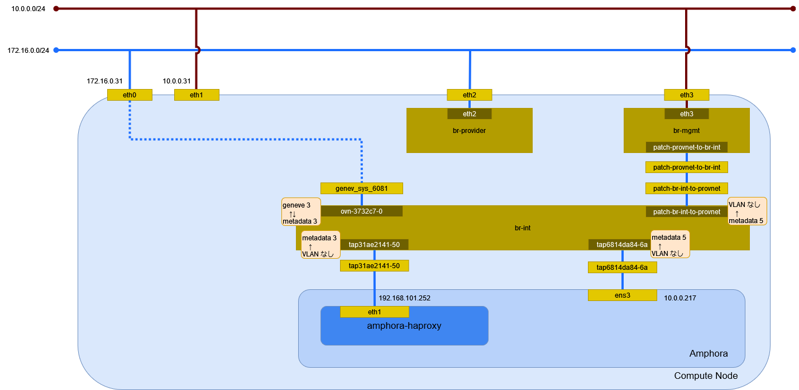

# ロードバランサ (Open Virtual Network)

## 前提条件

* [](../network/ovn_router) を作成していること。
* [](../instance/ovn_geneve.md) を 2 つ作成していること。

## ロードバランサの作成

```{tip}
myuser で実行
```

ロードバランサのサービスを提供するサブネット selfservice を指定してロードバランサを作成する。

```sh
openstack loadbalancer create \
    --name lb \
    --vip-subnet-id selfservice
```

```
+---------------------+--------------------------------------+
| Field               | Value                                |
+---------------------+--------------------------------------+
| admin_state_up      | True                                 |
| availability_zone   | None                                 |
| created_at          | 2024-06-06T13:39:12                  |
| description         |                                      |
| flavor_id           | None                                 |
| id                  | b9ee0f69-9bae-4939-ba4d-8c5c9c001b6d |
| listeners           |                                      |
| name                | lb                                   |
| operating_status    | OFFLINE                              |
| pools               |                                      |
| project_id          | bccf406c045d401b91ba5c7552a124ae     |
| provider            | amphora                              |
| provisioning_status | PENDING_CREATE                       |
| updated_at          | None                                 |
| vip_address         | 192.168.101.93                       |
| vip_network_id      | bdf0edc2-bae8-4cc7-85b2-2cc4e82ab10f |
| vip_port_id         | 65dcb86e-449b-4347-9df4-a6cf95608d66 |
| vip_qos_policy_id   | None                                 |
| vip_subnet_id       | f05c07d3-64de-48d6-ae17-bac8a885514d |
| vip_vnic_type       | normal                               |
| tags                |                                      |
| additional_vips     | []                                   |
+---------------------+--------------------------------------+
```

イメージ amphora からインスタンスが作成される。

```{tip}
octavia で実行
```

```sh
openstack server list
```

```
+--------------------------------------+----------------------------------------------+--------+-----------------+---------------------+---------+
| ID                                   | Name                                         | Status | Networks        | Image               | Flavor  |
+--------------------------------------+----------------------------------------------+--------+-----------------+---------------------+---------+
| e297f8b2-c961-43dc-8143-472bba98b09d | amphora-d0585a65-91aa-413b-8a58-db527e9222b3 | ACTIVE | mgmt=10.0.0.217 | amphora-x64-haproxy | amphora |
+--------------------------------------+----------------------------------------------+--------+-----------------+---------------------+---------+
```

しばらく時間が経過するとロードバランサのサービスが機能する。

```sh
curl -E /etc/octavia/certs/private/client.cert-and-key.pem -ksS https://10.0.0.217:9443
```

```json
{"api_version":"1.0"}
```

*/etc/octavia/octavia.conf* に指定したネットワークと `openstack loadbalancer create` に指定したネットワークに
接続された構成となることを確認する。

```sh
openstack server list
```

```
+--------------------------------------+----------------------------------------------+--------+----------------------------------------------+---------------------+---------+
| ID                                   | Name                                         | Status | Networks                                     | Image               | Flavor  |
+--------------------------------------+----------------------------------------------+--------+----------------------------------------------+---------------------+---------+
| e297f8b2-c961-43dc-8143-472bba98b09d | amphora-d0585a65-91aa-413b-8a58-db527e9222b3 | ACTIVE | mgmt=10.0.0.217; selfservice=192.168.101.252 | amphora-x64-haproxy | amphora |
+--------------------------------------+----------------------------------------------+--------+----------------------------------------------+---------------------+---------+
```

ロードバランサが作成されたことを確認する。

```sh
openstack loadbalancer list
```

```
+--------------------------------------+------+----------------------------------+----------------+---------------------+------------------+----------+
| id                                   | name | project_id                       | vip_address    | provisioning_status | operating_status | provider |
+--------------------------------------+------+----------------------------------+----------------+---------------------+------------------+----------+
| b9ee0f69-9bae-4939-ba4d-8c5c9c001b6d | lb   | bccf406c045d401b91ba5c7552a124ae | 192.168.101.93 | ACTIVE              | OFFLINE          | amphora  |
+--------------------------------------+------+----------------------------------+----------------+---------------------+------------------+----------+
```

## 環境の確認

Compute Node でネットワーク構成を確認する。



### インスタンス

amphora のインスタンスを確認する。

```sh
virsh list
```

```
 Id   名前                状態
----------------------------------
 2    instance-00000004   実行中
```

ネットワークインターフェイスの設定を確認する。

```sh
virsh dumpxml 2 | sed -n -e '/<interface/,/<\/interface>/ { p }'
```

```xml
<interface type='ethernet'>
  <mac address='fa:16:3e:4a:10:5c'/>
  <target dev='tap6814da84-6a'/>
  <model type='virtio'/>
  <driver name='qemu'/>
  <mtu size='1500'/>
  <alias name='net0'/>
  <address type='pci' domain='0x0000' bus='0x00' slot='0x03' function='0x0'/>
</interface>
<interface type='ethernet'>
  <mac address='fa:16:3e:df:e3:73'/>
  <target dev='tap31ae2141-50'/>
  <model type='virtio'/>
  <driver name='qemu'/>
  <mtu size='1442'/>
  <alias name='net1'/>
  <address type='pci' domain='0x0000' bus='0x00' slot='0x07' function='0x0'/>
</interface>
```

### ネットワーク

#### ネットワーク名前空間

amphora インスタンスのネットワーク名前空間を確認する。

```sh
ssh -i ./demo_rsa cloud-user@10.0.0.217 ip netns
```

```
amphora-haproxy (id: 0)
```

#### デバイス

Compute Node のデバイスを確認する。

```sh
ip -d link show
```

```
1: lo: <LOOPBACK,UP,LOWER_UP> mtu 65536 qdisc noqueue state UNKNOWN mode DEFAULT group default qlen 1000
    link/loopback 00:00:00:00:00:00 brd 00:00:00:00:00:00 promiscuity 0  allmulti 0 minmtu 0 maxmtu 0 addrgenmode eui64 numtxqueues 1 numrxqueues 1 gso_max_size 65536 gso_max_segs 65535 tso_max_size 524280 tso_max_segs 65535 gro_max_size 65536
2: eth0: <BROADCAST,MULTICAST,UP,LOWER_UP> mtu 1500 qdisc mq state UP mode DEFAULT group default qlen 1000
    link/ether 00:15:5d:bf:ba:50 brd ff:ff:ff:ff:ff:ff promiscuity 0  allmulti 0 minmtu 68 maxmtu 65521 addrgenmode none numtxqueues 64 numrxqueues 64 gso_max_size 62780 gso_max_segs 65535 tso_max_size 62780 tso_max_segs 65535 gro_max_size 65536 parentbus vmbus parentdev f4fd36cf-d20d-4c23-83bb-e1b5cc9fbfbc
3: eth1: <BROADCAST,MULTICAST,UP,LOWER_UP> mtu 1500 qdisc mq state UP mode DEFAULT group default qlen 1000
    link/ether 00:15:5d:bf:ba:57 brd ff:ff:ff:ff:ff:ff promiscuity 0  allmulti 0 minmtu 68 maxmtu 65521 addrgenmode none numtxqueues 64 numrxqueues 64 gso_max_size 62780 gso_max_segs 65535 tso_max_size 62780 tso_max_segs 65535 gro_max_size 65536 parentbus vmbus parentdev 1e1fc9b9-f159-4473-9410-cf7db6750e26
4: eth2: <BROADCAST,MULTICAST,UP,LOWER_UP> mtu 1500 qdisc mq master ovs-system state UP mode DEFAULT group default qlen 1000
    link/ether 00:15:5d:bf:ba:58 brd ff:ff:ff:ff:ff:ff promiscuity 1  allmulti 0 minmtu 68 maxmtu 65521
    openvswitch_slave addrgenmode none numtxqueues 64 numrxqueues 64 gso_max_size 62780 gso_max_segs 65535 tso_max_size 62780 tso_max_segs 65535 gro_max_size 65536 parentbus vmbus parentdev fb193242-70ac-437d-9008-4382b02d2a70
5: eth3: <BROADCAST,MULTICAST,UP,LOWER_UP> mtu 1500 qdisc mq master ovs-system state UP mode DEFAULT group default qlen 1000
    link/ether 00:15:5d:bf:ba:59 brd ff:ff:ff:ff:ff:ff promiscuity 1  allmulti 0 minmtu 68 maxmtu 65521
    openvswitch_slave addrgenmode none numtxqueues 64 numrxqueues 64 gso_max_size 62780 gso_max_segs 65535 tso_max_size 62780 tso_max_segs 65535 gro_max_size 65536 parentbus vmbus parentdev 6de0f76b-b7bc-45ba-9087-d8bee9131e1c
6: ovs-system: <BROADCAST,MULTICAST> mtu 1500 qdisc noop state DOWN mode DEFAULT group default qlen 1000
    link/ether 62:bf:c6:5a:a4:06 brd ff:ff:ff:ff:ff:ff promiscuity 1  allmulti 0 minmtu 68 maxmtu 65535
    openvswitch addrgenmode eui64 numtxqueues 1 numrxqueues 1 gso_max_size 65536 gso_max_segs 65535 tso_max_size 65536 tso_max_segs 65535 gro_max_size 65536
7: br-int: <BROADCAST,MULTICAST,UP,LOWER_UP> mtu 1442 qdisc noqueue state UNKNOWN mode DEFAULT group default qlen 1000
    link/ether 9a:20:83:87:33:1b brd ff:ff:ff:ff:ff:ff promiscuity 1  allmulti 0 minmtu 68 maxmtu 65535
    openvswitch addrgenmode none numtxqueues 1 numrxqueues 1 gso_max_size 65536 gso_max_segs 65535 tso_max_size 65536 tso_max_segs 65535 gro_max_size 65536
8: genev_sys_6081: <BROADCAST,MULTICAST,UP,LOWER_UP> mtu 65000 qdisc noqueue master ovs-system state UNKNOWN mode DEFAULT group default qlen 1000
    link/ether 66:67:63:da:76:f4 brd ff:ff:ff:ff:ff:ff promiscuity 1  allmulti 0 minmtu 68 maxmtu 65465
    geneve external id 0 ttl auto dstport 6081 udp6zerocsumrx
    openvswitch_slave addrgenmode eui64 numtxqueues 1 numrxqueues 1 gso_max_size 65536 gso_max_segs 65535 tso_max_size 65536 tso_max_segs 65535 gro_max_size 65536
10: tapbdf0edc2-b0@if2: <BROADCAST,MULTICAST,UP,LOWER_UP> mtu 1500 qdisc noqueue master ovs-system state UP mode DEFAULT group default qlen 1000
    link/ether 2e:65:f3:9f:19:5b brd ff:ff:ff:ff:ff:ff link-netns ovnmeta-bdf0edc2-bae8-4cc7-85b2-2cc4e82ab10f promiscuity 1  allmulti 0 minmtu 68 maxmtu 65535
    veth
    openvswitch_slave addrgenmode eui64 numtxqueues 1 numrxqueues 1 gso_max_size 65536 gso_max_segs 65535 tso_max_size 524280 tso_max_segs 65535 gro_max_size 65536
11: tap6814da84-6a: <BROADCAST,MULTICAST,UP,LOWER_UP> mtu 1500 qdisc noqueue master ovs-system state UNKNOWN mode DEFAULT group default qlen 1000
    link/ether fe:16:3e:4a:10:5c brd ff:ff:ff:ff:ff:ff promiscuity 1  allmulti 0 minmtu 68 maxmtu 65521
    tun type tap pi off vnet_hdr on persist off
    openvswitch_slave addrgenmode eui64 numtxqueues 1 numrxqueues 1 gso_max_size 65536 gso_max_segs 65535 tso_max_size 65536 tso_max_segs 65535 gro_max_size 65536
12: tap18e14b06-a0@if2: <BROADCAST,MULTICAST,UP,LOWER_UP> mtu 1500 qdisc noqueue master ovs-system state UP mode DEFAULT group default qlen 1000
    link/ether 72:90:03:99:e4:b7 brd ff:ff:ff:ff:ff:ff link-netns ovnmeta-18e14b06-a735-40de-847a-ef2d4ef5c22d promiscuity 1  allmulti 0 minmtu 68 maxmtu 65535
    veth
    openvswitch_slave addrgenmode eui64 numtxqueues 1 numrxqueues 1 gso_max_size 65536 gso_max_segs 65535 tso_max_size 524280 tso_max_segs 65535 gro_max_size 65536
13: tap31ae2141-50: <BROADCAST,MULTICAST,UP,LOWER_UP> mtu 1442 qdisc noqueue master ovs-system state UNKNOWN mode DEFAULT group default qlen 1000
    link/ether fe:16:3e:df:e3:73 brd ff:ff:ff:ff:ff:ff promiscuity 1  allmulti 0 minmtu 68 maxmtu 65521
    tun type tap pi off vnet_hdr on persist off
    openvswitch_slave addrgenmode eui64 numtxqueues 1 numrxqueues 1 gso_max_size 65536 gso_max_segs 65535 tso_max_size 65536 tso_max_segs 65535 gro_max_size 65536
```

amphora インスタンスのデバイスを確認する。

```sh
ssh -i ./demo_rsa cloud-user@10.0.0.217 ip -d link show
```

```
1: lo: <LOOPBACK,UP,LOWER_UP> mtu 65536 qdisc noqueue state UNKNOWN mode DEFAULT group default qlen 1000
    link/loopback 00:00:00:00:00:00 brd 00:00:00:00:00:00 promiscuity 0  allmulti 0 minmtu 0 maxmtu 0 addrgenmode eui64 numtxqueues 1 numrxqueues 1 gso_max_size 65536 gso_max_segs 65535 tso_max_size 524280 tso_max_segs 65535 gro_max_size 65536
2: ens3: <BROADCAST,MULTICAST,UP,LOWER_UP> mtu 1500 qdisc fq_codel state UP mode DEFAULT group default qlen 1000
    link/ether fa:16:3e:4a:10:5c brd ff:ff:ff:ff:ff:ff promiscuity 0  allmulti 0 minmtu 68 maxmtu 1500 addrgenmode eui64 numtxqueues 1 numrxqueues 1 gso_max_size 65536 gso_max_segs 65535 tso_max_size 65536 tso_max_segs 65535 gro_max_size 65536 parentbus virtio parentdev virtio0
    altname enp0s3
```

ネットワーク名前空間内のデバイスを確認する。

```sh
ssh -i ./demo_rsa cloud-user@10.0.0.217 sudo ip netns exec amphora-haproxy ip -d link show
```

```
1: lo: <LOOPBACK> mtu 65536 qdisc noop state DOWN mode DEFAULT group default qlen 1000
    link/loopback 00:00:00:00:00:00 brd 00:00:00:00:00:00 promiscuity 0  allmulti 0 minmtu 0 maxmtu 0 addrgenmode eui64 numtxqueues 1 numrxqueues 1 gso_max_size 65536 gso_max_segs 65535 tso_max_size 524280 tso_max_segs 65535 gro_max_size 65536
3: eth1: <BROADCAST,MULTICAST,UP,LOWER_UP> mtu 1442 qdisc fq_codel state UP mode DEFAULT group default qlen 1000
    link/ether fa:16:3e:df:e3:73 brd ff:ff:ff:ff:ff:ff promiscuity 0  allmulti 0 minmtu 68 maxmtu 1442 addrgenmode eui64 numtxqueues 1 numrxqueues 1 gso_max_size 65536 gso_max_segs 65535 tso_max_size 65536 tso_max_segs 65535 gro_max_size 65536 parentbus virtio parentdev virtio4
    altname enp0s7
```

#### Open vSwitch

ブリッジを確認する。

```sh
ovs-vsctl show
```

```
46423187-0689-4323-afe2-2ad6d689596b
    Bridge br-provider
        Port eth2
            Interface eth2
                type: system
    Bridge br-mgmt
        Port eth3
            Interface eth3
                type: system
        Port patch-provnet-4aab9844-7407-4435-ad7c-6578dd6b4863-to-br-int
            Interface patch-provnet-4aab9844-7407-4435-ad7c-6578dd6b4863-to-br-int
                type: patch
                options: {peer=patch-br-int-to-provnet-4aab9844-7407-4435-ad7c-6578dd6b4863}
    Bridge br-int
        fail_mode: secure
        datapath_type: system
        Port tapbdf0edc2-b0
            Interface tapbdf0edc2-b0
        Port tap18e14b06-a0
            Interface tap18e14b06-a0
        Port br-int
            Interface br-int
                type: internal
        Port tap31ae2141-50
            Interface tap31ae2141-50
        Port ovn-3732c7-0
            Interface ovn-3732c7-0
                type: geneve
                options: {csum="true", key=flow, remote_ip="172.16.0.11"}
        Port tap6814da84-6a
            Interface tap6814da84-6a
        Port patch-br-int-to-provnet-4aab9844-7407-4435-ad7c-6578dd6b4863
            Interface patch-br-int-to-provnet-4aab9844-7407-4435-ad7c-6578dd6b4863
                type: patch
                options: {peer=patch-provnet-4aab9844-7407-4435-ad7c-6578dd6b4863-to-br-int}
    ovs_version: "3.3.1"
```

データパスを確認する。

```sh
ovs-dpctl show
```

```
system@ovs-system:
  lookups: hit:2131 missed:429 lost:0
  flows: 7
  masks: hit:4430 total:7 hit/pkt:1.73
  cache: hit:1320 hit-rate:51.56%
  caches:
    masks-cache: size:256
  port 0: ovs-system (internal)
  port 1: eth2
  port 2: eth3
  port 3: br-int (internal)
  port 4: genev_sys_6081 (geneve: packet_type=ptap)
  port 6: tapbdf0edc2-b0
  port 7: tap6814da84-6a
  port 8: tap18e14b06-a0
  port 9: tap31ae2141-50
```

ブリッジ br-provider のフローのエントリを確認する。

```sh
ovs-ofctl dump-flows br-provider
```

```
 cookie=0x0, duration=13194.392s, table=0, n_packets=558, n_bytes=103668, priority=0 actions=NORMAL
```

ブリッジ br-mgmt のフローのエントリを確認する。

```sh
ovs-ofctl dump-flows br-mgmt
```

```
cookie=0x0, duration=13206.366s, table=0, n_packets=1085, n_bytes=190242, priority=0 actions=NORMAL
```

ブリッジ br-int のフローのエントリを確認する。

```sh
ovs-ofctl dump-flows br-int
```

```
 cookie=0x0, duration=13215.248s, table=0, n_packets=0, n_bytes=0, priority=120,icmp6,in_port="ovn-3732c7-0",icmp_type=2,icmp_code=0 actions=move:NXM_NX_TUN_ID[0..23]->OXM_OF_METADATA[0..23],move:NXM_NX_TUN_METADATA0[16..30]->NXM_NX_REG14[0..14],move:NXM_NX_TUN_METADATA0[0..15]->NXM_NX_REG15[0..15],resubmit(,40),load:0x1->NXM_NX_REG10[16],resubmit(,8)
 cookie=0x0, duration=13215.248s, table=0, n_packets=0, n_bytes=0, priority=120,icmp,in_port="ovn-3732c7-0",icmp_type=3,icmp_code=4 actions=move:NXM_NX_TUN_ID[0..23]->OXM_OF_METADATA[0..23],move:NXM_NX_TUN_METADATA0[16..30]->NXM_NX_REG14[0..14],move:NXM_NX_TUN_METADATA0[0..15]->NXM_NX_REG15[0..15],resubmit(,40),load:0x1->NXM_NX_REG10[16],resubmit(,8)
 cookie=0x0, duration=13215.248s, table=0, n_packets=21, n_bytes=4599, priority=100,in_port="ovn-3732c7-0" actions=move:NXM_NX_TUN_ID[0..23]->OXM_OF_METADATA[0..23],move:NXM_NX_TUN_METADATA0[16..30]->NXM_NX_REG14[0..14],move:NXM_NX_TUN_METADATA0[0..15]->NXM_NX_REG15[0..15],resubmit(,40)
 cookie=0xa92b7bb9, duration=12630.355s, table=0, n_packets=69, n_bytes=7635, priority=100,in_port="tapbdf0edc2-b0" actions=load:0x6->NXM_NX_REG13[0..15],load:0x1->NXM_NX_REG11[],load:0x4->NXM_NX_REG12[],load:0x3->OXM_OF_METADATA[],load:0x1->NXM_NX_REG14[],load:0->NXM_NX_REG13[16..31],load:0x1->NXM_NX_REG10[10],resubmit(,8)
 cookie=0xf0845535, duration=738.300s, table=0, n_packets=222, n_bytes=45211, priority=100,in_port="tap6814da84-6a" actions=load:0x8->NXM_NX_REG13[0..15],load:0x7->NXM_NX_REG11[],load:0x9->NXM_NX_REG12[],load:0x5->OXM_OF_METADATA[],load:0x3->NXM_NX_REG14[],load:0->NXM_NX_REG13[16..31],resubmit(,8)
 cookie=0xabf1d2a9, duration=737.860s, table=0, n_packets=13, n_bytes=1062, priority=100,in_port="tap18e14b06-a0" actions=load:0xb->NXM_NX_REG13[0..15],load:0x7->NXM_NX_REG11[],load:0x9->NXM_NX_REG12[],load:0x5->OXM_OF_METADATA[],load:0x2->NXM_NX_REG14[],load:0->NXM_NX_REG13[16..31],load:0x1->NXM_NX_REG10[10],resubmit(,8)
 cookie=0xfb826832, duration=508.151s, table=0, n_packets=7, n_bytes=606, priority=100,in_port="tap31ae2141-50" actions=load:0xc->NXM_NX_REG13[0..15],load:0x1->NXM_NX_REG11[],load:0x4->NXM_NX_REG12[],load:0x3->OXM_OF_METADATA[],load:0x7->NXM_NX_REG14[],load:0->NXM_NX_REG13[16..31],resubmit(,8)
 cookie=0x36393d4c, duration=738.279s, table=0, n_packets=0, n_bytes=0, priority=100,in_port="patch-br-int-to",dl_vlan=0 actions=strip_vlan,load:0xa->NXM_NX_REG13[0..15],load:0x7->NXM_NX_REG11[],load:0x9->NXM_NX_REG12[],load:0x5->OXM_OF_METADATA[],load:0x1->NXM_NX_REG14[],load:0->NXM_NX_REG13[16..31],resubmit(,8)
 cookie=0x36393d4c, duration=738.279s, table=0, n_packets=283, n_bytes=41141, priority=100,in_port="patch-br-int-to",vlan_tci=0x0000/0x1000 actions=load:0xa->NXM_NX_REG13[0..15],load:0x7->NXM_NX_REG11[],load:0x9->NXM_NX_REG12[],load:0x5->OXM_OF_METADATA[],load:0x1->NXM_NX_REG14[],load:0->NXM_NX_REG13[16..31],resubmit(,8)
 cookie=0x0, duration=13215.268s, table=0, n_packets=0, n_bytes=0, priority=0 actions=drop
 cookie=0x38abd39c, duration=12637.695s, table=8, n_packets=0, n_bytes=0, priority=120,icmp,reg10=0x10000/0x10000,metadata=0x4,dl_dst=fa:16:3e:5c:ae:36,icmp_type=3,icmp_code=4 actions=push:NXM_NX_REG14[],push:NXM_NX_REG15[],pop:NXM_NX_REG14[],pop:NXM_NX_REG15[],load:0x2->NXM_NX_REG14[],resubmit(,9)
 cookie=0x38abd39c, duration=12637.695s, table=8, n_packets=0, n_bytes=0, priority=120,icmp6,reg10=0x10000/0x10000,metadata=0x4,dl_dst=fa:16:3e:5c:ae:36,icmp_type=2,icmp_code=0 actions=push:NXM_NX_REG14[],push:NXM_NX_REG15[],pop:NXM_NX_REG14[],pop:NXM_NX_REG15[],load:0x2->NXM_NX_REG14[],resubmit(,9)
 cookie=0xf0d29ff7, duration=12637.692s, table=8, n_packets=0, n_bytes=0, priority=120,icmp,reg10=0x10000/0x10000,metadata=0x3,dl_dst=fa:16:3e:fb:8f:ff,icmp_type=3,icmp_code=4 actions=push:NXM_NX_REG14[],push:NXM_NX_REG15[],pop:NXM_NX_REG14[],pop:NXM_NX_REG15[],resubmit(,35)
 cookie=0xf0d29ff7, duration=12637.692s, table=8, n_packets=0, n_bytes=0, priority=120,icmp6,reg10=0x10000/0x10000,metadata=0x3,dl_dst=fa:16:3e:fb:8f:ff,icmp_type=2,icmp_code=0 actions=push:NXM_NX_REG14[],push:NXM_NX_REG15[],pop:NXM_NX_REG14[],pop:NXM_NX_REG15[],resubmit(,35)
 cookie=0xaa53d4cf, duration=12637.709s, table=8, n_packets=0, n_bytes=0, priority=110,icmp6,reg10=0x10000/0x10000,metadata=0x3,icmp_type=2,icmp_code=0 actions=drop
 cookie=0xaa53d4cf, duration=12637.709s, table=8, n_packets=0, n_bytes=0, priority=110,icmp,reg10=0x10000/0x10000,metadata=0x3,icmp_type=3,icmp_code=4 actions=drop
 cookie=0xb2a4afc, duration=12637.692s, table=8, n_packets=0, n_bytes=0, priority=110,icmp6,reg10=0x10000/0x10000,metadata=0x4,icmp_type=2,icmp_code=0 actions=drop
 cookie=0xb2a4afc, duration=12637.692s, table=8, n_packets=0, n_bytes=0, priority=110,icmp,reg10=0x10000/0x10000,metadata=0x4,icmp_type=3,icmp_code=4 actions=drop
 cookie=0xaa53d4cf, duration=738.334s, table=8, n_packets=0, n_bytes=0, priority=110,icmp6,reg10=0x10000/0x10000,metadata=0x5,icmp_type=2,icmp_code=0 actions=drop
 cookie=0xaa53d4cf, duration=738.334s, table=8, n_packets=0, n_bytes=0, priority=110,icmp,reg10=0x10000/0x10000,metadata=0x5,icmp_type=3,icmp_code=4 actions=drop
 cookie=0x529e6a4f, duration=12637.710s, table=8, n_packets=0, n_bytes=0, priority=100,metadata=0x3,vlan_tci=0x1000/0x1000 actions=drop
 cookie=0xf9271327, duration=12637.694s, table=8, n_packets=0, n_bytes=0, priority=100,metadata=0x4,vlan_tci=0x1000/0x1000 actions=drop
 cookie=0x529e6a4f, duration=738.335s, table=8, n_packets=0, n_bytes=0, priority=100,metadata=0x5,vlan_tci=0x1000/0x1000 actions=drop
 cookie=0xca103cce, duration=12637.707s, table=8, n_packets=0, n_bytes=0, priority=100,metadata=0x3,dl_src=01:00:00:00:00:00/01:00:00:00:00:00 actions=drop
 cookie=0xf9271327, duration=12637.694s, table=8, n_packets=0, n_bytes=0, priority=100,metadata=0x4,dl_src=01:00:00:00:00:00/01:00:00:00:00:00 actions=drop
 cookie=0xca103cce, duration=738.312s, table=8, n_packets=0, n_bytes=0, priority=100,metadata=0x5,dl_src=01:00:00:00:00:00/01:00:00:00:00:00 actions=drop
 cookie=0xb73071fd, duration=12637.708s, table=8, n_packets=211, n_bytes=22041, priority=50,metadata=0x3 actions=load:0->NXM_NX_REG10[12],resubmit(,73),move:NXM_NX_REG10[12]->NXM_NX_XXREG0[111],resubmit(,9)
 cookie=0xad14c556, duration=12637.694s, table=8, n_packets=0, n_bytes=0, priority=0,metadata=0x4 actions=drop
 cookie=0xb73071fd, duration=738.334s, table=8, n_packets=523, n_bytes=87624, priority=50,metadata=0x5 actions=load:0->NXM_NX_REG10[12],resubmit(,73),move:NXM_NX_REG10[12]->NXM_NX_XXREG0[111],resubmit(,9)
 cookie=0x22b19924, duration=12637.694s, table=8, n_packets=0, n_bytes=0, priority=50,reg14=0x2,metadata=0x4,dl_dst=01:00:00:00:00:00/01:00:00:00:00:00 actions=load:0xfa163e5cae36->NXM_NX_XXREG0[64..111],resubmit(,9)
 cookie=0x671adbca, duration=12637.694s, table=8, n_packets=2, n_bytes=84, priority=50,reg14=0x1,metadata=0x4,dl_dst=01:00:00:00:00:00/01:00:00:00:00:00 actions=load:0xfa163efb8fff->NXM_NX_XXREG0[64..111],resubmit(,9)
 cookie=0xc6cdacf5, duration=12637.692s, table=8, n_packets=20, n_bytes=3694, priority=50,reg14=0x1,metadata=0x4,dl_dst=fa:16:3e:fb:8f:ff actions=load:0xfa163efb8fff->NXM_NX_XXREG0[64..111],resubmit(,9)
 cookie=0x756e1ab3, duration=12637.694s, table=9, n_packets=0, n_bytes=0, priority=110,arp,reg14=0x1,metadata=0x4,arp_spa=192.168.101.0/24,arp_tpa=192.168.101.254,arp_op=1 actions=push:NXM_NX_REG0[],push:NXM_OF_ETH_SRC[],push:NXM_NX_ARP_SHA[],push:NXM_OF_ARP_SPA[],pop:NXM_NX_REG0[],pop:NXM_OF_ETH_SRC[],load:0->NXM_NX_REG10[6],resubmit(,67),move:NXM_NX_REG10[6]->OXM_OF_PKT_REG4[2],pop:NXM_OF_ETH_SRC[],pop:NXM_NX_REG0[],load:0x1->OXM_OF_PKT_REG4[3],resubmit(,10)
 cookie=0xc3a8f5b6, duration=12637.694s, table=9, n_packets=0, n_bytes=0, priority=110,icmp6,metadata=0x4,ipv6_src=fe80::/10,ipv6_dst=ff00::/8,nw_ttl=255,icmp_type=136,icmp_code=0 actions=push:NXM_NX_XXREG0[],push:NXM_OF_ETH_SRC[],push:NXM_NX_ND_TLL[],push:NXM_NX_ND_TARGET[],pop:NXM_NX_XXREG0[],pop:NXM_OF_ETH_SRC[],load:0->NXM_NX_REG10[6],resubmit(,67),move:NXM_NX_REG10[6]->OXM_OF_PKT_REG4[2],pop:NXM_OF_ETH_SRC[],pop:NXM_NX_XXREG0[],push:NXM_NX_REG15[],push:NXM_NX_XXREG0[],push:NXM_NX_ND_TARGET[],push:NXM_NX_REG14[],pop:NXM_NX_REG15[],pop:NXM_NX_XXREG0[],push:NXM_OF_ETH_DST[],load:0->NXM_NX_REG10[6],resubmit(,66),move:NXM_NX_REG10[6]->OXM_OF_PKT_REG4[3],pop:NXM_OF_ETH_DST[],pop:NXM_NX_XXREG0[],pop:NXM_NX_REG15[],resubmit(,10)
 cookie=0x30ac630e, duration=12637.695s, table=9, n_packets=0, n_bytes=0, priority=100,icmp6,metadata=0x4,nw_ttl=255,icmp_type=135,icmp_code=0 actions=push:NXM_NX_XXREG0[],push:NXM_OF_ETH_SRC[],push:NXM_NX_ND_SLL[],push:NXM_NX_IPV6_SRC[],pop:NXM_NX_XXREG0[],pop:NXM_OF_ETH_SRC[],load:0->NXM_NX_REG10[6],resubmit(,67),move:NXM_NX_REG10[6]->OXM_OF_PKT_REG4[2],pop:NXM_OF_ETH_SRC[],pop:NXM_NX_XXREG0[],push:NXM_NX_REG15[],push:NXM_NX_XXREG0[],push:NXM_NX_IPV6_SRC[],push:NXM_NX_REG14[],pop:NXM_NX_REG15[],pop:NXM_NX_XXREG0[],push:NXM_OF_ETH_DST[],load:0->NXM_NX_REG10[6],resubmit(,66),move:NXM_NX_REG10[6]->OXM_OF_PKT_REG4[3],pop:NXM_OF_ETH_DST[],pop:NXM_NX_XXREG0[],pop:NXM_NX_REG15[],resubmit(,10)
 cookie=0x64357a93, duration=12637.695s, table=9, n_packets=0, n_bytes=0, priority=100,icmp6,metadata=0x4,nw_ttl=255,icmp_type=136,icmp_code=0 actions=push:NXM_NX_XXREG0[],push:NXM_OF_ETH_SRC[],push:NXM_NX_ND_TLL[],push:NXM_NX_ND_TARGET[],pop:NXM_NX_XXREG0[],pop:NXM_OF_ETH_SRC[],load:0->NXM_NX_REG10[6],resubmit(,67),move:NXM_NX_REG10[6]->OXM_OF_PKT_REG4[2],pop:NXM_OF_ETH_SRC[],pop:NXM_NX_XXREG0[],load:0x1->OXM_OF_PKT_REG4[3],resubmit(,10)
 cookie=0x16ef9f4b, duration=12637.694s, table=9, n_packets=2, n_bytes=84, priority=100,arp,reg14=0x1,metadata=0x4,arp_spa=192.168.101.0/24,arp_op=1 actions=push:NXM_NX_REG0[],push:NXM_OF_ETH_SRC[],push:NXM_NX_ARP_SHA[],push:NXM_OF_ARP_SPA[],pop:NXM_NX_REG0[],pop:NXM_OF_ETH_SRC[],load:0->NXM_NX_REG10[6],resubmit(,67),move:NXM_NX_REG10[6]->OXM_OF_PKT_REG4[2],pop:NXM_OF_ETH_SRC[],pop:NXM_NX_REG0[],push:NXM_NX_REG15[],push:NXM_NX_REG0[],push:NXM_OF_ARP_SPA[],push:NXM_NX_REG14[],pop:NXM_NX_REG15[],pop:NXM_NX_REG0[],push:NXM_OF_ETH_DST[],load:0->NXM_NX_REG10[6],resubmit(,66),move:NXM_NX_REG10[6]->OXM_OF_PKT_REG4[3],pop:NXM_OF_ETH_DST[],pop:NXM_NX_REG0[],pop:NXM_NX_REG15[],resubmit(,10)
 cookie=0xf976c06a, duration=12637.694s, table=9, n_packets=0, n_bytes=0, priority=100,arp,metadata=0x4,arp_op=2 actions=push:NXM_NX_REG0[],push:NXM_OF_ETH_SRC[],push:NXM_NX_ARP_SHA[],push:NXM_OF_ARP_SPA[],pop:NXM_NX_REG0[],pop:NXM_OF_ETH_SRC[],load:0->NXM_NX_REG10[6],resubmit(,67),move:NXM_NX_REG10[6]->OXM_OF_PKT_REG4[2],pop:NXM_OF_ETH_SRC[],pop:NXM_NX_REG0[],load:0x1->OXM_OF_PKT_REG4[3],resubmit(,10)
 cookie=0x8f7e5679, duration=12637.709s, table=9, n_packets=19, n_bytes=1458, priority=50,reg0=0x8000/0x8000,metadata=0x3 actions=drop
 cookie=0x8f7e5679, duration=738.334s, table=9, n_packets=13, n_bytes=1006, priority=50,reg0=0x8000/0x8000,metadata=0x5 actions=drop
 cookie=0xa541e594, duration=12637.709s, table=9, n_packets=192, n_bytes=20583, priority=0,metadata=0x3 actions=resubmit(,10)
 cookie=0x47846370, duration=12637.692s, table=9, n_packets=20, n_bytes=3694, priority=0,metadata=0x4 actions=load:0x1->OXM_OF_PKT_REG4[2],resubmit(,10)
 cookie=0xa541e594, duration=738.334s, table=9, n_packets=510, n_bytes=86618, priority=0,metadata=0x5 actions=resubmit(,10)
 cookie=0x33e7f0f, duration=12637.695s, table=10, n_packets=20, n_bytes=3694, priority=100,reg9=0x4/0x4,metadata=0x4 actions=resubmit(,79),resubmit(,11)
 cookie=0x33e7f0f, duration=12637.695s, table=10, n_packets=2, n_bytes=84, priority=100,reg9=0/0x8,metadata=0x4 actions=resubmit(,79),resubmit(,11)
 cookie=0x1573a5a0, duration=12637.694s, table=10, n_packets=0, n_bytes=0, priority=95,icmp6,metadata=0x4,ipv6_src=::,nw_ttl=255,icmp_type=135,icmp_code=0 actions=resubmit(,11)
 cookie=0x1573a5a0, duration=12637.694s, table=10, n_packets=0, n_bytes=0, priority=95,icmp6,metadata=0x4,nw_ttl=255,icmp_type=135,icmp_code=0,nd_sll=00:00:00:00:00:00 actions=resubmit(,11)
 cookie=0xe360f654, duration=12637.694s, table=10, n_packets=0, n_bytes=0, priority=95,icmp6,metadata=0x4,nw_ttl=255,icmp_type=136,icmp_code=0,nd_tll=00:00:00:00:00:00 actions=push:NXM_NX_XXREG0[],push:NXM_NX_ND_TARGET[],pop:NXM_NX_XXREG0[],controller(userdata=00.00.00.04.00.00.00.00),pop:NXM_NX_XXREG0[],resubmit(,11)
 cookie=0xdff72f27, duration=12637.694s, table=10, n_packets=0, n_bytes=0, priority=90,arp,metadata=0x4 actions=push:NXM_NX_REG0[],push:NXM_OF_ETH_SRC[],push:NXM_NX_ARP_SHA[],push:NXM_OF_ARP_SPA[],pop:NXM_NX_REG0[],pop:NXM_OF_ETH_SRC[],controller(userdata=00.00.00.01.00.00.00.00),pop:NXM_OF_ETH_SRC[],pop:NXM_NX_REG0[],resubmit(,11)
 cookie=0x21a23953, duration=12637.694s, table=10, n_packets=0, n_bytes=0, priority=90,icmp6,metadata=0x4,nw_ttl=255,icmp_type=135,icmp_code=0 actions=push:NXM_NX_XXREG0[],push:NXM_OF_ETH_SRC[],push:NXM_NX_ND_SLL[],push:NXM_NX_IPV6_SRC[],pop:NXM_NX_XXREG0[],pop:NXM_OF_ETH_SRC[],controller(userdata=00.00.00.04.00.00.00.00),pop:NXM_OF_ETH_SRC[],pop:NXM_NX_XXREG0[],resubmit(,11)
 cookie=0x68ad8a6b, duration=12637.695s, table=10, n_packets=0, n_bytes=0, priority=90,icmp6,metadata=0x4,nw_ttl=255,icmp_type=136,icmp_code=0 actions=push:NXM_NX_XXREG0[],push:NXM_OF_ETH_SRC[],push:NXM_NX_ND_TLL[],push:NXM_NX_ND_TARGET[],pop:NXM_NX_XXREG0[],pop:NXM_OF_ETH_SRC[],controller(userdata=00.00.00.04.00.00.00.00),pop:NXM_OF_ETH_SRC[],pop:NXM_NX_XXREG0[],resubmit(,11)
 cookie=0x2e9e92e, duration=12637.721s, table=10, n_packets=192, n_bytes=20583, priority=0,metadata=0x3 actions=resubmit(,11)
 cookie=0xd6c1874b, duration=12637.695s, table=10, n_packets=0, n_bytes=0, priority=0,metadata=0x4 actions=drop
 cookie=0x2e9e92e, duration=738.347s, table=10, n_packets=510, n_bytes=86618, priority=0,metadata=0x5 actions=resubmit(,11)
 cookie=0xb919f8de, duration=12637.695s, table=11, n_packets=0, n_bytes=0, priority=120,ip,reg14=0x2,metadata=0x4,nw_src=172.16.0.140 actions=resubmit(,12)
 cookie=0x29655490, duration=12637.696s, table=11, n_packets=0, n_bytes=0, priority=90,icmp6,metadata=0x4,ipv6_dst=fe80::f816:3eff:fefb:8fff,icmp_type=128,icmp_code=0 actions=push:NXM_NX_IPV6_SRC[],push:NXM_NX_IPV6_DST[],pop:NXM_NX_IPV6_SRC[],pop:NXM_NX_IPV6_DST[],load:0xff->NXM_NX_IP_TTL[],load:0x81->NXM_NX_ICMPV6_TYPE[],load:0x1->NXM_NX_REG10[0],resubmit(,12)
 cookie=0x2efa191b, duration=12637.696s, table=11, n_packets=0, n_bytes=0, priority=100,udp6,metadata=0x4,ipv6_dst=fe80::f816:3eff:fe5c:ae36,tp_src=547,tp_dst=546 actions=load:0->NXM_NX_XXREG0[96..127],controller(userdata=00.00.00.13.00.00.00.00)
 cookie=0x26b4e13f, duration=12637.695s, table=11, n_packets=0, n_bytes=0, priority=90,icmp6,metadata=0x4,ipv6_dst=fe80::f816:3eff:fe5c:ae36,icmp_type=128,icmp_code=0 actions=push:NXM_NX_IPV6_SRC[],push:NXM_NX_IPV6_DST[],pop:NXM_NX_IPV6_SRC[],pop:NXM_NX_IPV6_DST[],load:0xff->NXM_NX_IP_TTL[],load:0x81->NXM_NX_ICMPV6_TYPE[],load:0x1->NXM_NX_REG10[0],resubmit(,12)
 cookie=0xc58d7e73, duration=12637.693s, table=11, n_packets=0, n_bytes=0, priority=100,udp6,metadata=0x4,ipv6_dst=fe80::f816:3eff:fefb:8fff,tp_src=547,tp_dst=546 actions=load:0->NXM_NX_XXREG0[96..127],controller(userdata=00.00.00.13.00.00.00.00)
 cookie=0x78162634, duration=12637.695s, table=11, n_packets=0, n_bytes=0, priority=100,ip,metadata=0x4,nw_src=0.0.0.0/8 actions=drop
 cookie=0x78162634, duration=12637.695s, table=11, n_packets=0, n_bytes=0, priority=100,ip,metadata=0x4,nw_src=127.0.0.0/8 actions=drop
 cookie=0x78162634, duration=12637.695s, table=11, n_packets=0, n_bytes=0, priority=100,ip,metadata=0x4,nw_dst=127.0.0.0/8 actions=drop
 cookie=0x78162634, duration=12637.695s, table=11, n_packets=0, n_bytes=0, priority=100,ip,metadata=0x4,nw_dst=0.0.0.0/8 actions=drop
 cookie=0x78162634, duration=12637.695s, table=11, n_packets=0, n_bytes=0, priority=100,ip,metadata=0x4,nw_src=224.0.0.0/4 actions=drop
 cookie=0x78162634, duration=12637.695s, table=11, n_packets=0, n_bytes=0, priority=100,ip,metadata=0x4,nw_src=255.255.255.255 actions=drop
 cookie=0x7cc39663, duration=12637.695s, table=11, n_packets=0, n_bytes=0, priority=100,ip,reg9=0/0x1,metadata=0x4,nw_src=192.168.101.254 actions=drop
 cookie=0x7cc39663, duration=12637.695s, table=11, n_packets=0, n_bytes=0, priority=100,ip,reg9=0/0x1,metadata=0x4,nw_src=192.168.101.255 actions=drop
 cookie=0x4670046c, duration=12637.695s, table=11, n_packets=0, n_bytes=0, priority=100,ip,reg9=0/0x1,metadata=0x4,nw_src=172.16.0.140 actions=drop
 cookie=0x4670046c, duration=12637.695s, table=11, n_packets=0, n_bytes=0, priority=100,ip,reg9=0/0x1,metadata=0x4,nw_src=172.16.0.255 actions=drop
 cookie=0x9be81905, duration=12637.696s, table=11, n_packets=0, n_bytes=0, priority=91,arp,reg14=0x2,metadata=0x4,arp_tpa=172.16.0.140,arp_op=1 actions=drop
 cookie=0x6d32e651, duration=12637.695s, table=11, n_packets=0, n_bytes=0, priority=91,arp,reg14=0x2,metadata=0x4,arp_tpa=172.16.0.180,arp_op=1 actions=drop
 cookie=0xf9b14281, duration=12637.696s, table=11, n_packets=0, n_bytes=0, priority=90,icmp6,reg14=0x1,metadata=0x4,ipv6_dst=fe80::f816:3eff:fefb:8fff,nw_ttl=255,icmp_type=135,icmp_code=0,nd_target=fe80::f816:3eff:fefb:8fff actions=controller(userdata=00.00.00.0c.00.00.00.00.00.1c.00.18.00.30.00.40.00.00.00.00.00.01.de.10.80.00.08.06.00.00.00.00.00.1c.00.18.00.80.00.00.00.00.00.00.80.00.3e.10.80.00.34.10.00.00.00.00.00.1c.00.18.00.30.00.40.00.00.00.00.00.01.de.10.80.00.42.06.00.00.00.00.00.1c.00.18.00.20.00.00.00.00.00.00.00.01.1c.04.00.01.1e.04.00.00.00.00.00.19.00.10.00.01.15.08.00.00.00.01.00.00.00.01.ff.ff.00.10.00.00.23.20.00.0e.ff.f8.25.00.00.00)
 cookie=0xf9b14281, duration=12637.696s, table=11, n_packets=0, n_bytes=0, priority=90,icmp6,reg14=0x1,metadata=0x4,ipv6_dst=ff02::1:fffb:8fff,nw_ttl=255,icmp_type=135,icmp_code=0,nd_target=fe80::f816:3eff:fefb:8fff actions=controller(userdata=00.00.00.0c.00.00.00.00.00.1c.00.18.00.30.00.40.00.00.00.00.00.01.de.10.80.00.08.06.00.00.00.00.00.1c.00.18.00.80.00.00.00.00.00.00.80.00.3e.10.80.00.34.10.00.00.00.00.00.1c.00.18.00.30.00.40.00.00.00.00.00.01.de.10.80.00.42.06.00.00.00.00.00.1c.00.18.00.20.00.00.00.00.00.00.00.01.1c.04.00.01.1e.04.00.00.00.00.00.19.00.10.00.01.15.08.00.00.00.01.00.00.00.01.ff.ff.00.10.00.00.23.20.00.0e.ff.f8.25.00.00.00)
 cookie=0x7ad2608b, duration=12637.696s, table=11, n_packets=0, n_bytes=0, priority=90,arp,reg14=0x1,metadata=0x4,arp_spa=192.168.101.0/24,arp_tpa=192.168.101.254,arp_op=1 actions=move:NXM_OF_ETH_SRC[]->NXM_OF_ETH_DST[],move:NXM_NX_XXREG0[64..111]->NXM_OF_ETH_SRC[],load:0x2->NXM_OF_ARP_OP[],move:NXM_NX_ARP_SHA[]->NXM_NX_ARP_THA[],move:NXM_NX_XXREG0[64..111]->NXM_NX_ARP_SHA[],push:NXM_OF_ARP_SPA[],push:NXM_OF_ARP_TPA[],pop:NXM_OF_ARP_SPA[],pop:NXM_OF_ARP_TPA[],move:NXM_NX_REG14[]->NXM_NX_REG15[],load:0x1->NXM_NX_REG10[0],resubmit(,37)
 cookie=0x7c5d7aa9, duration=12637.695s, table=11, n_packets=0, n_bytes=0, priority=90,arp,metadata=0x4,arp_tpa=172.16.0.140,arp_op=1 actions=move:NXM_OF_ETH_SRC[]->NXM_OF_ETH_DST[],move:NXM_NX_XXREG0[64..111]->NXM_OF_ETH_SRC[],load:0x2->NXM_OF_ARP_OP[],move:NXM_NX_ARP_SHA[]->NXM_NX_ARP_THA[],move:NXM_NX_XXREG0[64..111]->NXM_NX_ARP_SHA[],push:NXM_OF_ARP_SPA[],push:NXM_OF_ARP_TPA[],pop:NXM_OF_ARP_SPA[],pop:NXM_OF_ARP_TPA[],move:NXM_NX_REG14[]->NXM_NX_REG15[],load:0x1->NXM_NX_REG10[0],resubmit(,37)
 cookie=0xd673b6fc, duration=12637.693s, table=11, n_packets=0, n_bytes=0, priority=90,arp,metadata=0x4,arp_tpa=172.16.0.180,arp_op=1 actions=move:NXM_OF_ETH_SRC[]->NXM_OF_ETH_DST[],move:NXM_NX_XXREG0[64..111]->NXM_OF_ETH_SRC[],load:0x2->NXM_OF_ARP_OP[],move:NXM_NX_ARP_SHA[]->NXM_NX_ARP_THA[],move:NXM_NX_XXREG0[64..111]->NXM_NX_ARP_SHA[],push:NXM_OF_ARP_SPA[],push:NXM_OF_ARP_TPA[],pop:NXM_OF_ARP_SPA[],pop:NXM_OF_ARP_TPA[],move:NXM_NX_REG14[]->NXM_NX_REG15[],load:0x1->NXM_NX_REG10[0],resubmit(,37)
 cookie=0xa74db9d8, duration=12637.695s, table=11, n_packets=0, n_bytes=0, priority=90,icmp,metadata=0x4,nw_dst=172.16.0.140,icmp_type=8,icmp_code=0 actions=push:NXM_OF_IP_SRC[],push:NXM_OF_IP_DST[],pop:NXM_OF_IP_SRC[],pop:NXM_OF_IP_DST[],load:0xff->NXM_NX_IP_TTL[],load:0->NXM_OF_ICMP_TYPE[],load:0x1->NXM_NX_REG10[0],resubmit(,12)
 cookie=0xd42e71e6, duration=12637.695s, table=11, n_packets=1, n_bytes=98, priority=90,icmp,metadata=0x4,nw_dst=192.168.101.254,icmp_type=8,icmp_code=0 actions=push:NXM_OF_IP_SRC[],push:NXM_OF_IP_DST[],pop:NXM_OF_IP_SRC[],pop:NXM_OF_IP_DST[],load:0xff->NXM_NX_IP_TTL[],load:0->NXM_OF_ICMP_TYPE[],load:0x1->NXM_NX_REG10[0],resubmit(,12)
 cookie=0xc6d3c28f, duration=12637.696s, table=11, n_packets=0, n_bytes=0, priority=85,icmp6,metadata=0x4,nw_ttl=255,icmp_type=135,icmp_code=0 actions=drop
 cookie=0xc6d3c28f, duration=12637.696s, table=11, n_packets=0, n_bytes=0, priority=85,icmp6,metadata=0x4,nw_ttl=255,icmp_type=136,icmp_code=0 actions=drop
 cookie=0xd2d1823f, duration=12637.695s, table=11, n_packets=0, n_bytes=0, priority=84,icmp6,metadata=0x4,nw_ttl=255,icmp_type=134,icmp_code=0 actions=resubmit(,12)
 cookie=0xd2d1823f, duration=12637.695s, table=11, n_packets=0, n_bytes=0, priority=84,icmp6,metadata=0x4,nw_ttl=255,icmp_type=133,icmp_code=0 actions=resubmit(,12)
 cookie=0xc6d3c28f, duration=12637.696s, table=11, n_packets=2, n_bytes=84, priority=85,arp,metadata=0x4 actions=drop
 cookie=0x48b84797, duration=12637.696s, table=11, n_packets=0, n_bytes=0, priority=83,ipv6,metadata=0x4,ipv6_dst=ff00::/fff0:ffff:ffff:ffff:ffff:ffff:ffff:ffff actions=drop
 cookie=0xdc549281, duration=12637.696s, table=11, n_packets=0, n_bytes=0, priority=82,ipv6,metadata=0x4,dl_dst=33:33:00:00:00:00/ff:ff:00:00:00:00,ipv6_dst=ff00::/8 actions=drop
 cookie=0xdc549281, duration=12637.696s, table=11, n_packets=0, n_bytes=0, priority=82,ip,metadata=0x4,dl_dst=01:00:00:00:00:00/01:00:00:00:00:00,nw_dst=224.0.0.0/4 actions=drop
 cookie=0xfef7580d, duration=12637.696s, table=11, n_packets=0, n_bytes=0, priority=60,ipv6,metadata=0x4,ipv6_dst=fe80::f816:3eff:fefb:8fff actions=drop
 cookie=0x642fdd74, duration=12637.693s, table=11, n_packets=0, n_bytes=0, priority=60,ipv6,metadata=0x4,ipv6_dst=fe80::f816:3eff:fe5c:ae36 actions=drop
 cookie=0x4c965472, duration=12637.693s, table=11, n_packets=0, n_bytes=0, priority=60,ip,metadata=0x4,nw_dst=192.168.101.254 actions=drop
 cookie=0x6fbea616, duration=12637.696s, table=11, n_packets=0, n_bytes=0, priority=50,metadata=0x4,dl_dst=ff:ff:ff:ff:ff:ff actions=drop
 cookie=0x681e1d0b, duration=12637.696s, table=11, n_packets=0, n_bytes=0, priority=32,ipv6,metadata=0x4,dl_dst=33:33:00:00:00:00/ff:ff:00:00:00:00,ipv6_dst=ff00::/8,nw_ttl=1,nw_frag=not_later actions=drop
 cookie=0x681e1d0b, duration=12637.696s, table=11, n_packets=0, n_bytes=0, priority=32,ipv6,metadata=0x4,dl_dst=33:33:00:00:00:00/ff:ff:00:00:00:00,ipv6_dst=ff00::/8,nw_ttl=0,nw_frag=not_later actions=drop
 cookie=0x681e1d0b, duration=12637.696s, table=11, n_packets=0, n_bytes=0, priority=32,ip,metadata=0x4,dl_dst=01:00:00:00:00:00/01:00:00:00:00:00,nw_dst=224.0.0.0/4,nw_ttl=1,nw_frag=not_later actions=drop
 cookie=0x681e1d0b, duration=12637.696s, table=11, n_packets=0, n_bytes=0, priority=32,ip,metadata=0x4,dl_dst=01:00:00:00:00:00/01:00:00:00:00:00,nw_dst=224.0.0.0/4,nw_ttl=0,nw_frag=not_later actions=drop
 cookie=0x5dd85834, duration=12637.695s, table=11, n_packets=0, n_bytes=0, priority=31,ip,reg14=0x2,metadata=0x4,nw_ttl=1,nw_frag=not_later actions=controller(userdata=00.00.00.0a.00.00.00.00.ff.ff.00.18.00.00.23.20.00.1b.00.00.00.00.04.06.00.30.00.00.00.00.00.00.ff.ff.00.18.00.00.23.20.00.1b.00.00.00.00.02.06.00.30.00.00.00.00.00.00.ff.ff.00.18.00.00.23.20.00.1c.00.00.00.00.04.06.00.30.00.00.00.00.00.00.ff.ff.00.18.00.00.23.20.00.1c.00.00.00.00.02.06.00.30.00.00.00.00.00.00.00.19.00.10.80.00.26.01.0b.00.00.00.00.00.00.00.00.19.00.10.80.00.28.01.00.00.00.00.00.00.00.00.ff.ff.00.18.00.00.23.20.00.1b.00.00.00.00.0e.04.00.20.00.00.00.00.00.00.ff.ff.00.18.00.00.23.20.00.1b.00.00.00.00.10.04.00.20.00.00.00.00.00.00.ff.ff.00.18.00.00.23.20.00.1c.00.00.00.00.0e.04.00.20.00.00.00.00.00.00.ff.ff.00.18.00.00.23.20.00.1c.00.00.00.00.10.04.00.20.00.00.00.00.00.00.00.19.00.10.00.01.3a.01.fe.00.00.00.00.00.00.00.00.19.00.10.00.01.1e.04.00.00.00.02.00.00.00.00.00.19.00.10.00.01.15.08.00.00.00.01.00.00.00.01.ff.ff.00.10.00.00.23.20.00.0e.ff.f8.25.00.00.00)
 cookie=0x5dd85834, duration=12637.695s, table=11, n_packets=0, n_bytes=0, priority=31,ip,reg14=0x2,metadata=0x4,nw_ttl=0,nw_frag=not_later actions=controller(userdata=00.00.00.0a.00.00.00.00.ff.ff.00.18.00.00.23.20.00.1b.00.00.00.00.04.06.00.30.00.00.00.00.00.00.ff.ff.00.18.00.00.23.20.00.1b.00.00.00.00.02.06.00.30.00.00.00.00.00.00.ff.ff.00.18.00.00.23.20.00.1c.00.00.00.00.04.06.00.30.00.00.00.00.00.00.ff.ff.00.18.00.00.23.20.00.1c.00.00.00.00.02.06.00.30.00.00.00.00.00.00.00.19.00.10.80.00.26.01.0b.00.00.00.00.00.00.00.00.19.00.10.80.00.28.01.00.00.00.00.00.00.00.00.ff.ff.00.18.00.00.23.20.00.1b.00.00.00.00.0e.04.00.20.00.00.00.00.00.00.ff.ff.00.18.00.00.23.20.00.1b.00.00.00.00.10.04.00.20.00.00.00.00.00.00.ff.ff.00.18.00.00.23.20.00.1c.00.00.00.00.0e.04.00.20.00.00.00.00.00.00.ff.ff.00.18.00.00.23.20.00.1c.00.00.00.00.10.04.00.20.00.00.00.00.00.00.00.19.00.10.00.01.3a.01.fe.00.00.00.00.00.00.00.00.19.00.10.00.01.1e.04.00.00.00.02.00.00.00.00.00.19.00.10.00.01.15.08.00.00.00.01.00.00.00.01.ff.ff.00.10.00.00.23.20.00.0e.ff.f8.25.00.00.00)
 cookie=0xbce5eb7, duration=12637.695s, table=11, n_packets=0, n_bytes=0, priority=31,ip,reg14=0x1,metadata=0x4,nw_ttl=1,nw_frag=not_later actions=controller(userdata=00.00.00.0a.00.00.00.00.ff.ff.00.18.00.00.23.20.00.1b.00.00.00.00.04.06.00.30.00.00.00.00.00.00.ff.ff.00.18.00.00.23.20.00.1b.00.00.00.00.02.06.00.30.00.00.00.00.00.00.ff.ff.00.18.00.00.23.20.00.1c.00.00.00.00.04.06.00.30.00.00.00.00.00.00.ff.ff.00.18.00.00.23.20.00.1c.00.00.00.00.02.06.00.30.00.00.00.00.00.00.00.19.00.10.80.00.26.01.0b.00.00.00.00.00.00.00.00.19.00.10.80.00.28.01.00.00.00.00.00.00.00.00.00.1c.00.18.00.20.00.00.00.00.00.00.80.00.16.04.80.00.18.04.00.00.00.00.00.19.00.10.80.00.16.04.c0.a8.65.fe.00.00.00.00.00.19.00.10.00.01.3a.01.fe.00.00.00.00.00.00.00.00.19.00.10.00.01.1e.04.00.00.00.01.00.00.00.00.00.19.00.10.00.01.15.08.00.00.00.01.00.00.00.01.ff.ff.00.10.00.00.23.20.00.0e.ff.f8.25.00.00.00)
 cookie=0xbce5eb7, duration=12637.695s, table=11, n_packets=0, n_bytes=0, priority=31,ip,reg14=0x1,metadata=0x4,nw_ttl=0,nw_frag=not_later actions=controller(userdata=00.00.00.0a.00.00.00.00.ff.ff.00.18.00.00.23.20.00.1b.00.00.00.00.04.06.00.30.00.00.00.00.00.00.ff.ff.00.18.00.00.23.20.00.1b.00.00.00.00.02.06.00.30.00.00.00.00.00.00.ff.ff.00.18.00.00.23.20.00.1c.00.00.00.00.04.06.00.30.00.00.00.00.00.00.ff.ff.00.18.00.00.23.20.00.1c.00.00.00.00.02.06.00.30.00.00.00.00.00.00.00.19.00.10.80.00.26.01.0b.00.00.00.00.00.00.00.00.19.00.10.80.00.28.01.00.00.00.00.00.00.00.00.00.1c.00.18.00.20.00.00.00.00.00.00.80.00.16.04.80.00.18.04.00.00.00.00.00.19.00.10.80.00.16.04.c0.a8.65.fe.00.00.00.00.00.19.00.10.00.01.3a.01.fe.00.00.00.00.00.00.00.00.19.00.10.00.01.1e.04.00.00.00.01.00.00.00.00.00.19.00.10.00.01.15.08.00.00.00.01.00.00.00.01.ff.ff.00.10.00.00.23.20.00.0e.ff.f8.25.00.00.00)
 cookie=0x535e059f, duration=12637.695s, table=11, n_packets=0, n_bytes=0, priority=30,ip,metadata=0x4,nw_ttl=1 actions=drop
 cookie=0x535e059f, duration=12637.695s, table=11, n_packets=0, n_bytes=0, priority=30,ipv6,metadata=0x4,nw_ttl=1 actions=drop
 cookie=0x535e059f, duration=12637.695s, table=11, n_packets=0, n_bytes=0, priority=30,ipv6,metadata=0x4,nw_ttl=0 actions=drop
 cookie=0x535e059f, duration=12637.695s, table=11, n_packets=0, n_bytes=0, priority=30,ip,metadata=0x4,nw_ttl=0 actions=drop
 cookie=0x86d6ec22, duration=12637.710s, table=11, n_packets=192, n_bytes=20583, priority=0,metadata=0x3 actions=resubmit(,12)
 cookie=0x252e78e3, duration=12637.695s, table=11, n_packets=19, n_bytes=3596, priority=0,metadata=0x4 actions=resubmit(,12)
 cookie=0x86d6ec22, duration=738.335s, table=11, n_packets=510, n_bytes=86618, priority=0,metadata=0x5 actions=resubmit(,12)
 cookie=0x1488603, duration=12637.721s, table=12, n_packets=0, n_bytes=0, priority=110,metadata=0x3,dl_dst=2a:91:79:ab:04:2d actions=resubmit(,13)
 cookie=0x1488603, duration=738.347s, table=12, n_packets=0, n_bytes=0, priority=110,metadata=0x5,dl_dst=2a:91:79:ab:04:2d actions=resubmit(,13)
 cookie=0x23f83ec, duration=12637.721s, table=12, n_packets=2, n_bytes=172, priority=110,icmp6,metadata=0x3,nw_ttl=255,icmp_type=135,icmp_code=0 actions=resubmit(,13)
 cookie=0x23f83ec, duration=12637.721s, table=12, n_packets=0, n_bytes=0, priority=110,icmp6,metadata=0x3,nw_ttl=255,icmp_type=136,icmp_code=0 actions=resubmit(,13)
 cookie=0x23f83ec, duration=12637.721s, table=12, n_packets=0, n_bytes=0, priority=110,icmp6,metadata=0x3,nw_ttl=255,icmp_type=134,icmp_code=0 actions=resubmit(,13)
 cookie=0x23f83ec, duration=12637.721s, table=12, n_packets=13, n_bytes=910, priority=110,icmp6,metadata=0x3,nw_ttl=255,icmp_type=133,icmp_code=0 actions=resubmit(,13)
 cookie=0x23f83ec, duration=738.347s, table=12, n_packets=2, n_bytes=172, priority=110,icmp6,metadata=0x5,nw_ttl=255,icmp_type=135,icmp_code=0 actions=resubmit(,13)
 cookie=0x23f83ec, duration=738.347s, table=12, n_packets=0, n_bytes=0, priority=110,icmp6,metadata=0x5,nw_ttl=255,icmp_type=136,icmp_code=0 actions=resubmit(,13)
 cookie=0x23f83ec, duration=738.347s, table=12, n_packets=0, n_bytes=0, priority=110,icmp6,metadata=0x5,nw_ttl=255,icmp_type=134,icmp_code=0 actions=resubmit(,13)
 cookie=0x23f83ec, duration=738.347s, table=12, n_packets=8, n_bytes=560, priority=110,icmp6,metadata=0x5,nw_ttl=255,icmp_type=133,icmp_code=0 actions=resubmit(,13)
 cookie=0x23f83ec, duration=12637.721s, table=12, n_packets=0, n_bytes=0, priority=110,icmp6,metadata=0x3,ipv6_src=fe80::/10,icmp_type=130 actions=resubmit(,13)
 cookie=0x23f83ec, duration=12637.721s, table=12, n_packets=0, n_bytes=0, priority=110,icmp6,metadata=0x3,ipv6_src=fe80::/10,icmp_type=131 actions=resubmit(,13)
 cookie=0x23f83ec, duration=12637.721s, table=12, n_packets=0, n_bytes=0, priority=110,icmp6,metadata=0x3,ipv6_src=fe80::/10,icmp_type=132 actions=resubmit(,13)
 cookie=0x23f83ec, duration=738.347s, table=12, n_packets=0, n_bytes=0, priority=110,icmp6,metadata=0x5,ipv6_src=fe80::/10,icmp_type=130 actions=resubmit(,13)
 cookie=0x23f83ec, duration=738.347s, table=12, n_packets=0, n_bytes=0, priority=110,icmp6,metadata=0x5,ipv6_src=fe80::/10,icmp_type=131 actions=resubmit(,13)
 cookie=0x23f83ec, duration=738.347s, table=12, n_packets=0, n_bytes=0, priority=110,icmp6,metadata=0x5,ipv6_src=fe80::/10,icmp_type=132 actions=resubmit(,13)
 cookie=0x23f83ec, duration=12637.721s, table=12, n_packets=0, n_bytes=0, priority=110,udp6,metadata=0x3,tp_src=546,tp_dst=547 actions=resubmit(,13)
 cookie=0x23f83ec, duration=12637.721s, table=12, n_packets=0, n_bytes=0, priority=110,udp,metadata=0x3,tp_src=546,tp_dst=547 actions=resubmit(,13)
 cookie=0x23f83ec, duration=738.347s, table=12, n_packets=0, n_bytes=0, priority=110,udp6,metadata=0x5,tp_src=546,tp_dst=547 actions=resubmit(,13)
 cookie=0x23f83ec, duration=738.347s, table=12, n_packets=0, n_bytes=0, priority=110,udp,metadata=0x5,tp_src=546,tp_dst=547 actions=resubmit(,13)
 cookie=0x23f83ec, duration=12637.721s, table=12, n_packets=3, n_bytes=330, priority=110,icmp6,metadata=0x3,ipv6_dst=ff02::16,icmp_type=143 actions=resubmit(,13)
 cookie=0x23f83ec, duration=738.347s, table=12, n_packets=8, n_bytes=780, priority=110,icmp6,metadata=0x5,ipv6_dst=ff02::16,icmp_type=143 actions=resubmit(,13)
 cookie=0x36859b85, duration=12637.711s, table=12, n_packets=7, n_bytes=894, priority=110,metadata=0x3,dl_dst=01:00:00:00:00:00/01:00:00:00:00:00 actions=resubmit(,13)
 cookie=0x36859b85, duration=738.336s, table=12, n_packets=127, n_bytes=10786, priority=110,metadata=0x5,dl_dst=01:00:00:00:00:00/01:00:00:00:00:00 actions=resubmit(,13)
 cookie=0xe8ff21dd, duration=12637.695s, table=12, n_packets=0, n_bytes=0, priority=110,ipv6,reg14=0x3,metadata=0x3 actions=resubmit(,13)
 cookie=0xe8ff21dd, duration=12637.695s, table=12, n_packets=1, n_bytes=98, priority=110,ip,reg14=0x3,metadata=0x3 actions=resubmit(,13)
 cookie=0x5f4ed86c, duration=738.280s, table=12, n_packets=147, n_bytes=30393, priority=110,ip,reg14=0x1,metadata=0x5 actions=resubmit(,13)
 cookie=0x5f4ed86c, duration=738.280s, table=12, n_packets=0, n_bytes=0, priority=110,ipv6,reg14=0x1,metadata=0x5 actions=resubmit(,13)
 cookie=0x4a02d316, duration=12637.711s, table=12, n_packets=0, n_bytes=0, priority=100,ipv6,metadata=0x3 actions=load:0x1->NXM_NX_XXREG0[96],resubmit(,13)
 cookie=0x4a02d316, duration=12637.711s, table=12, n_packets=166, n_bytes=18179, priority=100,ip,metadata=0x3 actions=load:0x1->NXM_NX_XXREG0[96],resubmit(,13)
 cookie=0x4a02d316, duration=738.336s, table=12, n_packets=0, n_bytes=0, priority=100,ipv6,metadata=0x5 actions=load:0x1->NXM_NX_XXREG0[96],resubmit(,13)
 cookie=0x4a02d316, duration=738.336s, table=12, n_packets=192, n_bytes=42835, priority=100,ip,metadata=0x5 actions=load:0x1->NXM_NX_XXREG0[96],resubmit(,13)
 cookie=0x439d27d1, duration=12637.711s, table=12, n_packets=0, n_bytes=0, priority=0,metadata=0x3 actions=resubmit(,13)
 cookie=0x7f7b8831, duration=12637.695s, table=12, n_packets=20, n_bytes=3694, priority=0,metadata=0x4 actions=resubmit(,13)
 cookie=0x439d27d1, duration=738.336s, table=12, n_packets=26, n_bytes=1092, priority=0,metadata=0x5 actions=resubmit(,13)
 cookie=0x52edf4fb, duration=12637.711s, table=13, n_packets=0, n_bytes=0, priority=110,reg0=0x10000/0x10000,metadata=0x3 actions=resubmit(,14)
 cookie=0x52edf4fb, duration=738.336s, table=13, n_packets=0, n_bytes=0, priority=110,reg0=0x10000/0x10000,metadata=0x5 actions=resubmit(,14)
 cookie=0xaf206606, duration=12637.710s, table=13, n_packets=2, n_bytes=172, priority=110,icmp6,metadata=0x3,nw_ttl=255,icmp_type=135,icmp_code=0 actions=resubmit(,14)
 cookie=0xaf206606, duration=12637.710s, table=13, n_packets=0, n_bytes=0, priority=110,icmp6,metadata=0x3,nw_ttl=255,icmp_type=136,icmp_code=0 actions=resubmit(,14)
 cookie=0xaf206606, duration=12637.710s, table=13, n_packets=0, n_bytes=0, priority=110,icmp6,metadata=0x3,nw_ttl=255,icmp_type=134,icmp_code=0 actions=resubmit(,14)
 cookie=0xaf206606, duration=12637.710s, table=13, n_packets=13, n_bytes=910, priority=110,icmp6,metadata=0x3,nw_ttl=255,icmp_type=133,icmp_code=0 actions=resubmit(,14)
 cookie=0xaf206606, duration=738.335s, table=13, n_packets=2, n_bytes=172, priority=110,icmp6,metadata=0x5,nw_ttl=255,icmp_type=135,icmp_code=0 actions=resubmit(,14)
 cookie=0xaf206606, duration=738.335s, table=13, n_packets=0, n_bytes=0, priority=110,icmp6,metadata=0x5,nw_ttl=255,icmp_type=136,icmp_code=0 actions=resubmit(,14)
 cookie=0xaf206606, duration=738.335s, table=13, n_packets=0, n_bytes=0, priority=110,icmp6,metadata=0x5,nw_ttl=255,icmp_type=134,icmp_code=0 actions=resubmit(,14)
 cookie=0xaf206606, duration=738.335s, table=13, n_packets=8, n_bytes=560, priority=110,icmp6,metadata=0x5,nw_ttl=255,icmp_type=133,icmp_code=0 actions=resubmit(,14)
 cookie=0xaf206606, duration=12637.710s, table=13, n_packets=0, n_bytes=0, priority=110,icmp6,metadata=0x3,ipv6_src=fe80::/10,icmp_type=130 actions=resubmit(,14)
 cookie=0xaf206606, duration=12637.710s, table=13, n_packets=0, n_bytes=0, priority=110,icmp6,metadata=0x3,ipv6_src=fe80::/10,icmp_type=131 actions=resubmit(,14)
 cookie=0xaf206606, duration=12637.710s, table=13, n_packets=0, n_bytes=0, priority=110,icmp6,metadata=0x3,ipv6_src=fe80::/10,icmp_type=132 actions=resubmit(,14)
 cookie=0xaf206606, duration=738.335s, table=13, n_packets=0, n_bytes=0, priority=110,icmp6,metadata=0x5,ipv6_src=fe80::/10,icmp_type=130 actions=resubmit(,14)
 cookie=0xaf206606, duration=738.335s, table=13, n_packets=0, n_bytes=0, priority=110,icmp6,metadata=0x5,ipv6_src=fe80::/10,icmp_type=131 actions=resubmit(,14)
 cookie=0xaf206606, duration=738.335s, table=13, n_packets=0, n_bytes=0, priority=110,icmp6,metadata=0x5,ipv6_src=fe80::/10,icmp_type=132 actions=resubmit(,14)
 cookie=0xaf206606, duration=12637.710s, table=13, n_packets=3, n_bytes=330, priority=110,icmp6,metadata=0x3,ipv6_dst=ff02::16,icmp_type=143 actions=resubmit(,14)
 cookie=0xaf206606, duration=738.335s, table=13, n_packets=8, n_bytes=780, priority=110,icmp6,metadata=0x5,ipv6_dst=ff02::16,icmp_type=143 actions=resubmit(,14)
 cookie=0xe1981c07, duration=12637.708s, table=13, n_packets=7, n_bytes=894, priority=110,metadata=0x3,dl_dst=01:00:00:00:00:00/01:00:00:00:00:00 actions=resubmit(,14)
 cookie=0xe1981c07, duration=738.313s, table=13, n_packets=127, n_bytes=10786, priority=110,metadata=0x5,dl_dst=01:00:00:00:00:00/01:00:00:00:00:00 actions=resubmit(,14)
 cookie=0xe29eaac8, duration=12637.708s, table=13, n_packets=0, n_bytes=0, priority=110,metadata=0x3,dl_dst=2a:91:79:ab:04:2d actions=resubmit(,14)
 cookie=0xe29eaac8, duration=738.312s, table=13, n_packets=0, n_bytes=0, priority=110,metadata=0x5,dl_dst=2a:91:79:ab:04:2d actions=resubmit(,14)
 cookie=0x779d6415, duration=12637.696s, table=13, n_packets=0, n_bytes=0, priority=110,ipv6,reg14=0x3,metadata=0x3 actions=resubmit(,14)
 cookie=0x779d6415, duration=12637.696s, table=13, n_packets=1, n_bytes=98, priority=110,ip,reg14=0x3,metadata=0x3 actions=resubmit(,14)
 cookie=0x467f38ee, duration=738.280s, table=13, n_packets=147, n_bytes=30393, priority=110,ip,reg14=0x1,metadata=0x5 actions=resubmit(,14)
 cookie=0x467f38ee, duration=738.280s, table=13, n_packets=0, n_bytes=0, priority=110,ipv6,reg14=0x1,metadata=0x5 actions=resubmit(,14)
 cookie=0x1ddf972d, duration=12637.721s, table=13, n_packets=166, n_bytes=18179, priority=0,metadata=0x3 actions=resubmit(,14)
 cookie=0xb36b3ba8, duration=12637.695s, table=13, n_packets=20, n_bytes=3694, priority=0,metadata=0x4 actions=resubmit(,14)
 cookie=0x1ddf972d, duration=738.347s, table=13, n_packets=218, n_bytes=43927, priority=0,metadata=0x5 actions=resubmit(,14)
 cookie=0xed414884, duration=12637.708s, table=14, n_packets=0, n_bytes=0, priority=110,ipv6,reg0=0x4/0x4,metadata=0x3 actions=ct(table=15,zone=NXM_NX_REG13[0..15],nat)
 cookie=0xed414884, duration=12637.708s, table=14, n_packets=0, n_bytes=0, priority=110,ip,reg0=0x4/0x4,metadata=0x3 actions=ct(table=15,zone=NXM_NX_REG13[0..15],nat)
 cookie=0xed414884, duration=738.312s, table=14, n_packets=0, n_bytes=0, priority=110,ipv6,reg0=0x4/0x4,metadata=0x5 actions=ct(table=15,zone=NXM_NX_REG13[0..15],nat)
 cookie=0xed414884, duration=738.312s, table=14, n_packets=0, n_bytes=0, priority=110,ip,reg0=0x4/0x4,metadata=0x5 actions=ct(table=15,zone=NXM_NX_REG13[0..15],nat)
 cookie=0xadc3a629, duration=12637.710s, table=14, n_packets=0, n_bytes=0, priority=100,ipv6,reg0=0x1/0x1,metadata=0x3 actions=ct(table=15,zone=NXM_NX_REG13[0..15])
 cookie=0xadc3a629, duration=12637.710s, table=14, n_packets=166, n_bytes=18179, priority=100,ip,reg0=0x1/0x1,metadata=0x3 actions=ct(table=15,zone=NXM_NX_REG13[0..15])
 cookie=0xadc3a629, duration=738.335s, table=14, n_packets=0, n_bytes=0, priority=100,ipv6,reg0=0x1/0x1,metadata=0x5 actions=ct(table=15,zone=NXM_NX_REG13[0..15])
 cookie=0xadc3a629, duration=738.335s, table=14, n_packets=192, n_bytes=42835, priority=100,ip,reg0=0x1/0x1,metadata=0x5 actions=ct(table=15,zone=NXM_NX_REG13[0..15])
 cookie=0xdc7213b5, duration=12637.708s, table=14, n_packets=26, n_bytes=2404, priority=0,metadata=0x3 actions=resubmit(,15)
 cookie=0x4b16ccee, duration=12637.695s, table=14, n_packets=20, n_bytes=3694, priority=0,metadata=0x4 actions=resubmit(,15)
 cookie=0xdc7213b5, duration=738.313s, table=14, n_packets=318, n_bytes=43783, priority=0,metadata=0x5 actions=resubmit(,15)
 cookie=0x609c0485, duration=12637.711s, table=15, n_packets=17, n_bytes=1282, priority=7,ct_state=+new-est+trk,metadata=0x3 actions=load:0x1->NXM_NX_XXREG0[103],load:0x1->NXM_NX_XXREG0[105],resubmit(,16)
 cookie=0x609c0485, duration=738.336s, table=15, n_packets=52, n_bytes=10180, priority=7,ct_state=+new-est+trk,metadata=0x5 actions=load:0x1->NXM_NX_XXREG0[103],load:0x1->NXM_NX_XXREG0[105],resubmit(,16)
 cookie=0x30e01fa8, duration=12637.711s, table=15, n_packets=80, n_bytes=7120, priority=4,ct_state=-new+est-rpl+trk,ct_mark=0/0x1,metadata=0x3 actions=load:0x1->NXM_NX_XXREG0[104],load:0x1->NXM_NX_XXREG0[106],resubmit(,16)
 cookie=0x6d7b2d0f, duration=12637.711s, table=15, n_packets=0, n_bytes=0, priority=6,ct_state=-new+est-rpl+trk,ct_mark=0x1/0x1,metadata=0x3 actions=load:0x1->NXM_NX_XXREG0[103],load:0x1->NXM_NX_XXREG0[105],resubmit(,16)
 cookie=0x30e01fa8, duration=738.336s, table=15, n_packets=0, n_bytes=0, priority=4,ct_state=-new+est-rpl+trk,ct_mark=0/0x1,metadata=0x5 actions=load:0x1->NXM_NX_XXREG0[104],load:0x1->NXM_NX_XXREG0[106],resubmit(,16)
 cookie=0x6d7b2d0f, duration=738.336s, table=15, n_packets=0, n_bytes=0, priority=6,ct_state=-new+est-rpl+trk,ct_mark=0x1/0x1,metadata=0x5 actions=load:0x1->NXM_NX_XXREG0[103],load:0x1->NXM_NX_XXREG0[105],resubmit(,16)
 cookie=0x5e051f49, duration=12637.711s, table=15, n_packets=26, n_bytes=2404, priority=5,ct_state=-trk,metadata=0x3 actions=load:0x1->NXM_NX_XXREG0[104],load:0x1->NXM_NX_XXREG0[105],resubmit(,16)
 cookie=0x5e051f49, duration=738.336s, table=15, n_packets=318, n_bytes=43783, priority=5,ct_state=-trk,metadata=0x5 actions=load:0x1->NXM_NX_XXREG0[104],load:0x1->NXM_NX_XXREG0[105],resubmit(,16)
 cookie=0xf641c5a2, duration=12637.708s, table=15, n_packets=0, n_bytes=0, priority=3,ct_state=-est+trk,metadata=0x3 actions=load:0x1->NXM_NX_XXREG0[105],resubmit(,16)
 cookie=0xf641c5a2, duration=738.312s, table=15, n_packets=0, n_bytes=0, priority=3,ct_state=-est+trk,metadata=0x5 actions=load:0x1->NXM_NX_XXREG0[105],resubmit(,16)
 cookie=0x7739e8bc, duration=12637.711s, table=15, n_packets=69, n_bytes=9777, priority=1,ct_state=+est+trk,ct_mark=0/0x1,metadata=0x3 actions=load:0x1->NXM_NX_XXREG0[106],resubmit(,16)
 cookie=0xc3e9ad6b, duration=12637.709s, table=15, n_packets=0, n_bytes=0, priority=2,ct_state=+est+trk,ct_mark=0x1/0x1,metadata=0x3 actions=load:0x1->NXM_NX_XXREG0[105],resubmit(,16)
 cookie=0x7739e8bc, duration=738.336s, table=15, n_packets=140, n_bytes=32655, priority=1,ct_state=+est+trk,ct_mark=0/0x1,metadata=0x5 actions=load:0x1->NXM_NX_XXREG0[106],resubmit(,16)
 cookie=0xc3e9ad6b, duration=738.313s, table=15, n_packets=0, n_bytes=0, priority=2,ct_state=+est+trk,ct_mark=0x1/0x1,metadata=0x5 actions=load:0x1->NXM_NX_XXREG0[105],resubmit(,16)
 cookie=0x8b8fbc81, duration=12637.710s, table=15, n_packets=0, n_bytes=0, priority=0,metadata=0x3 actions=resubmit(,16)
 cookie=0xc76f667, duration=12637.695s, table=15, n_packets=20, n_bytes=3694, priority=0,metadata=0x4 actions=resubmit(,16)
 cookie=0x8b8fbc81, duration=738.335s, table=15, n_packets=0, n_bytes=0, priority=0,metadata=0x5 actions=resubmit(,16)
 cookie=0x834daf7d, duration=12637.710s, table=16, n_packets=0, n_bytes=0, priority=65532,ct_state=+inv+trk,metadata=0x3 actions=load:0x1->OXM_OF_PKT_REG4[49],resubmit(,17)
 cookie=0x834daf7d, duration=738.335s, table=16, n_packets=0, n_bytes=0, priority=65532,ct_state=+inv+trk,metadata=0x5 actions=load:0x1->OXM_OF_PKT_REG4[49],resubmit(,17)
 cookie=0x834daf7d, duration=12637.710s, table=16, n_packets=0, n_bytes=0, priority=65532,ct_state=+est+rpl+trk,ct_mark=0x1/0x1,metadata=0x3 actions=load:0x1->OXM_OF_PKT_REG4[49],resubmit(,17)
 cookie=0x834daf7d, duration=738.335s, table=16, n_packets=0, n_bytes=0, priority=65532,ct_state=+est+rpl+trk,ct_mark=0x1/0x1,metadata=0x5 actions=load:0x1->OXM_OF_PKT_REG4[49],resubmit(,17)
 cookie=0x83fb18d2, duration=12637.710s, table=16, n_packets=69, n_bytes=9777, priority=65532,ct_state=-new+est-rel+rpl-inv+trk,ct_mark=0/0x1,metadata=0x3 actions=load:0->NXM_NX_XXREG0[105],load:0->NXM_NX_XXREG0[106],load:0x1->NXM_NX_XXREG0[113],load:0x1->OXM_OF_PKT_REG4[48],resubmit(,17)
 cookie=0x83fb18d2, duration=738.335s, table=16, n_packets=140, n_bytes=32655, priority=65532,ct_state=-new+est-rel+rpl-inv+trk,ct_mark=0/0x1,metadata=0x5 actions=load:0->NXM_NX_XXREG0[105],load:0->NXM_NX_XXREG0[106],load:0x1->NXM_NX_XXREG0[113],load:0x1->OXM_OF_PKT_REG4[48],resubmit(,17)
 cookie=0xcae5b4cb, duration=12637.708s, table=16, n_packets=2, n_bytes=172, priority=65532,icmp6,metadata=0x3,nw_ttl=255,icmp_type=135,icmp_code=0 actions=load:0x1->OXM_OF_PKT_REG4[48],resubmit(,17)
 cookie=0xcae5b4cb, duration=12637.708s, table=16, n_packets=0, n_bytes=0, priority=65532,icmp6,metadata=0x3,nw_ttl=255,icmp_type=136,icmp_code=0 actions=load:0x1->OXM_OF_PKT_REG4[48],resubmit(,17)
 cookie=0xcae5b4cb, duration=12637.708s, table=16, n_packets=0, n_bytes=0, priority=65532,icmp6,metadata=0x3,nw_ttl=255,icmp_type=134,icmp_code=0 actions=load:0x1->OXM_OF_PKT_REG4[48],resubmit(,17)
 cookie=0xcae5b4cb, duration=12637.708s, table=16, n_packets=13, n_bytes=910, priority=65532,icmp6,metadata=0x3,nw_ttl=255,icmp_type=133,icmp_code=0 actions=load:0x1->OXM_OF_PKT_REG4[48],resubmit(,17)
 cookie=0xcae5b4cb, duration=738.313s, table=16, n_packets=2, n_bytes=172, priority=65532,icmp6,metadata=0x5,nw_ttl=255,icmp_type=135,icmp_code=0 actions=load:0x1->OXM_OF_PKT_REG4[48],resubmit(,17)
 cookie=0xcae5b4cb, duration=738.313s, table=16, n_packets=0, n_bytes=0, priority=65532,icmp6,metadata=0x5,nw_ttl=255,icmp_type=136,icmp_code=0 actions=load:0x1->OXM_OF_PKT_REG4[48],resubmit(,17)
 cookie=0xcae5b4cb, duration=738.313s, table=16, n_packets=0, n_bytes=0, priority=65532,icmp6,metadata=0x5,nw_ttl=255,icmp_type=134,icmp_code=0 actions=load:0x1->OXM_OF_PKT_REG4[48],resubmit(,17)
 cookie=0xcae5b4cb, duration=738.313s, table=16, n_packets=8, n_bytes=560, priority=65532,icmp6,metadata=0x5,nw_ttl=255,icmp_type=133,icmp_code=0 actions=load:0x1->OXM_OF_PKT_REG4[48],resubmit(,17)
 cookie=0xcae5b4cb, duration=12637.708s, table=16, n_packets=0, n_bytes=0, priority=65532,icmp6,metadata=0x3,ipv6_src=fe80::/10,icmp_type=130 actions=load:0x1->OXM_OF_PKT_REG4[48],resubmit(,17)
 cookie=0xcae5b4cb, duration=12637.708s, table=16, n_packets=0, n_bytes=0, priority=65532,icmp6,metadata=0x3,ipv6_src=fe80::/10,icmp_type=131 actions=load:0x1->OXM_OF_PKT_REG4[48],resubmit(,17)
 cookie=0xcae5b4cb, duration=12637.708s, table=16, n_packets=0, n_bytes=0, priority=65532,icmp6,metadata=0x3,ipv6_src=fe80::/10,icmp_type=132 actions=load:0x1->OXM_OF_PKT_REG4[48],resubmit(,17)
 cookie=0xcae5b4cb, duration=738.313s, table=16, n_packets=0, n_bytes=0, priority=65532,icmp6,metadata=0x5,ipv6_src=fe80::/10,icmp_type=130 actions=load:0x1->OXM_OF_PKT_REG4[48],resubmit(,17)
 cookie=0xcae5b4cb, duration=738.313s, table=16, n_packets=0, n_bytes=0, priority=65532,icmp6,metadata=0x5,ipv6_src=fe80::/10,icmp_type=131 actions=load:0x1->OXM_OF_PKT_REG4[48],resubmit(,17)
 cookie=0xcae5b4cb, duration=738.313s, table=16, n_packets=0, n_bytes=0, priority=65532,icmp6,metadata=0x5,ipv6_src=fe80::/10,icmp_type=132 actions=load:0x1->OXM_OF_PKT_REG4[48],resubmit(,17)
 cookie=0xcae5b4cb, duration=12637.708s, table=16, n_packets=3, n_bytes=330, priority=65532,icmp6,metadata=0x3,ipv6_dst=ff02::16,icmp_type=143 actions=load:0x1->OXM_OF_PKT_REG4[48],resubmit(,17)
 cookie=0xcae5b4cb, duration=738.313s, table=16, n_packets=8, n_bytes=780, priority=65532,icmp6,metadata=0x5,ipv6_dst=ff02::16,icmp_type=143 actions=load:0x1->OXM_OF_PKT_REG4[48],resubmit(,17)
 cookie=0xf0545a3f, duration=12637.708s, table=16, n_packets=0, n_bytes=0, priority=65532,ct_state=-new-est+rel-inv+trk,ct_mark=0/0x1,ipv6,metadata=0x3 actions=load:0x1->NXM_NX_XXREG0[113],load:0x1->OXM_OF_PKT_REG4[48],ct(commit,table=17,zone=NXM_NX_REG13[0..15],nat)
 cookie=0xf0545a3f, duration=12637.708s, table=16, n_packets=0, n_bytes=0, priority=65532,ct_state=-new-est+rel-inv+trk,ct_mark=0/0x1,ip,metadata=0x3 actions=load:0x1->NXM_NX_XXREG0[113],load:0x1->OXM_OF_PKT_REG4[48],ct(commit,table=17,zone=NXM_NX_REG13[0..15],nat)
 cookie=0xf0545a3f, duration=738.312s, table=16, n_packets=0, n_bytes=0, priority=65532,ct_state=-new-est+rel-inv+trk,ct_mark=0/0x1,ipv6,metadata=0x5 actions=load:0x1->NXM_NX_XXREG0[113],load:0x1->OXM_OF_PKT_REG4[48],ct(commit,table=17,zone=NXM_NX_REG13[0..15],nat)
 cookie=0xf0545a3f, duration=738.312s, table=16, n_packets=0, n_bytes=0, priority=65532,ct_state=-new-est+rel-inv+trk,ct_mark=0/0x1,ip,metadata=0x5 actions=load:0x1->NXM_NX_XXREG0[113],load:0x1->OXM_OF_PKT_REG4[48],ct(commit,table=17,zone=NXM_NX_REG13[0..15],nat)
 cookie=0xf77bb3ec, duration=12637.708s, table=16, n_packets=0, n_bytes=0, priority=34000,metadata=0x3,dl_dst=2a:91:79:ab:04:2d actions=load:0x1->OXM_OF_PKT_REG4[48],resubmit(,17)
 cookie=0xf77bb3ec, duration=738.312s, table=16, n_packets=0, n_bytes=0, priority=34000,metadata=0x5,dl_dst=2a:91:79:ab:04:2d actions=load:0x1->OXM_OF_PKT_REG4[48],resubmit(,17)
 cookie=0x5f4658a2, duration=738.299s, table=16, n_packets=2, n_bytes=740, priority=2002,ip,reg0=0x100/0x100,reg14=0x3,metadata=0x5 actions=load:0x1->OXM_OF_PKT_REG4[48],resubmit(,17)
 cookie=0x9798c0f, duration=738.280s, table=16, n_packets=0, n_bytes=0, priority=2002,ipv6,reg0=0x100/0x100,reg14=0x3,metadata=0x5 actions=load:0x1->OXM_OF_PKT_REG4[48],resubmit(,17)
 cookie=0x4aa01f8, duration=506.783s, table=16, n_packets=0, n_bytes=0, priority=2002,ipv6,reg0=0x100/0x100,reg14=0x7,metadata=0x3 actions=load:0x1->OXM_OF_PKT_REG4[48],resubmit(,17)
 cookie=0xc1db229f, duration=506.783s, table=16, n_packets=0, n_bytes=0, priority=2002,ip,reg0=0x100/0x100,reg14=0x7,metadata=0x3 actions=load:0x1->OXM_OF_PKT_REG4[48],resubmit(,17)
 cookie=0xbea45f70, duration=738.299s, table=16, n_packets=0, n_bytes=0, priority=2002,ipv6,reg0=0x80/0x80,reg14=0x3,metadata=0x5 actions=load:0x1->OXM_OF_PKT_REG4[48],load:0x1->NXM_NX_XXREG0[97],resubmit(,17)
 cookie=0x37016a88, duration=738.299s, table=16, n_packets=52, n_bytes=10180, priority=2002,ip,reg0=0x80/0x80,reg14=0x3,metadata=0x5 actions=load:0x1->OXM_OF_PKT_REG4[48],load:0x1->NXM_NX_XXREG0[97],resubmit(,17)
 cookie=0x5aec873e, duration=506.783s, table=16, n_packets=0, n_bytes=0, priority=2002,ip,reg0=0x80/0x80,reg14=0x7,metadata=0x3 actions=load:0x1->OXM_OF_PKT_REG4[48],load:0x1->NXM_NX_XXREG0[97],resubmit(,17)
 cookie=0xa5310bb6, duration=506.783s, table=16, n_packets=0, n_bytes=0, priority=2002,ipv6,reg0=0x80/0x80,reg14=0x7,metadata=0x3 actions=load:0x1->OXM_OF_PKT_REG4[48],load:0x1->NXM_NX_XXREG0[97],resubmit(,17)
 cookie=0xb5f131a8, duration=738.312s, table=16, n_packets=0, n_bytes=0, priority=2001,ipv6,reg0=0x200/0x200,reg14=0x3,metadata=0x5 actions=load:0x1->OXM_OF_PKT_REG4[49],resubmit(,17)
 cookie=0xb5f131a8, duration=738.312s, table=16, n_packets=0, n_bytes=0, priority=2001,ip,reg0=0x200/0x200,reg14=0x3,metadata=0x5 actions=load:0x1->OXM_OF_PKT_REG4[49],resubmit(,17)
 cookie=0xb5f131a8, duration=508.152s, table=16, n_packets=0, n_bytes=0, priority=2001,ip,reg0=0x200/0x200,reg14=0x7,metadata=0x3 actions=load:0x1->OXM_OF_PKT_REG4[49],resubmit(,17)
 cookie=0xb5f131a8, duration=508.152s, table=16, n_packets=0, n_bytes=0, priority=2001,ipv6,reg0=0x200/0x200,reg14=0x7,metadata=0x3 actions=load:0x1->OXM_OF_PKT_REG4[49],resubmit(,17)
 cookie=0x805f8866, duration=738.312s, table=16, n_packets=0, n_bytes=0, priority=2001,ipv6,reg0=0x400/0x400,reg14=0x3,metadata=0x5 actions=load:0x1->OXM_OF_PKT_REG4[49],resubmit(,17)
 cookie=0x805f8866, duration=738.312s, table=16, n_packets=0, n_bytes=0, priority=2001,ip,reg0=0x400/0x400,reg14=0x3,metadata=0x5 actions=load:0x1->OXM_OF_PKT_REG4[49],resubmit(,17)
 cookie=0x805f8866, duration=508.152s, table=16, n_packets=0, n_bytes=0, priority=2001,ip,reg0=0x400/0x400,reg14=0x7,metadata=0x3 actions=load:0x1->OXM_OF_PKT_REG4[49],resubmit(,17)
 cookie=0x805f8866, duration=508.152s, table=16, n_packets=0, n_bytes=0, priority=2001,ipv6,reg0=0x400/0x400,reg14=0x7,metadata=0x3 actions=load:0x1->OXM_OF_PKT_REG4[49],resubmit(,17)
 cookie=0x15eec78d, duration=12637.721s, table=16, n_packets=0, n_bytes=0, priority=1,ct_state=-est+trk,ip,metadata=0x3 actions=load:0x1->NXM_NX_XXREG0[97],resubmit(,17)
 cookie=0x15eec78d, duration=12637.721s, table=16, n_packets=0, n_bytes=0, priority=1,ct_state=-est+trk,ipv6,metadata=0x3 actions=load:0x1->NXM_NX_XXREG0[97],resubmit(,17)
 cookie=0x15eec78d, duration=738.347s, table=16, n_packets=0, n_bytes=0, priority=1,ct_state=-est+trk,ip,metadata=0x5 actions=load:0x1->NXM_NX_XXREG0[97],resubmit(,17)
 cookie=0x15eec78d, duration=738.347s, table=16, n_packets=0, n_bytes=0, priority=1,ct_state=-est+trk,ipv6,metadata=0x5 actions=load:0x1->NXM_NX_XXREG0[97],resubmit(,17)
 cookie=0x7505476c, duration=12637.711s, table=16, n_packets=0, n_bytes=0, priority=1,ct_state=+est+trk,ct_mark=0x1/0x1,ip,metadata=0x3 actions=load:0x1->NXM_NX_XXREG0[97],load:0x1->OXM_OF_PKT_REG4[48],resubmit(,17)
 cookie=0x7505476c, duration=12637.711s, table=16, n_packets=0, n_bytes=0, priority=1,ct_state=+est+trk,ct_mark=0x1/0x1,ipv6,metadata=0x3 actions=load:0x1->NXM_NX_XXREG0[97],load:0x1->OXM_OF_PKT_REG4[48],resubmit(,17)
 cookie=0x7505476c, duration=738.336s, table=16, n_packets=0, n_bytes=0, priority=1,ct_state=+est+trk,ct_mark=0x1/0x1,ip,metadata=0x5 actions=load:0x1->NXM_NX_XXREG0[97],load:0x1->OXM_OF_PKT_REG4[48],resubmit(,17)
 cookie=0x7505476c, duration=738.336s, table=16, n_packets=0, n_bytes=0, priority=1,ct_state=+est+trk,ct_mark=0x1/0x1,ipv6,metadata=0x5 actions=load:0x1->NXM_NX_XXREG0[97],load:0x1->OXM_OF_PKT_REG4[48],resubmit(,17)
 cookie=0x6e52e96, duration=12637.721s, table=16, n_packets=6, n_bytes=308, priority=0,metadata=0x3 actions=resubmit(,17)
 cookie=0x8c045772, duration=12637.693s, table=16, n_packets=20, n_bytes=3694, priority=0,metadata=0x4 actions=resubmit(,17)
 cookie=0x6e52e96, duration=738.347s, table=16, n_packets=298, n_bytes=41531, priority=0,metadata=0x5 actions=resubmit(,17)
 cookie=0x675935a8, duration=12637.711s, table=17, n_packets=0, n_bytes=0, priority=1000,reg8=0x20000/0x20000,metadata=0x3 actions=load:0->OXM_OF_PKT_REG4[48],load:0->OXM_OF_PKT_REG4[49],load:0->OXM_OF_PKT_REG4[50]
 cookie=0x675935a8, duration=738.336s, table=17, n_packets=0, n_bytes=0, priority=1000,reg8=0x20000/0x20000,metadata=0x5 actions=load:0->OXM_OF_PKT_REG4[48],load:0->OXM_OF_PKT_REG4[49],load:0->OXM_OF_PKT_REG4[50]
 cookie=0x7b0d0383, duration=12637.710s, table=17, n_packets=0, n_bytes=0, priority=1000,reg8=0x40000/0x40000,metadata=0x3 actions=load:0->OXM_OF_PKT_REG4[48],load:0->OXM_OF_PKT_REG4[49],load:0->OXM_OF_PKT_REG4[50],load:0->NXM_NX_XXREG0[96..127],controller(userdata=00.00.00.16.00.00.00.00.ff.ff.00.18.00.00.23.20.00.1b.00.00.00.01.1c.04.00.20.00.00.00.00.00.00.ff.ff.00.18.00.00.23.20.00.1b.00.00.00.01.1e.04.00.20.00.00.00.00.00.00.ff.ff.00.18.00.00.23.20.00.1c.00.00.00.01.1c.04.00.20.00.00.00.00.00.00.ff.ff.00.18.00.00.23.20.00.1c.00.00.00.01.1e.04.00.20.00.00.00.00.00.00.ff.ff.00.10.00.00.23.20.00.0e.ff.f8.30.00.00.00)
 cookie=0x7b0d0383, duration=738.335s, table=17, n_packets=0, n_bytes=0, priority=1000,reg8=0x40000/0x40000,metadata=0x5 actions=load:0->OXM_OF_PKT_REG4[48],load:0->OXM_OF_PKT_REG4[49],load:0->OXM_OF_PKT_REG4[50],load:0->NXM_NX_XXREG0[96..127],controller(userdata=00.00.00.16.00.00.00.00.ff.ff.00.18.00.00.23.20.00.1b.00.00.00.01.1c.04.00.20.00.00.00.00.00.00.ff.ff.00.18.00.00.23.20.00.1b.00.00.00.01.1e.04.00.20.00.00.00.00.00.00.ff.ff.00.18.00.00.23.20.00.1c.00.00.00.01.1c.04.00.20.00.00.00.00.00.00.ff.ff.00.18.00.00.23.20.00.1c.00.00.00.01.1e.04.00.20.00.00.00.00.00.00.ff.ff.00.10.00.00.23.20.00.0e.ff.f8.30.00.00.00)
 cookie=0x8994b8dd, duration=12637.710s, table=17, n_packets=186, n_bytes=20275, priority=1000,reg8=0x10000/0x10000,metadata=0x3 actions=load:0->OXM_OF_PKT_REG4[48],load:0->OXM_OF_PKT_REG4[49],load:0->OXM_OF_PKT_REG4[50],resubmit(,18)
 cookie=0x8994b8dd, duration=738.335s, table=17, n_packets=212, n_bytes=45087, priority=1000,reg8=0x10000/0x10000,metadata=0x5 actions=load:0->OXM_OF_PKT_REG4[48],load:0->OXM_OF_PKT_REG4[49],load:0->OXM_OF_PKT_REG4[50],resubmit(,18)
 cookie=0x754900d, duration=12637.721s, table=17, n_packets=6, n_bytes=308, priority=0,metadata=0x3 actions=load:0->OXM_OF_PKT_REG4[48],load:0->OXM_OF_PKT_REG4[49],load:0->OXM_OF_PKT_REG4[50],resubmit(,18)
 cookie=0x5dfa4251, duration=12637.695s, table=17, n_packets=20, n_bytes=3694, priority=0,metadata=0x4 actions=resubmit(,18)
 cookie=0x754900d, duration=738.347s, table=17, n_packets=298, n_bytes=41531, priority=0,metadata=0x5 actions=load:0->OXM_OF_PKT_REG4[48],load:0->OXM_OF_PKT_REG4[49],load:0->OXM_OF_PKT_REG4[50],resubmit(,18)
 cookie=0x4e85373, duration=12637.721s, table=18, n_packets=192, n_bytes=20583, priority=0,metadata=0x3 actions=resubmit(,19)
 cookie=0x789a9323, duration=12637.695s, table=18, n_packets=20, n_bytes=3694, priority=0,metadata=0x4 actions=resubmit(,19)
 cookie=0x4e85373, duration=738.347s, table=18, n_packets=510, n_bytes=86618, priority=0,metadata=0x5 actions=resubmit(,19)
 cookie=0xe3cff47a, duration=12637.708s, table=19, n_packets=192, n_bytes=20583, priority=0,metadata=0x3 actions=resubmit(,20)
 cookie=0xa79394c8, duration=12637.695s, table=19, n_packets=20, n_bytes=3694, priority=0,metadata=0x4 actions=resubmit(,20)
 cookie=0xe3cff47a, duration=738.312s, table=19, n_packets=510, n_bytes=86618, priority=0,metadata=0x5 actions=resubmit(,20)
 cookie=0xdf625f1, duration=12637.721s, table=20, n_packets=192, n_bytes=20583, priority=0,metadata=0x3 actions=resubmit(,21)
 cookie=0xdcde4e80, duration=12637.696s, table=20, n_packets=20, n_bytes=3694, priority=0,metadata=0x4 actions=load:0->NXM_NX_XXREG1[0..31],resubmit(,21)
 cookie=0xdf625f1, duration=738.347s, table=20, n_packets=510, n_bytes=86618, priority=0,metadata=0x5 actions=resubmit(,21)
 cookie=0x294063ba, duration=12637.695s, table=21, n_packets=0, n_bytes=0, priority=10550,icmp6,metadata=0x4,nw_ttl=255,icmp_type=134,icmp_code=0 actions=drop
 cookie=0x294063ba, duration=12637.695s, table=21, n_packets=0, n_bytes=0, priority=10550,icmp6,metadata=0x4,nw_ttl=255,icmp_type=133,icmp_code=0 actions=drop
 cookie=0xd5984d69, duration=12637.695s, table=21, n_packets=0, n_bytes=0, priority=194,ipv6,reg14=0x2,metadata=0x4,ipv6_dst=fe80::/64 actions=dec_ttl(),load:0->OXM_OF_PKT_REG4[32..47],move:NXM_NX_IPV6_DST[]->NXM_NX_XXREG0[],load:0xf8163efffe5cae36->NXM_NX_XXREG1[0..63],load:0xfe80000000000000->NXM_NX_XXREG1[64..127],mod_dl_src:fa:16:3e:5c:ae:36,load:0x2->NXM_NX_REG15[],load:0x1->NXM_NX_REG10[0],resubmit(,22)
 cookie=0xab508369, duration=12637.695s, table=21, n_packets=0, n_bytes=0, priority=194,ipv6,reg14=0x1,metadata=0x4,ipv6_dst=fe80::/64 actions=dec_ttl(),load:0->OXM_OF_PKT_REG4[32..47],move:NXM_NX_IPV6_DST[]->NXM_NX_XXREG0[],load:0xf8163efffefb8fff->NXM_NX_XXREG1[0..63],load:0xfe80000000000000->NXM_NX_XXREG1[64..127],mod_dl_src:fa:16:3e:fb:8f:ff,load:0x1->NXM_NX_REG15[],load:0x1->NXM_NX_REG10[0],resubmit(,22)
 cookie=0x72bc5596, duration=12637.696s, table=21, n_packets=1, n_bytes=98, priority=74,ip,metadata=0x4,nw_dst=192.168.101.0/24 actions=dec_ttl(),load:0->OXM_OF_PKT_REG4[32..47],move:NXM_OF_IP_DST[]->NXM_NX_XXREG0[96..127],load:0xc0a865fe->NXM_NX_XXREG0[64..95],mod_dl_src:fa:16:3e:fb:8f:ff,load:0x1->NXM_NX_REG15[],load:0x1->NXM_NX_REG10[0],resubmit(,22)
 cookie=0x24bc8ffc, duration=12637.693s, table=21, n_packets=19, n_bytes=3596, priority=74,ip,metadata=0x4,nw_dst=172.16.0.0/24 actions=dec_ttl(),load:0->OXM_OF_PKT_REG4[32..47],move:NXM_OF_IP_DST[]->NXM_NX_XXREG0[96..127],load:0xac10008c->NXM_NX_XXREG0[64..95],mod_dl_src:fa:16:3e:5c:ae:36,load:0x2->NXM_NX_REG15[],load:0x1->NXM_NX_REG10[0],resubmit(,22)
 cookie=0xa6b6f76a, duration=12637.695s, table=21, n_packets=0, n_bytes=0, priority=1,ip,reg7=0,metadata=0x4 actions=dec_ttl(),load:0->OXM_OF_PKT_REG4[32..47],load:0xac1000fe->NXM_NX_XXREG0[96..127],load:0xac10008c->NXM_NX_XXREG0[64..95],mod_dl_src:fa:16:3e:5c:ae:36,load:0x2->NXM_NX_REG15[],load:0x1->NXM_NX_REG10[0],resubmit(,22)
 cookie=0x35b259eb, duration=12637.711s, table=21, n_packets=192, n_bytes=20583, priority=0,metadata=0x3 actions=resubmit(,22)
 cookie=0x4d288114, duration=12637.696s, table=21, n_packets=0, n_bytes=0, priority=0,metadata=0x4 actions=drop
 cookie=0x35b259eb, duration=738.336s, table=21, n_packets=510, n_bytes=86618, priority=0,metadata=0x5 actions=resubmit(,22)
 cookie=0x11ccefc5, duration=12637.695s, table=22, n_packets=20, n_bytes=3694, priority=150,reg8=0/0xffff,metadata=0x4 actions=resubmit(,23)
 cookie=0x77bbaf3f, duration=12637.711s, table=22, n_packets=192, n_bytes=20583, priority=0,metadata=0x3 actions=resubmit(,23)
 cookie=0xb27bf29, duration=12637.695s, table=22, n_packets=0, n_bytes=0, priority=0,metadata=0x4 actions=drop
 cookie=0x77bbaf3f, duration=738.336s, table=22, n_packets=510, n_bytes=86618, priority=0,metadata=0x5 actions=resubmit(,23)
 cookie=0x80c1f949, duration=12637.710s, table=23, n_packets=192, n_bytes=20583, priority=0,metadata=0x3 actions=resubmit(,24)
 cookie=0x9c7d48f0, duration=12637.693s, table=23, n_packets=20, n_bytes=3694, priority=0,metadata=0x4 actions=load:0->OXM_OF_PKT_REG4[32..47],resubmit(,24)
 cookie=0x80c1f949, duration=738.335s, table=23, n_packets=510, n_bytes=86618, priority=0,metadata=0x5 actions=resubmit(,24)
 cookie=0xcfbeda3d, duration=12637.695s, table=24, n_packets=20, n_bytes=3694, priority=150,reg8=0/0xffff,metadata=0x4 actions=resubmit(,25)
 cookie=0x71477975, duration=12637.711s, table=24, n_packets=192, n_bytes=20583, priority=0,metadata=0x3 actions=resubmit(,25)
 cookie=0xc75328e3, duration=12637.695s, table=24, n_packets=0, n_bytes=0, priority=0,metadata=0x4 actions=drop
 cookie=0x71477975, duration=738.336s, table=24, n_packets=510, n_bytes=86618, priority=0,metadata=0x5 actions=resubmit(,25)
 cookie=0x743b44bb, duration=12637.695s, table=25, n_packets=0, n_bytes=0, priority=500,ipv6,metadata=0x4,dl_dst=33:33:00:00:00:00/ff:ff:00:00:00:00,ipv6_dst=ff00::/8 actions=resubmit(,26)
 cookie=0x743b44bb, duration=12637.695s, table=25, n_packets=0, n_bytes=0, priority=500,ip,metadata=0x4,dl_dst=01:00:00:00:00:00/01:00:00:00:00:00,nw_dst=224.0.0.0/4 actions=resubmit(,26)
 cookie=0xf6188d8e, duration=12637.696s, table=25, n_packets=0, n_bytes=0, priority=150,ip,reg14=0x2,reg15=0x2,metadata=0x4,nw_dst=172.16.0.180 actions=drop
 cookie=0x43ff5573, duration=12637.693s, table=25, n_packets=0, n_bytes=0, priority=150,ip,reg14=0x2,reg15=0x2,metadata=0x4,nw_dst=172.16.0.140 actions=drop
 cookie=0xae7c4404, duration=12637.696s, table=25, n_packets=0, n_bytes=0, priority=100,reg0=0xac1000b4,reg15=0x2,metadata=0x4 actions=mod_dl_dst:fa:16:3e:5c:ae:36,resubmit(,26)
 cookie=0xde8b5821, duration=12637.695s, table=25, n_packets=0, n_bytes=0, priority=100,reg0=0xac100096,reg15=0x2,metadata=0x4 actions=mod_dl_dst:fa:16:3e:60:25:8b,resubmit(,26)
 cookie=0xe40af2a8, duration=12637.695s, table=25, n_packets=0, n_bytes=0, priority=100,reg0=0xac100064,reg15=0x2,metadata=0x4 actions=mod_dl_dst:fa:16:3e:61:51:6f,resubmit(,26)
 cookie=0xf07a6d65, duration=12637.695s, table=25, n_packets=1, n_bytes=98, priority=100,reg0=0xc0a8658c,reg15=0x1,metadata=0x4 actions=mod_dl_dst:fa:16:3e:1a:d0:3d,resubmit(,26)
 cookie=0xc31ff2e6, duration=12637.695s, table=25, n_packets=0, n_bytes=0, priority=100,reg0=0xac10008c,reg15=0x2,metadata=0x4 actions=mod_dl_dst:fa:16:3e:5c:ae:36,resubmit(,26)
 cookie=0x542e28f1, duration=12637.693s, table=25, n_packets=0, n_bytes=0, priority=100,reg0=0xc0a86501,reg15=0x1,metadata=0x4 actions=mod_dl_dst:fa:16:3e:86:28:42,resubmit(,26)
 cookie=0xc8ef9418, duration=511.490s, table=25, n_packets=0, n_bytes=0, priority=100,reg0=0xc0a865fc,reg15=0x1,metadata=0x4 actions=mod_dl_dst:fa:16:3e:df:e3:73,resubmit(,26)
 cookie=0xccefe337, duration=12637.695s, table=25, n_packets=0, n_bytes=0, priority=2,ip,metadata=0x4,nw_dst=172.16.0.140 actions=drop
 cookie=0x82888d82, duration=12637.696s, table=25, n_packets=19, n_bytes=3596, priority=1,ip,metadata=0x4 actions=push:NXM_NX_REG0[],push:NXM_NX_XXREG0[96..127],pop:NXM_NX_REG0[],mod_dl_dst:00:00:00:00:00:00,resubmit(,66),pop:NXM_NX_REG0[],resubmit(,26)
 cookie=0x5518e2fc, duration=12637.693s, table=25, n_packets=0, n_bytes=0, priority=1,ipv6,metadata=0x4 actions=mod_dl_dst:00:00:00:00:00:00,resubmit(,66),resubmit(,26)
 cookie=0x6cba96e0, duration=12637.711s, table=25, n_packets=192, n_bytes=20583, priority=0,metadata=0x3 actions=resubmit(,26)
 cookie=0xe5022af, duration=12637.695s, table=25, n_packets=0, n_bytes=0, priority=0,metadata=0x4 actions=drop
 cookie=0x6cba96e0, duration=738.336s, table=25, n_packets=510, n_bytes=86618, priority=0,metadata=0x5 actions=resubmit(,26)
 cookie=0x1272f90a, duration=12637.721s, table=26, n_packets=69, n_bytes=9777, priority=65532,reg0=0x20000/0x20000,metadata=0x3 actions=load:0x1->OXM_OF_PKT_REG4[48],resubmit(,27)
 cookie=0x1272f90a, duration=738.347s, table=26, n_packets=140, n_bytes=32655, priority=65532,reg0=0x20000/0x20000,metadata=0x5 actions=load:0x1->OXM_OF_PKT_REG4[48],resubmit(,27)
 cookie=0x78d40b74, duration=12637.711s, table=26, n_packets=2, n_bytes=172, priority=65532,icmp6,metadata=0x3,nw_ttl=255,icmp_type=135,icmp_code=0 actions=load:0x1->OXM_OF_PKT_REG4[48],resubmit(,27)
 cookie=0x78d40b74, duration=12637.711s, table=26, n_packets=0, n_bytes=0, priority=65532,icmp6,metadata=0x3,nw_ttl=255,icmp_type=136,icmp_code=0 actions=load:0x1->OXM_OF_PKT_REG4[48],resubmit(,27)
 cookie=0x78d40b74, duration=12637.711s, table=26, n_packets=0, n_bytes=0, priority=65532,icmp6,metadata=0x3,nw_ttl=255,icmp_type=134,icmp_code=0 actions=load:0x1->OXM_OF_PKT_REG4[48],resubmit(,27)
 cookie=0x78d40b74, duration=12637.711s, table=26, n_packets=13, n_bytes=910, priority=65532,icmp6,metadata=0x3,nw_ttl=255,icmp_type=133,icmp_code=0 actions=load:0x1->OXM_OF_PKT_REG4[48],resubmit(,27)
 cookie=0x78d40b74, duration=738.336s, table=26, n_packets=2, n_bytes=172, priority=65532,icmp6,metadata=0x5,nw_ttl=255,icmp_type=135,icmp_code=0 actions=load:0x1->OXM_OF_PKT_REG4[48],resubmit(,27)
 cookie=0x78d40b74, duration=738.336s, table=26, n_packets=0, n_bytes=0, priority=65532,icmp6,metadata=0x5,nw_ttl=255,icmp_type=136,icmp_code=0 actions=load:0x1->OXM_OF_PKT_REG4[48],resubmit(,27)
 cookie=0x78d40b74, duration=738.336s, table=26, n_packets=0, n_bytes=0, priority=65532,icmp6,metadata=0x5,nw_ttl=255,icmp_type=134,icmp_code=0 actions=load:0x1->OXM_OF_PKT_REG4[48],resubmit(,27)
 cookie=0x78d40b74, duration=738.336s, table=26, n_packets=8, n_bytes=560, priority=65532,icmp6,metadata=0x5,nw_ttl=255,icmp_type=133,icmp_code=0 actions=load:0x1->OXM_OF_PKT_REG4[48],resubmit(,27)
 cookie=0x78d40b74, duration=12637.711s, table=26, n_packets=0, n_bytes=0, priority=65532,icmp6,metadata=0x3,ipv6_src=fe80::/10,icmp_type=130 actions=load:0x1->OXM_OF_PKT_REG4[48],resubmit(,27)
 cookie=0x78d40b74, duration=12637.711s, table=26, n_packets=0, n_bytes=0, priority=65532,icmp6,metadata=0x3,ipv6_src=fe80::/10,icmp_type=131 actions=load:0x1->OXM_OF_PKT_REG4[48],resubmit(,27)
 cookie=0x78d40b74, duration=12637.711s, table=26, n_packets=0, n_bytes=0, priority=65532,icmp6,metadata=0x3,ipv6_src=fe80::/10,icmp_type=132 actions=load:0x1->OXM_OF_PKT_REG4[48],resubmit(,27)
 cookie=0x78d40b74, duration=738.336s, table=26, n_packets=0, n_bytes=0, priority=65532,icmp6,metadata=0x5,ipv6_src=fe80::/10,icmp_type=130 actions=load:0x1->OXM_OF_PKT_REG4[48],resubmit(,27)
 cookie=0x78d40b74, duration=738.336s, table=26, n_packets=0, n_bytes=0, priority=65532,icmp6,metadata=0x5,ipv6_src=fe80::/10,icmp_type=131 actions=load:0x1->OXM_OF_PKT_REG4[48],resubmit(,27)
 cookie=0x78d40b74, duration=738.336s, table=26, n_packets=0, n_bytes=0, priority=65532,icmp6,metadata=0x5,ipv6_src=fe80::/10,icmp_type=132 actions=load:0x1->OXM_OF_PKT_REG4[48],resubmit(,27)
 cookie=0x78d40b74, duration=12637.711s, table=26, n_packets=3, n_bytes=330, priority=65532,icmp6,metadata=0x3,ipv6_dst=ff02::16,icmp_type=143 actions=load:0x1->OXM_OF_PKT_REG4[48],resubmit(,27)
 cookie=0x78d40b74, duration=738.336s, table=26, n_packets=8, n_bytes=780, priority=65532,icmp6,metadata=0x5,ipv6_dst=ff02::16,icmp_type=143 actions=load:0x1->OXM_OF_PKT_REG4[48],resubmit(,27)
 cookie=0xa1b064b9, duration=12637.710s, table=26, n_packets=105, n_bytes=9394, priority=0,metadata=0x3 actions=resubmit(,27)
 cookie=0x6e1156e2, duration=12637.695s, table=26, n_packets=20, n_bytes=3694, priority=0,metadata=0x4 actions=resubmit(,27)
 cookie=0xa1b064b9, duration=738.335s, table=26, n_packets=352, n_bytes=52451, priority=0,metadata=0x5 actions=resubmit(,27)
 cookie=0x193284a7, duration=12637.721s, table=27, n_packets=87, n_bytes=11189, priority=1000,reg8=0x10000/0x10000,metadata=0x3 actions=load:0->OXM_OF_PKT_REG4[48],load:0->OXM_OF_PKT_REG4[49],load:0->OXM_OF_PKT_REG4[50],resubmit(,28)
 cookie=0x193284a7, duration=738.347s, table=27, n_packets=158, n_bytes=34167, priority=1000,reg8=0x10000/0x10000,metadata=0x5 actions=load:0->OXM_OF_PKT_REG4[48],load:0->OXM_OF_PKT_REG4[49],load:0->OXM_OF_PKT_REG4[50],resubmit(,28)
 cookie=0xf4c4e240, duration=12637.708s, table=27, n_packets=0, n_bytes=0, priority=1000,reg8=0x40000/0x40000,metadata=0x3 actions=load:0->OXM_OF_PKT_REG4[48],load:0->OXM_OF_PKT_REG4[49],load:0->OXM_OF_PKT_REG4[50],load:0->NXM_NX_XXREG0[96..127],controller(userdata=00.00.00.16.00.00.00.00.ff.ff.00.18.00.00.23.20.00.1b.00.00.00.01.1c.04.00.20.00.00.00.00.00.00.ff.ff.00.18.00.00.23.20.00.1b.00.00.00.01.1e.04.00.20.00.00.00.00.00.00.ff.ff.00.18.00.00.23.20.00.1c.00.00.00.01.1c.04.00.20.00.00.00.00.00.00.ff.ff.00.18.00.00.23.20.00.1c.00.00.00.01.1e.04.00.20.00.00.00.00.00.00.ff.ff.00.10.00.00.23.20.00.0e.ff.f8.30.00.00.00)
 cookie=0xf4c4e240, duration=738.312s, table=27, n_packets=0, n_bytes=0, priority=1000,reg8=0x40000/0x40000,metadata=0x5 actions=load:0->OXM_OF_PKT_REG4[48],load:0->OXM_OF_PKT_REG4[49],load:0->OXM_OF_PKT_REG4[50],load:0->NXM_NX_XXREG0[96..127],controller(userdata=00.00.00.16.00.00.00.00.ff.ff.00.18.00.00.23.20.00.1b.00.00.00.01.1c.04.00.20.00.00.00.00.00.00.ff.ff.00.18.00.00.23.20.00.1b.00.00.00.01.1e.04.00.20.00.00.00.00.00.00.ff.ff.00.18.00.00.23.20.00.1c.00.00.00.01.1c.04.00.20.00.00.00.00.00.00.ff.ff.00.18.00.00.23.20.00.1c.00.00.00.01.1e.04.00.20.00.00.00.00.00.00.ff.ff.00.10.00.00.23.20.00.0e.ff.f8.30.00.00.00)
 cookie=0xff54bd34, duration=12637.708s, table=27, n_packets=0, n_bytes=0, priority=1000,reg8=0x20000/0x20000,metadata=0x3 actions=load:0->OXM_OF_PKT_REG4[48],load:0->OXM_OF_PKT_REG4[49],load:0->OXM_OF_PKT_REG4[50]
 cookie=0xff54bd34, duration=738.312s, table=27, n_packets=0, n_bytes=0, priority=1000,reg8=0x20000/0x20000,metadata=0x5 actions=load:0->OXM_OF_PKT_REG4[48],load:0->OXM_OF_PKT_REG4[49],load:0->OXM_OF_PKT_REG4[50]
 cookie=0xf8280595, duration=12637.708s, table=27, n_packets=105, n_bytes=9394, priority=0,metadata=0x3 actions=load:0->OXM_OF_PKT_REG4[48],load:0->OXM_OF_PKT_REG4[49],load:0->OXM_OF_PKT_REG4[50],resubmit(,28)
 cookie=0x59be158c, duration=12637.696s, table=27, n_packets=20, n_bytes=3694, priority=0,metadata=0x4 actions=resubmit(,28)
 cookie=0xf8280595, duration=738.312s, table=27, n_packets=352, n_bytes=52451, priority=0,metadata=0x5 actions=load:0->OXM_OF_PKT_REG4[48],load:0->OXM_OF_PKT_REG4[49],load:0->OXM_OF_PKT_REG4[50],resubmit(,28)
 cookie=0x62c861b8, duration=12637.711s, table=28, n_packets=17, n_bytes=1282, priority=100,ip,reg0=0x2/0x2002,metadata=0x3 actions=ct(commit,zone=NXM_NX_REG13[0..15],nat(src),exec(load:0->NXM_NX_CT_MARK[0])),resubmit(,29)
 cookie=0x62c861b8, duration=12637.711s, table=28, n_packets=0, n_bytes=0, priority=100,ipv6,reg0=0x2/0x2002,metadata=0x3 actions=ct(commit,zone=NXM_NX_REG13[0..15],nat(src),exec(load:0->NXM_NX_CT_MARK[0])),resubmit(,29)
 cookie=0xe9560063, duration=12637.708s, table=28, n_packets=0, n_bytes=0, priority=100,ipv6,reg0=0x2002/0x2002,metadata=0x3 actions=ct(commit,zone=NXM_NX_REG13[0..15],nat(src),exec(load:0->NXM_NX_CT_MARK[0],move:NXM_NX_XXREG0[0..31]->NXM_NX_CT_LABEL[96..127])),resubmit(,29)
 cookie=0xe9560063, duration=12637.708s, table=28, n_packets=0, n_bytes=0, priority=100,ip,reg0=0x2002/0x2002,metadata=0x3 actions=ct(commit,zone=NXM_NX_REG13[0..15],nat(src),exec(load:0->NXM_NX_CT_MARK[0],move:NXM_NX_XXREG0[0..31]->NXM_NX_CT_LABEL[96..127])),resubmit(,29)
 cookie=0x62c861b8, duration=738.336s, table=28, n_packets=52, n_bytes=10180, priority=100,ip,reg0=0x2/0x2002,metadata=0x5 actions=ct(commit,zone=NXM_NX_REG13[0..15],nat(src),exec(load:0->NXM_NX_CT_MARK[0])),resubmit(,29)
 cookie=0x62c861b8, duration=738.336s, table=28, n_packets=0, n_bytes=0, priority=100,ipv6,reg0=0x2/0x2002,metadata=0x5 actions=ct(commit,zone=NXM_NX_REG13[0..15],nat(src),exec(load:0->NXM_NX_CT_MARK[0])),resubmit(,29)
 cookie=0xe9560063, duration=738.312s, table=28, n_packets=0, n_bytes=0, priority=100,ipv6,reg0=0x2002/0x2002,metadata=0x5 actions=ct(commit,zone=NXM_NX_REG13[0..15],nat(src),exec(load:0->NXM_NX_CT_MARK[0],move:NXM_NX_XXREG0[0..31]->NXM_NX_CT_LABEL[96..127])),resubmit(,29)
 cookie=0xe9560063, duration=738.312s, table=28, n_packets=0, n_bytes=0, priority=100,ip,reg0=0x2002/0x2002,metadata=0x5 actions=ct(commit,zone=NXM_NX_REG13[0..15],nat(src),exec(load:0->NXM_NX_CT_MARK[0],move:NXM_NX_XXREG0[0..31]->NXM_NX_CT_LABEL[96..127])),resubmit(,29)
 cookie=0x96dddffc, duration=12637.693s, table=28, n_packets=19, n_bytes=3596, priority=50,reg15=0x2,metadata=0x4 actions=load:0x3->NXM_NX_REG15[],resubmit(,29)
 cookie=0x10ec42aa, duration=12637.721s, table=28, n_packets=175, n_bytes=19301, priority=0,metadata=0x3 actions=resubmit(,29)
 cookie=0x86a5c9d7, duration=12637.695s, table=28, n_packets=1, n_bytes=98, priority=0,metadata=0x4 actions=resubmit(,29)
 cookie=0x10ec42aa, duration=738.347s, table=28, n_packets=458, n_bytes=76438, priority=0,metadata=0x5 actions=resubmit(,29)
 cookie=0xe7ce560a, duration=12637.696s, table=29, n_packets=0, n_bytes=0, priority=100,icmp6,reg14=0x3,metadata=0x3,ipv6_dst=fe80::f816:3eff:fefb:8fff,nw_ttl=255,icmp_type=135,icmp_code=0,nd_target=fe80::f816:3eff:fefb:8fff actions=resubmit(,30)
 cookie=0xe7ce560a, duration=12637.696s, table=29, n_packets=0, n_bytes=0, priority=100,icmp6,reg14=0x3,metadata=0x3,ipv6_dst=ff02::1:fffb:8fff,nw_ttl=255,icmp_type=135,icmp_code=0,nd_target=fe80::f816:3eff:fefb:8fff actions=resubmit(,30)
 cookie=0x9836af95, duration=12637.696s, table=29, n_packets=0, n_bytes=0, priority=100,ipv6,metadata=0x4,dl_dst=00:00:00:00:00:00 actions=controller(userdata=00.00.00.09.00.00.00.00.00.1c.00.18.00.80.00.00.00.00.00.00.00.01.de.10.80.00.3e.10.00.00.00.00.ff.ff.00.10.00.00.23.20.00.0e.ff.f8.25.00.00.00)
 cookie=0x3f5c0aca, duration=12637.695s, table=29, n_packets=1, n_bytes=74, priority=100,ip,metadata=0x4,dl_dst=00:00:00:00:00:00 actions=controller(userdata=00.00.00.00.00.00.00.00.00.19.00.10.80.00.06.06.ff.ff.ff.ff.ff.ff.00.00.00.1c.00.18.00.20.00.40.00.00.00.00.00.01.de.10.80.00.2c.04.00.00.00.00.00.1c.00.18.00.20.00.60.00.00.00.00.00.01.de.10.80.00.2e.04.00.00.00.00.00.19.00.10.80.00.2a.02.00.01.00.00.00.00.00.00.ff.ff.00.10.00.00.23.20.00.0e.ff.f8.25.00.00.00)
 cookie=0xe092b1e8, duration=12637.695s, table=29, n_packets=0, n_bytes=0, priority=100,arp,reg14=0x3,metadata=0x3,arp_tpa=192.168.101.254,arp_op=1 actions=resubmit(,30)
 cookie=0x5e0c6053, duration=12630.356s, table=29, n_packets=0, n_bytes=0, priority=100,arp,reg14=0x1,metadata=0x3,arp_tpa=192.168.101.1,arp_op=1 actions=resubmit(,30)
 cookie=0xd6ae572, duration=738.257s, table=29, n_packets=8, n_bytes=336, priority=100,arp,reg14=0x3,metadata=0x5,arp_tpa=10.0.0.217,arp_op=1 actions=resubmit(,30)
 cookie=0x72b767e, duration=737.861s, table=29, n_packets=0, n_bytes=0, priority=100,arp,reg14=0x2,metadata=0x5,arp_tpa=10.0.0.200,arp_op=1 actions=resubmit(,30)
 cookie=0x41f997c9, duration=508.079s, table=29, n_packets=0, n_bytes=0, priority=100,arp,reg14=0x7,metadata=0x3,arp_tpa=192.168.101.252,arp_op=1 actions=resubmit(,30)
 cookie=0xe67a0d99, duration=738.299s, table=29, n_packets=283, n_bytes=41141, priority=100,reg14=0x1,metadata=0x5 actions=resubmit(,30)
 cookie=0x52d27579, duration=507.398s, table=29, n_packets=0, n_bytes=0, priority=100,arp,reg14=0x7,metadata=0x3,arp_spa=192.168.101.93,arp_tpa=192.168.101.93,arp_op=1 actions=controller(userdata=00.00.00.11.00.00.00.00.00.00.00.08),resubmit(,30)
 cookie=0x52d27579, duration=507.398s, table=29, n_packets=0, n_bytes=0, priority=100,arp,reg14=0x7,metadata=0x3,arp_spa=192.168.101.93,arp_op=2 actions=controller(userdata=00.00.00.11.00.00.00.00.00.00.00.08),resubmit(,30)
 cookie=0xd4d3071d, duration=12637.695s, table=29, n_packets=1, n_bytes=42, priority=50,arp,metadata=0x3,arp_tpa=192.168.101.254,arp_op=1 actions=move:NXM_OF_ETH_SRC[]->NXM_OF_ETH_DST[],mod_dl_src:fa:16:3e:fb:8f:ff,load:0x2->NXM_OF_ARP_OP[],move:NXM_NX_ARP_SHA[]->NXM_NX_ARP_THA[],load:0xfa163efb8fff->NXM_NX_ARP_SHA[],move:NXM_OF_ARP_SPA[]->NXM_OF_ARP_TPA[],load:0xc0a865fe->NXM_OF_ARP_SPA[],move:NXM_NX_REG14[]->NXM_NX_REG15[],load:0x1->NXM_NX_REG10[0],resubmit(,37)
 cookie=0xb38585b7, duration=12637.695s, table=29, n_packets=1, n_bytes=42, priority=50,arp,metadata=0x3,arp_tpa=192.168.101.1,arp_op=1 actions=move:NXM_OF_ETH_SRC[]->NXM_OF_ETH_DST[],mod_dl_src:fa:16:3e:86:28:42,load:0x2->NXM_OF_ARP_OP[],move:NXM_NX_ARP_SHA[]->NXM_NX_ARP_THA[],load:0xfa163e862842->NXM_NX_ARP_SHA[],move:NXM_OF_ARP_SPA[]->NXM_OF_ARP_TPA[],load:0xc0a86501->NXM_OF_ARP_SPA[],move:NXM_NX_REG14[]->NXM_NX_REG15[],load:0x1->NXM_NX_REG10[0],resubmit(,37)
 cookie=0x8f6efc7b, duration=738.280s, table=29, n_packets=0, n_bytes=0, priority=50,arp,metadata=0x5,arp_tpa=10.0.0.200,arp_op=1 actions=move:NXM_OF_ETH_SRC[]->NXM_OF_ETH_DST[],mod_dl_src:fa:16:3e:76:2f:5e,load:0x2->NXM_OF_ARP_OP[],move:NXM_NX_ARP_SHA[]->NXM_NX_ARP_THA[],load:0xfa163e762f5e->NXM_NX_ARP_SHA[],move:NXM_OF_ARP_SPA[]->NXM_OF_ARP_TPA[],load:0xa0000c8->NXM_OF_ARP_SPA[],move:NXM_NX_REG14[]->NXM_NX_REG15[],load:0x1->NXM_NX_REG10[0],resubmit(,37)
 cookie=0xa76d758d, duration=738.257s, table=29, n_packets=0, n_bytes=0, priority=50,arp,metadata=0x5,arp_tpa=10.0.0.217,arp_op=1 actions=move:NXM_OF_ETH_SRC[]->NXM_OF_ETH_DST[],mod_dl_src:fa:16:3e:4a:10:5c,load:0x2->NXM_OF_ARP_OP[],move:NXM_NX_ARP_SHA[]->NXM_NX_ARP_THA[],load:0xfa163e4a105c->NXM_NX_ARP_SHA[],move:NXM_OF_ARP_SPA[]->NXM_OF_ARP_TPA[],load:0xa0000d9->NXM_OF_ARP_SPA[],move:NXM_NX_REG14[]->NXM_NX_REG15[],load:0x1->NXM_NX_REG10[0],resubmit(,37)
 cookie=0x7e935320, duration=508.079s, table=29, n_packets=0, n_bytes=0, priority=50,arp,metadata=0x3,arp_tpa=192.168.101.252,arp_op=1 actions=move:NXM_OF_ETH_SRC[]->NXM_OF_ETH_DST[],mod_dl_src:fa:16:3e:df:e3:73,load:0x2->NXM_OF_ARP_OP[],move:NXM_NX_ARP_SHA[]->NXM_NX_ARP_THA[],load:0xfa163edfe373->NXM_NX_ARP_SHA[],move:NXM_OF_ARP_SPA[]->NXM_OF_ARP_TPA[],load:0xc0a865fc->NXM_OF_ARP_SPA[],move:NXM_NX_REG14[]->NXM_NX_REG15[],load:0x1->NXM_NX_REG10[0],resubmit(,37)
 cookie=0x56208c9f, duration=12637.695s, table=29, n_packets=0, n_bytes=0, priority=50,icmp6,metadata=0x3,ipv6_dst=fe80::f816:3eff:fefb:8fff,nw_ttl=255,icmp_type=135,icmp_code=0,nd_target=fe80::f816:3eff:fefb:8fff actions=controller(userdata=00.00.00.0c.00.00.00.00.00.19.00.10.80.00.08.06.fa.16.3e.fb.8f.ff.00.00.00.19.00.18.80.00.34.10.fe.80.00.00.00.00.00.00.f8.16.3e.ff.fe.fb.8f.ff.00.19.00.18.80.00.3e.10.fe.80.00.00.00.00.00.00.f8.16.3e.ff.fe.fb.8f.ff.00.19.00.10.80.00.42.06.fa.16.3e.fb.8f.ff.00.00.00.1c.00.18.00.20.00.00.00.00.00.00.00.01.1c.04.00.01.1e.04.00.00.00.00.00.19.00.10.00.01.15.08.00.00.00.01.00.00.00.01.ff.ff.00.10.00.00.23.20.00.0e.ff.f8.25.00.00.00)
 cookie=0x56208c9f, duration=12637.695s, table=29, n_packets=0, n_bytes=0, priority=50,icmp6,metadata=0x3,ipv6_dst=ff02::1:fffb:8fff,nw_ttl=255,icmp_type=135,icmp_code=0,nd_target=fe80::f816:3eff:fefb:8fff actions=controller(userdata=00.00.00.0c.00.00.00.00.00.19.00.10.80.00.08.06.fa.16.3e.fb.8f.ff.00.00.00.19.00.18.80.00.34.10.fe.80.00.00.00.00.00.00.f8.16.3e.ff.fe.fb.8f.ff.00.19.00.18.80.00.3e.10.fe.80.00.00.00.00.00.00.f8.16.3e.ff.fe.fb.8f.ff.00.19.00.10.80.00.42.06.fa.16.3e.fb.8f.ff.00.00.00.1c.00.18.00.20.00.00.00.00.00.00.00.01.1c.04.00.01.1e.04.00.00.00.00.00.19.00.10.00.01.15.08.00.00.00.01.00.00.00.01.ff.ff.00.10.00.00.23.20.00.0e.ff.f8.25.00.00.00)
 cookie=0x8f4f251c, duration=12637.710s, table=29, n_packets=187, n_bytes=20373, priority=0,metadata=0x3 actions=resubmit(,30)
 cookie=0xafac41fd, duration=12637.693s, table=29, n_packets=19, n_bytes=3620, priority=0,metadata=0x4 actions=resubmit(,37)
 cookie=0x8f4f251c, duration=738.335s, table=29, n_packets=219, n_bytes=45141, priority=0,metadata=0x5 actions=resubmit(,30)
 cookie=0x775a91b8, duration=738.299s, table=30, n_packets=2, n_bytes=740, priority=100,conj_id=974025813,udp,reg14=0x3,metadata=0x5,dl_src=fa:16:3e:4a:10:5c,tp_src=68,tp_dst=67 actions=controller(userdata=00.00.00.02.00.00.00.00.00.01.de.10.00.00.00.63.0a.00.00.d9.79.0e.20.a9.fe.a9.fe.0a.00.00.c8.00.0a.00.00.fe.06.04.0a.00.00.fe.33.04.00.00.a8.c0.1a.02.05.dc.01.04.ff.ff.ff.00.03.04.0a.00.00.fe.36.04.0a.00.00.fe,pause),resubmit(,31)
 cookie=0x98a7a6e5, duration=508.152s, table=30, n_packets=0, n_bytes=0, priority=100,conj_id=1074737951,udp,reg14=0x7,metadata=0x3,dl_src=fa:16:3e:df:e3:73,tp_src=68,tp_dst=67 actions=controller(userdata=00.00.00.02.00.00.00.00.00.01.de.10.00.00.00.63.c0.a8.65.fc.79.0e.20.a9.fe.a9.fe.c0.a8.65.01.00.c0.a8.65.fe.06.04.0a.00.00.fe.33.04.00.00.a8.c0.1a.02.05.a2.01.04.ff.ff.ff.00.03.04.c0.a8.65.fe.36.04.c0.a8.65.fe,pause),resubmit(,31)
 cookie=0x0, duration=738.299s, table=30, n_packets=0, n_bytes=0, priority=100,udp,reg14=0x3,metadata=0x5,dl_src=fa:16:3e:4a:10:5c,nw_src=0.0.0.0,tp_src=68,tp_dst=67 actions=conjunction(974025813,2/2)
 cookie=0x0, duration=738.299s, table=30, n_packets=0, n_bytes=0, priority=100,udp,reg14=0x3,metadata=0x5,dl_src=fa:16:3e:4a:10:5c,nw_src=10.0.0.217,tp_src=68,tp_dst=67 actions=conjunction(974025813,2/2)
 cookie=0x0, duration=508.152s, table=30, n_packets=0, n_bytes=0, priority=100,udp,reg14=0x7,metadata=0x3,dl_src=fa:16:3e:df:e3:73,nw_src=0.0.0.0,tp_src=68,tp_dst=67 actions=conjunction(1074737951,2/2)
 cookie=0x0, duration=508.152s, table=30, n_packets=0, n_bytes=0, priority=100,udp,reg14=0x7,metadata=0x3,dl_src=fa:16:3e:df:e3:73,nw_src=192.168.101.252,tp_src=68,tp_dst=67 actions=conjunction(1074737951,2/2)
 cookie=0x0, duration=738.299s, table=30, n_packets=0, n_bytes=0, priority=100,udp,reg14=0x3,metadata=0x5,dl_src=fa:16:3e:4a:10:5c,nw_dst=10.0.0.254,tp_src=68,tp_dst=67 actions=conjunction(974025813,1/2)
 cookie=0x0, duration=738.299s, table=30, n_packets=0, n_bytes=0, priority=100,udp,reg14=0x3,metadata=0x5,dl_src=fa:16:3e:4a:10:5c,nw_dst=255.255.255.255,tp_src=68,tp_dst=67 actions=conjunction(974025813,1/2)
 cookie=0x0, duration=508.152s, table=30, n_packets=0, n_bytes=0, priority=100,udp,reg14=0x7,metadata=0x3,dl_src=fa:16:3e:df:e3:73,nw_dst=192.168.101.254,tp_src=68,tp_dst=67 actions=conjunction(1074737951,1/2)
 cookie=0x0, duration=508.152s, table=30, n_packets=0, n_bytes=0, priority=100,udp,reg14=0x7,metadata=0x3,dl_src=fa:16:3e:df:e3:73,nw_dst=255.255.255.255,tp_src=68,tp_dst=67 actions=conjunction(1074737951,1/2)
 cookie=0xe14c71d7, duration=12637.708s, table=30, n_packets=187, n_bytes=19773, priority=0,metadata=0x3 actions=resubmit(,31)
 cookie=0xe14c71d7, duration=738.313s, table=30, n_packets=508, n_bytes=85878, priority=0,metadata=0x5 actions=resubmit(,31)
 cookie=0xb383a3f5, duration=738.299s, table=31, n_packets=2, n_bytes=688, priority=100,udp,reg0=0x8/0x8,reg14=0x3,metadata=0x5,dl_src=fa:16:3e:4a:10:5c,tp_src=68,tp_dst=67 actions=move:NXM_OF_ETH_SRC[]->NXM_OF_ETH_DST[],mod_dl_src:fa:16:3e:55:1a:49,mod_nw_src:10.0.0.254,mod_tp_src:67,mod_tp_dst:68,move:NXM_NX_REG14[]->NXM_NX_REG15[],load:0x1->NXM_NX_REG10[0],resubmit(,37)
 cookie=0x2aab2cab, duration=508.152s, table=31, n_packets=0, n_bytes=0, priority=100,udp,reg0=0x8/0x8,reg14=0x7,metadata=0x3,dl_src=fa:16:3e:df:e3:73,tp_src=68,tp_dst=67 actions=move:NXM_OF_ETH_SRC[]->NXM_OF_ETH_DST[],mod_dl_src:fa:16:3e:8e:7f:28,mod_nw_src:192.168.101.254,mod_tp_src:67,mod_tp_dst:68,move:NXM_NX_REG14[]->NXM_NX_REG15[],load:0x1->NXM_NX_REG10[0],resubmit(,37)
 cookie=0x1fbec474, duration=12637.721s, table=31, n_packets=187, n_bytes=19773, priority=0,metadata=0x3 actions=resubmit(,32)
 cookie=0x1fbec474, duration=738.347s, table=31, n_packets=508, n_bytes=85878, priority=0,metadata=0x5 actions=resubmit(,32)
 cookie=0x911e6bfb, duration=12637.710s, table=32, n_packets=187, n_bytes=19773, priority=0,metadata=0x3 actions=resubmit(,33)
 cookie=0x911e6bfb, duration=738.335s, table=32, n_packets=508, n_bytes=85878, priority=0,metadata=0x5 actions=resubmit(,33)
 cookie=0x2167384c, duration=12637.711s, table=33, n_packets=187, n_bytes=19773, priority=0,metadata=0x3 actions=resubmit(,34)
 cookie=0x2167384c, duration=738.347s, table=33, n_packets=508, n_bytes=85878, priority=0,metadata=0x5 actions=resubmit(,34)
 cookie=0xa07bf9e2, duration=12637.710s, table=34, n_packets=187, n_bytes=19773, priority=0,metadata=0x3 actions=resubmit(,35)
 cookie=0xa07bf9e2, duration=738.335s, table=34, n_packets=508, n_bytes=85878, priority=0,metadata=0x5 actions=resubmit(,35)
 cookie=0x63f99f76, duration=12637.711s, table=35, n_packets=0, n_bytes=0, priority=110,icmp,metadata=0x3,dl_dst=2a:91:79:ab:04:2d actions=controller(userdata=00.00.00.12.00.00.00.00)
 cookie=0x63f99f76, duration=12637.711s, table=35, n_packets=0, n_bytes=0, priority=110,tcp,metadata=0x3,dl_dst=2a:91:79:ab:04:2d actions=controller(userdata=00.00.00.12.00.00.00.00)
 cookie=0x63f99f76, duration=12637.711s, table=35, n_packets=0, n_bytes=0, priority=110,tcp6,metadata=0x3,dl_dst=2a:91:79:ab:04:2d actions=controller(userdata=00.00.00.12.00.00.00.00)
 cookie=0x63f99f76, duration=12637.711s, table=35, n_packets=0, n_bytes=0, priority=110,icmp6,metadata=0x3,dl_dst=2a:91:79:ab:04:2d actions=controller(userdata=00.00.00.12.00.00.00.00)
 cookie=0x63f99f76, duration=738.336s, table=35, n_packets=0, n_bytes=0, priority=110,icmp,metadata=0x5,dl_dst=2a:91:79:ab:04:2d actions=controller(userdata=00.00.00.12.00.00.00.00)
 cookie=0x63f99f76, duration=738.336s, table=35, n_packets=0, n_bytes=0, priority=110,tcp,metadata=0x5,dl_dst=2a:91:79:ab:04:2d actions=controller(userdata=00.00.00.12.00.00.00.00)
 cookie=0x63f99f76, duration=738.336s, table=35, n_packets=0, n_bytes=0, priority=110,tcp6,metadata=0x5,dl_dst=2a:91:79:ab:04:2d actions=controller(userdata=00.00.00.12.00.00.00.00)
 cookie=0x63f99f76, duration=738.336s, table=35, n_packets=0, n_bytes=0, priority=110,icmp6,metadata=0x5,dl_dst=2a:91:79:ab:04:2d actions=controller(userdata=00.00.00.12.00.00.00.00)
 cookie=0x9946d0f, duration=12637.696s, table=35, n_packets=0, n_bytes=0, priority=80,icmp6,reg10=0/0x2,metadata=0x3,nw_ttl=255,icmp_type=135,icmp_code=0,nd_target=fe80::f816:3eff:fefb:8fff actions=clone(load:0x3->NXM_NX_REG15[],resubmit(,37)),load:0x8004->NXM_NX_REG15[],resubmit(,37)
 cookie=0xcb7ce513, duration=12637.696s, table=35, n_packets=0, n_bytes=0, priority=80,arp,reg10=0/0x2,metadata=0x3,arp_tpa=172.16.0.180,arp_op=1 actions=clone(load:0x3->NXM_NX_REG15[],resubmit(,37)),load:0x8004->NXM_NX_REG15[],resubmit(,37)
 cookie=0x491403ef, duration=12637.693s, table=35, n_packets=0, n_bytes=0, priority=80,arp,reg10=0/0x2,metadata=0x3,arp_tpa=192.168.101.254,arp_op=1 actions=clone(load:0x3->NXM_NX_REG15[],resubmit(,37)),load:0x8004->NXM_NX_REG15[],resubmit(,37)
 cookie=0x5412aaad, duration=12637.695s, table=35, n_packets=0, n_bytes=0, priority=75,icmp6,metadata=0x3,dl_src=fa:16:3e:fb:8f:ff,nw_ttl=255,icmp_type=135,icmp_code=0 actions=load:0x8004->NXM_NX_REG15[],resubmit(,37)
 cookie=0x5412aaad, duration=12637.695s, table=35, n_packets=0, n_bytes=0, priority=75,rarp,metadata=0x3,dl_src=fa:16:3e:fb:8f:ff,arp_op=3 actions=load:0x8004->NXM_NX_REG15[],resubmit(,37)
 cookie=0x5412aaad, duration=12637.695s, table=35, n_packets=0, n_bytes=0, priority=75,arp,metadata=0x3,dl_src=fa:16:3e:fb:8f:ff,arp_op=1 actions=load:0x8004->NXM_NX_REG15[],resubmit(,37)
 cookie=0x3d712697, duration=12637.705s, table=35, n_packets=20, n_bytes=1496, priority=70,metadata=0x3,dl_dst=01:00:00:00:00:00/01:00:00:00:00:00 actions=load:0x8000->NXM_NX_REG15[],resubmit(,37)
 cookie=0x3d712697, duration=738.299s, table=35, n_packets=143, n_bytes=11558, priority=70,metadata=0x5,dl_dst=01:00:00:00:00:00/01:00:00:00:00:00 actions=load:0x8000->NXM_NX_REG15[],resubmit(,37)
 cookie=0x522b71a6, duration=12637.695s, table=35, n_packets=20, n_bytes=3694, priority=50,metadata=0x3,dl_dst=fa:16:3e:fb:8f:ff actions=load:0x3->NXM_NX_REG15[],resubmit(,37)
 cookie=0x40a424dd, duration=12637.695s, table=35, n_packets=51, n_bytes=6279, priority=50,metadata=0x3,dl_dst=fa:16:3e:1a:d0:3d actions=load:0x2->NXM_NX_REG15[],resubmit(,37)
 cookie=0x9ca42af7, duration=12637.693s, table=35, n_packets=96, n_bytes=8304, priority=50,metadata=0x3,dl_dst=fa:16:3e:86:28:42 actions=load:0x1->NXM_NX_REG15[],resubmit(,37)
 cookie=0xead93e6e, duration=773.472s, table=35, n_packets=0, n_bytes=0, priority=50,metadata=0x3,dl_dst=fa:16:3e:dc:8d:50 actions=drop
 cookie=0x52d5ea63, duration=738.299s, table=35, n_packets=162, n_bytes=31023, priority=50,metadata=0x5,dl_dst=fa:16:3e:4a:10:5c actions=load:0x3->NXM_NX_REG15[],resubmit(,37)
 cookie=0x969dc907, duration=738.299s, table=35, n_packets=0, n_bytes=0, priority=50,metadata=0x5,dl_dst=fa:16:3e:76:2f:5e actions=load:0x2->NXM_NX_REG15[],resubmit(,37)
 cookie=0xf237593e, duration=511.490s, table=35, n_packets=0, n_bytes=0, priority=50,metadata=0x3,dl_dst=fa:16:3e:df:e3:73 actions=load:0x7->NXM_NX_REG15[],resubmit(,37)
 cookie=0x79d3d430, duration=12637.710s, table=35, n_packets=0, n_bytes=0, priority=0,metadata=0x3 actions=load:0->NXM_NX_REG15[],resubmit(,71),resubmit(,36)
 cookie=0x79d3d430, duration=738.335s, table=35, n_packets=203, n_bytes=43297, priority=0,metadata=0x5 actions=load:0->NXM_NX_REG15[],resubmit(,71),resubmit(,36)
 cookie=0x5c8c3a17, duration=12637.696s, table=36, n_packets=0, n_bytes=0, priority=50,reg15=0,metadata=0x3 actions=drop
 cookie=0x34bc9166, duration=738.299s, table=36, n_packets=203, n_bytes=43297, priority=50,reg15=0,metadata=0x5 actions=load:0x8001->NXM_NX_REG15[],resubmit(,37)
 cookie=0x558f8183, duration=12637.711s, table=36, n_packets=0, n_bytes=0, priority=0,metadata=0x3 actions=resubmit(,37)
 cookie=0x558f8183, duration=738.336s, table=36, n_packets=0, n_bytes=0, priority=0,metadata=0x5 actions=resubmit(,37)
 cookie=0x0, duration=13215.269s, table=37, n_packets=723, n_bytes=110889, priority=0 actions=resubmit(,39)
 cookie=0x0, duration=13215.269s, table=38, n_packets=0, n_bytes=0, priority=10,reg10=0x1/0x1 actions=resubmit(,40)
 cookie=0x0, duration=13215.269s, table=38, n_packets=0, n_bytes=0, priority=0 actions=resubmit(,39)
 cookie=0x0, duration=13215.269s, table=39, n_packets=0, n_bytes=0, priority=150,reg10=0x2/0x3 actions=resubmit(,40)
 cookie=0x0, duration=13215.269s, table=39, n_packets=0, n_bytes=0, priority=150,reg10=0x10/0x10 actions=resubmit(,40)
 cookie=0xa92b7bb9, duration=12630.356s, table=39, n_packets=69, n_bytes=7635, priority=150,reg14=0x1,metadata=0x3 actions=resubmit(,40)
 cookie=0xabf1d2a9, duration=737.861s, table=39, n_packets=13, n_bytes=1062, priority=150,reg14=0x2,metadata=0x5 actions=resubmit(,40)
 cookie=0x6e91153, duration=12637.707s, table=39, n_packets=20, n_bytes=3638, priority=100,reg13=0/0xffff0000,reg15=0x3,metadata=0x4 actions=load:0x4->NXM_NX_TUN_ID[0..23],set_field:0x3->tun_metadata0,move:NXM_NX_REG14[0..14]->NXM_NX_TUN_METADATA0[16..30],output:"ovn-3732c7-0",resubmit(,40)
 cookie=0x50570912, duration=12637.693s, table=39, n_packets=0, n_bytes=0, priority=100,reg15=0x8004,metadata=0x3 actions=load:0->NXM_NX_REG6[],load:0x1->NXM_NX_REG15[],resubmit(,41),load:0x8004->NXM_NX_REG15[],resubmit(,40)
 cookie=0xc52b5d42, duration=12637.693s, table=39, n_packets=2, n_bytes=84, priority=100,reg15=0x8000,metadata=0x3 actions=load:0->NXM_NX_REG6[],load:0x3->NXM_NX_REG15[],resubmit(,41),load:0x1->NXM_NX_REG15[],resubmit(,41),load:0x8000->NXM_NX_REG15[],resubmit(,40)
 cookie=0xe2091021, duration=738.280s, table=39, n_packets=130, n_bytes=10496, priority=100,reg15=0x8000,metadata=0x5 actions=load:0->NXM_NX_REG6[],load:0x2->NXM_NX_REG15[],resubmit(,41),load:0x8000->NXM_NX_REG15[],resubmit(,40)
 cookie=0xea60ee1e, duration=738.280s, table=39, n_packets=0, n_bytes=0, priority=100,reg15=0x8004,metadata=0x5 actions=load:0->NXM_NX_REG6[],load:0x2->NXM_NX_REG15[],resubmit(,41),load:0x8004->NXM_NX_REG15[],resubmit(,40)
 cookie=0x0, duration=13215.269s, table=39, n_packets=489, n_bytes=87974, priority=0 actions=resubmit(,40)
 cookie=0x17f3f92b, duration=12637.707s, table=40, n_packets=1, n_bytes=98, priority=100,reg15=0x1,metadata=0x4 actions=load:0x2->NXM_NX_REG11[],load:0x3->NXM_NX_REG12[],resubmit(,41)
 cookie=0x22a5786a, duration=12637.707s, table=40, n_packets=20, n_bytes=3694, priority=100,reg15=0x3,metadata=0x3 actions=load:0x1->NXM_NX_REG11[],load:0x4->NXM_NX_REG12[],resubmit(,41)
 cookie=0x7f721c18, duration=12637.707s, table=40, n_packets=0, n_bytes=0, priority=100,reg15=0x2,metadata=0x4 actions=load:0x2->NXM_NX_REG11[],load:0x3->NXM_NX_REG12[],resubmit(,41)
 cookie=0xa92b7bb9, duration=12630.356s, table=40, n_packets=97, n_bytes=8346, priority=100,reg15=0x1,metadata=0x3 actions=load:0x6->NXM_NX_REG13[0..15],load:0x1->NXM_NX_REG11[],load:0x4->NXM_NX_REG12[],resubmit(,41)
 cookie=0xf0845535, duration=738.301s, table=40, n_packets=164, n_bytes=31711, priority=100,reg15=0x3,metadata=0x5 actions=load:0x8->NXM_NX_REG13[0..15],load:0x7->NXM_NX_REG11[],load:0x9->NXM_NX_REG12[],resubmit(,41)
 cookie=0xf813b4d0, duration=738.280s, table=40, n_packets=0, n_bytes=0, priority=100,reg15=0x8002,metadata=0x5 actions=load:0->NXM_NX_REG6[],load:0xa->NXM_NX_REG13[0..15],load:0x1->NXM_NX_REG15[],resubmit(,41),load:0x8002->NXM_NX_REG15[]
 cookie=0xea60ee1e, duration=738.280s, table=40, n_packets=0, n_bytes=0, priority=100,reg15=0x8004,metadata=0x5 actions=load:0->NXM_NX_REG6[],load:0xa->NXM_NX_REG13[0..15],load:0x1->NXM_NX_REG15[],resubmit(,41),load:0x8->NXM_NX_REG13[0..15],load:0x3->NXM_NX_REG15[],resubmit(,41),load:0x8004->NXM_NX_REG15[]
 cookie=0xe2091021, duration=738.280s, table=40, n_packets=143, n_bytes=11558, priority=100,reg15=0x8000,metadata=0x5 actions=load:0->NXM_NX_REG6[],load:0xa->NXM_NX_REG13[0..15],load:0x1->NXM_NX_REG15[],resubmit(,41),load:0x8->NXM_NX_REG13[0..15],load:0x3->NXM_NX_REG15[],resubmit(,41),load:0x8000->NXM_NX_REG15[]
 cookie=0xe7aef884, duration=738.280s, table=40, n_packets=203, n_bytes=43297, priority=100,reg15=0x8001,metadata=0x5 actions=load:0->NXM_NX_REG6[],load:0xa->NXM_NX_REG13[0..15],load:0x1->NXM_NX_REG15[],resubmit(,41),load:0x8001->NXM_NX_REG15[]
 cookie=0x36393d4c, duration=738.280s, table=40, n_packets=0, n_bytes=0, priority=100,reg15=0x1,metadata=0x5 actions=load:0xa->NXM_NX_REG13[0..15],load:0x7->NXM_NX_REG11[],load:0x9->NXM_NX_REG12[],resubmit(,41)
 cookie=0xabf1d2a9, duration=737.861s, table=40, n_packets=0, n_bytes=0, priority=100,reg15=0x2,metadata=0x5 actions=load:0xb->NXM_NX_REG13[0..15],load:0x7->NXM_NX_REG11[],load:0x9->NXM_NX_REG12[],resubmit(,41)
 cookie=0xfb826832, duration=508.152s, table=40, n_packets=0, n_bytes=0, priority=100,reg15=0x7,metadata=0x3 actions=load:0xc->NXM_NX_REG13[0..15],load:0x1->NXM_NX_REG11[],load:0x4->NXM_NX_REG12[],resubmit(,41)
 cookie=0xc52b5d42, duration=207.400s, table=40, n_packets=0, n_bytes=0, priority=100,reg15=0x8000,metadata=0x3 actions=load:0->NXM_NX_REG6[],load:0x6->NXM_NX_REG13[0..15],load:0xc->NXM_NX_REG13[0..15],load:0x7->NXM_NX_REG15[],resubmit(,41),load:0x8000->NXM_NX_REG15[]
 cookie=0x50570912, duration=207.400s, table=40, n_packets=0, n_bytes=0, priority=100,reg15=0x8004,metadata=0x3 actions=load:0->NXM_NX_REG6[],load:0x6->NXM_NX_REG13[0..15],load:0xc->NXM_NX_REG13[0..15],load:0x7->NXM_NX_REG15[],resubmit(,41),load:0x8004->NXM_NX_REG15[]
 cookie=0x0, duration=13215.269s, table=40, n_packets=20, n_bytes=3638, priority=0 actions=drop
 cookie=0x36393d4c, duration=738.280s, table=41, n_packets=13, n_bytes=1062, priority=160,reg10=0x400/0x400,reg15=0x1,metadata=0x5 actions=drop
 cookie=0x36393d4c, duration=738.280s, table=41, n_packets=0, n_bytes=0, priority=160,reg10=0x10/0x10,reg15=0x1,metadata=0x5 actions=drop
 cookie=0x7f721c18, duration=12637.708s, table=41, n_packets=0, n_bytes=0, priority=100,reg10=0/0x1,reg14=0x2,reg15=0x2,metadata=0x4 actions=drop
 cookie=0x17f3f92b, duration=12637.708s, table=41, n_packets=0, n_bytes=0, priority=100,reg10=0/0x1,reg14=0x1,reg15=0x1,metadata=0x4 actions=drop
 cookie=0x22a5786a, duration=12637.707s, table=41, n_packets=0, n_bytes=0, priority=100,reg10=0/0x1,reg14=0x3,reg15=0x3,metadata=0x3 actions=drop
 cookie=0xa92b7bb9, duration=12630.356s, table=41, n_packets=0, n_bytes=0, priority=100,reg10=0/0x1,reg14=0x1,reg15=0x1,metadata=0x3 actions=drop
 cookie=0xf0845535, duration=738.301s, table=41, n_packets=9, n_bytes=378, priority=100,reg10=0/0x1,reg14=0x3,reg15=0x3,metadata=0x5 actions=drop
 cookie=0x36393d4c, duration=738.280s, table=41, n_packets=121, n_bytes=10118, priority=100,reg10=0/0x1,reg14=0x1,reg15=0x1,metadata=0x5 actions=drop
 cookie=0xabf1d2a9, duration=737.861s, table=41, n_packets=0, n_bytes=0, priority=100,reg10=0/0x1,reg14=0x2,reg15=0x2,metadata=0x5 actions=drop
 cookie=0xfb826832, duration=508.152s, table=41, n_packets=0, n_bytes=0, priority=100,reg10=0/0x1,reg14=0x7,reg15=0x7,metadata=0x3 actions=drop
 cookie=0x0, duration=13215.269s, table=41, n_packets=856, n_bytes=122430, priority=0 actions=load:0->NXM_NX_REG0[],load:0->NXM_NX_REG1[],load:0->NXM_NX_REG2[],load:0->NXM_NX_REG3[],load:0->NXM_NX_REG4[],load:0->NXM_NX_REG5[],load:0->NXM_NX_REG6[],load:0->NXM_NX_REG7[],load:0->NXM_NX_REG8[],load:0->NXM_NX_REG9[],resubmit(,42)
 cookie=0x5c63214, duration=12637.721s, table=42, n_packets=2, n_bytes=172, priority=110,icmp6,metadata=0x3,nw_ttl=255,icmp_type=135,icmp_code=0 actions=resubmit(,43)
 cookie=0x5c63214, duration=12637.721s, table=42, n_packets=0, n_bytes=0, priority=110,icmp6,metadata=0x3,nw_ttl=255,icmp_type=136,icmp_code=0 actions=resubmit(,43)
 cookie=0x5c63214, duration=12637.721s, table=42, n_packets=0, n_bytes=0, priority=110,icmp6,metadata=0x3,nw_ttl=255,icmp_type=134,icmp_code=0 actions=resubmit(,43)
 cookie=0x5c63214, duration=12637.721s, table=42, n_packets=13, n_bytes=910, priority=110,icmp6,metadata=0x3,nw_ttl=255,icmp_type=133,icmp_code=0 actions=resubmit(,43)
 cookie=0x5c63214, duration=738.347s, table=42, n_packets=2, n_bytes=172, priority=110,icmp6,metadata=0x5,nw_ttl=255,icmp_type=135,icmp_code=0 actions=resubmit(,43)
 cookie=0x5c63214, duration=738.347s, table=42, n_packets=0, n_bytes=0, priority=110,icmp6,metadata=0x5,nw_ttl=255,icmp_type=136,icmp_code=0 actions=resubmit(,43)
 cookie=0x5c63214, duration=738.347s, table=42, n_packets=0, n_bytes=0, priority=110,icmp6,metadata=0x5,nw_ttl=255,icmp_type=134,icmp_code=0 actions=resubmit(,43)
 cookie=0x5c63214, duration=738.347s, table=42, n_packets=8, n_bytes=560, priority=110,icmp6,metadata=0x5,nw_ttl=255,icmp_type=133,icmp_code=0 actions=resubmit(,43)
 cookie=0x5c63214, duration=12637.721s, table=42, n_packets=0, n_bytes=0, priority=110,icmp6,metadata=0x3,ipv6_src=fe80::/10,icmp_type=130 actions=resubmit(,43)
 cookie=0x5c63214, duration=12637.721s, table=42, n_packets=0, n_bytes=0, priority=110,icmp6,metadata=0x3,ipv6_src=fe80::/10,icmp_type=131 actions=resubmit(,43)
 cookie=0x5c63214, duration=12637.721s, table=42, n_packets=0, n_bytes=0, priority=110,icmp6,metadata=0x3,ipv6_src=fe80::/10,icmp_type=132 actions=resubmit(,43)
 cookie=0x5c63214, duration=738.347s, table=42, n_packets=0, n_bytes=0, priority=110,icmp6,metadata=0x5,ipv6_src=fe80::/10,icmp_type=130 actions=resubmit(,43)
 cookie=0x5c63214, duration=738.347s, table=42, n_packets=0, n_bytes=0, priority=110,icmp6,metadata=0x5,ipv6_src=fe80::/10,icmp_type=131 actions=resubmit(,43)
 cookie=0x5c63214, duration=738.347s, table=42, n_packets=0, n_bytes=0, priority=110,icmp6,metadata=0x5,ipv6_src=fe80::/10,icmp_type=132 actions=resubmit(,43)
 cookie=0x5c63214, duration=12637.721s, table=42, n_packets=0, n_bytes=0, priority=110,udp6,metadata=0x3,tp_src=546,tp_dst=547 actions=resubmit(,43)
 cookie=0x5c63214, duration=12637.721s, table=42, n_packets=0, n_bytes=0, priority=110,udp,metadata=0x3,tp_src=546,tp_dst=547 actions=resubmit(,43)
 cookie=0x5c63214, duration=738.347s, table=42, n_packets=0, n_bytes=0, priority=110,udp6,metadata=0x5,tp_src=546,tp_dst=547 actions=resubmit(,43)
 cookie=0x5c63214, duration=738.347s, table=42, n_packets=0, n_bytes=0, priority=110,udp,metadata=0x5,tp_src=546,tp_dst=547 actions=resubmit(,43)
 cookie=0x5c63214, duration=12637.721s, table=42, n_packets=3, n_bytes=330, priority=110,icmp6,metadata=0x3,ipv6_dst=ff02::16,icmp_type=143 actions=resubmit(,43)
 cookie=0x5c63214, duration=738.347s, table=42, n_packets=13, n_bytes=1230, priority=110,icmp6,metadata=0x5,ipv6_dst=ff02::16,icmp_type=143 actions=resubmit(,43)
 cookie=0x409b858e, duration=12637.711s, table=42, n_packets=4, n_bytes=168, priority=110,metadata=0x3,dl_dst=01:00:00:00:00:00/01:00:00:00:00:00 actions=resubmit(,43)
 cookie=0x409b858e, duration=738.336s, table=42, n_packets=250, n_bytes=20092, priority=110,metadata=0x5,dl_dst=01:00:00:00:00:00/01:00:00:00:00:00 actions=resubmit(,43)
 cookie=0x6721d005, duration=12637.711s, table=42, n_packets=0, n_bytes=0, priority=110,metadata=0x3,dl_src=2a:91:79:ab:04:2d actions=resubmit(,43)
 cookie=0x6721d005, duration=738.336s, table=42, n_packets=0, n_bytes=0, priority=110,metadata=0x5,dl_src=2a:91:79:ab:04:2d actions=resubmit(,43)
 cookie=0x23f79efe, duration=12637.693s, table=42, n_packets=20, n_bytes=3694, priority=110,ip,reg15=0x3,metadata=0x3 actions=resubmit(,43)
 cookie=0x23f79efe, duration=12637.693s, table=42, n_packets=0, n_bytes=0, priority=110,ipv6,reg15=0x3,metadata=0x3 actions=resubmit(,43)
 cookie=0x806c399a, duration=738.299s, table=42, n_packets=0, n_bytes=0, priority=110,ipv6,reg15=0x1,metadata=0x5 actions=resubmit(,43)
 cookie=0x806c399a, duration=738.299s, table=42, n_packets=192, n_bytes=42835, priority=110,ip,reg15=0x1,metadata=0x5 actions=resubmit(,43)
 cookie=0x76743d74, duration=12637.711s, table=42, n_packets=0, n_bytes=0, priority=100,ipv6,metadata=0x3 actions=load:0x1->NXM_NX_XXREG0[96],resubmit(,43)
 cookie=0x76743d74, duration=12637.711s, table=42, n_packets=170, n_bytes=19870, priority=100,ip,metadata=0x3 actions=load:0x1->NXM_NX_XXREG0[96],resubmit(,43)
 cookie=0x76743d74, duration=738.336s, table=42, n_packets=0, n_bytes=0, priority=100,ipv6,metadata=0x5 actions=load:0x1->NXM_NX_XXREG0[96],resubmit(,43)
 cookie=0x76743d74, duration=738.336s, table=42, n_packets=149, n_bytes=31081, priority=100,ip,metadata=0x5 actions=load:0x1->NXM_NX_XXREG0[96],resubmit(,43)
 cookie=0xda19f704, duration=12637.708s, table=42, n_packets=3, n_bytes=126, priority=0,metadata=0x3 actions=resubmit(,43)
 cookie=0x437b9ae0, duration=12637.695s, table=42, n_packets=1, n_bytes=98, priority=0,metadata=0x4 actions=load:0->OXM_OF_PKT_REG4[4],resubmit(,43)
 cookie=0xda19f704, duration=738.313s, table=42, n_packets=26, n_bytes=1092, priority=0,metadata=0x5 actions=resubmit(,43)
 cookie=0x1e8355d, duration=12637.721s, table=43, n_packets=0, n_bytes=0, priority=110,metadata=0x3,dl_src=2a:91:79:ab:04:2d actions=resubmit(,44)
 cookie=0x1e8355d, duration=738.347s, table=43, n_packets=0, n_bytes=0, priority=110,metadata=0x5,dl_src=2a:91:79:ab:04:2d actions=resubmit(,44)
 cookie=0x19cc32ff, duration=12637.721s, table=43, n_packets=22, n_bytes=1580, priority=110,metadata=0x3,dl_dst=01:00:00:00:00:00/01:00:00:00:00:00 actions=resubmit(,44)
 cookie=0x19cc32ff, duration=738.347s, table=43, n_packets=273, n_bytes=22054, priority=110,metadata=0x5,dl_dst=01:00:00:00:00:00/01:00:00:00:00:00 actions=resubmit(,44)
 cookie=0x7e052dcb, duration=12637.710s, table=43, n_packets=0, n_bytes=0, priority=110,reg0=0x10000/0x10000,metadata=0x3 actions=resubmit(,44)
 cookie=0x7e052dcb, duration=738.335s, table=43, n_packets=0, n_bytes=0, priority=110,reg0=0x10000/0x10000,metadata=0x5 actions=resubmit(,44)
 cookie=0xe137b157, duration=12637.708s, table=43, n_packets=0, n_bytes=0, priority=110,icmp6,metadata=0x3,nw_ttl=255,icmp_type=135,icmp_code=0 actions=resubmit(,44)
 cookie=0xe137b157, duration=12637.708s, table=43, n_packets=0, n_bytes=0, priority=110,icmp6,metadata=0x3,nw_ttl=255,icmp_type=136,icmp_code=0 actions=resubmit(,44)
 cookie=0xe137b157, duration=12637.708s, table=43, n_packets=0, n_bytes=0, priority=110,icmp6,metadata=0x3,nw_ttl=255,icmp_type=134,icmp_code=0 actions=resubmit(,44)
 cookie=0xe137b157, duration=12637.708s, table=43, n_packets=0, n_bytes=0, priority=110,icmp6,metadata=0x3,nw_ttl=255,icmp_type=133,icmp_code=0 actions=resubmit(,44)
 cookie=0xe137b157, duration=738.313s, table=43, n_packets=0, n_bytes=0, priority=110,icmp6,metadata=0x5,nw_ttl=255,icmp_type=135,icmp_code=0 actions=resubmit(,44)
 cookie=0xe137b157, duration=738.313s, table=43, n_packets=0, n_bytes=0, priority=110,icmp6,metadata=0x5,nw_ttl=255,icmp_type=136,icmp_code=0 actions=resubmit(,44)
 cookie=0xe137b157, duration=738.313s, table=43, n_packets=0, n_bytes=0, priority=110,icmp6,metadata=0x5,nw_ttl=255,icmp_type=134,icmp_code=0 actions=resubmit(,44)
 cookie=0xe137b157, duration=738.313s, table=43, n_packets=0, n_bytes=0, priority=110,icmp6,metadata=0x5,nw_ttl=255,icmp_type=133,icmp_code=0 actions=resubmit(,44)
 cookie=0xe137b157, duration=12637.708s, table=43, n_packets=0, n_bytes=0, priority=110,icmp6,metadata=0x3,ipv6_src=fe80::/10,icmp_type=130 actions=resubmit(,44)
 cookie=0xe137b157, duration=12637.708s, table=43, n_packets=0, n_bytes=0, priority=110,icmp6,metadata=0x3,ipv6_src=fe80::/10,icmp_type=131 actions=resubmit(,44)
 cookie=0xe137b157, duration=12637.708s, table=43, n_packets=0, n_bytes=0, priority=110,icmp6,metadata=0x3,ipv6_src=fe80::/10,icmp_type=132 actions=resubmit(,44)
 cookie=0xe137b157, duration=738.313s, table=43, n_packets=0, n_bytes=0, priority=110,icmp6,metadata=0x5,ipv6_src=fe80::/10,icmp_type=130 actions=resubmit(,44)
 cookie=0xe137b157, duration=738.313s, table=43, n_packets=0, n_bytes=0, priority=110,icmp6,metadata=0x5,ipv6_src=fe80::/10,icmp_type=131 actions=resubmit(,44)
 cookie=0xe137b157, duration=738.313s, table=43, n_packets=0, n_bytes=0, priority=110,icmp6,metadata=0x5,ipv6_src=fe80::/10,icmp_type=132 actions=resubmit(,44)
 cookie=0xe137b157, duration=12637.708s, table=43, n_packets=0, n_bytes=0, priority=110,icmp6,metadata=0x3,ipv6_dst=ff02::16,icmp_type=143 actions=resubmit(,44)
 cookie=0xe137b157, duration=738.313s, table=43, n_packets=0, n_bytes=0, priority=110,icmp6,metadata=0x5,ipv6_dst=ff02::16,icmp_type=143 actions=resubmit(,44)
 cookie=0x705e919, duration=12637.696s, table=43, n_packets=20, n_bytes=3694, priority=110,ip,reg15=0x3,metadata=0x3 actions=resubmit(,44)
 cookie=0x705e919, duration=12637.696s, table=43, n_packets=0, n_bytes=0, priority=110,ipv6,reg15=0x3,metadata=0x3 actions=resubmit(,44)
 cookie=0x2be0d503, duration=738.299s, table=43, n_packets=0, n_bytes=0, priority=110,ipv6,reg15=0x1,metadata=0x5 actions=resubmit(,44)
 cookie=0x2be0d503, duration=738.299s, table=43, n_packets=192, n_bytes=42835, priority=110,ip,reg15=0x1,metadata=0x5 actions=resubmit(,44)
 cookie=0x65c9d324, duration=12637.711s, table=43, n_packets=173, n_bytes=19996, priority=0,metadata=0x3 actions=resubmit(,44)
 cookie=0xf1f00b9b, duration=12637.696s, table=43, n_packets=1, n_bytes=98, priority=0,metadata=0x4 actions=resubmit(,44)
 cookie=0x65c9d324, duration=738.336s, table=43, n_packets=175, n_bytes=32173, priority=0,metadata=0x5 actions=resubmit(,44)
 cookie=0xac9b5361, duration=12637.710s, table=44, n_packets=0, n_bytes=0, priority=110,ipv6,reg0=0x4/0x4,metadata=0x3 actions=ct(table=45,zone=NXM_NX_REG13[0..15],nat)
 cookie=0xac9b5361, duration=12637.710s, table=44, n_packets=0, n_bytes=0, priority=110,ip,reg0=0x4/0x4,metadata=0x3 actions=ct(table=45,zone=NXM_NX_REG13[0..15],nat)
 cookie=0xac9b5361, duration=738.335s, table=44, n_packets=0, n_bytes=0, priority=110,ipv6,reg0=0x4/0x4,metadata=0x5 actions=ct(table=45,zone=NXM_NX_REG13[0..15],nat)
 cookie=0xac9b5361, duration=738.335s, table=44, n_packets=0, n_bytes=0, priority=110,ip,reg0=0x4/0x4,metadata=0x5 actions=ct(table=45,zone=NXM_NX_REG13[0..15],nat)
 cookie=0x55d6b161, duration=12637.711s, table=44, n_packets=0, n_bytes=0, priority=100,ipv6,reg0=0x1/0x1,metadata=0x3 actions=ct(table=45,zone=NXM_NX_REG13[0..15])
 cookie=0x55d6b161, duration=12637.711s, table=44, n_packets=170, n_bytes=19870, priority=100,ip,reg0=0x1/0x1,metadata=0x3 actions=ct(table=45,zone=NXM_NX_REG13[0..15])
 cookie=0x55d6b161, duration=738.336s, table=44, n_packets=0, n_bytes=0, priority=100,ipv6,reg0=0x1/0x1,metadata=0x5 actions=ct(table=45,zone=NXM_NX_REG13[0..15])
 cookie=0x55d6b161, duration=738.336s, table=44, n_packets=149, n_bytes=31081, priority=100,ip,reg0=0x1/0x1,metadata=0x5 actions=ct(table=45,zone=NXM_NX_REG13[0..15])
 cookie=0xc5464d9f, duration=12637.709s, table=44, n_packets=45, n_bytes=5400, priority=0,metadata=0x3 actions=resubmit(,45)
 cookie=0xea466571, duration=12637.693s, table=44, n_packets=1, n_bytes=98, priority=0,metadata=0x4 actions=resubmit(,45)
 cookie=0xc5464d9f, duration=738.313s, table=44, n_packets=491, n_bytes=65981, priority=0,metadata=0x5 actions=resubmit(,45)
 cookie=0x303e40b3, duration=12637.695s, table=45, n_packets=0, n_bytes=0, priority=120,icmp6,metadata=0x4,nw_ttl=255,icmp_type=135,icmp_code=0 actions=resubmit(,46)
 cookie=0xb29533f4, duration=12637.710s, table=45, n_packets=20, n_bytes=2044, priority=7,ct_state=+new-est+trk,metadata=0x3 actions=load:0x1->NXM_NX_XXREG0[103],load:0x1->NXM_NX_XXREG0[105],resubmit(,46)
 cookie=0xb29533f4, duration=738.335s, table=45, n_packets=32, n_bytes=2908, priority=7,ct_state=+new-est+trk,metadata=0x5 actions=load:0x1->NXM_NX_XXREG0[103],load:0x1->NXM_NX_XXREG0[105],resubmit(,46)
 cookie=0xd1b8aa57, duration=12637.708s, table=45, n_packets=0, n_bytes=0, priority=6,ct_state=-new+est-rpl+trk,ct_mark=0x1/0x1,metadata=0x3 actions=load:0x1->NXM_NX_XXREG0[103],load:0x1->NXM_NX_XXREG0[105],resubmit(,46)
 cookie=0xfbefe95c, duration=12637.708s, table=45, n_packets=100, n_bytes=11645, priority=4,ct_state=-new+est-rpl+trk,ct_mark=0/0x1,metadata=0x3 actions=load:0x1->NXM_NX_XXREG0[104],load:0x1->NXM_NX_XXREG0[106],resubmit(,46)
 cookie=0xd1b8aa57, duration=738.313s, table=45, n_packets=0, n_bytes=0, priority=6,ct_state=-new+est-rpl+trk,ct_mark=0x1/0x1,metadata=0x5 actions=load:0x1->NXM_NX_XXREG0[103],load:0x1->NXM_NX_XXREG0[105],resubmit(,46)
 cookie=0xfbefe95c, duration=738.312s, table=45, n_packets=117, n_bytes=28173, priority=4,ct_state=-new+est-rpl+trk,ct_mark=0/0x1,metadata=0x5 actions=load:0x1->NXM_NX_XXREG0[104],load:0x1->NXM_NX_XXREG0[106],resubmit(,46)
 cookie=0x9f6eae29, duration=12637.710s, table=45, n_packets=26, n_bytes=1804, priority=5,ct_state=-trk,metadata=0x3 actions=load:0x1->NXM_NX_XXREG0[104],load:0x1->NXM_NX_XXREG0[105],resubmit(,46)
 cookie=0x9f6eae29, duration=738.335s, table=45, n_packets=351, n_bytes=33326, priority=5,ct_state=-trk,metadata=0x5 actions=load:0x1->NXM_NX_XXREG0[104],load:0x1->NXM_NX_XXREG0[105],resubmit(,46)
 cookie=0x1003eeaa, duration=12637.721s, table=45, n_packets=0, n_bytes=0, priority=3,ct_state=-est+trk,metadata=0x3 actions=load:0x1->NXM_NX_XXREG0[105],resubmit(,46)
 cookie=0x1003eeaa, duration=738.347s, table=45, n_packets=0, n_bytes=0, priority=3,ct_state=-est+trk,metadata=0x5 actions=load:0x1->NXM_NX_XXREG0[105],resubmit(,46)
 cookie=0x8cf74e96, duration=12637.710s, table=45, n_packets=0, n_bytes=0, priority=2,ct_state=+est+trk,ct_mark=0x1/0x1,metadata=0x3 actions=load:0x1->NXM_NX_XXREG0[105],resubmit(,46)
 cookie=0xc09ec417, duration=12637.709s, table=45, n_packets=69, n_bytes=9777, priority=1,ct_state=+est+trk,ct_mark=0/0x1,metadata=0x3 actions=load:0x1->NXM_NX_XXREG0[106],resubmit(,46)
 cookie=0x8cf74e96, duration=738.335s, table=45, n_packets=0, n_bytes=0, priority=2,ct_state=+est+trk,ct_mark=0x1/0x1,metadata=0x5 actions=load:0x1->NXM_NX_XXREG0[105],resubmit(,46)
 cookie=0xc09ec417, duration=738.313s, table=45, n_packets=140, n_bytes=32655, priority=1,ct_state=+est+trk,ct_mark=0/0x1,metadata=0x5 actions=load:0x1->NXM_NX_XXREG0[106],resubmit(,46)
 cookie=0xdd6a9ef, duration=12637.721s, table=45, n_packets=0, n_bytes=0, priority=0,metadata=0x3 actions=resubmit(,46)
 cookie=0xc4519a7a, duration=12637.693s, table=45, n_packets=1, n_bytes=98, priority=0,metadata=0x4 actions=resubmit(,46)
 cookie=0xdd6a9ef, duration=738.347s, table=45, n_packets=0, n_bytes=0, priority=0,metadata=0x5 actions=resubmit(,46)
 cookie=0x1d60e885, duration=12637.721s, table=46, n_packets=0, n_bytes=0, priority=65532,ct_state=-new-est+rel-inv+trk,ct_mark=0/0x1,ipv6,metadata=0x3 actions=load:0x1->OXM_OF_PKT_REG4[48],ct(commit,table=47,zone=NXM_NX_REG13[0..15],nat)
 cookie=0x1d60e885, duration=12637.721s, table=46, n_packets=0, n_bytes=0, priority=65532,ct_state=-new-est+rel-inv+trk,ct_mark=0/0x1,ip,metadata=0x3 actions=load:0x1->OXM_OF_PKT_REG4[48],ct(commit,table=47,zone=NXM_NX_REG13[0..15],nat)
 cookie=0x1d60e885, duration=738.347s, table=46, n_packets=0, n_bytes=0, priority=65532,ct_state=-new-est+rel-inv+trk,ct_mark=0/0x1,ipv6,metadata=0x5 actions=load:0x1->OXM_OF_PKT_REG4[48],ct(commit,table=47,zone=NXM_NX_REG13[0..15],nat)
 cookie=0x1d60e885, duration=738.347s, table=46, n_packets=0, n_bytes=0, priority=65532,ct_state=-new-est+rel-inv+trk,ct_mark=0/0x1,ip,metadata=0x5 actions=load:0x1->OXM_OF_PKT_REG4[48],ct(commit,table=47,zone=NXM_NX_REG13[0..15],nat)
 cookie=0x23a21785, duration=12637.711s, table=46, n_packets=0, n_bytes=0, priority=65532,ct_state=+inv+trk,metadata=0x3 actions=load:0x1->OXM_OF_PKT_REG4[49],resubmit(,47)
 cookie=0x23a21785, duration=738.336s, table=46, n_packets=0, n_bytes=0, priority=65532,ct_state=+inv+trk,metadata=0x5 actions=load:0x1->OXM_OF_PKT_REG4[49],resubmit(,47)
 cookie=0x23a21785, duration=12637.711s, table=46, n_packets=0, n_bytes=0, priority=65532,ct_state=+est+rpl+trk,ct_mark=0x1/0x1,metadata=0x3 actions=load:0x1->OXM_OF_PKT_REG4[49],resubmit(,47)
 cookie=0x23a21785, duration=738.336s, table=46, n_packets=0, n_bytes=0, priority=65532,ct_state=+est+rpl+trk,ct_mark=0x1/0x1,metadata=0x5 actions=load:0x1->OXM_OF_PKT_REG4[49],resubmit(,47)
 cookie=0x3ba16524, duration=12637.711s, table=46, n_packets=69, n_bytes=9777, priority=65532,ct_state=-new+est-rel+rpl-inv+trk,ct_mark=0/0x1,metadata=0x3 actions=load:0x1->OXM_OF_PKT_REG4[48],resubmit(,47)
 cookie=0x3ba16524, duration=738.336s, table=46, n_packets=140, n_bytes=32655, priority=65532,ct_state=-new+est-rel+rpl-inv+trk,ct_mark=0/0x1,metadata=0x5 actions=load:0x1->OXM_OF_PKT_REG4[48],resubmit(,47)
 cookie=0x922c3d23, duration=12637.710s, table=46, n_packets=2, n_bytes=172, priority=65532,icmp6,metadata=0x3,nw_ttl=255,icmp_type=135,icmp_code=0 actions=load:0x1->OXM_OF_PKT_REG4[48],resubmit(,47)
 cookie=0x922c3d23, duration=12637.710s, table=46, n_packets=0, n_bytes=0, priority=65532,icmp6,metadata=0x3,nw_ttl=255,icmp_type=136,icmp_code=0 actions=load:0x1->OXM_OF_PKT_REG4[48],resubmit(,47)
 cookie=0x922c3d23, duration=12637.710s, table=46, n_packets=0, n_bytes=0, priority=65532,icmp6,metadata=0x3,nw_ttl=255,icmp_type=134,icmp_code=0 actions=load:0x1->OXM_OF_PKT_REG4[48],resubmit(,47)
 cookie=0x922c3d23, duration=12637.710s, table=46, n_packets=13, n_bytes=910, priority=65532,icmp6,metadata=0x3,nw_ttl=255,icmp_type=133,icmp_code=0 actions=load:0x1->OXM_OF_PKT_REG4[48],resubmit(,47)
 cookie=0x922c3d23, duration=738.335s, table=46, n_packets=2, n_bytes=172, priority=65532,icmp6,metadata=0x5,nw_ttl=255,icmp_type=135,icmp_code=0 actions=load:0x1->OXM_OF_PKT_REG4[48],resubmit(,47)
 cookie=0x922c3d23, duration=738.335s, table=46, n_packets=0, n_bytes=0, priority=65532,icmp6,metadata=0x5,nw_ttl=255,icmp_type=136,icmp_code=0 actions=load:0x1->OXM_OF_PKT_REG4[48],resubmit(,47)
 cookie=0x922c3d23, duration=738.335s, table=46, n_packets=0, n_bytes=0, priority=65532,icmp6,metadata=0x5,nw_ttl=255,icmp_type=134,icmp_code=0 actions=load:0x1->OXM_OF_PKT_REG4[48],resubmit(,47)
 cookie=0x922c3d23, duration=738.335s, table=46, n_packets=8, n_bytes=560, priority=65532,icmp6,metadata=0x5,nw_ttl=255,icmp_type=133,icmp_code=0 actions=load:0x1->OXM_OF_PKT_REG4[48],resubmit(,47)
 cookie=0x922c3d23, duration=12637.710s, table=46, n_packets=0, n_bytes=0, priority=65532,icmp6,metadata=0x3,ipv6_src=fe80::/10,icmp_type=130 actions=load:0x1->OXM_OF_PKT_REG4[48],resubmit(,47)
 cookie=0x922c3d23, duration=12637.710s, table=46, n_packets=0, n_bytes=0, priority=65532,icmp6,metadata=0x3,ipv6_src=fe80::/10,icmp_type=131 actions=load:0x1->OXM_OF_PKT_REG4[48],resubmit(,47)
 cookie=0x922c3d23, duration=12637.710s, table=46, n_packets=0, n_bytes=0, priority=65532,icmp6,metadata=0x3,ipv6_src=fe80::/10,icmp_type=132 actions=load:0x1->OXM_OF_PKT_REG4[48],resubmit(,47)
 cookie=0x922c3d23, duration=738.335s, table=46, n_packets=0, n_bytes=0, priority=65532,icmp6,metadata=0x5,ipv6_src=fe80::/10,icmp_type=130 actions=load:0x1->OXM_OF_PKT_REG4[48],resubmit(,47)
 cookie=0x922c3d23, duration=738.335s, table=46, n_packets=0, n_bytes=0, priority=65532,icmp6,metadata=0x5,ipv6_src=fe80::/10,icmp_type=131 actions=load:0x1->OXM_OF_PKT_REG4[48],resubmit(,47)
 cookie=0x922c3d23, duration=738.335s, table=46, n_packets=0, n_bytes=0, priority=65532,icmp6,metadata=0x5,ipv6_src=fe80::/10,icmp_type=132 actions=load:0x1->OXM_OF_PKT_REG4[48],resubmit(,47)
 cookie=0x922c3d23, duration=12637.710s, table=46, n_packets=3, n_bytes=330, priority=65532,icmp6,metadata=0x3,ipv6_dst=ff02::16,icmp_type=143 actions=load:0x1->OXM_OF_PKT_REG4[48],resubmit(,47)
 cookie=0x922c3d23, duration=738.335s, table=46, n_packets=13, n_bytes=1230, priority=65532,icmp6,metadata=0x5,ipv6_dst=ff02::16,icmp_type=143 actions=load:0x1->OXM_OF_PKT_REG4[48],resubmit(,47)
 cookie=0x91e4d72, duration=12637.721s, table=46, n_packets=0, n_bytes=0, priority=34000,metadata=0x3,dl_src=2a:91:79:ab:04:2d actions=load:0x1->OXM_OF_PKT_REG4[48],resubmit(,47)
 cookie=0x91e4d72, duration=738.347s, table=46, n_packets=0, n_bytes=0, priority=34000,metadata=0x5,dl_src=2a:91:79:ab:04:2d actions=load:0x1->OXM_OF_PKT_REG4[48],resubmit(,47)
 cookie=0x1aeca7f, duration=738.280s, table=46, n_packets=2, n_bytes=688, priority=34000,udp,reg15=0x3,metadata=0x5,dl_src=fa:16:3e:55:1a:49,nw_src=10.0.0.254,tp_src=67,tp_dst=68 actions=load:0x1->OXM_OF_PKT_REG4[48],resubmit(,47)
 cookie=0xf5c6ea56, duration=508.152s, table=46, n_packets=0, n_bytes=0, priority=34000,udp,reg15=0x7,metadata=0x3,dl_src=fa:16:3e:8e:7f:28,nw_src=192.168.101.254,tp_src=67,tp_dst=68 actions=load:0x1->OXM_OF_PKT_REG4[48],resubmit(,47)
 cookie=0xd1432de6, duration=738.299s, table=46, n_packets=3, n_bytes=222, priority=2002,tcp,reg0=0x80/0x80,reg15=0x3,metadata=0x5,tp_dst=22 actions=load:0x1->OXM_OF_PKT_REG4[48],load:0x1->NXM_NX_XXREG0[97],resubmit(,47)
 cookie=0x75c67fab, duration=738.280s, table=46, n_packets=27, n_bytes=1998, priority=2002,tcp,reg0=0x80/0x80,reg15=0x3,metadata=0x5,tp_dst=9443 actions=load:0x1->OXM_OF_PKT_REG4[48],load:0x1->NXM_NX_XXREG0[97],resubmit(,47)
 cookie=0x2247132c, duration=738.280s, table=46, n_packets=44, n_bytes=12844, priority=2002,tcp,reg0=0x100/0x100,reg15=0x3,metadata=0x5,tp_dst=9443 actions=load:0x1->OXM_OF_PKT_REG4[48],resubmit(,47)
 cookie=0xeb8d9c3e, duration=738.280s, table=46, n_packets=73, n_bytes=15329, priority=2002,tcp,reg0=0x100/0x100,reg15=0x3,metadata=0x5,tp_dst=22 actions=load:0x1->OXM_OF_PKT_REG4[48],resubmit(,47)
 cookie=0xf11b98f5, duration=738.299s, table=46, n_packets=0, n_bytes=0, priority=2002,icmp,reg0=0x80/0x80,reg15=0x3,metadata=0x5 actions=load:0x1->OXM_OF_PKT_REG4[48],load:0x1->NXM_NX_XXREG0[97],resubmit(,47)
 cookie=0x4446bd57, duration=738.299s, table=46, n_packets=0, n_bytes=0, priority=2002,icmp,reg0=0x100/0x100,reg15=0x3,metadata=0x5 actions=load:0x1->OXM_OF_PKT_REG4[48],resubmit(,47)
 cookie=0x137b3813, duration=738.312s, table=46, n_packets=0, n_bytes=0, priority=2001,ip,reg0=0x400/0x400,reg15=0x3,metadata=0x5 actions=load:0x1->OXM_OF_PKT_REG4[49],resubmit(,47)
 cookie=0x137b3813, duration=738.312s, table=46, n_packets=0, n_bytes=0, priority=2001,ipv6,reg0=0x400/0x400,reg15=0x3,metadata=0x5 actions=load:0x1->OXM_OF_PKT_REG4[49],resubmit(,47)
 cookie=0x137b3813, duration=508.152s, table=46, n_packets=0, n_bytes=0, priority=2001,ipv6,reg0=0x400/0x400,reg15=0x7,metadata=0x3 actions=load:0x1->OXM_OF_PKT_REG4[49],resubmit(,47)
 cookie=0x137b3813, duration=508.152s, table=46, n_packets=0, n_bytes=0, priority=2001,ip,reg0=0x400/0x400,reg15=0x7,metadata=0x3 actions=load:0x1->OXM_OF_PKT_REG4[49],resubmit(,47)
 cookie=0xd847d205, duration=738.312s, table=46, n_packets=4, n_bytes=476, priority=2001,ipv6,reg0=0x200/0x200,reg15=0x3,metadata=0x5 actions=load:0x1->OXM_OF_PKT_REG4[49],resubmit(,47)
 cookie=0xd847d205, duration=738.312s, table=46, n_packets=33, n_bytes=5874, priority=2001,ip,reg0=0x200/0x200,reg15=0x3,metadata=0x5 actions=load:0x1->OXM_OF_PKT_REG4[49],resubmit(,47)
 cookie=0xd847d205, duration=508.152s, table=46, n_packets=0, n_bytes=0, priority=2001,ipv6,reg0=0x200/0x200,reg15=0x7,metadata=0x3 actions=load:0x1->OXM_OF_PKT_REG4[49],resubmit(,47)
 cookie=0xd847d205, duration=508.152s, table=46, n_packets=0, n_bytes=0, priority=2001,ip,reg0=0x200/0x200,reg15=0x7,metadata=0x3 actions=load:0x1->OXM_OF_PKT_REG4[49],resubmit(,47)
 cookie=0xafc84422, duration=12637.710s, table=46, n_packets=0, n_bytes=0, priority=1,ct_state=+est+trk,ct_mark=0x1/0x1,ip,metadata=0x3 actions=load:0x1->NXM_NX_XXREG0[97],load:0x1->OXM_OF_PKT_REG4[48],resubmit(,47)
 cookie=0xafc84422, duration=12637.710s, table=46, n_packets=0, n_bytes=0, priority=1,ct_state=+est+trk,ct_mark=0x1/0x1,ipv6,metadata=0x3 actions=load:0x1->NXM_NX_XXREG0[97],load:0x1->OXM_OF_PKT_REG4[48],resubmit(,47)
 cookie=0xafc84422, duration=738.335s, table=46, n_packets=0, n_bytes=0, priority=1,ct_state=+est+trk,ct_mark=0x1/0x1,ip,metadata=0x5 actions=load:0x1->NXM_NX_XXREG0[97],load:0x1->OXM_OF_PKT_REG4[48],resubmit(,47)
 cookie=0xafc84422, duration=738.335s, table=46, n_packets=0, n_bytes=0, priority=1,ct_state=+est+trk,ct_mark=0x1/0x1,ipv6,metadata=0x5 actions=load:0x1->NXM_NX_XXREG0[97],load:0x1->OXM_OF_PKT_REG4[48],resubmit(,47)
 cookie=0xaf907ee7, duration=12637.710s, table=46, n_packets=16, n_bytes=1184, priority=1,ct_state=-est+trk,ip,metadata=0x3 actions=load:0x1->NXM_NX_XXREG0[97],resubmit(,47)
 cookie=0xaf907ee7, duration=12637.710s, table=46, n_packets=0, n_bytes=0, priority=1,ct_state=-est+trk,ipv6,metadata=0x3 actions=load:0x1->NXM_NX_XXREG0[97],resubmit(,47)
 cookie=0xaf907ee7, duration=738.335s, table=46, n_packets=0, n_bytes=0, priority=1,ct_state=-est+trk,ip,metadata=0x5 actions=load:0x1->NXM_NX_XXREG0[97],resubmit(,47)
 cookie=0xaf907ee7, duration=738.335s, table=46, n_packets=0, n_bytes=0, priority=1,ct_state=-est+trk,ipv6,metadata=0x5 actions=load:0x1->NXM_NX_XXREG0[97],resubmit(,47)
 cookie=0x18d46ba0, duration=12637.721s, table=46, n_packets=88, n_bytes=7512, priority=0,metadata=0x3 actions=resubmit(,47)
 cookie=0xa3d6430c, duration=12637.696s, table=46, n_packets=1, n_bytes=98, priority=0,metadata=0x4 actions=resubmit(,47)
 cookie=0x18d46ba0, duration=738.347s, table=46, n_packets=291, n_bytes=25014, priority=0,metadata=0x5 actions=resubmit(,47)
 cookie=0x1ad01c93, duration=12637.721s, table=47, n_packets=0, n_bytes=0, priority=1000,reg8=0x20000/0x20000,metadata=0x3 actions=load:0->OXM_OF_PKT_REG4[48],load:0->OXM_OF_PKT_REG4[49],load:0->OXM_OF_PKT_REG4[50]
 cookie=0x1ad01c93, duration=738.347s, table=47, n_packets=37, n_bytes=6350, priority=1000,reg8=0x20000/0x20000,metadata=0x5 actions=load:0->OXM_OF_PKT_REG4[48],load:0->OXM_OF_PKT_REG4[49],load:0->OXM_OF_PKT_REG4[50]
 cookie=0x65b3cafe, duration=12637.711s, table=47, n_packets=111, n_bytes=16574, priority=1000,reg8=0x10000/0x10000,metadata=0x3 actions=load:0->OXM_OF_PKT_REG4[48],load:0->OXM_OF_PKT_REG4[49],load:0->OXM_OF_PKT_REG4[50],resubmit(,48)
 cookie=0x65b3cafe, duration=738.336s, table=47, n_packets=312, n_bytes=65698, priority=1000,reg8=0x10000/0x10000,metadata=0x5 actions=load:0->OXM_OF_PKT_REG4[48],load:0->OXM_OF_PKT_REG4[49],load:0->OXM_OF_PKT_REG4[50],resubmit(,48)
 cookie=0xbd4772c6, duration=12637.709s, table=47, n_packets=0, n_bytes=0, priority=1000,reg8=0x40000/0x40000,metadata=0x3 actions=load:0->OXM_OF_PKT_REG4[48],load:0->OXM_OF_PKT_REG4[49],load:0->OXM_OF_PKT_REG4[50],load:0->NXM_NX_XXREG0[96..127],controller(userdata=00.00.00.16.00.00.00.00.ff.ff.00.18.00.00.23.20.00.1b.00.00.00.01.1c.04.00.20.00.00.00.00.00.00.ff.ff.00.18.00.00.23.20.00.1b.00.00.00.01.1e.04.00.20.00.00.00.00.00.00.ff.ff.00.18.00.00.23.20.00.1c.00.00.00.01.1c.04.00.20.00.00.00.00.00.00.ff.ff.00.18.00.00.23.20.00.1c.00.00.00.01.1e.04.00.20.00.00.00.00.00.00.ff.ff.00.10.00.00.23.20.00.0e.ff.f8.23.00.00.00)
 cookie=0xbd4772c6, duration=738.313s, table=47, n_packets=0, n_bytes=0, priority=1000,reg8=0x40000/0x40000,metadata=0x5 actions=load:0->OXM_OF_PKT_REG4[48],load:0->OXM_OF_PKT_REG4[49],load:0->OXM_OF_PKT_REG4[50],load:0->NXM_NX_XXREG0[96..127],controller(userdata=00.00.00.16.00.00.00.00.ff.ff.00.18.00.00.23.20.00.1b.00.00.00.01.1c.04.00.20.00.00.00.00.00.00.ff.ff.00.18.00.00.23.20.00.1b.00.00.00.01.1e.04.00.20.00.00.00.00.00.00.ff.ff.00.18.00.00.23.20.00.1c.00.00.00.01.1c.04.00.20.00.00.00.00.00.00.ff.ff.00.18.00.00.23.20.00.1c.00.00.00.01.1e.04.00.20.00.00.00.00.00.00.ff.ff.00.10.00.00.23.20.00.0e.ff.f8.23.00.00.00)
 cookie=0x2786fc61, duration=12637.711s, table=47, n_packets=104, n_bytes=8696, priority=0,metadata=0x3 actions=load:0->OXM_OF_PKT_REG4[48],load:0->OXM_OF_PKT_REG4[49],load:0->OXM_OF_PKT_REG4[50],resubmit(,48)
 cookie=0xf5579c67, duration=12637.695s, table=47, n_packets=1, n_bytes=98, priority=0,metadata=0x4 actions=resubmit(,48)
 cookie=0x2786fc61, duration=738.336s, table=47, n_packets=291, n_bytes=25014, priority=0,metadata=0x5 actions=load:0->OXM_OF_PKT_REG4[48],load:0->OXM_OF_PKT_REG4[49],load:0->OXM_OF_PKT_REG4[50],resubmit(,48)
 cookie=0x798cf264, duration=12637.695s, table=48, n_packets=0, n_bytes=0, priority=100,reg15=0x2,metadata=0x4 actions=resubmit(,64)
 cookie=0x1c76b96c, duration=12637.695s, table=48, n_packets=1, n_bytes=98, priority=100,reg15=0x1,metadata=0x4 actions=resubmit(,64)
 cookie=0x7d4f5bc, duration=12637.721s, table=48, n_packets=215, n_bytes=25270, priority=0,metadata=0x3 actions=resubmit(,49)
 cookie=0x49efe2ec, duration=12637.695s, table=48, n_packets=0, n_bytes=0, priority=0,metadata=0x4 actions=drop
 cookie=0x7d4f5bc, duration=738.347s, table=48, n_packets=603, n_bytes=90712, priority=0,metadata=0x5 actions=resubmit(,49)
 cookie=0x9f19a511, duration=12637.710s, table=49, n_packets=215, n_bytes=25270, priority=0,metadata=0x3 actions=resubmit(,50)
 cookie=0x9f19a511, duration=738.335s, table=49, n_packets=603, n_bytes=90712, priority=0,metadata=0x5 actions=resubmit(,50)
 cookie=0x791bd63f, duration=12637.710s, table=50, n_packets=18, n_bytes=1356, priority=100,ip,reg0=0x2/0x2002,metadata=0x3 actions=ct(commit,zone=NXM_NX_REG13[0..15],nat(src),exec(load:0->NXM_NX_CT_MARK[0])),resubmit(,51)
 cookie=0x791bd63f, duration=12637.710s, table=50, n_packets=0, n_bytes=0, priority=100,ipv6,reg0=0x2/0x2002,metadata=0x3 actions=ct(commit,zone=NXM_NX_REG13[0..15],nat(src),exec(load:0->NXM_NX_CT_MARK[0])),resubmit(,51)
 cookie=0xa0d6f398, duration=12637.710s, table=50, n_packets=0, n_bytes=0, priority=100,ipv6,reg0=0x2002/0x2002,metadata=0x3 actions=ct(commit,zone=NXM_NX_REG13[0..15],nat(src),exec(load:0->NXM_NX_CT_MARK[0],move:NXM_NX_XXREG0[0..31]->NXM_NX_CT_LABEL[96..127])),resubmit(,51)
 cookie=0xa0d6f398, duration=12637.710s, table=50, n_packets=0, n_bytes=0, priority=100,ip,reg0=0x2002/0x2002,metadata=0x3 actions=ct(commit,zone=NXM_NX_REG13[0..15],nat(src),exec(load:0->NXM_NX_CT_MARK[0],move:NXM_NX_XXREG0[0..31]->NXM_NX_CT_LABEL[96..127])),resubmit(,51)
 cookie=0x791bd63f, duration=738.336s, table=50, n_packets=30, n_bytes=2220, priority=100,ip,reg0=0x2/0x2002,metadata=0x5 actions=ct(commit,zone=NXM_NX_REG13[0..15],nat(src),exec(load:0->NXM_NX_CT_MARK[0])),resubmit(,51)
 cookie=0x791bd63f, duration=738.336s, table=50, n_packets=0, n_bytes=0, priority=100,ipv6,reg0=0x2/0x2002,metadata=0x5 actions=ct(commit,zone=NXM_NX_REG13[0..15],nat(src),exec(load:0->NXM_NX_CT_MARK[0])),resubmit(,51)
 cookie=0xa0d6f398, duration=738.335s, table=50, n_packets=0, n_bytes=0, priority=100,ipv6,reg0=0x2002/0x2002,metadata=0x5 actions=ct(commit,zone=NXM_NX_REG13[0..15],nat(src),exec(load:0->NXM_NX_CT_MARK[0],move:NXM_NX_XXREG0[0..31]->NXM_NX_CT_LABEL[96..127])),resubmit(,51)
 cookie=0xa0d6f398, duration=738.335s, table=50, n_packets=0, n_bytes=0, priority=100,ip,reg0=0x2002/0x2002,metadata=0x5 actions=ct(commit,zone=NXM_NX_REG13[0..15],nat(src),exec(load:0->NXM_NX_CT_MARK[0],move:NXM_NX_XXREG0[0..31]->NXM_NX_CT_LABEL[96..127])),resubmit(,51)
 cookie=0x375f09ba, duration=12637.711s, table=50, n_packets=197, n_bytes=23914, priority=0,metadata=0x3 actions=resubmit(,51)
 cookie=0x375f09ba, duration=738.336s, table=50, n_packets=573, n_bytes=88492, priority=0,metadata=0x5 actions=resubmit(,51)
 cookie=0x5eb9490d, duration=12637.711s, table=51, n_packets=22, n_bytes=1580, priority=100,metadata=0x3,dl_dst=01:00:00:00:00:00/01:00:00:00:00:00 actions=load:0->NXM_NX_XXREG0[111],resubmit(,52)
 cookie=0x5eb9490d, duration=738.336s, table=51, n_packets=236, n_bytes=15704, priority=100,metadata=0x5,dl_dst=01:00:00:00:00:00/01:00:00:00:00:00 actions=load:0->NXM_NX_XXREG0[111],resubmit(,52)
 cookie=0xc92472ef, duration=12637.708s, table=51, n_packets=193, n_bytes=23690, priority=0,metadata=0x3 actions=load:0->NXM_NX_REG10[12],resubmit(,75),move:NXM_NX_REG10[12]->NXM_NX_XXREG0[111],resubmit(,52)
 cookie=0xc92472ef, duration=738.313s, table=51, n_packets=367, n_bytes=75008, priority=0,metadata=0x5 actions=load:0->NXM_NX_REG10[12],resubmit(,75),move:NXM_NX_REG10[12]->NXM_NX_XXREG0[111],resubmit(,52)
 cookie=0x3e532872, duration=12637.711s, table=52, n_packets=0, n_bytes=0, priority=50,reg0=0x8000/0x8000,metadata=0x3 actions=drop
 cookie=0x3e532872, duration=738.336s, table=52, n_packets=0, n_bytes=0, priority=50,reg0=0x8000/0x8000,metadata=0x5 actions=drop
 cookie=0x1cb03314, duration=12637.721s, table=52, n_packets=215, n_bytes=25270, priority=0,metadata=0x3 actions=resubmit(,64)
 cookie=0x1cb03314, duration=738.347s, table=52, n_packets=603, n_bytes=90712, priority=0,metadata=0x5 actions=resubmit(,64)
 cookie=0x22a5786a, duration=12637.708s, table=64, n_packets=0, n_bytes=0, priority=100,reg10=0x1/0x1,reg15=0x3,metadata=0x3 actions=push:NXM_OF_IN_PORT[],load:0xffff->NXM_OF_IN_PORT[],resubmit(,65),pop:NXM_OF_IN_PORT[]
 cookie=0x7f721c18, duration=12637.708s, table=64, n_packets=0, n_bytes=0, priority=100,reg10=0x1/0x1,reg15=0x2,metadata=0x4 actions=push:NXM_OF_IN_PORT[],load:0xffff->NXM_OF_IN_PORT[],resubmit(,65),pop:NXM_OF_IN_PORT[]
 cookie=0x17f3f92b, duration=12637.708s, table=64, n_packets=1, n_bytes=98, priority=100,reg10=0x1/0x1,reg15=0x1,metadata=0x4 actions=push:NXM_OF_IN_PORT[],load:0xffff->NXM_OF_IN_PORT[],resubmit(,65),pop:NXM_OF_IN_PORT[]
 cookie=0xa92b7bb9, duration=12630.356s, table=64, n_packets=1, n_bytes=42, priority=100,reg10=0x1/0x1,reg15=0x1,metadata=0x3 actions=push:NXM_OF_IN_PORT[],load:0xffff->NXM_OF_IN_PORT[],resubmit(,65),pop:NXM_OF_IN_PORT[]
 cookie=0xf0845535, duration=738.301s, table=64, n_packets=2, n_bytes=688, priority=100,reg10=0x1/0x1,reg15=0x3,metadata=0x5 actions=push:NXM_OF_IN_PORT[],load:0xffff->NXM_OF_IN_PORT[],resubmit(,65),pop:NXM_OF_IN_PORT[]
 cookie=0x36393d4c, duration=738.280s, table=64, n_packets=0, n_bytes=0, priority=100,reg10=0x1/0x1,reg15=0x1,metadata=0x5 actions=push:NXM_OF_IN_PORT[],load:0xffff->NXM_OF_IN_PORT[],resubmit(,65),pop:NXM_OF_IN_PORT[]
 cookie=0xabf1d2a9, duration=737.861s, table=64, n_packets=0, n_bytes=0, priority=100,reg10=0x1/0x1,reg15=0x2,metadata=0x5 actions=push:NXM_OF_IN_PORT[],load:0xffff->NXM_OF_IN_PORT[],resubmit(,65),pop:NXM_OF_IN_PORT[]
 cookie=0xfb826832, duration=508.152s, table=64, n_packets=0, n_bytes=0, priority=100,reg10=0x1/0x1,reg15=0x7,metadata=0x3 actions=push:NXM_OF_IN_PORT[],load:0xffff->NXM_OF_IN_PORT[],resubmit(,65),pop:NXM_OF_IN_PORT[]
 cookie=0x0, duration=13215.269s, table=64, n_packets=811, n_bytes=114480, priority=0 actions=resubmit(,65)
 cookie=0x17f3f92b, duration=12637.708s, table=65, n_packets=1, n_bytes=98, priority=100,reg15=0x1,metadata=0x4 actions=clone(ct_clear,load:0->NXM_NX_REG11[],load:0->NXM_NX_REG12[],load:0->NXM_NX_REG13[0..15],load:0x1->NXM_NX_REG11[],load:0x4->NXM_NX_REG12[],load:0x3->OXM_OF_METADATA[],load:0x3->NXM_NX_REG14[],load:0->NXM_NX_REG10[],load:0->NXM_NX_REG15[],load:0->NXM_NX_REG0[],load:0->NXM_NX_REG1[],load:0->NXM_NX_REG2[],load:0->NXM_NX_REG3[],load:0->NXM_NX_REG4[],load:0->NXM_NX_REG5[],load:0->NXM_NX_REG6[],load:0->NXM_NX_REG7[],load:0->NXM_NX_REG8[],load:0->NXM_NX_REG9[],resubmit(,8))
 cookie=0x22a5786a, duration=12637.707s, table=65, n_packets=22, n_bytes=3778, priority=100,reg15=0x3,metadata=0x3 actions=clone(ct_clear,load:0->NXM_NX_REG11[],load:0->NXM_NX_REG12[],load:0->NXM_NX_REG13[0..15],load:0x2->NXM_NX_REG11[],load:0x3->NXM_NX_REG12[],load:0x4->OXM_OF_METADATA[],load:0x1->NXM_NX_REG14[],load:0->NXM_NX_REG10[],load:0->NXM_NX_REG15[],load:0->NXM_NX_REG0[],load:0->NXM_NX_REG1[],load:0->NXM_NX_REG2[],load:0->NXM_NX_REG3[],load:0->NXM_NX_REG4[],load:0->NXM_NX_REG5[],load:0->NXM_NX_REG6[],load:0->NXM_NX_REG7[],load:0->NXM_NX_REG8[],load:0->NXM_NX_REG9[],resubmit(,8))
 cookie=0x7f721c18, duration=12637.707s, table=65, n_packets=0, n_bytes=0, priority=100,reg15=0x2,metadata=0x4 actions=clone(ct_clear,load:0->NXM_NX_REG11[],load:0->NXM_NX_REG12[],load:0->NXM_NX_REG13[0..15],load:0x1->OXM_OF_METADATA[],load:0x4->NXM_NX_REG14[],load:0->NXM_NX_REG10[],load:0->NXM_NX_REG15[],load:0->NXM_NX_REG0[],load:0->NXM_NX_REG1[],load:0->NXM_NX_REG2[],load:0->NXM_NX_REG3[],load:0->NXM_NX_REG4[],load:0->NXM_NX_REG5[],load:0->NXM_NX_REG6[],load:0->NXM_NX_REG7[],load:0->NXM_NX_REG8[],load:0->NXM_NX_REG9[],resubmit(,8))
 cookie=0xa92b7bb9, duration=12630.356s, table=65, n_packets=99, n_bytes=8430, priority=100,reg15=0x1,metadata=0x3 actions=output:"tapbdf0edc2-b0"
 cookie=0xf0845535, duration=738.301s, table=65, n_packets=261, n_bytes=36541, priority=100,reg15=0x3,metadata=0x5 actions=output:"tap6814da84-6a"
 cookie=0x36393d4c, duration=738.280s, table=65, n_packets=212, n_bytes=43675, priority=100,reg15=0x1,metadata=0x5 actions=output:"patch-br-int-to"
 cookie=0xabf1d2a9, duration=737.861s, table=65, n_packets=130, n_bytes=10496, priority=100,reg15=0x2,metadata=0x5 actions=output:"tap18e14b06-a0"
 cookie=0xfb826832, duration=508.152s, table=65, n_packets=0, n_bytes=0, priority=100,reg15=0x7,metadata=0x3 actions=output:"tap31ae2141-50"
 cookie=0x0, duration=13215.269s, table=65, n_packets=0, n_bytes=0, priority=0 actions=drop
 cookie=0x8e9d70, duration=12637.696s, table=66, n_packets=0, n_bytes=0, priority=100,reg0=0xac10001f,reg15=0x2,metadata=0x4 actions=mod_dl_dst:00:15:5d:bf:ba:50,load:0x1->NXM_NX_REG10[6]
 cookie=0x59b6def6, duration=12637.696s, table=66, n_packets=0, n_bytes=0, priority=100,reg0=0xac1000fe,reg15=0x2,metadata=0x4 actions=mod_dl_dst:00:15:5d:bf:ba:52,load:0x1->NXM_NX_REG10[6]
 cookie=0x3dd59393, duration=12513.841s, table=66, n_packets=18, n_bytes=3522, priority=100,reg0=0xac10000b,reg15=0x2,metadata=0x4 actions=mod_dl_dst:00:15:5d:bf:ba:4f,load:0x1->NXM_NX_REG10[6]
 cookie=0x8e9d70, duration=12637.696s, table=67, n_packets=0, n_bytes=0, priority=100,arp,reg0=0xac10001f,reg14=0x2,metadata=0x4,dl_src=00:15:5d:bf:ba:50 actions=load:0x1->NXM_NX_REG10[6]
 cookie=0x59b6def6, duration=12637.696s, table=67, n_packets=0, n_bytes=0, priority=100,arp,reg0=0xac1000fe,reg14=0x2,metadata=0x4,dl_src=00:15:5d:bf:ba:52 actions=load:0x1->NXM_NX_REG10[6]
 cookie=0x3dd59393, duration=12513.841s, table=67, n_packets=0, n_bytes=0, priority=100,arp,reg0=0xac10000b,reg14=0x2,metadata=0x4,dl_src=00:15:5d:bf:ba:4f actions=load:0x1->NXM_NX_REG10[6]
 cookie=0xf0845535, duration=738.301s, table=73, n_packets=20, n_bytes=840, priority=95,arp,reg14=0x3,metadata=0x5 actions=resubmit(,74)
 cookie=0xfb826832, duration=508.152s, table=73, n_packets=0, n_bytes=0, priority=95,arp,reg14=0x7,metadata=0x3 actions=resubmit(,74)
 cookie=0xf0845535, duration=738.301s, table=73, n_packets=192, n_bytes=42835, priority=90,ip,reg14=0x3,metadata=0x5,dl_src=fa:16:3e:4a:10:5c,nw_src=10.0.0.217 actions=load:0->NXM_NX_REG10[12]
 cookie=0xfb826832, duration=508.152s, table=73, n_packets=0, n_bytes=0, priority=90,ip,reg14=0x7,metadata=0x3,dl_src=fa:16:3e:df:e3:73,nw_src=192.168.101.252 actions=load:0->NXM_NX_REG10[12]
 cookie=0xfb826832, duration=507.398s, table=73, n_packets=0, n_bytes=0, priority=90,ip,reg14=0x7,metadata=0x3,dl_src=fa:16:3e:df:e3:73,nw_src=192.168.101.93 actions=load:0->NXM_NX_REG10[12]
 cookie=0xf0845535, duration=738.301s, table=73, n_packets=2, n_bytes=740, priority=90,udp,reg14=0x3,metadata=0x5,dl_src=fa:16:3e:4a:10:5c,nw_src=0.0.0.0,nw_dst=255.255.255.255,tp_src=68,tp_dst=67 actions=load:0->NXM_NX_REG10[12]
 cookie=0xfb826832, duration=508.152s, table=73, n_packets=0, n_bytes=0, priority=90,udp,reg14=0x7,metadata=0x3,dl_src=fa:16:3e:df:e3:73,nw_src=0.0.0.0,nw_dst=255.255.255.255,tp_src=68,tp_dst=67 actions=load:0->NXM_NX_REG10[12]
 cookie=0xf0845535, duration=738.312s, table=73, n_packets=13, n_bytes=1006, priority=80,reg14=0x3,metadata=0x5 actions=load:0x1->NXM_NX_REG10[12]
 cookie=0xfb826832, duration=508.152s, table=73, n_packets=7, n_bytes=606, priority=80,reg14=0x7,metadata=0x3 actions=load:0x1->NXM_NX_REG10[12]
 cookie=0xf0845535, duration=738.301s, table=74, n_packets=20, n_bytes=840, priority=90,arp,reg14=0x3,metadata=0x5,dl_src=fa:16:3e:4a:10:5c,arp_spa=10.0.0.217,arp_sha=fa:16:3e:4a:10:5c actions=load:0->NXM_NX_REG10[12]
 cookie=0xfb826832, duration=508.152s, table=74, n_packets=0, n_bytes=0, priority=90,arp,reg14=0x7,metadata=0x3,dl_src=fa:16:3e:df:e3:73,arp_spa=192.168.101.252,arp_sha=fa:16:3e:df:e3:73 actions=load:0->NXM_NX_REG10[12]
 cookie=0xfb826832, duration=507.398s, table=74, n_packets=0, n_bytes=0, priority=90,arp,reg14=0x7,metadata=0x3,dl_src=fa:16:3e:df:e3:73,arp_spa=192.168.101.93,arp_sha=fa:16:3e:df:e3:73 actions=load:0->NXM_NX_REG10[12]
 cookie=0xf0845535, duration=738.301s, table=74, n_packets=0, n_bytes=0, priority=90,icmp6,reg14=0x3,metadata=0x5,nw_ttl=255,icmp_type=135,icmp_code=0,nd_sll=00:00:00:00:00:00 actions=load:0->NXM_NX_REG10[12]
 cookie=0xf0845535, duration=738.301s, table=74, n_packets=0, n_bytes=0, priority=90,icmp6,reg14=0x3,metadata=0x5,nw_ttl=255,icmp_type=135,icmp_code=0,nd_sll=fa:16:3e:4a:10:5c actions=load:0->NXM_NX_REG10[12]
 cookie=0xfb826832, duration=508.152s, table=74, n_packets=0, n_bytes=0, priority=90,icmp6,reg14=0x7,metadata=0x3,nw_ttl=255,icmp_type=135,icmp_code=0,nd_sll=00:00:00:00:00:00 actions=load:0->NXM_NX_REG10[12]
 cookie=0xfb826832, duration=508.152s, table=74, n_packets=0, n_bytes=0, priority=90,icmp6,reg14=0x7,metadata=0x3,nw_ttl=255,icmp_type=135,icmp_code=0,nd_sll=fa:16:3e:df:e3:73 actions=load:0->NXM_NX_REG10[12]
 cookie=0xf0845535, duration=738.301s, table=74, n_packets=0, n_bytes=0, priority=90,icmp6,reg14=0x3,metadata=0x5,nw_ttl=255,icmp_type=136,icmp_code=0,nd_tll=00:00:00:00:00:00 actions=load:0->NXM_NX_REG10[12]
 cookie=0xf0845535, duration=738.301s, table=74, n_packets=0, n_bytes=0, priority=90,icmp6,reg14=0x3,metadata=0x5,nw_ttl=255,icmp_type=136,icmp_code=0,nd_tll=fa:16:3e:4a:10:5c actions=load:0->NXM_NX_REG10[12]
 cookie=0xfb826832, duration=508.152s, table=74, n_packets=0, n_bytes=0, priority=90,icmp6,reg14=0x7,metadata=0x3,nw_ttl=255,icmp_type=136,icmp_code=0,nd_tll=00:00:00:00:00:00 actions=load:0->NXM_NX_REG10[12]
 cookie=0xfb826832, duration=508.152s, table=74, n_packets=0, n_bytes=0, priority=90,icmp6,reg14=0x7,metadata=0x3,nw_ttl=255,icmp_type=136,icmp_code=0,nd_tll=fa:16:3e:df:e3:73 actions=load:0->NXM_NX_REG10[12]
 cookie=0xf0845535, duration=738.301s, table=74, n_packets=0, n_bytes=0, priority=80,arp,reg14=0x3,metadata=0x5 actions=load:0x1->NXM_NX_REG10[12]
 cookie=0xfb826832, duration=508.152s, table=74, n_packets=0, n_bytes=0, priority=80,arp,reg14=0x7,metadata=0x3 actions=load:0x1->NXM_NX_REG10[12]
 cookie=0xf0845535, duration=738.301s, table=74, n_packets=0, n_bytes=0, priority=80,icmp6,reg14=0x3,metadata=0x5,nw_ttl=255,icmp_type=136 actions=load:0x1->NXM_NX_REG10[12]
 cookie=0xf0845535, duration=738.301s, table=74, n_packets=0, n_bytes=0, priority=80,icmp6,reg14=0x3,metadata=0x5,nw_ttl=255,icmp_type=135 actions=load:0->NXM_NX_REG10[12]
 cookie=0xfb826832, duration=508.152s, table=74, n_packets=0, n_bytes=0, priority=80,icmp6,reg14=0x7,metadata=0x3,nw_ttl=255,icmp_type=136 actions=load:0x1->NXM_NX_REG10[12]
 cookie=0xfb826832, duration=508.152s, table=74, n_packets=0, n_bytes=0, priority=80,icmp6,reg14=0x7,metadata=0x3,nw_ttl=255,icmp_type=135 actions=load:0->NXM_NX_REG10[12]
 cookie=0xf0845535, duration=738.301s, table=75, n_packets=149, n_bytes=31081, priority=95,ip,reg15=0x3,metadata=0x5,dl_dst=fa:16:3e:4a:10:5c,nw_dst=10.0.0.217 actions=load:0->NXM_NX_REG10[12]
 cookie=0xf0845535, duration=738.301s, table=75, n_packets=0, n_bytes=0, priority=95,ip,reg15=0x3,metadata=0x5,dl_dst=fa:16:3e:4a:10:5c,nw_dst=255.255.255.255 actions=load:0->NXM_NX_REG10[12]
 cookie=0xfb826832, duration=508.152s, table=75, n_packets=0, n_bytes=0, priority=95,ip,reg15=0x7,metadata=0x3,dl_dst=fa:16:3e:df:e3:73,nw_dst=192.168.101.252 actions=load:0->NXM_NX_REG10[12]
 cookie=0xfb826832, duration=508.152s, table=75, n_packets=0, n_bytes=0, priority=95,ip,reg15=0x7,metadata=0x3,dl_dst=fa:16:3e:df:e3:73,nw_dst=255.255.255.255 actions=load:0->NXM_NX_REG10[12]
 cookie=0xfb826832, duration=507.398s, table=75, n_packets=0, n_bytes=0, priority=95,ip,reg15=0x7,metadata=0x3,dl_dst=fa:16:3e:df:e3:73,nw_dst=192.168.101.93 actions=load:0->NXM_NX_REG10[12]
 cookie=0xf0845535, duration=738.301s, table=75, n_packets=0, n_bytes=0, priority=95,ip,reg15=0x3,metadata=0x5,dl_dst=fa:16:3e:4a:10:5c,nw_dst=224.0.0.0/4 actions=load:0->NXM_NX_REG10[12]
 cookie=0xfb826832, duration=508.152s, table=75, n_packets=0, n_bytes=0, priority=95,ip,reg15=0x7,metadata=0x3,dl_dst=fa:16:3e:df:e3:73,nw_dst=224.0.0.0/4 actions=load:0->NXM_NX_REG10[12]
 cookie=0xf0845535, duration=738.301s, table=75, n_packets=0, n_bytes=0, priority=90,ip,reg15=0x3,metadata=0x5,dl_dst=fa:16:3e:4a:10:5c actions=load:0x1->NXM_NX_REG10[12]
 cookie=0xf0845535, duration=738.301s, table=75, n_packets=0, n_bytes=0, priority=90,ipv6,reg15=0x3,metadata=0x5,dl_dst=fa:16:3e:4a:10:5c actions=load:0x1->NXM_NX_REG10[12]
 cookie=0xfb826832, duration=508.152s, table=75, n_packets=0, n_bytes=0, priority=90,ip,reg15=0x7,metadata=0x3,dl_dst=fa:16:3e:df:e3:73 actions=load:0x1->NXM_NX_REG10[12]
 cookie=0xfb826832, duration=508.152s, table=75, n_packets=0, n_bytes=0, priority=90,ipv6,reg15=0x7,metadata=0x3,dl_dst=fa:16:3e:df:e3:73 actions=load:0x1->NXM_NX_REG10[12]
 cookie=0xf0845535, duration=738.301s, table=75, n_packets=15, n_bytes=630, priority=85,reg15=0x3,metadata=0x5,dl_dst=fa:16:3e:4a:10:5c actions=load:0->NXM_NX_REG10[12]
 cookie=0xfb826832, duration=508.152s, table=75, n_packets=0, n_bytes=0, priority=85,reg15=0x7,metadata=0x3,dl_dst=fa:16:3e:df:e3:73 actions=load:0->NXM_NX_REG10[12]
 cookie=0xf0845535, duration=738.301s, table=75, n_packets=0, n_bytes=0, priority=80,reg15=0x3,metadata=0x5 actions=load:0x1->NXM_NX_REG10[12]
 cookie=0xfb826832, duration=508.152s, table=75, n_packets=0, n_bytes=0, priority=80,reg15=0x7,metadata=0x3 actions=load:0x1->NXM_NX_REG10[12]
 cookie=0x8e9d70, duration=12637.696s, table=79, n_packets=0, n_bytes=0, priority=100,ip,reg14=0x2,metadata=0x4,dl_src=00:15:5d:bf:ba:50,nw_src=172.16.0.31 actions=drop
 cookie=0x59b6def6, duration=12637.696s, table=79, n_packets=0, n_bytes=0, priority=100,ip,reg14=0x2,metadata=0x4,dl_src=00:15:5d:bf:ba:52,nw_src=172.16.0.254 actions=drop
 cookie=0x3dd59393, duration=12513.841s, table=79, n_packets=0, n_bytes=0, priority=100,ip,reg14=0x2,metadata=0x4,dl_src=00:15:5d:bf:ba:4f,nw_src=172.16.0.11 actions=drop
```

トンネルを確認する。

```sh
ovs-appctl ofproto/list-tunnels
```

```
port 4: ovn-3732c7-0 (geneve: ::->172.16.0.11, key=flow, legacy_l2, dp port=4, ttl=64, csum=true)
```

#### イーサネット

amphora インスタンスのイーサネットの情報を確認する。

```sh
ssh -i ./demo_rsa cloud-user@10.0.0.217 ip addr show
```

```
1: lo: <LOOPBACK,UP,LOWER_UP> mtu 65536 qdisc noqueue state UNKNOWN group default qlen 1000
    link/loopback 00:00:00:00:00:00 brd 00:00:00:00:00:00
    inet 127.0.0.1/8 scope host lo
       valid_lft forever preferred_lft forever
    inet6 ::1/128 scope host
       valid_lft forever preferred_lft forever
2: ens3: <BROADCAST,MULTICAST,UP,LOWER_UP> mtu 1500 qdisc fq_codel state UP group default qlen 1000
    link/ether fa:16:3e:6d:9f:87 brd ff:ff:ff:ff:ff:ff
    altname enp0s3
    inet 10.0.0.217/24 brd 10.0.0.255 scope global dynamic noprefixroute ens3
       valid_lft 85522sec preferred_lft 85522sec
    inet6 fe80::f816:3eff:fe6d:9f87/64 scope link
       valid_lft forever preferred_lft forever
```

ネットワーク名前空間内のイーサネットの情報を確認する。

```sh
ssh -i ./demo_rsa cloud-user@10.0.0.217 sudo ip netns exec amphora-haproxy ip addr show
```

```{warning}
再確認
```

## リスナの作成

ロードバランサに SSH で待ち受けるリスナを作成する。

```sh
openstack loadbalancer listener create \
    --name lb-ssh \
    --protocol TCP \
    --protocol-port 22 \
    b9ee0f69-9bae-4939-ba4d-8c5c9c001b6d
```

```
+-----------------------------+--------------------------------------+
| Field                       | Value                                |
+-----------------------------+--------------------------------------+
| admin_state_up              | True                                 |
| connection_limit            | -1                                   |
| created_at                  | 2024-06-06T13:57:46                  |
| default_pool_id             | None                                 |
| default_tls_container_ref   | None                                 |
| description                 |                                      |
| id                          | 5178c1c6-b7de-47ef-8aee-a05caa6c51fb |
| insert_headers              | None                                 |
| l7policies                  |                                      |
| loadbalancers               | b9ee0f69-9bae-4939-ba4d-8c5c9c001b6d |
| name                        | lb-ssh                               |
| operating_status            | OFFLINE                              |
| project_id                  | bccf406c045d401b91ba5c7552a124ae     |
| protocol                    | TCP                                  |
| protocol_port               | 22                                   |
| provisioning_status         | PENDING_CREATE                       |
| sni_container_refs          | []                                   |
| timeout_client_data         | 50000                                |
| timeout_member_connect      | 5000                                 |
| timeout_member_data         | 50000                                |
| timeout_tcp_inspect         | 0                                    |
| updated_at                  | None                                 |
| client_ca_tls_container_ref | None                                 |
| client_authentication       | NONE                                 |
| client_crl_container_ref    | None                                 |
| allowed_cidrs               | None                                 |
| tls_ciphers                 | None                                 |
| tls_versions                | None                                 |
| alpn_protocols              | None                                 |
| tags                        |                                      |
| hsts_max_age                | None                                 |
| hsts_include_subdomains     | False                                |
| hsts_preload                | False                                |
+-----------------------------+--------------------------------------+
```

`provisioning_status` が `ACTIVE` になることを確認する。

```sh
openstack loadbalancer listener show 5178c1c6-b7de-47ef-8aee-a05caa6c51fb
```

```
+-----------------------------+--------------------------------------+
| Field                       | Value                                |
+-----------------------------+--------------------------------------+
| admin_state_up              | True                                 |
| connection_limit            | -1                                   |
| created_at                  | 2024-06-06T13:57:46                  |
| default_pool_id             | None                                 |
| default_tls_container_ref   | None                                 |
| description                 |                                      |
| id                          | 5178c1c6-b7de-47ef-8aee-a05caa6c51fb |
| insert_headers              | None                                 |
| l7policies                  |                                      |
| loadbalancers               | b9ee0f69-9bae-4939-ba4d-8c5c9c001b6d |
| name                        | lb-ssh                               |
| operating_status            | OFFLINE                              |
| project_id                  | bccf406c045d401b91ba5c7552a124ae     |
| protocol                    | TCP                                  |
| protocol_port               | 22                                   |
| provisioning_status         | ACTIVE                               |
| sni_container_refs          | []                                   |
| timeout_client_data         | 50000                                |
| timeout_member_connect      | 5000                                 |
| timeout_member_data         | 50000                                |
| timeout_tcp_inspect         | 0                                    |
| updated_at                  | 2024-06-06T13:58:21                  |
| client_ca_tls_container_ref | None                                 |
| client_authentication       | NONE                                 |
| client_crl_container_ref    | None                                 |
| allowed_cidrs               | None                                 |
| tls_ciphers                 | None                                 |
| tls_versions                | None                                 |
| alpn_protocols              | None                                 |
| tags                        |                                      |
| hsts_max_age                | None                                 |
| hsts_include_subdomains     | False                                |
| hsts_preload                | False                                |
+-----------------------------+--------------------------------------+
```

## プールの作成

リスナにプールを作成する。

```sh
openstack loadbalancer pool create \
    --name lb-ssh-pool \
    --lb-algorithm ROUND_ROBIN \
    --listener lb-ssh \
    --protocol TCP
```

```
+----------------------+--------------------------------------+
| Field                | Value                                |
+----------------------+--------------------------------------+
| admin_state_up       | True                                 |
| created_at           | 2024-06-06T13:58:56                  |
| description          |                                      |
| healthmonitor_id     |                                      |
| id                   | 6279aa2c-aa09-48a7-9003-82a23ec8edd5 |
| lb_algorithm         | ROUND_ROBIN                          |
| listeners            | 5178c1c6-b7de-47ef-8aee-a05caa6c51fb |
| loadbalancers        | b9ee0f69-9bae-4939-ba4d-8c5c9c001b6d |
| members              |                                      |
| name                 | lb-ssh-pool                          |
| operating_status     | OFFLINE                              |
| project_id           | bccf406c045d401b91ba5c7552a124ae     |
| protocol             | TCP                                  |
| provisioning_status  | PENDING_CREATE                       |
| session_persistence  | None                                 |
| updated_at           | 2024-06-06T13:58:56                  |
| tls_container_ref    | None                                 |
| ca_tls_container_ref | None                                 |
| crl_container_ref    | None                                 |
| tls_enabled          | False                                |
| tls_ciphers          | None                                 |
| tls_versions         | None                                 |
| tags                 |                                      |
| alpn_protocols       | None                                 |
+----------------------+--------------------------------------+
```

`provisioning_status` が `ACTIVE` になることを確認する。

```sh
openstack loadbalancer pool show 6279aa2c-aa09-48a7-9003-82a23ec8edd5
```

```
+----------------------+--------------------------------------+
| Field                | Value                                |
+----------------------+--------------------------------------+
| admin_state_up       | True                                 |
| created_at           | 2024-06-06T13:58:56                  |
| description          |                                      |
| healthmonitor_id     |                                      |
| id                   | 6279aa2c-aa09-48a7-9003-82a23ec8edd5 |
| lb_algorithm         | ROUND_ROBIN                          |
| listeners            | 5178c1c6-b7de-47ef-8aee-a05caa6c51fb |
| loadbalancers        | b9ee0f69-9bae-4939-ba4d-8c5c9c001b6d |
| members              |                                      |
| name                 | lb-ssh-pool                          |
| operating_status     | OFFLINE                              |
| project_id           | bccf406c045d401b91ba5c7552a124ae     |
| protocol             | TCP                                  |
| provisioning_status  | ACTIVE                               |
| session_persistence  | None                                 |
| updated_at           | 2024-06-06T13:59:11                  |
| tls_container_ref    | None                                 |
| ca_tls_container_ref | None                                 |
| crl_container_ref    | None                                 |
| tls_enabled          | False                                |
| tls_ciphers          | None                                 |
| tls_versions         | None                                 |
| tags                 |                                      |
| alpn_protocols       | None                                 |
+----------------------+--------------------------------------+
```

## プールにメンバを追加

プールにインスタンスの IP を登録する。

```sh
openstack server list
```

```
+--------------------------------------+------------+--------+-------------------------------------------+-----------+----------+
| ID                                   | Name       | Status | Networks                                  | Image     | Flavor   |
+--------------------------------------+------------+--------+-------------------------------------------+-----------+----------+
| ca9addc4-2ad2-4555-9a85-0eb25f6e8c09 | instance03 | ACTIVE | selfservice=192.168.101.219               | cirros062 | m1.milli |
| 0300fe58-123b-4b40-a077-82998ae5f48f | instance02 | ACTIVE | selfservice=172.16.0.180, 192.168.101.140 | cirros062 | m1.milli |
+--------------------------------------+------------+--------+-------------------------------------------+-----------+----------+
```

メンバを追加する。

```sh
openstack loadbalancer member create \
    --subnet-id selfservice \
    --address 192.168.101.140 \
    --protocol-port 22 \
    lb-ssh-pool
```

```
+---------------------+--------------------------------------+
| Field               | Value                                |
+---------------------+--------------------------------------+
| address             | 192.168.101.140                      |
| admin_state_up      | True                                 |
| created_at          | 2024-06-06T14:23:44                  |
| id                  | 65dce926-3219-44b1-be60-2fd7508c56cb |
| name                |                                      |
| operating_status    | NO_MONITOR                           |
| project_id          | bccf406c045d401b91ba5c7552a124ae     |
| protocol_port       | 22                                   |
| provisioning_status | PENDING_CREATE                       |
| subnet_id           | f05c07d3-64de-48d6-ae17-bac8a885514d |
| updated_at          | None                                 |
| weight              | 1                                    |
| monitor_port        | None                                 |
| monitor_address     | None                                 |
| backup              | False                                |
| tags                |                                      |
+---------------------+--------------------------------------+
```

```sh
openstack loadbalancer member create \
    --subnet-id selfservice \
    --address 192.168.101.219 \
    --protocol-port 22 \
    lb-ssh-pool
```

```
+---------------------+--------------------------------------+
| Field               | Value                                |
+---------------------+--------------------------------------+
| address             | 192.168.101.219                      |
| admin_state_up      | True                                 |
| created_at          | 2024-06-06T14:07:27                  |
| id                  | a501f444-9400-4734-a222-6c75c45365ca |
| name                |                                      |
| operating_status    | NO_MONITOR                           |
| project_id          | bccf406c045d401b91ba5c7552a124ae     |
| protocol_port       | 22                                   |
| provisioning_status | PENDING_CREATE                       |
| subnet_id           | f05c07d3-64de-48d6-ae17-bac8a885514d |
| updated_at          | None                                 |
| weight              | 1                                    |
| monitor_port        | None                                 |
| monitor_address     | None                                 |
| backup              | False                                |
| tags                |                                      |
+---------------------+--------------------------------------+
```

メンバの追加を確認する。

```sh
openstack loadbalancer member list lb-ssh-pool
```

```
+--------------------------------------+------+----------------------------------+---------------------+-----------------+---------------+------------------+--------+
| id                                   | name | project_id                       | provisioning_status | address         | protocol_port | operating_status | weight |
+--------------------------------------+------+----------------------------------+---------------------+-----------------+---------------+------------------+--------+
| a501f444-9400-4734-a222-6c75c45365ca |      | bccf406c045d401b91ba5c7552a124ae | ACTIVE              | 192.168.101.219 |            22 | NO_MONITOR       |      1 |
| 65dce926-3219-44b1-be60-2fd7508c56cb |      | bccf406c045d401b91ba5c7552a124ae | ACTIVE              | 192.168.101.140 |            22 | NO_MONITOR       |      1 |
+--------------------------------------+------+----------------------------------+---------------------+-----------------+---------------+------------------+--------+
```

## Floating IP の作成

ロードバランサを外部ネットワークから接続するため Floating IP を作成する。

```sh
openstack floating ip create provider
```

```
+---------------------+--------------------------------------+
| Field               | Value                                |
+---------------------+--------------------------------------+
| created_at          | 2024-06-06T14:09:21Z                 |
| description         |                                      |
| dns_domain          |                                      |
| dns_name            |                                      |
| fixed_ip_address    | None                                 |
| floating_ip_address | 172.16.0.134                         |
| floating_network_id | a6370456-5bb9-4dde-8b73-3fe5ba0c414a |
| id                  | fa7c78ad-d42f-4111-83ab-0354cf094b90 |
| name                | 172.16.0.134                         |
| port_details        | None                                 |
| port_id             | None                                 |
| project_id          | bccf406c045d401b91ba5c7552a124ae     |
| qos_policy_id       | None                                 |
| revision_number     | 0                                    |
| router_id           | None                                 |
| status              | DOWN                                 |
| subnet_id           | None                                 |
| tags                | []                                   |
| updated_at          | 2024-06-06T14:09:21Z                 |
+---------------------+--------------------------------------+
```

ロードバランサのポートを確認して Floating IP を割り当てる。

```sh
openstack loadbalancer show b9ee0f69-9bae-4939-ba4d-8c5c9c001b6d -c vip_port_id -f value
```

```
65dcb86e-449b-4347-9df4-a6cf95608d66
```

```sh
openstack floating ip set \
    --port 65dcb86e-449b-4347-9df4-a6cf95608d66 \
    172.16.0.134
```

## 動作確認

ラウンドロビンすることを確認する。

1回目。

```sh
ssh -i ./demo_rsa cirros@172.16.0.134 /sbin/ip addr show
```

```
1: lo: <LOOPBACK,UP,LOWER_UP> mtu 65536 qdisc noqueue qlen 1000
    link/loopback 00:00:00:00:00:00 brd 00:00:00:00:00:00
    inet 127.0.0.1/8 scope host lo
       valid_lft forever preferred_lft forever
    inet6 ::1/128 scope host
       valid_lft forever preferred_lft forever
2: eth0: <BROADCAST,MULTICAST,UP,LOWER_UP> mtu 1442 qdisc pfifo_fast qlen 1000
    link/ether fa:16:3e:1a:d0:3d brd ff:ff:ff:ff:ff:ff
    inet 192.168.101.140/24 brd 192.168.101.255 scope global dynamic noprefixroute eth0
       valid_lft 41800sec preferred_lft 36400sec
    inet6 fe80::f816:3eff:fe1a:d03d/64 scope link
       valid_lft forever preferred_lft forever
```

2回目。

```sh
ssh -i ./demo_rsa cirros@172.16.0.134 /sbin/ip addr show
```

```
1: lo: <LOOPBACK,UP,LOWER_UP> mtu 65536 qdisc noqueue qlen 1000
    link/loopback 00:00:00:00:00:00 brd 00:00:00:00:00:00
    inet 127.0.0.1/8 scope host lo
       valid_lft forever preferred_lft forever
    inet6 ::1/128 scope host
       valid_lft forever preferred_lft forever
2: eth0: <BROADCAST,MULTICAST,UP,LOWER_UP> mtu 1442 qdisc pfifo_fast qlen 1000
    link/ether fa:16:3e:04:bf:1b brd ff:ff:ff:ff:ff:ff
    inet 192.168.101.219/24 brd 192.168.101.255 scope global dynamic noprefixroute eth0
       valid_lft 42085sec preferred_lft 36685sec
    inet6 fe80::f816:3eff:fe04:bf1b/64 scope link
       valid_lft forever preferred_lft forever
```

HAProxy の設定が追加されることを確認する。


```sh
ssh -i ./demo_rsa cloud-user@10.0.0.217 sudo cat /var/lib/octavia/b9ee0f69-9bae-4939-ba4d-8c5c9c001b6d/haproxy.cfg
```

```
backend 6279aa2c-aa09-48a7-9003-82a23ec8edd5:5178c1c6-b7de-47ef-8aee-a05caa6c51fb
    mode tcp
    balance roundrobin
    fullconn 50000
    option allbackups
    timeout connect 5000
    timeout server 50000
    server 65dce926-3219-44b1-be60-2fd7508c56cb 192.168.101.140:22 weight 1
    server a501f444-9400-4734-a222-6c75c45365ca 192.168.101.219:22 weight 1
```
