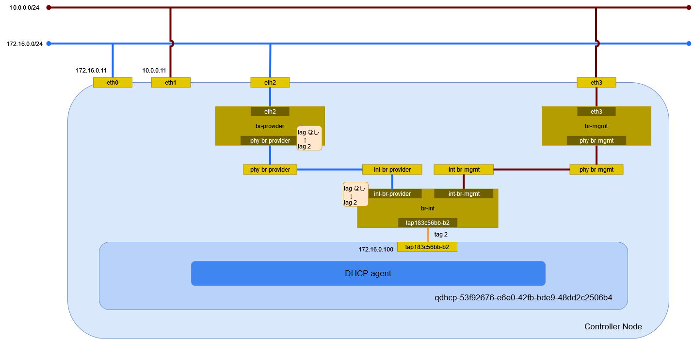

# flat ネットワーク (Open vSwitch)

Open vSwitch を利用した flat ネットワークを作成する。

## 外部ネットワークの作成

eth2 に繋がる外部ネットワークに flat ネットワークを作成する。

| オプション                  | 説明                                                                  |
| --------------------------- | --------------------------------------------------------------------- |
| --share                     | プロジェクトで共有                                                    |
| -external                   | OpenStack 外部のネットワーク                                          |
| --provider-physical-network | */etc/neutron/plugins/ml2/ml2_conf.ini* の flat_networks に指定した値 |
| --provider-physical-network | flat                                                                  |

```sh
openstack network create \
    --share \
    --external \
    --provider-physical-network provider \
    --provider-network-type flat \
    provider
```

```text
+---------------------------+--------------------------------------+
| Field                     | Value                                |
+---------------------------+--------------------------------------+
| admin_state_up            | UP                                   |
| availability_zone_hints   |                                      |
| availability_zones        |                                      |
| created_at                | 2024-05-15T11:49:01Z                 |
| description               |                                      |
| dns_domain                | None                                 |
| id                        | 53f92676-e6e0-42fb-bde9-48dd2c2506b4 |
| ipv4_address_scope        | None                                 |
| ipv6_address_scope        | None                                 |
| is_default                | None                                 |
| is_vlan_transparent       | None                                 |
| mtu                       | 1500                                 |
| name                      | provider                             |
| port_security_enabled     | True                                 |
| project_id                | be94f4411bd74f249f5e25f642209b82     |
| provider:network_type     | flat                                 |
| provider:physical_network | provider                             |
| provider:segmentation_id  | None                                 |
| qos_policy_id             | None                                 |
| revision_number           | 1                                    |
| router:external           | External                             |
| segments                  | None                                 |
| shared                    | True                                 |
| status                    | ACTIVE                               |
| subnets                   |                                      |
| tags                      |                                      |
| tenant_id                 | be94f4411bd74f249f5e25f642209b82     |
| updated_at                | 2024-05-15T11:49:01Z                 |
+---------------------------+--------------------------------------+
```

## サブネットの作成

サブネットを作成する。

| オプション        | 説明                     |
| ----------------- | ------------------------ |
| --network         | ネットワーク             |
| --allocation-pool | IP アドレス範囲          |
| --gateway         | ゲートウェイ IP アドレス |
| -subnet-range     | サブネットの CIDR        |

```sh
openstack subnet create \
    --network provider \
    --allocation-pool start=172.16.0.100,end=172.16.0.199 \
    --gateway 172.16.0.254 \
    --subnet-range 172.16.0.0/24 \
    provider
```

```text
+----------------------+--------------------------------------+
| Field                | Value                                |
+----------------------+--------------------------------------+
| allocation_pools     | 172.16.0.100-172.16.0.199            |
| cidr                 | 172.16.0.0/24                        |
| created_at           | 2024-05-15T11:49:35Z                 |
| description          |                                      |
| dns_nameservers      |                                      |
| dns_publish_fixed_ip | None                                 |
| enable_dhcp          | True                                 |
| gateway_ip           | 172.16.0.254                         |
| host_routes          |                                      |
| id                   | 02c232a9-e10c-42d6-8087-4515b46449d4 |
| ip_version           | 4                                    |
| ipv6_address_mode    | None                                 |
| ipv6_ra_mode         | None                                 |
| name                 | provider                             |
| network_id           | 53f92676-e6e0-42fb-bde9-48dd2c2506b4 |
| project_id           | be94f4411bd74f249f5e25f642209b82     |
| revision_number      | 0                                    |
| segment_id           | None                                 |
| service_types        |                                      |
| subnetpool_id        | None                                 |
| tags                 |                                      |
| updated_at           | 2024-05-15T11:49:35Z                 |
+----------------------+--------------------------------------+
```

DHCP サーバのポートの作成を確認する。

```sh
openstack port list
```

```text
+--------------------------------------+------+-------------------+-----------------------------------------------------------------------------+--------+
| ID                                   | Name | MAC Address       | Fixed IP Addresses                                                          | Status |
+--------------------------------------+------+-------------------+-----------------------------------------------------------------------------+--------+
| 183c56bb-b2ea-4a75-99b4-fb69c4147e77 |      | fa:16:3e:8f:be:c5 | ip_address='172.16.0.100', subnet_id='02c232a9-e10c-42d6-8087-4515b46449d4' | ACTIVE |
+--------------------------------------+------+-------------------+-----------------------------------------------------------------------------+--------+
```

```sh
openstack port show 183c56bb-b2ea-4a75-99b4-fb69c4147e77
```

```text
+-------------------------+---------------------------------------------------------------------------------------------------------------------------------------------+
| Field                   | Value                                                                                                                                       |
+-------------------------+---------------------------------------------------------------------------------------------------------------------------------------------+
| admin_state_up          | UP                                                                                                                                          |
| allowed_address_pairs   |                                                                                                                                             |
| binding_host_id         | controller.home.local                                                                                                                       |
| binding_profile         |                                                                                                                                             |
| binding_vif_details     | bound_drivers.0='openvswitch', bridge_name='br-int', connectivity='l2', datapath_type='system', ovs_hybrid_plug='False', port_filter='True' |
| binding_vif_type        | ovs                                                                                                                                         |
| binding_vnic_type       | normal                                                                                                                                      |
| created_at              | 2024-05-15T11:49:37Z                                                                                                                        |
| data_plane_status       | None                                                                                                                                        |
| description             |                                                                                                                                             |
| device_id               | dhcpd3377d3c-a0d1-5d71-9947-f17125c357bb-53f92676-e6e0-42fb-bde9-48dd2c2506b4                                                               |
| device_owner            | network:dhcp                                                                                                                                |
| device_profile          | None                                                                                                                                        |
| dns_assignment          | None                                                                                                                                        |
| dns_domain              | None                                                                                                                                        |
| dns_name                | None                                                                                                                                        |
| extra_dhcp_opts         |                                                                                                                                             |
| fixed_ips               | ip_address='172.16.0.100', subnet_id='02c232a9-e10c-42d6-8087-4515b46449d4'                                                                 |
| hardware_offload_type   | None                                                                                                                                        |
| hints                   |                                                                                                                                             |
| id                      | 183c56bb-b2ea-4a75-99b4-fb69c4147e77                                                                                                        |
| ip_allocation           | None                                                                                                                                        |
| mac_address             | fa:16:3e:8f:be:c5                                                                                                                           |
| name                    |                                                                                                                                             |
| network_id              | 53f92676-e6e0-42fb-bde9-48dd2c2506b4                                                                                                        |
| numa_affinity_policy    | None                                                                                                                                        |
| port_security_enabled   | False                                                                                                                                       |
| project_id              | be94f4411bd74f249f5e25f642209b82                                                                                                            |
| propagate_uplink_status | None                                                                                                                                        |
| resource_request        | None                                                                                                                                        |
| revision_number         | 3                                                                                                                                           |
| qos_network_policy_id   | None                                                                                                                                        |
| qos_policy_id           | None                                                                                                                                        |
| security_group_ids      |                                                                                                                                             |
| status                  | ACTIVE                                                                                                                                      |
| tags                    |                                                                                                                                             |
| trunk_details           | None                                                                                                                                        |
| updated_at              | 2024-05-15T11:49:39Z                                                                                                                        |
+-------------------------+---------------------------------------------------------------------------------------------------------------------------------------------+
```

## 環境の確認

Controller Node でネットワーク構成を確認する。



### ネットワーク名前空間

サブネットを作成するとネットワーク名前空間が作成される。

```sh
ip netns
```

```text
qdhcp-53f92676-e6e0-42fb-bde9-48dd2c2506b4 (id: 0)
```

### デバイス

デバイスを確認する。

```sh
ip -d link show
```

```text
1: lo: <LOOPBACK,UP,LOWER_UP> mtu 65536 qdisc noqueue state UNKNOWN mode DEFAULT group default qlen 1000
    link/loopback 00:00:00:00:00:00 brd 00:00:00:00:00:00 promiscuity 0  allmulti 0 minmtu 0 maxmtu 0 addrgenmode eui64 numtxqueues 1 numrxqueues 1 gso_max_size 65536 gso_max_segs 65535 tso_max_size 524280 tso_max_segs 65535 gro_max_size 65536
2: eth0: <BROADCAST,MULTICAST,UP,LOWER_UP> mtu 1500 qdisc mq state UP mode DEFAULT group default qlen 1000
    link/ether 00:15:5d:bf:ba:4f brd ff:ff:ff:ff:ff:ff promiscuity 0  allmulti 0 minmtu 68 maxmtu 65521 addrgenmode none numtxqueues 64 numrxqueues 64 gso_max_size 62780 gso_max_segs 65535 tso_max_size 62780 tso_max_segs 65535 gro_max_size 65536 parentbus vmbus parentdev b7c073a0-7837-4a9f-94e7-eba43ef222ef
3: eth1: <BROADCAST,MULTICAST,UP,LOWER_UP> mtu 1500 qdisc mq state UP mode DEFAULT group default qlen 1000
    link/ether 00:15:5d:bf:ba:54 brd ff:ff:ff:ff:ff:ff promiscuity 0  allmulti 0 minmtu 68 maxmtu 65521 addrgenmode none numtxqueues 64 numrxqueues 64 gso_max_size 62780 gso_max_segs 65535 tso_max_size 62780 tso_max_segs 65535 gro_max_size 65536 parentbus vmbus parentdev 0f15ccb6-3ab3-45ce-b737-a73ecf5a6339
4: eth2: <BROADCAST,MULTICAST,UP,LOWER_UP> mtu 1500 qdisc mq master ovs-system state UP mode DEFAULT group default qlen 1000
    link/ether 00:15:5d:bf:ba:55 brd ff:ff:ff:ff:ff:ff promiscuity 1  allmulti 0 minmtu 68 maxmtu 65521
    openvswitch_slave addrgenmode none numtxqueues 64 numrxqueues 64 gso_max_size 62780 gso_max_segs 65535 tso_max_size 62780 tso_max_segs 65535 gro_max_size 65536 parentbus vmbus parentdev dffbd9a0-19dd-44c1-9b46-6dfba9829d73
5: eth3: <BROADCAST,MULTICAST,UP,LOWER_UP> mtu 1500 qdisc mq master ovs-system state UP mode DEFAULT group default qlen 1000
    link/ether 00:15:5d:bf:ba:56 brd ff:ff:ff:ff:ff:ff promiscuity 1  allmulti 0 minmtu 68 maxmtu 65521
    openvswitch_slave addrgenmode none numtxqueues 64 numrxqueues 64 gso_max_size 62780 gso_max_segs 65535 tso_max_size 62780 tso_max_segs 65535 gro_max_size 65536 parentbus vmbus parentdev 31e9f926-7af1-481e-bf58-cbca38bc3cba
6: ovs-system: <BROADCAST,MULTICAST> mtu 1500 qdisc noop state DOWN mode DEFAULT group default qlen 1000
    link/ether 9e:20:50:3f:63:c4 brd ff:ff:ff:ff:ff:ff promiscuity 1  allmulti 0 minmtu 68 maxmtu 65535
    openvswitch addrgenmode eui64 numtxqueues 1 numrxqueues 1 gso_max_size 65536 gso_max_segs 65535 tso_max_size 65536 tso_max_segs 65535 gro_max_size 65536
7: br-provider: <BROADCAST,MULTICAST,UP,LOWER_UP> mtu 1500 qdisc noqueue state UNKNOWN mode DEFAULT group default qlen 1000
    link/ether 00:15:5d:bf:ba:55 brd ff:ff:ff:ff:ff:ff promiscuity 1  allmulti 0 minmtu 68 maxmtu 65535
    openvswitch addrgenmode none numtxqueues 1 numrxqueues 1 gso_max_size 65536 gso_max_segs 65535 tso_max_size 65536 tso_max_segs 65535 gro_max_size 65536
8: br-mgmt: <BROADCAST,MULTICAST,UP,LOWER_UP> mtu 1500 qdisc noqueue state UNKNOWN mode DEFAULT group default qlen 1000
    link/ether 00:15:5d:bf:ba:56 brd ff:ff:ff:ff:ff:ff promiscuity 1  allmulti 0 minmtu 68 maxmtu 65535
    openvswitch addrgenmode none numtxqueues 1 numrxqueues 1 gso_max_size 65536 gso_max_segs 65535 tso_max_size 65536 tso_max_segs 65535 gro_max_size 65536
10: br-int: <BROADCAST,MULTICAST,UP,LOWER_UP> mtu 1500 qdisc noqueue state UNKNOWN mode DEFAULT group default qlen 1000
    link/ether 4a:73:de:e4:cd:4f brd ff:ff:ff:ff:ff:ff promiscuity 1  allmulti 0 minmtu 68 maxmtu 65535
    openvswitch addrgenmode none numtxqueues 1 numrxqueues 1 gso_max_size 65536 gso_max_segs 65535 tso_max_size 65536 tso_max_segs 65535 gro_max_size 65536
```

ネットワーク名前空間内のデバイスを確認する。

```sh
ip netns exec qdhcp-53f92676-e6e0-42fb-bde9-48dd2c2506b4 ip -d link show
```

```text
1: lo: <LOOPBACK,UP,LOWER_UP> mtu 65536 qdisc noqueue state UNKNOWN mode DEFAULT group default qlen 1000
    link/loopback 00:00:00:00:00:00 brd 00:00:00:00:00:00 promiscuity 0  allmulti 0 minmtu 0 maxmtu 0 addrgenmode eui64 numtxqueues 1 numrxqueues 1 gso_max_size 65536 gso_max_segs 65535 tso_max_size 524280 tso_max_segs 65535 gro_max_size 65536
11: tap183c56bb-b2: <BROADCAST,MULTICAST,UP,LOWER_UP> mtu 1500 qdisc noqueue state UNKNOWN mode DEFAULT group default qlen 1000
    link/ether fa:16:3e:8f:be:c5 brd ff:ff:ff:ff:ff:ff promiscuity 1  allmulti 0 minmtu 68 maxmtu 65535
    openvswitch addrgenmode eui64 numtxqueues 1 numrxqueues 1 gso_max_size 65536 gso_max_segs 65535 tso_max_size 65536 tso_max_segs 65535 gro_max_size 65536
```

### Open vSwitch

ブリッジを確認する。

```sh
ovs-vsctl show
```

```text
2a1ab795-d59f-4a33-a5a1-1fb4c942dce4
    Manager "ptcp:6640:127.0.0.1"
        is_connected: true
    Bridge br-provider
        Controller "tcp:127.0.0.1:6633"
            is_connected: true
        fail_mode: secure
        datapath_type: system
        Port phy-br-provider
            Interface phy-br-provider
                type: patch
                options: {peer=int-br-provider}
        Port eth2
            Interface eth2
                type: system
    Bridge br-mgmt
        Controller "tcp:127.0.0.1:6633"
            is_connected: true
        fail_mode: secure
        datapath_type: system
        Port phy-br-mgmt
            Interface phy-br-mgmt
                type: patch
                options: {peer=int-br-mgmt}
        Port eth3
            Interface eth3
                type: system
    Bridge br-int
        Controller "tcp:127.0.0.1:6633"
            is_connected: true
        fail_mode: secure
        datapath_type: system
        Port br-int
            Interface br-int
                type: internal
        Port tap183c56bb-b2
            tag: 2
            Interface tap183c56bb-b2
                type: internal
        Port int-br-provider
            Interface int-br-provider
                type: patch
                options: {peer=phy-br-provider}
        Port int-br-mgmt
            Interface int-br-mgmt
                type: patch
                options: {peer=phy-br-mgmt}
    ovs_version: "3.3.1"
```

データパスを確認する。

```sh
ovs-dpctl show
```

```text
system@ovs-system:
  lookups: hit:44 missed:20 lost:0
  flows: 1
  masks: hit:61 total:1 hit/pkt:0.95
  cache: hit:29 hit-rate:45.31%
  caches:
    masks-cache: size:256
  port 0: ovs-system (internal)
  port 1: br-provider (internal)
  port 2: eth2
  port 3: eth3
  port 4: br-mgmt (internal)
  port 5: tap183c56bb-b2 (internal)
  port 6: br-int (internal)
```

ブリッジ br-provider のフローのエントリを確認する。

```sh
ovs-ofctl dump-flows br-provider
```

```text
 cookie=0xbf3c5202337ce111, duration=220.693s, table=0, n_packets=6, n_bytes=440, priority=4,in_port="phy-br-provider",dl_vlan=2 actions=strip_vlan,NORMAL
 cookie=0xbf3c5202337ce111, duration=224.943s, table=0, n_packets=0, n_bytes=0, priority=2,in_port="phy-br-provider" actions=drop
 cookie=0xbf3c5202337ce111, duration=224.946s, table=0, n_packets=18, n_bytes=2380, priority=0 actions=NORMAL
```

ブリッジ br-mgmt のフローのエントリを確認する。

```sh
ovs-ofctl dump-flows br-mgmt
```

```text
 cookie=0x99f23c855fe96a0d, duration=237.770s, table=0, n_packets=23, n_bytes=2603, priority=2,in_port="phy-br-mgmt" actions=drop
 cookie=0x99f23c855fe96a0d, duration=237.776s, table=0, n_packets=26, n_bytes=3328, priority=0 actions=NORMAL
```

ブリッジ br-int のフローのエントリを確認する。

```sh
ovs-ofctl dump-flows br-int
```

```text
 cookie=0x6e84e3a21375ab76, duration=258.512s, table=0, n_packets=0, n_bytes=0, priority=65535,dl_vlan=4095 actions=drop
 cookie=0x6e84e3a21375ab76, duration=254.248s, table=0, n_packets=21, n_bytes=3031, priority=3,in_port="int-br-provider",vlan_tci=0x0000/0x1fff actions=mod_vlan_vid:2,resubmit(,58)
 cookie=0x6e84e3a21375ab76, duration=258.501s, table=0, n_packets=1, n_bytes=217, priority=2,in_port="int-br-provider" actions=drop
 cookie=0x6e84e3a21375ab76, duration=258.487s, table=0, n_packets=30, n_bytes=4196, priority=2,in_port="int-br-mgmt" actions=drop
 cookie=0x6e84e3a21375ab76, duration=258.516s, table=0, n_packets=11, n_bytes=866, priority=0 actions=resubmit(,58)
 cookie=0x6e84e3a21375ab76, duration=258.517s, table=23, n_packets=0, n_bytes=0, priority=0 actions=drop
 cookie=0x6e84e3a21375ab76, duration=258.513s, table=24, n_packets=0, n_bytes=0, priority=0 actions=drop
 cookie=0x6e84e3a21375ab76, duration=258.510s, table=30, n_packets=0, n_bytes=0, priority=0 actions=resubmit(,58)
 cookie=0x6e84e3a21375ab76, duration=258.508s, table=31, n_packets=0, n_bytes=0, priority=0 actions=resubmit(,58)
 cookie=0x6e84e3a21375ab76, duration=258.515s, table=58, n_packets=32, n_bytes=3897, priority=0 actions=resubmit(,60)
 cookie=0x6e84e3a21375ab76, duration=180.585s, table=60, n_packets=5, n_bytes=350, priority=100,in_port="tap183c56bb-b2" actions=load:0x3->NXM_NX_REG5[],load:0x2->NXM_NX_REG6[],resubmit(,73)
 cookie=0x6e84e3a21375ab76, duration=258.514s, table=60, n_packets=27, n_bytes=3547, priority=3 actions=NORMAL
 cookie=0x6e84e3a21375ab76, duration=258.511s, table=62, n_packets=0, n_bytes=0, priority=3 actions=NORMAL
 cookie=0x6e84e3a21375ab76, duration=255.959s, table=71, n_packets=0, n_bytes=0, priority=110,ct_state=+trk actions=ct_clear,resubmit(,71)
 cookie=0x6e84e3a21375ab76, duration=256.024s, table=71, n_packets=0, n_bytes=0, priority=0 actions=drop
 cookie=0x6e84e3a21375ab76, duration=256.011s, table=72, n_packets=0, n_bytes=0, priority=0 actions=drop
 cookie=0x6e84e3a21375ab76, duration=252.668s, table=73, n_packets=0, n_bytes=0, priority=80,reg5=0x5 actions=resubmit(,94)
 cookie=0x6e84e3a21375ab76, duration=180.585s, table=73, n_packets=5, n_bytes=350, priority=80,reg5=0x3 actions=resubmit(,94)
 cookie=0x6e84e3a21375ab76, duration=255.992s, table=73, n_packets=0, n_bytes=0, priority=0 actions=drop
 cookie=0x6e84e3a21375ab76, duration=255.980s, table=81, n_packets=0, n_bytes=0, priority=0 actions=drop
 cookie=0x6e84e3a21375ab76, duration=255.969s, table=82, n_packets=0, n_bytes=0, priority=0 actions=drop
 cookie=0x6e84e3a21375ab76, duration=255.934s, table=91, n_packets=0, n_bytes=0, priority=1 actions=resubmit(,94)
 cookie=0x6e84e3a21375ab76, duration=255.921s, table=92, n_packets=0, n_bytes=0, priority=0 actions=drop
 cookie=0x6e84e3a21375ab76, duration=255.900s, table=93, n_packets=0, n_bytes=0, priority=0 actions=drop
 cookie=0x6e84e3a21375ab76, duration=255.949s, table=94, n_packets=5, n_bytes=350, priority=1 actions=NORMAL
```

### イーサネット

ネットワーク名前空間内のイーサネットの情報を確認する。
169.254.169.254 は Metadata agent が使用する。

```sh
ip netns exec qdhcp-53f92676-e6e0-42fb-bde9-48dd2c2506b4 ip addr show
```

```text
1: lo: <LOOPBACK,UP,LOWER_UP> mtu 65536 qdisc noqueue state UNKNOWN group default qlen 1000
    link/loopback 00:00:00:00:00:00 brd 00:00:00:00:00:00
    inet 127.0.0.1/8 scope host lo
       valid_lft forever preferred_lft forever
    inet6 ::1/128 scope host
       valid_lft forever preferred_lft forever
11: tap183c56bb-b2: <BROADCAST,MULTICAST,UP,LOWER_UP> mtu 1500 qdisc noqueue state UNKNOWN group default qlen 1000
    link/ether fa:16:3e:8f:be:c5 brd ff:ff:ff:ff:ff:ff
    inet 169.254.169.254/32 brd 169.254.169.254 scope global tap183c56bb-b2
       valid_lft forever preferred_lft forever
    inet 172.16.0.100/24 brd 172.16.0.255 scope global tap183c56bb-b2
       valid_lft forever preferred_lft forever
    inet6 fe80::f816:3eff:fe8f:bec5/64 scope link
       valid_lft forever preferred_lft forever
```

ルーティングを確認する。

```sh
ip netns exec qdhcp-53f92676-e6e0-42fb-bde9-48dd2c2506b4 ip route
```

```text
default via 172.16.0.254 dev tap183c56bb-b2 proto static
172.16.0.0/24 dev tap183c56bb-b2 proto kernel scope link src 172.16.0.100
```

待ち受けているポートを確認する。

```sh
ip netns exec qdhcp-53f92676-e6e0-42fb-bde9-48dd2c2506b4 ss -ano -4
```

```text
Netid           State            Recv-Q            Send-Q                         Local Address:Port                       Peer Address:Port           Process
udp             UNCONN           0                 0                                  127.0.0.1:53                              0.0.0.0:*
udp             UNCONN           0                 0                            169.254.169.254:53                              0.0.0.0:*
udp             UNCONN           0                 0                               172.16.0.100:53                              0.0.0.0:*
udp             UNCONN           0                 0                                    0.0.0.0:67                              0.0.0.0:*
tcp             LISTEN           0                 32                              172.16.0.100:53                              0.0.0.0:*
tcp             LISTEN           0                 32                                 127.0.0.1:53                              0.0.0.0:*
tcp             LISTEN           0                 1024                         169.254.169.254:80                              0.0.0.0:*
tcp             LISTEN           0                 32                           169.254.169.254:53                              0.0.0.0:*
```

### DHCP agent

dnsmasq のプロセスを確認する。

```sh
ps ax | grep dnsmasq
```

以下が動作していることが確認できる。

```sh
dnsmasq \
    --no-hosts \
    --no-resolv \
    --pid-file=/var/lib/neutron/dhcp/53f92676-e6e0-42fb-bde9-48dd2c2506b4/pid \
    --dhcp-hostsfile=/var/lib/neutron/dhcp/53f92676-e6e0-42fb-bde9-48dd2c2506b4/host \
    --addn-hosts=/var/lib/neutron/dhcp/53f92676-e6e0-42fb-bde9-48dd2c2506b4/addn_hosts \
    --dhcp-optsfile=/var/lib/neutron/dhcp/53f92676-e6e0-42fb-bde9-48dd2c2506b4/opts \
    --dhcp-leasefile=/var/lib/neutron/dhcp/53f92676-e6e0-42fb-bde9-48dd2c2506b4/leases \
    --dhcp-match=set:ipxe,175 \
    --dhcp-userclass=set:ipxe6,iPXE \
    --local-service \
    --bind-dynamic \
    --dhcp-range=set:subnet-02c232a9-e10c-42d6-8087-4515b46449d4,172.16.0.0,static,255.255.255.0,86400s \
    --dhcp-option-force=option:mtu,1500 \
    --dhcp-lease-max=256 \
    --conf-file=/dev/null \
    --domain=openstacklocal
```

使用しているインターフェイスを確認する。

```sh
cat /var/lib/neutron/dhcp/53f92676-e6e0-42fb-bde9-48dd2c2506b4/interface
```

```text
tap183c56bb-b2
```
