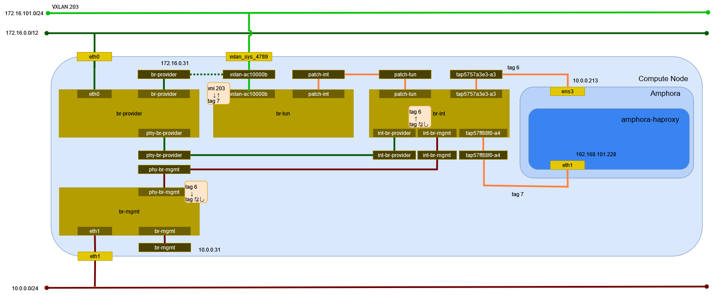

# ロードバランサ (Open vSwitch)

## 前提条件

* [](../network/ovs_router) を作成していること。
* [](../instance/ovs_vxlan.md) を 2 つ作成していること。

## ロードバランサの作成

```{tip}
myuser で実行
```

ロードバランサのサービスを提供するサブネット selfservice を指定してロードバランサを作成する。

```sh
openstack loadbalancer create \
    --name lb \
    --vip-subnet-id selfservice
```

```text
+---------------------+--------------------------------------+
| Field               | Value                                |
+---------------------+--------------------------------------+
| admin_state_up      | True                                 |
| availability_zone   | None                                 |
| created_at          | 2024-05-18T01:35:24                  |
| description         |                                      |
| flavor_id           | None                                 |
| id                  | d3a07dda-a1b9-4a42-85f5-55f1358b8eed |
| listeners           |                                      |
| name                | lb                                   |
| operating_status    | OFFLINE                              |
| pools               |                                      |
| project_id          | bccf406c045d401b91ba5c7552a124ae     |
| provider            | amphora                              |
| provisioning_status | PENDING_CREATE                       |
| updated_at          | None                                 |
| vip_address         | 192.168.101.67                       |
| vip_network_id      | 6ee86f5e-5d22-4c00-a2cd-6622ec856e17 |
| vip_port_id         | f1d4c8e9-0dce-4b97-acfc-094d5b77f9c3 |
| vip_qos_policy_id   | None                                 |
| vip_subnet_id       | 765053a1-4543-4732-a9ac-47065f945e9f |
| vip_vnic_type       | normal                               |
| tags                |                                      |
| additional_vips     | []                                   |
+---------------------+--------------------------------------+
```

イメージ amphora からインスタンスが作成される。

```{tip}
octavia で実行
```

```sh
openstack server list
```

```text
+--------------------------------------+----------------------------------------------+--------+-----------------+---------------------+---------+
| ID                                   | Name                                         | Status | Networks        | Image               | Flavor  |
+--------------------------------------+----------------------------------------------+--------+-----------------+---------------------+---------+
| 3cf00c5f-e813-4789-a4bc-114bf24bb2b0 | amphora-d22c0427-7b81-485e-939b-0a5eb9f33d4b | ACTIVE | mgmt=10.0.0.205 | amphora-x64-haproxy | amphora |
+--------------------------------------+----------------------------------------------+--------+-----------------+---------------------+---------+
```

しばらく時間が経過するとロードバランサのサービスが機能する。

```sh
curl -E /etc/octavia/certs/private/client.cert-and-key.pem -ksS https://10.0.0.205:9443
```

```json
{"api_version":"1.0"}
```

*/etc/octavia/octavia.conf* に指定したネットワークと `openstack loadbalancer create` に指定したネットワークに
接続された構成となることを確認する。

```sh
openstack server list
```

```text
+--------------------------------------+----------------------------------------------+--------+----------------------------------------------+---------------------+---------+
| ID                                   | Name                                         | Status | Networks                                     | Image               | Flavor  |
+--------------------------------------+----------------------------------------------+--------+----------------------------------------------+---------------------+---------+
| 3cf00c5f-e813-4789-a4bc-114bf24bb2b0 | amphora-d22c0427-7b81-485e-939b-0a5eb9f33d4b | ACTIVE | mgmt=10.0.0.205; selfservice=192.168.101.149 | amphora-x64-haproxy | amphora |
+--------------------------------------+----------------------------------------------+--------+----------------------------------------------+---------------------+---------+
```

ロードバランサが作成されたことを確認する。

```sh
openstack loadbalancer list
```

```text
+--------------------------------------+------+----------------------------------+----------------+---------------------+------------------+----------+
| id                                   | name | project_id                       | vip_address    | provisioning_status | operating_status | provider |
+--------------------------------------+------+----------------------------------+----------------+---------------------+------------------+----------+
| d3a07dda-a1b9-4a42-85f5-55f1358b8eed | lb   | bccf406c045d401b91ba5c7552a124ae | 192.168.101.67 | ACTIVE              | OFFLINE          | amphora  |
+--------------------------------------+------+----------------------------------+----------------+---------------------+------------------+----------+
```

## 環境の確認

Compute Node でネットワーク構成を確認する。



### インスタンス

amphora のインスタンスを確認する。

```sh
virsh list
```

```text
 Id   名前                状態
----------------------------------
 2    instance-00000007   実行中
```

ネットワークインターフェイスの設定を確認する。

```sh
virsh dumpxml 2 | sed -n -e '/<interface/,/<\/interface>/ { p }'
```

```xml
<interface type='ethernet'>
  <mac address='fa:16:3e:6d:9f:87'/>
  <target dev='tap13abc033-93'/>
  <model type='virtio'/>
  <driver name='qemu'/>
  <mtu size='1500'/>
  <alias name='net0'/>
  <address type='pci' domain='0x0000' bus='0x00' slot='0x03' function='0x0'/>
</interface>
<interface type='ethernet'>
  <mac address='fa:16:3e:9c:98:af'/>
  <target dev='tap9113df4c-ca'/>
  <model type='virtio'/>
  <driver name='qemu'/>
  <mtu size='1450'/>
  <alias name='net1'/>
  <address type='pci' domain='0x0000' bus='0x00' slot='0x07' function='0x0'/>
</interface>
```

### ネットワーク

#### ネットワーク名前空間

amphora インスタンスのネットワーク名前空間を確認する。

```sh
ssh -i ./demo_rsa cloud-user@10.0.0.205 ip netns
```

```text
amphora-haproxy (id: 0)
```

#### デバイス

Compute Node のデバイスを確認する。

```sh
ip -d link show
```

```text
1: lo: <LOOPBACK,UP,LOWER_UP> mtu 65536 qdisc noqueue state UNKNOWN mode DEFAULT group default qlen 1000
    link/loopback 00:00:00:00:00:00 brd 00:00:00:00:00:00 promiscuity 0  allmulti 0 minmtu 0 maxmtu 0 addrgenmode eui64 numtxqueues 1 numrxqueues 1 gso_max_size 65536 gso_max_segs 65535 tso_max_size 524280 tso_max_segs 65535 gro_max_size 65536
2: eth0: <BROADCAST,MULTICAST,UP,LOWER_UP> mtu 1500 qdisc mq state UP mode DEFAULT group default qlen 1000
    link/ether 00:15:5d:bf:ba:50 brd ff:ff:ff:ff:ff:ff promiscuity 0  allmulti 0 minmtu 68 maxmtu 65521 addrgenmode none numtxqueues 64 numrxqueues 64 gso_max_size 62780 gso_max_segs 65535 tso_max_size 62780 tso_max_segs 65535 gro_max_size 65536 parentbus vmbus parentdev f4fd36cf-d20d-4c23-83bb-e1b5cc9fbfbc
3: eth1: <BROADCAST,MULTICAST,UP,LOWER_UP> mtu 1500 qdisc mq state UP mode DEFAULT group default qlen 1000
    link/ether 00:15:5d:bf:ba:57 brd ff:ff:ff:ff:ff:ff promiscuity 0  allmulti 0 minmtu 68 maxmtu 65521 addrgenmode none numtxqueues 64 numrxqueues 64 gso_max_size 62780 gso_max_segs 65535 tso_max_size 62780 tso_max_segs 65535 gro_max_size 65536 parentbus vmbus parentdev 1e1fc9b9-f159-4473-9410-cf7db6750e26
4: eth2: <BROADCAST,MULTICAST,UP,LOWER_UP> mtu 1500 qdisc mq master ovs-system state UP mode DEFAULT group default qlen 1000
    link/ether 00:15:5d:bf:ba:58 brd ff:ff:ff:ff:ff:ff promiscuity 1  allmulti 0 minmtu 68 maxmtu 65521
    openvswitch_slave addrgenmode none numtxqueues 64 numrxqueues 64 gso_max_size 62780 gso_max_segs 65535 tso_max_size 62780 tso_max_segs 65535 gro_max_size 65536 parentbus vmbus parentdev fb193242-70ac-437d-9008-4382b02d2a70
5: eth3: <BROADCAST,MULTICAST,UP,LOWER_UP> mtu 1500 qdisc mq master ovs-system state UP mode DEFAULT group default qlen 1000
    link/ether 00:15:5d:bf:ba:59 brd ff:ff:ff:ff:ff:ff promiscuity 1  allmulti 0 minmtu 68 maxmtu 65521
    openvswitch_slave addrgenmode none numtxqueues 64 numrxqueues 64 gso_max_size 62780 gso_max_segs 65535 tso_max_size 62780 tso_max_segs 65535 gro_max_size 65536 parentbus vmbus parentdev 6de0f76b-b7bc-45ba-9087-d8bee9131e1c
6: ovs-system: <BROADCAST,MULTICAST> mtu 1500 qdisc noop state DOWN mode DEFAULT group default qlen 1000
    link/ether 16:4e:c4:be:4e:24 brd ff:ff:ff:ff:ff:ff promiscuity 1  allmulti 0 minmtu 68 maxmtu 65535
    openvswitch addrgenmode eui64 numtxqueues 1 numrxqueues 1 gso_max_size 65536 gso_max_segs 65535 tso_max_size 65536 tso_max_segs 65535 gro_max_size 65536
7: br-tun: <BROADCAST,MULTICAST,UP,LOWER_UP> mtu 1500 qdisc noqueue state UNKNOWN mode DEFAULT group default qlen 1000
    link/ether b2:86:16:72:d5:43 brd ff:ff:ff:ff:ff:ff promiscuity 1  allmulti 0 minmtu 68 maxmtu 65535
    openvswitch addrgenmode none numtxqueues 1 numrxqueues 1 gso_max_size 65536 gso_max_segs 65535 tso_max_size 65536 tso_max_segs 65535 gro_max_size 65536
8: vxlan_sys_4789: <BROADCAST,MULTICAST,UP,LOWER_UP> mtu 65000 qdisc noqueue master ovs-system state UNKNOWN mode DEFAULT group default qlen 1000
    link/ether 5a:94:78:f8:ac:21 brd ff:ff:ff:ff:ff:ff promiscuity 1  allmulti 0 minmtu 68 maxmtu 65535
    vxlan external id 0 srcport 0 0 dstport 4789 nolearning ttl auto ageing 300 udpcsum noudp6zerocsumtx udp6zerocsumrx
    openvswitch_slave addrgenmode eui64 numtxqueues 1 numrxqueues 1 gso_max_size 65536 gso_max_segs 65535 tso_max_size 65536 tso_max_segs 65535 gro_max_size 65536
9: br-provider: <BROADCAST,MULTICAST,UP,LOWER_UP> mtu 1500 qdisc noqueue state UNKNOWN mode DEFAULT group default qlen 1000
    link/ether 00:15:5d:bf:ba:58 brd ff:ff:ff:ff:ff:ff promiscuity 1  allmulti 0 minmtu 68 maxmtu 65535
    openvswitch addrgenmode none numtxqueues 1 numrxqueues 1 gso_max_size 65536 gso_max_segs 65535 tso_max_size 65536 tso_max_segs 65535 gro_max_size 65536
10: br-mgmt: <BROADCAST,MULTICAST,UP,LOWER_UP> mtu 1500 qdisc noqueue state UNKNOWN mode DEFAULT group default qlen 1000
    link/ether 00:15:5d:bf:ba:59 brd ff:ff:ff:ff:ff:ff promiscuity 1  allmulti 0 minmtu 68 maxmtu 65535
    openvswitch addrgenmode none numtxqueues 1 numrxqueues 1 gso_max_size 65536 gso_max_segs 65535 tso_max_size 65536 tso_max_segs 65535 gro_max_size 65536
11: br-int: <BROADCAST,MULTICAST,UP,LOWER_UP> mtu 1450 qdisc noqueue state UNKNOWN mode DEFAULT group default qlen 1000
    link/ether 42:f0:8b:66:da:47 brd ff:ff:ff:ff:ff:ff promiscuity 1  allmulti 0 minmtu 68 maxmtu 65535
    openvswitch addrgenmode none numtxqueues 1 numrxqueues 1 gso_max_size 65536 gso_max_segs 65535 tso_max_size 65536 tso_max_segs 65535 gro_max_size 65536
12: tap648437e1-0d: <BROADCAST,MULTICAST,UP,LOWER_UP> mtu 1450 qdisc noqueue master ovs-system state UNKNOWN mode DEFAULT group default qlen 1000
    link/ether fe:16:3e:61:21:c6 brd ff:ff:ff:ff:ff:ff promiscuity 1  allmulti 0 minmtu 68 maxmtu 65521
    tun type tap pi off vnet_hdr on persist off
    openvswitch_slave addrgenmode eui64 numtxqueues 1 numrxqueues 1 gso_max_size 65536 gso_max_segs 65535 tso_max_size 65536 tso_max_segs 65535 gro_max_size 65536
13: tap13abc033-93: <BROADCAST,MULTICAST,UP,LOWER_UP> mtu 1500 qdisc noqueue master ovs-system state UNKNOWN mode DEFAULT group default qlen 1000
    link/ether fe:16:3e:6d:9f:87 brd ff:ff:ff:ff:ff:ff promiscuity 1  allmulti 0 minmtu 68 maxmtu 65521
    tun type tap pi off vnet_hdr on persist off
    openvswitch_slave addrgenmode eui64 numtxqueues 1 numrxqueues 1 gso_max_size 65536 gso_max_segs 65535 tso_max_size 65536 tso_max_segs 65535 gro_max_size 65536
14: tap9113df4c-ca: <BROADCAST,MULTICAST,UP,LOWER_UP> mtu 1450 qdisc noqueue master ovs-system state UNKNOWN mode DEFAULT group default qlen 1000
    link/ether fe:16:3e:9c:98:af brd ff:ff:ff:ff:ff:ff promiscuity 1  allmulti 0 minmtu 68 maxmtu 65521
    tun type tap pi off vnet_hdr on persist off
    openvswitch_slave addrgenmode eui64 numtxqueues 1 numrxqueues 1 gso_max_size 65536 gso_max_segs 65535 tso_max_size 65536 tso_max_segs 65535 gro_max_size 65536
```

amphora インスタンスのデバイスを確認する。

```sh
ssh -i ./demo_rsa cloud-user@10.0.0.205 ip -d link show
```

```text
1: lo: <LOOPBACK,UP,LOWER_UP> mtu 65536 qdisc noqueue state UNKNOWN mode DEFAULT group default qlen 1000
    link/loopback 00:00:00:00:00:00 brd 00:00:00:00:00:00 promiscuity 0  allmulti 0 minmtu 0 maxmtu 0 addrgenmode eui64 numtxqueues 1 numrxqueues 1 gso_max_size 65536 gso_max_segs 65535 tso_max_size 524280 tso_max_segs 65535 gro_max_size 65536
2: ens3: <BROADCAST,MULTICAST,UP,LOWER_UP> mtu 1500 qdisc fq_codel state UP mode DEFAULT group default qlen 1000
    link/ether fa:16:3e:6d:9f:87 brd ff:ff:ff:ff:ff:ff promiscuity 0  allmulti 0 minmtu 68 maxmtu 1500 addrgenmode eui64 numtxqueues 1 numrxqueues 1 gso_max_size 65536 gso_max_segs 65535 tso_max_size 65536 tso_max_segs 65535 gro_max_size 65536 parentbus virtio parentdev virtio0
    altname enp0s3
```

ネットワーク名前空間内のデバイスを確認する。

```sh
ssh -i ./demo_rsa cloud-user@10.0.0.205 sudo ip netns exec amphora-haproxy ip -d link show
```

```text
1: lo: <LOOPBACK> mtu 65536 qdisc noop state DOWN mode DEFAULT group default qlen 1000
    link/loopback 00:00:00:00:00:00 brd 00:00:00:00:00:00 promiscuity 0  allmulti 0 minmtu 0 maxmtu 0 addrgenmode eui64 numtxqueues 1 numrxqueues 1 gso_max_size 65536 gso_max_segs 65535 tso_max_size 524280 tso_max_segs 65535 gro_max_size 65536
3: eth1: <BROADCAST,MULTICAST,UP,LOWER_UP> mtu 1450 qdisc fq_codel state UP mode DEFAULT group default qlen 1000
    link/ether fa:16:3e:9c:98:af brd ff:ff:ff:ff:ff:ff promiscuity 0  allmulti 0 minmtu 68 maxmtu 1450 addrgenmode eui64 numtxqueues 1 numrxqueues 1 gso_max_size 65536 gso_max_segs 65535 tso_max_size 65536 tso_max_segs 65535 gro_max_size 65536 parentbus virtio parentdev virtio4
    altname enp0s7
```

#### Open vSwitch

ブリッジを確認する。

```sh
ovs-vsctl show
```

```text
698493db-95ef-4c31-b419-56b3d4096f2b
    Manager "ptcp:6640:127.0.0.1"
        is_connected: true
    Bridge br-mgmt
        Controller "tcp:127.0.0.1:6633"
            is_connected: true
        fail_mode: secure
        datapath_type: system
        Port phy-br-mgmt
            Interface phy-br-mgmt
                type: patch
                options: {peer=int-br-mgmt}
        Port eth3
            Interface eth3
                type: system
    Bridge br-int
        Controller "tcp:127.0.0.1:6633"
            is_connected: true
        fail_mode: secure
        datapath_type: system
        Port patch-tun
            Interface patch-tun
                type: patch
                options: {peer=patch-int}
        Port tap9113df4c-ca
            tag: 2
            Interface tap9113df4c-ca
        Port tap0ab9a23c-99
            tag: 1
            Interface tap0ab9a23c-99
                error: "could not open network device tap0ab9a23c-99 (No such device)"
        Port br-int
            Interface br-int
                type: internal
        Port int-br-mgmt
            Interface int-br-mgmt
                type: patch
                options: {peer=phy-br-mgmt}
        Port tap13abc033-93
            tag: 4
            Interface tap13abc033-93
        Port tap635485ff-6c
            tag: 3
            Interface tap635485ff-6c
                error: "could not open network device tap635485ff-6c (No such device)"
        Port tap648437e1-0d
            tag: 2
            Interface tap648437e1-0d
        Port int-br-provider
            Interface int-br-provider
                type: patch
                options: {peer=phy-br-provider}
    Bridge br-tun
        Controller "tcp:127.0.0.1:6633"
            is_connected: true
        fail_mode: secure
        datapath_type: system
        Port patch-int
            Interface patch-int
                type: patch
                options: {peer=patch-tun}
        Port br-tun
            Interface br-tun
                type: internal
        Port vxlan-ac10000b
            Interface vxlan-ac10000b
                type: vxlan
                options: {df_default="true", egress_pkt_mark="0", in_key=flow, local_ip="172.16.0.31", out_key=flow, remote_ip="172.16.0.11"}
    Bridge br-provider
        Controller "tcp:127.0.0.1:6633"
            is_connected: true
        fail_mode: secure
        datapath_type: system
        Port eth2
            Interface eth2
                type: system
        Port phy-br-provider
            Interface phy-br-provider
                type: patch
                options: {peer=int-br-provider}
    ovs_version: "3.3.1"
```

データパスを確認する。

```sh
ovs-dpctl show
```

```text
system@ovs-system:
  lookups: hit:1830 missed:401 lost:0
  flows: 2
  masks: hit:5341 total:2 hit/pkt:2.39
  cache: hit:1031 hit-rate:46.21%
  caches:
    masks-cache: size:256
  port 0: ovs-system (internal)
  port 1: br-tun (internal)
  port 2: vxlan_sys_4789 (vxlan: packet_type=ptap)
  port 3: br-provider (internal)
  port 4: eth2
  port 5: eth3
  port 6: br-mgmt (internal)
  port 7: br-int (internal)
  port 8: tap648437e1-0d
  port 9: tap13abc033-93
  port 10: tap9113df4c-ca
```

ブリッジ br-provider のフローのエントリを確認する。

```sh
ovs-ofctl dump-flows br-provider
```

```text
 cookie=0x855f3408e599b10a, duration=9441.187s, table=0, n_packets=0, n_bytes=0, priority=4,in_port="phy-br-provider",dl_vlan=1 actions=mod_vlan_vid:100,NORMAL
 cookie=0x855f3408e599b10a, duration=9441.154s, table=0, n_packets=0, n_bytes=0, priority=4,in_port="phy-br-provider",dl_vlan=3 actions=strip_vlan,NORMAL
 cookie=0x855f3408e599b10a, duration=9445.708s, table=0, n_packets=435, n_bytes=53620, priority=2,in_port="phy-br-provider" actions=drop
 cookie=0x855f3408e599b10a, duration=9445.712s, table=0, n_packets=430, n_bytes=76432, priority=0 actions=NORMAL
```

ブリッジ br-mgmt のフローのエントリを確認する。

```sh
ovs-ofctl dump-flows br-mgmt
```

```text
 cookie=0xc39ede03032adeb4, duration=900.788s, table=0, n_packets=255, n_bytes=48530, priority=4,in_port="phy-br-mgmt",dl_vlan=4 actions=strip_vlan,NORMAL
 cookie=0xc39ede03032adeb4, duration=9459.182s, table=0, n_packets=582, n_bytes=90986, priority=2,in_port="phy-br-mgmt" actions=drop
 cookie=0xc39ede03032adeb4, duration=9459.187s, table=0, n_packets=712, n_bytes=115668, priority=0 actions=NORMAL
```

ブリッジ br-int のフローのエントリを確認する。

```sh
ovs-ofctl dump-flows br-int
```

```text
 cookie=0x50ebd87957cf5c44, duration=9471.474s, table=0, n_packets=0, n_bytes=0, priority=65535,dl_vlan=4095 actions=drop
 cookie=0x50ebd87957cf5c44, duration=9466.926s, table=0, n_packets=9, n_bytes=666, priority=3,in_port="int-br-provider",dl_vlan=100 actions=mod_vlan_vid:1,resubmit(,58)
 cookie=0x50ebd87957cf5c44, duration=9466.893s, table=0, n_packets=419, n_bytes=75330, priority=3,in_port="int-br-provider",vlan_tci=0x0000/0x1fff actions=mod_vlan_vid:3,resubmit(,58)
 cookie=0x50ebd87957cf5c44, duration=913.021s, table=0, n_packets=312, n_bytes=43108, priority=3,in_port="int-br-mgmt",vlan_tci=0x0000/0x1fff actions=mod_vlan_vid:4,resubmit(,58)
 cookie=0x50ebd87957cf5c44, duration=9471.449s, table=0, n_packets=2, n_bytes=436, priority=2,in_port="int-br-provider" actions=drop
 cookie=0x50ebd87957cf5c44, duration=9471.424s, table=0, n_packets=400, n_bytes=72560, priority=2,in_port="int-br-mgmt" actions=drop
 cookie=0x50ebd87957cf5c44, duration=9471.480s, table=0, n_packets=519, n_bytes=77937, priority=0 actions=resubmit(,58)
 cookie=0x50ebd87957cf5c44, duration=9471.482s, table=23, n_packets=0, n_bytes=0, priority=0 actions=drop
 cookie=0x50ebd87957cf5c44, duration=9471.476s, table=24, n_packets=0, n_bytes=0, priority=0 actions=drop
 cookie=0x50ebd87957cf5c44, duration=9471.470s, table=30, n_packets=0, n_bytes=0, priority=0 actions=resubmit(,58)
 cookie=0x50ebd87957cf5c44, duration=9471.468s, table=31, n_packets=0, n_bytes=0, priority=0 actions=resubmit(,58)
 cookie=0x50ebd87957cf5c44, duration=9471.479s, table=58, n_packets=1259, n_bytes=197041, priority=0 actions=resubmit(,60)
 cookie=0x50ebd87957cf5c44, duration=2707.966s, table=60, n_packets=134, n_bytes=13702, priority=100,in_port="tap648437e1-0d" actions=load:0x4->NXM_NX_REG5[],load:0x2->NXM_NX_REG6[],resubmit(,71)
 cookie=0x50ebd87957cf5c44, duration=910.856s, table=60, n_packets=261, n_bytes=49172, priority=100,in_port="tap13abc033-93" actions=load:0x5->NXM_NX_REG5[],load:0x4->NXM_NX_REG6[],resubmit(,71)
 cookie=0x50ebd87957cf5c44, duration=644.674s, table=60, n_packets=7, n_bytes=606, priority=100,in_port="tap9113df4c-ca" actions=load:0x6->NXM_NX_REG5[],load:0x2->NXM_NX_REG6[],resubmit(,71)
 cookie=0x50ebd87957cf5c44, duration=2707.966s, table=60, n_packets=90, n_bytes=12667, priority=90,dl_vlan=2,dl_dst=fa:16:3e:61:21:c6 actions=load:0x4->NXM_NX_REG5[],load:0x2->NXM_NX_REG6[],strip_vlan,resubmit(,81)
 cookie=0x50ebd87957cf5c44, duration=910.856s, table=60, n_packets=0, n_bytes=0, priority=90,vlan_tci=0x0000/0x1fff,dl_dst=fa:16:3e:6d:9f:87 actions=load:0x5->NXM_NX_REG5[],load:0x4->NXM_NX_REG6[],resubmit(,81)
 cookie=0x50ebd87957cf5c44, duration=910.856s, table=60, n_packets=179, n_bytes=32538, priority=90,dl_vlan=4,dl_dst=fa:16:3e:6d:9f:87 actions=load:0x5->NXM_NX_REG5[],load:0x4->NXM_NX_REG6[],strip_vlan,resubmit(,81)
 cookie=0x50ebd87957cf5c44, duration=644.674s, table=60, n_packets=0, n_bytes=0, priority=90,dl_vlan=2,dl_dst=fa:16:3e:9c:98:af actions=load:0x6->NXM_NX_REG5[],load:0x2->NXM_NX_REG6[],strip_vlan,resubmit(,81)
 cookie=0x50ebd87957cf5c44, duration=9471.477s, table=60, n_packets=588, n_bytes=88356, priority=3 actions=NORMAL
 cookie=0x50ebd87957cf5c44, duration=9471.471s, table=62, n_packets=0, n_bytes=0, priority=3 actions=NORMAL
 cookie=0x50ebd87957cf5c44, duration=9470.921s, table=71, n_packets=0, n_bytes=0, priority=110,ct_state=+trk actions=ct_clear,resubmit(,71)
 cookie=0x50ebd87957cf5c44, duration=2707.965s, table=71, n_packets=4, n_bytes=168, priority=95,arp,reg5=0x4,in_port="tap648437e1-0d",dl_src=fa:16:3e:61:21:c6,arp_spa=192.168.101.85 actions=resubmit(,94)
 cookie=0x50ebd87957cf5c44, duration=2707.965s, table=71, n_packets=116, n_bytes=11998, priority=65,ip,reg5=0x4,in_port="tap648437e1-0d",dl_src=fa:16:3e:61:21:c6,nw_src=192.168.101.85 actions=ct(table=72,zone=NXM_NX_REG6[0..15])
 cookie=0x50ebd87957cf5c44, duration=910.856s, table=71, n_packets=30, n_bytes=1260, priority=95,arp,reg5=0x5,in_port="tap13abc033-93",dl_src=fa:16:3e:6d:9f:87,arp_spa=10.0.0.205 actions=resubmit(,94)
 cookie=0x50ebd87957cf5c44, duration=910.856s, table=71, n_packets=216, n_bytes=46166, priority=65,ip,reg5=0x5,in_port="tap13abc033-93",dl_src=fa:16:3e:6d:9f:87,nw_src=10.0.0.205 actions=ct(table=72,zone=NXM_NX_REG6[0..15])
 cookie=0x50ebd87957cf5c44, duration=644.674s, table=71, n_packets=0, n_bytes=0, priority=95,arp,reg5=0x6,in_port="tap9113df4c-ca",dl_src=fa:16:3e:9c:98:af,arp_spa=192.168.101.149 actions=resubmit(,94)
 cookie=0x50ebd87957cf5c44, duration=644.673s, table=71, n_packets=0, n_bytes=0, priority=65,ip,reg5=0x6,in_port="tap9113df4c-ca",dl_src=fa:16:3e:9c:98:af,nw_src=192.168.101.149 actions=ct(table=72,zone=NXM_NX_REG6[0..15])
 cookie=0x50ebd87957cf5c44, duration=644.673s, table=71, n_packets=0, n_bytes=0, priority=95,arp,reg5=0x6,in_port="tap9113df4c-ca",dl_src=fa:16:3e:9c:98:af,arp_spa=192.168.101.67 actions=resubmit(,94)
 cookie=0x50ebd87957cf5c44, duration=644.673s, table=71, n_packets=0, n_bytes=0, priority=65,ip,reg5=0x6,in_port="tap9113df4c-ca",dl_src=fa:16:3e:9c:98:af,nw_src=192.168.101.67 actions=ct(table=72,zone=NXM_NX_REG6[0..15])
 cookie=0x50ebd87957cf5c44, duration=2707.965s, table=71, n_packets=0, n_bytes=0, priority=95,rarp,reg5=0x4,in_port="tap648437e1-0d",dl_src=fa:16:3e:61:21:c6 actions=resubmit(,94)
 cookie=0x50ebd87957cf5c44, duration=910.856s, table=71, n_packets=0, n_bytes=0, priority=95,rarp,reg5=0x5,in_port="tap13abc033-93",dl_src=fa:16:3e:6d:9f:87 actions=resubmit(,94)
 cookie=0x50ebd87957cf5c44, duration=644.673s, table=71, n_packets=0, n_bytes=0, priority=95,rarp,reg5=0x6,in_port="tap9113df4c-ca",dl_src=fa:16:3e:9c:98:af actions=resubmit(,94)
 cookie=0x50ebd87957cf5c44, duration=2707.965s, table=71, n_packets=0, n_bytes=0, priority=95,icmp6,reg5=0x4,in_port="tap648437e1-0d",dl_src=fa:16:3e:61:21:c6,ipv6_src=fe80::f816:3eff:fe61:21c6,icmp_type=130 actions=resubmit(,94)
 cookie=0x50ebd87957cf5c44, duration=2707.965s, table=71, n_packets=4, n_bytes=280, priority=95,icmp6,reg5=0x4,in_port="tap648437e1-0d",dl_src=fa:16:3e:61:21:c6,ipv6_src=fe80::f816:3eff:fe61:21c6,icmp_type=133 actions=resubmit(,94)
 cookie=0x50ebd87957cf5c44, duration=2707.965s, table=71, n_packets=0, n_bytes=0, priority=95,icmp6,reg5=0x4,in_port="tap648437e1-0d",dl_src=fa:16:3e:61:21:c6,ipv6_src=fe80::f816:3eff:fe61:21c6,icmp_type=135 actions=resubmit(,94)
 cookie=0x50ebd87957cf5c44, duration=910.856s, table=71, n_packets=0, n_bytes=0, priority=95,icmp6,reg5=0x5,in_port="tap13abc033-93",dl_src=fa:16:3e:6d:9f:87,ipv6_src=fe80::f816:3eff:fe6d:9f87,icmp_type=130 actions=resubmit(,94)
 cookie=0x50ebd87957cf5c44, duration=910.856s, table=71, n_packets=8, n_bytes=560, priority=95,icmp6,reg5=0x5,in_port="tap13abc033-93",dl_src=fa:16:3e:6d:9f:87,ipv6_src=fe80::f816:3eff:fe6d:9f87,icmp_type=133 actions=resubmit(,94)
 cookie=0x50ebd87957cf5c44, duration=910.856s, table=71, n_packets=0, n_bytes=0, priority=95,icmp6,reg5=0x5,in_port="tap13abc033-93",dl_src=fa:16:3e:6d:9f:87,ipv6_src=fe80::f816:3eff:fe6d:9f87,icmp_type=135 actions=resubmit(,94)
 cookie=0x50ebd87957cf5c44, duration=644.673s, table=71, n_packets=0, n_bytes=0, priority=95,icmp6,reg5=0x6,in_port="tap9113df4c-ca",dl_src=fa:16:3e:9c:98:af,ipv6_src=fe80::f816:3eff:fe9c:98af,icmp_type=130 actions=resubmit(,94)
 cookie=0x50ebd87957cf5c44, duration=644.673s, table=71, n_packets=1, n_bytes=70, priority=95,icmp6,reg5=0x6,in_port="tap9113df4c-ca",dl_src=fa:16:3e:9c:98:af,ipv6_src=fe80::f816:3eff:fe9c:98af,icmp_type=133 actions=resubmit(,94)
 cookie=0x50ebd87957cf5c44, duration=644.673s, table=71, n_packets=0, n_bytes=0, priority=95,icmp6,reg5=0x6,in_port="tap9113df4c-ca",dl_src=fa:16:3e:9c:98:af,ipv6_src=fe80::f816:3eff:fe9c:98af,icmp_type=135 actions=resubmit(,94)
 cookie=0x50ebd87957cf5c44, duration=2707.965s, table=71, n_packets=0, n_bytes=0, priority=95,icmp6,reg5=0x4,in_port="tap648437e1-0d",icmp_type=136,nd_target=fe80::f816:3eff:fe61:21c6 actions=resubmit(,94)
 cookie=0x50ebd87957cf5c44, duration=910.855s, table=71, n_packets=0, n_bytes=0, priority=95,icmp6,reg5=0x5,in_port="tap13abc033-93",icmp_type=136,nd_target=fe80::f816:3eff:fe6d:9f87 actions=resubmit(,94)
 cookie=0x50ebd87957cf5c44, duration=644.673s, table=71, n_packets=0, n_bytes=0, priority=95,icmp6,reg5=0x6,in_port="tap9113df4c-ca",icmp_type=136,nd_target=fe80::f816:3eff:fe9c:98af actions=resubmit(,94)
 cookie=0x50ebd87957cf5c44, duration=2707.965s, table=71, n_packets=0, n_bytes=0, priority=80,udp,reg5=0x4,in_port="tap648437e1-0d",dl_src=fa:16:3e:61:21:c6,nw_src=192.168.101.85,tp_src=68,tp_dst=67 actions=resubmit(,73)
 cookie=0x50ebd87957cf5c44, duration=2707.964s, table=71, n_packets=2, n_bytes=684, priority=80,udp,reg5=0x4,in_port="tap648437e1-0d",dl_src=fa:16:3e:61:21:c6,nw_src=0.0.0.0,tp_src=68,tp_dst=67 actions=resubmit(,73)
 cookie=0x50ebd87957cf5c44, duration=910.855s, table=71, n_packets=0, n_bytes=0, priority=80,udp,reg5=0x5,in_port="tap13abc033-93",dl_src=fa:16:3e:6d:9f:87,nw_src=10.0.0.205,tp_src=68,tp_dst=67 actions=resubmit(,73)
 cookie=0x50ebd87957cf5c44, duration=910.855s, table=71, n_packets=2, n_bytes=740, priority=80,udp,reg5=0x5,in_port="tap13abc033-93",dl_src=fa:16:3e:6d:9f:87,nw_src=0.0.0.0,tp_src=68,tp_dst=67 actions=resubmit(,73)
 cookie=0x50ebd87957cf5c44, duration=644.673s, table=71, n_packets=0, n_bytes=0, priority=80,udp,reg5=0x6,in_port="tap9113df4c-ca",dl_src=fa:16:3e:9c:98:af,nw_src=192.168.101.149,tp_src=68,tp_dst=67 actions=resubmit(,73)
 cookie=0x50ebd87957cf5c44, duration=644.673s, table=71, n_packets=0, n_bytes=0, priority=80,udp,reg5=0x6,in_port="tap9113df4c-ca",dl_src=fa:16:3e:9c:98:af,nw_src=192.168.101.67,tp_src=68,tp_dst=67 actions=resubmit(,73)
 cookie=0x50ebd87957cf5c44, duration=644.672s, table=71, n_packets=0, n_bytes=0, priority=80,udp,reg5=0x6,in_port="tap9113df4c-ca",dl_src=fa:16:3e:9c:98:af,nw_src=0.0.0.0,tp_src=68,tp_dst=67 actions=resubmit(,73)
 cookie=0x50ebd87957cf5c44, duration=2707.963s, table=71, n_packets=0, n_bytes=0, priority=80,udp6,reg5=0x4,in_port="tap648437e1-0d",dl_src=fa:16:3e:61:21:c6,ipv6_src=fe80::f816:3eff:fe61:21c6,tp_src=546,tp_dst=547 actions=resubmit(,73)
 cookie=0x50ebd87957cf5c44, duration=910.855s, table=71, n_packets=0, n_bytes=0, priority=80,udp6,reg5=0x5,in_port="tap13abc033-93",dl_src=fa:16:3e:6d:9f:87,ipv6_src=fe80::f816:3eff:fe6d:9f87,tp_src=546,tp_dst=547 actions=resubmit(,73)
 cookie=0x50ebd87957cf5c44, duration=644.672s, table=71, n_packets=0, n_bytes=0, priority=80,udp6,reg5=0x6,in_port="tap9113df4c-ca",dl_src=fa:16:3e:9c:98:af,ipv6_src=fe80::f816:3eff:fe9c:98af,tp_src=546,tp_dst=547 actions=resubmit(,73)
 cookie=0x50ebd87957cf5c44, duration=2707.963s, table=71, n_packets=0, n_bytes=0, priority=70,udp,reg5=0x4,in_port="tap648437e1-0d",tp_src=67,tp_dst=68 actions=resubmit(,93)
 cookie=0x50ebd87957cf5c44, duration=2707.963s, table=71, n_packets=0, n_bytes=0, priority=70,udp6,reg5=0x4,in_port="tap648437e1-0d",tp_src=547,tp_dst=546 actions=resubmit(,93)
 cookie=0x50ebd87957cf5c44, duration=910.855s, table=71, n_packets=0, n_bytes=0, priority=70,udp,reg5=0x5,in_port="tap13abc033-93",tp_src=67,tp_dst=68 actions=resubmit(,93)
 cookie=0x50ebd87957cf5c44, duration=910.855s, table=71, n_packets=0, n_bytes=0, priority=70,udp6,reg5=0x5,in_port="tap13abc033-93",tp_src=547,tp_dst=546 actions=resubmit(,93)
 cookie=0x50ebd87957cf5c44, duration=644.672s, table=71, n_packets=0, n_bytes=0, priority=70,udp,reg5=0x6,in_port="tap9113df4c-ca",tp_src=67,tp_dst=68 actions=resubmit(,93)
 cookie=0x50ebd87957cf5c44, duration=644.672s, table=71, n_packets=0, n_bytes=0, priority=70,udp6,reg5=0x6,in_port="tap9113df4c-ca",tp_src=547,tp_dst=546 actions=resubmit(,93)
 cookie=0x50ebd87957cf5c44, duration=2707.963s, table=71, n_packets=0, n_bytes=0, priority=70,icmp6,reg5=0x4,in_port="tap648437e1-0d",icmp_type=134 actions=resubmit(,93)
 cookie=0x50ebd87957cf5c44, duration=910.855s, table=71, n_packets=0, n_bytes=0, priority=70,icmp6,reg5=0x5,in_port="tap13abc033-93",icmp_type=134 actions=resubmit(,93)
 cookie=0x50ebd87957cf5c44, duration=644.672s, table=71, n_packets=0, n_bytes=0, priority=70,icmp6,reg5=0x6,in_port="tap9113df4c-ca",icmp_type=134 actions=resubmit(,93)
 cookie=0x50ebd87957cf5c44, duration=2707.965s, table=71, n_packets=2, n_bytes=180, priority=65,ipv6,reg5=0x4,in_port="tap648437e1-0d",dl_src=fa:16:3e:61:21:c6,ipv6_src=fe80::f816:3eff:fe61:21c6 actions=ct(table=72,zone=NXM_NX_REG6[0..15])
 cookie=0x50ebd87957cf5c44, duration=910.855s, table=71, n_packets=2, n_bytes=180, priority=65,ipv6,reg5=0x5,in_port="tap13abc033-93",dl_src=fa:16:3e:6d:9f:87,ipv6_src=fe80::f816:3eff:fe6d:9f87 actions=ct(table=72,zone=NXM_NX_REG6[0..15])
 cookie=0x50ebd87957cf5c44, duration=644.673s, table=71, n_packets=1, n_bytes=90, priority=65,ipv6,reg5=0x6,in_port="tap9113df4c-ca",dl_src=fa:16:3e:9c:98:af,ipv6_src=fe80::f816:3eff:fe9c:98af actions=ct(table=72,zone=NXM_NX_REG6[0..15])
 cookie=0x50ebd87957cf5c44, duration=2707.963s, table=71, n_packets=6, n_bytes=392, priority=10,reg5=0x4,in_port="tap648437e1-0d" actions=ct_clear,resubmit(,93)
 cookie=0x50ebd87957cf5c44, duration=910.855s, table=71, n_packets=3, n_bytes=266, priority=10,reg5=0x5,in_port="tap13abc033-93" actions=ct_clear,resubmit(,93)
 cookie=0x50ebd87957cf5c44, duration=644.672s, table=71, n_packets=5, n_bytes=446, priority=10,reg5=0x6,in_port="tap9113df4c-ca" actions=ct_clear,resubmit(,93)
 cookie=0x50ebd87957cf5c44, duration=9471.047s, table=71, n_packets=0, n_bytes=0, priority=0 actions=drop
 cookie=0x50ebd87957cf5c44, duration=2707.963s, table=72, n_packets=0, n_bytes=0, priority=74,ct_state=+est-rel-rpl,ipv6,reg5=0x4 actions=resubmit(,73)
 cookie=0x50ebd87957cf5c44, duration=2707.963s, table=72, n_packets=80, n_bytes=7120, priority=74,ct_state=+est-rel-rpl,ip,reg5=0x4 actions=resubmit(,73)
 cookie=0x50ebd87957cf5c44, duration=910.854s, table=72, n_packets=0, n_bytes=0, priority=74,ct_state=+est-rel-rpl,ipv6,reg5=0x5 actions=resubmit(,73)
 cookie=0x50ebd87957cf5c44, duration=910.854s, table=72, n_packets=0, n_bytes=0, priority=74,ct_state=+est-rel-rpl,ip,reg5=0x5 actions=resubmit(,73)
 cookie=0x50ebd87957cf5c44, duration=644.672s, table=72, n_packets=0, n_bytes=0, priority=74,ct_state=+est-rel-rpl,ip,reg5=0x6 actions=resubmit(,73)
 cookie=0x50ebd87957cf5c44, duration=644.672s, table=72, n_packets=0, n_bytes=0, priority=74,ct_state=+est-rel-rpl,ipv6,reg5=0x6 actions=resubmit(,73)
 cookie=0x50ebd87957cf5c44, duration=2707.963s, table=72, n_packets=0, n_bytes=0, priority=74,ct_state=+new-est,ipv6,reg5=0x4 actions=resubmit(,73)
 cookie=0x50ebd87957cf5c44, duration=2707.963s, table=72, n_packets=17, n_bytes=1282, priority=74,ct_state=+new-est,ip,reg5=0x4 actions=resubmit(,73)
 cookie=0x50ebd87957cf5c44, duration=910.854s, table=72, n_packets=0, n_bytes=0, priority=74,ct_state=+new-est,ipv6,reg5=0x5 actions=resubmit(,73)
 cookie=0x50ebd87957cf5c44, duration=910.854s, table=72, n_packets=66, n_bytes=12935, priority=74,ct_state=+new-est,ip,reg5=0x5 actions=resubmit(,73)
 cookie=0x50ebd87957cf5c44, duration=644.672s, table=72, n_packets=0, n_bytes=0, priority=74,ct_state=+new-est,ip,reg5=0x6 actions=resubmit(,73)
 cookie=0x50ebd87957cf5c44, duration=644.672s, table=72, n_packets=0, n_bytes=0, priority=74,ct_state=+new-est,ipv6,reg5=0x6 actions=resubmit(,73)
 cookie=0x50ebd87957cf5c44, duration=644.672s, table=72, n_packets=5, n_bytes=450, priority=50,ct_state=+inv+trk actions=resubmit(,93)
 cookie=0x50ebd87957cf5c44, duration=2707.963s, table=72, n_packets=0, n_bytes=0, priority=50,ct_mark=0x1,reg5=0x4 actions=resubmit(,93)
 cookie=0x50ebd87957cf5c44, duration=910.854s, table=72, n_packets=0, n_bytes=0, priority=50,ct_mark=0x1,reg5=0x5 actions=resubmit(,93)
 cookie=0x50ebd87957cf5c44, duration=644.672s, table=72, n_packets=0, n_bytes=0, priority=50,ct_mark=0x1,reg5=0x6 actions=resubmit(,93)
 cookie=0x50ebd87957cf5c44, duration=2707.963s, table=72, n_packets=19, n_bytes=3596, priority=50,ct_state=+est-rel+rpl,ct_zone=2,ct_mark=0,reg5=0x4 actions=resubmit(,94)
 cookie=0x50ebd87957cf5c44, duration=910.854s, table=72, n_packets=150, n_bytes=33231, priority=50,ct_state=+est-rel+rpl,ct_zone=4,ct_mark=0,reg5=0x5 actions=resubmit(,94)
 cookie=0x50ebd87957cf5c44, duration=644.672s, table=72, n_packets=0, n_bytes=0, priority=50,ct_state=+est-rel+rpl,ct_zone=2,ct_mark=0,reg5=0x6 actions=resubmit(,94)
 cookie=0x50ebd87957cf5c44, duration=2707.963s, table=72, n_packets=0, n_bytes=0, priority=50,ct_state=-new-est+rel-inv,ct_zone=2,ct_mark=0,reg5=0x4 actions=resubmit(,94)
 cookie=0x50ebd87957cf5c44, duration=910.854s, table=72, n_packets=0, n_bytes=0, priority=50,ct_state=-new-est+rel-inv,ct_zone=4,ct_mark=0,reg5=0x5 actions=resubmit(,94)
 cookie=0x50ebd87957cf5c44, duration=644.672s, table=72, n_packets=0, n_bytes=0, priority=50,ct_state=-new-est+rel-inv,ct_zone=2,ct_mark=0,reg5=0x6 actions=resubmit(,94)
 cookie=0x50ebd87957cf5c44, duration=2707.963s, table=72, n_packets=0, n_bytes=0, priority=40,ct_state=-est,reg5=0x4 actions=resubmit(,93)
 cookie=0x50ebd87957cf5c44, duration=910.854s, table=72, n_packets=0, n_bytes=0, priority=40,ct_state=-est,reg5=0x5 actions=resubmit(,93)
 cookie=0x50ebd87957cf5c44, duration=644.672s, table=72, n_packets=0, n_bytes=0, priority=40,ct_state=-est,reg5=0x6 actions=resubmit(,93)
 cookie=0x50ebd87957cf5c44, duration=2707.963s, table=72, n_packets=0, n_bytes=0, priority=40,ct_state=+est,ip,reg5=0x4 actions=ct(commit,zone=NXM_NX_REG6[0..15],exec(load:0x1->NXM_NX_CT_MARK[]))
 cookie=0x50ebd87957cf5c44, duration=2707.963s, table=72, n_packets=0, n_bytes=0, priority=40,ct_state=+est,ipv6,reg5=0x4 actions=ct(commit,zone=NXM_NX_REG6[0..15],exec(load:0x1->NXM_NX_CT_MARK[]))
 cookie=0x50ebd87957cf5c44, duration=910.854s, table=72, n_packets=0, n_bytes=0, priority=40,ct_state=+est,ip,reg5=0x5 actions=ct(commit,zone=NXM_NX_REG6[0..15],exec(load:0x1->NXM_NX_CT_MARK[]))
 cookie=0x50ebd87957cf5c44, duration=910.854s, table=72, n_packets=0, n_bytes=0, priority=40,ct_state=+est,ipv6,reg5=0x5 actions=ct(commit,zone=NXM_NX_REG6[0..15],exec(load:0x1->NXM_NX_CT_MARK[]))
 cookie=0x50ebd87957cf5c44, duration=644.672s, table=72, n_packets=0, n_bytes=0, priority=40,ct_state=+est,ip,reg5=0x6 actions=ct(commit,zone=NXM_NX_REG6[0..15],exec(load:0x1->NXM_NX_CT_MARK[]))
 cookie=0x50ebd87957cf5c44, duration=644.672s, table=72, n_packets=0, n_bytes=0, priority=40,ct_state=+est,ipv6,reg5=0x6 actions=ct(commit,zone=NXM_NX_REG6[0..15],exec(load:0x1->NXM_NX_CT_MARK[]))
 cookie=0x50ebd87957cf5c44, duration=9471.017s, table=72, n_packets=0, n_bytes=0, priority=0 actions=drop
 cookie=0x50ebd87957cf5c44, duration=2707.963s, table=73, n_packets=0, n_bytes=0, priority=100,reg6=0x2,dl_dst=fa:16:3e:61:21:c6 actions=load:0x4->NXM_NX_REG5[],resubmit(,81)
 cookie=0x50ebd87957cf5c44, duration=910.855s, table=73, n_packets=0, n_bytes=0, priority=100,reg6=0x4,dl_dst=fa:16:3e:6d:9f:87 actions=load:0x5->NXM_NX_REG5[],resubmit(,81)
 cookie=0x50ebd87957cf5c44, duration=644.672s, table=73, n_packets=0, n_bytes=0, priority=100,reg6=0x2,dl_dst=fa:16:3e:9c:98:af actions=load:0x6->NXM_NX_REG5[],resubmit(,81)
 cookie=0x50ebd87957cf5c44, duration=2707.963s, table=73, n_packets=17, n_bytes=1282, priority=90,ct_state=+new-est,ip,reg5=0x4 actions=ct(commit,zone=NXM_NX_REG6[0..15]),resubmit(,91)
 cookie=0x50ebd87957cf5c44, duration=2707.963s, table=73, n_packets=0, n_bytes=0, priority=90,ct_state=+new-est,ipv6,reg5=0x4 actions=ct(commit,zone=NXM_NX_REG6[0..15]),resubmit(,91)
 cookie=0x50ebd87957cf5c44, duration=910.854s, table=73, n_packets=66, n_bytes=12935, priority=90,ct_state=+new-est,ip,reg5=0x5 actions=ct(commit,zone=NXM_NX_REG6[0..15]),resubmit(,91)
 cookie=0x50ebd87957cf5c44, duration=910.854s, table=73, n_packets=0, n_bytes=0, priority=90,ct_state=+new-est,ipv6,reg5=0x5 actions=ct(commit,zone=NXM_NX_REG6[0..15]),resubmit(,91)
 cookie=0x50ebd87957cf5c44, duration=644.672s, table=73, n_packets=0, n_bytes=0, priority=90,ct_state=+new-est,ip,reg5=0x6 actions=ct(commit,zone=NXM_NX_REG6[0..15]),resubmit(,91)
 cookie=0x50ebd87957cf5c44, duration=644.672s, table=73, n_packets=0, n_bytes=0, priority=90,ct_state=+new-est,ipv6,reg5=0x6 actions=ct(commit,zone=NXM_NX_REG6[0..15]),resubmit(,91)
 cookie=0x50ebd87957cf5c44, duration=2707.963s, table=73, n_packets=82, n_bytes=7804, priority=80,reg5=0x4 actions=resubmit(,94)
 cookie=0x50ebd87957cf5c44, duration=910.854s, table=73, n_packets=2, n_bytes=740, priority=80,reg5=0x5 actions=resubmit(,94)
 cookie=0x50ebd87957cf5c44, duration=644.672s, table=73, n_packets=0, n_bytes=0, priority=80,reg5=0x6 actions=resubmit(,94)
 cookie=0x50ebd87957cf5c44, duration=9470.994s, table=73, n_packets=0, n_bytes=0, priority=0 actions=drop
 cookie=0x50ebd87957cf5c44, duration=2707.963s, table=81, n_packets=2, n_bytes=84, priority=100,arp,reg5=0x4 actions=output:"tap648437e1-0d"
 cookie=0x50ebd87957cf5c44, duration=910.854s, table=81, n_packets=27, n_bytes=1134, priority=100,arp,reg5=0x5 actions=output:"tap13abc033-93"
 cookie=0x50ebd87957cf5c44, duration=644.672s, table=81, n_packets=0, n_bytes=0, priority=100,arp,reg5=0x6 actions=output:"tap9113df4c-ca"
 cookie=0x50ebd87957cf5c44, duration=2707.963s, table=81, n_packets=0, n_bytes=0, priority=100,icmp6,reg5=0x4,icmp_type=130 actions=output:"tap648437e1-0d"
 cookie=0x50ebd87957cf5c44, duration=2707.963s, table=81, n_packets=0, n_bytes=0, priority=100,icmp6,reg5=0x4,icmp_type=135 actions=output:"tap648437e1-0d"
 cookie=0x50ebd87957cf5c44, duration=2707.963s, table=81, n_packets=0, n_bytes=0, priority=100,icmp6,reg5=0x4,icmp_type=136 actions=output:"tap648437e1-0d"
 cookie=0x50ebd87957cf5c44, duration=2707.963s, table=81, n_packets=0, n_bytes=0, priority=100,icmp6,reg5=0x4,icmp_type=134 actions=output:"tap648437e1-0d"
 cookie=0x50ebd87957cf5c44, duration=910.854s, table=81, n_packets=0, n_bytes=0, priority=100,icmp6,reg5=0x5,icmp_type=130 actions=output:"tap13abc033-93"
 cookie=0x50ebd87957cf5c44, duration=910.854s, table=81, n_packets=0, n_bytes=0, priority=100,icmp6,reg5=0x5,icmp_type=135 actions=output:"tap13abc033-93"
 cookie=0x50ebd87957cf5c44, duration=910.854s, table=81, n_packets=0, n_bytes=0, priority=100,icmp6,reg5=0x5,icmp_type=136 actions=output:"tap13abc033-93"
 cookie=0x50ebd87957cf5c44, duration=910.854s, table=81, n_packets=0, n_bytes=0, priority=100,icmp6,reg5=0x5,icmp_type=134 actions=output:"tap13abc033-93"
 cookie=0x50ebd87957cf5c44, duration=644.672s, table=81, n_packets=0, n_bytes=0, priority=100,icmp6,reg5=0x6,icmp_type=130 actions=output:"tap9113df4c-ca"
 cookie=0x50ebd87957cf5c44, duration=644.672s, table=81, n_packets=0, n_bytes=0, priority=100,icmp6,reg5=0x6,icmp_type=135 actions=output:"tap9113df4c-ca"
 cookie=0x50ebd87957cf5c44, duration=644.672s, table=81, n_packets=0, n_bytes=0, priority=100,icmp6,reg5=0x6,icmp_type=136 actions=output:"tap9113df4c-ca"
 cookie=0x50ebd87957cf5c44, duration=644.672s, table=81, n_packets=0, n_bytes=0, priority=100,icmp6,reg5=0x6,icmp_type=134 actions=output:"tap9113df4c-ca"
 cookie=0x50ebd87957cf5c44, duration=2707.963s, table=81, n_packets=2, n_bytes=782, priority=95,udp,reg5=0x4,tp_src=67,tp_dst=68 actions=output:"tap648437e1-0d"
 cookie=0x50ebd87957cf5c44, duration=2707.963s, table=81, n_packets=0, n_bytes=0, priority=95,udp6,reg5=0x4,tp_src=547,tp_dst=546 actions=output:"tap648437e1-0d"
 cookie=0x50ebd87957cf5c44, duration=910.854s, table=81, n_packets=2, n_bytes=789, priority=95,udp,reg5=0x5,tp_src=67,tp_dst=68 actions=output:"tap13abc033-93"
 cookie=0x50ebd87957cf5c44, duration=910.854s, table=81, n_packets=0, n_bytes=0, priority=95,udp6,reg5=0x5,tp_src=547,tp_dst=546 actions=output:"tap13abc033-93"
 cookie=0x50ebd87957cf5c44, duration=644.672s, table=81, n_packets=0, n_bytes=0, priority=95,udp,reg5=0x6,tp_src=67,tp_dst=68 actions=output:"tap9113df4c-ca"
 cookie=0x50ebd87957cf5c44, duration=644.672s, table=81, n_packets=0, n_bytes=0, priority=95,udp6,reg5=0x6,tp_src=547,tp_dst=546 actions=output:"tap9113df4c-ca"
 cookie=0x50ebd87957cf5c44, duration=2707.963s, table=81, n_packets=86, n_bytes=11801, priority=90,ct_state=-trk,ip,reg5=0x4 actions=ct(table=82,zone=NXM_NX_REG6[0..15])
 cookie=0x50ebd87957cf5c44, duration=2707.963s, table=81, n_packets=0, n_bytes=0, priority=90,ct_state=-trk,ipv6,reg5=0x4 actions=ct(table=82,zone=NXM_NX_REG6[0..15])
 cookie=0x50ebd87957cf5c44, duration=910.854s, table=81, n_packets=150, n_bytes=30615, priority=90,ct_state=-trk,ip,reg5=0x5 actions=ct(table=82,zone=NXM_NX_REG6[0..15])
 cookie=0x50ebd87957cf5c44, duration=910.854s, table=81, n_packets=0, n_bytes=0, priority=90,ct_state=-trk,ipv6,reg5=0x5 actions=ct(table=82,zone=NXM_NX_REG6[0..15])
 cookie=0x50ebd87957cf5c44, duration=644.672s, table=81, n_packets=0, n_bytes=0, priority=90,ct_state=-trk,ip,reg5=0x6 actions=ct(table=82,zone=NXM_NX_REG6[0..15])
 cookie=0x50ebd87957cf5c44, duration=644.672s, table=81, n_packets=0, n_bytes=0, priority=90,ct_state=-trk,ipv6,reg5=0x6 actions=ct(table=82,zone=NXM_NX_REG6[0..15])
 cookie=0x50ebd87957cf5c44, duration=2707.963s, table=81, n_packets=0, n_bytes=0, priority=80,ct_state=+trk,reg5=0x4 actions=resubmit(,82)
 cookie=0x50ebd87957cf5c44, duration=910.854s, table=81, n_packets=0, n_bytes=0, priority=80,ct_state=+trk,reg5=0x5 actions=resubmit(,82)
 cookie=0x50ebd87957cf5c44, duration=644.672s, table=81, n_packets=0, n_bytes=0, priority=80,ct_state=+trk,reg5=0x6 actions=resubmit(,82)
 cookie=0x50ebd87957cf5c44, duration=9470.967s, table=81, n_packets=0, n_bytes=0, priority=0 actions=drop
 cookie=0x50ebd87957cf5c44, duration=2707.963s, table=82, n_packets=20, n_bytes=4525, priority=77,ct_state=+est-rel-rpl,tcp,reg5=0x4,tp_dst=22 actions=output:"tap648437e1-0d"
 cookie=0x50ebd87957cf5c44, duration=910.854s, table=82, n_packets=73, n_bytes=15329, priority=77,ct_state=+est-rel-rpl,tcp,reg5=0x5,tp_dst=22 actions=output:"tap13abc033-93"
 cookie=0x50ebd87957cf5c44, duration=910.854s, table=82, n_packets=44, n_bytes=12844, priority=77,ct_state=+est-rel-rpl,tcp,reg5=0x5,tp_dst=9443 actions=output:"tap13abc033-93"
 cookie=0x50ebd87957cf5c44, duration=2707.963s, table=82, n_packets=1, n_bytes=74, priority=77,ct_state=+new-est,tcp,reg5=0x4,tp_dst=22 actions=ct(commit,zone=NXM_NX_REG6[0..15]),output:"tap648437e1-0d",resubmit(,92)
 cookie=0x50ebd87957cf5c44, duration=910.854s, table=82, n_packets=3, n_bytes=222, priority=77,ct_state=+new-est,tcp,reg5=0x5,tp_dst=22 actions=ct(commit,zone=NXM_NX_REG6[0..15]),output:"tap13abc033-93",resubmit(,92)
 cookie=0x50ebd87957cf5c44, duration=910.854s, table=82, n_packets=30, n_bytes=2220, priority=77,ct_state=+new-est,tcp,reg5=0x5,tp_dst=9443 actions=ct(commit,zone=NXM_NX_REG6[0..15]),output:"tap13abc033-93",resubmit(,92)
 cookie=0x50ebd87957cf5c44, duration=2707.963s, table=82, n_packets=0, n_bytes=0, priority=75,ct_state=+est-rel-rpl,icmp,reg5=0x4 actions=output:"tap648437e1-0d"
 cookie=0x50ebd87957cf5c44, duration=910.854s, table=82, n_packets=0, n_bytes=0, priority=75,ct_state=+est-rel-rpl,icmp,reg5=0x5 actions=output:"tap13abc033-93"
 cookie=0x50ebd87957cf5c44, duration=2707.963s, table=82, n_packets=0, n_bytes=0, priority=75,ct_state=+new-est,icmp,reg5=0x4 actions=ct(commit,zone=NXM_NX_REG6[0..15]),output:"tap648437e1-0d",resubmit(,92)
 cookie=0x50ebd87957cf5c44, duration=910.854s, table=82, n_packets=0, n_bytes=0, priority=75,ct_state=+new-est,icmp,reg5=0x5 actions=ct(commit,zone=NXM_NX_REG6[0..15]),output:"tap13abc033-93",resubmit(,92)
 cookie=0x50ebd87957cf5c44, duration=646.595s, table=82, n_packets=0, n_bytes=0, priority=70,ct_state=+est-rel-rpl,ip,reg6=0x2,nw_src=192.168.101.149 actions=conjunction(16,1/2)
 cookie=0x50ebd87957cf5c44, duration=646.595s, table=82, n_packets=0, n_bytes=0, priority=70,ct_state=+new-est,ip,reg6=0x2,nw_src=192.168.101.149 actions=conjunction(17,1/2)
 cookie=0x50ebd87957cf5c44, duration=2707.963s, table=82, n_packets=0, n_bytes=0, priority=50,ct_state=-new-est+rel-inv,ct_zone=2,ct_mark=0,reg5=0x4 actions=output:"tap648437e1-0d"
 cookie=0x50ebd87957cf5c44, duration=910.854s, table=82, n_packets=0, n_bytes=0, priority=50,ct_state=-new-est+rel-inv,ct_zone=4,ct_mark=0,reg5=0x5 actions=output:"tap13abc033-93"
 cookie=0x50ebd87957cf5c44, duration=644.672s, table=82, n_packets=0, n_bytes=0, priority=50,ct_state=-new-est+rel-inv,ct_zone=2,ct_mark=0,reg5=0x6 actions=output:"tap9113df4c-ca"
 cookie=0x50ebd87957cf5c44, duration=644.672s, table=82, n_packets=0, n_bytes=0, priority=50,ct_state=+inv+trk actions=resubmit(,93)
 cookie=0x50ebd87957cf5c44, duration=2707.963s, table=82, n_packets=0, n_bytes=0, priority=50,ct_mark=0x1,reg5=0x4 actions=resubmit(,93)
 cookie=0x50ebd87957cf5c44, duration=910.854s, table=82, n_packets=0, n_bytes=0, priority=50,ct_mark=0x1,reg5=0x5 actions=resubmit(,93)
 cookie=0x50ebd87957cf5c44, duration=644.672s, table=82, n_packets=0, n_bytes=0, priority=50,ct_mark=0x1,reg5=0x6 actions=resubmit(,93)
 cookie=0x50ebd87957cf5c44, duration=2707.963s, table=82, n_packets=65, n_bytes=7202, priority=50,ct_state=+est-rel+rpl,ct_zone=2,ct_mark=0,reg5=0x4 actions=output:"tap648437e1-0d"
 cookie=0x50ebd87957cf5c44, duration=910.854s, table=82, n_packets=0, n_bytes=0, priority=50,ct_state=+est-rel+rpl,ct_zone=4,ct_mark=0,reg5=0x5 actions=output:"tap13abc033-93"
 cookie=0x50ebd87957cf5c44, duration=644.672s, table=82, n_packets=0, n_bytes=0, priority=50,ct_state=+est-rel+rpl,ct_zone=2,ct_mark=0,reg5=0x6 actions=output:"tap9113df4c-ca"
 cookie=0x50ebd87957cf5c44, duration=2707.963s, table=82, n_packets=0, n_bytes=0, priority=40,ct_state=-est,reg5=0x4 actions=resubmit(,93)
 cookie=0x50ebd87957cf5c44, duration=910.854s, table=82, n_packets=0, n_bytes=0, priority=40,ct_state=-est,reg5=0x5 actions=resubmit(,93)
 cookie=0x50ebd87957cf5c44, duration=644.672s, table=82, n_packets=0, n_bytes=0, priority=40,ct_state=-est,reg5=0x6 actions=resubmit(,93)
 cookie=0x50ebd87957cf5c44, duration=2707.963s, table=82, n_packets=0, n_bytes=0, priority=40,ct_state=+est,ip,reg5=0x4 actions=ct(commit,zone=NXM_NX_REG6[0..15],exec(load:0x1->NXM_NX_CT_MARK[]))
 cookie=0x50ebd87957cf5c44, duration=2707.963s, table=82, n_packets=0, n_bytes=0, priority=40,ct_state=+est,ipv6,reg5=0x4 actions=ct(commit,zone=NXM_NX_REG6[0..15],exec(load:0x1->NXM_NX_CT_MARK[]))
 cookie=0x50ebd87957cf5c44, duration=910.854s, table=82, n_packets=0, n_bytes=0, priority=40,ct_state=+est,ip,reg5=0x5 actions=ct(commit,zone=NXM_NX_REG6[0..15],exec(load:0x1->NXM_NX_CT_MARK[]))
 cookie=0x50ebd87957cf5c44, duration=910.854s, table=82, n_packets=0, n_bytes=0, priority=40,ct_state=+est,ipv6,reg5=0x5 actions=ct(commit,zone=NXM_NX_REG6[0..15],exec(load:0x1->NXM_NX_CT_MARK[]))
 cookie=0x50ebd87957cf5c44, duration=644.672s, table=82, n_packets=0, n_bytes=0, priority=40,ct_state=+est,ip,reg5=0x6 actions=ct(commit,zone=NXM_NX_REG6[0..15],exec(load:0x1->NXM_NX_CT_MARK[]))
 cookie=0x50ebd87957cf5c44, duration=644.672s, table=82, n_packets=0, n_bytes=0, priority=40,ct_state=+est,ipv6,reg5=0x6 actions=ct(commit,zone=NXM_NX_REG6[0..15],exec(load:0x1->NXM_NX_CT_MARK[]))
 cookie=0x50ebd87957cf5c44, duration=9470.946s, table=82, n_packets=0, n_bytes=0, priority=0 actions=drop
 cookie=0x50ebd87957cf5c44, duration=9470.876s, table=91, n_packets=83, n_bytes=14217, priority=1 actions=resubmit(,94)
 cookie=0x50ebd87957cf5c44, duration=9470.853s, table=92, n_packets=34, n_bytes=2516, priority=0 actions=drop
 cookie=0x50ebd87957cf5c44, duration=9470.831s, table=93, n_packets=19, n_bytes=1554, priority=0 actions=drop
 cookie=0x50ebd87957cf5c44, duration=9470.899s, table=94, n_packets=383, n_bytes=61926, priority=1 actions=NORMAL
```

ブリッジ br-tun のフローのエントリを確認する。

```sh
ovs-ofctl dump-flows br-tun
```

```text
 cookie=0x43978a274ab5e8e0, duration=9512.553s, table=0, n_packets=853, n_bytes=131026, priority=1,in_port="patch-int" actions=resubmit(,2)
 cookie=0x43978a274ab5e8e0, duration=9446.529s, table=0, n_packets=117, n_bytes=14457, priority=1,in_port="vxlan-ac10000b" actions=resubmit(,4)
 cookie=0x43978a274ab5e8e0, duration=9512.551s, table=0, n_packets=0, n_bytes=0, priority=0 actions=drop
 cookie=0x43978a274ab5e8e0, duration=9512.550s, table=2, n_packets=260, n_bytes=40088, priority=0,dl_dst=00:00:00:00:00:00/01:00:00:00:00:00 actions=resubmit(,20)
 cookie=0x43978a274ab5e8e0, duration=9512.549s, table=2, n_packets=593, n_bytes=90938, priority=0,dl_dst=01:00:00:00:00:00/01:00:00:00:00:00 actions=resubmit(,22)
 cookie=0x43978a274ab5e8e0, duration=9512.548s, table=3, n_packets=0, n_bytes=0, priority=0 actions=drop
 cookie=0x43978a274ab5e8e0, duration=9508.065s, table=4, n_packets=117, n_bytes=14457, priority=1,tun_id=0xef actions=mod_vlan_vid:2,resubmit(,10)
 cookie=0x43978a274ab5e8e0, duration=9512.548s, table=4, n_packets=0, n_bytes=0, priority=0 actions=drop
 cookie=0x43978a274ab5e8e0, duration=9512.547s, table=6, n_packets=0, n_bytes=0, priority=0 actions=drop
 cookie=0x43978a274ab5e8e0, duration=9512.545s, table=10, n_packets=117, n_bytes=14457, priority=1 actions=learn(table=20,hard_timeout=300,priority=1,cookie=0x43978a274ab5e8e0,NXM_OF_VLAN_TCI[0..11],NXM_OF_ETH_DST[]=NXM_OF_ETH_SRC[],load:0->NXM_OF_VLAN_TCI[],load:NXM_NX_TUN_ID[]->NXM_NX_TUN_ID[],output:OXM_OF_IN_PORT[]),output:"patch-int"
 cookie=0x43978a274ab5e8e0, duration=9512.544s, table=20, n_packets=143, n_bytes=28048, priority=0 actions=resubmit(,22)
 cookie=0x43978a274ab5e8e0, duration=9446.525s, table=22, n_packets=10, n_bytes=1160, priority=1,dl_vlan=2 actions=strip_vlan,load:0xef->NXM_NX_TUN_ID[],output:"vxlan-ac10000b"
 cookie=0x43978a274ab5e8e0, duration=9512.544s, table=22, n_packets=726, n_bytes=117826, priority=0 actions=drop
```

トンネルを確認する。

```sh
ovs-appctl ofproto/list-tunnels
```

```text
port 2: vxlan-ac10000b (vxlan: 172.16.0.31->172.16.0.11, key=flow, legacy_l2, dp port=2, ttl=64)
```

#### イーサネット

amphora インスタンスのイーサネットの情報を確認する。

```sh
ssh -i ./demo_rsa cloud-user@10.0.0.205 ip addr show
```

```text
1: lo: <LOOPBACK,UP,LOWER_UP> mtu 65536 qdisc noqueue state UNKNOWN group default qlen 1000
    link/loopback 00:00:00:00:00:00 brd 00:00:00:00:00:00
    inet 127.0.0.1/8 scope host lo
       valid_lft forever preferred_lft forever
    inet6 ::1/128 scope host
       valid_lft forever preferred_lft forever
2: ens3: <BROADCAST,MULTICAST,UP,LOWER_UP> mtu 1500 qdisc fq_codel state UP group default qlen 1000
    link/ether fa:16:3e:6d:9f:87 brd ff:ff:ff:ff:ff:ff
    altname enp0s3
    inet 10.0.0.205/24 brd 10.0.0.255 scope global dynamic noprefixroute ens3
       valid_lft 85522sec preferred_lft 85522sec
    inet6 fe80::f816:3eff:fe6d:9f87/64 scope link
       valid_lft forever preferred_lft forever
```

ネットワーク名前空間内のイーサネットの情報を確認する。

```sh
ssh -i ./demo_rsa cloud-user@10.0.0.205 sudo ip netns exec amphora-haproxy ip addr show
```

```text
1: lo: <LOOPBACK> mtu 65536 qdisc noop state DOWN group default qlen 1000
    link/loopback 00:00:00:00:00:00 brd 00:00:00:00:00:00
3: eth1: <BROADCAST,MULTICAST,UP,LOWER_UP> mtu 1450 qdisc fq_codel state UP group default qlen 1000
    link/ether fa:16:3e:9c:98:af brd ff:ff:ff:ff:ff:ff
    altname enp0s7
    inet 192.168.101.149/24 scope global eth1
       valid_lft forever preferred_lft forever
    inet 192.168.101.67/32 scope global eth1
       valid_lft forever preferred_lft forever
```

## リスナの作成

ロードバランサに SSH で待ち受けるリスナを作成する。

```sh
openstack loadbalancer listener create \
    --name lb-ssh \
    --protocol TCP \
    --protocol-port 22 \
    d3a07dda-a1b9-4a42-85f5-55f1358b8eed
```

```text
+-----------------------------+--------------------------------------+
| Field                       | Value                                |
+-----------------------------+--------------------------------------+
| admin_state_up              | True                                 |
| connection_limit            | -1                                   |
| created_at                  | 2024-05-18T01:54:49                  |
| default_pool_id             | None                                 |
| default_tls_container_ref   | None                                 |
| description                 |                                      |
| id                          | 59bbcc7b-d317-4fdc-b6d0-7a9c1c171d44 |
| insert_headers              | None                                 |
| l7policies                  |                                      |
| loadbalancers               | d3a07dda-a1b9-4a42-85f5-55f1358b8eed |
| name                        | lb-ssh                               |
| operating_status            | OFFLINE                              |
| project_id                  | bccf406c045d401b91ba5c7552a124ae     |
| protocol                    | TCP                                  |
| protocol_port               | 22                                   |
| provisioning_status         | PENDING_CREATE                       |
| sni_container_refs          | []                                   |
| timeout_client_data         | 50000                                |
| timeout_member_connect      | 5000                                 |
| timeout_member_data         | 50000                                |
| timeout_tcp_inspect         | 0                                    |
| updated_at                  | None                                 |
| client_ca_tls_container_ref | None                                 |
| client_authentication       | NONE                                 |
| client_crl_container_ref    | None                                 |
| allowed_cidrs               | None                                 |
| tls_ciphers                 | None                                 |
| tls_versions                | None                                 |
| alpn_protocols              | None                                 |
| tags                        |                                      |
| hsts_max_age                | None                                 |
| hsts_include_subdomains     | False                                |
| hsts_preload                | False                                |
+-----------------------------+--------------------------------------+
```

`provisioning_status` が `ACTIVE` になることを確認する。

```sh
openstack loadbalancer listener show 59bbcc7b-d317-4fdc-b6d0-7a9c1c171d44
```

```text
+-----------------------------+--------------------------------------+
| Field                       | Value                                |
+-----------------------------+--------------------------------------+
| admin_state_up              | True                                 |
| connection_limit            | -1                                   |
| created_at                  | 2024-05-18T01:54:49                  |
| default_pool_id             | None                                 |
| default_tls_container_ref   | None                                 |
| description                 |                                      |
| id                          | 59bbcc7b-d317-4fdc-b6d0-7a9c1c171d44 |
| insert_headers              | None                                 |
| l7policies                  |                                      |
| loadbalancers               | d3a07dda-a1b9-4a42-85f5-55f1358b8eed |
| name                        | lb-ssh                               |
| operating_status            | OFFLINE                              |
| project_id                  | bccf406c045d401b91ba5c7552a124ae     |
| protocol                    | TCP                                  |
| protocol_port               | 22                                   |
| provisioning_status         | ACTIVE                               |
| sni_container_refs          | []                                   |
| timeout_client_data         | 50000                                |
| timeout_member_connect      | 5000                                 |
| timeout_member_data         | 50000                                |
| timeout_tcp_inspect         | 0                                    |
| updated_at                  | 2024-05-18T01:55:32                  |
| client_ca_tls_container_ref | None                                 |
| client_authentication       | NONE                                 |
| client_crl_container_ref    | None                                 |
| allowed_cidrs               | None                                 |
| tls_ciphers                 | None                                 |
| tls_versions                | None                                 |
| alpn_protocols              | None                                 |
| tags                        |                                      |
| hsts_max_age                | None                                 |
| hsts_include_subdomains     | False                                |
| hsts_preload                | False                                |
+-----------------------------+--------------------------------------+
```

## プールの作成

リスナにプールを作成する。

```sh
openstack loadbalancer pool create \
    --name lb-ssh-pool \
    --lb-algorithm ROUND_ROBIN \
    --listener lb-ssh \
    --protocol TCP
```

```text
+----------------------+--------------------------------------+
| Field                | Value                                |
+----------------------+--------------------------------------+
| admin_state_up       | True                                 |
| created_at           | 2024-05-18T01:56:00                  |
| description          |                                      |
| healthmonitor_id     |                                      |
| id                   | 8b423b9a-83e1-4754-b8a8-2dc269573362 |
| lb_algorithm         | ROUND_ROBIN                          |
| listeners            | 59bbcc7b-d317-4fdc-b6d0-7a9c1c171d44 |
| loadbalancers        | d3a07dda-a1b9-4a42-85f5-55f1358b8eed |
| members              |                                      |
| name                 | lb-ssh-pool                          |
| operating_status     | OFFLINE                              |
| project_id           | bccf406c045d401b91ba5c7552a124ae     |
| protocol             | TCP                                  |
| provisioning_status  | PENDING_CREATE                       |
| session_persistence  | None                                 |
| updated_at           | None                                 |
| tls_container_ref    | None                                 |
| ca_tls_container_ref | None                                 |
| crl_container_ref    | None                                 |
| tls_enabled          | False                                |
| tls_ciphers          | None                                 |
| tls_versions         | None                                 |
| tags                 |                                      |
| alpn_protocols       | None                                 |
+----------------------+--------------------------------------+
```

`provisioning_status` が `ACTIVE` になることを確認する。

```sh
openstack loadbalancer pool show 8b423b9a-83e1-4754-b8a8-2dc269573362
```

```text
+----------------------+--------------------------------------+
| Field                | Value                                |
+----------------------+--------------------------------------+
| admin_state_up       | True                                 |
| created_at           | 2024-05-18T01:56:00                  |
| description          |                                      |
| healthmonitor_id     |                                      |
| id                   | 8b423b9a-83e1-4754-b8a8-2dc269573362 |
| lb_algorithm         | ROUND_ROBIN                          |
| listeners            | 59bbcc7b-d317-4fdc-b6d0-7a9c1c171d44 |
| loadbalancers        | d3a07dda-a1b9-4a42-85f5-55f1358b8eed |
| members              |                                      |
| name                 | lb-ssh-pool                          |
| operating_status     | OFFLINE                              |
| project_id           | bccf406c045d401b91ba5c7552a124ae     |
| protocol             | TCP                                  |
| provisioning_status  | ACTIVE                               |
| session_persistence  | None                                 |
| updated_at           | 2024-05-18T01:56:20                  |
| tls_container_ref    | None                                 |
| ca_tls_container_ref | None                                 |
| crl_container_ref    | None                                 |
| tls_enabled          | False                                |
| tls_ciphers          | None                                 |
| tls_versions         | None                                 |
| tags                 |                                      |
| alpn_protocols       | None                                 |
+----------------------+--------------------------------------+
```

## プールにメンバを追加

プールにインスタンスの IP を登録する。

```sh
openstack server list
```

```text
+--------------------------------------+------------+--------+------------------------------------------+-----------+----------+
| ID                                   | Name       | Status | Networks                                 | Image     | Flavor   |
+--------------------------------------+------------+--------+------------------------------------------+-----------+----------+
| b7959d0f-5730-4588-90a1-a612520465fe | instance03 | ACTIVE | selfservice=192.168.101.9                | cirros062 | m1.milli |
| 2337b0eb-372c-43b8-923e-90a89337d211 | instance02 | ACTIVE | selfservice=172.16.0.175, 192.168.101.85 | cirros062 | m1.milli |
+--------------------------------------+------------+--------+------------------------------------------+-----------+----------+
```

メンバを追加する。

```sh
openstack loadbalancer member create \
    --subnet-id selfservice \
    --address 192.168.101.9 \
    --protocol-port 22 \
    lb-ssh-pool
```

```text
+---------------------+--------------------------------------+
| Field               | Value                                |
+---------------------+--------------------------------------+
| address             | 192.168.101.9                        |
| admin_state_up      | True                                 |
| created_at          | 2024-05-18T02:01:52                  |
| id                  | 691be1c8-bce0-4c7e-81d4-30502364e20b |
| name                |                                      |
| operating_status    | NO_MONITOR                           |
| project_id          | bccf406c045d401b91ba5c7552a124ae     |
| protocol_port       | 22                                   |
| provisioning_status | PENDING_CREATE                       |
| subnet_id           | 765053a1-4543-4732-a9ac-47065f945e9f |
| updated_at          | None                                 |
| weight              | 1                                    |
| monitor_port        | None                                 |
| monitor_address     | None                                 |
| backup              | False                                |
| tags                |                                      |
+---------------------+--------------------------------------+
```

```sh
openstack loadbalancer member create \
    --subnet-id selfservice \
    --address 192.168.101.85 \
    --protocol-port 22 \
    lb-ssh-pool
```

```text
+---------------------+--------------------------------------+
| Field               | Value                                |
+---------------------+--------------------------------------+
| address             | 192.168.101.85                       |
| admin_state_up      | True                                 |
| created_at          | 2024-05-18T02:02:18                  |
| id                  | 026d52a1-48b3-482b-98c0-d3ee76d82415 |
| name                |                                      |
| operating_status    | NO_MONITOR                           |
| project_id          | bccf406c045d401b91ba5c7552a124ae     |
| protocol_port       | 22                                   |
| provisioning_status | PENDING_CREATE                       |
| subnet_id           | 765053a1-4543-4732-a9ac-47065f945e9f |
| updated_at          | None                                 |
| weight              | 1                                    |
| monitor_port        | None                                 |
| monitor_address     | None                                 |
| backup              | False                                |
| tags                |                                      |
+---------------------+--------------------------------------+
```

メンバの追加を確認する。

```sh
openstack loadbalancer member list lb-ssh-pool
```

```text
+--------------------------------------+------+----------------------------------+---------------------+----------------+---------------+------------------+--------+
| id                                   | name | project_id                       | provisioning_status | address        | protocol_port | operating_status | weight |
+--------------------------------------+------+----------------------------------+---------------------+----------------+---------------+------------------+--------+
| 691be1c8-bce0-4c7e-81d4-30502364e20b |      | bccf406c045d401b91ba5c7552a124ae | ACTIVE              | 192.168.101.9  |            22 | NO_MONITOR       |      1 |
| 026d52a1-48b3-482b-98c0-d3ee76d82415 |      | bccf406c045d401b91ba5c7552a124ae | ACTIVE              | 192.168.101.85 |            22 | NO_MONITOR       |      1 |
+--------------------------------------+------+----------------------------------+---------------------+----------------+---------------+------------------+--------+
```

## Floating IP の作成

ロードバランサを外部ネットワークから接続するため Floating IP を作成する。

```sh
openstack floating ip create provider
```

```text
+---------------------+--------------------------------------+
| Field               | Value                                |
+---------------------+--------------------------------------+
| created_at          | 2024-05-18T02:03:09Z                 |
| description         |                                      |
| dns_domain          | None                                 |
| dns_name            | None                                 |
| fixed_ip_address    | None                                 |
| floating_ip_address | 172.16.0.182                         |
| floating_network_id | 53f92676-e6e0-42fb-bde9-48dd2c2506b4 |
| id                  | f032b488-17b7-4914-8b73-0bd4415dc62f |
| name                | 172.16.0.182                         |
| port_details        | None                                 |
| port_id             | None                                 |
| project_id          | bccf406c045d401b91ba5c7552a124ae     |
| qos_policy_id       | None                                 |
| revision_number     | 0                                    |
| router_id           | None                                 |
| status              | DOWN                                 |
| subnet_id           | None                                 |
| tags                | []                                   |
| updated_at          | 2024-05-18T02:03:09Z                 |
+---------------------+--------------------------------------+
```

ロードバランサのポートを確認して Floating IP を割り当てる。

```sh
openstack loadbalancer show d3a07dda-a1b9-4a42-85f5-55f1358b8eed -c vip_port_id -f value
```

```text
f1d4c8e9-0dce-4b97-acfc-094d5b77f9c3
```

```sh
openstack floating ip set \
    --port f1d4c8e9-0dce-4b97-acfc-094d5b77f9c3 \
    172.16.0.182
```

## 動作確認

ラウンドロビンすることを確認する。

1回目。

```sh
ssh -i ./demo_rsa cirros@172.16.0.182 /sbin/ip addr show
```

```text
1: lo: <LOOPBACK,UP,LOWER_UP> mtu 65536 qdisc noqueue qlen 1000
    link/loopback 00:00:00:00:00:00 brd 00:00:00:00:00:00
    inet 127.0.0.1/8 scope host lo
       valid_lft forever preferred_lft forever
    inet6 ::1/128 scope host
       valid_lft forever preferred_lft forever
2: eth0: <BROADCAST,MULTICAST,UP,LOWER_UP> mtu 1450 qdisc pfifo_fast qlen 1000
    link/ether fa:16:3e:61:21:c6 brd ff:ff:ff:ff:ff:ff
    inet 192.168.101.85/24 brd 192.168.101.255 scope global dynamic noprefixroute eth0
       valid_lft 82894sec preferred_lft 72094sec
    inet6 fe80::f816:3eff:fe61:21c6/64 scope link
       valid_lft forever preferred_lft forever
```

2回目。

```sh
ssh -i ./demo_rsa cirros@172.16.0.182 /sbin/ip addr show
```

```text
1: lo: <LOOPBACK,UP,LOWER_UP> mtu 65536 qdisc noqueue qlen 1000
    link/loopback 00:00:00:00:00:00 brd 00:00:00:00:00:00
    inet 127.0.0.1/8 scope host lo
       valid_lft forever preferred_lft forever
    inet6 ::1/128 scope host
       valid_lft forever preferred_lft forever
2: eth0: <BROADCAST,MULTICAST,UP,LOWER_UP> mtu 1450 qdisc pfifo_fast qlen 1000
    link/ether fa:16:3e:fd:d9:1a brd ff:ff:ff:ff:ff:ff
    inet 192.168.101.9/24 brd 192.168.101.255 scope global dynamic noprefixroute eth0
       valid_lft 86007sec preferred_lft 75207sec
    inet6 fe80::f816:3eff:fefd:d91a/64 scope link
       valid_lft forever preferred_lft forever
```

HAProxy の設定が追加されることを確認する。

```sh
ssh -i ./demo_rsa cloud-user@10.0.0.205 sudo cat /var/lib/octavia/d3a07dda-a1b9-4a42-85f5-55f1358b8eed/haproxy.cfg
```

```text
backend 8b423b9a-83e1-4754-b8a8-2dc269573362:59bbcc7b-d317-4fdc-b6d0-7a9c1c171d44
    mode tcp
    balance roundrobin
    fullconn 50000
    option allbackups
    timeout connect 5000
    timeout server 50000
    server 026d52a1-48b3-482b-98c0-d3ee76d82415 192.168.101.85:22 weight 1
    server 691be1c8-bce0-4c7e-81d4-30502364e20b 192.168.101.9:22 weight 1
```
