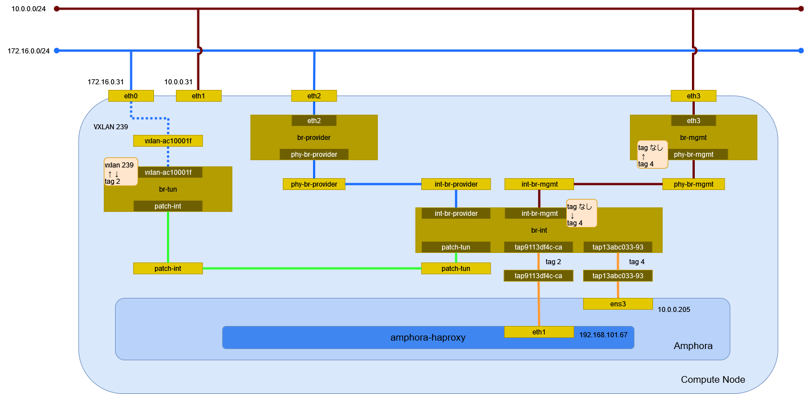

# ロードバランサ (Open vSwitch)

## 前提条件

* [](../network/ovs_router) を作成していること。
* [](../instance/ovs_vxlan.md) を 2 つ作成していること。

## ロードバランサの作成

ロードバランサのサービスを提供するサブネット selfservice を指定してロードバランサを作成する。

```sh
openstack loadbalancer create \
    --name lb \
    --vip-subnet-id selfservice
```

```
+---------------------+--------------------------------------+
| Field               | Value                                |
+---------------------+--------------------------------------+
| admin_state_up      | True                                 |
| availability_zone   | None                                 |
| created_at          | 2024-05-01T12:13:44                  |
| description         |                                      |
| flavor_id           | None                                 |
| id                  | 3e7ed706-1dd4-4bd7-a7d5-9ea3f3485f4c |
| listeners           |                                      |
| name                | lb                                   |
| operating_status    | OFFLINE                              |
| pools               |                                      |
| project_id          | f2aeffb34ff34ffb8959f1cd813655c6     |
| provider            | amphora                              |
| provisioning_status | PENDING_CREATE                       |
| updated_at          | None                                 |
| vip_address         | 192.168.101.228                      |
| vip_network_id      | 9eb0ca8c-b4d4-455b-9f5e-fc3641a0ebd1 |
| vip_port_id         | 1ccfecb0-cb40-417e-bed5-3e4ff1efe1ed |
| vip_qos_policy_id   | None                                 |
| vip_subnet_id       | f09a54e3-3b18-4dfa-9dda-423ed0641889 |
| tags                |                                      |
+---------------------+--------------------------------------+
```

イメージ amphora からインスタンスが作成される。

しばらく時間が経過するとロードバランサのサービスが機能する。

```sh
curl -E /etc/octavia/certs/private/client.cert-and-key.pem -ksS https://10.0.0.213:9443
```

```json
{"api_version":"1.0"}
```

*/etc/octavia/octavia.conf* に指定したネットワークと `openstack loadbalancer create` に指定したネットワークに
接続された構成となることを確認する。

```{tip}
ユーザ octavia で実行する。
```

```sh
openstack server list
```

```
+--------------------------------------+----------------------------------------------+--------+----------------------------------------------+---------------------+---------+
| ID                                   | Name                                         | Status | Networks                                     | Image               | Flavor  |
+--------------------------------------+----------------------------------------------+--------+----------------------------------------------+---------------------+---------+
| 2b7b899c-053a-41b5-9b84-ad62696d1722 | amphora-4e7e2dcd-f2f0-4375-bfef-22f5934ae06f | ACTIVE | mgmt=10.0.0.213; selfservice=192.168.101.143 | amphora-x64-haproxy | amphora |
+--------------------------------------+----------------------------------------------+--------+----------------------------------------------+---------------------+---------+
```

ロードバランサが作成されたことを確認する。

```sh
openstack loadbalancer list
```

```
+--------------------------------------+------+----------------------------------+-----------------+---------------------+------------------+----------+
| id                                   | name | project_id                       | vip_address     | provisioning_status | operating_status | provider |
+--------------------------------------+------+----------------------------------+-----------------+---------------------+------------------+----------+
| 3e7ed706-1dd4-4bd7-a7d5-9ea3f3485f4c | lb   | f2aeffb34ff34ffb8959f1cd813655c6 | 192.168.101.228 | ACTIVE              | OFFLINE          | amphora  |
+--------------------------------------+------+----------------------------------+-----------------+---------------------+------------------+----------+
```

## 環境の確認

Compute Node でネットワーク構成を確認する。



### インスタンス

amphora のインスタンスを確認する。

```sh
virsh list
```

```
 Id   名前                状態
----------------------------------
 2    instance-0000002c   実行中
```

ネットワークインターフェイスの設定を確認する。

```sh
virsh dumpxml 12 | sed -n -e '/<interface/,/<\/interface>/ { p }'
```

```xml
<interface type='ethernet'>
  <mac address='fa:16:3e:04:af:90'/>
  <target dev='tap5757a3e3-a3'/>
  <model type='virtio'/>
  <driver name='qemu'/>
  <mtu size='1500'/>
  <alias name='net0'/>
  <address type='pci' domain='0x0000' bus='0x00' slot='0x03' function='0x0'/>
</interface>
<interface type='ethernet'>
  <mac address='fa:16:3e:46:89:39'/>
  <target dev='tap57ff88f0-a4'/>
  <model type='virtio'/>
  <driver name='qemu'/>
  <mtu size='1450'/>
  <alias name='net1'/>
  <address type='pci' domain='0x0000' bus='0x00' slot='0x07' function='0x0'/>
</interface>
```

### ネットワーク

#### ネットワーク名前空間

amphora インスタンスのネットワーク名前空間を確認する。

```sh
ssh -i ./demo_rsa cloud-user@10.0.0.213 ip netns
```

```
amphora-haproxy (id: 0)
```

#### デバイス

Compute Node のデバイスを確認する。

```sh
ip -d link show
```

```
1: lo: <LOOPBACK,UP,LOWER_UP> mtu 65536 qdisc noqueue state UNKNOWN mode DEFAULT group default qlen 1000
    link/loopback 00:00:00:00:00:00 brd 00:00:00:00:00:00 promiscuity 0 minmtu 0 maxmtu 0 addrgenmode eui64 numtxqueues 1 numrxqueues 1 gso_max_size 65536 gso_max_segs 65535
2: eth0: <BROADCAST,MULTICAST,UP,LOWER_UP> mtu 1500 qdisc mq master ovs-system state UP mode DEFAULT group default qlen 1000
    link/ether 00:15:5d:bf:ba:42 brd ff:ff:ff:ff:ff:ff promiscuity 1 minmtu 68 maxmtu 65521
    openvswitch_slave addrgenmode none numtxqueues 64 numrxqueues 64 gso_max_size 62780 gso_max_segs 65535 parentbus vmbus parentdev 0b1c4460-b972-4e3e-8976-e4dac2e5b799
3: eth1: <BROADCAST,MULTICAST,UP,LOWER_UP> mtu 1500 qdisc mq master ovs-system state UP mode DEFAULT group default qlen 1000
    link/ether 00:15:5d:bf:ba:46 brd ff:ff:ff:ff:ff:ff promiscuity 1 minmtu 68 maxmtu 65521
    openvswitch_slave addrgenmode none numtxqueues 64 numrxqueues 64 gso_max_size 62780 gso_max_segs 65535 parentbus vmbus parentdev 97ecc413-a192-4d83-b344-02846e18823d
4: ovs-system: <BROADCAST,MULTICAST> mtu 1500 qdisc noop state DOWN mode DEFAULT group default qlen 1000
    link/ether 42:5d:27:99:6f:9d brd ff:ff:ff:ff:ff:ff promiscuity 1 minmtu 68 maxmtu 65535
    openvswitch addrgenmode eui64 numtxqueues 1 numrxqueues 1 gso_max_size 65536 gso_max_segs 65535
6: br-tun: <BROADCAST,MULTICAST,UP,LOWER_UP> mtu 1500 qdisc noqueue state UNKNOWN mode DEFAULT group default qlen 1000
    link/ether a6:9e:8e:08:7b:4a brd ff:ff:ff:ff:ff:ff promiscuity 1 minmtu 68 maxmtu 65535
    openvswitch addrgenmode none numtxqueues 1 numrxqueues 1 gso_max_size 65536 gso_max_segs 65535
7: vxlan_sys_4789: <BROADCAST,MULTICAST,UP,LOWER_UP> mtu 65000 qdisc noqueue master ovs-system state UNKNOWN mode DEFAULT group default qlen 1000
    link/ether 62:74:f9:7c:91:33 brd ff:ff:ff:ff:ff:ff promiscuity 1 minmtu 68 maxmtu 65535
    vxlan external id 0 srcport 0 0 dstport 4789 nolearning ttl auto ageing 300 udpcsum noudp6zerocsumtx udp6zerocsumrx
    openvswitch_slave addrgenmode none numtxqueues 1 numrxqueues 1 gso_max_size 65536 gso_max_segs 65535
8: br-int: <BROADCAST,MULTICAST,UP,LOWER_UP> mtu 1450 qdisc noqueue state UNKNOWN mode DEFAULT group default qlen 1000
    link/ether d6:8b:38:95:ac:45 brd ff:ff:ff:ff:ff:ff promiscuity 1 minmtu 68 maxmtu 65535
    openvswitch addrgenmode none numtxqueues 1 numrxqueues 1 gso_max_size 65536 gso_max_segs 65535
9: br-provider: <BROADCAST,MULTICAST,UP,LOWER_UP> mtu 1500 qdisc noqueue state UNKNOWN mode DEFAULT group default qlen 1000
    link/ether 00:15:5d:bf:ba:42 brd ff:ff:ff:ff:ff:ff promiscuity 1 minmtu 68 maxmtu 65535
    openvswitch addrgenmode none numtxqueues 1 numrxqueues 1 gso_max_size 65536 gso_max_segs 65535
10: br-mgmt: <BROADCAST,MULTICAST,UP,LOWER_UP> mtu 1500 qdisc noqueue state UNKNOWN mode DEFAULT group default qlen 1000
    link/ether 00:15:5d:bf:ba:46 brd ff:ff:ff:ff:ff:ff promiscuity 1 minmtu 68 maxmtu 65535
    openvswitch addrgenmode eui64 numtxqueues 1 numrxqueues 1 gso_max_size 65536 gso_max_segs 65535
14: tap5757a3e3-a3: <BROADCAST,MULTICAST,UP,LOWER_UP> mtu 1500 qdisc fq_codel master ovs-system state UNKNOWN mode DEFAULT group default qlen 1000
    link/ether fe:16:3e:04:af:90 brd ff:ff:ff:ff:ff:ff promiscuity 1 minmtu 68 maxmtu 65521
    tun type tap pi off vnet_hdr on persist off
    openvswitch_slave addrgenmode eui64 numtxqueues 1 numrxqueues 1 gso_max_size 65536 gso_max_segs 65535
15: tap57ff88f0-a4: <BROADCAST,MULTICAST,UP,LOWER_UP> mtu 1450 qdisc fq_codel master ovs-system state UNKNOWN mode DEFAULT group default qlen 1000
    link/ether fe:16:3e:46:89:39 brd ff:ff:ff:ff:ff:ff promiscuity 1 minmtu 68 maxmtu 65521
    tun type tap pi off vnet_hdr on persist off
    openvswitch_slave addrgenmode eui64 numtxqueues 1 numrxqueues 1 gso_max_size 65536 gso_max_segs 65535
```

amphora インスタンスのデバイスを確認する。

```sh
ssh -i ./demo_rsa cloud-user@10.0.0.213 ip -d link show
```

```
1: lo: <LOOPBACK,UP,LOWER_UP> mtu 65536 qdisc noqueue state UNKNOWN mode DEFAULT group default qlen 1000
    link/loopback 00:00:00:00:00:00 brd 00:00:00:00:00:00 promiscuity 0  allmulti 0 minmtu 0 maxmtu 0 addrgenmode eui64 numtxqueues 1 numrxqueues 1 gso_max_size 65536 gso_max_segs 65535 tso_max_size 524280 tso_max_segs 65535 gro_max_size 65536
2: ens3: <BROADCAST,MULTICAST,UP,LOWER_UP> mtu 1500 qdisc fq_codel state UP mode DEFAULT group default qlen 1000
    link/ether fa:16:3e:04:af:90 brd ff:ff:ff:ff:ff:ff promiscuity 0  allmulti 0 minmtu 68 maxmtu 1500 addrgenmode eui64 numtxqueues 1 numrxqueues 1 gso_max_size 65536 gso_max_segs 65535 tso_max_size 65536 tso_max_segs 65535 gro_max_size 65536 parentbus virtio parentdev virtio1
    altname enp0s3
```

ネットワーク名前空間内のデバイスを確認する。

```sh
ssh -i ./demo_rsa cloud-user@10.0.0.213 sudo ip netns exec amphora-haproxy ip -d link show
```

```
1: lo: <LOOPBACK> mtu 65536 qdisc noop state DOWN mode DEFAULT group default qlen 1000
    link/loopback 00:00:00:00:00:00 brd 00:00:00:00:00:00 promiscuity 0  allmulti 0 minmtu 0 maxmtu 0 addrgenmode eui64 numtxqueues 1 numrxqueues 1 gso_max_size 65536 gso_max_segs 65535 tso_max_size 524280 tso_max_segs 65535 gro_max_size 65536
3: eth1: <BROADCAST,MULTICAST,UP,LOWER_UP> mtu 1450 qdisc fq_codel state UP mode DEFAULT group default qlen 1000
    link/ether fa:16:3e:46:89:39 brd ff:ff:ff:ff:ff:ff promiscuity 0  allmulti 0 minmtu 68 maxmtu 1450 addrgenmode eui64 numtxqueues 1 numrxqueues 1 gso_max_size 65536 gso_max_segs 65535 tso_max_size 65536 tso_max_segs 65535 gro_max_size 65536 parentbus virtio parentdev virtio5
    altname enp0s7
```

#### Open vSwitch

ブリッジを確認する。

```sh
ovs-vsctl show
```

```
9ab7209e-d2af-4403-9ddb-416bc283b632
    Manager "ptcp:6640:127.0.0.1"
        is_connected: true
    Bridge br-tun
        Controller "tcp:127.0.0.1:6633"
            is_connected: true
        fail_mode: secure
        datapath_type: system
        Port patch-int
            Interface patch-int
                type: patch
                options: {peer=patch-tun}
        Port vxlan-ac10000b
            Interface vxlan-ac10000b
                type: vxlan
                options: {df_default="true", egress_pkt_mark="0", in_key=flow, local_ip="172.16.0.31", out_key=flow, remote_ip="172.16.0.11"}
        Port br-tun
            Interface br-tun
                type: internal
    Bridge br-provider
        Controller "tcp:127.0.0.1:6633"
            is_connected: true
        fail_mode: secure
        datapath_type: system
        Port eth0
            Interface eth0
                type: system
        Port br-provider
            Interface br-provider
                type: internal
        Port phy-br-provider
            Interface phy-br-provider
                type: patch
                options: {peer=int-br-provider}
    Bridge br-int
        Controller "tcp:127.0.0.1:6633"
            is_connected: true
        fail_mode: secure
        datapath_type: system
        Port patch-tun
            Interface patch-tun
                type: patch
                options: {peer=patch-int}
        Port int-br-provider
            Interface int-br-provider
                type: patch
                options: {peer=phy-br-provider}
        Port tap5757a3e3-a3
            tag: 6
            Interface tap5757a3e3-a3
        Port tap57ff88f0-a4
            tag: 7
            Interface tap57ff88f0-a4
        Port int-br-mgmt
            Interface int-br-mgmt
                type: patch
                options: {peer=phy-br-mgmt}
        Port br-int
            Interface br-int
                type: internal
    Bridge br-mgmt
        Controller "tcp:127.0.0.1:6633"
            is_connected: true
        fail_mode: secure
        datapath_type: system
        Port phy-br-mgmt
            Interface phy-br-mgmt
                type: patch
                options: {peer=int-br-mgmt}
        Port br-mgmt
            Interface br-mgmt
                type: internal
        Port eth1
            Interface eth1
                type: system
    ovs_version: "3.1.4"
```

フローのエントリを確認する。


```sh
ovs-ofctl dump-flows br-tun
```

```
 cookie=0x8d1cc6b3c0f25ef6, duration=5493.090s, table=0, n_packets=672, n_bytes=63266, priority=1,in_port="patch-int" actions=resubmit(,2)
 cookie=0x8d1cc6b3c0f25ef6, duration=5490.848s, table=0, n_packets=6, n_bytes=420, priority=1,in_port="vxlan-ac10000b" actions=resubmit(,4)
 cookie=0x8d1cc6b3c0f25ef6, duration=5493.088s, table=0, n_packets=0, n_bytes=0, priority=0 actions=drop
 cookie=0x8d1cc6b3c0f25ef6, duration=5493.087s, table=2, n_packets=0, n_bytes=0, priority=0,dl_dst=00:00:00:00:00:00/01:00:00:00:00:00 actions=resubmit(,20)
 cookie=0x8d1cc6b3c0f25ef6, duration=5493.085s, table=2, n_packets=672, n_bytes=63266, priority=0,dl_dst=01:00:00:00:00:00/01:00:00:00:00:00 actions=resubmit(,22)
 cookie=0x8d1cc6b3c0f25ef6, duration=5493.084s, table=3, n_packets=0, n_bytes=0, priority=0 actions=drop
 cookie=0x8d1cc6b3c0f25ef6, duration=4327.175s, table=4, n_packets=4, n_bytes=280, priority=1,tun_id=0xcb actions=mod_vlan_vid:7,resubmit(,10)
 cookie=0x8d1cc6b3c0f25ef6, duration=5493.084s, table=4, n_packets=2, n_bytes=140, priority=0 actions=drop
 cookie=0x8d1cc6b3c0f25ef6, duration=5493.083s, table=6, n_packets=0, n_bytes=0, priority=0 actions=drop
 cookie=0x8d1cc6b3c0f25ef6, duration=5493.082s, table=10, n_packets=4, n_bytes=280, priority=1 actions=learn(table=20,hard_timeout=300,priority=1,cookie=0x8d1cc6b3c0f25ef6,NXM_OF_VLAN_TCI[0..11],NXM_OF_ETH_DST[]=NXM_OF_ETH_SRC[],load:0->NXM_OF_VLAN_TCI[],load:NXM_NX_TUN_ID[]->NXM_NX_TUN_ID[],output:OXM_OF_IN_PORT[]),output:"patch-int"
 cookie=0x8d1cc6b3c0f25ef6, duration=5493.081s, table=20, n_packets=0, n_bytes=0, priority=0 actions=resubmit(,22)
 cookie=0x8d1cc6b3c0f25ef6, duration=4327.177s, table=22, n_packets=1, n_bytes=70, priority=1,dl_vlan=7 actions=strip_vlan,load:0xcb->NXM_NX_TUN_ID[],output:"vxlan-ac10000b"
 cookie=0x8d1cc6b3c0f25ef6, duration=5493.080s, table=22, n_packets=670, n_bytes=63126, priority=0 actions=drop
```

```sh
ovs-ofctl dump-flows br-int
```

```
 cookie=0xde9bbfda41bf11b9, duration=5504.742s, table=0, n_packets=0, n_bytes=0, priority=65535,dl_vlan=4095 actions=drop
 cookie=0xde9bbfda41bf11b9, duration=4680.155s, table=0, n_packets=781, n_bytes=93342, priority=3,in_port="int-br-mgmt",vlan_tci=0x0000/0x1fff actions=mod_vlan_vid:6,resubmit(,59)
 cookie=0xde9bbfda41bf11b9, duration=5504.678s, table=0, n_packets=238, n_bytes=43792, priority=2,in_port="int-br-provider" actions=drop
 cookie=0xde9bbfda41bf11b9, duration=5503.456s, table=0, n_packets=27, n_bytes=3526, priority=2,in_port="int-br-mgmt" actions=drop
 cookie=0xde9bbfda41bf11b9, duration=5504.746s, table=0, n_packets=888, n_bytes=158578, priority=0 actions=resubmit(,59)
 cookie=0xde9bbfda41bf11b9, duration=5504.747s, table=23, n_packets=0, n_bytes=0, priority=0 actions=drop
 cookie=0xde9bbfda41bf11b9, duration=5504.743s, table=24, n_packets=0, n_bytes=0, priority=0 actions=drop
 cookie=0xde9bbfda41bf11b9, duration=5504.740s, table=30, n_packets=0, n_bytes=0, priority=0 actions=resubmit(,59)
 cookie=0xde9bbfda41bf11b9, duration=5504.739s, table=31, n_packets=0, n_bytes=0, priority=0 actions=resubmit(,59)
 cookie=0xde9bbfda41bf11b9, duration=5504.745s, table=59, n_packets=1908, n_bytes=275034, priority=0 actions=resubmit(,60)
 cookie=0xde9bbfda41bf11b9, duration=4677.943s, table=60, n_packets=773, n_bytes=137188, priority=100,in_port="tap5757a3e3-a3" actions=load:0x6->NXM_NX_REG5[],load:0x6->NXM_NX_REG6[],resubmit(,71)
 cookie=0xde9bbfda41bf11b9, duration=4335.292s, table=60, n_packets=7, n_bytes=606, priority=100,in_port="tap57ff88f0-a4" actions=load:0x7->NXM_NX_REG5[],load:0x7->NXM_NX_REG6[],resubmit(,71)
 cookie=0xde9bbfda41bf11b9, duration=4677.943s, table=60, n_packets=0, n_bytes=0, priority=90,vlan_tci=0x0000/0x1fff,dl_dst=fa:16:3e:04:af:90 actions=load:0x6->NXM_NX_REG5[],load:0x6->NXM_NX_REG6[],resubmit(,81)
 cookie=0xde9bbfda41bf11b9, duration=4677.943s, table=60, n_packets=308, n_bytes=43078, priority=90,dl_vlan=6,dl_dst=fa:16:3e:04:af:90 actions=load:0x6->NXM_NX_REG5[],load:0x6->NXM_NX_REG6[],strip_vlan,resubmit(,81)
 cookie=0xde9bbfda41bf11b9, duration=4335.292s, table=60, n_packets=0, n_bytes=0, priority=90,dl_vlan=7,dl_dst=fa:16:3e:46:89:39 actions=load:0x7->NXM_NX_REG5[],load:0x7->NXM_NX_REG6[],strip_vlan,resubmit(,81)
 cookie=0xde9bbfda41bf11b9, duration=5504.744s, table=60, n_packets=647, n_bytes=60512, priority=3 actions=NORMAL
 cookie=0xde9bbfda41bf11b9, duration=5504.741s, table=62, n_packets=0, n_bytes=0, priority=3 actions=NORMAL
 cookie=0xde9bbfda41bf11b9, duration=5502.872s, table=71, n_packets=0, n_bytes=0, priority=110,ct_state=+trk actions=ct_clear,resubmit(,71)
 cookie=0xde9bbfda41bf11b9, duration=4677.943s, table=71, n_packets=127, n_bytes=5334, priority=95,arp,reg5=0x6,in_port="tap5757a3e3-a3",dl_src=fa:16:3e:04:af:90,arp_spa=10.0.0.213 actions=resubmit(,94)
 cookie=0xde9bbfda41bf11b9, duration=4677.943s, table=71, n_packets=629, n_bytes=129968, priority=65,ip,reg5=0x6,in_port="tap5757a3e3-a3",dl_src=fa:16:3e:04:af:90,nw_src=10.0.0.213 actions=ct(table=72,zone=NXM_NX_REG6[0..15])
 cookie=0xde9bbfda41bf11b9, duration=4335.292s, table=71, n_packets=0, n_bytes=0, priority=95,arp,reg5=0x7,in_port="tap57ff88f0-a4",dl_src=fa:16:3e:46:89:39,arp_spa=192.168.101.228 actions=resubmit(,94)
 cookie=0xde9bbfda41bf11b9, duration=4335.292s, table=71, n_packets=0, n_bytes=0, priority=65,ip,reg5=0x7,in_port="tap57ff88f0-a4",dl_src=fa:16:3e:46:89:39,nw_src=192.168.101.228 actions=ct(table=72,zone=NXM_NX_REG6[0..15])
 cookie=0xde9bbfda41bf11b9, duration=4335.292s, table=71, n_packets=0, n_bytes=0, priority=95,arp,reg5=0x7,in_port="tap57ff88f0-a4",dl_src=fa:16:3e:46:89:39,arp_spa=192.168.101.143 actions=resubmit(,94)
 cookie=0xde9bbfda41bf11b9, duration=4335.292s, table=71, n_packets=0, n_bytes=0, priority=65,ip,reg5=0x7,in_port="tap57ff88f0-a4",dl_src=fa:16:3e:46:89:39,nw_src=192.168.101.143 actions=ct(table=72,zone=NXM_NX_REG6[0..15])
 cookie=0xde9bbfda41bf11b9, duration=4677.942s, table=71, n_packets=0, n_bytes=0, priority=95,icmp6,reg5=0x6,in_port="tap5757a3e3-a3",dl_src=fa:16:3e:04:af:90,ipv6_src=fe80::f816:3eff:fe04:af90,icmp_type=130 actions=resubmit(,94)
 cookie=0xde9bbfda41bf11b9, duration=4677.942s, table=71, n_packets=10, n_bytes=700, priority=95,icmp6,reg5=0x6,in_port="tap5757a3e3-a3",dl_src=fa:16:3e:04:af:90,ipv6_src=fe80::f816:3eff:fe04:af90,icmp_type=133 actions=resubmit(,94)
 cookie=0xde9bbfda41bf11b9, duration=4677.942s, table=71, n_packets=0, n_bytes=0, priority=95,icmp6,reg5=0x6,in_port="tap5757a3e3-a3",dl_src=fa:16:3e:04:af:90,ipv6_src=fe80::f816:3eff:fe04:af90,icmp_type=135 actions=resubmit(,94)
 cookie=0xde9bbfda41bf11b9, duration=4335.292s, table=71, n_packets=0, n_bytes=0, priority=95,icmp6,reg5=0x7,in_port="tap57ff88f0-a4",dl_src=fa:16:3e:46:89:39,ipv6_src=fe80::f816:3eff:fe46:8939,icmp_type=130 actions=resubmit(,94)
 cookie=0xde9bbfda41bf11b9, duration=4335.292s, table=71, n_packets=1, n_bytes=70, priority=95,icmp6,reg5=0x7,in_port="tap57ff88f0-a4",dl_src=fa:16:3e:46:89:39,ipv6_src=fe80::f816:3eff:fe46:8939,icmp_type=133 actions=resubmit(,94)
 cookie=0xde9bbfda41bf11b9, duration=4335.292s, table=71, n_packets=0, n_bytes=0, priority=95,icmp6,reg5=0x7,in_port="tap57ff88f0-a4",dl_src=fa:16:3e:46:89:39,ipv6_src=fe80::f816:3eff:fe46:8939,icmp_type=135 actions=resubmit(,94)
 cookie=0xde9bbfda41bf11b9, duration=4677.942s, table=71, n_packets=0, n_bytes=0, priority=95,icmp6,reg5=0x6,in_port="tap5757a3e3-a3",icmp_type=136,nd_target=fe80::f816:3eff:fe04:af90 actions=resubmit(,94)
 cookie=0xde9bbfda41bf11b9, duration=4335.292s, table=71, n_packets=0, n_bytes=0, priority=95,icmp6,reg5=0x7,in_port="tap57ff88f0-a4",icmp_type=136,nd_target=fe80::f816:3eff:fe46:8939 actions=resubmit(,94)
 cookie=0xde9bbfda41bf11b9, duration=4677.942s, table=71, n_packets=0, n_bytes=0, priority=80,udp,reg5=0x6,in_port="tap5757a3e3-a3",dl_src=fa:16:3e:04:af:90,nw_src=10.0.0.213,tp_src=68,tp_dst=67 actions=resubmit(,73)
 cookie=0xde9bbfda41bf11b9, duration=4677.942s, table=71, n_packets=2, n_bytes=740, priority=80,udp,reg5=0x6,in_port="tap5757a3e3-a3",dl_src=fa:16:3e:04:af:90,nw_src=0.0.0.0,tp_src=68,tp_dst=67 actions=resubmit(,73)
 cookie=0xde9bbfda41bf11b9, duration=4335.291s, table=71, n_packets=0, n_bytes=0, priority=80,udp,reg5=0x7,in_port="tap57ff88f0-a4",dl_src=fa:16:3e:46:89:39,nw_src=192.168.101.228,tp_src=68,tp_dst=67 actions=resubmit(,73)
 cookie=0xde9bbfda41bf11b9, duration=4335.291s, table=71, n_packets=0, n_bytes=0, priority=80,udp,reg5=0x7,in_port="tap57ff88f0-a4",dl_src=fa:16:3e:46:89:39,nw_src=192.168.101.143,tp_src=68,tp_dst=67 actions=resubmit(,73)
 cookie=0xde9bbfda41bf11b9, duration=4335.291s, table=71, n_packets=0, n_bytes=0, priority=80,udp,reg5=0x7,in_port="tap57ff88f0-a4",dl_src=fa:16:3e:46:89:39,nw_src=0.0.0.0,tp_src=68,tp_dst=67 actions=resubmit(,73)
 cookie=0xde9bbfda41bf11b9, duration=4677.942s, table=71, n_packets=0, n_bytes=0, priority=80,udp6,reg5=0x6,in_port="tap5757a3e3-a3",dl_src=fa:16:3e:04:af:90,ipv6_src=fe80::f816:3eff:fe04:af90,tp_src=546,tp_dst=547 actions=resubmit(,73)
 cookie=0xde9bbfda41bf11b9, duration=4335.291s, table=71, n_packets=0, n_bytes=0, priority=80,udp6,reg5=0x7,in_port="tap57ff88f0-a4",dl_src=fa:16:3e:46:89:39,ipv6_src=fe80::f816:3eff:fe46:8939,tp_src=546,tp_dst=547 actions=resubmit(,73)
 cookie=0xde9bbfda41bf11b9, duration=4677.942s, table=71, n_packets=0, n_bytes=0, priority=70,udp,reg5=0x6,in_port="tap5757a3e3-a3",tp_src=67,tp_dst=68 actions=resubmit(,93)
 cookie=0xde9bbfda41bf11b9, duration=4677.942s, table=71, n_packets=0, n_bytes=0, priority=70,udp6,reg5=0x6,in_port="tap5757a3e3-a3",tp_src=547,tp_dst=546 actions=resubmit(,93)
 cookie=0xde9bbfda41bf11b9, duration=4335.291s, table=71, n_packets=0, n_bytes=0, priority=70,udp,reg5=0x7,in_port="tap57ff88f0-a4",tp_src=67,tp_dst=68 actions=resubmit(,93)
 cookie=0xde9bbfda41bf11b9, duration=4335.291s, table=71, n_packets=0, n_bytes=0, priority=70,udp6,reg5=0x7,in_port="tap57ff88f0-a4",tp_src=547,tp_dst=546 actions=resubmit(,93)
 cookie=0xde9bbfda41bf11b9, duration=4677.941s, table=71, n_packets=0, n_bytes=0, priority=70,icmp6,reg5=0x6,in_port="tap5757a3e3-a3",icmp_type=134 actions=resubmit(,93)
 cookie=0xde9bbfda41bf11b9, duration=4335.291s, table=71, n_packets=0, n_bytes=0, priority=70,icmp6,reg5=0x7,in_port="tap57ff88f0-a4",icmp_type=134 actions=resubmit(,93)
 cookie=0xde9bbfda41bf11b9, duration=4677.942s, table=71, n_packets=2, n_bytes=180, priority=65,ipv6,reg5=0x6,in_port="tap5757a3e3-a3",dl_src=fa:16:3e:04:af:90,ipv6_src=fe80::f816:3eff:fe04:af90 actions=ct(table=72,zone=NXM_NX_REG6[0..15])
 cookie=0xde9bbfda41bf11b9, duration=4335.292s, table=71, n_packets=1, n_bytes=90, priority=65,ipv6,reg5=0x7,in_port="tap57ff88f0-a4",dl_src=fa:16:3e:46:89:39,ipv6_src=fe80::f816:3eff:fe46:8939 actions=ct(table=72,zone=NXM_NX_REG6[0..15])
 cookie=0xde9bbfda41bf11b9, duration=4677.941s, table=71, n_packets=3, n_bytes=266, priority=10,reg5=0x6,in_port="tap5757a3e3-a3" actions=ct_clear,resubmit(,93)
 cookie=0xde9bbfda41bf11b9, duration=4335.290s, table=71, n_packets=5, n_bytes=446, priority=10,reg5=0x7,in_port="tap57ff88f0-a4" actions=ct_clear,resubmit(,93)
 cookie=0xde9bbfda41bf11b9, duration=5502.937s, table=71, n_packets=0, n_bytes=0, priority=0 actions=drop
 cookie=0xde9bbfda41bf11b9, duration=4677.938s, table=72, n_packets=0, n_bytes=0, priority=74,ct_state=+est-rel-rpl,ipv6,reg5=0x6 actions=resubmit(,73)
 cookie=0xde9bbfda41bf11b9, duration=4677.937s, table=72, n_packets=0, n_bytes=0, priority=74,ct_state=+est-rel-rpl,ip,reg5=0x6 actions=resubmit(,73)
 cookie=0xde9bbfda41bf11b9, duration=4335.286s, table=72, n_packets=0, n_bytes=0, priority=74,ct_state=+est-rel-rpl,ip,reg5=0x7 actions=resubmit(,73)
 cookie=0xde9bbfda41bf11b9, duration=4335.286s, table=72, n_packets=0, n_bytes=0, priority=74,ct_state=+est-rel-rpl,ipv6,reg5=0x7 actions=resubmit(,73)
 cookie=0xde9bbfda41bf11b9, duration=4677.938s, table=72, n_packets=0, n_bytes=0, priority=74,ct_state=+new-est,ipv6,reg5=0x6 actions=resubmit(,73)
 cookie=0xde9bbfda41bf11b9, duration=4677.937s, table=72, n_packets=434, n_bytes=84978, priority=74,ct_state=+new-est,ip,reg5=0x6 actions=resubmit(,73)
 cookie=0xde9bbfda41bf11b9, duration=4335.286s, table=72, n_packets=0, n_bytes=0, priority=74,ct_state=+new-est,ip,reg5=0x7 actions=resubmit(,73)
 cookie=0xde9bbfda41bf11b9, duration=4335.286s, table=72, n_packets=0, n_bytes=0, priority=74,ct_state=+new-est,ipv6,reg5=0x7 actions=resubmit(,73)
 cookie=0xde9bbfda41bf11b9, duration=4335.287s, table=72, n_packets=6, n_bytes=540, priority=50,ct_state=+inv+trk actions=resubmit(,93)
 cookie=0xde9bbfda41bf11b9, duration=4677.939s, table=72, n_packets=0, n_bytes=0, priority=50,ct_mark=0x1,reg5=0x6 actions=resubmit(,93)
 cookie=0xde9bbfda41bf11b9, duration=4335.287s, table=72, n_packets=0, n_bytes=0, priority=50,ct_mark=0x1,reg5=0x7 actions=resubmit(,93)
 cookie=0xde9bbfda41bf11b9, duration=4677.939s, table=72, n_packets=195, n_bytes=44990, priority=50,ct_state=+est-rel+rpl,ct_zone=6,ct_mark=0,reg5=0x6 actions=resubmit(,94)
 cookie=0xde9bbfda41bf11b9, duration=4335.287s, table=72, n_packets=0, n_bytes=0, priority=50,ct_state=+est-rel+rpl,ct_zone=7,ct_mark=0,reg5=0x7 actions=resubmit(,94)
 cookie=0xde9bbfda41bf11b9, duration=4677.938s, table=72, n_packets=0, n_bytes=0, priority=50,ct_state=-new-est+rel-inv,ct_zone=6,ct_mark=0,reg5=0x6 actions=resubmit(,94)
 cookie=0xde9bbfda41bf11b9, duration=4335.287s, table=72, n_packets=0, n_bytes=0, priority=50,ct_state=-new-est+rel-inv,ct_zone=7,ct_mark=0,reg5=0x7 actions=resubmit(,94)
 cookie=0xde9bbfda41bf11b9, duration=4677.938s, table=72, n_packets=0, n_bytes=0, priority=40,ct_state=-est,reg5=0x6 actions=resubmit(,93)
 cookie=0xde9bbfda41bf11b9, duration=4335.287s, table=72, n_packets=0, n_bytes=0, priority=40,ct_state=-est,reg5=0x7 actions=resubmit(,93)
 cookie=0xde9bbfda41bf11b9, duration=4677.938s, table=72, n_packets=0, n_bytes=0, priority=40,ct_state=+est,ip,reg5=0x6 actions=ct(commit,zone=NXM_NX_REG6[0..15],exec(load:0x1->NXM_NX_CT_MARK[]))
 cookie=0xde9bbfda41bf11b9, duration=4677.938s, table=72, n_packets=0, n_bytes=0, priority=40,ct_state=+est,ipv6,reg5=0x6 actions=ct(commit,zone=NXM_NX_REG6[0..15],exec(load:0x1->NXM_NX_CT_MARK[]))
 cookie=0xde9bbfda41bf11b9, duration=4335.287s, table=72, n_packets=0, n_bytes=0, priority=40,ct_state=+est,ip,reg5=0x7 actions=ct(commit,zone=NXM_NX_REG6[0..15],exec(load:0x1->NXM_NX_CT_MARK[]))
 cookie=0xde9bbfda41bf11b9, duration=4335.287s, table=72, n_packets=0, n_bytes=0, priority=40,ct_state=+est,ipv6,reg5=0x7 actions=ct(commit,zone=NXM_NX_REG6[0..15],exec(load:0x1->NXM_NX_CT_MARK[]))
 cookie=0xde9bbfda41bf11b9, duration=5502.925s, table=72, n_packets=0, n_bytes=0, priority=0 actions=drop
 cookie=0xde9bbfda41bf11b9, duration=4677.941s, table=73, n_packets=0, n_bytes=0, priority=100,reg6=0x6,dl_dst=fa:16:3e:04:af:90 actions=load:0x6->NXM_NX_REG5[],resubmit(,81)
 cookie=0xde9bbfda41bf11b9, duration=4335.290s, table=73, n_packets=0, n_bytes=0, priority=100,reg6=0x7,dl_dst=fa:16:3e:46:89:39 actions=load:0x7->NXM_NX_REG5[],resubmit(,81)
 cookie=0xde9bbfda41bf11b9, duration=4677.941s, table=73, n_packets=434, n_bytes=84978, priority=90,ct_state=+new-est,ip,reg5=0x6 actions=ct(commit,zone=NXM_NX_REG6[0..15]),resubmit(,91)
 cookie=0xde9bbfda41bf11b9, duration=4677.941s, table=73, n_packets=0, n_bytes=0, priority=90,ct_state=+new-est,ipv6,reg5=0x6 actions=ct(commit,zone=NXM_NX_REG6[0..15]),resubmit(,91)
 cookie=0xde9bbfda41bf11b9, duration=4335.290s, table=73, n_packets=0, n_bytes=0, priority=90,ct_state=+new-est,ip,reg5=0x7 actions=ct(commit,zone=NXM_NX_REG6[0..15]),resubmit(,91)
 cookie=0xde9bbfda41bf11b9, duration=4335.290s, table=73, n_packets=0, n_bytes=0, priority=90,ct_state=+new-est,ipv6,reg5=0x7 actions=ct(commit,zone=NXM_NX_REG6[0..15]),resubmit(,91)
 cookie=0xde9bbfda41bf11b9, duration=4677.941s, table=73, n_packets=2, n_bytes=740, priority=80,reg5=0x6 actions=resubmit(,94)
 cookie=0xde9bbfda41bf11b9, duration=4335.290s, table=73, n_packets=0, n_bytes=0, priority=80,reg5=0x7 actions=resubmit(,94)
 cookie=0xde9bbfda41bf11b9, duration=5502.912s, table=73, n_packets=0, n_bytes=0, priority=0 actions=drop
 cookie=0xde9bbfda41bf11b9, duration=4677.941s, table=81, n_packets=124, n_bytes=5208, priority=100,arp,reg5=0x6 actions=output:"tap5757a3e3-a3"
 cookie=0xde9bbfda41bf11b9, duration=4335.290s, table=81, n_packets=0, n_bytes=0, priority=100,arp,reg5=0x7 actions=output:"tap57ff88f0-a4"
 cookie=0xde9bbfda41bf11b9, duration=4677.941s, table=81, n_packets=0, n_bytes=0, priority=100,icmp6,reg5=0x6,icmp_type=130 actions=output:"tap5757a3e3-a3"
 cookie=0xde9bbfda41bf11b9, duration=4677.940s, table=81, n_packets=0, n_bytes=0, priority=100,icmp6,reg5=0x6,icmp_type=135 actions=output:"tap5757a3e3-a3"
 cookie=0xde9bbfda41bf11b9, duration=4677.940s, table=81, n_packets=0, n_bytes=0, priority=100,icmp6,reg5=0x6,icmp_type=136 actions=output:"tap5757a3e3-a3"
 cookie=0xde9bbfda41bf11b9, duration=4677.940s, table=81, n_packets=0, n_bytes=0, priority=100,icmp6,reg5=0x6,icmp_type=134 actions=output:"tap5757a3e3-a3"
 cookie=0xde9bbfda41bf11b9, duration=4335.289s, table=81, n_packets=0, n_bytes=0, priority=100,icmp6,reg5=0x7,icmp_type=130 actions=output:"tap57ff88f0-a4"
 cookie=0xde9bbfda41bf11b9, duration=4335.289s, table=81, n_packets=0, n_bytes=0, priority=100,icmp6,reg5=0x7,icmp_type=135 actions=output:"tap57ff88f0-a4"
 cookie=0xde9bbfda41bf11b9, duration=4335.289s, table=81, n_packets=0, n_bytes=0, priority=100,icmp6,reg5=0x7,icmp_type=136 actions=output:"tap57ff88f0-a4"
 cookie=0xde9bbfda41bf11b9, duration=4335.289s, table=81, n_packets=0, n_bytes=0, priority=100,icmp6,reg5=0x7,icmp_type=134 actions=output:"tap57ff88f0-a4"
 cookie=0xde9bbfda41bf11b9, duration=4677.940s, table=81, n_packets=2, n_bytes=789, priority=95,udp,reg5=0x6,tp_src=67,tp_dst=68 actions=output:"tap5757a3e3-a3"
 cookie=0xde9bbfda41bf11b9, duration=4677.940s, table=81, n_packets=0, n_bytes=0, priority=95,udp6,reg5=0x6,tp_src=547,tp_dst=546 actions=output:"tap5757a3e3-a3"
 cookie=0xde9bbfda41bf11b9, duration=4335.289s, table=81, n_packets=0, n_bytes=0, priority=95,udp,reg5=0x7,tp_src=67,tp_dst=68 actions=output:"tap57ff88f0-a4"
 cookie=0xde9bbfda41bf11b9, duration=4335.289s, table=81, n_packets=0, n_bytes=0, priority=95,udp6,reg5=0x7,tp_src=547,tp_dst=546 actions=output:"tap57ff88f0-a4"
 cookie=0xde9bbfda41bf11b9, duration=4677.940s, table=81, n_packets=182, n_bytes=37081, priority=90,ct_state=-trk,ip,reg5=0x6 actions=ct(table=82,zone=NXM_NX_REG6[0..15])
 cookie=0xde9bbfda41bf11b9, duration=4677.940s, table=81, n_packets=0, n_bytes=0, priority=90,ct_state=-trk,ipv6,reg5=0x6 actions=ct(table=82,zone=NXM_NX_REG6[0..15])
 cookie=0xde9bbfda41bf11b9, duration=4335.289s, table=81, n_packets=0, n_bytes=0, priority=90,ct_state=-trk,ip,reg5=0x7 actions=ct(table=82,zone=NXM_NX_REG6[0..15])
 cookie=0xde9bbfda41bf11b9, duration=4335.289s, table=81, n_packets=0, n_bytes=0, priority=90,ct_state=-trk,ipv6,reg5=0x7 actions=ct(table=82,zone=NXM_NX_REG6[0..15])
 cookie=0xde9bbfda41bf11b9, duration=4677.940s, table=81, n_packets=0, n_bytes=0, priority=80,ct_state=+trk,reg5=0x6 actions=resubmit(,82)
 cookie=0xde9bbfda41bf11b9, duration=4335.288s, table=81, n_packets=0, n_bytes=0, priority=80,ct_state=+trk,reg5=0x7 actions=resubmit(,82)
 cookie=0xde9bbfda41bf11b9, duration=5502.901s, table=81, n_packets=0, n_bytes=0, priority=0 actions=drop
 cookie=0xde9bbfda41bf11b9, duration=4677.938s, table=82, n_packets=119, n_bytes=24779, priority=77,ct_state=+est-rel-rpl,tcp,reg5=0x6,tp_dst=22 actions=output:"tap5757a3e3-a3"
 cookie=0xde9bbfda41bf11b9, duration=4677.937s, table=82, n_packets=32, n_bytes=10008, priority=77,ct_state=+est-rel-rpl,tcp,reg5=0x6,tp_dst=9443 actions=output:"tap5757a3e3-a3"
 cookie=0xde9bbfda41bf11b9, duration=4677.938s, table=82, n_packets=5, n_bytes=370, priority=77,ct_state=+new-est,tcp,reg5=0x6,tp_dst=22 actions=ct(commit,zone=NXM_NX_REG6[0..15]),output:"tap5757a3e3-a3",resubmit(,92)
 cookie=0xde9bbfda41bf11b9, duration=4677.937s, table=82, n_packets=26, n_bytes=1924, priority=77,ct_state=+new-est,tcp,reg5=0x6,tp_dst=9443 actions=ct(commit,zone=NXM_NX_REG6[0..15]),output:"tap5757a3e3-a3",resubmit(,92)
 cookie=0xde9bbfda41bf11b9, duration=4677.937s, table=82, n_packets=0, n_bytes=0, priority=75,ct_state=+est-rel-rpl,icmp,reg5=0x6 actions=output:"tap5757a3e3-a3"
 cookie=0xde9bbfda41bf11b9, duration=4677.937s, table=82, n_packets=0, n_bytes=0, priority=75,ct_state=+new-est,icmp,reg5=0x6 actions=ct(commit,zone=NXM_NX_REG6[0..15]),output:"tap5757a3e3-a3",resubmit(,92)
 cookie=0xde9bbfda41bf11b9, duration=4335.288s, table=82, n_packets=0, n_bytes=0, priority=50,ct_state=+inv+trk actions=resubmit(,93)
 cookie=0xde9bbfda41bf11b9, duration=4677.940s, table=82, n_packets=0, n_bytes=0, priority=50,ct_mark=0x1,reg5=0x6 actions=resubmit(,93)
 cookie=0xde9bbfda41bf11b9, duration=4335.288s, table=82, n_packets=0, n_bytes=0, priority=50,ct_mark=0x1,reg5=0x7 actions=resubmit(,93)
 cookie=0xde9bbfda41bf11b9, duration=4677.939s, table=82, n_packets=0, n_bytes=0, priority=50,ct_state=+est-rel+rpl,ct_zone=6,ct_mark=0,reg5=0x6 actions=output:"tap5757a3e3-a3"
 cookie=0xde9bbfda41bf11b9, duration=4335.288s, table=82, n_packets=0, n_bytes=0, priority=50,ct_state=+est-rel+rpl,ct_zone=7,ct_mark=0,reg5=0x7 actions=output:"tap57ff88f0-a4"
 cookie=0xde9bbfda41bf11b9, duration=4677.939s, table=82, n_packets=0, n_bytes=0, priority=50,ct_state=-new-est+rel-inv,ct_zone=6,ct_mark=0,reg5=0x6 actions=output:"tap5757a3e3-a3"
 cookie=0xde9bbfda41bf11b9, duration=4335.288s, table=82, n_packets=0, n_bytes=0, priority=50,ct_state=-new-est+rel-inv,ct_zone=7,ct_mark=0,reg5=0x7 actions=output:"tap57ff88f0-a4"
 cookie=0xde9bbfda41bf11b9, duration=4677.939s, table=82, n_packets=0, n_bytes=0, priority=40,ct_state=-est,reg5=0x6 actions=resubmit(,93)
 cookie=0xde9bbfda41bf11b9, duration=4335.288s, table=82, n_packets=0, n_bytes=0, priority=40,ct_state=-est,reg5=0x7 actions=resubmit(,93)
 cookie=0xde9bbfda41bf11b9, duration=4677.939s, table=82, n_packets=0, n_bytes=0, priority=40,ct_state=+est,ip,reg5=0x6 actions=ct(commit,zone=NXM_NX_REG6[0..15],exec(load:0x1->NXM_NX_CT_MARK[]))
 cookie=0xde9bbfda41bf11b9, duration=4677.939s, table=82, n_packets=0, n_bytes=0, priority=40,ct_state=+est,ipv6,reg5=0x6 actions=ct(commit,zone=NXM_NX_REG6[0..15],exec(load:0x1->NXM_NX_CT_MARK[]))
 cookie=0xde9bbfda41bf11b9, duration=4335.288s, table=82, n_packets=0, n_bytes=0, priority=40,ct_state=+est,ip,reg5=0x7 actions=ct(commit,zone=NXM_NX_REG6[0..15],exec(load:0x1->NXM_NX_CT_MARK[]))
 cookie=0xde9bbfda41bf11b9, duration=4335.288s, table=82, n_packets=0, n_bytes=0, priority=40,ct_state=+est,ipv6,reg5=0x7 actions=ct(commit,zone=NXM_NX_REG6[0..15],exec(load:0x1->NXM_NX_CT_MARK[]))
 cookie=0xde9bbfda41bf11b9, duration=5502.889s, table=82, n_packets=0, n_bytes=0, priority=0 actions=drop
 cookie=0xde9bbfda41bf11b9, duration=5502.844s, table=91, n_packets=446, n_bytes=87320, priority=1 actions=resubmit(,94)
 cookie=0xde9bbfda41bf11b9, duration=5502.829s, table=92, n_packets=57, n_bytes=4218, priority=0 actions=drop
 cookie=0xde9bbfda41bf11b9, duration=5502.818s, table=93, n_packets=22, n_bytes=1964, priority=0 actions=drop
 cookie=0xde9bbfda41bf11b9, duration=5502.857s, table=94, n_packets=862, n_bytes=156334, priority=1 actions=NORMAL
```

```sh
ovs-ofctl dump-flows br-provider
```

```
 cookie=0xae44af98f7eece2, duration=5531.371s, table=0, n_packets=676, n_bytes=63546, priority=2,in_port="phy-br-provider" actions=drop
 cookie=0xae44af98f7eece2, duration=5531.375s, table=0, n_packets=255, n_bytes=44896, priority=0 actions=NORMAL
```

```sh
ovs-ofctl dump-flows br-mgmt
```

```
 cookie=0x1e14506ecd0f88a, duration=4723.228s, table=0, n_packets=774, n_bytes=137763, priority=4,in_port="phy-br-mgmt",dl_vlan=6 actions=strip_vlan,NORMAL
 cookie=0x1e14506ecd0f88a, duration=5546.526s, table=0, n_packets=6, n_bytes=420, priority=2,in_port="phy-br-mgmt" actions=drop
 cookie=0x1e14506ecd0f88a, duration=5546.574s, table=0, n_packets=47359, n_bytes=569266300, priority=0 actions=NORMAL
```

データパスを確認する。

```sh
ovs-dpctl show
```

```
system@ovs-system:
  lookups: hit:48691 missed:1457 lost:0
  flows: 14
  masks: hit:67022 total:5 hit/pkt:1.34
  cache: hit:40689 hit-rate:81.14%
  caches:
    masks-cache: size:256
  port 0: ovs-system (internal)
  port 1: br-mgmt (internal)
  port 2: eth0
  port 3: br-tun (internal)
  port 4: vxlan_sys_4789 (vxlan: packet_type=ptap)
  port 5: br-int (internal)
  port 6: eth1
  port 7: br-provider (internal)
  port 8: tap5757a3e3-a3
  port 9: tap57ff88f0-a4
```

トンネルを確認する。

```sh
ovs-appctl ofproto/list-tunnels
```

```
port 4: vxlan-ac10000b (vxlan: 172.16.0.31->172.16.0.11, key=flow, legacy_l2, dp port=4, ttl=64)
```

#### イーサネット

amphora インスタンスのイーサネットの情報を確認する。

```sh
ssh -i ./demo_rsa cloud-user@10.0.0.213 ip addr show
```

```
1: lo: <LOOPBACK,UP,LOWER_UP> mtu 65536 qdisc noqueue state UNKNOWN group default qlen 1000
    link/loopback 00:00:00:00:00:00 brd 00:00:00:00:00:00
    inet 127.0.0.1/8 scope host lo
       valid_lft forever preferred_lft forever
    inet6 ::1/128 scope host
       valid_lft forever preferred_lft forever
2: ens3: <BROADCAST,MULTICAST,UP,LOWER_UP> mtu 1500 qdisc fq_codel state UP group default qlen 1000
    link/ether fa:16:3e:04:af:90 brd ff:ff:ff:ff:ff:ff
    altname enp0s3
    inet 10.0.0.213/24 brd 10.0.0.255 scope global dynamic noprefixroute ens3
       valid_lft 82478sec preferred_lft 82478sec
    inet6 fe80::f816:3eff:fe04:af90/64 scope link
       valid_lft forever preferred_lft forever
```

ネットワーク名前空間内のイーサネットの情報を確認する。

```sh
ssh -i ./demo_rsa cloud-user@10.0.0.213 sudo ip netns exec amphora-haproxy ip addr show
```

```
1: lo: <LOOPBACK> mtu 65536 qdisc noop state DOWN group default qlen 1000
    link/loopback 00:00:00:00:00:00 brd 00:00:00:00:00:00
3: eth1: <BROADCAST,MULTICAST,UP,LOWER_UP> mtu 1450 qdisc fq_codel state UP group default qlen 1000
    link/ether fa:16:3e:46:89:39 brd ff:ff:ff:ff:ff:ff
    altname enp0s7
    inet 192.168.101.143/24 scope global eth1
       valid_lft forever preferred_lft forever
    inet 192.168.101.228/32 scope global eth1
       valid_lft forever preferred_lft forever
```

## リスナの作成

ロードバランサに SSH で待ち受けるリスナを作成する。

```sh
openstack loadbalancer listener create \
    --name lb-ssh \
    --protocol TCP \
    --protocol-port 22 \
    3e7ed706-1dd4-4bd7-a7d5-9ea3f3485f4c
```

```
+-----------------------------+--------------------------------------+
| Field                       | Value                                |
+-----------------------------+--------------------------------------+
| admin_state_up              | True                                 |
| connection_limit            | -1                                   |
| created_at                  | 2024-05-01T13:36:20                  |
| default_pool_id             | None                                 |
| default_tls_container_ref   | None                                 |
| description                 |                                      |
| id                          | 644fb30a-9d13-4ad5-90cd-77a399bbeb5d |
| insert_headers              | None                                 |
| l7policies                  |                                      |
| loadbalancers               | 3e7ed706-1dd4-4bd7-a7d5-9ea3f3485f4c |
| name                        | lb-ssh                               |
| operating_status            | OFFLINE                              |
| project_id                  | f2aeffb34ff34ffb8959f1cd813655c6     |
| protocol                    | TCP                                  |
| protocol_port               | 22                                   |
| provisioning_status         | PENDING_CREATE                       |
| sni_container_refs          | []                                   |
| timeout_client_data         | 50000                                |
| timeout_member_connect      | 5000                                 |
| timeout_member_data         | 50000                                |
| timeout_tcp_inspect         | 0                                    |
| updated_at                  | None                                 |
| client_ca_tls_container_ref | None                                 |
| client_authentication       | NONE                                 |
| client_crl_container_ref    | None                                 |
| allowed_cidrs               | None                                 |
| tls_ciphers                 | None                                 |
| tls_versions                | None                                 |
| alpn_protocols              | None                                 |
| tags                        |                                      |
+-----------------------------+--------------------------------------+
```

## プールの作成

リスナにプールを作成する。

```sh
openstack loadbalancer pool create \
    --name lb-ssh-pool \
    --lb-algorithm ROUND_ROBIN \
    --listener lb-ssh \
    --protocol TCP
```

```
+----------------------+--------------------------------------+
| Field                | Value                                |
+----------------------+--------------------------------------+
| admin_state_up       | True                                 |
| created_at           | 2024-05-01T13:37:13                  |
| description          |                                      |
| healthmonitor_id     |                                      |
| id                   | 755b9fa0-c0af-43b9-86bf-48371eef7b7e |
| lb_algorithm         | ROUND_ROBIN                          |
| listeners            | 644fb30a-9d13-4ad5-90cd-77a399bbeb5d |
| loadbalancers        | 3e7ed706-1dd4-4bd7-a7d5-9ea3f3485f4c |
| members              |                                      |
| name                 | lb-ssh-pool                          |
| operating_status     | OFFLINE                              |
| project_id           | f2aeffb34ff34ffb8959f1cd813655c6     |
| protocol             | TCP                                  |
| provisioning_status  | PENDING_CREATE                       |
| session_persistence  | None                                 |
| updated_at           | None                                 |
| tls_container_ref    | None                                 |
| ca_tls_container_ref | None                                 |
| crl_container_ref    | None                                 |
| tls_enabled          | False                                |
| tls_ciphers          | None                                 |
| tls_versions         | None                                 |
| tags                 |                                      |
| alpn_protocols       | None                                 |
+----------------------+--------------------------------------+
```

## プールにメンバを追加

プールにインスタンスの IP を登録する。

```sh
openstack server list
```

```
+--------------------------------------+---------------------------+---------+-----------------------------------------+--------+---------+
| ID                                   | Name                      | Status  | Networks                                | Image  | Flavor  |
+--------------------------------------+---------------------------+---------+-----------------------------------------+--------+---------+
| 97b95570-f21d-4ea0-a2f9-0c1541f87d96 | instance03                | ACTIVE  | selfservice=192.168.101.211             | cirros | m1.nano |
| 36b496b2-4976-4bf1-88c0-09f44385fd19 | instance02                | ACTIVE  | selfservice=172.17.0.95, 192.168.101.19 | cirros | m1.nano |
+--------------------------------------+---------------------------+---------+-----------------------------------------+--------+---------+
```

メンバを追加する。

```sh
openstack loadbalancer member create \
    --subnet-id selfservice \
    --address 192.168.101.19 \
    --protocol-port 22 \
    lb-ssh-pool
```

```
+---------------------+--------------------------------------+
| Field               | Value                                |
+---------------------+--------------------------------------+
| address             | 192.168.101.19                       |
| admin_state_up      | True                                 |
| created_at          | 2024-05-01T13:40:55                  |
| id                  | 0a4d9a4d-8141-4896-8cda-06c7caddb365 |
| name                |                                      |
| operating_status    | NO_MONITOR                           |
| project_id          | f2aeffb34ff34ffb8959f1cd813655c6     |
| protocol_port       | 22                                   |
| provisioning_status | PENDING_CREATE                       |
| subnet_id           | f09a54e3-3b18-4dfa-9dda-423ed0641889 |
| updated_at          | 2024-05-01T13:40:56                  |
| weight              | 1                                    |
| monitor_port        | None                                 |
| monitor_address     | None                                 |
| backup              | False                                |
| tags                |                                      |
+---------------------+--------------------------------------+
```

```sh
openstack loadbalancer member create \
    --subnet-id selfservice \
    --address 192.168.101.211 \
    --protocol-port 22 \
    lb-ssh-pool
```

```
+---------------------+--------------------------------------+
| Field               | Value                                |
+---------------------+--------------------------------------+
| address             | 192.168.101.211                      |
| admin_state_up      | True                                 |
| created_at          | 2024-05-01T13:42:31                  |
| id                  | 995b8845-2434-4673-8af8-3583b0d259a3 |
| name                |                                      |
| operating_status    | NO_MONITOR                           |
| project_id          | f2aeffb34ff34ffb8959f1cd813655c6     |
| protocol_port       | 22                                   |
| provisioning_status | PENDING_CREATE                       |
| subnet_id           | f09a54e3-3b18-4dfa-9dda-423ed0641889 |
| updated_at          | None                                 |
| weight              | 1                                    |
| monitor_port        | None                                 |
| monitor_address     | None                                 |
| backup              | False                                |
| tags                |                                      |
+---------------------+--------------------------------------+
```

メンバの追加を確認する。

```sh
openstack loadbalancer member list lb-ssh-pool
```

```
+--------------------------------------+------+----------------------------------+---------------------+-----------------+---------------+------------------+--------+
| id                                   | name | project_id                       | provisioning_status | address         | protocol_port | operating_status | weight |
+--------------------------------------+------+----------------------------------+---------------------+-----------------+---------------+------------------+--------+
| 0a4d9a4d-8141-4896-8cda-06c7caddb365 |      | f2aeffb34ff34ffb8959f1cd813655c6 | ACTIVE              | 192.168.101.19  |            22 | NO_MONITOR       |      1 |
| 995b8845-2434-4673-8af8-3583b0d259a3 |      | f2aeffb34ff34ffb8959f1cd813655c6 | ACTIVE              | 192.168.101.211 |            22 | NO_MONITOR       |      1 |
+--------------------------------------+------+----------------------------------+---------------------+-----------------+---------------+------------------+--------+
```

## Floating IP の作成

ロードバランサを外部ネットワークから接続するため Floating IP を作成する。

```sh
openstack floating ip create provider
```

```
+---------------------+--------------------------------------+
| Field               | Value                                |
+---------------------+--------------------------------------+
| created_at          | 2024-05-01T13:43:47Z                 |
| description         |                                      |
| dns_domain          | None                                 |
| dns_name            | None                                 |
| fixed_ip_address    | None                                 |
| floating_ip_address | 172.17.0.146                         |
| floating_network_id | 85f372ef-f39a-42bb-a06b-9f9ed8e4e58e |
| id                  | 85103d40-fed1-49f9-8b5a-9afb31d900a5 |
| name                | 172.17.0.146                         |
| port_details        | None                                 |
| port_id             | None                                 |
| project_id          | f2aeffb34ff34ffb8959f1cd813655c6     |
| qos_policy_id       | None                                 |
| revision_number     | 0                                    |
| router_id           | None                                 |
| status              | DOWN                                 |
| subnet_id           | None                                 |
| tags                | []                                   |
| updated_at          | 2024-05-01T13:43:47Z                 |
+---------------------+--------------------------------------+
```

ロードバランサのポートを確認して Floating IP を割り当てる。

```sh
openstack loadbalancer show 3e7ed706-1dd4-4bd7-a7d5-9ea3f3485f4c -c vip_port_id -f value
```

```
1ccfecb0-cb40-417e-bed5-3e4ff1efe1ed
```

```sh
openstack floating ip set \
    --port 1ccfecb0-cb40-417e-bed5-3e4ff1efe1ed \
    172.17.0.146
```

## 動作確認

ラウンドロビンすることを確認する。

1回目。

```sh
ssh -i ./demo_rsa cirros@172.17.0.146 /sbin/ip addr show
```

```
2: eth0: <BROADCAST,MULTICAST,UP,LOWER_UP> mtu 1450 qdisc pfifo_fast qlen 1000
    link/ether fa:16:3e:55:18:7a brd ff:ff:ff:ff:ff:ff
    inet 192.168.101.19/24 brd 192.168.101.255 scope global eth0
       valid_lft forever preferred_lft forever
    inet6 fe80::f816:3eff:fe55:187a/64 scope link
       valid_lft forever preferred_lft forever
```

2回目。

```sh
ssh -i ./demo_rsa cirros@172.17.0.146 /sbin/ip addr show
```

```
2: eth0: <BROADCAST,MULTICAST,UP,LOWER_UP> mtu 1450 qdisc pfifo_fast qlen 1000
    link/ether fa:16:3e:74:fe:42 brd ff:ff:ff:ff:ff:ff
    inet 192.168.101.211/24 brd 192.168.101.255 scope global eth0
       valid_lft forever preferred_lft forever
    inet6 fe80::f816:3eff:fe74:fe42/64 scope link
       valid_lft forever preferred_lft forever
```

HAProxy の設定が追加されることを確認する。


```sh
ssh -i ./demo_rsa cloud-user@10.0.0.213 sudo cat /var/lib/octavia/3e7ed706-1dd4-4bd7-a7d5-9ea3f3485f4c/haproxy.cfg
```

```
backend 755b9fa0-c0af-43b9-86bf-48371eef7b7e:644fb30a-9d13-4ad5-90cd-77a399bbeb5d
    mode tcp
    balance roundrobin
    fullconn 50000
    option allbackups
    timeout connect 5000
    timeout server 50000
    server 0a4d9a4d-8141-4896-8cda-06c7caddb365 192.168.101.19:22 weight 1
    server 995b8845-2434-4673-8af8-3583b0d259a3 192.168.101.211:22 weight 1
```
