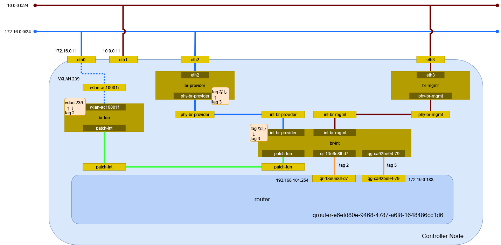

# ルータ (Open vSwitch)

## 前提条件

* [](../network/ovs_flat) を作成していること。
* [](../network/ovs_vxlan) を作成していること。

## ルータの作成

ルータを作成する。

```sh
openstack router create router
```

```
+-------------------------+--------------------------------------+
| Field                   | Value                                |
+-------------------------+--------------------------------------+
| admin_state_up          | UP                                   |
| availability_zone_hints |                                      |
| availability_zones      |                                      |
| created_at              | 2024-05-01T11:01:23Z                 |
| description             |                                      |
| external_gateway_info   | null                                 |
| flavor_id               | None                                 |
| id                      | 53a57af7-4963-4d2e-88c9-5ef0b999c507 |
| name                    | router                               |
| project_id              | f2aeffb34ff34ffb8959f1cd813655c6     |
| revision_number         | 1                                    |
| routes                  |                                      |
| status                  | ACTIVE                               |
| tags                    |                                      |
| updated_at              | 2024-05-01T11:01:23Z                 |
+-------------------------+--------------------------------------+
```

## サブネットに接続

ルータ router をサブネット selfservice に接続する。

```sh
openstack router add subnet router selfservice
```

## ゲートウェイの設定

ルータ router のゲートウェイを設定する。

```sh
openstack router set router --external-gateway provider
```

## ポートの確認

ルータ router に作成されたポートを確認する。


```{note}
再確認
```

```sh
openstack port list --router router
```

```
+--------------------------------------+------+-------------------+------------------------------------------------------------------------------+--------+
| ID                                   | Name | MAC Address       | Fixed IP Addresses                                                           | Status |
+--------------------------------------+------+-------------------+------------------------------------------------------------------------------+--------+
| d43193bb-c200-4437-bdde-887f4004004d |      | fa:16:3e:53:06:1c | ip_address='192.168.101.1', subnet_id='f09a54e3-3b18-4dfa-9dda-423ed0641889' | ACTIVE |
+--------------------------------------+------+-------------------+------------------------------------------------------------------------------+--------+
```

## 環境の確認

Controller Node でネットワーク構成を確認する。



### ネットワーク名前空間

ルータを作成するとネットワーク名前空間が作成される。

```sh
ip netns
```

```
(...)

qrouter-53a57af7-4963-4d2e-88c9-5ef0b999c507 (id: 3)
```

### デバイス

デバイスに変更はない。

```sh
ip -d link show
```

```
(...)

```

ネットワーク名前空間内のデバイスを確認する。

```sh
ip netns exec qrouter-53a57af7-4963-4d2e-88c9-5ef0b999c507 ip -d link show
```

```
1: lo: <LOOPBACK,UP,LOWER_UP> mtu 65536 qdisc noqueue state UNKNOWN mode DEFAULT group default qlen 1000
    link/loopback 00:00:00:00:00:00 brd 00:00:00:00:00:00 promiscuity 0 minmtu 0 maxmtu 0 addrgenmode eui64 numtxqueues 1 numrxqueues 1 gso_max_size 65536 gso_max_segs 65535
15: qr-d43193bb-c2: <BROADCAST,MULTICAST,UP,LOWER_UP> mtu 1450 qdisc noqueue state UNKNOWN mode DEFAULT group default qlen 1000
    link/ether fa:16:3e:53:06:1c brd ff:ff:ff:ff:ff:ff promiscuity 1 minmtu 68 maxmtu 65535
    openvswitch addrgenmode eui64 numtxqueues 1 numrxqueues 1 gso_max_size 65536 gso_max_segs 65535
16: qg-cfe4de6d-40: <BROADCAST,MULTICAST,UP,LOWER_UP> mtu 1500 qdisc noqueue state UNKNOWN mode DEFAULT group default qlen 1000
    link/ether fa:16:3e:9c:29:4a brd ff:ff:ff:ff:ff:ff promiscuity 1 minmtu 68 maxmtu 65535
    openvswitch addrgenmode eui64 numtxqueues 1 numrxqueues 1 gso_max_size 65536 gso_max_segs 65535
```

### Open vSwitch

ブリッジを確認する。

```sh
ovs-vsctl show
```

```
77a2e96a-ca65-449f-afc7-c7cbe9dff27c
    Manager "ptcp:6640:127.0.0.1"
        is_connected: true
    Bridge br-tun
        Controller "tcp:127.0.0.1:6633"
            is_connected: true
        fail_mode: secure
        datapath_type: system
        Port br-tun
            Interface br-tun
                type: internal
        Port patch-int
            Interface patch-int
                type: patch
                options: {peer=patch-tun}
        Port vxlan-ac10001f
            Interface vxlan-ac10001f
                type: vxlan
                options: {df_default="true", egress_pkt_mark="0", in_key=flow, local_ip="172.16.0.11", out_key=flow, remote_ip="172.16.0.31"}
    Bridge br-int
        Controller "tcp:127.0.0.1:6633"
            is_connected: true
        fail_mode: secure
        datapath_type: system
        Port int-br-provider
            Interface int-br-provider
                type: patch
                options: {peer=phy-br-provider}
        Port tap86f066d2-2b
            tag: 3
            Interface tap86f066d2-2b
                type: internal
        Port qr-d43193bb-c2
            tag: 3
            Interface qr-d43193bb-c2
                type: internal
        Port br-int
            Interface br-int
                type: internal
        Port tap43bf8dcc-08
            tag: 2
            Interface tap43bf8dcc-08
                type: internal
        Port qg-cfe4de6d-40
            tag: 2
            Interface qg-cfe4de6d-40
                type: internal
        Port patch-tun
            Interface patch-tun
                type: patch
                options: {peer=patch-int}
        Port tapeb4f2e2e-d9
            tag: 1
            Interface tapeb4f2e2e-d9
                type: internal
    Bridge br-provider
        Controller "tcp:127.0.0.1:6633"
            is_connected: true
        fail_mode: secure
        datapath_type: system
        Port eth0
            Interface eth0
                type: system
        Port phy-br-provider
            Interface phy-br-provider
                type: patch
                options: {peer=int-br-provider}
        Port br-provider
            Interface br-provider
                type: internal
    ovs_version: "3.1.4"
```

フローのエントリを確認する。

```sh
ovs-ofctl dump-flows br-tun
```

```
 cookie=0x80c150197bf57676, duration=2696.126s, table=0, n_packets=184, n_bytes=25388, priority=1,in_port="patch-int" actions=resubmit(,2)
 cookie=0x80c150197bf57676, duration=2442.728s, table=0, n_packets=0, n_bytes=0, priority=1,in_port="vxlan-ac10001f" actions=resubmit(,4)
 cookie=0x80c150197bf57676, duration=2696.125s, table=0, n_packets=0, n_bytes=0, priority=0 actions=drop
 cookie=0x80c150197bf57676, duration=2696.124s, table=2, n_packets=13, n_bytes=1254, priority=0,dl_dst=00:00:00:00:00:00/01:00:00:00:00:00 actions=resubmit(,20)
 cookie=0x80c150197bf57676, duration=2696.123s, table=2, n_packets=171, n_bytes=24134, priority=0,dl_dst=01:00:00:00:00:00/01:00:00:00:00:00 actions=resubmit(,22)
 cookie=0x80c150197bf57676, duration=2696.122s, table=3, n_packets=0, n_bytes=0, priority=0 actions=drop
 cookie=0x80c150197bf57676, duration=2591.058s, table=4, n_packets=0, n_bytes=0, priority=1,tun_id=0xcb actions=mod_vlan_vid:3,resubmit(,10)
 cookie=0x80c150197bf57676, duration=2696.121s, table=4, n_packets=0, n_bytes=0, priority=0 actions=drop
 cookie=0x80c150197bf57676, duration=2696.120s, table=6, n_packets=0, n_bytes=0, priority=0 actions=drop
 cookie=0x80c150197bf57676, duration=2696.119s, table=10, n_packets=0, n_bytes=0, priority=1 actions=learn(table=20,hard_timeout=300,priority=1,cookie=0x80c150197bf57676,NXM_OF_VLAN_TCI[0..11],NXM_OF_ETH_DST[]=NXM_OF_ETH_SRC[],load:0->NXM_OF_VLAN_TCI[],load:NXM_NX_TUN_ID[]->NXM_NX_TUN_ID[],output:OXM_OF_IN_PORT[]),output:"patch-int"
 cookie=0x80c150197bf57676, duration=2696.118s, table=20, n_packets=13, n_bytes=1254, priority=0 actions=resubmit(,22)
 cookie=0x80c150197bf57676, duration=2442.726s, table=22, n_packets=19, n_bytes=1258, priority=1,dl_vlan=3 actions=strip_vlan,load:0xcb->NXM_NX_TUN_ID[],output:"vxlan-ac10001f"
 cookie=0x80c150197bf57676, duration=2696.116s, table=22, n_packets=165, n_bytes=24130, priority=0 actions=drop
```

```sh
ovs-ofctl dump-flows br-provider
```

```
 cookie=0xb8ea637f538342d7, duration=2639.997s, table=0, n_packets=6, n_bytes=420, priority=4,in_port="phy-br-provider",dl_vlan=1 actions=mod_vlan_vid:100,NORMAL
 cookie=0xb8ea637f538342d7, duration=2639.991s, table=0, n_packets=24, n_bytes=1608, priority=4,in_port="phy-br-provider",dl_vlan=2 actions=strip_vlan,NORMAL
 cookie=0xb8ea637f538342d7, duration=2745.062s, table=0, n_packets=19, n_bytes=1258, priority=2,in_port="phy-br-provider" actions=drop
 cookie=0xb8ea637f538342d7, duration=2745.065s, table=0, n_packets=162, n_bytes=25182, priority=0 actions=NORMAL
```

```sh
ovs-ofctl dump-flows br-int
```

```
 cookie=0xbe0b5b07e55b958, duration=2765.552s, table=0, n_packets=0, n_bytes=0, priority=65535,dl_vlan=4095 actions=drop
 cookie=0xbe0b5b07e55b958, duration=2660.471s, table=0, n_packets=0, n_bytes=0, priority=3,in_port="int-br-provider",dl_vlan=100 actions=mod_vlan_vid:1,resubmit(,59)
 cookie=0xbe0b5b07e55b958, duration=2660.465s, table=0, n_packets=139, n_bytes=22970, priority=3,in_port="int-br-provider",vlan_tci=0x0000/0x1fff actions=mod_vlan_vid:2,resubmit(,59)
 cookie=0xbe0b5b07e55b958, duration=2765.538s, table=0, n_packets=4, n_bytes=868, priority=2,in_port="int-br-provider" actions=drop
 cookie=0xbe0b5b07e55b958, duration=2765.556s, table=0, n_packets=81, n_bytes=5814, priority=0 actions=resubmit(,59)
 cookie=0xbe0b5b07e55b958, duration=2765.557s, table=23, n_packets=0, n_bytes=0, priority=0 actions=drop
 cookie=0xbe0b5b07e55b958, duration=2765.553s, table=24, n_packets=0, n_bytes=0, priority=0 actions=drop
 cookie=0xbe0b5b07e55b958, duration=2765.550s, table=30, n_packets=0, n_bytes=0, priority=0 actions=resubmit(,59)
 cookie=0xbe0b5b07e55b958, duration=2765.548s, table=31, n_packets=0, n_bytes=0, priority=0 actions=resubmit(,59)
 cookie=0xbe0b5b07e55b958, duration=2765.555s, table=59, n_packets=220, n_bytes=28784, priority=0 actions=resubmit(,60)
 cookie=0xbe0b5b07e55b958, duration=2659.670s, table=60, n_packets=6, n_bytes=420, priority=100,in_port="tapeb4f2e2e-d9" actions=load:0x6->NXM_NX_REG5[],load:0x1->NXM_NX_REG6[],resubmit(,73)
 cookie=0xbe0b5b07e55b958, duration=2659.670s, table=60, n_packets=6, n_bytes=420, priority=100,in_port="tap43bf8dcc-08" actions=load:0x3->NXM_NX_REG5[],load:0x2->NXM_NX_REG6[],resubmit(,73)
 cookie=0xbe0b5b07e55b958, duration=2659.670s, table=60, n_packets=6, n_bytes=420, priority=100,in_port="tap86f066d2-2b" actions=load:0x4->NXM_NX_REG5[],load:0x3->NXM_NX_REG6[],resubmit(,73)
 cookie=0xbe0b5b07e55b958, duration=431.744s, table=60, n_packets=13, n_bytes=838, priority=100,in_port="qr-d43193bb-c2" actions=load:0x8->NXM_NX_REG5[],load:0x3->NXM_NX_REG6[],resubmit(,73)
 cookie=0xbe0b5b07e55b958, duration=413.776s, table=60, n_packets=18, n_bytes=1188, priority=100,in_port="qg-cfe4de6d-40" actions=load:0xa->NXM_NX_REG5[],load:0x2->NXM_NX_REG6[],resubmit(,73)
 cookie=0xbe0b5b07e55b958, duration=2765.554s, table=60, n_packets=171, n_bytes=25498, priority=3 actions=NORMAL
 cookie=0xbe0b5b07e55b958, duration=2765.551s, table=62, n_packets=0, n_bytes=0, priority=3 actions=NORMAL
 cookie=0xbe0b5b07e55b958, duration=2663.734s, table=71, n_packets=0, n_bytes=0, priority=110,ct_state=+trk actions=ct_clear,resubmit(,71)
 cookie=0xbe0b5b07e55b958, duration=2663.788s, table=71, n_packets=0, n_bytes=0, priority=0 actions=drop
 cookie=0xbe0b5b07e55b958, duration=2663.772s, table=72, n_packets=0, n_bytes=0, priority=0 actions=drop
 cookie=0xbe0b5b07e55b958, duration=2659.670s, table=73, n_packets=6, n_bytes=420, priority=80,reg5=0x6 actions=resubmit(,94)
 cookie=0xbe0b5b07e55b958, duration=2659.670s, table=73, n_packets=6, n_bytes=420, priority=80,reg5=0x3 actions=resubmit(,94)
 cookie=0xbe0b5b07e55b958, duration=2659.670s, table=73, n_packets=6, n_bytes=420, priority=80,reg5=0x4 actions=resubmit(,94)
 cookie=0xbe0b5b07e55b958, duration=431.744s, table=73, n_packets=13, n_bytes=838, priority=80,reg5=0x8 actions=resubmit(,94)
 cookie=0xbe0b5b07e55b958, duration=413.776s, table=73, n_packets=18, n_bytes=1188, priority=80,reg5=0xa actions=resubmit(,94)
 cookie=0xbe0b5b07e55b958, duration=2663.762s, table=73, n_packets=0, n_bytes=0, priority=0 actions=drop
 cookie=0xbe0b5b07e55b958, duration=2663.752s, table=81, n_packets=0, n_bytes=0, priority=0 actions=drop
 cookie=0xbe0b5b07e55b958, duration=2663.743s, table=82, n_packets=0, n_bytes=0, priority=0 actions=drop
 cookie=0xbe0b5b07e55b958, duration=2663.716s, table=91, n_packets=0, n_bytes=0, priority=1 actions=resubmit(,94)
 cookie=0xbe0b5b07e55b958, duration=2663.705s, table=92, n_packets=0, n_bytes=0, priority=0 actions=drop
 cookie=0xbe0b5b07e55b958, duration=2663.697s, table=93, n_packets=0, n_bytes=0, priority=0 actions=drop
 cookie=0xbe0b5b07e55b958, duration=2663.725s, table=94, n_packets=49, n_bytes=3286, priority=1 actions=NORMAL
```

データパスを確認する。

```sh
ovs-dpctl show
```

```
system@ovs-system:
  lookups: hit:139 missed:112 lost:0
  flows: 0
  masks: hit:302 total:0 hit/pkt:1.20
  cache: hit:74 hit-rate:29.48%
  caches:
    masks-cache: size:256
  port 0: ovs-system (internal)
  port 1: vxlan_sys_4789 (vxlan: packet_type=ptap)
  port 2: br-tun (internal)
  port 3: tap86f066d2-2b (internal)
  port 4: tap43bf8dcc-08 (internal)
  port 5: br-int (internal)
  port 6: tapeb4f2e2e-d9 (internal)
  port 7: eth0
  port 8: br-provider (internal)
  port 9: qr-d43193bb-c2 (internal)
  port 10: qg-cfe4de6d-40 (internal)
```

```sh
ovs-appctl ofproto/list-tunnels
```

```
port 1: vxlan-ac10001f (vxlan: 172.16.0.11->172.16.0.31, key=flow, legacy_l2, dp port=1, ttl=64)
```

### イーサネット

イーサネットの情報を確認する。

```sh
ip addr show
```

```
(...)
```

ネットワーク名前空間内のイーサネットの情報を確認する。

```sh
ip netns exec qrouter-53a57af7-4963-4d2e-88c9-5ef0b999c507 ip addr show
```

```
1: lo: <LOOPBACK,UP,LOWER_UP> mtu 65536 qdisc noqueue state UNKNOWN group default qlen 1000
    link/loopback 00:00:00:00:00:00 brd 00:00:00:00:00:00
    inet 127.0.0.1/8 scope host lo
       valid_lft forever preferred_lft forever
    inet6 ::1/128 scope host
       valid_lft forever preferred_lft forever
15: qr-d43193bb-c2: <BROADCAST,MULTICAST,UP,LOWER_UP> mtu 1450 qdisc noqueue state UNKNOWN group default qlen 1000
    link/ether fa:16:3e:53:06:1c brd ff:ff:ff:ff:ff:ff
    inet 192.168.101.1/24 brd 192.168.101.255 scope global qr-d43193bb-c2
       valid_lft forever preferred_lft forever
    inet6 fe80::f816:3eff:fe53:61c/64 scope link
       valid_lft forever preferred_lft forever
16: qg-cfe4de6d-40: <BROADCAST,MULTICAST,UP,LOWER_UP> mtu 1500 qdisc noqueue state UNKNOWN group default qlen 1000
    link/ether fa:16:3e:9c:29:4a brd ff:ff:ff:ff:ff:ff
    inet 172.17.0.97/12 brd 172.31.255.255 scope global qg-cfe4de6d-40
       valid_lft forever preferred_lft forever
    inet6 fe80::f816:3eff:fe9c:294a/64 scope link
       valid_lft forever preferred_lft forever
```

ルーティングを確認する。

```sh
ip netns exec qrouter-53a57af7-4963-4d2e-88c9-5ef0b999c507 ip route show
```

```
172.16.0.0/12 dev qg-cfe4de6d-40 proto kernel scope link src 172.17.0.97
192.168.101.0/24 dev qr-d43193bb-c2 proto kernel scope link src 192.168.101.1
```

待ち受けているポートを確認する。

```sh
ip netns exec qrouter-53a57af7-4963-4d2e-88c9-5ef0b999c507 ss -ano -4
```

メタデータのポートが待ち受けている。

```
Netid                          State                           Recv-Q                          Send-Q                                                   Local Address:Port                                                   Peer Address:Port                         Process
tcp                            LISTEN                          0                               128                                                            0.0.0.0:9697                                                        0.0.0.0:*
```
