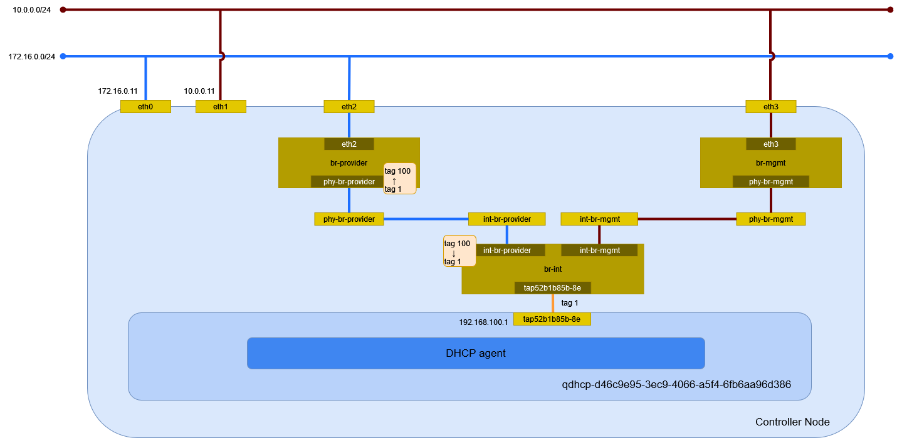

# vlan ネットワーク (Open vSwitch)

Open vSwitch を利用した vlan ネットワークを作成する。

## 前提条件

* [](../../installation/controller/neutron_ovs/vlan) を設定していること。

## 外部ネットワークの作成

eth0 に繋がる外部ネットワークに vlan ネットワークを作成する。

| オプション                  | 説明                         |
| --------------------------- | ---------------------------- |
| --provider-segment          | VLAN ID                      |

```sh
openstack network create \
    --share \
    --external \
    --provider-physical-network provider \
    --provider-network-type vlan \
    --provider-segment 100 \
    provider-100
```

```
+---------------------------+--------------------------------------+
| Field                     | Value                                |
+---------------------------+--------------------------------------+
| admin_state_up            | UP                                   |
| availability_zone_hints   |                                      |
| availability_zones        |                                      |
| created_at                | 2024-04-21T15:14:59Z                 |
| description               |                                      |
| dns_domain                | None                                 |
| id                        | fab2345c-5de9-4fda-8342-f0430a9239ea |
| ipv4_address_scope        | None                                 |
| ipv6_address_scope        | None                                 |
| is_default                | False                                |
| is_vlan_transparent       | None                                 |
| mtu                       | 1500                                 |
| name                      | provider-100                         |
| port_security_enabled     | True                                 |
| project_id                | 1e3ac7ae10e24515a0956beaa1d8073c     |
| provider:network_type     | vlan                                 |
| provider:physical_network | provider                             |
| provider:segmentation_id  | 100                                  |
| qos_policy_id             | None                                 |
| revision_number           | 1                                    |
| router:external           | External                             |
| segments                  | None                                 |
| shared                    | True                                 |
| status                    | ACTIVE                               |
| subnets                   |                                      |
| tags                      |                                      |
| updated_at                | 2024-04-21T15:14:59Z                 |
+---------------------------+--------------------------------------+
```

## サブネットの作成

サブネットを作成する。

```sh
openstack subnet create \
    --network provider-100 \
    --allocation-pool start=192.168.100.2,end=192.168.100.254 \
    --gateway 192.168.100.1 \
    --subnet-range 192.168.100.0/24 \
    provider-100
```

```
+----------------------+--------------------------------------+
| Field                | Value                                |
+----------------------+--------------------------------------+
| allocation_pools     | 192.168.100.2-192.168.100.254        |
| cidr                 | 192.168.100.0/24                     |
| created_at           | 2024-04-21T15:15:44Z                 |
| description          |                                      |
| dns_nameservers      |                                      |
| dns_publish_fixed_ip | None                                 |
| enable_dhcp          | True                                 |
| gateway_ip           | 192.168.100.1                        |
| host_routes          |                                      |
| id                   | c3777c6e-1af2-49b1-baf5-d69213851d59 |
| ip_version           | 4                                    |
| ipv6_address_mode    | None                                 |
| ipv6_ra_mode         | None                                 |
| name                 | provider-100                         |
| network_id           | fab2345c-5de9-4fda-8342-f0430a9239ea |
| project_id           | 1e3ac7ae10e24515a0956beaa1d8073c     |
| revision_number      | 0                                    |
| segment_id           | None                                 |
| service_types        |                                      |
| subnetpool_id        | None                                 |
| tags                 |                                      |
| updated_at           | 2024-04-21T15:15:44Z                 |
+----------------------+--------------------------------------+
```

DHCP サーバのポートの作成を確認する。

```sh
openstack port list
```

```
+--------------------------------------+------+-------------------+------------------------------------------------------------------------------+--------+
| ID                                   | Name | MAC Address       | Fixed IP Addresses                                                           | Status |
+--------------------------------------+------+-------------------+------------------------------------------------------------------------------+--------+
| eb4f2e2e-d94b-4b73-beec-0854f9a7be96 |      | fa:16:3e:8a:1b:88 | ip_address='192.168.100.2', subnet_id='c3777c6e-1af2-49b1-baf5-d69213851d59' | ACTIVE |
+--------------------------------------+------+-------------------+------------------------------------------------------------------------------+--------+
```

```sh
openstack port show eb4f2e2e-d94b-4b73-beec-0854f9a7be96
```


```
+-------------------------+---------------------------------------------------------------------------------------------------------------------------------------------+
| Field                   | Value                                                                                                                                       |
+-------------------------+---------------------------------------------------------------------------------------------------------------------------------------------+
| admin_state_up          | UP                                                                                                                                          |
| allowed_address_pairs   |                                                                                                                                             |
| binding_host_id         | controller.home.local                                                                                                                       |
| binding_profile         |                                                                                                                                             |
| binding_vif_details     | bound_drivers.0='openvswitch', bridge_name='br-int', connectivity='l2', datapath_type='system', ovs_hybrid_plug='False', port_filter='True' |
| binding_vif_type        | ovs                                                                                                                                         |
| binding_vnic_type       | normal                                                                                                                                      |
| created_at              | 2024-04-21T15:15:45Z                                                                                                                        |
| data_plane_status       | None                                                                                                                                        |
| description             |                                                                                                                                             |
| device_id               | dhcpd3377d3c-a0d1-5d71-9947-f17125c357bb-fab2345c-5de9-4fda-8342-f0430a9239ea                                                               |
| device_owner            | network:dhcp                                                                                                                                |
| device_profile          | None                                                                                                                                        |
| dns_assignment          | None                                                                                                                                        |
| dns_domain              | None                                                                                                                                        |
| dns_name                | None                                                                                                                                        |
| extra_dhcp_opts         |                                                                                                                                             |
| fixed_ips               | ip_address='192.168.100.2', subnet_id='c3777c6e-1af2-49b1-baf5-d69213851d59'                                                                |
| id                      | eb4f2e2e-d94b-4b73-beec-0854f9a7be96                                                                                                        |
| ip_allocation           | None                                                                                                                                        |
| mac_address             | fa:16:3e:8a:1b:88                                                                                                                           |
| name                    |                                                                                                                                             |
| network_id              | fab2345c-5de9-4fda-8342-f0430a9239ea                                                                                                        |
| numa_affinity_policy    | None                                                                                                                                        |
| port_security_enabled   | False                                                                                                                                       |
| project_id              | 1e3ac7ae10e24515a0956beaa1d8073c                                                                                                            |
| propagate_uplink_status | None                                                                                                                                        |
| qos_network_policy_id   | None                                                                                                                                        |
| qos_policy_id           | None                                                                                                                                        |
| resource_request        | None                                                                                                                                        |
| revision_number         | 3                                                                                                                                           |
| security_group_ids      |                                                                                                                                             |
| status                  | ACTIVE                                                                                                                                      |
| tags                    |                                                                                                                                             |
| trunk_details           | None                                                                                                                                        |
| updated_at              | 2024-04-21T15:15:46Z                                                                                                                        |
+-------------------------+---------------------------------------------------------------------------------------------------------------------------------------------+
```

## 環境の確認

Controller Node でネットワーク構成を確認する。



### ネットワーク名前空間

サブネットを作成するとネットワーク名前空間が作成される。

```sh
ip netns
```

```
qdhcp-fab2345c-5de9-4fda-8342-f0430a9239ea (id: 1)
```

### デバイス

デバイスを確認する。

```sh
ip -d link show
```

```
1: lo: <LOOPBACK,UP,LOWER_UP> mtu 65536 qdisc noqueue state UNKNOWN mode DEFAULT group default qlen 1000
    link/loopback 00:00:00:00:00:00 brd 00:00:00:00:00:00 promiscuity 0 minmtu 0 maxmtu 0 addrgenmode eui64 numtxqueues 1 numrxqueues 1 gso_max_size 65536 gso_max_segs 65535
2: eth0: <BROADCAST,MULTICAST,UP,LOWER_UP> mtu 1500 qdisc mq master ovs-system state UP mode DEFAULT group default qlen 1000
    link/ether 00:15:5d:bf:ba:43 brd ff:ff:ff:ff:ff:ff promiscuity 1 minmtu 68 maxmtu 65521
    openvswitch_slave addrgenmode none numtxqueues 64 numrxqueues 64 gso_max_size 62780 gso_max_segs 65535 parentbus vmbus parentdev 32e6c4c2-ccf5-4432-b0ff-a854fd65c7e7
3: eth1: <BROADCAST,MULTICAST,UP,LOWER_UP> mtu 1500 qdisc mq state UP mode DEFAULT group default qlen 1000
    link/ether 00:15:5d:bf:ba:45 brd ff:ff:ff:ff:ff:ff promiscuity 0 minmtu 68 maxmtu 65521 addrgenmode none numtxqueues 64 numrxqueues 64 gso_max_size 62780 gso_max_segs 65535 parentbus vmbus parentdev d2418736-9a08-43b7-9980-c3f9ebbe063b
4: ovs-system: <BROADCAST,MULTICAST> mtu 1500 qdisc noop state DOWN mode DEFAULT group default qlen 1000
    link/ether fa:ee:58:cc:8a:e9 brd ff:ff:ff:ff:ff:ff promiscuity 1 minmtu 68 maxmtu 65535
    openvswitch addrgenmode eui64 numtxqueues 1 numrxqueues 1 gso_max_size 65536 gso_max_segs 65535
5: br-int: <BROADCAST,MULTICAST,UP,LOWER_UP> mtu 1500 qdisc noqueue state UNKNOWN mode DEFAULT group default qlen 1000
    link/ether a6:a9:0d:2e:19:4e brd ff:ff:ff:ff:ff:ff promiscuity 1 minmtu 68 maxmtu 65535
    openvswitch addrgenmode none numtxqueues 1 numrxqueues 1 gso_max_size 65536 gso_max_segs 65535
7: br-provider: <BROADCAST,MULTICAST,UP,LOWER_UP> mtu 1500 qdisc noqueue state UNKNOWN mode DEFAULT group default qlen 1000
    link/ether 00:15:5d:bf:ba:43 brd ff:ff:ff:ff:ff:ff promiscuity 1 minmtu 68 maxmtu 65535
    openvswitch addrgenmode none numtxqueues 1 numrxqueues 1 gso_max_size 65536 gso_max_segs 65535
```

ネットワーク名前空間内のデバイスを確認する。

```sh
ip netns exec qdhcp-fab2345c-5de9-4fda-8342-f0430a9239ea ip -d link show
```

```
1: lo: <LOOPBACK,UP,LOWER_UP> mtu 65536 qdisc noqueue state UNKNOWN mode DEFAULT group default qlen 1000
    link/loopback 00:00:00:00:00:00 brd 00:00:00:00:00:00 promiscuity 0 minmtu 0 maxmtu 0 addrgenmode eui64 numtxqueues 1 numrxqueues 1 gso_max_size 65536 gso_max_segs 65535
9: tapeb4f2e2e-d9: <BROADCAST,MULTICAST,UP,LOWER_UP> mtu 1500 qdisc noqueue state UNKNOWN mode DEFAULT group default qlen 1000
    link/ether fa:16:3e:8a:1b:88 brd ff:ff:ff:ff:ff:ff promiscuity 1 minmtu 68 maxmtu 65535
    openvswitch addrgenmode eui64 numtxqueues 1 numrxqueues 1 gso_max_size 65536 gso_max_segs 65535
```

### Open vSwitch

ブリッジを確認する。

```sh
ovs-vsctl show
```

```
77a2e96a-ca65-449f-afc7-c7cbe9dff27c
    Manager "ptcp:6640:127.0.0.1"
        is_connected: true
    Bridge br-int
        Controller "tcp:127.0.0.1:6633"
            is_connected: true
        fail_mode: secure
        datapath_type: system
        Port int-br-provider
            Interface int-br-provider
                type: patch
                options: {peer=phy-br-provider}
        Port tap43bf8dcc-08
            tag: 1
            Interface tap43bf8dcc-08
                type: internal
        Port br-int
            Interface br-int
                type: internal
        Port tapeb4f2e2e-d9
            tag: 2
            Interface tapeb4f2e2e-d9
                type: internal
    Bridge br-provider
        Controller "tcp:127.0.0.1:6633"
            is_connected: true
        fail_mode: secure
        datapath_type: system
        Port phy-br-provider
            Interface phy-br-provider
                type: patch
                options: {peer=int-br-provider}
        Port eth0
            Interface eth0
                type: system
        Port br-provider
            Interface br-provider
                type: internal
    ovs_version: "3.1.4"
```

フローを確認する。

```sh
ovs-ofctl show br-provider
```

```
OFPT_FEATURES_REPLY (xid=0x2): dpid:000000155dbfba43
n_tables:254, n_buffers:0
capabilities: FLOW_STATS TABLE_STATS PORT_STATS QUEUE_STATS ARP_MATCH_IP
actions: output enqueue set_vlan_vid set_vlan_pcp strip_vlan mod_dl_src mod_dl_dst mod_nw_src mod_nw_dst mod_nw_tos mod_tp_src mod_tp_dst
 1(eth0): addr:00:15:5d:bf:ba:43
     config:     0
     state:      0
     current:    10GB-FD
     speed: 10000 Mbps now, 0 Mbps max
 2(phy-br-provider): addr:5e:20:69:de:cd:70
     config:     0
     state:      0
     speed: 0 Mbps now, 0 Mbps max
 LOCAL(br-provider): addr:00:15:5d:bf:ba:43
     config:     0
     state:      0
     speed: 0 Mbps now, 0 Mbps max
OFPT_GET_CONFIG_REPLY (xid=0x4): frags=normal miss_send_len=0
```

```sh
ovs-ofctl show br-int
```

```
OFPT_FEATURES_REPLY (xid=0x2): dpid:0000a6a90d2e194e
n_tables:254, n_buffers:0
capabilities: FLOW_STATS TABLE_STATS PORT_STATS QUEUE_STATS ARP_MATCH_IP
actions: output enqueue set_vlan_vid set_vlan_pcp strip_vlan mod_dl_src mod_dl_dst mod_nw_src mod_nw_dst mod_nw_tos mod_tp_src mod_tp_dst
 1(int-br-provider): addr:9a:1d:c7:f7:e2:e3
     config:     0
     state:      0
     speed: 0 Mbps now, 0 Mbps max
 3(tap43bf8dcc-08): addr:fa:16:3e:4a:1e:19
     config:     0
     state:      0
     speed: 0 Mbps now, 0 Mbps max
 4(tapeb4f2e2e-d9): addr:fa:16:3e:8a:1b:88
     config:     0
     state:      0
     speed: 0 Mbps now, 0 Mbps max
 LOCAL(br-int): addr:a6:a9:0d:2e:19:4e
     config:     0
     state:      0
     speed: 0 Mbps now, 0 Mbps max
OFPT_GET_CONFIG_REPLY (xid=0x4): frags=normal miss_send_len=0
```

フローのエントリを確認する。

```sh
ovs-ofctl dump-flows br-provider
```

```
 cookie=0x9fba6e75740388b9, duration=2414.056s, table=0, n_packets=71, n_bytes=8401, priority=4,in_port="phy-br-provider",dl_vlan=1 actions=strip_vlan,NORMAL
 cookie=0x9fba6e75740388b9, duration=1229.403s, table=0, n_packets=11, n_bytes=810, priority=4,in_port="phy-br-provider",dl_vlan=2 actions=mod_vlan_vid:100,NORMAL
 cookie=0x9fba6e75740388b9, duration=2481.267s, table=0, n_packets=0, n_bytes=0, priority=2,in_port="phy-br-provider" actions=drop
 cookie=0x9fba6e75740388b9, duration=2481.270s, table=0, n_packets=287, n_bytes=34206, priority=0 actions=NORMAL
```

ポート phy-br-provider に入力されるパケットの VLAN タグ 2 は VLAN タグ 100 に変換される。

```sh
ovs-ofctl dump-flows br-int
```

```
 cookie=0xee4879dbd0a3d7e0, duration=2507.035s, table=0, n_packets=0, n_bytes=0, priority=65535,dl_vlan=4095 actions=drop
 cookie=0xee4879dbd0a3d7e0, duration=2439.779s, table=0, n_packets=287, n_bytes=34206, priority=3,in_port="int-br-provider",vlan_tci=0x0000/0x1fff actions=mod_vlan_vid:1,resubmit(,59)
 cookie=0xee4879dbd0a3d7e0, duration=1255.126s, table=0, n_packets=0, n_bytes=0, priority=3,in_port="int-br-provider",dl_vlan=100 actions=mod_vlan_vid:2,resubmit(,59)
 cookie=0xee4879dbd0a3d7e0, duration=2506.992s, table=0, n_packets=0, n_bytes=0, priority=2,in_port="int-br-provider" actions=drop
 cookie=0xee4879dbd0a3d7e0, duration=2507.058s, table=0, n_packets=88, n_bytes=9743, priority=0 actions=resubmit(,59)
 cookie=0xee4879dbd0a3d7e0, duration=2507.071s, table=23, n_packets=0, n_bytes=0, priority=0 actions=drop
 cookie=0xee4879dbd0a3d7e0, duration=2507.036s, table=24, n_packets=0, n_bytes=0, priority=0 actions=drop
 cookie=0xee4879dbd0a3d7e0, duration=2507.028s, table=30, n_packets=0, n_bytes=0, priority=0 actions=resubmit(,59)
 cookie=0xee4879dbd0a3d7e0, duration=2507.017s, table=31, n_packets=0, n_bytes=0, priority=0 actions=resubmit(,59)
 cookie=0xee4879dbd0a3d7e0, duration=2507.046s, table=59, n_packets=375, n_bytes=43949, priority=0 actions=resubmit(,60)
 cookie=0xee4879dbd0a3d7e0, duration=2407.791s, table=60, n_packets=71, n_bytes=8401, priority=100,in_port="tap43bf8dcc-08" actions=load:0x3->NXM_NX_REG5[],load:0x1->NXM_NX_REG6[],resubmit(,73)
 cookie=0xee4879dbd0a3d7e0, duration=1253.090s, table=60, n_packets=11, n_bytes=810, priority=100,in_port="tapeb4f2e2e-d9" actions=load:0x4->NXM_NX_REG5[],load:0x2->NXM_NX_REG6[],resubmit(,73)
 cookie=0xee4879dbd0a3d7e0, duration=2507.039s, table=60, n_packets=293, n_bytes=34738, priority=3 actions=NORMAL
 cookie=0xee4879dbd0a3d7e0, duration=2507.032s, table=62, n_packets=0, n_bytes=0, priority=3 actions=NORMAL
 cookie=0xee4879dbd0a3d7e0, duration=2441.082s, table=71, n_packets=0, n_bytes=0, priority=110,ct_state=+trk actions=ct_clear,resubmit(,71)
 cookie=0xee4879dbd0a3d7e0, duration=2441.128s, table=71, n_packets=0, n_bytes=0, priority=0 actions=drop
 cookie=0xee4879dbd0a3d7e0, duration=2441.118s, table=72, n_packets=0, n_bytes=0, priority=0 actions=drop
 cookie=0xee4879dbd0a3d7e0, duration=2437.877s, table=73, n_packets=0, n_bytes=0, priority=80,reg5=0x2 actions=resubmit(,94)
 cookie=0xee4879dbd0a3d7e0, duration=2407.791s, table=73, n_packets=71, n_bytes=8401, priority=80,reg5=0x3 actions=resubmit(,94)
 cookie=0xee4879dbd0a3d7e0, duration=1253.090s, table=73, n_packets=11, n_bytes=810, priority=80,reg5=0x4 actions=resubmit(,94)
 cookie=0xee4879dbd0a3d7e0, duration=2441.108s, table=73, n_packets=0, n_bytes=0, priority=0 actions=drop
 cookie=0xee4879dbd0a3d7e0, duration=2441.099s, table=81, n_packets=0, n_bytes=0, priority=0 actions=drop
 cookie=0xee4879dbd0a3d7e0, duration=2441.090s, table=82, n_packets=0, n_bytes=0, priority=0 actions=drop
 cookie=0xee4879dbd0a3d7e0, duration=2441.064s, table=91, n_packets=0, n_bytes=0, priority=1 actions=resubmit(,94)
 cookie=0xee4879dbd0a3d7e0, duration=2441.055s, table=92, n_packets=0, n_bytes=0, priority=0 actions=drop
 cookie=0xee4879dbd0a3d7e0, duration=2441.047s, table=93, n_packets=0, n_bytes=0, priority=0 actions=drop
 cookie=0xee4879dbd0a3d7e0, duration=2441.072s, table=94, n_packets=82, n_bytes=9211, priority=1 actions=NORMAL
```

ポート int-br-provider に入力されるパケットの VLAN タグ 100 は VLAN タグ 2 に変換される。

### イーサネット

ネットワーク名前空間内のイーサネットの情報を確認する。
169.254.169.254 は Metadata agent が使用する。

```sh
ip netns exec qdhcp-fab2345c-5de9-4fda-8342-f0430a9239ea ip addr show
```

```
1: lo: <LOOPBACK,UP,LOWER_UP> mtu 65536 qdisc noqueue state UNKNOWN group default qlen 1000
    link/loopback 00:00:00:00:00:00 brd 00:00:00:00:00:00
    inet 127.0.0.1/8 scope host lo
       valid_lft forever preferred_lft forever
    inet6 ::1/128 scope host
       valid_lft forever preferred_lft forever
9: tapeb4f2e2e-d9: <BROADCAST,MULTICAST,UP,LOWER_UP> mtu 1500 qdisc noqueue state UNKNOWN group default qlen 1000
    link/ether fa:16:3e:8a:1b:88 brd ff:ff:ff:ff:ff:ff
    inet 192.168.100.2/24 brd 192.168.100.255 scope global tapeb4f2e2e-d9
       valid_lft forever preferred_lft forever
    inet 169.254.169.254/32 brd 169.254.169.254 scope global tapeb4f2e2e-d9
       valid_lft forever preferred_lft forever
    inet6 fe80::f816:3eff:fe8a:1b88/64 scope link
       valid_lft forever preferred_lft forever
```

ルーティングを確認する。

```sh
ip netns exec qdhcp-fab2345c-5de9-4fda-8342-f0430a9239ea ip route
```

```
default via 192.168.100.1 dev tapeb4f2e2e-d9 proto static
192.168.100.0/24 dev tapeb4f2e2e-d9 proto kernel scope link src 192.168.100.2
```

待ち受けているポートを確認する。

```sh
ip netns exec qdhcp-fab2345c-5de9-4fda-8342-f0430a9239ea ss -ano -4
```

```
Netid               State                Recv-Q                Send-Q                                 Local Address:Port                               Peer Address:Port               Process
udp                 UNCONN               0                     0                                          127.0.0.1:53                                      0.0.0.0:*
udp                 UNCONN               0                     0                                      192.168.100.2:53                                      0.0.0.0:*
udp                 UNCONN               0                     0                                    169.254.169.254:53                                      0.0.0.0:*
udp                 UNCONN               0                     0                                            0.0.0.0:67                                      0.0.0.0:*
tcp                 LISTEN               0                     128                                  169.254.169.254:80                                      0.0.0.0:*
tcp                 LISTEN               0                     32                                         127.0.0.1:53                                      0.0.0.0:*
tcp                 LISTEN               0                     32                                     192.168.100.2:53                                      0.0.0.0:*
tcp                 LISTEN               0                     32                                   169.254.169.254:53                                      0.0.0.0:*
```

### DHCP agent

dnsmasq のプロセスを確認する。

```sh
ps ax | grep dnsmasq
```

以下が動作していることが確認できる。

```
dnsmasq \
    --no-hosts \
    --no-resolv \
    --pid-file=/var/lib/neutron/dhcp/fab2345c-5de9-4fda-8342-f0430a9239ea/pid \
    --dhcp-hostsfile=/var/lib/neutron/dhcp/fab2345c-5de9-4fda-8342-f0430a9239ea/host \
    --addn-hosts=/var/lib/neutron/dhcp/fab2345c-5de9-4fda-8342-f0430a9239ea/addn_hosts \
    --dhcp-optsfile=/var/lib/neutron/dhcp/fab2345c-5de9-4fda-8342-f0430a9239ea/opts \
    --dhcp-leasefile=/var/lib/neutron/dhcp/fab2345c-5de9-4fda-8342-f0430a9239ea/leases \
    --dhcp-match=set:ipxe,175 \
    --dhcp-userclass=set:ipxe6,iPXE \
    --local-service \
    --bind-dynamic \
    --dhcp-range=set:subnet-c3777c6e-1af2-49b1-baf5-d69213851d59,192.168.100.0,static,255.255.255.0,86400s \
    --dhcp-option-force=option:mtu,1500 \
    --dhcp-lease-max=256 \
    --conf-file=/dev/null \
    --domain=openstacklocal
```

使用しているインターフェイスを確認する。

```sh
cat /var/lib/neutron/dhcp/fab2345c-5de9-4fda-8342-f0430a9239ea/interface
```

```
tapeb4f2e2e-d9
```
