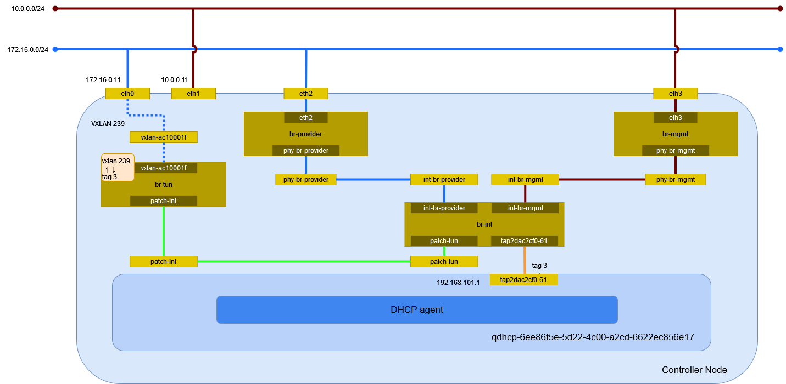

# vxlan ネットワーク (Open vSwitch)

Open vSwitch を利用した vxlan ネットワークを作成する。

## 前提条件

* Controller Node で [](../../installation/controller/neutron_ovs/vxlan) を設定していること。
* Compute Node で [](../../installation/compute/neutron_ovs/vxlan) を設定していること。

## セルフサービスネットワークの作成

```{tip}
myuser で実行
```

eth0 に繋がるセルフサービスネットワークとして vxlan ネットワークを作成する。

```sh
openstack network create selfservice
```

```
+---------------------------+--------------------------------------+
| Field                     | Value                                |
+---------------------------+--------------------------------------+
| admin_state_up            | UP                                   |
| availability_zone_hints   |                                      |
| availability_zones        |                                      |
| created_at                | 2024-05-16T15:17:20Z                 |
| description               |                                      |
| dns_domain                | None                                 |
| id                        | 6ee86f5e-5d22-4c00-a2cd-6622ec856e17 |
| ipv4_address_scope        | None                                 |
| ipv6_address_scope        | None                                 |
| is_default                | False                                |
| is_vlan_transparent       | None                                 |
| mtu                       | 1450                                 |
| name                      | selfservice                          |
| port_security_enabled     | True                                 |
| project_id                | bccf406c045d401b91ba5c7552a124ae     |
| provider:network_type     | vxlan                                |
| provider:physical_network | None                                 |
| provider:segmentation_id  | 239                                  |
| qos_policy_id             | None                                 |
| revision_number           | 1                                    |
| router:external           | Internal                             |
| segments                  | None                                 |
| shared                    | False                                |
| status                    | ACTIVE                               |
| subnets                   |                                      |
| tags                      |                                      |
| tenant_id                 | bccf406c045d401b91ba5c7552a124ae     |
| updated_at                | 2024-05-16T15:17:20Z                 |
+---------------------------+--------------------------------------+
```

## サブネットの作成

サブネットを作成する。

```sh
openstack subnet create \
    --network selfservice \
    --gateway 192.168.101.254 \
    --subnet-range 192.168.101.0/24 \
    selfservice
```

```
+----------------------+--------------------------------------+
| Field                | Value                                |
+----------------------+--------------------------------------+
| allocation_pools     | 192.168.101.1-192.168.101.253        |
| cidr                 | 192.168.101.0/24                     |
| created_at           | 2024-05-16T15:18:03Z                 |
| description          |                                      |
| dns_nameservers      |                                      |
| dns_publish_fixed_ip | None                                 |
| enable_dhcp          | True                                 |
| gateway_ip           | 192.168.101.254                      |
| host_routes          |                                      |
| id                   | 765053a1-4543-4732-a9ac-47065f945e9f |
| ip_version           | 4                                    |
| ipv6_address_mode    | None                                 |
| ipv6_ra_mode         | None                                 |
| name                 | selfservice                          |
| network_id           | 6ee86f5e-5d22-4c00-a2cd-6622ec856e17 |
| project_id           | bccf406c045d401b91ba5c7552a124ae     |
| revision_number      | 0                                    |
| segment_id           | None                                 |
| service_types        |                                      |
| subnetpool_id        | None                                 |
| tags                 |                                      |
| updated_at           | 2024-05-16T15:18:03Z                 |
+----------------------+--------------------------------------+
```

DHCP サーバのポートの作成を確認する。

```sh
openstack port list
```

```
+--------------------------------------+------+-------------------+--------------------------------------------------------------------------------+--------+
| ID                                   | Name | MAC Address       | Fixed IP Addresses                                                             | Status |
+--------------------------------------+------+-------------------+--------------------------------------------------------------------------------+--------+
| 2dac2cf0-6175-47d7-a98f-f561e30e1a49 |      | fa:16:3e:e9:26:5b | ip_address='192.168.101.1', subnet_id='765053a1-4543-4732-a9ac-47065f945e9f'   | ACTIVE |
+--------------------------------------+------+-------------------+--------------------------------------------------------------------------------+--------+
```

```sh
openstack port show 2dac2cf0-6175-47d7-a98f-f561e30e1a49
```

```
+-------------------------+---------------------------------------------------------------------------------------------------------------------------------------------+
| Field                   | Value                                                                                                                                       |
+-------------------------+---------------------------------------------------------------------------------------------------------------------------------------------+
| admin_state_up          | UP                                                                                                                                          |
| allowed_address_pairs   |                                                                                                                                             |
| binding_host_id         | controller.home.local                                                                                                                       |
| binding_profile         |                                                                                                                                             |
| binding_vif_details     | bound_drivers.0='openvswitch', bridge_name='br-int', connectivity='l2', datapath_type='system', ovs_hybrid_plug='False', port_filter='True' |
| binding_vif_type        | ovs                                                                                                                                         |
| binding_vnic_type       | normal                                                                                                                                      |
| created_at              | 2024-05-16T15:18:04Z                                                                                                                        |
| data_plane_status       | None                                                                                                                                        |
| description             |                                                                                                                                             |
| device_id               | dhcpd3377d3c-a0d1-5d71-9947-f17125c357bb-6ee86f5e-5d22-4c00-a2cd-6622ec856e17                                                               |
| device_owner            | network:dhcp                                                                                                                                |
| device_profile          | None                                                                                                                                        |
| dns_assignment          | None                                                                                                                                        |
| dns_domain              | None                                                                                                                                        |
| dns_name                | None                                                                                                                                        |
| extra_dhcp_opts         |                                                                                                                                             |
| fixed_ips               | ip_address='192.168.101.1', subnet_id='765053a1-4543-4732-a9ac-47065f945e9f'                                                                |
| hardware_offload_type   | None                                                                                                                                        |
| hints                   |                                                                                                                                             |
| id                      | 2dac2cf0-6175-47d7-a98f-f561e30e1a49                                                                                                        |
| ip_allocation           | None                                                                                                                                        |
| mac_address             | fa:16:3e:e9:26:5b                                                                                                                           |
| name                    |                                                                                                                                             |
| network_id              | 6ee86f5e-5d22-4c00-a2cd-6622ec856e17                                                                                                        |
| numa_affinity_policy    | None                                                                                                                                        |
| port_security_enabled   | False                                                                                                                                       |
| project_id              | bccf406c045d401b91ba5c7552a124ae                                                                                                            |
| propagate_uplink_status | None                                                                                                                                        |
| resource_request        | None                                                                                                                                        |
| revision_number         | 3                                                                                                                                           |
| qos_network_policy_id   | None                                                                                                                                        |
| qos_policy_id           | None                                                                                                                                        |
| security_group_ids      |                                                                                                                                             |
| status                  | ACTIVE                                                                                                                                      |
| tags                    |                                                                                                                                             |
| trunk_details           | None                                                                                                                                        |
| updated_at              | 2024-05-16T15:18:05Z                                                                                                                        |
+-------------------------+---------------------------------------------------------------------------------------------------------------------------------------------+
```

## 環境の確認

Controller Node でネットワーク構成を確認する。



### ネットワーク名前空間

サブネットを作成するとネットワーク名前空間が作成される。

```sh
ip netns
```

```
(...)

qdhcp-6ee86f5e-5d22-4c00-a2cd-6622ec856e17 (id: 2)
```

### デバイス

ブリッジが作成される。

```sh
ip -d link show
```

```
1: lo: <LOOPBACK,UP,LOWER_UP> mtu 65536 qdisc noqueue state UNKNOWN mode DEFAULT group default qlen 1000
    link/loopback 00:00:00:00:00:00 brd 00:00:00:00:00:00 promiscuity 0  allmulti 0 minmtu 0 maxmtu 0 addrgenmode eui64 numtxqueues 1 numrxqueues 1 gso_max_size 65536 gso_max_segs 65535 tso_max_size 524280 tso_max_segs 65535 gro_max_size 65536
2: eth0: <BROADCAST,MULTICAST,UP,LOWER_UP> mtu 1500 qdisc mq state UP mode DEFAULT group default qlen 1000
    link/ether 00:15:5d:bf:ba:4f brd ff:ff:ff:ff:ff:ff promiscuity 0  allmulti 0 minmtu 68 maxmtu 65521 addrgenmode none numtxqueues 64 numrxqueues 64 gso_max_size 62780 gso_max_segs 65535 tso_max_size 62780 tso_max_segs 65535 gro_max_size 65536 parentbus vmbus parentdev b7c073a0-7837-4a9f-94e7-eba43ef222ef
3: eth1: <BROADCAST,MULTICAST,UP,LOWER_UP> mtu 1500 qdisc mq state UP mode DEFAULT group default qlen 1000
    link/ether 00:15:5d:bf:ba:54 brd ff:ff:ff:ff:ff:ff promiscuity 0  allmulti 0 minmtu 68 maxmtu 65521 addrgenmode none numtxqueues 64 numrxqueues 64 gso_max_size 62780 gso_max_segs 65535 tso_max_size 62780 tso_max_segs 65535 gro_max_size 65536 parentbus vmbus parentdev 0f15ccb6-3ab3-45ce-b737-a73ecf5a6339
4: eth2: <BROADCAST,MULTICAST,UP,LOWER_UP> mtu 1500 qdisc mq master ovs-system state UP mode DEFAULT group default qlen 1000
    link/ether 00:15:5d:bf:ba:55 brd ff:ff:ff:ff:ff:ff promiscuity 1  allmulti 0 minmtu 68 maxmtu 65521
    openvswitch_slave addrgenmode none numtxqueues 64 numrxqueues 64 gso_max_size 62780 gso_max_segs 65535 tso_max_size 62780 tso_max_segs 65535 gro_max_size 65536 parentbus vmbus parentdev dffbd9a0-19dd-44c1-9b46-6dfba9829d73
5: eth3: <BROADCAST,MULTICAST,UP,LOWER_UP> mtu 1500 qdisc mq master ovs-system state UP mode DEFAULT group default qlen 1000
    link/ether 00:15:5d:bf:ba:56 brd ff:ff:ff:ff:ff:ff promiscuity 1  allmulti 0 minmtu 68 maxmtu 65521
    openvswitch_slave addrgenmode none numtxqueues 64 numrxqueues 64 gso_max_size 62780 gso_max_segs 65535 tso_max_size 62780 tso_max_segs 65535 gro_max_size 65536 parentbus vmbus parentdev 31e9f926-7af1-481e-bf58-cbca38bc3cba
6: ovs-system: <BROADCAST,MULTICAST> mtu 1500 qdisc noop state DOWN mode DEFAULT group default qlen 1000
    link/ether ea:f2:71:7c:94:fc brd ff:ff:ff:ff:ff:ff promiscuity 1  allmulti 0 minmtu 68 maxmtu 65535
    openvswitch addrgenmode eui64 numtxqueues 1 numrxqueues 1 gso_max_size 65536 gso_max_segs 65535 tso_max_size 65536 tso_max_segs 65535 gro_max_size 65536
7: br-provider: <BROADCAST,MULTICAST,UP,LOWER_UP> mtu 1500 qdisc noqueue state UNKNOWN mode DEFAULT group default qlen 1000
    link/ether 00:15:5d:bf:ba:55 brd ff:ff:ff:ff:ff:ff promiscuity 1  allmulti 0 minmtu 68 maxmtu 65535
    openvswitch addrgenmode none numtxqueues 1 numrxqueues 1 gso_max_size 65536 gso_max_segs 65535 tso_max_size 65536 tso_max_segs 65535 gro_max_size 65536
8: br-mgmt: <BROADCAST,MULTICAST,UP,LOWER_UP> mtu 1500 qdisc noqueue state UNKNOWN mode DEFAULT group default qlen 1000
    link/ether 00:15:5d:bf:ba:56 brd ff:ff:ff:ff:ff:ff promiscuity 1  allmulti 0 minmtu 68 maxmtu 65535
    openvswitch addrgenmode none numtxqueues 1 numrxqueues 1 gso_max_size 65536 gso_max_segs 65535 tso_max_size 65536 tso_max_segs 65535 gro_max_size 65536
11: br-int: <BROADCAST,MULTICAST,UP,LOWER_UP> mtu 1500 qdisc noqueue state UNKNOWN mode DEFAULT group default qlen 1000
    link/ether 4a:73:de:e4:cd:4f brd ff:ff:ff:ff:ff:ff promiscuity 1  allmulti 0 minmtu 68 maxmtu 65535
    openvswitch addrgenmode none numtxqueues 1 numrxqueues 1 gso_max_size 65536 gso_max_segs 65535 tso_max_size 65536 tso_max_segs 65535 gro_max_size 65536
14: br-tun: <BROADCAST,MULTICAST> mtu 1500 qdisc noop state DOWN mode DEFAULT group default qlen 1000
    link/ether 56:a8:05:61:4b:43 brd ff:ff:ff:ff:ff:ff promiscuity 1  allmulti 0 minmtu 68 maxmtu 65535
    openvswitch addrgenmode eui64 numtxqueues 1 numrxqueues 1 gso_max_size 65536 gso_max_segs 65535 tso_max_size 65536 tso_max_segs 65535 gro_max_size 65536
15: vxlan_sys_4789: <BROADCAST,MULTICAST,UP,LOWER_UP> mtu 65000 qdisc noqueue master ovs-system state UNKNOWN mode DEFAULT group default qlen 1000
    link/ether 6e:2e:76:9a:8e:de brd ff:ff:ff:ff:ff:ff promiscuity 1  allmulti 0 minmtu 68 maxmtu 65535
    vxlan external id 0 srcport 0 0 dstport 4789 nolearning ttl auto ageing 300 udpcsum noudp6zerocsumtx udp6zerocsumrx
    openvswitch_slave addrgenmode eui64 numtxqueues 1 numrxqueues 1 gso_max_size 65536 gso_max_segs 65535 tso_max_size 65536 tso_max_segs 65535 gro_max_size 65536
```

ネットワーク名前空間内のデバイスを確認する。

```sh
ip netns exec qdhcp-6ee86f5e-5d22-4c00-a2cd-6622ec856e17 ip -d link show
```

```
1: lo: <LOOPBACK,UP,LOWER_UP> mtu 65536 qdisc noqueue state UNKNOWN mode DEFAULT group default qlen 1000
    link/loopback 00:00:00:00:00:00 brd 00:00:00:00:00:00 promiscuity 0  allmulti 0 minmtu 0 maxmtu 0 addrgenmode eui64 numtxqueues 1 numrxqueues 1 gso_max_size 65536 gso_max_segs 65535 tso_max_size 524280 tso_max_segs 65535 gro_max_size 65536
16: tap2dac2cf0-61: <BROADCAST,MULTICAST,UP,LOWER_UP> mtu 1450 qdisc noqueue state UNKNOWN mode DEFAULT group default qlen 1000
    link/ether fa:16:3e:e9:26:5b brd ff:ff:ff:ff:ff:ff promiscuity 1  allmulti 0 minmtu 68 maxmtu 65535
    openvswitch addrgenmode eui64 numtxqueues 1 numrxqueues 1 gso_max_size 65536 gso_max_segs 65535 tso_max_size 65536 tso_max_segs 65535 gro_max_size 65536
```

データパス(と同じ名前のブリッジ)に接続されたデバイスを確認する。

```sh
ip link show master ovs-system
```

```
4: eth2: <BROADCAST,MULTICAST,UP,LOWER_UP> mtu 1500 qdisc mq master ovs-system state UP mode DEFAULT group default qlen 1000
    link/ether 00:15:5d:bf:ba:55 brd ff:ff:ff:ff:ff:ff
5: eth3: <BROADCAST,MULTICAST,UP,LOWER_UP> mtu 1500 qdisc mq master ovs-system state UP mode DEFAULT group default qlen 1000
    link/ether 00:15:5d:bf:ba:56 brd ff:ff:ff:ff:ff:ff
15: vxlan_sys_4789: <BROADCAST,MULTICAST,UP,LOWER_UP> mtu 65000 qdisc noqueue master ovs-system state UNKNOWN mode DEFAULT group default qlen 1000
    link/ether 6e:2e:76:9a:8e:de brd ff:ff:ff:ff:ff:ff
```

### Open vSwitch

ブリッジを確認する。

VNI は `in_key`, `out_key` の設定に従って flow で決まる。

```sh
ovs-vsctl show
```

```
2a1ab795-d59f-4a33-a5a1-1fb4c942dce4
    Manager "ptcp:6640:127.0.0.1"
        is_connected: true
    Bridge br-tun
        Controller "tcp:127.0.0.1:6633"
            is_connected: true
        fail_mode: secure
        datapath_type: system
        Port vxlan-ac10001f
            Interface vxlan-ac10001f
                type: vxlan
                options: {df_default="true", egress_pkt_mark="0", in_key=flow, local_ip="172.16.0.11", out_key=flow, remote_ip="172.16.0.31"}
        Port patch-int
            Interface patch-int
                type: patch
                options: {peer=patch-tun}
        Port br-tun
            Interface br-tun
                type: internal
    Bridge br-provider
        Controller "tcp:127.0.0.1:6633"
            is_connected: true
        fail_mode: secure
        datapath_type: system
        Port phy-br-provider
            Interface phy-br-provider
                type: patch
                options: {peer=int-br-provider}
        Port eth2
            Interface eth2
                type: system
    Bridge br-mgmt
        Controller "tcp:127.0.0.1:6633"
            is_connected: true
        fail_mode: secure
        datapath_type: system
        Port eth3
            Interface eth3
                type: system
        Port phy-br-mgmt
            Interface phy-br-mgmt
                type: patch
                options: {peer=int-br-mgmt}
    Bridge br-int
        Controller "tcp:127.0.0.1:6633"
            is_connected: true
        fail_mode: secure
        datapath_type: system
        Port tap183c56bb-b2
            tag: 1
            Interface tap183c56bb-b2
                type: internal
        Port br-int
            Interface br-int
                type: internal
        Port tap2dac2cf0-61
            tag: 3
            Interface tap2dac2cf0-61
                type: internal
        Port patch-tun
            Interface patch-tun
                type: patch
                options: {peer=patch-int}
        Port int-br-provider
            Interface int-br-provider
                type: patch
                options: {peer=phy-br-provider}
        Port tap52b1b85b-8e
            tag: 2
            Interface tap52b1b85b-8e
                type: internal
        Port int-br-mgmt
            Interface int-br-mgmt
                type: patch
                options: {peer=phy-br-mgmt}
    ovs_version: "3.3.1"
```

データパスを確認する。

```sh
ovs-dpctl show
```

```
system@ovs-system:
  lookups: hit:337 missed:96 lost:0
  flows: 0
  masks: hit:418 total:0 hit/pkt:0.97
  cache: hit:201 hit-rate:46.42%
  caches:
    masks-cache: size:256
  port 0: ovs-system (internal)
  port 1: br-provider (internal)
  port 2: eth3
  port 3: eth2
  port 4: br-mgmt (internal)
  port 5: tap52b1b85b-8e (internal)
  port 6: tap183c56bb-b2 (internal)
  port 7: br-int (internal)
  port 8: br-tun (internal)
  port 9: vxlan_sys_4789 (vxlan: packet_type=ptap)
  port 10: tap2dac2cf0-61 (internal)
```

ブリッジ br-provider のフローのエントリを確認する。

```sh
ovs-ofctl dump-flows br-provider
```

```
 cookie=0x6742ef84bab0ef7a, duration=666.577s, table=0, n_packets=9, n_bytes=630, priority=4,in_port="phy-br-provider",dl_vlan=1 actions=strip_vlan,NORMAL
 cookie=0x6742ef84bab0ef7a, duration=666.572s, table=0, n_packets=9, n_bytes=630, priority=4,in_port="phy-br-provider",dl_vlan=2 actions=mod_vlan_vid:100,NORMAL
 cookie=0x6742ef84bab0ef7a, duration=669.431s, table=0, n_packets=11, n_bytes=846, priority=2,in_port="phy-br-provider" actions=drop
 cookie=0x6742ef84bab0ef7a, duration=669.434s, table=0, n_packets=172, n_bytes=23436, priority=0 actions=NORMAL
```

ブリッジ br-mgmt のフローのエントリを確認する。

```sh
ovs-ofctl dump-flows br-mgmt
```

```
 cookie=0xf05c57678cd1a7a8, duration=681.047s, table=0, n_packets=193, n_bytes=24502, priority=2,in_port="phy-br-mgmt" actions=drop
 cookie=0xf05c57678cd1a7a8, duration=681.050s, table=0, n_packets=213, n_bytes=27740, priority=0 actions=NORMAL
```

ブリッジ br-int のフローのエントリを確認する。

```sh
ovs-ofctl dump-flows br-int
```

```
 cookie=0xf64b46b56ea7ba7b, duration=690.866s, table=0, n_packets=0, n_bytes=0, priority=65535,dl_vlan=4095 actions=drop
 cookie=0xf64b46b56ea7ba7b, duration=687.995s, table=0, n_packets=164, n_bytes=22396, priority=3,in_port="int-br-provider",vlan_tci=0x0000/0x1fff actions=mod_vlan_vid:1,resubmit(,58)
 cookie=0xf64b46b56ea7ba7b, duration=687.990s, table=0, n_packets=0, n_bytes=0, priority=3,in_port="int-br-provider",dl_vlan=100 actions=mod_vlan_vid:2,resubmit(,58)
 cookie=0xf64b46b56ea7ba7b, duration=690.851s, table=0, n_packets=8, n_bytes=1040, priority=2,in_port="int-br-provider" actions=drop
 cookie=0xf64b46b56ea7ba7b, duration=690.842s, table=0, n_packets=213, n_bytes=27740, priority=2,in_port="int-br-mgmt" actions=drop
 cookie=0xf64b46b56ea7ba7b, duration=690.869s, table=0, n_packets=42, n_bytes=3228, priority=0 actions=resubmit(,58)
 cookie=0xf64b46b56ea7ba7b, duration=690.869s, table=23, n_packets=0, n_bytes=0, priority=0 actions=drop
 cookie=0xf64b46b56ea7ba7b, duration=690.867s, table=24, n_packets=0, n_bytes=0, priority=0 actions=drop
 cookie=0xf64b46b56ea7ba7b, duration=690.862s, table=30, n_packets=0, n_bytes=0, priority=0 actions=resubmit(,58)
 cookie=0xf64b46b56ea7ba7b, duration=690.860s, table=31, n_packets=0, n_bytes=0, priority=0 actions=resubmit(,58)
 cookie=0xf64b46b56ea7ba7b, duration=690.868s, table=58, n_packets=206, n_bytes=25624, priority=0 actions=resubmit(,60)
 cookie=0xf64b46b56ea7ba7b, duration=687.964s, table=60, n_packets=9, n_bytes=630, priority=100,in_port="tap183c56bb-b2" actions=load:0x6->NXM_NX_REG5[],load:0x1->NXM_NX_REG6[],resubmit(,73)
 cookie=0xf64b46b56ea7ba7b, duration=687.964s, table=60, n_packets=9, n_bytes=630, priority=100,in_port="tap52b1b85b-8e" actions=load:0x5->NXM_NX_REG5[],load:0x2->NXM_NX_REG6[],resubmit(,73)
 cookie=0xf64b46b56ea7ba7b, duration=408.027s, table=60, n_packets=11, n_bytes=846, priority=100,in_port="tap2dac2cf0-61" actions=load:0x8->NXM_NX_REG5[],load:0x3->NXM_NX_REG6[],resubmit(,73)
 cookie=0xf64b46b56ea7ba7b, duration=690.867s, table=60, n_packets=177, n_bytes=23518, priority=3 actions=NORMAL
 cookie=0xf64b46b56ea7ba7b, duration=690.865s, table=62, n_packets=0, n_bytes=0, priority=3 actions=NORMAL
 cookie=0xf64b46b56ea7ba7b, duration=689.376s, table=71, n_packets=0, n_bytes=0, priority=110,ct_state=+trk actions=ct_clear,resubmit(,71)
 cookie=0xf64b46b56ea7ba7b, duration=689.427s, table=71, n_packets=0, n_bytes=0, priority=0 actions=drop
 cookie=0xf64b46b56ea7ba7b, duration=689.417s, table=72, n_packets=0, n_bytes=0, priority=0 actions=drop
 cookie=0xf64b46b56ea7ba7b, duration=687.964s, table=73, n_packets=9, n_bytes=630, priority=80,reg5=0x6 actions=resubmit(,94)
 cookie=0xf64b46b56ea7ba7b, duration=687.964s, table=73, n_packets=9, n_bytes=630, priority=80,reg5=0x5 actions=resubmit(,94)
 cookie=0xf64b46b56ea7ba7b, duration=408.027s, table=73, n_packets=11, n_bytes=846, priority=80,reg5=0x8 actions=resubmit(,94)
 cookie=0xf64b46b56ea7ba7b, duration=689.407s, table=73, n_packets=0, n_bytes=0, priority=0 actions=drop
 cookie=0xf64b46b56ea7ba7b, duration=689.396s, table=81, n_packets=0, n_bytes=0, priority=0 actions=drop
 cookie=0xf64b46b56ea7ba7b, duration=689.386s, table=82, n_packets=0, n_bytes=0, priority=0 actions=drop
 cookie=0xf64b46b56ea7ba7b, duration=689.356s, table=91, n_packets=0, n_bytes=0, priority=1 actions=resubmit(,94)
 cookie=0xf64b46b56ea7ba7b, duration=689.346s, table=92, n_packets=0, n_bytes=0, priority=0 actions=drop
 cookie=0xf64b46b56ea7ba7b, duration=689.336s, table=93, n_packets=0, n_bytes=0, priority=0 actions=drop
 cookie=0xf64b46b56ea7ba7b, duration=689.366s, table=94, n_packets=13, n_bytes=986, priority=1 actions=NORMAL
```

ブリッジ br-tun のフローのエントリを確認する。

```sh
ovs-ofctl dump-flows br-tun
```

tag 3 のパケットは VNI 239 (0xef) で vxlan-ac10001f に流れる。

```
 cookie=0xb7fd492418bcc3f5, duration=706.195s, table=0, n_packets=38, n_bytes=6260, priority=1,in_port="patch-int" actions=resubmit(,2)
 cookie=0xb7fd492418bcc3f5, duration=627.573s, table=0, n_packets=0, n_bytes=0, priority=1,in_port="vxlan-ac10001f" actions=resubmit(,4)
 cookie=0xb7fd492418bcc3f5, duration=706.194s, table=0, n_packets=0, n_bytes=0, priority=0 actions=drop
 cookie=0xb7fd492418bcc3f5, duration=706.193s, table=2, n_packets=0, n_bytes=0, priority=0,dl_dst=00:00:00:00:00:00/01:00:00:00:00:00 actions=resubmit(,20)
 cookie=0xb7fd492418bcc3f5, duration=706.191s, table=2, n_packets=38, n_bytes=6260, priority=0,dl_dst=01:00:00:00:00:00/01:00:00:00:00:00 actions=resubmit(,22)
 cookie=0xb7fd492418bcc3f5, duration=706.190s, table=3, n_packets=0, n_bytes=0, priority=0 actions=drop
 cookie=0xb7fd492418bcc3f5, duration=426.567s, table=4, n_packets=0, n_bytes=0, priority=1,tun_id=0xef actions=mod_vlan_vid:3,resubmit(,10)
 cookie=0xb7fd492418bcc3f5, duration=706.189s, table=4, n_packets=0, n_bytes=0, priority=0 actions=drop
 cookie=0xb7fd492418bcc3f5, duration=706.189s, table=6, n_packets=0, n_bytes=0, priority=0 actions=drop
 cookie=0xb7fd492418bcc3f5, duration=706.187s, table=10, n_packets=0, n_bytes=0, priority=1 actions=learn(table=20,hard_timeout=300,priority=1,cookie=0xb7fd492418bcc3f5,NXM_OF_VLAN_TCI[0..11],NXM_OF_ETH_DST[]=NXM_OF_ETH_SRC[],load:0->NXM_OF_VLAN_TCI[],load:NXM_NX_TUN_ID[]->NXM_NX_TUN_ID[],output:OXM_OF_IN_PORT[]),output:"patch-int"
 cookie=0xb7fd492418bcc3f5, duration=706.186s, table=20, n_packets=0, n_bytes=0, priority=0 actions=resubmit(,22)
 cookie=0xb7fd492418bcc3f5, duration=426.570s, table=22, n_packets=11, n_bytes=846, priority=1,dl_vlan=3 actions=strip_vlan,load:0xef->NXM_NX_TUN_ID[],output:"vxlan-ac10001f"
 cookie=0xb7fd492418bcc3f5, duration=706.185s, table=22, n_packets=27, n_bytes=5414, priority=0 actions=drop
```

トンネルを確認する。

```sh
ovs-appctl ofproto/list-tunnels
```

```
port 9: vxlan-ac10001f (vxlan: 172.16.0.11->172.16.0.31, key=flow, legacy_l2, dp port=9, ttl=64)
```

### イーサネット

ネットワーク名前空間内のイーサネットの情報を確認する。
169.254.169.254 は Metadata agent が使用する。

```sh
ip netns exec qdhcp-6ee86f5e-5d22-4c00-a2cd-6622ec856e17 ip addr show
```

```
1: lo: <LOOPBACK,UP,LOWER_UP> mtu 65536 qdisc noqueue state UNKNOWN group default qlen 1000
    link/loopback 00:00:00:00:00:00 brd 00:00:00:00:00:00
    inet 127.0.0.1/8 scope host lo
       valid_lft forever preferred_lft forever
    inet6 ::1/128 scope host
       valid_lft forever preferred_lft forever
16: tap2dac2cf0-61: <BROADCAST,MULTICAST,UP,LOWER_UP> mtu 1450 qdisc noqueue state UNKNOWN group default qlen 1000
    link/ether fa:16:3e:e9:26:5b brd ff:ff:ff:ff:ff:ff
    inet 169.254.169.254/32 brd 169.254.169.254 scope global tap2dac2cf0-61
       valid_lft forever preferred_lft forever
    inet 192.168.101.1/24 brd 192.168.101.255 scope global tap2dac2cf0-61
       valid_lft forever preferred_lft forever
    inet6 fe80::f816:3eff:fee9:265b/64 scope link
       valid_lft forever preferred_lft forever
```

ルーティングを確認する。

```sh
ip netns exec qdhcp-6ee86f5e-5d22-4c00-a2cd-6622ec856e17 ip route
```

```
default via 192.168.101.254 dev tap2dac2cf0-61 proto static
192.168.101.0/24 dev tap2dac2cf0-61 proto kernel scope link src 192.168.101.1
```

待ち受けているポートを確認する。

```sh
ip netns exec qdhcp-6ee86f5e-5d22-4c00-a2cd-6622ec856e17 ss -ano -4
```

```
Netid            State             Recv-Q            Send-Q                         Local Address:Port                       Peer Address:Port           Process
udp              UNCONN            0                 0                                  127.0.0.1:53                              0.0.0.0:*
udp              UNCONN            0                 0                            169.254.169.254:53                              0.0.0.0:*
udp              UNCONN            0                 0                              192.168.101.1:53                              0.0.0.0:*
udp              UNCONN            0                 0                                    0.0.0.0:67                              0.0.0.0:*
tcp              LISTEN            0                 32                                 127.0.0.1:53                              0.0.0.0:*
tcp              LISTEN            0                 1024                         169.254.169.254:80                              0.0.0.0:*
tcp              LISTEN            0                 32                           169.254.169.254:53                              0.0.0.0:*
tcp              LISTEN            0                 32                             192.168.101.1:53                              0.0.0.0:*
```

### DHCP agent

dnsmasq のプロセスを確認する。

```sh
ps ax | grep dnsmasq
```

以下が動作していることが確認できる。

```sh
dnsmasq \
    --no-hosts \
    --no-resolv \
    --pid-file=/var/lib/neutron/dhcp/6ee86f5e-5d22-4c00-a2cd-6622ec856e17/pid \
    --dhcp-hostsfile=/var/lib/neutron/dhcp/6ee86f5e-5d22-4c00-a2cd-6622ec856e17/host \
    --addn-hosts=/var/lib/neutron/dhcp/6ee86f5e-5d22-4c00-a2cd-6622ec856e17/addn_hosts \
    --dhcp-optsfile=/var/lib/neutron/dhcp/6ee86f5e-5d22-4c00-a2cd-6622ec856e17/opts \
    --dhcp-leasefile=/var/lib/neutron/dhcp/6ee86f5e-5d22-4c00-a2cd-6622ec856e17/leases \
    --dhcp-match=set:ipxe,175 \
    --dhcp-userclass=set:ipxe6,iPXE \
    --local-service \
    --bind-dynamic \
    --dhcp-range=set:subnet-765053a1-4543-4732-a9ac-47065f945e9f,192.168.101.0,static,255.255.255.0,86400s \
    --dhcp-option-force=option:mtu,1450 \
    --dhcp-lease-max=256 \
    --conf-file=/dev/null \
    --domain=openstacklocal
```

使用しているインターフェイスを確認する。

```sh
cat /var/lib/neutron/dhcp/6ee86f5e-5d22-4c00-a2cd-6622ec856e17/interface
```

```
tap2dac2cf0-61
```
