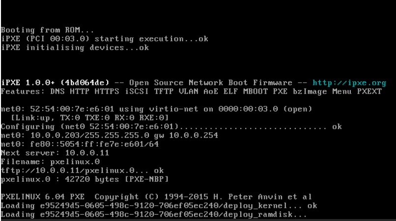

# デプロイ

## 前提条件

* ノードを[](./prepare) していること。
* [](../network/ovs_flat) を作成していること。
* flavor [](../flavor/b1_nano) を作成していること。
* イメージ [](../../installation/controller/glance) でイメージを作成していること。
* [](../sshkey/keypair.md) を作成していること。
* セキュリティグループのルール [](../security_group/icmp) を作成していること。
* セキュリティグループのルール [](../security_group/ssh) を作成していること。

## ベアメタルインスタンスの作成

```{tip}
myuser で実行
```

```{warning}
`oslo_policy` で以前のリリースの動作に戻していない場合は
resource class がなくエラーが発生するか、対象のリソースが存在しない。

> openstack allocation candidate list --resource CUSTOM_BAREMETAL=1
>> Invalid resource class in resources parameter: No such resource class CUSTOM_BAREMETAL. (HTTP 400)
```

リソースがあることを確認する。

```sh
openstack allocation candidate list --resource CUSTOM_BAREMETAL=1
```

```
+---+--------------------+--------------------------------------+-------------------------+--------------------------------------------------------------+
| # | allocation         | resource provider                    | inventory used/capacity | traits                                                       |
+---+--------------------+--------------------------------------+-------------------------+--------------------------------------------------------------+
| 1 | CUSTOM_BAREMETAL=1 | e95249d5-0605-498c-9120-706ef05ec240 | CUSTOM_BAREMETAL=0/1    | COMPUTE_IMAGE_TYPE_AMI,COMPUTE_IMAGE_TYPE_QCOW2,COMPUTE_NET_ |
|   |                    |                                      |                         | ATTACH_INTERFACE,COMPUTE_IMAGE_TYPE_RAW,COMPUTE_NODE         |
+---+--------------------+--------------------------------------+-------------------------+--------------------------------------------------------------+
```

インスタンス bare00 を作成する。

```sh
openstack server create \
    --flavor b1.nano \
    --image cirros062 \
    --nic net-id=02451125-f735-49a4-b41a-31d962d6a1c0 \
    --security-group mysecurity \
    --key-name mykey \
    bare00
```

```
+--------------------------------------+--------------------------------------------------+
| Field                                | Value                                            |
+--------------------------------------+--------------------------------------------------+
| OS-DCF:diskConfig                    | MANUAL                                           |
| OS-EXT-AZ:availability_zone          |                                                  |
| OS-EXT-SRV-ATTR:host                 | None                                             |
| OS-EXT-SRV-ATTR:hypervisor_hostname  | None                                             |
| OS-EXT-SRV-ATTR:instance_name        |                                                  |
| OS-EXT-STS:power_state               | NOSTATE                                          |
| OS-EXT-STS:task_state                | scheduling                                       |
| OS-EXT-STS:vm_state                  | building                                         |
| OS-SRV-USG:launched_at               | None                                             |
| OS-SRV-USG:terminated_at             | None                                             |
| accessIPv4                           |                                                  |
| accessIPv6                           |                                                  |
| addresses                            |                                                  |
| adminPass                            | jWP7f5BnQeWe                                     |
| config_drive                         |                                                  |
| created                              | 2024-05-19T11:57:41Z                             |
| flavor                               | b1.nano (7a123317-6326-4517-8d57-d42e09dda099)   |
| hostId                               |                                                  |
| id                                   | 5a1b1ee6-9b58-4093-9d33-17b4d038fa4d             |
| image                                | cirros062 (6793c9b2-7cb6-4796-b477-9e22d985ea2b) |
| key_name                             | mykey                                            |
| name                                 | bare00                                           |
| os-extended-volumes:volumes_attached | []                                               |
| progress                             | 0                                                |
| project_id                           | bccf406c045d401b91ba5c7552a124ae                 |
| properties                           |                                                  |
| security_groups                      | name='a81e0cba-8806-40aa-bde8-c030df1545c9'      |
| status                               | BUILD                                            |
| updated                              | 2024-05-19T11:57:41Z                             |
| user_id                              | 7f3acb28d26943bab9510df3a6edf3b0                 |
+--------------------------------------+--------------------------------------------------+
```

### イメージの配信

操作を実行すると HTTP サーバにイメージが配置される。

```sh
ls -l /httpboot/
```

```
合計 0
drwxr-xr-x  2 ironic ironic 50  5月 19 20:58 agent_images
drwxrwxr-x. 2 ironic ironic 22  5月 18 15:21 grub
```

```sh
ls -l /httpboot/agent_images/
```

```
合計 0
lrwxrwxrwx 1 ironic ironic 64  5月 19 20:58 e95249d5-0605-498c-9120-706ef05ec240 -> /var/lib/ironic/images/e95249d5-0605-498c-9120-706ef05ec240/disk
```

```sh
ls -l /var/lib/ironic/images/e95249d5-0605-498c-9120-706ef05ec240/disk
```

```
-rw-r--r-- 2 ironic ironic 117440512  5月 19 20:58 /var/lib/ironic/images/e95249d5-0605-498c-9120-706ef05ec240/disk
```

TFTP を使用してデプロイイメージで PXE ブートして、 HTTP を使用してイメージを取得しディスクに書き込む。



## ベアメタルノードの確認

`provision_state` が `active` になったことを確認する。

```sh
openstack baremetal node list
```

```
+--------------------------------------+------+--------------------------------------+-------------+--------------------+-------------+
| UUID                                 | Name | Instance UUID                        | Power State | Provisioning State | Maintenance |
+--------------------------------------+------+--------------------------------------+-------------+--------------------+-------------+
| e95249d5-0605-498c-9120-706ef05ec240 | None | 5a1b1ee6-9b58-4093-9d33-17b4d038fa4d | power on    | active             | False       |
+--------------------------------------+------+--------------------------------------+-------------+--------------------+-------------+
```

```sh
openstack baremetal node show e95249d5-0605-498c-9120-706ef05ec240
```

```
+------------------------+-------------------------------------------------------------------------------------------------------------------------------------------------------+
| Field                  | Value                                                                                                                                                 |
+------------------------+-------------------------------------------------------------------------------------------------------------------------------------------------------+
| allocation_uuid        | None                                                                                                                                                  |
| automated_clean        | None                                                                                                                                                  |
| bios_interface         | no-bios                                                                                                                                               |
| boot_interface         | pxe                                                                                                                                                   |
| boot_mode              | None                                                                                                                                                  |
| chassis_uuid           | None                                                                                                                                                  |
| clean_step             | {}                                                                                                                                                    |
| conductor              | controller.home.local                                                                                                                                 |
| conductor_group        |                                                                                                                                                       |
| console_enabled        | False                                                                                                                                                 |
| console_interface      | no-console                                                                                                                                            |
| created_at             | 2024-05-19T01:54:01+00:00                                                                                                                             |
| deploy_interface       | direct                                                                                                                                                |
| deploy_step            | {}                                                                                                                                                    |
| description            | None                                                                                                                                                  |
| driver                 | staging-libvirt                                                                                                                                       |
| driver_info            | {'libvirt_uri': 'qemu+tcp://baremetal/system', 'sasl_username': 'openstack', 'sasl_password': '******'}                                               |
| driver_internal_info   | {'clean_steps': None, 'agent_erase_devices_iterations': 1, 'agent_erase_devices_zeroize': True, 'agent_continue_if_secure_erase_failed': False,       |
|                        | 'agent_continue_if_ata_erase_failed': False, 'agent_enable_nvme_secure_erase': True, 'agent_enable_ata_secure_erase': True,                           |
|                        | 'disk_erasure_concurrency': 4, 'agent_erase_skip_read_only': False, 'last_power_state_change': '2024-05-19T12:04:54.049343', 'agent_version':         |
|                        | '9.11.1.dev1', 'agent_last_heartbeat': '2024-05-19T12:04:37.854112', 'hardware_manager_version': {'generic_hardware_manager': '1.2'},                 |
|                        | 'agent_cached_clean_steps_refreshed': '2024-05-19T02:45:21.769614', 'is_whole_disk_image': True, 'deploy_steps': None,                                |
|                        | 'agent_cached_deploy_steps_refreshed': '2024-05-19T12:04:25.157968', 'root_uuid_or_disk_id': '0x00000000'}                                            |
| extra                  | {}                                                                                                                                                    |
| fault                  | None                                                                                                                                                  |
| inspect_interface      | no-inspect                                                                                                                                            |
| inspection_finished_at | None                                                                                                                                                  |
| inspection_started_at  | None                                                                                                                                                  |
| instance_info          | {'image_source': '6793c9b2-7cb6-4796-b477-9e22d985ea2b', 'root_gb': '0', 'swap_mb': '0', 'display_name': 'bare00', 'vcpus': '1', 'nova_host_id':      |
|                        | 'controller.home.local', 'memory_mb': '256', 'local_gb': '0', 'image_type': 'whole-disk', 'image_disk_format': 'raw', 'image_checksum': None,         |
|                        | 'image_os_hash_algo': 'sha512', 'image_os_hash_value':                                                                                                |
|                        | 'dbb480bdc4f13ead7e00b62766df2815ddc8d4775af8a82ec40f8afd433d4cb95a109a58fbe7e0a661be86e0a06321c00362bc881f58c61c40bd2d1486954594', 'image_url':      |
|                        | '******', 'image_container_format': 'bare', 'image_tags': [], 'image_properties': {'virtual_size': 117440512, 'hw_video_model': 'vga', 'os_hidden':   |
|                        | False, 'stores': 'fs'}}                                                                                                                               |
| instance_uuid          | 5a1b1ee6-9b58-4093-9d33-17b4d038fa4d                                                                                                                  |
| last_error             | None                                                                                                                                                  |
| lessee                 | None                                                                                                                                                  |
| maintenance            | False                                                                                                                                                 |
| maintenance_reason     | None                                                                                                                                                  |
| management_interface   | staging-libvirt                                                                                                                                       |
| name                   | None                                                                                                                                                  |
| network_data           | {}                                                                                                                                                    |
| network_interface      | flat                                                                                                                                                  |
| owner                  | be94f4411bd74f249f5e25f642209b82                                                                                                                      |
| power_interface        | staging-libvirt                                                                                                                                       |
| power_state            | power on                                                                                                                                              |
| properties             | {'capabilities': 'boot_mode:bios'}                                                                                                                    |
| protected              | False                                                                                                                                                 |
| protected_reason       | None                                                                                                                                                  |
| provision_state        | active                                                                                                                                                |
| provision_updated_at   | 2024-05-19T12:04:55+00:00                                                                                                                             |
| raid_config            | {}                                                                                                                                                    |
| raid_interface         | no-raid                                                                                                                                               |
| rescue_interface       | no-rescue                                                                                                                                             |
| reservation            | None                                                                                                                                                  |
| resource_class         | baremetal                                                                                                                                             |
| retired                | False                                                                                                                                                 |
| retired_reason         | None                                                                                                                                                  |
| secure_boot            | None                                                                                                                                                  |
| storage_interface      | noop                                                                                                                                                  |
| target_power_state     | None                                                                                                                                                  |
| target_provision_state | None                                                                                                                                                  |
| target_raid_config     | {}                                                                                                                                                    |
| traits                 | []                                                                                                                                                    |
| updated_at             | 2024-05-19T12:04:55+00:00                                                                                                                             |
| uuid                   | e95249d5-0605-498c-9120-706ef05ec240                                                                                                                  |
| vendor_interface       | no-vendor                                                                                                                                             |
+------------------------+-------------------------------------------------------------------------------------------------------------------------------------------------------+
```

## ベアメタルインスタンスの確認

インスタンスが ACTIVE になったことを確認する。

```sh
openstack server list
```

```
+--------------------------------------+------------+---------+-----------------------+-----------+----------+
| ID                                   | Name       | Status  | Networks              | Image     | Flavor   |
+--------------------------------------+------------+---------+-----------------------+-----------+----------+
| 5a1b1ee6-9b58-4093-9d33-17b4d038fa4d | bare00     | ACTIVE  | mgmt=10.0.0.208       | cirros062 | b1.nano  |
+--------------------------------------+------------+---------+-----------------------+-----------+----------+
```

```sh
openstack server show 5a1b1ee6-9b58-4093-9d33-17b4d038fa4d
```

```
+-------------------------------------+------------------------------------------------------------------------------------------------------------------------------------------+
| Field                               | Value                                                                                                                                    |
+-------------------------------------+------------------------------------------------------------------------------------------------------------------------------------------+
| OS-DCF:diskConfig                   | MANUAL                                                                                                                                   |
| OS-EXT-AZ:availability_zone         | nova                                                                                                                                     |
| OS-EXT-SRV-ATTR:host                | controller.home.local                                                                                                                    |
| OS-EXT-SRV-ATTR:hostname            | bare00                                                                                                                                   |
| OS-EXT-SRV-ATTR:hypervisor_hostname | e95249d5-0605-498c-9120-706ef05ec240                                                                                                     |
| OS-EXT-SRV-ATTR:instance_name       | instance-0000000f                                                                                                                        |
| OS-EXT-SRV-ATTR:kernel_id           |                                                                                                                                          |
| OS-EXT-SRV-ATTR:launch_index        | 0                                                                                                                                        |
| OS-EXT-SRV-ATTR:ramdisk_id          |                                                                                                                                          |
| OS-EXT-SRV-ATTR:reservation_id      | r-c25j7m0d                                                                                                                               |
| OS-EXT-SRV-ATTR:root_device_name    | /dev/sda                                                                                                                                 |
| OS-EXT-SRV-ATTR:user_data           | None                                                                                                                                     |
| OS-EXT-STS:power_state              | Running                                                                                                                                  |
| OS-EXT-STS:task_state               | None                                                                                                                                     |
| OS-EXT-STS:vm_state                 | active                                                                                                                                   |
| OS-SRV-USG:launched_at              | 2024-05-19T12:04:56.000000                                                                                                               |
| OS-SRV-USG:terminated_at            | None                                                                                                                                     |
| accessIPv4                          |                                                                                                                                          |
| accessIPv6                          |                                                                                                                                          |
| addresses                           | mgmt=10.0.0.208                                                                                                                          |
| config_drive                        |                                                                                                                                          |
| created                             | 2024-05-19T11:57:41Z                                                                                                                     |
| description                         | bare00                                                                                                                                   |
| flavor                              | description=, disk='0', ephemeral='0', extra_specs.resources:CUSTOM_BAREMETAL='1', extra_specs.resources:DISK_GB='0',                    |
|                                     | extra_specs.resources:MEMORY_MB='0', extra_specs.resources:VCPU='0', id='b1.nano', is_disabled=, is_public='True', location=,            |
|                                     | name='b1.nano', original_name='b1.nano', ram='256', rxtx_factor=, swap='0', vcpus='1'                                                    |
| hostId                              | 2450d74753742a20d6dcd445694bec80d8fe4cffc7ab8ff56898bbce                                                                                 |
| host_status                         | UP                                                                                                                                       |
| id                                  | 5a1b1ee6-9b58-4093-9d33-17b4d038fa4d                                                                                                     |
| image                               | cirros062 (6793c9b2-7cb6-4796-b477-9e22d985ea2b)                                                                                         |
| key_name                            | mykey                                                                                                                                    |
| locked                              | False                                                                                                                                    |
| locked_reason                       | None                                                                                                                                     |
| name                                | bare00                                                                                                                                   |
| progress                            | 0                                                                                                                                        |
| project_id                          | bccf406c045d401b91ba5c7552a124ae                                                                                                         |
| properties                          |                                                                                                                                          |
| security_groups                     | name='mysecurity'                                                                                                                        |
| server_groups                       | []                                                                                                                                       |
| status                              | ACTIVE                                                                                                                                   |
| tags                                |                                                                                                                                          |
| trusted_image_certificates          | None                                                                                                                                     |
| updated                             | 2024-05-19T12:04:57Z                                                                                                                     |
| user_id                             | 7f3acb28d26943bab9510df3a6edf3b0                                                                                                         |
| volumes_attached                    |                                                                                                                                          |
+-------------------------------------+------------------------------------------------------------------------------------------------------------------------------------------+
```

## ポートの確認

ポートを確認する。

```sh
openstack port show 19c14411-bb87-45b3-9281-df0bade823b2
```

```{note}
ベアメタルネットワークを設定していないため `binding_vif_type` は `binding_failed` になる。
https://docs.openstack.org/ironic/latest/install/configure-networking.html
```

```
+-------------------------+---------------------------------------------------------------------------+
| Field                   | Value                                                                     |
+-------------------------+---------------------------------------------------------------------------+
| admin_state_up          | UP                                                                        |
| allowed_address_pairs   |                                                                           |
| binding_host_id         | e95249d5-0605-498c-9120-706ef05ec240                                      |
| binding_profile         |                                                                           |
| binding_vif_details     |                                                                           |
| binding_vif_type        | binding_failed                                                            |
| binding_vnic_type       | baremetal                                                                 |
| created_at              | 2024-05-19T11:57:44Z                                                      |
| data_plane_status       | None                                                                      |
| description             |                                                                           |
| device_id               | 5a1b1ee6-9b58-4093-9d33-17b4d038fa4d                                      |
| device_owner            | compute:nova                                                              |
| device_profile          | None                                                                      |
| dns_assignment          | None                                                                      |
| dns_domain              | None                                                                      |
| dns_name                | None                                                                      |
| extra_dhcp_opts         | ip_version='4', opt_name='150', opt_value='10.0.0.11'                     |
|                         | ip_version='4', opt_name='66', opt_value='10.0.0.11'                      |
|                         | ip_version='4', opt_name='255', opt_value='10.0.0.11'                     |
|                         | ip_version='4', opt_name='67', opt_value='pxelinux.0'                     |
| fixed_ips               | ip_address='10.0.0.208', subnet_id='5deef64c-3b13-40a0-a952-68fb0faa58c8' |
| hardware_offload_type   | None                                                                      |
| hints                   |                                                                           |
| id                      | 19c14411-bb87-45b3-9281-df0bade823b2                                      |
| ip_allocation           | None                                                                      |
| mac_address             | 52:54:00:7e:e6:01                                                         |
| name                    |                                                                           |
| network_id              | 02451125-f735-49a4-b41a-31d962d6a1c0                                      |
| numa_affinity_policy    | None                                                                      |
| port_security_enabled   | True                                                                      |
| project_id              | bccf406c045d401b91ba5c7552a124ae                                          |
| propagate_uplink_status | None                                                                      |
| resource_request        | None                                                                      |
| revision_number         | 13                                                                        |
| qos_network_policy_id   | None                                                                      |
| qos_policy_id           | None                                                                      |
| security_group_ids      | a81e0cba-8806-40aa-bde8-c030df1545c9                                      |
| status                  | DOWN                                                                      |
| tags                    |                                                                           |
| trunk_details           | None                                                                      |
| updated_at              | 2024-05-19T12:04:53Z                                                      |
+-------------------------+---------------------------------------------------------------------------+
```

## 環境の確認

### dnsmasq

DHCP で IP アドレスが払い出されている。

```sh
cat /var/lib/neutron/dhcp/02451125-f735-49a4-b41a-31d962d6a1c0/leases
```

```
1716206730 52:54:00:7e:e6:01 10.0.0.208 host-10-0-0-208 01:52:54:00:7e:e6:01
```

DHCP に MAC アドレスと IP アドレスの関連が追加される。

```sh
cat /var/lib/neutron/dhcp/02451125-f735-49a4-b41a-31d962d6a1c0/host
```

```
52:54:00:7e:e6:01,host-10-0-0-208.openstacklocal,10.0.0.208,set:port-19c14411-bb87-45b3-9281-df0bade823b2
```

DNS のエントリが追加される。

```sh
cat /var/lib/neutron/dhcp/02451125-f735-49a4-b41a-31d962d6a1c0/addn_hosts
```

```
10.0.0.208      host-10-0-0-208.openstacklocal host-10-0-0-208
```

### ネットワーク

イーサネットの情報を確認する。

```sh
ssh -i demo_rsa cirros@10.0.0.208 /sbin/ip addr show
```

```
1: lo: <LOOPBACK,UP,LOWER_UP> mtu 65536 qdisc noqueue qlen 1000
    link/loopback 00:00:00:00:00:00 brd 00:00:00:00:00:00
    inet 127.0.0.1/8 scope host lo
       valid_lft forever preferred_lft forever
    inet6 ::1/128 scope host
       valid_lft forever preferred_lft forever
2: eth0: <BROADCAST,MULTICAST,UP,LOWER_UP> mtu 1500 qdisc pfifo_fast qlen 1000
    link/ether 52:54:00:7e:e6:01 brd ff:ff:ff:ff:ff:ff
    inet 10.0.0.208/24 brd 10.0.0.255 scope global dynamic noprefixroute eth0
       valid_lft 86048sec preferred_lft 75248sec
    inet6 fe80::5054:ff:fe7e:e601/64 scope link
       valid_lft forever preferred_lft forever
```

ルーティングを確認する。

```sh
ssh -i demo_rsa cirros@10.0.0.208 /sbin/ip route
```

```
default via 10.0.0.254 dev eth0  src 10.0.0.208  metric 1002
10.0.0.0/24 dev eth0 scope link  src 10.0.0.208  metric 1002
169.254.169.254 via 10.0.0.200 dev eth0  src 10.0.0.208  metric 1002
```

ホスト名を確認する。

```sh
ssh -i demo_rsa cirros@10.0.0.208 hostname
```

```
bare00
```
