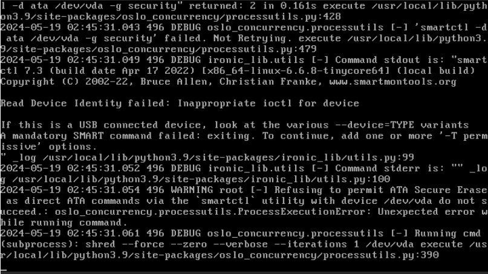

# 準備

## 管理状態に変更

ノードを管理状態にする。

```sh
openstack baremetal node manage 803559b8-3a5b-4e80-b23d-7bd99fbbc5da
```

`provision_state` が `manageable` になったことを確認する。

```sh
openstack baremetal node show 803559b8-3a5b-4e80-b23d-7bd99fbbc5da
```

```
+------------------------+---------------------------------------------------------------------------------------------------------+
| Field                  | Value                                                                                                   |
+------------------------+---------------------------------------------------------------------------------------------------------+
| allocation_uuid        | None                                                                                                    |
| automated_clean        | None                                                                                                    |
| bios_interface         | no-bios                                                                                                 |
| boot_interface         | pxe                                                                                                     |
| boot_mode              | None                                                                                                    |
| chassis_uuid           | None                                                                                                    |
| clean_step             | {}                                                                                                      |
| conductor              | controller.home.local                                                                                   |
| conductor_group        |                                                                                                         |
| console_enabled        | False                                                                                                   |
| console_interface      | no-console                                                                                              |
| created_at             | 2024-04-30T23:22:23+00:00                                                                               |
| deploy_interface       | ramdisk                                                                                                 |
| deploy_step            | {}                                                                                                      |
| description            | None                                                                                                    |
| driver                 | staging-libvirt                                                                                         |
| driver_info            | {'libvirt_uri': 'qemu+tcp://baremetal/system', 'sasl_username': 'openstack', 'sasl_password': '******'} |
| driver_internal_info   | {}                                                                                                      |
| extra                  | {}                                                                                                      |
| fault                  | None                                                                                                    |
| inspect_interface      | no-inspect                                                                                              |
| inspection_finished_at | None                                                                                                    |
| inspection_started_at  | None                                                                                                    |
| instance_info          | {}                                                                                                      |
| instance_uuid          | None                                                                                                    |
| last_error             | None                                                                                                    |
| lessee                 | None                                                                                                    |
| maintenance            | False                                                                                                   |
| maintenance_reason     | None                                                                                                    |
| management_interface   | staging-libvirt                                                                                         |
| name                   | None                                                                                                    |
| network_data           | {}                                                                                                      |
| network_interface      | flat                                                                                                    |
| owner                  | None                                                                                                    |
| power_interface        | staging-libvirt                                                                                         |
| power_state            | power off                                                                                               |
| properties             | {'capabilities': 'boot_mode:bios'}                                                                      |
| protected              | False                                                                                                   |
| protected_reason       | None                                                                                                    |
| provision_state        | manageable                                                                                              |
| provision_updated_at   | 2024-05-01T00:56:21+00:00                                                                               |
| raid_config            | {}                                                                                                      |
| raid_interface         | no-raid                                                                                                 |
| rescue_interface       | no-rescue                                                                                               |
| reservation            | None                                                                                                    |
| resource_class         | baremetal                                                                                               |
| retired                | False                                                                                                   |
| retired_reason         | None                                                                                                    |
| secure_boot            | None                                                                                                    |
| storage_interface      | noop                                                                                                    |
| target_power_state     | None                                                                                                    |
| target_provision_state | None                                                                                                    |
| target_raid_config     | {}                                                                                                      |
| traits                 | []                                                                                                      |
| updated_at             | 2024-05-01T00:56:22+00:00                                                                               |
| uuid                   | 803559b8-3a5b-4e80-b23d-7bd99fbbc5da                                                                    |
| vendor_interface       | no-vendor                                                                                               |
+------------------------+---------------------------------------------------------------------------------------------------------+
```

## 利用可能状態に変更

ノードを利用可能状態にする。

```sh
openstack baremetal node provide 803559b8-3a5b-4e80-b23d-7bd99fbbc5da
```

PXE ブートして cleaning が開始される。

```sh
openstack baremetal node list
```

```
+--------------------------------------+------+---------------+-------------+--------------------+-------------+
| UUID                                 | Name | Instance UUID | Power State | Provisioning State | Maintenance |
+--------------------------------------+------+---------------+-------------+--------------------+-------------+
| 803559b8-3a5b-4e80-b23d-7bd99fbbc5da | None | None          | power on    | clean wait         | False       |
+--------------------------------------+------+---------------+-------------+--------------------+-------------+
```


セキュア消去に対応していないので `shred` で消去する。



cleaning が完了すると自動的にシャットダウンする。

```sh
openstack baremetal node list
```

```
+--------------------------------------+------+---------------+-------------+--------------------+-------------+
| UUID                                 | Name | Instance UUID | Power State | Provisioning State | Maintenance |
+--------------------------------------+------+---------------+-------------+--------------------+-------------+
| 803559b8-3a5b-4e80-b23d-7bd99fbbc5da | None | None          | power off   | available          | False       |
+--------------------------------------+------+---------------+-------------+--------------------+-------------+
```

`provision_state` が `available` になったことを確認する。

```sh
openstack baremetal node show 803559b8-3a5b-4e80-b23d-7bd99fbbc5da
```

```
+------------------------+----------------------------------------------------------------------------------------------------------------------------------------------------------------------------------------------------------------------------------------------------------------------------------------------------------------------------------------------------------------------------------------------------------------------------------------------------------------------------------------------------------------------------------------------------------------------------------------------------------------------------------------------------+
| Field                  | Value                                                                                                                                                                                                                                                                                                                                                                                                                                                                                                                                                                                                                                              |
+------------------------+----------------------------------------------------------------------------------------------------------------------------------------------------------------------------------------------------------------------------------------------------------------------------------------------------------------------------------------------------------------------------------------------------------------------------------------------------------------------------------------------------------------------------------------------------------------------------------------------------------------------------------------------------+
| allocation_uuid        | None                                                                                                                                                                                                                                                                                                                                                                                                                                                                                                                                                                                                                                               |
| automated_clean        | None                                                                                                                                                                                                                                                                                                                                                                                                                                                                                                                                                                                                                                               |
| bios_interface         | no-bios                                                                                                                                                                                                                                                                                                                                                                                                                                                                                                                                                                                                                                            |
| boot_interface         | pxe                                                                                                                                                                                                                                                                                                                                                                                                                                                                                                                                                                                                                                                |
| boot_mode              | None                                                                                                                                                                                                                                                                                                                                                                                                                                                                                                                                                                                                                                               |
| chassis_uuid           | None                                                                                                                                                                                                                                                                                                                                                                                                                                                                                                                                                                                                                                               |
| clean_step             | {}                                                                                                                                                                                                                                                                                                                                                                                                                                                                                                                                                                                                                                                 |
| conductor              | controller.home.local                                                                                                                                                                                                                                                                                                                                                                                                                                                                                                                                                                                                                              |
| conductor_group        |                                                                                                                                                                                                                                                                                                                                                                                                                                                                                                                                                                                                                                                    |
| console_enabled        | False                                                                                                                                                                                                                                                                                                                                                                                                                                                                                                                                                                                                                                              |
| console_interface      | no-console                                                                                                                                                                                                                                                                                                                                                                                                                                                                                                                                                                                                                                         |
| created_at             | 2024-04-30T23:22:23+00:00                                                                                                                                                                                                                                                                                                                                                                                                                                                                                                                                                                                                                          |
| deploy_interface       | ramdisk                                                                                                                                                                                                                                                                                                                                                                                                                                                                                                                                                                                                                                            |
| deploy_step            | {}                                                                                                                                                                                                                                                                                                                                                                                                                                                                                                                                                                                                                                                 |
| description            | None                                                                                                                                                                                                                                                                                                                                                                                                                                                                                                                                                                                                                                               |
| driver                 | staging-libvirt                                                                                                                                                                                                                                                                                                                                                                                                                                                                                                                                                                                                                                    |
| driver_info            | {'libvirt_uri': 'qemu+tcp://baremetal/system', 'sasl_username': 'openstack', 'sasl_password': '******'}                                                                                                                                                                                                                                                                                                                                                                                                                                                                                                                                            |
| driver_internal_info   | {'clean_steps': None, 'agent_erase_devices_iterations': 1, 'agent_erase_devices_zeroize': True, 'agent_continue_if_secure_erase_failed': False, 'agent_continue_if_ata_erase_ed': False, 'agent_enable_nvme_secure_erase': True, 'agent_enable_ata_secure_erase': True, 'disk_erasure_concurrency': 1, 'agent_erase_skip_read_only': False, 'deploy_boot_mode': 'uefi', 'last_power_s_change': '2024-05-02T00:19:25.102166', 'agent_version': '8.5.3.dev1', 'agent_last_heartbeat': '2024-05-02T00:19:24.180271', 'hardware_manager_version': {'generic_hardware_manager': '1.1'}, 'agent_cacclean_steps_refreshed': '2024-05-02T00:11:05.542035'} |
| extra                  | {}                                                                                                                                                                                                                                                                                                                                                                                                                                                                                                                                                                                                                                                 |
| fault                  | None                                                                                                                                                                                                                                                                                                                                                                                                                                                                                                                                                                                                                                               |
| inspect_interface      | no-inspect                                                                                                                                                                                                                                                                                                                                                                                                                                                                                                                                                                                                                                         |
| inspection_finished_at | None                                                                                                                                                                                                                                                                                                                                                                                                                                                                                                                                                                                                                                               |
| inspection_started_at  | None                                                                                                                                                                                                                                                                                                                                                                                                                                                                                                                                                                                                                                               |
| instance_info          | {}                                                                                                                                                                                                                                                                                                                                                                                                                                                                                                                                                                                                                                                 |
| instance_uuid          | None                                                                                                                                                                                                                                                                                                                                                                                                                                                                                                                                                                                                                                               |
| last_error             | None                                                                                                                                                                                                                                                                                                                                                                                                                                                                                                                                                                                                                                               |
| lessee                 | None                                                                                                                                                                                                                                                                                                                                                                                                                                                                                                                                                                                                                                               |
| maintenance            | False                                                                                                                                                                                                                                                                                                                                                                                                                                                                                                                                                                                                                                              |
| maintenance_reason     | None                                                                                                                                                                                                                                                                                                                                                                                                                                                                                                                                                                                                                                               |
| management_interface   | staging-libvirt                                                                                                                                                                                                                                                                                                                                                                                                                                                                                                                                                                                                                                    |
| name                   | None                                                                                                                                                                                                                                                                                                                                                                                                                                                                                                                                                                                                                                               |
| network_data           | {}                                                                                                                                                                                                                                                                                                                                                                                                                                                                                                                                                                                                                                                 |
| network_interface      | flat                                                                                                                                                                                                                                                                                                                                                                                                                                                                                                                                                                                                                                               |
| owner                  | None                                                                                                                                                                                                                                                                                                                                                                                                                                                                                                                                                                                                                                               |
| power_interface        | staging-libvirt                                                                                                                                                                                                                                                                                                                                                                                                                                                                                                                                                                                                                                    |
| power_state            | power off                                                                                                                                                                                                                                                                                                                                                                                                                                                                                                                                                                                                                                          |
| properties             | {'capabilities': 'boot_mode:bios'}                                                                                                                                                                                                                                                                                                                                                                                                                                                                                                                                                                                                                 |
| protected              | False                                                                                                                                                                                                                                                                                                                                                                                                                                                                                                                                                                                                                                              |
| protected_reason       | None                                                                                                                                                                                                                                                                                                                                                                                                                                                                                                                                                                                                                                               |
| provision_state        | available                                                                                                                                                                                                                                                                                                                                                                                                                                                                                                                                                                                                                                          |
| provision_updated_at   | 2024-05-02T00:19:28+00:00                                                                                                                                                                                                                                                                                                                                                                                                                                                                                                                                                                                                                          |
| raid_config            | {}                                                                                                                                                                                                                                                                                                                                                                                                                                                                                                                                                                                                                                                 |
| raid_interface         | no-raid                                                                                                                                                                                                                                                                                                                                                                                                                                                                                                                                                                                                                                            |
| rescue_interface       | no-rescue                                                                                                                                                                                                                                                                                                                                                                                                                                                                                                                                                                                                                                          |
| reservation            | None                                                                                                                                                                                                                                                                                                                                                                                                                                                                                                                                                                                                                                               |
| resource_class         | baremetal                                                                                                                                                                                                                                                                                                                                                                                                                                                                                                                                                                                                                                        |
| retired                | False                                                                                                                                                                                                                                                                                                                                                                                                                                                                                                                                                                                                                                              |
| retired_reason         | None                                                                                                                                                                                                                                                                                                                                                                                                                                                                                                                                                                                                                                               |
| secure_boot            | None                                                                                                                                                                                                                                                                                                                                                                                                                                                                                                                                                                                                                                               |
| storage_interface      | noop                                                                                                                                                                                                                                                                                                                                                                                                                                                                                                                                                                                                                                               |
| target_power_state     | None                                                                                                                                                                                                                                                                                                                                                                                                                                                                                                                                                                                                                                               |
| target_provision_state | None                                                                                                                                                                                                                                                                                                                                                                                                                                                                                                                                                                                                                                               |
| target_raid_config     | {}                                                                                                                                                                                                                                                                                                                                                                                                                                                                                                                                                                                                                                                 |
| traits                 | []                                                                                                                                                                                                                                                                                                                                                                                                                                                                                                                                                                                                                                                 |
| updated_at             | 2024-05-02T00:19:28+00:00                                                                                                                                                                                                                                                                                                                                                                                                                                                                                                                                                                                                                          |
| uuid                   | 803559b8-3a5b-4e80-b23d-7bd99fbbc5da                                                                                                                                                                                                                                                                                                                                                                                                                                                                                                                                                                                                               |
| vendor_interface       | no-vendor                                                                                                                                                                                                                                                                                                                                                                                                                                                                                                                                                                                                                                          |
+------------------------+----------------------------------------------------------------------------------------------------------------------------------------------------------------------------------------------------------------------------------------------------------------------------------------------------------------------------------------------------------------------------------------------------------------------------------------------------------------------------------------------------------------------------------------------------------------------------------------------------------------------------------------------------+
```

### cleaning の動作

デプロイイメージを使用してディスクを消去する。

操作を実行すると TFTP サーバに PXE ブートに必要なファイルが配置される。

```sh
ls -l /tftpboot
```

```
合計 1220

(...)

lrwxrwxrwx. 1 ironic ironic     43  5月  2 08:55 52:54:00:84:f8:75.conf -> 803559b8-3a5b-4e80-b23d-7bd99fbbc5da/config
drwxr-xr-x. 2 ironic ironic     63  5月  2 08:55 803559b8-3a5b-4e80-b23d-7bd99fbbc5da
drwxr-xr-x. 2 ironic ironic     22  4月 30 20:47 grub
lrwxrwxrwx. 1 ironic ironic     43  5月  2 08:55 grub.cfg-01-52-54-00-84-f8-75 -> 803559b8-3a5b-4e80-b23d-7bd99fbbc5da/config
```

```sh
ls -l /tftpboot/803559b8-3a5b-4e80-b23d-7bd99fbbc5da/
```

```
合計 80376
-rw-r--r--. 1 ironic ironic     1336  5月  2 08:55 config
-rw-r--r--. 2 ironic ironic  5521344  5月  1 10:28 deploy_kernel
-rw-r--r--. 2 ironic ironic 76779172  5月  1 10:28 deploy_ramdisk
```

```sh
cat /tftpboot/803559b8-3a5b-4e80-b23d-7bd99fbbc5da/config
```

```
default deploy

label deploy
kernel 803559b8-3a5b-4e80-b23d-7bd99fbbc5da/deploy_kernel
append initrd=803559b8-3a5b-4e80-b23d-7bd99fbbc5da/deploy_ramdisk selinux=0 troubleshoot=0 text nofb nomodeset vga=normal ipa-debug=1 ipa-api-url=http://controller:6385 ipa-global-request-id=req-74333ce9-0f1f-4f09-a2d8-9fff4daea14f
ipappend 2


label boot_partition
kernel no_kernel
append initrd=no_ramdisk root={{ ROOT }} ro text nofb nomodeset vga=normal ipa-debug=1 ipa-api-url=http://controller:6385 ipa-global-request-id=req-74333ce9-0f1f-4f09-a2d8-9fff4daea14f


label boot_whole_disk
COM32 chain.c32
append mbr:{{ DISK_IDENTIFIER }}

label trusted_boot
kernel mboot
append tboot.gz --- no_kernel root={{ ROOT }} ro text nofb nomodeset vga=normal ipa-debug=1 ipa-api-url=http://controller:6385 ipa-global-request-id=req-74333ce9-0f1f-4f09-a2d8-9fff4daea14f intel_iommu=on --- no_ramdisk

label boot_ramdisk
kernel no_kernel
append initrd=no_ramdisk root=/dev/ram0 text nofb nomodeset vga=normal ipa-debug=1 ipa-api-url=http://controller:6385 ipa-global-request-id=req-74333ce9-0f1f-4f09-a2d8-9fff4daea14f

label boot_anaconda
kernel no_kernel
append initrd=no_ramdisk text nofb nomodeset vga=normal ipa-debug=1 ipa-api-url=http://controller:6385 ipa-global-request-id=req-74333ce9-0f1f-4f09-a2d8-9fff4daea14f inst.ks= inst.stage2=
ipappend 2
```
