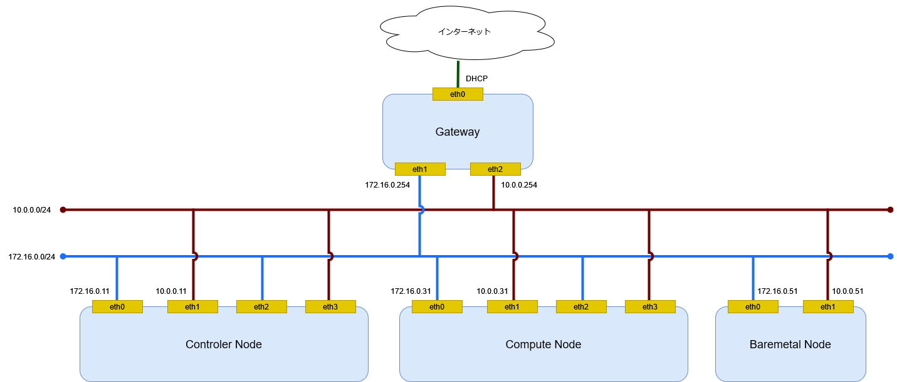
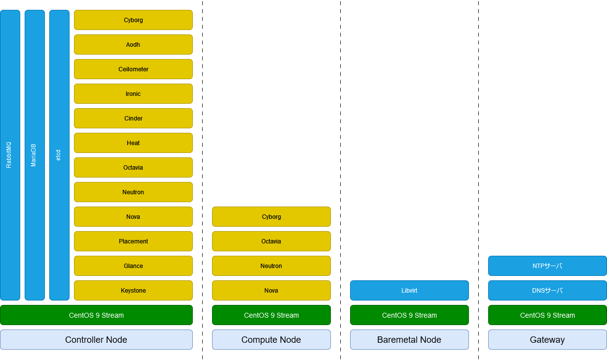

# 環境

## 構成図

ネットワーク構成図を記載する。

## ハードウェア構成

ハードウェア構成を記載する。

|          | Controller Node | Computer Node | Baremetal Node | Gateway |
| -------- | --------------- | ------------- | -------------- | ------- |
| CPU 数   | 2               | 1             | 1              | 1       |
| メモリ   | 12GiB           | 4Gib          | 4GiB           | 2GiB    |
| ディスク | 128GiB          | 64Gib         | 64GiB          | 16GiB   |

## ソフトウェア構成図

ソフトウェア構成を記載する。

